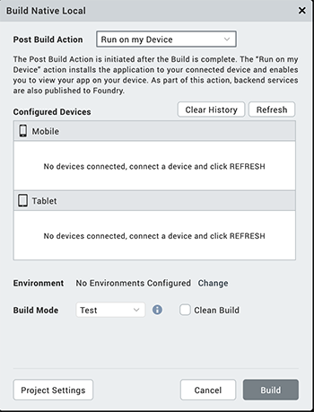
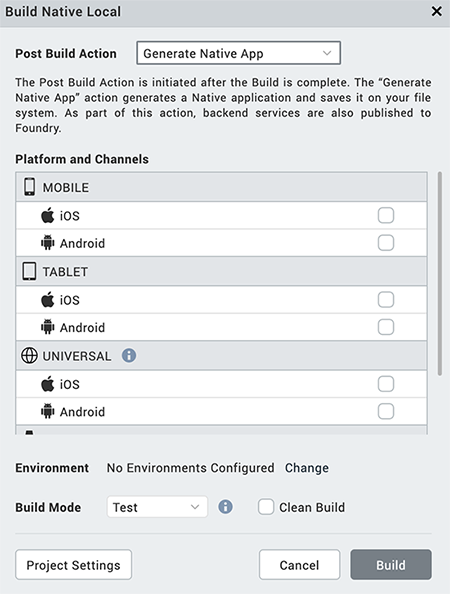
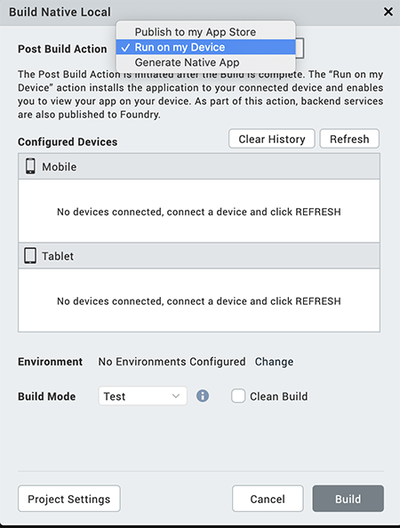
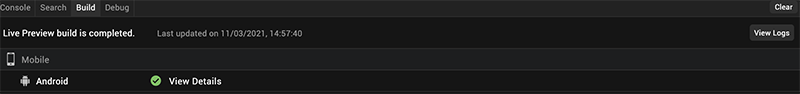

                         

Customize Volt MX App
=====================

Overview
--------

The **Customize Volt MX App** feature is used to install the Volt MX App onto your device. The Volt MX App enables you to utilize and manage a set of capabilities related to Volt MX Iris and Volt MX Foundry services offered as part of Volt MX Volt MX.

To preview an app that uses NFIs, you must provide certificates and signing keys used to generate the binary of the app. The NFIs are packaged with the app binary and built on the Volt MX Cloud. You can use the generated app binary to install and run your app on a device.

If your app does not use NFIs, a QR code to download the Volt MX App appears on the canvas.

Volt MX  Iris supports cloud builds of the application for the selected platforms and performs the selected Post Build Action. There are two types of Post Build Actions:

*   [Run on my Device](#run-on-my-device) – This action installs the application to your connected device and enables you to view your app on your device
*   [Generate Native App](#generate-native-app) – This action generates the binaries and build logs for your Native application and saves it on your file system

Prerequisites
-------------

**Following are the prerequisites to generate a customized Volt MX App within Volt MX Iris**:

*   Access to a Volt MX Cloud account. If you do not have a cloud account, you can register for it at [VoltMX Cloud Registration](https://manage.hclvoltmx.com/registration).
*   Access to a Volt MX Cloud Build Environment. By default, new users get access to the Cloud build environment. Existing users need to request for access.

*   Configure the various Project Settings.  
    Go to **Project** > **Settings** and configure the build settings for each Native platform. For more information on Project Settings, click [here](Project_Properties_In_Iris_Starter.md#project-settings-in).
*   Platform specific prerequisites:
    *   If you choose to build an application for the **iOS** platform, you must provide the Mobile Provision, .P12, P12 password, and the Development method. To do so, go to Project Settings > Native > iPhone/iPad. For more details on the iOS configurations, click [here](https://support.hcltechsw.com/csm?id=kb_article&sysparm_article=KB0083760).
    *   If choose to build an application for the **Android** platform, then the Android signing details are mandatory. To do so, go to Project Settings > Native > Android Mobile/Tablet. For more details on Android signing details, click [here](https://support.hcltechsw.com/csm?id=kb_article&sysparm_article=KB0083782).

Post Build Actions
------------------

The Post Build Action is initiated after the Build is complete. You must choose the Post Build Action in the [Customize Volt MX App](#customize-volt-mx-app) window, before the build process begins. There are two types of Post Build Actions, they include:

1.  [Run on my device](#run-on-my-device)
2.  [Generate Native App](#generate-native-app)

### Run on my device

The Run on my Device action installs the application to your connected device and enables you to view your app on your device.

Establish a USB connection between the computer that built the app, and your device.

> **_Important:_** **USB Tethering for iOS devices on Windows Machine:**  
**Prerequisites** - Ensure the latest version of iTunes is installed on the Windows machine. Before you start viewing the app on your iOS device by using the USB feature on Volt MX App, open iTunes on your Windows machine.

If you connect your device to the system after selecting the post build action, use the **Refresh** option to refresh the list of available devices that are connected to the system.

Use the **Clear History** option to clear out old entries of devices that are not connected to the system.

Once the post build action is completed, by default Android devices launch the app. Whereas, for iOS devices you need to explicitly launch the app by tapping on the app icon.

### Generate Native App

The Generate Native App action generates the binaries and build logs for your Native application and saves it on your file system. The Iris project does not have to be linked to Volt MX Foundry to complete this action.

Once the build is completed,

*   If you have successfully built your Iris project for the Android channel, you will get Android mobile and/or tablet native APKs in your project's Volt MX Iris workspace > binaries folder.
*   If you have successfully built your Iris project for the iOS channel, you will get iOS mobile and/or tablet native IPAs in your project's Volt MX Iris workspace > binaries folder.
*   You will also get the build logs in your project's Volt MX Iris workspace > binaries folder. You can refer to the logs to analyze the build for failures or success.

Alternatively, once the build is complete, you will get notified by an email from **VoltMX Iris – Build Service**, with download links for all the generated binaries.

You can generate native apps even for the Universal channel by selecting a platform from the Universal section. This generates the APK or IPA for each of the platforms and channels selected.

To understand any build failures, you can go through the log file. To understand Run and Publish actions related to this type of Build, go to [Post Successful Build](#post-successful-build).

Customize Volt MX App
---------------------

To build an application, follow these steps:

1.  On your Volt MX Iris, from the main menu, select **Build**.
2.  From the context menu, select **Customize Volt MX App**.  
    The **Build Volt MX App** dialog box appears.
3.  Select the platforms and channels for which you want to build the application.  
    Ensure you have unselected the check boxes for all the other platforms and channels.
4.  From the **Post Build Action** drop-down list, select the desired **Post Build Action**. For more details about the Post Build Action, click [here](#post-build-actions).  
    
5.  Click **Build**.
    *   If your app does not use NFIs, a QR code to download the Volt MX App appears on the canvas. Scan the QR code to download and install the Volt MX App to preview your app.
    *   If you app uses NFIs, the build generation begins. You can check the status of your build in the Build tab. If there are any errors, they appear in the Build tab. Switch to the Console tab to view a detailed log of the errors.  
        You can check the status of your build in the Build tab. It undergoes various actions, like Project compression, uploading the compressed project to the cloud, and then the actual build begins. This process may take some time. If there are any errors, they appear in the Build tab.
6.  From the Build tab, click **View logs** to open the build logs for the build service on your system.

Post Successful Build
---------------------

Once the build is completed, the generated binaries with the download link are provided in the Build tab.

1.  Click on the binaries to open them in your default web browser.
2.  Click **Run** to run the app on your local device. If your post build action is already selected as Run on my Device, then the Run option is not enabled and there is no need to explicitly run the app again.
3.  Click **View Logs** to view the build related logs.

Alternatively, once the build is complete, you will get notified by an email from **VoltMX Iris – Build Service**, with download links for all the successfully built app binaries. The mail contains details related to the Build. It contains the Project name, Build Action Triggered by, Date of Build, Build duration details. The Build Information section contains details about the Channels for which the App has been built.

*   If you have successfully built your Iris project for the Android channel, you will get Android mobile and/or tablet native APKs link in the mail.
*   If you have successfully built your Iris project for the iOS channel, you will get iOS mobile and/or tablet native IPAs link in the mail. The mail will also contain the OTA (plist) link, through which you can directly install the app on your device.
*   You will also get the build logs. You can refer to the logs to analyze the build for failures or success.

> **_Note:_** The artifact links will be available only for 24 hours.

Limitations
-----------

*   Apps that use Cordova plugins (or have Cordova enabled) are not supported.
*   On the Android platform, apps that use push notifications are not supported.
*   On the iOS platform, apps that use the universal links feature are not supported.
