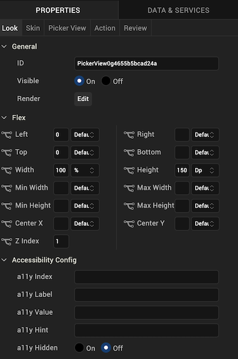
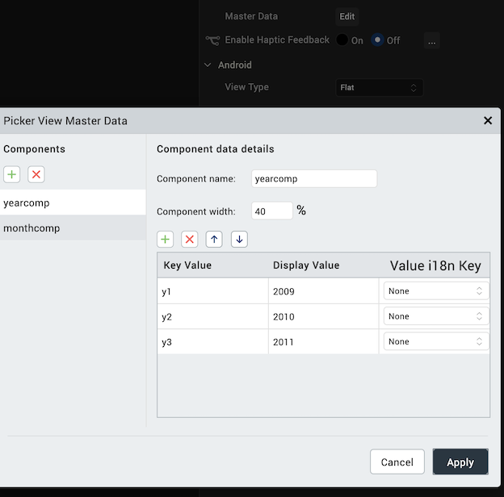
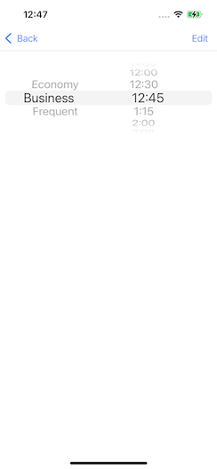

                           

PickerView
----------

Use a PickerView widget to enable a user to select a single combination of values from multiple sets of values. A user rotates through each set of values with a selection indicator. For example, a user can select a single date from lists of months, days of the month, and years.

To learn how to use this widget programmatically, refer [VoltMX Iris Widget guide](../../../Iris/iris_widget_prog_guide/Content/PickerView.md).

> **_Note:_** The PickerView widget is not available on SPA platforms.

### Look Properties

Look properties define the appearance of the widget. The following are the major properties you can set:

*   Whether the widget is visible.
*   The platforms on which the widget is rendered.
*   How the widget aligns with its parent widget and neighboring widgets.
*   If the widget displays content, where the content appears.

For descriptions of the properties available on the Look tab of the Properties pane, see [Look](Look.md#Flex).

### Skin Properties

Skin properties define a skin for the widget, including background color, borders, and shadows. If the widget includes text, you can also specify the text font.

For the PickerView widget, you can apply a skin and its associated properties for the following states:

  
| Skin | Definition |
| --- | --- |
| Normal | The default skin of the widget. |
| Focus | The skin applied when the widget has the focus. |

For more information about applying skins, see [Understanding Skins and Themes](Customizing_the_Look_and_Feel_with_Skins.md).

### PickerView Properties

PickerView properties specify properties that are available on any platform supported by Volt MX Iris, and assign platform-specific properties.

#### Master Data

Specifies the values displayed in the PickerView widget.

To specify values, click the **Edit** button to open the **PickerView Master Data** dialog box.

Specify key and display values for each component in the PickerView. Each component represents a set of data; for example, years and months. You can add a component or a key/value pair by clicking the appropriate **+** button.

> **_Note:_** The combined component width should total 100 percent.

#### View Type

For the Android platform, specifies the picker view type.

Default: Flat

The following are the options:

*   Flat: The picker appearance is flat.
*   Wheel: The picker displays as a wheel.

#### Enable Cache

For the Windows 8 platform, specifies whether data is cached relative to the PickerView widget.

Default: Off

### Actions

Actions define what happens when an event occurs. On a PickerView widget, you can run an action when the following event occurs:

*   onSelection: The action is triggered when the component selection changes.
*   onTouchStart: The action is triggered when the user touches the touch surface. This event occurs asynchronously.
*   onTouchMove: The action is triggered when the touch moves on the touch surface continuously until movement ends. This event occurs asynchronously.
*   onTouchEnd: The action is triggered when the user touch is released from the touch surface. This event occurs asynchronously.

For more information, see [Add Actions](working_with_Action_Editor.md).

### Placement Inside a Widget

The following table summarizes where a PickerView widget can be placed:

<table style="mc-table-style: url('Resources/TableStyles/Basic.css');" class="TableStyle-Basic" cellspacing="0"><colgroup><col class="TableStyle-Basic-Column-Column1"> <col class="TableStyle-Basic-Column-Column1"></colgroup><tbody><tr class="TableStyle-Basic-Body-Body1"><td class="TableStyle-Basic-BodyE-Column1-Body1">Form</td><td class="TableStyle-Basic-BodyD-Column1-Body1">Yes</td></tr><tr class="TableStyle-Basic-Body-Body1"><td class="TableStyle-Basic-BodyE-Column1-Body1">Scroll Box</td><td class="TableStyle-Basic-BodyD-Column1-Body1">Horizontal Orientation - YesVertical Orientation- Yes</td></tr><tr class="TableStyle-Basic-Body-Body1"><td class="TableStyle-Basic-BodyE-Column1-Body1">Tab</td><td class="TableStyle-Basic-BodyD-Column1-Body1">Yes</td></tr><tr class="TableStyle-Basic-Body-Body1"><td class="TableStyle-Basic-BodyE-Column1-Body1">Segment</td><td class="TableStyle-Basic-BodyD-Column1-Body1">No</td></tr><tr class="TableStyle-Basic-Body-Body1"><td class="TableStyle-Basic-BodyE-Column1-Body1">Popup</td><td class="TableStyle-Basic-BodyD-Column1-Body1">Yes</td></tr><tr class="TableStyle-Basic-Body-Body1"><td class="TableStyle-Basic-BodyB-Column1-Body1">Template&nbsp;</td><td class="TableStyle-Basic-BodyA-Column1-Body1">Header- NoFooter- No</td></tr></tbody></table>

### Widget Appearance on Platforms

The appearance of the PickerView widget varies as follows

  
| Platform | Appearance |
| --- | --- |
| Android |  |
| iOS |  |

