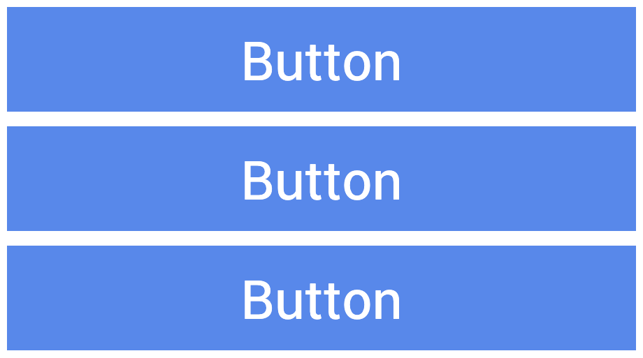
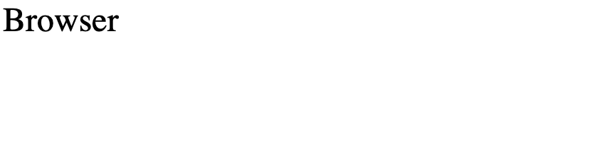
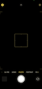
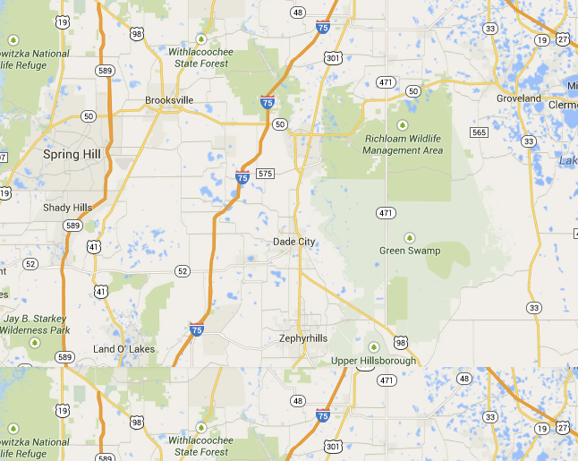
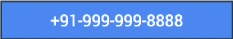

                         

Populate Screens with Widgets
=============================

> **_Note:_** Volt MX 9.2 does not support the building of Windows native applications. Please disregard all references to Windows in this topic.

Widgets are the building blocks of a screen (form) in a digital application, and each one has a specific purpose, such as user interaction or animation. Volt MX Iris provides you with built-in widgets that help you achieve your required functionality. You can configure every widget based on your needs.

This topic covers widgets for the Mobile, Tablet, and Desktop channels. For information regarding Watch widgets, see [Add Watch Widgets](AddAppleWatchWidgets.md).

Volt MX  Iris provides three types of widgets: Container, Basic, and Advanced.

Click a topic for more information. 

[Access widgets from the Widget Tab](#access-widgets-from-the-widget-tab)

[The Three Types of Widgets](#the-three-types-of-widgets)

[Populate Forms with Widgets](#populate-forms-with-widgets)

[Occupy the Parent Widget’s Entire Area](#occupy-the-parent-widgets-entire-area)

[Convert Flex Container Widgets](#convert-flex-container-widgets)

[Resize and reposition widgets](#resize-and-reposition-widgets)

[Group Widgets into a Container Widget](#group-widgets-into-a-container-widget)

[Copy the Widget Path](#copy-the-widget)

[Parent or unparent a widget](#parent-or-unparent-a-widget)

[Set the Default Widget Style](#set-the-default-widget-style)

[Look Properties for Widgets](#look-property-for-widgets)

[App Menu Widget](../../iris_widget_prog_guide/Content/App_Menu.md) 

Access Widgets from the Widget Tab
----------------------------------

The widgets are located on the Widget tab of the Volt MX IrisLibrary pane. To add widgets to a form, simply drag and drop them into place. As you do so, alignment guides display to guide your positioning of the widget.

The Three Types of Widgets
--------------------------

Volt MX  Iris provides you with three types of widgets.

[Container Widgets](#container-widgets)

[Basic Widgets](#basic-widgets)

[Advanced Widgets](#advanced-widgets)

### Container Widgets

Container Widgets act as containers to group other widgets. Using the container widgets you can group two or more widgets so that you can position them as a unit. Following are the Container Widgets available in Volt MX Iris: 

  
| Widget | Description | Image |
| --- | --- | --- |
| [FlexContainer](Flex_Container.md) | A Container Widget with flexible properties. Flexible properties allow you to place widgets anywhere in the form and configure alignment properties such as Left, Right, Top, and Bottom. You can set the properties of the FlexContainer in three units of measurement: dp(device independent pixels, dip = dp); px (actual picture elements \[i.e. pixels\] on screen); and percentage. If you want, you can convert a FlexContainer to a FlexScrollContainer. For more information, see [Convert Flex Container Widgets](#convert-flex-container-widgets). |  A FlexContainer Widget with a Button Widget inside. |
| [FlexScrollContainer](FlexScrollContainer.md) | A Container Widget that works as a FlexContainer but scrolls horizontally or vertically. If you want, you can convert a FlexScrollContainer to a FlexContainer. For more information, see [Convert Flex Container Widgets](#convert-flex-container-widgets). |  A FlexScrollContainer Widget with button widgets inside, arranged vertically with the Scroll Direction property. |
| [TabPane](TabPane.md) | A Container Widget in which you can group widgets in tabs. Each tab can have its own set of widgets, and you can add a new tab by using the Tab Widget. |  |
| [Tab](Tab.md) | A Container Widget to be used only with the TabPane Widget. Drag-and-drop this widget onto a TabPane Widget to create a new tab. |  |

### Basic Widgets

Basic Widgets help you build the user interface in your application. Along with designing the application, you can also configure events to these widgets or write code snippets to achieve a functionality.

  
| Widget | Description | Image |
| --- | --- | --- |
| [Button](Button.md) | A Button Widget enables you to provide input to an application or to trigger an event. For example, you can navigate to a form, interact with a dialog box, or confirm an action. |  |
| [Calendar](Calendar.md) | Calendar Widget allows you to select a date from a graphical calendar. The Calendar Widget appears as a label with a small calendar icon (icon does not appear on Mobile Web platforms) and displays the date or the date format you specified. Click the Calendar Widget to interact. |  |
| [CheckBoxGroup](CheckBoxGroup.md) | The CheckBoxGroup Widget allows you to make selections from a group of check boxes. When you select a check box, a check mark appears inside the check box, to indicate the selection. |  |
| [DataGrid](DataGrid.md) | The DataGrid Widget allows you to present a collection of data in rows and columns (tabular format). |  |
| [Image2](Image2.md) | The Image widget is a non-interactive widget that you can use to display a graphic (local or remote). You can use an Image Widget in scenarios such as displaying your company's logo, displaying a snapshot, and providing an illustration. |  |
| [Label](Label.md) | The Label Widget displays non-editable text on the Form and is non-interactive. |  |
| [ListBox](ListBox.md) | The ListBox Widget displays a list of items such as a drop-down box and allows you to select a single item at a time. |  |
| [RadioButtonGroup](RadioButtonGroup.md) | The RadioButtonGroup is a widget that allows you to define a set of radio buttons, and a user can choose one of the buttons as an option. |  |
| [RichText](RichText.md) | The RichText Widget displays non-editable and formatted text on the Form..md formatting tags in the RichText Widget to display text with styles (bold, underlined and so on), links, and images. |  |
| [Slider](Slider.md) | The Slider Widget allows you to select a value from a defined range of values by moving the thumb (an indicator) in a horizontal direction. |  |
| [TextArea2](TextArea2.md) | The TextArea2 Widget provides a means by which the user can enter text. |  |
| [TextBox2](TextBox2.md) | The TextBox2 Widget is used to capture input from the user. |  |

### Advanced Widgets

Advanced widgets provide you the capability to achieve the most commonly used functionality in your application. These Widgets are developed by Volt MX Iris. Also, the option to configure properties of the widgets is provided.

  
| Widget | Description | Image |
| --- | --- | --- |
| [Browser](Browser.md) | Use the Browser Widget to display.md content of your application without navigating away from the application or opening the native browser. |  |
| [Cordova Browser](CordovaBrowser.md) | Use the Cordova Browser Widget to make the content of a Cordova application accessible to the user. For more information, see [Create Cordova Applications](CreateCordovaApplications.md). |  |
| [Camera](Camera.md) | Uses the device's native camera and its functionality for image and video capture. |  |
| [Map](Map.md) | A Map Widget displays locations defined by latitude and longitude on an on-screen map. |  |
| [Phone](Phone.md) | Accesses the native phone dialer and initiate a voice call to the number that appears on the widget. |  |
| [PickerView](PickerView.md) | A PickerView Widget uses either a spinning wheel control or flat view picker to display multiple sets of values and allows you to select a combination of values. |  |
| [Segment2](Segment2.md) | A Segment2 Widget consists of multiple segments (rows or records), and each segment (row or record) can have multiple child widgets. |  |
| [Switch](Switch.md) | The Switch Widget presents two mutually exclusive choices or states. |  |
| [Video](Video.md) | Used for displaying a video as referenced by a URL or the video user upload. |   |

Populate Forms with Widgets
---------------------------

Using the following options you can populate a form with widgets:

*   **VoltMX IrisLibrary**: You can populate a form with widgets by dragging a widget from the Widget Library and dropping the widget on a form.
    
    > **_Note:_** You cannot place a **Tab** widget directly on a form. You can drop a Tab widget only inside a **TabPane** container widget.
    
    > **_Important:_** You cannot create new VBox(deprecated) forms, but you can import VBox forms from your previous projects into your latest projects and continue to work with them seamlessly.  
    When you create a new template in a project in Volt MX Iris from V8 SP2 onwards, the top-level FlexContainer automatically is created along with your template. You can delete the FlexContainer and add a VBox(deprecated) form if needed.
    
*   **User-defined Collections**: From the user-defined collections, you can drag and drop a widget.
*   **Duplicate**: If you have a widget that you want to duplicate within the same form, use the Duplicate feature. To duplicate a widget, right-click a widget and click **Duplicate**. The duplicated widget appears offset from the prior widget by a horizontal and vertical offset of 10 units, making it easy to distinguish from the prior widget.
*   **Copy and Paste**: If you want to reuse a widget on another form or channel, you can copy and paste it. To copy and paste a widget, right-click a widget, click **Copy**, and then click **Paste**.

> **_Note:_** The Duplicate feature and Copy and Paste feature differ in that you can duplicate a widget within the same form whereas you can copy a widget and then paste the widget within the same form, a different form, or a different channel.

Occupy the Parent Widget’s Entire Area
--------------------------------------

You can fit a widget to its parent such that it occupies the parent widget’s entire area.

To fit a widget to its parent, do the following:

*   On the Iris Canvas, right-click the widget you want to fit to its parent, and then click **Fit to Parent**. The Top and Left properties of the widget are set to 0, and the Height and Width properties are set to 100%, causing the widget to occupy the parent widget’s entire area.

*   This option is available only on Flex forms, and when the parent widget’s property **Layout Type** is **Free Form**.
*   This option not available for the Tab widget.

Convert Flex Container Widgets
------------------------------

After adding a flex container to a form and populating it with widgets, you might decide that your app would be better served by having a flex scroll container—a container that allows the user to scroll vertically or horizontally. Or you might find yourself in the opposite situation. You may have a flex scroll container that you want to convert to a non-scrolling flex container. You can convert any flex container to a flex scroll container—and vice versa—with a couple of clicks.

To convert a flex container widget to its alternate, do the following:

1.  On the **Project** tab of the Project Explorer, locate and click the flex container or flex scroll container that you want to convert. The container displays on the Iris Canvas and is now the container with focus.
2.  On the Iris Canvas, right-click the instance, point to **Convert To**, and then select the available alternate type of container available.

Resize and Reposition Widgets
-----------------------------

You can re-size and reposition widgets, either individually or as part of a multiple selection, in two ways: by dragging their boundary handles, or by changing the Flex properties located on the Look tab of the Properties pane.

To re size and reposition widgets, do the following:

1.  Select the widget or widgets. For more information, see [Select Multiple Items](SelectMultipleItems.md).
2.  To reposition, hover over the widget (or any one of the widgets if multiple widgets are selected), and then drag the widget(s) to the desired position. Alternately, on the Look tab of the Properties pane, change the Flex properties for Left or Right, and Top or Bottom.
3.  To re size, hover over a boundary handle and then drag the widget(s) to the desired size. Depending on whether you drag horizontally or vertically, the widget(s) re size in one-unit increments relative to their original dimensions. Alternately, if you want the widgets to have the same dimensions, on the Look tab of the Properties pane, change the Flex properties for Width and Height.
4.  On the Iris Canvas, click the context menu arrow of one of the selected widgets, point to **Group Into Flex**, and then select either **Flex Container** (for a non-scrollable container) or **Flex Scroll Container** (for a container that can be scrolled vertically and horizontally).

The Flex properties on the Look tab of the Properties pane are as follows:

*   **Left** - Determines the left edge of the widget and measured from the left boundary of the parent container.
*   **Top** - Determines the top edge of the widget and measured from the top boundary of the parent container.
*   **Width** - Determines the width of the widget and measured along the x-axis.
*   **Min Width** - Specifies the minimum width of the widget. This property is considered only when width property is not specified.
*   **Min Height** - Specifies the minimum height of the widget. This property is considered only when the height property is not specified.
*   **Center X** - Determines the center of the widget measured from the left boundary of the parent container.
*   **Z Index** - Specifies the stack order of the widgets. A widget with higher zIndex is in front of the one with lower zIndex.
*   **Right** - Determines the right edge of the widget and it is measured from the right boundary of the parent container.
*   **Bottom** - Determines the bottom edge of the widget and is measured from the bottom boundary of the parent container.
*   **Height** - Determines the height of the widget and is measured along the y-axis (height of the parent)
*   **Max Width** - Specifies the maximum width of the widget. This property is considered only when the width property is not specified.
*   **Max Height** - Specifies the minimum height of the widget. This property is considered only when the height property is not specified.
*   **Center Y** - Determines the center of the widget measured from top boundary of the parent container.

Group Widgets into a Container Widget
-------------------------------------

With Volt MX Iris, you can group widgets together under a single container widget so that you can manipulate them as a single unit, including moving and duplicating them.

To group widgets into a container widget, do the following:

1.  Select the widgets you want to group together. For more information, see [Select Multiple Items](SelectMultipleItems.md).
2.  On the Iris Canvas, click the context menu arrow of one of the selected widgets, point to **Group Into Flex**, and then select either **Flex Container** (for a non-scrollable container) or **Flex Scroll Container** (for a container that can be scrolled vertically and horizontally).

Copy the Widget Path
--------------------

If you need to make reference to a particular widget in a module, you can copy the widget path and paste it into your code rather than having to type it out. Widget paths follow the hierarchy of the forms and containers that they appear in. A common basic widget path is organized in the following way:

`FormName.ContainerName.WidgetName`

To copy the path of a widget, do the following:

1.  In the Project Explorer, on the Project tab, navigate to the widget whose path you want to copy.
2.  Click the context menu arrow of the widget, and then click **Copy Widget Path**.

You can now paste the widget path into your code module.

Parent or Unparent a Widget
---------------------------

You can make a widget into a parent and then add widgets under it so that they are grouped together.

To parent or unparent widgets, do the following: 

1.  Drag and drop a widget onto your form.
2.  Select the widget from the Project Explorer.
3.  From the Project Explorer, drag and drop the widget you want onto the form. On the Project Explorer the widget you dropped is indented under the previously selected widget.
4.  To unparent a widget, right-click the child widget and click **Unparent**. The widget's link is removed from the parent widget and linked one-level up in the project hierarchy.

Set the Default Widget Style
----------------------------

For every type of widget, Volt MX Iris has its own generic default style, but you may want to set your own default widget style to simplify the process of formatting new widgets.

To set the default widget style, do the following:

1.  On the Iris Canvas, select the widget that you want to use as the default style for any new widgets of that type that you create.
2.  Click the widget's context menu arrow, and then select **Set Default Widget Style**. Any new widgets of that type that you create are automatically formatted with the new characteristics.
3.  To reset a type of widget to be formatted according to Volt MX Iris's default formatting for that widget type, click the widget's context menu arrow, and then select **Reset to Iris Default**.

Look Property for Widgets
-------------------------

For information on common properties of widgets, see [Widget Look Properties](Look.md).

App Menu Widget
-------------------------

For information on App Menu widget, see [App Menu Widget](../../iris_widget_prog_guide/Content/App_Menu.md).