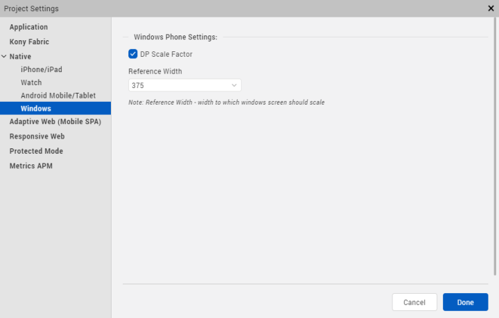

                         

Project Settings in Volt MX Iris
======================================

The project settings in Volt MX Iris are categorized into the following broad sections:

*   Application
*   Volt MX Foundry
*   Native
*   Mobile Web
*   Desktop Web
*   Protected Mode

Application Settings
--------------------

Application properties are specific to the application. Using application settings, you can configure details about the Application ID, Version, Company name; set Accessibility configuration, Internationalization; configure Cordova settings, App preview security, and Map widget key fields.

The following table describes all the fields in Application settings.

<table style="mc-table-style: url]('Resources/TableStyles/Basic.css');width: 70%;" class="TableStyle-Basic" cellspacing="0"><colgroup><col style="width: 289px;" class="TableStyle-Basic-Column-Column1"> <col style="width: 33%;" class="TableStyle-Basic-Column-Column1"> <col style="width: 33%;" class="TableStyle-Basic-Column-Column1"></colgroup><tbody><tr class="TableStyle-Basic-Body-Body1"><td class="TableStyle-Basic-BodyE-Column1-Body1">Section Name</td><td class="TableStyle-Basic-BodyE-Column1-Body1">Field Name</td><td class="TableStyle-Basic-BodyD-Column1-Body1">Description</td></tr><tr class="TableStyle-Basic-Body-Body1"><td class="TableStyle-Basic-BodyE-Column1-Body1">General Settings</td><td class="TableStyle-Basic-BodyE-Column1-Body1">ID</td><td class="TableStyle-Basic-BodyD-Column1-Body1">Name of the application. It is auto populated.</td></tr><tr class="TableStyle-Basic-Body-Body1"><td class="TableStyle-Basic-BodyE-Column1-Body1">&nbsp;</td><td class="TableStyle-Basic-BodyE-Column1-Body1">Version</td><td class="TableStyle-Basic-BodyD-Column1-Body1">A number that represents version of the application. It is auto-populated.</td></tr><tr class="TableStyle-Basic-Body-Body1"><td class="TableStyle-Basic-BodyE-Column1-Body1">&nbsp;</td><td class="TableStyle-Basic-BodyE-Column1-Body1">Company Name</td><td class="TableStyle-Basic-BodyD-Column1-Body1">Name of the company is auto-populated.</td></tr><tr class="TableStyle-Basic-Body-Body1"><td class="TableStyle-Basic-BodyE-Column1-Body1">&nbsp;</td><td class="TableStyle-Basic-BodyE-Column1-Body1">Accessibility Config</td><td class="TableStyle-Basic-BodyD-Column1-Body1">Enables assistive technologies such as TalkBack and VoiceOver. It assists visually-impaired users to navigate through various UI controls.</td></tr><tr class="TableStyle-Basic-Body-Body1"><td class="TableStyle-Basic-BodyE-Column1-Body1">Cordova</td><td class="TableStyle-Basic-BodyE-Column1-Body1">Enable Cordova Settings</td><td class="TableStyle-Basic-BodyD-Column1-Body1">Configures the settings related to Cordova version.</td></tr><tr class="TableStyle-Basic-Body-Body1"><td class="TableStyle-Basic-BodyE-Column1-Body1">&nbsp;</td><td class="TableStyle-Basic-BodyE-Column1-Body1">Version</td><td class="TableStyle-Basic-BodyD-Column1-Body1">Sets the Cordova version.</td></tr><tr class="TableStyle-Basic-Body-Body1"><td class="TableStyle-Basic-BodyE-Column1-Body1">&nbsp;</td><td class="TableStyle-Basic-BodyE-Column1-Body1">Use globally installed Cordova version</td><td class="TableStyle-Basic-BodyD-Column1-Body1">Enables the globally-installed Cordova version.</td></tr><tr class="TableStyle-Basic-Body-Body1"><td class="TableStyle-Basic-BodyE-Column1-Body1">Internationalization (i18n)</td><td class="TableStyle-Basic-BodyE-Column1-Body1">Enable</td><td class="TableStyle-Basic-BodyD-Column1-Body1">Sets various locales to the Iris project.</td></tr><tr class="TableStyle-Basic-Body-Body1"><td class="TableStyle-Basic-BodyE-Column1-Body1">&nbsp;</td><td class="TableStyle-Basic-BodyE-Column1-Body1">Enable i18n Layout Config</td><td class="TableStyle-Basic-BodyD-Column1-Body1">Configures layout properties.</td></tr><tr class="TableStyle-Basic-Body-Body1"><td class="TableStyle-Basic-BodyE-Column1-Body1">&nbsp;</td><td class="TableStyle-Basic-BodyE-Column1-Body1">Default Locale</td><td class="TableStyle-Basic-BodyD-Column1-Body1">Sets a default locale to the Iris project.</td></tr><tr class="TableStyle-Basic-Body-Body1"><td class="TableStyle-Basic-BodyE-Column1-Body1">App Preview Security</td><td class="TableStyle-Basic-BodyE-Column1-Body1">User Defined Password</td><td class="TableStyle-Basic-BodyD-Column1-Body1">Enhances app preview security. While performing a cloud publish, you can set a password. To preview the app, you must enter the same password.</td></tr><tr class="TableStyle-Basic-Body-Body1"><td class="TableStyle-Basic-BodyE-Column1-Body1">&nbsp;</td><td class="TableStyle-Basic-BodyE-Column1-Body1">Show Password</td><td class="TableStyle-Basic-BodyD-Column1-Body1">Unmasks the password.</td></tr><tr class="TableStyle-Basic-Body-Body1"><td class="TableStyle-Basic-BodyE-Column1-Body1">&nbsp;</td><td class="TableStyle-Basic-BodyE-Column1-Body1">Static Map Widget Key</td><td class="TableStyle-Basic-BodyD-Column1-Body1">Map key enables application to display Google maps through the map widgets within the applications. Generate and enter the Static Map Widget key. For more information on generating Map API keys, refer <a href="../../../Iris/iris_user_guide/Content/Generating_Map_Keys.html#Google">Generating and Configuring Map API keys</a>.</td></tr><tr class="TableStyle-Basic-Body-Body1"><td class="TableStyle-Basic-BodyE-Column1-Body1">&nbsp;</td><td class="TableStyle-Basic-BodyE-Column1-Body1">Android Map Widget Key</td><td class="TableStyle-Basic-BodyD-Column1-Body1">For the applications using Version 1 of Google Maps API, enter the generated Android Map Widget key.</td></tr><tr class="TableStyle-Basic-Body-Body1"><td class="TableStyle-Basic-BodyE-Column1-Body1">&nbsp;</td><td class="TableStyle-Basic-BodyE-Column1-Body1">Android Map Widget Key 2</td><td class="TableStyle-Basic-BodyD-Column1-Body1">For the applications using version 2 of Google Maps API, enter the generated Android Map Widget key.</td></tr><tr class="TableStyle-Basic-Body-Body1"><td class="TableStyle-Basic-BodyB-Column1-Body1">&nbsp;</td><td class="TableStyle-Basic-BodyB-Column1-Body1">Bing Map Widget Key</td><td class="TableStyle-Basic-BodyA-Column1-Body1">Enter Bing Map Widget key.</td></tr></tbody></table>

Volt MX  FoundrySettings
----------------------

Using Volt MX Foundry settings, you can configure the Cloud Account and Environment details.

The following table describes all the fields in Volt MX Foundry settings.

<table class="TableStyle-Basic" style="mc-table-style: url('Resources/TableStyles/Basic.css');" cellspacing="0"><colgroup><col style="width: 150pt;" class="TableStyle-Basic-Column-Column1"> <col style="width: 150pt;" class="TableStyle-Basic-Column-Column1"> <col style="width: 150pt;" class="TableStyle-Basic-Column-Column1"></colgroup><tbody><tr class="TableStyle-Basic-Body-Body1"><td class="TableStyle-Basic-BodyE-Column1-Body1">Section Name</td><td class="TableStyle-Basic-BodyE-Column1-Body1">Field Name</td><td class="TableStyle-Basic-BodyD-Column1-Body1">Description</td></tr><tr class="TableStyle-Basic-Body-Body1"><td class="TableStyle-Basic-BodyE-Column1-Body1">VoltMX Foundry Details</td><td class="TableStyle-Basic-BodyE-Column1-Body1">Cloud Account</td><td class="TableStyle-Basic-BodyD-Column1-Body1">Configures a cloud account.</td></tr><tr class="TableStyle-Basic-Body-Body1"><td class="TableStyle-Basic-BodyB-Column1-Body1">&nbsp;</td><td class="TableStyle-Basic-BodyB-Column1-Body1">Environment</td><td class="TableStyle-Basic-BodyA-Column1-Body1">Configures an environment in the selected cloud.</td></tr></tbody></table>

Native
------

Native app properties are divided into two categories: those that are common to all platforms and those that are platform-specific. These properties include: the logo image that your app displays, the types of screens and SDKs that the app supports, and how certificates are handled.

The following platforms are categorized based on their platform-specific properties:

*   iPhone / iPad
    
*   Watch
    
*   Android Mobile / Tablet
    
*   Windows
    

### General Settings

General Settings contain properties that are common to all platforms. Using General Settings, you can configure Application name, logo, Test automation as well as set offline object for Windows platform.

The following table describes all the fields in General settings.

<table class="TableStyle-Basic" style="mc-table-style: url('Resources/TableStyles/Basic.css');" cellspacing="0"><colgroup><col style="width: 150pt;" class="TableStyle-Basic-Column-Column1"> <col style="width: 150pt;" class="TableStyle-Basic-Column-Column1"> <col style="width: 150pt;" class="TableStyle-Basic-Column-Column1"></colgroup><tbody><tr class="TableStyle-Basic-Body-Body1"><td class="TableStyle-Basic-BodyE-Column1-Body1">Section Name</td><td class="TableStyle-Basic-BodyE-Column1-Body1">Field Name</td><td class="TableStyle-Basic-BodyD-Column1-Body1">Description</td></tr><tr class="TableStyle-Basic-Body-Body1"><td class="TableStyle-Basic-BodyE-Column1-Body1">General</td><td class="TableStyle-Basic-BodyE-Column1-Body1">Name</td><td class="TableStyle-Basic-BodyD-Column1-Body1">Name of the Native channel version of the application. If no name is specified, the name specified under Application Properties is used.</td></tr><tr class="TableStyle-Basic-Body-Body1"><td class="TableStyle-Basic-BodyE-Column1-Body1">&nbsp;</td><td class="TableStyle-Basic-BodyE-Column1-Body1">Application Logo</td><td class="TableStyle-Basic-BodyD-Column1-Body1">Sets an image as the application logo.</td></tr><tr class="TableStyle-Basic-Body-Body1"><td class="TableStyle-Basic-BodyE-Column1-Body1">Test Automation</td><td class="TableStyle-Basic-BodyE-Column1-Body1">Expose widget IDs</td><td class="TableStyle-Basic-BodyD-Column1-Body1">Exposes the widget IDs.</td></tr><tr class="TableStyle-Basic-Body-Body1"><td class="TableStyle-Basic-BodyB-Column1-Body1">Windows</td><td class="TableStyle-Basic-BodyB-Column1-Body1">Enable Offline Objects</td><td class="TableStyle-Basic-BodyA-Column1-Body1">Configures Offline objects for Windows platform.</td></tr></tbody></table>

### iPhone/ iPad

Using iPhone/ iPad settings, you can configure iOS Build Settings, Certificates; set Deep link URL Scheme; configure Target Versions, iPad Settings, and App Icons.

The following table describes about all the fields in iPhone/ iPad settings.

<table class="TableStyle-Basic" style="mc-table-style: url]('Resources/TableStyles/Basic.css');" cellspacing="0"><colgroup><col style="width: 150pt;" class="TableStyle-Basic-Column-Column1"> <col style="width: 135pt;" class="TableStyle-Basic-Column-Column1"> <col style="width: 150pt;" class="TableStyle-Basic-Column-Column1"></colgroup><tbody><tr class="TableStyle-Basic-Body-Body1"><td class="TableStyle-Basic-BodyE-Column1-Body1">Section Name</td><td class="TableStyle-Basic-BodyE-Column1-Body1">Field Name</td><td class="TableStyle-Basic-BodyD-Column1-Body1">Description</td></tr><tr class="TableStyle-Basic-Body-Body1"><td class="TableStyle-Basic-BodyE-Column1-Body1">iOS Build Settings</td><td class="TableStyle-Basic-BodyE-Column1-Body1">Bundle Identifier</td><td class="TableStyle-Basic-BodyD-Column1-Body1">A Unique name that identifies the application bundle. It usually consists of three parts and follows the convention of com.voltmx.&lt;appname&gt;</td></tr><tr class="TableStyle-Basic-Body-Body1"><td class="TableStyle-Basic-BodyE-Column1-Body1">&nbsp;</td><td class="TableStyle-Basic-BodyE-Column1-Body1">Bundle Version</td><td class="TableStyle-Basic-BodyD-Column1-Body1">A number that identifies the version of the application bundle.</td></tr><tr class="TableStyle-Basic-Body-Body1"><td class="TableStyle-Basic-BodyE-Column1-Body1">&nbsp;</td><td class="TableStyle-Basic-BodyE-Column1-Body1">Glossy Effect key</td><td class="TableStyle-Basic-BodyD-Column1-Body1">Specifies if the glossy effect must be applied to the app icon. The default value is false.</td></tr><tr class="TableStyle-Basic-Body-Body1"><td class="TableStyle-Basic-BodyE-Column1-Body1">&nbsp;</td><td class="TableStyle-Basic-BodyE-Column1-Body1">Load indicator key</td><td class="TableStyle-Basic-BodyD-Column1-Body1">Configures the load indicator in an application.</td></tr><tr class="TableStyle-Basic-Body-Body1"><td class="TableStyle-Basic-BodyE-Column1-Body1">&nbsp;</td><td class="TableStyle-Basic-BodyE-Column1-Body1">Hide status bar</td><td class="TableStyle-Basic-BodyD-Column1-Body1">Hides the status bar in an application.</td></tr><tr class="TableStyle-Basic-Body-Body1"><td class="TableStyle-Basic-BodyE-Column1-Body1">&nbsp;</td><td class="TableStyle-Basic-BodyE-Column1-Body1">Protected Mode</td><td class="TableStyle-Basic-BodyD-Column1-Body1">Ensures that your app is not run on a rooted/jail-broken device. To use this option, you must patch Xcode with the Finalizer utility. For information on patching Xcode with Finalizer, refer Install Finalizer Package. <b><i>Note: </i></b>This option works only if the application is built with <b>Build Mode</b> as <b>Protected Mode</b>. To know more about protecting your application, refer <a href="ApplicationSecurity.html">Applying Application Security</a>.</td></tr><tr class="TableStyle-Basic-Body-Body1"><td class="TableStyle-Basic-BodyE-Column1-Body1">Certificates</td><td class="TableStyle-Basic-BodyE-Column1-Body1">Development Method</td><td class="TableStyle-Basic-BodyD-Column1-Body1">Refer the <a href="https://support.hcltechsw.com/csm?id=kb_article&sysparm_article=KB0083760" target="_blank">article</a> to know about Development Method.</td></tr><tr class="TableStyle-Basic-Body-Body1"><td class="TableStyle-Basic-BodyE-Column1-Body1">&nbsp;</td><td class="TableStyle-Basic-BodyE-Column1-Body1">Mobile Provision</td><td class="TableStyle-Basic-BodyD-Column1-Body1">Refer the <a href="https://support.hcltechsw.com/csm?id=kb_article&sysparm_article=KB0083760" target="_blank">article</a> to know about Mobile Provision.</td></tr><tr class="TableStyle-Basic-Body-Body1"><td class="TableStyle-Basic-BodyE-Column1-Body1">&nbsp;</td><td class="TableStyle-Basic-BodyE-Column1-Body1">.P12</td><td class="TableStyle-Basic-BodyD-Column1-Body1">Refer the <a href="https://support.hcltechsw.com/csm?id=kb_article&sysparm_article=KB0083760" target="_blank">article</a> to know about .P12</td></tr><tr class="TableStyle-Basic-Body-Body1"><td class="TableStyle-Basic-BodyE-Column1-Body1">&nbsp;</td><td class="TableStyle-Basic-BodyE-Column1-Body1">P12 Password</td><td class="TableStyle-Basic-BodyD-Column1-Body1">Refer to the <a href="https://support.hcltechsw.com/csm?id=kb_article&sysparm_article=KB0083760" target="_blank">article</a> to know about P12 Password.</td></tr><tr class="TableStyle-Basic-Body-Body1"><td class="TableStyle-Basic-BodyE-Column1-Body1">Deeplink URL Scheme</td><td class="TableStyle-Basic-BodyE-Column1-Body1">URL Scheme</td><td class="TableStyle-Basic-BodyD-Column1-Body1">Specifies a URL to which the application will deep-link to. For more information about deep-linking, <a href="AppServiceEvent.html">Appendix E: the App Service Event</a>.</td></tr><tr class="TableStyle-Basic-Body-Body1"><td class="TableStyle-Basic-BodyE-Column1-Body1">Target Versions</td><td class="TableStyle-Basic-BodyE-Column1-Body1">iOS Version</td><td class="TableStyle-Basic-BodyD-Column1-Body1">Configures your iOS version.</td></tr><tr class="TableStyle-Basic-Body-Body1"><td class="TableStyle-Basic-BodyE-Column1-Body1">iPad Settings</td><td class="TableStyle-Basic-BodyE-Column1-Body1">Application Launch Mode</td><td class="TableStyle-Basic-BodyD-Column1-Body1">Specifies the default mode of launching the application on iPad. Portrait is the default value.</td></tr><tr class="TableStyle-Basic-Body-Body1"><td class="TableStyle-Basic-BodyE-Column1-Body1">&nbsp;</td><td class="TableStyle-Basic-BodyE-Column1-Body1">Supported Orientations</td><td class="TableStyle-Basic-BodyD-Column1-Body1">Specifies the supported orientations for the iPad. This depends on the launch mode.</td></tr><tr class="TableStyle-Basic-Body-Body1"><td class="TableStyle-Basic-BodyE-Column1-Body1">App Icons</td><td class="TableStyle-Basic-BodyE-Column1-Body1">App Store 1x (iOS 1024 pt)</td><td class="TableStyle-Basic-BodyD-Column1-Body1">Each app in the App store can have an icon. Provide the image that you want displayed next to your app in the App Store. The default size of the icon should be 1024 pt.</td></tr><tr class="TableStyle-Basic-Body-Body1"><td class="TableStyle-Basic-BodyE-Column1-Body1">&nbsp;</td><td class="TableStyle-Basic-BodyE-Column1-Body1">Notification iOS 7-11 20pt (iPhone and iPad)</td><td class="TableStyle-Basic-BodyD-Column1-Body1">Apps that support notifications should provide a small icon to display in notifications. Provide an image that you want displayed in notifications for iOS 7-11.</td></tr><tr class="TableStyle-Basic-Body-Body1"><td class="TableStyle-Basic-BodyE-Column1-Body1">&nbsp;</td><td class="TableStyle-Basic-BodyE-Column1-Body1">Spot Light-Ios 5,6 Settings-iOS 5-11 29 Pt (iPhone)</td><td class="TableStyle-Basic-BodyD-Column1-Body1">Every app should provide a small icon that iOS can display when the app name matches the name in a Spotlight search. Provide an image that you want displayed during spotlight search for iPhone 5,6.</td></tr><tr class="TableStyle-Basic-Body-Body1"><td class="TableStyle-Basic-BodyE-Column1-Body1">&nbsp;</td><td class="TableStyle-Basic-BodyE-Column1-Body1">Spot Light-Ios 7-11 40 Pt (iPhone and iPad)</td><td class="TableStyle-Basic-BodyD-Column1-Body1">Provide an image that you want to display during spotlight search for iOS 7-11.</td></tr><tr class="TableStyle-Basic-Body-Body1"><td class="TableStyle-Basic-BodyE-Column1-Body1">&nbsp;</td><td class="TableStyle-Basic-BodyE-Column1-Body1">App-iOS 7-11 60 Pt (iPhone)</td><td class="TableStyle-Basic-BodyD-Column1-Body1">Provide an image that represents your app for iOS 7-11.</td></tr><tr class="TableStyle-Basic-Body-Body1"><td class="TableStyle-Basic-BodyE-Column1-Body1">&nbsp;</td><td class="TableStyle-Basic-BodyE-Column1-Body1">Settings-Ios 5-11 29 Pt</td><td class="TableStyle-Basic-BodyD-Column1-Body1">Apps with settings should provide a small icon to display in the built-in Settings app. Provide an image to display your app for iOS 5-11.</td></tr><tr class="TableStyle-Basic-Body-Body1"><td class="TableStyle-Basic-BodyB-Column1-Body1">&nbsp;</td><td class="TableStyle-Basic-BodyB-Column1-Body1">App-iOS 7-11 76 Pt</td><td class="TableStyle-Basic-BodyA-Column1-Body1">Provide an image that represents your app for iOS 7-11.</td></tr></tbody></table>

### Watch

Using Watch settings, you can configure Target Versions, App Icons, and Notification icons for 38mm and 42 mm Apple Watches.

The following table describes all the fields in Watch settings.

<table class="TableStyle-Basic" style="mc-table-style: url('Resources/TableStyles/Basic.css');" cellspacing="0"><colgroup><col style="width: 150pt;" class="TableStyle-Basic-Column-Column1"> <col style="width: 150pt;" class="TableStyle-Basic-Column-Column1"> <col style="width: 150pt;" class="TableStyle-Basic-Column-Column1"></colgroup><tbody><tr class="TableStyle-Basic-Body-Body1"><td class="TableStyle-Basic-BodyE-Column1-Body1">Section Name</td><td class="TableStyle-Basic-BodyE-Column1-Body1">Field Name</td><td class="TableStyle-Basic-BodyD-Column1-Body1">Description</td></tr><tr class="TableStyle-Basic-Body-Body1"><td class="TableStyle-Basic-BodyE-Column1-Body1">Target Versions</td><td class="TableStyle-Basic-BodyE-Column1-Body1">Watch OS Version</td><td class="TableStyle-Basic-BodyD-Column1-Body1">Configures the OS version number.</td></tr><tr class="TableStyle-Basic-Body-Body1"><td class="TableStyle-Basic-BodyE-Column1-Body1">&nbsp;</td><td class="TableStyle-Basic-BodyE-Column1-Body1">Swift Version</td><td class="TableStyle-Basic-BodyD-Column1-Body1">Swift version number that the app is compatible with.</td></tr><tr class="TableStyle-Basic-Body-Body1"><td class="TableStyle-Basic-BodyE-Column1-Body1">App Icons</td><td class="TableStyle-Basic-BodyE-Column1-Body1">Apple Watch App Store 1x 1024 pt</td><td class="TableStyle-Basic-BodyD-Column1-Body1">Each app in the Apple watch App store can have an icon. Provide the image that you want displayed next to your app in the App Store.</td></tr><tr class="TableStyle-Basic-Body-Body1"><td class="TableStyle-Basic-BodyE-Column1-Body1">&nbsp;</td><td class="TableStyle-Basic-BodyE-Column1-Body1">Home Screen (All) (40 x 40)</td><td class="TableStyle-Basic-BodyD-Column1-Body1">Provide an image that represents your app on home screen.</td></tr><tr class="TableStyle-Basic-Body-Body1"><td class="TableStyle-Basic-BodyE-Column1-Body1">&nbsp;</td><td class="TableStyle-Basic-BodyE-Column1-Body1">Companion Settings 2x</td><td class="TableStyle-Basic-BodyD-Column1-Body1">Configures companion app settings 2x.</td></tr><tr class="TableStyle-Basic-Body-Body1"><td class="TableStyle-Basic-BodyE-Column1-Body1">&nbsp;</td><td class="TableStyle-Basic-BodyE-Column1-Body1">Companion Settings 3x</td><td class="TableStyle-Basic-BodyD-Column1-Body1">Configures companion app settings 3x.</td></tr><tr class="TableStyle-Basic-Body-Body1"><td class="TableStyle-Basic-BodyE-Column1-Body1">Watch 38 mm</td><td class="TableStyle-Basic-BodyE-Column1-Body1">Notification Centre Icon</td><td class="TableStyle-Basic-BodyD-Column1-Body1">Apps that support notifications should provide a small icon to display in notifications for smart watches. Provide an image that you want displayed in notifications for watch 38 mm.</td></tr><tr class="TableStyle-Basic-Body-Body1"><td class="TableStyle-Basic-BodyE-Column1-Body1">&nbsp;</td><td class="TableStyle-Basic-BodyE-Column1-Body1">Short- Look Notification Icon</td><td class="TableStyle-Basic-BodyD-Column1-Body1">Short-Look icon appears briefly, giving the wearer just enough time to scan a notification. Provide an image for the app icon in short look notifications for watch 38 mm.</td></tr><tr class="TableStyle-Basic-Body-Body1"><td class="TableStyle-Basic-BodyE-Column1-Body1">Watch 42 mm</td><td class="TableStyle-Basic-BodyE-Column1-Body1">Notification Center Icon</td><td class="TableStyle-Basic-BodyD-Column1-Body1">Provide an image for app icon to display notifications in the center.</td></tr><tr class="TableStyle-Basic-Body-Body1"><td class="TableStyle-Basic-BodyE-Column1-Body1">&nbsp;</td><td class="TableStyle-Basic-BodyE-Column1-Body1">Long-Look Notification Icon</td><td class="TableStyle-Basic-BodyD-Column1-Body1">Long-Look notifications display more information on screen from an app, such as message text and action buttons. Provide an image for app icon in long look notifications for 42 mm watch.</td></tr><tr class="TableStyle-Basic-Body-Body1"><td class="TableStyle-Basic-BodyB-Column1-Body1">&nbsp;</td><td class="TableStyle-Basic-BodyB-Column1-Body1">Short-Look Notification Icon</td><td class="TableStyle-Basic-BodyA-Column1-Body1">Short-Look icon appears briefly, giving the wearer just enough time to scan a notification. Provide an image for app icon in short look notification for 42 mm watch.</td></tr></tbody></table>

### Android Mobile/ Tablet

Using Android Mobile/ Tablet Settings you can configure General Settings, SDK versions, and Android signing.

The following settings describe all the fields in Android Mobile/ Tablet settings.

<table class="TableStyle-Basic" style="mc-table-style: url]('Resources/TableStyles/Basic.css');" cellspacing="0"><colgroup><col style="width: 150pt;" class="TableStyle-Basic-Column-Column1"> <col style="width: 150pt;" class="TableStyle-Basic-Column-Column1"> <col style="width: 150pt;" class="TableStyle-Basic-Column-Column1"></colgroup><tbody><tr class="TableStyle-Basic-Body-Body1"><td class="TableStyle-Basic-BodyE-Column1-Body1">Section Name</td><td class="TableStyle-Basic-BodyE-Column1-Body1">Field Name</td><td class="TableStyle-Basic-BodyD-Column1-Body1">Description</td></tr><tr class="TableStyle-Basic-Body-Body1"><td class="TableStyle-Basic-BodyE-Column1-Body1">General Settings</td><td class="TableStyle-Basic-BodyE-Column1-Body1">Package Name</td><td class="TableStyle-Basic-BodyD-Column1-Body1">Package Name is the name used to search for an application in Google Play. Google Play is an online software store developed by Google for Android mobile devices. A software program called Market is pre-installed on most Android mobile devices. This software allows the users to browse and download third-party applications. <b><i>Note: </i></b>The name you specify for <i>Android Package</i> must contain at least two segments. A segment is a valid Java package name. The following are a few examples of valid Android Package names: <code class="file_names">com.hcl.&lt;ApplicationName&gt;</code> <code class="file_names">com.voltmx.&lt;ApplicationName&gt;</code></td></tr><tr class="TableStyle-Basic-Body-Body1"><td class="TableStyle-Basic-BodyE-Column1-Body1">&nbsp;</td><td class="TableStyle-Basic-BodyE-Column1-Body1">Version Code</td><td class="TableStyle-Basic-BodyD-Column1-Body1">An internal version number, which is used to determine whether the application is a recent version. This version number is not shown to users. The value must be an integer. You can increase each version by one to indicate a newer version.</td></tr><tr class="TableStyle-Basic-Body-Body1"><td class="TableStyle-Basic-BodyE-Column1-Body1">&nbsp;</td><td class="TableStyle-Basic-BodyE-Column1-Body1">Protected Mode</td><td class="TableStyle-Basic-BodyD-Column1-Body1">Ensures that your app is not run on a rooted/jail-broken device. <b><i>Note: </i></b>This option works only if the application is built with <b>Build Mode</b> as <b>Protected Mode</b>. To know more about protecting your application, refer <a href="ApplicationSecurity.html">Applying Application Security</a>.</td></tr><tr class="TableStyle-Basic-Body-Body1"><td class="TableStyle-Basic-BodyE-Column1-Body1">SDK Versions</td><td class="TableStyle-Basic-BodyE-Column1-Body1">Minimum SDK</td><td class="TableStyle-Basic-BodyD-Column1-Body1">Select the <b>Minimum</b> SDK Version that needs to be supported for the application. The default minimum SDK value is 4.0. <b><i>Notes: </i></b>VoltMX Iris does not support SDK&nbsp;Versions earlier than 4.0. You must keep the minimum SDK&nbsp;value between 4.0 and 4.4. The SDK&nbsp;values of 5.0 and above results in a build error](technical limitation). The application must be built with a minimum version matching the device SDK&nbsp;version. For example, a device with 5.0 version of SDK&nbsp;cannot run an application built on 4.0. &nbsp;</td></tr><tr class="TableStyle-Basic-Body-Body1"><td class="TableStyle-Basic-BodyE-Column1-Body1">&nbsp;</td><td class="TableStyle-Basic-BodyE-Column1-Body1">Target SDK</td><td class="TableStyle-Basic-BodyD-Column1-Body1">Select the <b>Target</b> SDK Version that needs to be supported for the application.<b><i>Note: </i></b>The Target SDK Version must be greater than or equal to the Minimum SDK Version.</td></tr><tr class="TableStyle-Basic-Body-Body1"><td class="TableStyle-Basic-BodyE-Column1-Body1">&nbsp;</td><td class="TableStyle-Basic-BodyE-Column1-Body1">Maximum SDK</td><td class="TableStyle-Basic-BodyD-Column1-Body1">Select the <b>Maximum</b> SDK Version that needs to be supported for the application.</td></tr><tr class="TableStyle-Basic-Body-Body1"><td class="TableStyle-Basic-BodyE-Column1-Body1">Android Signing</td><td class="TableStyle-Basic-BodyE-Column1-Body1">Key Alias</td><td class="TableStyle-Basic-BodyD-Column1-Body1">Used to sign the android binary automatically during the build process. Enter the alias of the key.</td></tr><tr class="TableStyle-Basic-Body-Body1"><td class="TableStyle-Basic-BodyE-Column1-Body1">&nbsp;</td><td class="TableStyle-Basic-BodyE-Column1-Body1">Key Password</td><td class="TableStyle-Basic-BodyD-Column1-Body1">Enter the password for the key.</td></tr><tr class="TableStyle-Basic-Body-Body1"><td class="TableStyle-Basic-BodyE-Column1-Body1">&nbsp;</td><td class="TableStyle-Basic-BodyE-Column1-Body1">Store Password</td><td class="TableStyle-Basic-BodyD-Column1-Body1">Enter the password for the store.</td></tr><tr class="TableStyle-Basic-Body-Body1"><td class="TableStyle-Basic-BodyE-Column1-Body1">&nbsp;</td><td class="TableStyle-Basic-BodyE-Column1-Body1">Store File</td><td class="TableStyle-Basic-BodyD-Column1-Body1">Locate and configure the store file.</td></tr><tr class="TableStyle-Basic-Body-Body1"><td class="TableStyle-Basic-BodyE-Column1-Body1">Support for Margin in Pixels</td><td class="TableStyle-Basic-BodyE-Column1-Body1">True</td><td class="TableStyle-Basic-BodyD-Column1-Body1">Supports margin in Pixels.</td></tr><tr class="TableStyle-Basic-Body-Body1"><td class="TableStyle-Basic-BodyE-Column1-Body1">&nbsp;</td><td class="TableStyle-Basic-BodyE-Column1-Body1">False</td><td class="TableStyle-Basic-BodyD-Column1-Body1">Disables the support for margin in pixels.</td></tr><tr class="TableStyle-Basic-Body-Body1"><td class="TableStyle-Basic-BodyE-Column1-Body1">Manifest Permissions, Tags and Gradle Build Entries</td><td class="TableStyle-Basic-BodyE-Column1-Body1">Permissions</td><td class="TableStyle-Basic-BodyD-Column1-Body1">Sets the permissions to true or false based on the application requirements. Set the appropriate permissions for Android Manifest file. For more information, refer <a href="AndroidManifest_File.html">The Android Manifest File</a>. To enable permissions, select the permissions from the left pane and click <b>Add &gt;</b>. To disable permissions, select the permissions from the right pane and click <b>&lt; Remove</b>. <b><i>Important: </i></b>Add the <code class="file_names">WRITE_EXTERNAL_STORAGE</code>&nbsp;setting if you need to save images in an external storage such as an SD&nbsp;Card.</td></tr><tr class="TableStyle-Basic-Body-Body1"><td class="TableStyle-Basic-BodyE-Column1-Body1">&nbsp;</td><td class="TableStyle-Basic-BodyE-Column1-Body1">Tags</td><td class="TableStyle-Basic-BodyD-Column1-Body1">Adds tags to the Android manifest file directly from VoltMX Iris by specifying tag entries and attributes on the <b>Tags</b> tab. You can specify child tag entries and attributes for &lt;manifest&gt; and &lt;application&gt; tags and the Main Launcher &lt;activity&gt; tag. For more information on the tags you can add with the manifest or application tags, refer <a href="http://developer.android.com/guide/topics/manifest/manifest-intro.html">http://developer.android.com/guide/topics/manifest/manifest-intro.html</a>.</td></tr><tr class="TableStyle-Basic-Body-Body1"><td class="TableStyle-Basic-BodyB-Column1-Body1">&nbsp;</td><td class="TableStyle-Basic-BodyB-Column1-Body1">Gradle Entries</td><td class="TableStyle-Basic-BodyA-Column1-Body1">Imports additional gradle packages, applies external plugins, or specifies build-related configuration information, build dependencies, or the location of any external repositories or modules used by your Android application. <b>build.gradle entries to Prefix</b> imports additional Gradle packages, or specifies external plugins to use in the build. <b>build.gradle entries to Suffix</b> customizes build logic. For example, you can add compilation dependencies such as Google and Android support repositories, local library modules, or local and remote repository paths. For more information, see <a href="https://docs.gradle.org/current/userguide/organizing_build_logic.html">Organizing Build Logic</a>. <b>gradle.properties entries</b> configures project-wide Gradle settings, such as the Gradle daemon's maximum heap size or proxy settings. For more information, see <a href="https://docs.gradle.org/current/userguide/build_environment.html">The Build Environment</a>. <b>settings.gradle entries</b> specifies external modules ](Gradle-based third-party Android libraries) to include when building your application. For more information, see <a href="https://developer.android.com/studio/build/index.md">Configure Your Build</a>.</td></tr></tbody></table>

### Windows

Using Windows Settings, you can configure the DP Scale Factor and Reference Width for a Windows phone.

Click to view the image

The following table describes all the fields in Windows Settings.

<table class="TableStyle-Basic" style="mc-table-style: url('Resources/TableStyles/Basic.css');" cellspacing="0"><colgroup><col style="width: 150pt;" class="TableStyle-Basic-Column-Column1"> <col style="width: 150pt;" class="TableStyle-Basic-Column-Column1"> <col style="width: 150pt;" class="TableStyle-Basic-Column-Column1"></colgroup><tbody><tr class="TableStyle-Basic-Body-Body1" data-mc-conditions=""><td class="TableStyle-Basic-BodyE-Column1-Body1">Section Name</td><td class="TableStyle-Basic-BodyE-Column1-Body1">Field Name</td><td class="TableStyle-Basic-BodyD-Column1-Body1">Field Name</td></tr><tr class="TableStyle-Basic-Body-Body1" data-mc-conditions=""><td class="TableStyle-Basic-BodyE-Column1-Body1">Windows</td><td class="TableStyle-Basic-BodyE-Column1-Body1">DP Scale Factor</td><td class="TableStyle-Basic-BodyD-Column1-Body1">The factor by which you should multiply the dp units to get the actual pixel count for the current windows screen. Enable DP Scale factor to modify Reference width.</td></tr><tr class="TableStyle-Basic-Body-Body1" data-mc-conditions=""><td class="TableStyle-Basic-BodyB-Column1-Body1">&nbsp;</td><td class="TableStyle-Basic-BodyB-Column1-Body1">Reference Width</td><td class="TableStyle-Basic-BodyA-Column1-Body1">Configures the width to which the Windows screen should scale.</td></tr></tbody></table>

### Adaptive Web (Mobile SPA)

Adaptive Web (Mobile SPA) is the browser on the device. Adaptive Web (Mobile SPA) properties define the properties of the application on Adaptive Web (Mobile SPA) for various platforms. You can set the Shortcut icons for the application, configure Async mode, and define Base fonts.

The following table describes all the fields in Mobile Web settings.

<table class="TableStyle-Basic" style="mc-table-style: url('Resources/TableStyles/Basic.css');" cellspacing="0"><colgroup><col style="width: 150pt;" class="TableStyle-Basic-Column-Column1"> <col style="width: 150pt;" class="TableStyle-Basic-Column-Column1"> <col style="width: 150pt;" class="TableStyle-Basic-Column-Column1"></colgroup><tbody><tr class="TableStyle-Basic-Body-Body1"><td class="TableStyle-Basic-BodyE-Column1-Body1">Section Name</td><td class="TableStyle-Basic-BodyE-Column1-Body1">Field Name</td><td class="TableStyle-Basic-BodyD-Column1-Body1">Description</td></tr><tr class="TableStyle-Basic-Body-Body1"><td class="TableStyle-Basic-BodyE-Column1-Body1">Shortcut Icons</td><td class="TableStyle-Basic-BodyE-Column1-Body1">Web Browser</td><td class="TableStyle-Basic-BodyD-Column1-Body1">Configures an icon to represent the app in a web browser.</td></tr><tr class="TableStyle-Basic-Body-Body1"><td class="TableStyle-Basic-BodyE-Column1-Body1">&nbsp;</td><td class="TableStyle-Basic-BodyE-Column1-Body1">iPhone Shortcut</td><td class="TableStyle-Basic-BodyD-Column1-Body1">Configures an icon to represent the app on an iPhone screen.</td></tr><tr class="TableStyle-Basic-Body-Body1"><td class="TableStyle-Basic-BodyE-Column1-Body1">&nbsp;</td><td class="TableStyle-Basic-BodyE-Column1-Body1">Title</td><td class="TableStyle-Basic-BodyD-Column1-Body1">Configures title of the application in a web browser.</td></tr><tr class="TableStyle-Basic-Body-Body1"><td class="TableStyle-Basic-BodyE-Column1-Body1">Async Mode</td><td class="TableStyle-Basic-BodyE-Column1-Body1">Enable Async Mode</td><td class="TableStyle-Basic-BodyD-Column1-Body1">All the network calls will be in asynchronous mode when enabled.</td></tr><tr class="TableStyle-Basic-Body-Body1"><td class="TableStyle-Basic-BodyE-Column1-Body1">Base Fonts</td><td class="TableStyle-Basic-BodyE-Column1-Body1">iPhone (px)</td><td class="TableStyle-Basic-BodyD-Column1-Body1">Configures the base font of iPhone in pixel.</td></tr><tr class="TableStyle-Basic-Body-Body1"><td class="TableStyle-Basic-BodyE-Column1-Body1">&nbsp;</td><td class="TableStyle-Basic-BodyE-Column1-Body1">Android</td><td class="TableStyle-Basic-BodyD-Column1-Body1">Configures the base font of Android 240, Android 320, Android 360, Android 400, Android 440, Android 480, and Android 640 in pixel.</td></tr><tr class="TableStyle-Basic-Body-Body1"><td class="TableStyle-Basic-BodyE-Column1-Body1">&nbsp;</td><td class="TableStyle-Basic-BodyE-Column1-Body1">SPA iPad</td><td class="TableStyle-Basic-BodyD-Column1-Body1">Configures the base font of SPA iPad in pixel.</td></tr><tr class="TableStyle-Basic-Body-Body1"><td class="TableStyle-Basic-BodyE-Column1-Body1">&nbsp;</td><td class="TableStyle-Basic-BodyE-Column1-Body1">SPA Android Tablet</td><td class="TableStyle-Basic-BodyD-Column1-Body1">Configures the base font of SPA Android Tablet 800, Android Tablet 1024, Android Tablet 1280 in pixel.</td></tr><tr class="TableStyle-Basic-Body-Body1"><td class="TableStyle-Basic-BodyB-Column1-Body1">&nbsp;</td><td class="TableStyle-Basic-BodyB-Column1-Body1">SPA Windows Tablet</td><td class="TableStyle-Basic-BodyA-Column1-Body1">Configures the base font of SPA Windows tablet in pixel.</td></tr></tbody></table>

### Responsive Web

Responsive Web properties specify the properties of the application on Responsive Web for various platforms. You can configure Embedding Iframe, and Async Mode; set the Web Browser icon, application title, BaseFont, Alignment, Screen width; and enable Progressive Web App.

The following table describes all the fields in Desktop Web settings.

<table class="TableStyle-Basic" style="mc-table-style: url('Resources/TableStyles/Basic.css');" cellspacing="0"><colgroup><col style="width: 150pt;" class="TableStyle-Basic-Column-Column1"> <col style="width: 150pt;" class="TableStyle-Basic-Column-Column1"> <col style="width: 150pt;" class="TableStyle-Basic-Column-Column1"></colgroup><tbody><tr class="TableStyle-Basic-Body-Body1"><td class="TableStyle-Basic-BodyE-Column1-Body1">Section Name</td><td class="TableStyle-Basic-BodyE-Column1-Body1">Field Name</td><td class="TableStyle-Basic-BodyD-Column1-Body1">Description</td></tr><tr class="TableStyle-Basic-Body-Body1"><td class="TableStyle-Basic-BodyE-Column1-Body1">General Settings</td><td class="TableStyle-Basic-BodyE-Column1-Body1">Enable Responsive Web</td><td class="TableStyle-Basic-BodyD-Column1-Body1">Activates the Responsive Web Design for your desktop application.</td></tr><tr class="TableStyle-Basic-Body-Body1"><td class="TableStyle-Basic-BodyE-Column1-Body1">&nbsp;</td><td class="TableStyle-Basic-BodyE-Column1-Body1">Enable Embedding Iframe</td><td class="TableStyle-Basic-BodyD-Column1-Body1">Sets the SPA or Desktop Web application behavior in a sub window. Enabling Embedding Iframe allows an application to open in a sub window.</td></tr><tr class="TableStyle-Basic-Body-Body1"><td class="TableStyle-Basic-BodyE-Column1-Body1">&nbsp;</td><td class="TableStyle-Basic-BodyE-Column1-Body1">Enable Async Mode</td><td class="TableStyle-Basic-BodyD-Column1-Body1">All the network calls will be in asynchronous mode when enabled.</td></tr><tr class="TableStyle-Basic-Body-Body1"><td class="TableStyle-Basic-BodyE-Column1-Body1">&nbsp;</td><td class="TableStyle-Basic-BodyE-Column1-Body1">Web browser (favicon.ico)</td><td class="TableStyle-Basic-BodyD-Column1-Body1">Configures appropriate icon for an application in the Desktop Web Browser.</td></tr><tr class="TableStyle-Basic-Body-Body1"><td class="TableStyle-Basic-BodyE-Column1-Body1">&nbsp;</td><td class="TableStyle-Basic-BodyE-Column1-Body1">Title</td><td class="TableStyle-Basic-BodyD-Column1-Body1">Sets the title of an application in the Desktop Web Browser.</td></tr><tr class="TableStyle-Basic-Body-Body1"><td class="TableStyle-Basic-BodyE-Column1-Body1">&nbsp;</td><td class="TableStyle-Basic-BodyE-Column1-Body1">Base Font (px)</td><td class="TableStyle-Basic-BodyD-Column1-Body1">Configures appropriate base font size in pixel.</td></tr><tr class="TableStyle-Basic-Body-Body1"><td class="TableStyle-Basic-BodyE-Column1-Body1">&nbsp;</td><td class="TableStyle-Basic-BodyE-Column1-Body1">Alignment</td><td class="TableStyle-Basic-BodyD-Column1-Body1">Defines the alignment of the application in the Desktop Web browser. The possible values are center, left, and right.</td></tr><tr class="TableStyle-Basic-Body-Body1"><td class="TableStyle-Basic-BodyE-Column1-Body1">&nbsp;</td><td class="TableStyle-Basic-BodyE-Column1-Body1">Screen Width</td><td class="TableStyle-Basic-BodyD-Column1-Body1">Specifies the width that the application occupies in the Desktop Web browser. The Screen width value can be in percentage or pixel.</td></tr><tr class="TableStyle-Basic-Body-Body1"><td class="TableStyle-Basic-BodyE-Column1-Body1">&nbsp;</td><td class="TableStyle-Basic-BodyE-Column1-Body1">No JavaScript Message</td><td class="TableStyle-Basic-BodyD-Column1-Body1">The message to be displayed when your browser does not support JavaScript.</td></tr><tr class="TableStyle-Basic-Body-Body1"><td class="TableStyle-Basic-BodyB-Column1-Body1">Progressive Web App</td><td class="TableStyle-Basic-BodyB-Column1-Body1">Enable PWA</td><td class="TableStyle-Basic-BodyA-Column1-Body1">Builds a Progressive Web App.</td></tr></tbody></table>

### Protected Mode

Protected mode ensures that your app is not run on a rooted/ jail-broken device. Using Protected mode settings, you can configure the public and private encryption keys.

> **_Note:_** This option works only if the application is built with **Build Mode** as **Protected Mode**. To know more about protecting your application, refer [Applying Application Security](ApplicationSecurity.md).

The following table describes all the fields in Protected Mode settings.

<table class="TableStyle-Basic" style="mc-table-style: url('Resources/TableStyles/Basic.css');" cellspacing="0"><colgroup><col style="width: 150pt;" class="TableStyle-Basic-Column-Column1"> <col style="width: 150pt;" class="TableStyle-Basic-Column-Column1"> <col style="width: 184pt;" class="TableStyle-Basic-Column-Column1"></colgroup><tbody><tr class="TableStyle-Basic-Body-Body1"><td class="TableStyle-Basic-BodyE-Column1-Body1">Section Name</td><td class="TableStyle-Basic-BodyE-Column1-Body1">Field Name</td><td class="TableStyle-Basic-BodyD-Column1-Body1">Description</td></tr><tr class="TableStyle-Basic-Body-Body1"><td class="TableStyle-Basic-BodyE-Column1-Body1">Encryption Keys</td><td class="TableStyle-Basic-BodyE-Column1-Body1">Public Key</td><td class="TableStyle-Basic-BodyD-Column1-Body1">Configures the public key.</td></tr><tr class="TableStyle-Basic-Body-Body1"><td class="TableStyle-Basic-BodyB-Column1-Body1">&nbsp;</td><td class="TableStyle-Basic-BodyB-Column1-Body1">Private Key</td><td class="TableStyle-Basic-BodyA-Column1-Body1">Configures the private key.</td></tr></tbody></table>
