                         

##  Project Settings in Volt MX Iris

> **_Note:_** Volt MX 9.2 does not support the building of Windows native applications. Please disregard all references to Windows in this topic.

The project settings in Volt MX Iris are categorized into the following broad sections:

*   [Application](#application-settings)
*   [Volt MX Foundry](#volt-mx-foundry-settings)
*   [Native](#native-settings)
    *   [General](#general-settings)
    *   [Iphone/iPad](#iphone-ipad)
    *   [Watch](#watch)
    *   [Android Mobile/Tablet](#android-mobile-tablet)
    *   [Android Wear](#android-wear)
    *   [Windows](#windows)
*   [Adaptive Web (Mobile Web)](#adaptive-web-mobile-spa)
*   [Responsive Web](#responsive-web)
*   [Protected Mode](#protected-mode)
*   [Metrics APM](#metrics-apm)

Application Settings
--------------------

Application properties are specific to the application. Using application settings, you can configure details about the Application ID, Version, Company name; set Accessibility configuration, Internationalization; configure Cordova settings, App preview security, and Map widget key fields.

Click to view the image

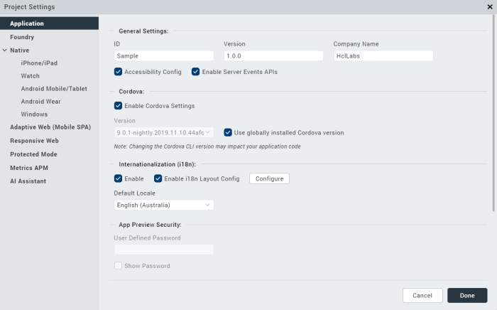

The following table describes all the fields in Application settings.

<table style="mc-table-style: url]('Resources/TableStyles/Basic.css');width: 100%;" class="TableStyle-Basic" cellspacing="0"><colgroup><col style="width: 20%;" class="TableStyle-Basic-Column-Column1"> <col style="width: 35%;" class="TableStyle-Basic-Column-Column1"> <col style="width: 45%;" class="TableStyle-Basic-Column-Column1"></colgroup><tbody><tr class="TableStyle-Basic-Body-Body1"><th style="text-align: left;" class="TableStyle-Basic-BodyE-Column1-Body1">Section Name</th><th style="text-align: left;" class="TableStyle-Basic-BodyE-Column1-Body1">Field Name</th><th style="text-align: left;" class="TableStyle-Basic-BodyD-Column1-Body1">Description</th></tr><tr class="TableStyle-Basic-Body-Body1"><td class="TableStyle-Basic-BodyE-Column1-Body1" style="text-align: left;" rowspan="5">General Settings</td><td class="TableStyle-Basic-BodyE-Column1-Body1" style="text-align: left;">ID</td><td class="TableStyle-Basic-BodyD-Column1-Body1" style="text-align: left;">Name of the application. It is auto populated.</td></tr><tr class="TableStyle-Basic-Body-Body1"><td class="TableStyle-Basic-BodyE-Column1-Body1" style="text-align: left;">Version</td><td class="TableStyle-Basic-BodyD-Column1-Body1" style="text-align: left;">A number that represents version of the application. It is auto-populated.</td></tr><tr class="TableStyle-Basic-Body-Body1"><td class="TableStyle-Basic-BodyE-Column1-Body1" style="text-align: left;">Company Name</td><td class="TableStyle-Basic-BodyD-Column1-Body1" style="text-align: left;">Name of the company is auto-populated.</td></tr><tr class="TableStyle-Basic-Body-Body1"><td class="TableStyle-Basic-BodyE-Column1-Body1" style="text-align: left;">Accessibility Config</td><td class="TableStyle-Basic-BodyD-Column1-Body1" style="text-align: left;">Enables assistive technologies such as TalkBack and VoiceOver. It assists visually-impaired users to navigate through various UI controls.</td></tr><tr class="TableStyle-Basic-Body-Body1"><td class="TableStyle-Basic-BodyE-Column1-Body1" style="text-align: left;">Enable Server Events APIs</td><td class="TableStyle-Basic-BodyD-Column1-Body1" style="text-align: left;">&nbsp;</td></tr><tr class="TableStyle-Basic-Body-Body1"><td class="TableStyle-Basic-BodyE-Column1-Body1" style="text-align: left;" rowspan="3">Cordova</td><td class="TableStyle-Basic-BodyE-Column1-Body1" style="text-align: left;">Enable Cordova Settings</td><td class="TableStyle-Basic-BodyD-Column1-Body1" style="text-align: left;">Configures the settings related to Cordova version.</td></tr><tr class="TableStyle-Basic-Body-Body1"><td class="TableStyle-Basic-BodyE-Column1-Body1" style="text-align: left;">Version</td><td class="TableStyle-Basic-BodyD-Column1-Body1" style="text-align: left;">Sets the Cordova version.</td></tr><tr class="TableStyle-Basic-Body-Body1"><td class="TableStyle-Basic-BodyE-Column1-Body1" style="text-align: left;">Use globally installed Cordova version</td><td class="TableStyle-Basic-BodyD-Column1-Body1" style="text-align: left;">Enables the globally-installed Cordova version.</td></tr><tr class="TableStyle-Basic-Body-Body1"><td class="TableStyle-Basic-BodyE-Column1-Body1" style="text-align: left;" rowspan="3">Internationalization (i18n)</td><td class="TableStyle-Basic-BodyE-Column1-Body1" style="text-align: left;">Enable</td><td class="TableStyle-Basic-BodyD-Column1-Body1" style="text-align: left;">Sets various locales to the Iris project.</td></tr><tr class="TableStyle-Basic-Body-Body1"><td class="TableStyle-Basic-BodyE-Column1-Body1" style="text-align: left;">Enable i18n Layout Config</td><td class="TableStyle-Basic-BodyD-Column1-Body1" style="text-align: left;">Configures layout properties.</td></tr><tr class="TableStyle-Basic-Body-Body1"><td class="TableStyle-Basic-BodyE-Column1-Body1" style="text-align: left;">Default Locale</td><td class="TableStyle-Basic-BodyD-Column1-Body1" style="text-align: left;">Sets a default locale to the Iris project.</td></tr><tr class="TableStyle-Basic-Body-Body1"><td class="TableStyle-Basic-BodyE-Column1-Body1" style="text-align: left;" rowspan="2">App Preview Security</td><td class="TableStyle-Basic-BodyE-Column1-Body1" style="text-align: left;">User Defined Password</td><td class="TableStyle-Basic-BodyD-Column1-Body1" style="text-align: left;">Enhances app preview security. While performing a cloud publish, you can set a password. To preview the app, you must enter the same password.</td></tr><tr class="TableStyle-Basic-Body-Body1"><td class="TableStyle-Basic-BodyE-Column1-Body1" style="text-align: left;">Show Password</td><td class="TableStyle-Basic-BodyD-Column1-Body1" style="text-align: left;">Unmasks the password.</td></tr><tr class="TableStyle-Basic-Body-Body1"><td class="TableStyle-Basic-BodyE-Column1-Body1" style="text-align: left;" rowspan="4">Map Widget</td><td class="TableStyle-Basic-BodyE-Column1-Body1" style="text-align: left;">Static Map Widget Key</td><td class="TableStyle-Basic-BodyD-Column1-Body1" style="text-align: left;">Map key enables application to display Google maps through the map widgets within the applications. Generate and enter the Static Map Widget key. For more information on generating Map API keys, refer to <a href="Generating_Map_Keys.html">Generating and Configuring Map API keys</a>.</td></tr><tr class="TableStyle-Basic-Body-Body1"><td class="TableStyle-Basic-BodyE-Column1-Body1" style="text-align: left;">Android Map Widget Key</td><td class="TableStyle-Basic-BodyD-Column1-Body1" style="text-align: left;">For the applications using Version 1 of Google Maps API, enter the generated Android Map Widget key.</td></tr><tr class="TableStyle-Basic-Body-Body1"><td class="TableStyle-Basic-BodyE-Column1-Body1" style="text-align: left;">Android Map Widget Key 2</td><td class="TableStyle-Basic-BodyD-Column1-Body1" style="text-align: left;">For the applications using version 2 of Google Maps API, enter the generated Android Map Widget key.</td></tr><tr class="TableStyle-Basic-Body-Body1"><td class="TableStyle-Basic-BodyB-Column1-Body1" style="text-align: left;">Bing Map Widget Key</td><td class="TableStyle-Basic-BodyA-Column1-Body1" style="text-align: left;">Enter Bing Map Widget key.</td></tr></tbody></table>

Volt MX Foundry Settings
-----------------------

Using Volt MX Foundry settings, you can configure the Cloud Account, Environment details, Runtime App version, and the Enterprise App Store settings.

Click to view the image

The following table describes all the fields in Volt MX Foundry settings.

<table class="TableStyle-Basic" style="mc-table-style: url]('Resources/TableStyles/Basic.css');margin-left: auto;margin-right: auto;width: 100%;" cellspacing="0"><colgroup><col style="width: 20%;" class="TableStyle-Basic-Column-Column1"> <col style="width: 35%;" class="TableStyle-Basic-Column-Column1"> <col style="width: 45%;" class="TableStyle-Basic-Column-Column1"></colgroup><tbody><tr class="TableStyle-Basic-Body-Body1"><th class="TableStyle-Basic-BodyE-Column1-Body1" style="text-align: left;">Section Name</th><th class="TableStyle-Basic-BodyE-Column1-Body1" style="text-align: left;">Field Name</th><th class="TableStyle-Basic-BodyD-Column1-Body1" style="text-align: left;">Description</th></tr><tr class="TableStyle-Basic-Body-Body1"><td class="TableStyle-Basic-BodyE-Column1-Body1" style="text-align: left;" rowspan="4">Volt MX Foundry Details</td><td class="TableStyle-Basic-BodyE-Column1-Body1" style="text-align: left;">Cloud Account</td><td class="TableStyle-Basic-BodyD-Column1-Body1" style="text-align: left;">Configures a cloud account.</td></tr><tr class="TableStyle-Basic-Body-Body1"><td class="TableStyle-Basic-BodyE-Column1-Body1" style="text-align: left;">Environment</td><td class="TableStyle-Basic-BodyD-Column1-Body1" style="text-align: left;">Configures an environment in the selected cloud.</td>
</tr>
<tr class="TableStyle-Basic-Body-Body1" data-mc-conditions="Default.V9SP1M1">
<td class="TableStyle-Basic-BodyE-Column1-Body1" style="text-align: left;">Runtime App Version</td><td class="TableStyle-Basic-BodyD-Column1-Body1" style="text-align: left;">Select the version of the Foundry app for which the service document must be fetched and bundled during the build process (runtime). <b>Default</b>: The app version that you set as the default app version on Volt MX Foundry. This option is selected, by default. <b>Linked</b>: The Volt MX Foundry app version that you associate with your project. If you have the 1.0 version of the app linked, but select the 2.0 version as the Runtime App Version, the service document of the 2.0 version of the app is bundled during the build process.</td></tr>

<tr class="TableStyle-Basic-Body-Body1" data-mc-conditions="Default.V9SP1M1">
<td class="TableStyle-Basic-BodyE-Column1-Body1" style="text-align: left;">Vanity Domain</td><td class="TableStyle-Basic-BodyD-Column1-Body1" style="text-align: left;">Select the vanity domain to configure. The base domain is identified by appended text “[Base]” in the displayed domain name. 
<b>Note:</b> Vanity domain applies to only SPA and Responsive Web platforms.
</td></tr>

<tr class="TableStyle-Basic-Body-Body1" data-mc-conditions="Default.V9SP1M1"><td class="TableStyle-Basic-BodyB-Column1-Body1">My App Store Details</td><td class="TableStyle-Basic-BodyB-Column1-Body1" style="text-align: left;">Automatically check for App Upgrades</td><td class="TableStyle-Basic-BodyA-Column1-Body1" style="text-align: left;">Enable this setting to check whether an app upgrade is available on the Enterprise App Store when the app is launched. Based on the policy configured on the EAS, users are prompted to update the app. For more information on how to enable Version Check for Apps on EAS, refer <a href="../../../Foundry/voltmx_foundry_user_guide/Content/AppVersionUpgradePolicyEAS.html" target="_blank">Upgrade Mechanism for App Versions on Enterprise App Store</a>. <b><i>Note: </i></b>You must configure the Upgrade Policy for all the versions of the app.</td></tr></tbody></table>

Native Settings
---------------

Native app properties are divided into two categories: those that are common to all platforms and those that are platform-specific. These properties include: the logo image that your app displays, the types of screens and SDKs that the app supports, and how certificates are handled.

The following platforms are categorised based on their platform-specific properties:

*   iPhone / iPad
*   Watch
*   Android Mobile / Tablet
*   Android Wear
*   Windows

### General Settings

General Settings contain properties that are common to all platforms. Using General Settings, you can configure Application name, logo, Test automation as well as set offline object for Windows 10 mobile, tablet, and Windows Desktop.

Click to view the image

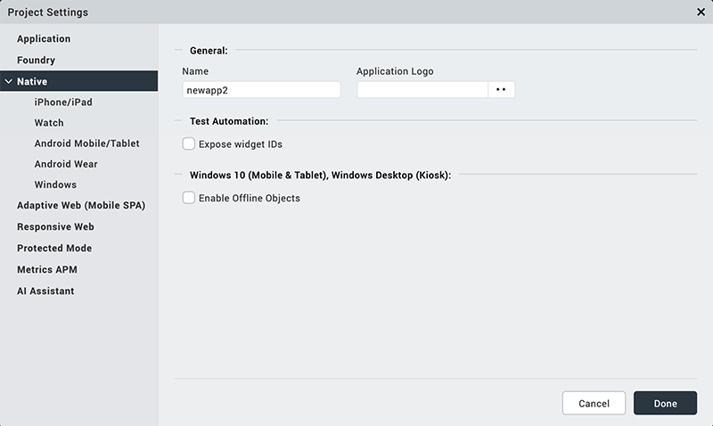

The following table describes all the fields in General settings.

<table class="TableStyle-Basic" style="mc-table-style: url('Resources/TableStyles/Basic.css');width: 100%;" cellspacing="0"><colgroup><col style="width: 20%;" class="TableStyle-Basic-Column-Column1"> <col style="width: 35%;" class="TableStyle-Basic-Column-Column1"> <col style="width: 45%;" class="TableStyle-Basic-Column-Column1"></colgroup><tbody><tr class="TableStyle-Basic-Body-Body1"><th class="TableStyle-Basic-BodyE-Column1-Body1" style="text-align: left;">Section Name</th><th class="TableStyle-Basic-BodyE-Column1-Body1" style="text-align: left;">Field Name</th><th class="TableStyle-Basic-BodyD-Column1-Body1" style="text-align: left;">Description</th></tr><tr class="TableStyle-Basic-Body-Body1"><td class="TableStyle-Basic-BodyE-Column1-Body1" style="text-align: left;" rowspan="2">General</td><td class="TableStyle-Basic-BodyE-Column1-Body1" style="text-align: left;">Name</td><td class="TableStyle-Basic-BodyD-Column1-Body1" style="text-align: left;">Name of the Native channel version of the application. If no name is specified, the name specified under Application Properties is used.</td></tr><tr class="TableStyle-Basic-Body-Body1"><td class="TableStyle-Basic-BodyE-Column1-Body1" style="text-align: left;">Application Logo</td><td class="TableStyle-Basic-BodyD-Column1-Body1" style="text-align: left;">Sets an image as the application logo.</td></tr><tr class="TableStyle-Basic-Body-Body1"><td class="TableStyle-Basic-BodyE-Column1-Body1" style="text-align: left;">Test Automation</td><td class="TableStyle-Basic-BodyE-Column1-Body1" style="text-align: left;">Expose widget IDs</td><td class="TableStyle-Basic-BodyD-Column1-Body1" style="text-align: left;">Exposes the widget IDs.</td></tr><tr class="TableStyle-Basic-Body-Body1"><td class="TableStyle-Basic-BodyB-Column1-Body1" style="text-align: left;">Windows 10 (Mobile &amp; Tablet), Windows Desktop (Kiosk)</td><td class="TableStyle-Basic-BodyB-Column1-Body1" style="text-align: left;">Enable Offline Objects</td><td class="TableStyle-Basic-BodyA-Column1-Body1" style="text-align: left;">Configures Offline objects for Windows 10 Mobile and Tablet, Windows Desktop (kiosk).</td></tr></tbody></table>

### iPhone/ iPad

Using iPhone/ iPad settings, you can configure iOS Build Settings, Certificates; set Deep link URL Scheme; configure Target Versions, iPad Settings, and App Icons.

Click to view the image

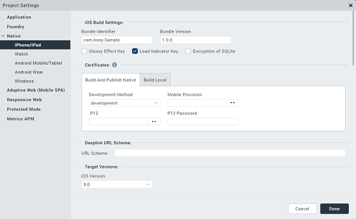

The following table describes about all the fields in iPhone/ iPad settings.

<table>
<tr>
<th>Section Name</th>
<th>Field Name</th>
<th>Description</th>
</tr>
<tr>
<td>iOS Build Settings</td>
<td>Bundle Identifier</td>
<td>A Unique name that identifies the application bundle. It usually consists of three parts and follows the convention of com.voltmx.&lt;appname&gt;</td>
</tr>
<tr>
<td></td>
<td>Bundle Version</td>
<td>A number that identifies the version of the application bundle.</td>
</tr>
<tr>
<td></td>
<td>Bundle Format</td>
<td>The file format of the binary to be generated after a successful app build. The available build formats are <b>.kar</b> and <b>.ipa</b>.</td>
</tr>
<tr>
<td></td>
<td>Glossy Effect key</td>
<td>Specifies if the glossy effect must be applied to the app icon.The default value is false.</td>
</tr>
<tr>
<td></td>
<td>Load indicator key</td>
<td>Configures the load indicator in an application.</td>
</tr>
<tr>
<td></td>
<td>Hide status bar</td>
<td>Hides the status bar in an application.</td>
</tr>
<tr>
<td>Protected Mode</td>
<td>Ensures that your app is not run on a rooted/jail-broken device. <b>Note:</b> This option works only if the application is built in Release mode.</td>
<td></td>
</tr>
<tr>
<td>Certificates</td>
<td>Development Method</td>
<td>Refer the <a href="https://support.hcltechsw.com/csm?id=kb_article&sysparm_article=KB0083760">article </a> to know about Development Method.</td>
</tr>
<tr>
<td></td>
<td>Mobile Provision</td>
<td>Refer the <a href="https://support.hcltechsw.com/csm?id=kb_article&sysparm_article=KB0083760">article </a> to know about Mobile Provision.</td>
</tr>
<tr>
<td></td>
<td>P12</td>
<td>Refer the <a href="https://support.hcltechsw.com/csm?id=kb_article&sysparm_article=KB0083760">article </a> to know about .P12</td>
</tr>
<tr>
<td></td>
<td>P12 Password</td>
<td>Refer to the <a href="https://support.hcltechsw.com/csm?id=kb_article&sysparm_article=KB0083760">article </a> to know about P12 Password.</td>
</tr>
<tr>
<td>Deeplink URL Scheme</td>
<td>URL Scheme</td>
<td>Specifies a URL to which the application will deep-link to. For more information about deep-linking, see <a href="AppServiceEvent.html">Appendix D: The App Service Event.</a></td>
</tr>
<tr>
<td>Target Versions</td>
<td>iOS Version</td>
<td>Configures your iOS version.</td>
</tr>
<tr>
<td>Target Versions</td>
<td>iOS Version</td>
<td>Configures your iOS version.</td>
</tr>
<tr>
<td>iPad Settings</td>
<td>Application Launch Mode</td>
<td>Specifies the default mode of launching the application on iPad. Portrait is the default value.</td>
</tr>
<tr>
<td></td>
<td>Supported Orientations</td>
<td>Specifies the supported orientations for the iPad. This depends on the launch mode.</td>
</tr>
<tr>
<td>App Icons</td>
<td>App Store 1x (iOS 1024 pt)</td>
<td>Each app in the App store can have an icon. Provide the image that you want displayed next to your app in the App Store. The default size of the icon should be 1024 pt.</td>
</tr>
<tr>
<td></td>
<td>Notification iOS 7-11 20pt (iPhone and iPad)</td>
<td>Apps that support notifications should provide a small icon to display in notifications. Provide an image that you want displayed in notifications for iOS 7-11.</td>
</tr>
<tr>
<td></td>
<td>Spot Light-Ios 5,6 Settings-iOS 5-11 29 Pt (iPhone)</td>
<td>Every app should provide a small icon that iOS can display when the app name matches the name in a Spotlight search. Provide an image that you want displayed during spotlight search for iPhone 5,6.</td>
</tr>
<tr>
<td></td>
<td>Spot Light-Ios 7-11 40 Pt (iPhone and iPad)</td>
<td>Provide an image that you want to display during spotlight search for iOS 7-11.</td>
</tr>
<tr>
<td></td>
<td>App-iOS 7-11 60 Pt (iPhone)</td>
<td>Provide an image that represents your app for iOS 7-11.</td>
</tr>
<tr>
<td></td>
<td>Settings-Ios 5-11 29 Pt</td>
<td>Apps with settings should provide a small icon to display in the built-in Settings app. Provide an image to display your app for iOS 5-11.</td>
</tr>
<tr>
<td></td>
<td>App-iOS 7-11 60 Pt (iPhone)</td>
<td>Provide an image that represents your app for iOS 7-11.</td>
</tr>
<tr>
<td>Platform Settings</td>
<td>Generic exception alert</td>
<td>When enabled, generic exception alerts like "system error" are fired and when disabled, detailed exception messages appear as alerts. The best practice is to keep the setting enabled for the release mode and disabled for the debug mode.</td>
</tr>
<tr>
<td></td>
<td>Exception alert</td>
<td>When enabled, the system displays an exception alert. When disabled, the app crashes without displaying any exception or alert. The best practice to follow is to enable the feature for both release and debug modes.</td>
</tr>
<tr>
<td></td>
<td>Paste Board Type</td>
<td>It will allow the user to copy paste content from the app to external writable area like message etc. <b>system level</b> - it will allow to copy paste into other applications. <b>Applevelpersistent</b> - it will allow to copy paste within the app and the messages are persistent will be available across the app restarts. <b>Applevelnonpersistent</b> - it will allow to copy paste within the app and the messages are Not persistent and will not be available across the app restarts. Nopasteboard - it will not allow paste anywhere.</td>
</tr>
<tr>
<td></td>
<td>Allow Self Signed Certificate</td>
<td>By default it is false, if true, it allows self signed certificate for development. <b>Note:</b> Self Signed Certificate option is only applicable if you use Network APIs in your application.</td>
</tr>
<tr>
<td></td>
<td>Input Accessory View Type</td>
<td>The input accessory view type for widgets like text box, calendar, grouped widgets etc where you have next previous cancel buttons. This can be overridden by form level Input Accessory View Type.</td>
</tr>
<tr>
<td></td>
<td>Anti Aliased Drawing</td>
<td>If enabled, allows smoother widgets and layout without any jagged edges.</td>
</tr>
<tr>
<td></td>
<td>Backward_compatibility_mode</td>
<td>It is disabled, by default, If enabled, it will allow the application feature to behave as it would have behaved on earlier version (if there is any behavioral change in the latest version)</td>
</tr>
<tr>
<td></td>
<td>extendTop</td>
<td>Lets you extend the top</td>
</tr>
<tr>
<td></td>
<td>extendBottom</td>
<td>Lets you extend the bottom</td>
</tr>
<tr>
<td></td>
<td>statusBarHidden</td>
<td>Lets you show or hide the status bar.</td>
</tr>

<tr>
<td></td>
<td>statusBarStyle</td>
<td>Lets you set a style for the status bar.</td>
</tr>
<tr>
<td></td>
<td>backgroundmodes</td>
<td>Allows you to choose the backgroud mode.</td>
</tr>
<tr>
<td></td>
<td>Camera Cancel Icon</td>
<td>Allows to set images to the icons which appear on the camera cancel icon, tap anywhere.</td>
</tr>
<tr>
<td></td>
<td>Camera Settings Icon</td>
<td>Allows to set images to the icons which appear on the camera settings icon, tap anywhere.</td>
</tr>
<tr>
<td></td>
<td>Entitlements</td>
<td>Sets the iOS capabilities with apple defined entitlement key and valuebased on the application requirements. For more information, refer the <a href="Adding_iOS_app_Capabilities.html">Volt Mx Iris Configuration File</a>.</td>
</tr>
</table>

For information on more configurations, refer [Native App Properties for iPhone](Native_App_Properties.md#iPhone).

### Watch

Using Watch settings, you can configure Target Versions, App Icons, and Notification icons for 38mm and 42 mm Apple Watches.

Click to view the image

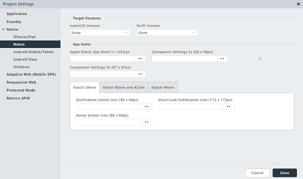

The following table describes all the fields in Watch settings.

| Section Name | Field Name | Description |
| --- | --- | --- |
| Target Versions | Watch OS Version | Configures the OS version number. |
|^^| Swift Version | Swift version number that the app is compatible with. |
| App Icons | Apple Watch App Store 1x 1024 pt | Each app in the Apple watch App store can have an icon. Provide the image that you want displayed next to your app in the App Store. |
|^^| Home Screen (All) (40 x 40) | Provide an image that represents your app on home screen. |
|^^| Companion Settings 2x | Configures companion app settings 2x. |
|^^| Companion Settings 3x | Configures companion app settings 3x. |
| Watch 38 mm | Notification Centre Icon | Apps that support notifications should provide a small icon to display in notifications for smart watches. Provide an image that you want displayed in notifications for watch 38 mm. |
|^^| Short- Look Notification Icon | Short-Look icon appears briefly, giving the wearer just enough time to scan a notification. Provide an image for the app icon in short look notifications for watch 38 mm. |
| Watch 40 mm and 42 mm | Notification Center Icon | Provide an image for app icon to display notifications in the center. |
|^^| Long-Look Notification Icon | Long-Look notifications display more information on screen from an app, such as message text and action buttons. Provide an image for app icon in long look notifications for 42 mm watch. |
|^^| Short-Look Notification Icon | Short-Look icon appears briefly, giving the wearer just enough time to scan a notification. Provide an image for app icon in short look notification for 42 mm watch. |
| Watch 44mm | Short-Look Notification Icon | Short-Look icon appears briefly, giving the wearer just enough time to scan a notification. Provide an image for app icon in short look notification for 42 mm watch. |

### Android Mobile/ Tablet

Using Android Mobile/ Tablet Settings you can configure General Settings, SDK versions, and Android signing.

Click to view the image

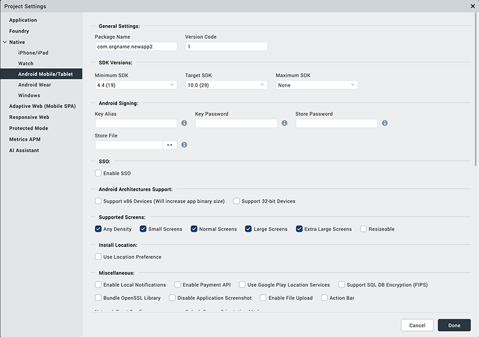

The following settings describe all the fields in Android Mobile/ Tablet settings.

<table class="TableStyle-Basic" style="mc-table-style: url]('Resources/TableStyles/Basic.css');border-top-left-radius: 0px;border-top-right-radius: 0px;border-bottom-right-radius: 0px;border-bottom-left-radius: 0px;border-left-style: solid;border-left-width: 2px;border-left-color: #a9a9a9;border-right-style: solid;border-right-width: 2px;border-right-color: #a9a9a9;border-top-style: solid;border-top-width: 2px;border-top-color: #a9a9a9;border-bottom-style: solid;border-bottom-width: 2px;border-bottom-color: #a9a9a9;width: 100%;margin-left: auto;margin-right: auto;" cellspacing="0"><colgroup><col style="width: 20%;" class="TableStyle-Basic-Column-Column1"><col style="width: 35%;" class="TableStyle-Basic-Column-Column1"><col style="width: 45%;" class="TableStyle-Basic-Column-Column1"></colgroup><tbody><tr class="TableStyle-Basic-Body-Body1"><th class="TableStyle-Basic-BodyE-Column1-Body1" style="text-align: left;">Section Name</th><th class="TableStyle-Basic-BodyE-Column1-Body1" style="text-align: left;">Field Name</th><th class="TableStyle-Basic-BodyD-Column1-Body1" style="text-align: left;">Description</th></tr><tr class="TableStyle-Basic-Body-Body1"><td class="TableStyle-Basic-BodyE-Column1-Body1" style="text-align: left;" rowspan="3">General Settings</td><td class="TableStyle-Basic-BodyE-Column1-Body1" style="text-align: left;">Package Name</td><td class="TableStyle-Basic-BodyD-Column1-Body1" style="text-align: left;">Package Name is the name used to search for an application in Google Play.Google Play is an online software store developed by Google for Android mobile devices. A software program called Market is pre-installed on most Android mobile devices. This software allows the users to browse and download third-party applications.<b><i>Note: </i></b>The name you specify for <i>Android Package</i> must contain at least two segments.A segment is a valid Java package name. The following are a few examples of valid Android Package names:<code class="file_names">com.hcl.&lt;ApplicationName&gt;</code><code class="file_names">com.voltmx.&lt;ApplicationName&gt;_Android</code></td></tr><tr class="TableStyle-Basic-Body-Body1"><td class="TableStyle-Basic-BodyE-Column1-Body1" style="text-align: left;">Version Code</td><td class="TableStyle-Basic-BodyD-Column1-Body1" style="text-align: left;">An internal version number, which is used to determine whether the application is a recent version. This version number is not shown to users. The value must be an integer. You can increase each version by one to indicate a newer version.</td></tr><tr><td/>Build Format<td class="TableStyle-TemenosTables-BodyD-Column1-Body1" style="text-align: left;">
The file format of the binary to be generated after a successful app build. The available build formats are <b>.apk</b> and <b>.aab</b>.

For information on how to extract and install the .aab file on a device, refer <a href="Native_App_Properties.html#generate-android-app-bundle">Generate Android App Bundle</a>.
</td></tr><tr class="TableStyle-Basic-Body-Body1"><td class="TableStyle-Basic-BodyE-Column1-Body1" style="text-align: left;" rowspan="3">SDK Versions</td><td class="TableStyle-Basic-BodyE-Column1-Body1" style="text-align: left;">Minimum SDK</td><td class="TableStyle-Basic-BodyD-Column1-Body1" style="text-align: left;">Select the <b>Minimum</b> SDK Version that needs to be supported for the application.<b><i>Note: </i></b>The application must be built with a minimum version matching the device SDK&nbsp;version. For example, a device with 5.0 version of SDK&nbsp;cannot run an application built on 4.0. &nbsp;</td></tr><tr class="TableStyle-Basic-Body-Body1"><td class="TableStyle-Basic-BodyE-Column1-Body1" style="text-align: left;">Target SDK</td><td class="TableStyle-Basic-BodyD-Column1-Body1" style="text-align: left;">Select the <b>Target</b> SDK Version that needs to be supported for the application.<b><i>Note: </i></b>The Target SDK Version must be greater than or equal to the Minimum SDK Version.</td></tr><tr class="TableStyle-Basic-Body-Body1"><td class="TableStyle-Basic-BodyE-Column1-Body1" style="text-align: left;">Maximum SDK</td><td class="TableStyle-Basic-BodyD-Column1-Body1" style="text-align: left;">Select the <b>Maximum</b> SDK Version that needs to be supported for the application.</td></tr><tr class="TableStyle-Basic-Body-Body1"><td class="TableStyle-Basic-BodyE-Column1-Body1" style="text-align: left;" rowspan="4">Android Signing</td><td class="TableStyle-Basic-BodyE-Column1-Body1" style="text-align: left;">Key Alias</td><td class="TableStyle-Basic-BodyD-Column1-Body1" style="text-align: left;">Used to sign the android binary automatically during the build process. Enter the alias of the key.</td></tr><tr class="TableStyle-Basic-Body-Body1"><td class="TableStyle-Basic-BodyE-Column1-Body1" style="text-align: left;">Key Password</td><td class="TableStyle-Basic-BodyD-Column1-Body1" style="text-align: left;">Enter the password for the key.</td></tr><tr class="TableStyle-Basic-Body-Body1"><td class="TableStyle-Basic-BodyE-Column1-Body1" style="text-align: left;">Store Password</td><td class="TableStyle-Basic-BodyD-Column1-Body1" style="text-align: left;">Enter the password for the store.</td></tr><tr class="TableStyle-Basic-Body-Body1"><td class="TableStyle-Basic-BodyE-Column1-Body1" style="text-align: left;">Store File</td><td class="TableStyle-Basic-BodyD-Column1-Body1" style="text-align: left;">Locate and configure the store file.</td></tr><tr class="TableStyle-Basic-Body-Body1"><td class="TableStyle-Basic-BodyE-Column1-Body1" style="text-align: left;">SSO</td><td class="TableStyle-Basic-BodyE-Column1-Body1" style="text-align: left;">Enable SSO</td><td class="TableStyle-Basic-BodyD-Column1-Body1" style="text-align: left;">Select this option to enable the Single-Sign-On option for your app.</td></tr><tr class="TableStyle-Basic-Body-Body1"><td class="TableStyle-Basic-BodyE-Column1-Body1" style="text-align: left;" rowspan="2">Support for Margin in Pixels</td><td class="TableStyle-Basic-BodyE-Column1-Body1" style="text-align: left;">True</td><td class="TableStyle-Basic-BodyD-Column1-Body1" style="text-align: left;">Supports margin in Pixels.</td></tr><tr class="TableStyle-Basic-Body-Body1"><td class="TableStyle-Basic-BodyE-Column1-Body1" style="text-align: left;">False</td><td class="TableStyle-Basic-BodyD-Column1-Body1" style="text-align: left;">Disables the support for margin in pixels.</td></tr><tr class="TableStyle-Basic-Body-Body1"><td class="TableStyle-Basic-BodyE-Column1-Body1" style="text-align: left;" rowspan="2">Android Architectures Support</td><td class="TableStyle-Basic-BodyE-Column1-Body1" style="text-align: left;">Support x86 Devices (Will increase app binary size)</td><td class="TableStyle-Basic-BodyD-Column1-Body1" style="text-align: left;">Select this option to support any Android-x86 devices. Enabling this option increases the size of the binary that is generated.</td></tr><tr class="TableStyle-Basic-Body-Body1"><td class="TableStyle-Basic-BodyE-Column1-Body1" style="text-align: left;">Support 32-bit Devices</td><td class="TableStyle-Basic-BodyD-Column1-Body1" style="text-align: left;">Select this option to build an Android APK with 32-bit support.</td></tr><tr class="TableStyle-Basic-Body-Body1"><td class="TableStyle-Basic-BodyE-Column1-Body1" style="text-align: left;" rowspan="6">Supported Screens</td><td class="TableStyle-Basic-BodyE-Column1-Body1" style="text-align: left;">Any Density</td><td class="TableStyle-Basic-BodyD-Column1-Body1" style="text-align: left;">If this option is enabled, the application can accommodate any screen density for a resource.</td></tr><tr class="TableStyle-Basic-Body-Body1"><td class="TableStyle-Basic-BodyE-Column1-Body1" style="text-align: left;">Small Screens</td><td class="TableStyle-Basic-BodyD-Column1-Body1" style="text-align: left;">If this option is enabled, the application supports smaller screen form-factors.</td></tr><tr class="TableStyle-Basic-Body-Body1"><td class="TableStyle-Basic-BodyE-Column1-Body1" style="text-align: left;">Normal Screens</td><td class="TableStyle-Basic-BodyD-Column1-Body1" style="text-align: left;">If this option is enabled, the application supports normal screen form-factors.</td></tr><tr class="TableStyle-Basic-Body-Body1"><td class="TableStyle-Basic-BodyE-Column1-Body1" style="text-align: left;">Large Screens</td><td class="TableStyle-Basic-BodyD-Column1-Body1" style="text-align: left;">If this option is enabled, the application supports larger screen form-factors.</td></tr><tr class="TableStyle-Basic-Body-Body1"><td class="TableStyle-Basic-BodyE-Column1-Body1" style="text-align: left;">Extra Large Screens</td><td class="TableStyle-Basic-BodyD-Column1-Body1" style="text-align: left;">If this option is enabled, the application supports extra large screen form-factors.</td></tr><tr class="TableStyle-Basic-Body-Body1"><td class="TableStyle-Basic-BodyE-Column1-Body1" style="text-align: left;">Resizable</td><td class="TableStyle-Basic-BodyD-Column1-Body1" style="text-align: left;">If this option is enabled, the application is resizable for different screen sizes.</td></tr><tr class="TableStyle-Basic-Body-Body1"><td class="TableStyle-Basic-BodyE-Column1-Body1" style="text-align: left;">Install Location</td><td class="TableStyle-Basic-BodyE-Column1-Body1" style="text-align: left;">Use Location Preference</td><td class="TableStyle-Basic-BodyD-Column1-Body1" style="text-align: left;">This property defines the location where the application is deployed.</td></tr><tr class="TableStyle-Basic-Body-Body1"><td class="TableStyle-Basic-BodyE-Column1-Body1" style="text-align: left;" rowspan="10">Miscellaneous</td><td class="TableStyle-Basic-BodyE-Column1-Body1" style="text-align: left;">Enable Local Notifications</td><td class="TableStyle-Basic-BodyD-Column1-Body1" style="text-align: left;">Select this option to enable notifications scheduled by an app and delivered on the same device.</td></tr><tr class="TableStyle-Basic-Body-Body1"><td class="TableStyle-Basic-BodyE-Column1-Body1" style="text-align: left;">Enable Payment API</td><td class="TableStyle-Basic-BodyD-Column1-Body1" style="text-align: left;">Selecting this option enables online transactions in applications.</td></tr><tr class="TableStyle-Basic-Body-Body1"><td class="TableStyle-Basic-BodyE-Column1-Body1" style="text-align: left;">Use Google Play Location Services</td><td class="TableStyle-Basic-BodyD-Column1-Body1" style="text-align: left;">Select this option to enable location service based on the Google Play Location Service API.</td></tr><tr class="TableStyle-Basic-Body-Body1"><td class="TableStyle-Basic-BodyE-Column1-Body1" style="text-align: left;">Support SQL DB Encryption (FIPS)</td><td class="TableStyle-Basic-BodyD-Column1-Body1" style="text-align: left;">If you select this option, Volt MX Iris automatically bundles Federal Information Processing Standard (FIPS) compliant SQL Cipher third-party library with the application that is used in SQL DB encryption.</td></tr><tr class="TableStyle-Basic-Body-Body1"><td class="TableStyle-Basic-BodyE-Column1-Body1" style="text-align: left;">Bundle OpenSSL Library</td><td class="TableStyle-Basic-BodyD-Column1-Body1" style="text-align: left;">If you select Bundle OpenSSL Library option, Volt MX Iris automatically bundles a third-party OpenSSL native library along with the application that supports additional hashing algorithms that are not supported by the native Android PBKDF2 and HMAC cryptography APIs.</td></tr><tr class="TableStyle-Basic-Body-Body1"><td class="TableStyle-Basic-BodyE-Column1-Body1" style="text-align: left;">Disable Application Screenshot</td><td class="TableStyle-Basic-BodyD-Column1-Body1" style="text-align: left;">This option specifies whether the user can take a screenshot of your application.</td></tr><tr class="TableStyle-Basic-Body-Body1"><td class="TableStyle-Basic-BodyE-Column1-Body1" style="text-align: left;">Enable File Upload</td><td class="TableStyle-Basic-BodyD-Column1-Body1" style="text-align: left;">Adds the Apache HTTP Library that supports the upload of files to a remote sever by using the <a href="../../../Iris/iris_api_dev_guide/content/voltmx.net_functions.html">HttpRequest API</a>.</td></tr><tr class="TableStyle-Basic-Body-Body1"><td class="TableStyle-Basic-BodyE-Column1-Body1" style="text-align: left;">ActionBar</td><td class="TableStyle-Basic-BodyD-Column1-Body1" style="text-align: left;">Enabled only if target SDK is 3.0 or above. Use this option to enable <i>Action Bar</i> feature.</td></tr><tr class="TableStyle-Basic-Body-Body1"><td class="TableStyle-Basic-BodyE-Column1-Body1" style="text-align: left;">Network Trust Config</td><td class="TableStyle-Basic-BodyD-Column1-Body1" style="text-align: left;">Using this option, you can control the certificates that are used by your app for secure network communication.For information on more configurations, refer <a href="Native_App_Properties.html#AllowSelfSignedCertis">Network Trust Config for Android</a>.</td></tr><tr class="TableStyle-Basic-Body-Body1"><td class="TableStyle-Basic-BodyE-Column1-Body1" style="text-align: left;">Splash Screen Orientation Mode</td><td class="TableStyle-Basic-BodyD-Column1-Body1" style="text-align: left;">Set the orientation mode of the Splash Screen.</td></tr><tr class="TableStyle-Basic-Body-Body1"><td class="TableStyle-Basic-BodyE-Column1-Body1" style="text-align: left;" rowspan="3">Communication APIs</td><td class="TableStyle-Basic-BodyE-Column1-Body1" style="text-align: left;">Use Watch Communication APIs</td><td class="TableStyle-Basic-BodyD-Column1-Body1" style="text-align: left;">Enables communication between the mobile/tablet and a watch.</td></tr><tr class="TableStyle-Basic-Body-Body1"><td class="TableStyle-Basic-BodyE-Column1-Body1" style="text-align: left;">Add Watch Background Listener To Receive Data Payload</td><td class="TableStyle-Basic-BodyD-Column1-Body1" style="text-align: left;">Enables DataItem reception form the watch when the app is in the background.</td></tr><tr class="TableStyle-Basic-Body-Body1"><td class="TableStyle-Basic-BodyE-Column1-Body1" style="text-align: left;">Add Watch Background Listener To Receive Message Payload</td><td class="TableStyle-Basic-BodyD-Column1-Body1" style="text-align: left;">Enables message payload reception form the watch when the app is in the background.</td></tr><tr class="TableStyle-Basic-Body-Body1"><td class="TableStyle-Basic-BodyE-Column1-Body1" style="text-align: left;">Push Notification</td><td class="TableStyle-Basic-BodyE-Column1-Body1" style="text-align: left;">GCM/FCM</td><td class="TableStyle-Basic-BodyD-Column1-Body1" style="text-align: left;">Select this option to enable Push Notifications for the application. This option copies the libraries required for push notification into the project during build time.</td></tr><tr class="TableStyle-TemenosTables-Body-Body1" data-mc-conditions="Default.V9SP3"><td class="TableStyle-TemenosTables-BodyE-Column1-Body1" style="text-align: left;">Android Universal Settings</td><td class="TableStyle-TemenosTables-BodyE-Column1-Body1" style="text-align: left;">Universal App Tablet Breakpoint</td><td class="TableStyle-TemenosTables-BodyD-Column1-Body1" style="text-align: left;">The threshold value (in inches) that identifies a device as a Tablet for an Android universal binary app. The default value for the Universal App Tablet Size is 6 inches.</td></tr><tr class="TableStyle-Basic-Body-Body1"><td class="TableStyle-Basic-BodyE-Column1-Body1" style="text-align: left;" rowspan="3">Manifest Permissions, Tags and Gradle Build Entries</td><td class="TableStyle-Basic-BodyE-Column1-Body1" style="text-align: left;">Permissions</td><td class="TableStyle-Basic-BodyD-Column1-Body1" style="text-align: left;">Sets the permissions to true or false based on the application requirements. Set the appropriate permissions for Android Manifest file. For more information, refer <a href="AndroidManifest_File.html">The Android Manifest File</a>.To enable permissions, select the permissions from the left pane and click <b>Add &gt;</b>. To disable permissions, select the permissions from the right pane and click <b>&lt; Remove</b>.</td></tr><tr class="TableStyle-Basic-Body-Body1"><td class="TableStyle-Basic-BodyE-Column1-Body1" style="text-align: left;">Tags</td><td class="TableStyle-Basic-BodyD-Column1-Body1" style="text-align: left;">Adds tags to the Android manifest file directly from Volt MX Iris by specifying tag entries and attributes on the <b>Tags</b> tab. You can specify child tag entries and attributes for &lt;manifest&gt; and &lt;application&gt; tags and the Main Launcher &lt;activity&gt; tag. For more information on the tags you can add with the manifest or application tags, refer <a href="http://developer.android.com/guide/topics/manifest/manifest-intro.html">http://developer.android.com/guide/topics/manifest/manifest-intro.html</a>.</td></tr><tr class="TableStyle-Basic-Body-Body1"><td class="TableStyle-Basic-BodyB-Column1-Body1" style="text-align: left;">Gradle Entries</td><td class="TableStyle-Basic-BodyA-Column1-Body1" style="text-align: left;">Imports additional gradle packages, applies external plugins, or specifies build-related configuration information, build dependencies, or the location of any external repositories or modules used by your Android application. For information on more configurations, refer <a href="Native_App_Properties.html#GradleEntries">Android Gradle entries</a>.</td></tr></tbody></table>

For information on more configurations, refer [Native App Properties for Android](Native_App_Properties.md#Under_Android_tab:).

### Android Wear

Using Android Wear Settings you can configure General Settings, SDK versions, and Android signing.

Click to view the image

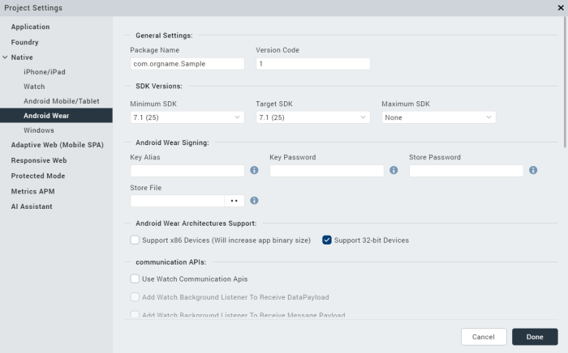

The following settings describe all the fields in Android Wear settings.

<table class="TableStyle-Basic" style="mc-table-style: url]('Resources/TableStyles/Basic.css');width: 100%;" cellspacing="0"><colgroup><col style="width: 20%;" class="TableStyle-Basic-Column-Column1"><col style="width: 35%;" class="TableStyle-Basic-Column-Column1"><col style="width: 45%;" class="TableStyle-Basic-Column-Column1"></colgroup><tbody><tr class="TableStyle-Basic-Body-Body1"><th class="TableStyle-Basic-BodyE-Column1-Body1" style="text-align: left;">Section Name</th><th class="TableStyle-Basic-BodyE-Column1-Body1" style="text-align: left;">Field Name</th><th class="TableStyle-Basic-BodyD-Column1-Body1" style="text-align: left;">Description</th></tr><tr class="TableStyle-Basic-Body-Body1"><td class="TableStyle-Basic-BodyE-Column1-Body1" style="text-align: left;" rowspan="2">General Settings</td><td class="TableStyle-Basic-BodyE-Column1-Body1" style="text-align: left;">Package Name</td><td class="TableStyle-Basic-BodyD-Column1-Body1" style="text-align: left;">Package Name is the name used to search for an application in Google Play.Google Play is an online software store developed by Google for Android mobile devices. A software program called Market is pre-installed on most Android mobile devices. This software allows the users to browse and download third-party applications.<b><i>Note: </i></b>The name you specify for <i>Android Package</i> must contain at least two segments.A segment is a valid Java package name. The following are a few examples of valid Android Package names:<code class="file_names">com.hcl.&lt;ApplicationName&gt;</code><code class="file_names">com.voltmx.&lt;ApplicationName&gt;_Android</code></td></tr><tr class="TableStyle-Basic-Body-Body1"><td class="TableStyle-Basic-BodyE-Column1-Body1" style="text-align: left;">Version Code</td><td class="TableStyle-Basic-BodyD-Column1-Body1" style="text-align: left;">An internal version number, which is used to determine whether the application is a recent version. This version number is not shown to users. The value must be an integer. You can increase each version by one to indicate a newer version.</td></tr><tr class="TableStyle-Basic-Body-Body1"><td class="TableStyle-Basic-BodyE-Column1-Body1" style="text-align: left;" rowspan="3">SDK Versions</td><td class="TableStyle-Basic-BodyE-Column1-Body1" style="text-align: left;">Minimum SDK</td><td class="TableStyle-Basic-BodyD-Column1-Body1" style="text-align: left;">Select the <b>Minimum</b> SDK Version that needs to be supported for the application. <b><i>Note: </i></b>The application must be built with a minimum version matching the device SDK&nbsp;version. For example, a device with 5.0 version of SDK&nbsp;cannot run an application built on 4.0. &nbsp;</td></tr><tr class="TableStyle-Basic-Body-Body1"><td class="TableStyle-Basic-BodyE-Column1-Body1" style="text-align: left;">Target SDK</td><td class="TableStyle-Basic-BodyD-Column1-Body1" style="text-align: left;">Select the <b>Target</b> SDK Version that needs to be supported for the application.<b><i>Note: </i></b>The Target SDK Version must be greater than or equal to the Minimum SDK Version.</td></tr><tr class="TableStyle-Basic-Body-Body1"><td class="TableStyle-Basic-BodyE-Column1-Body1" style="text-align: left;">Maximum SDK</td><td class="TableStyle-Basic-BodyD-Column1-Body1" style="text-align: left;">Select the <b>Maximum</b> SDK Version that needs to be supported for the application. The maximum SDK value is 9.</td></tr><tr class="TableStyle-Basic-Body-Body1"><td class="TableStyle-Basic-BodyE-Column1-Body1" style="text-align: left;" rowspan="4">Android Signing</td><td class="TableStyle-Basic-BodyE-Column1-Body1" style="text-align: left;">Key Alias</td><td class="TableStyle-Basic-BodyD-Column1-Body1" style="text-align: left;">Used to sign the android binary automatically during the build process. Enter the alias of the key.</td></tr><tr class="TableStyle-Basic-Body-Body1"><td class="TableStyle-Basic-BodyE-Column1-Body1" style="text-align: left;">Key Password</td><td class="TableStyle-Basic-BodyD-Column1-Body1" style="text-align: left;">Enter the password for the key.</td></tr><tr class="TableStyle-Basic-Body-Body1"><td class="TableStyle-Basic-BodyE-Column1-Body1" style="text-align: left;">Store Password</td><td class="TableStyle-Basic-BodyD-Column1-Body1" style="text-align: left;">Enter the password for the store.</td></tr><tr class="TableStyle-Basic-Body-Body1"><td class="TableStyle-Basic-BodyE-Column1-Body1" style="text-align: left;">Store File</td><td class="TableStyle-Basic-BodyD-Column1-Body1" style="text-align: left;">Locate and configure the store file.</td></tr><tr class="TableStyle-Basic-Body-Body1"><td class="TableStyle-Basic-BodyE-Column1-Body1" style="text-align: left;" rowspan="2">Android Wear Architectures Support</td><td class="TableStyle-Basic-BodyE-Column1-Body1" style="text-align: left;">Support x86 Devices (Will increase app binary size)</td><td class="TableStyle-Basic-BodyD-Column1-Body1" style="text-align: left;">Select this option to support any Android-x86 devices. Enabling this option increases the size of the binary that is generated.</td></tr><tr class="TableStyle-Basic-Body-Body1"><td class="TableStyle-Basic-BodyE-Column1-Body1" style="text-align: left;">Support 32-bit Devices</td><td class="TableStyle-Basic-BodyD-Column1-Body1" style="text-align: left;">Select this option to build an Android APK with 32-bit support.</td></tr><tr class="TableStyle-Basic-Body-Body1"><td class="TableStyle-Basic-BodyE-Column1-Body1" style="text-align: left;" rowspan="3">Communication APIs</td><td class="TableStyle-Basic-BodyE-Column1-Body1" style="text-align: left;">Use Watch Communication APIs</td><td class="TableStyle-Basic-BodyD-Column1-Body1" style="text-align: left;">Enables communication between the mobile/tablet and a watch.</td></tr><tr class="TableStyle-Basic-Body-Body1"><td class="TableStyle-Basic-BodyE-Column1-Body1" style="text-align: left;">Add Watch Background Listener To Receive Data Payload</td><td class="TableStyle-Basic-BodyD-Column1-Body1" style="text-align: left;">Enables DataItem reception form the mobile/tablet device when the app is in the background.</td></tr><tr class="TableStyle-Basic-Body-Body1"><td class="TableStyle-Basic-BodyE-Column1-Body1" style="text-align: left;">Add Watch Background Listener To Receive Message Payload</td><td class="TableStyle-Basic-BodyD-Column1-Body1" style="text-align: left;">Enables message payload reception form the mobile/tablet device when the app is in the background.</td></tr><tr class="TableStyle-Basic-Body-Body1"><td class="TableStyle-Basic-BodyE-Column1-Body1" style="text-align: left;">Push Notification</td><td class="TableStyle-Basic-BodyE-Column1-Body1" style="text-align: left;">GCM/FCM</td><td class="TableStyle-Basic-BodyD-Column1-Body1" style="text-align: left;">Select this option to enable Push Notifications for the application. This option copies the libraries required for push notification into the project during build time.</td></tr><tr class="TableStyle-Basic-Body-Body1"><td class="TableStyle-Basic-BodyE-Column1-Body1" style="text-align: left;" rowspan="7">Miscellaneous</td><td class="TableStyle-Basic-BodyE-Column1-Body1" style="text-align: left;">Enable Local Notifications</td><td class="TableStyle-Basic-BodyD-Column1-Body1" style="text-align: left;">Select this option to enable notifications scheduled by an app and delivered on the same device.</td></tr><tr class="TableStyle-Basic-Body-Body1"><td class="TableStyle-Basic-BodyE-Column1-Body1" style="text-align: left;">Use Google Play Location Services</td><td class="TableStyle-Basic-BodyD-Column1-Body1" style="text-align: left;">Select this option to enable location service based on the Google Play Location Service API.</td></tr><tr class="TableStyle-Basic-Body-Body1"><td class="TableStyle-Basic-BodyE-Column1-Body1" style="text-align: left;">Support SQL DB Encryption (FIPS)</td><td class="TableStyle-Basic-BodyD-Column1-Body1" style="text-align: left;">If you select this option, Volt MX Iris automatically bundles Federal Information Processing Standard (FIPS) compliant SQL Cipher third-party library with the application that is used in SQL DB encryption.</td></tr><tr class="TableStyle-Basic-Body-Body1"><td class="TableStyle-Basic-BodyE-Column1-Body1" style="text-align: left;">Bundle OpenSSL Library</td><td class="TableStyle-Basic-BodyD-Column1-Body1" style="text-align: left;">If you select Bundle OpenSSL Library option, Volt MX Iris automatically bundles a third-party OpenSSL native library along with the application that supports additional hashing algorithms that are not supported by the native Android PBKDF2 and HMAC cryptography APIs.</td></tr><tr class="TableStyle-Basic-Body-Body1"><td class="TableStyle-Basic-BodyE-Column1-Body1" style="text-align: left;">Disable Application Screenshot</td><td class="TableStyle-Basic-BodyD-Column1-Body1" style="text-align: left;">This option specifies whether the user can take a screenshot of your application.</td></tr><tr class="TableStyle-Basic-Body-Body1"><td class="TableStyle-Basic-BodyE-Column1-Body1" style="text-align: left;">Enable File Upload</td><td class="TableStyle-Basic-BodyD-Column1-Body1" style="text-align: left;">Adds the Apache HTTP Library that supports the upload of files to a remote sever by using the <a href="../../../Iris/iris_api_dev_guide/content/voltmx.net_functions.html">HttpRequest API</a>.</td></tr><tr class="TableStyle-Basic-Body-Body1"><td class="TableStyle-Basic-BodyE-Column1-Body1" style="text-align: left;">Network Trust Config</td><td class="TableStyle-Basic-BodyD-Column1-Body1" style="text-align: left;">Using this option, you can control the certificates that are used by your app for secure network communication.For information on more configurations, refer <a href="Native_App_Properties.html#AllowSelfSignedCertis">Network Trust Config for Android</a>.</td></tr><tr class="TableStyle-Basic-Body-Body1"><td class="TableStyle-Basic-BodyE-Column1-Body1" style="text-align: left;" rowspan="3">Manifest Permissions, Tags and Gradle Build Entries</td><td class="TableStyle-Basic-BodyE-Column1-Body1" style="text-align: left;">Permissions</td><td class="TableStyle-Basic-BodyD-Column1-Body1" style="text-align: left;">Sets the permissions to true or false based on the application requirements. Set the appropriate permissions for Android Manifest file. For more information, refer <a href="AndroidManifest_File.html">The Android Manifest File</a>.To enable permissions, select the permissions from the left pane and click <b>Add &gt;</b>. To disable permissions, select the permissions from the right pane and click <b>&lt; Remove</b>.</td></tr><tr class="TableStyle-Basic-Body-Body1"><td class="TableStyle-Basic-BodyE-Column1-Body1" style="text-align: left;">Tags</td><td class="TableStyle-Basic-BodyD-Column1-Body1" style="text-align: left;">Adds tags to the Android manifest file directly from Volt MX Iris by specifying tag entries and attributes on the <b>Tags</b> tab. You can specify child tag entries and attributes for &lt;manifest&gt; and &lt;application&gt; tags and the Main Launcher &lt;activity&gt; tag. For more information on the tags you can add with the manifest or application tags, refer <a href="http://developer.android.com/guide/topics/manifest/manifest-intro.html">http://developer.android.com/guide/topics/manifest/manifest-intro.html</a>.</td></tr><tr class="TableStyle-Basic-Body-Body1"><td class="TableStyle-Basic-BodyB-Column1-Body1" style="text-align: left;">Gradle Entries</td><td class="TableStyle-Basic-BodyA-Column1-Body1" style="text-align: left;">Imports additional gradle packages, applies external plugins, or specifies build-related configuration information, build dependencies, or the location of any external repositories or modules used by your Android application. For information on more configurations, refer <a href="Native_App_Properties.html#GradleEntries">Android Gradle entries</a>.</td></tr></tbody></table>

For information on more configurations, refer [Native App Properties for Android](Native_App_Properties.md#Under_Android_tab:).

### Windows

Using Windows Settings, you can configure General Application UI Settings and Capabilities for a Windows app.

Click to view the image

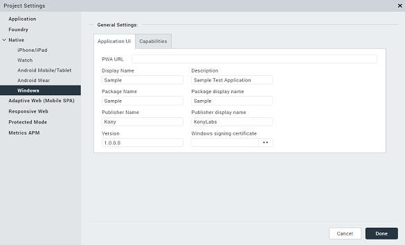

The following table describes all the fields in Windows Phone Settings.

<table class="TableStyle-Basic" style="mc-table-style: url('Resources/TableStyles/Basic.css');width: 100%;" cellspacing="0"><colgroup><col style="width: 20%;" class="TableStyle-Basic-Column-Column1"><col style="width: 35%;" class="TableStyle-Basic-Column-Column1"><col style="width: 45%;" class="TableStyle-Basic-Column-Column1"></colgroup><tbody><tr class="TableStyle-Basic-Body-Body1"><th class="TableStyle-Basic-BodyE-Column1-Body1" style="text-align: left;">Section Name</th><th class="TableStyle-Basic-BodyE-Column1-Body1" style="text-align: left;">Field Name</th><th class="TableStyle-Basic-BodyD-Column1-Body1" style="text-align: left;">Field Name</th></tr><tr class="TableStyle-Basic-Body-Body1"><td class="TableStyle-Basic-BodyE-Column1-Body1" style="text-align: left;" rowspan="9">Application UI</td><td class="TableStyle-Basic-BodyE-Column1-Body1" style="text-align: left;">PWA URL</td><td class="TableStyle-Basic-BodyD-Column1-Body1" style="text-align: left;">If you want to generate a windows native application from a PWA app, specify the URL of the published Progressive Web App.</td></tr><tr class="TableStyle-Basic-Body-Body1"><td class="TableStyle-Basic-BodyE-Column1-Body1" style="text-align: left;">Display name</td><td class="TableStyle-Basic-BodyD-Column1-Body1" style="text-align: left;">Specifies the display name of the application visible in the applications list.</td></tr><tr class="TableStyle-Basic-Body-Body1"><td class="TableStyle-Basic-BodyE-Column1-Body1" style="text-align: left;">Description</td><td class="TableStyle-Basic-BodyD-Column1-Body1" style="text-align: left;">Specifies the description to be displayed on the tile i.e in the Set Default Programs UI. For example a tile on finance can contain a generic description about stocks.</td></tr><tr class="TableStyle-Basic-Body-Body1"><td class="TableStyle-Basic-BodyE-Column1-Body1" style="text-align: left;">Package name</td><td class="TableStyle-Basic-BodyD-Column1-Body1" style="text-align: left;">A unique name to identify a specific application. It is generally in the format <code class="file_names">domain.company.application</code></td></tr><tr class="TableStyle-Basic-Body-Body1"><td class="TableStyle-Basic-BodyE-Column1-Body1" style="text-align: left;">Package display name</td><td class="TableStyle-Basic-BodyD-Column1-Body1" style="text-align: left;">The name with which the application is submitted to the Microsoft Store. This name is used to search the application in the Microsoft Store.</td></tr><tr class="TableStyle-Basic-Body-Body1"><td class="TableStyle-Basic-BodyE-Column1-Body1" style="text-align: left;">Publisher name</td><td class="TableStyle-Basic-BodyD-Column1-Body1" style="text-align: left;">The publisher of the app. This name specifies the Subject field of the Signing certificate that is used to authenticate the package. The default value is the name of the project. This attribute is required for certain types of apps, such as push-enabled apps.</td></tr><tr class="TableStyle-Basic-Body-Body1"><td class="TableStyle-Basic-BodyE-Column1-Body1" style="text-align: left;">Publisher display name</td><td class="TableStyle-Basic-BodyD-Column1-Body1" style="text-align: left;">Specifies the name that is displayed on the Publisher Name field on the Developer Website.</td></tr><tr class="TableStyle-Basic-Body-Body1"><td class="TableStyle-Basic-BodyE-Column1-Body1" style="text-align: left;">Version</td><td class="TableStyle-Basic-BodyD-Column1-Body1" style="text-align: left;">Internal version number of the package.</td></tr><tr class="TableStyle-Basic-Body-Body1"><td class="TableStyle-Basic-BodyE-Column1-Body1" style="text-align: left;">Windows signing certificate</td><td class="TableStyle-Basic-BodyD-Column1-Body1" style="text-align: left;">If you have a certificate to publish an app to the Microsoft store, you can upload the certificate in this field.</td></tr><tr class="TableStyle-Basic-Body-Body1"><td class="TableStyle-Basic-BodyB-Column1-Body1">Capabilities</td><td class="TableStyle-Basic-BodyB-Column1-Body1" style="text-align: left;">&nbsp;</td><td class="TableStyle-Basic-BodyA-Column1-Body1" style="text-align: left;">Set the permissions to true or false based on the application's requirements. For more information about each of the permissions refer <a href="https://docs.microsoft.com/en-us/windows/uwp/packaging/app-capability-declarations" target="_blank">Capabilities and requirements</a>.To enable permissions, select the permissions that are currently <i>false</i> and click <b>Add &gt;</b>.To disable permissions, select the permissions that are currently <i>true</i> and click <b>&lt; Remove</b>.</td></tr></tbody></table>

Adaptive Web (Mobile SPA)
-------------------------

Adaptive Web (Mobile SPA) is the browser on the device. Adaptive Web (Mobile SPA) properties define the properties of the application on Adaptive Web (Mobile SPA) for various platforms. You can set the Shortcut icons for the application, configure Async mode, and define Base fonts.

Click to view the image

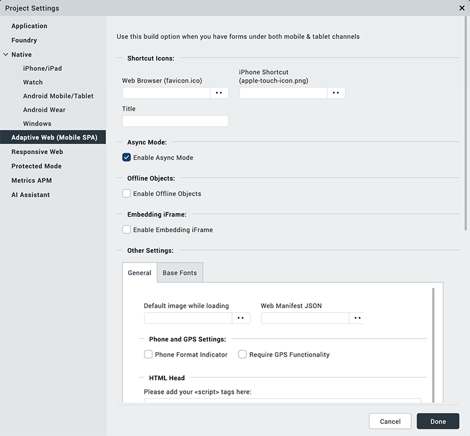

The following table describes all the fields in Mobile Web settings.

<table class="TableStyle-Basic" style="mc-table-style: url('Resources/TableStyles/Basic.css');width: 100%;" cellspacing="0"><colgroup><col style="width: 20%;" class="TableStyle-Basic-Column-Column1"><col style="width: 35%;" class="TableStyle-Basic-Column-Column1"><col style="width: 45%;" class="TableStyle-Basic-Column-Column1"></colgroup><tbody><tr class="TableStyle-Basic-Body-Body1"><th class="TableStyle-Basic-BodyE-Column1-Body1" style="text-align: left;">Section Name</th><th class="TableStyle-Basic-BodyE-Column1-Body1" style="text-align: left;">Field Name</th><th class="TableStyle-Basic-BodyD-Column1-Body1" style="text-align: left;">Description</th></tr><tr class="TableStyle-Basic-Body-Body1"><td class="TableStyle-Basic-BodyE-Column1-Body1" style="text-align: left;" rowspan="3">Shortcut Icons</td><td class="TableStyle-Basic-BodyE-Column1-Body1" style="text-align: left;">Web Browser</td><td class="TableStyle-Basic-BodyD-Column1-Body1" style="text-align: left;">Configures an icon to represent the app in a web browser.</td></tr><tr class="TableStyle-Basic-Body-Body1"><td class="TableStyle-Basic-BodyE-Column1-Body1" style="text-align: left;">iPhone Shortcut</td><td class="TableStyle-Basic-BodyD-Column1-Body1" style="text-align: left;">Configures an icon to represent the app on an iPhone screen.</td></tr><tr class="TableStyle-Basic-Body-Body1"><td class="TableStyle-Basic-BodyE-Column1-Body1" style="text-align: left;">Title</td><td class="TableStyle-Basic-BodyD-Column1-Body1" style="text-align: left;">Configures title of the application in a web browser.</td></tr><tr class="TableStyle-Basic-Body-Body1"><td class="TableStyle-Basic-BodyE-Column1-Body1" style="text-align: left;">Async Mode</td><td class="TableStyle-Basic-BodyE-Column1-Body1" style="text-align: left;">Enable Async Mode</td><td class="TableStyle-Basic-BodyD-Column1-Body1" style="text-align: left;">All the network calls will be in asynchronous mode when enabled.</td></tr><tr class="TableStyle-Basic-Body-Body1"><td class="TableStyle-Basic-BodyE-Column1-Body1" style="text-align: left;" rowspan="4">General</td><td class="TableStyle-Basic-BodyE-Column1-Body1" style="text-align: left;">Default image while loading</td><td class="TableStyle-Basic-BodyD-Column1-Body1" style="text-align: left;">Set the default image to display while the app is loading.</td></tr><tr class="TableStyle-Basic-Body-Body1"><td class="TableStyle-Basic-BodyE-Column1-Body1" style="text-align: left;">Phone format Indicator</td><td class="TableStyle-Basic-BodyD-Column1-Body1" style="text-align: left;">Highlights a telephone number clearly in the browser.</td></tr><tr class="TableStyle-Basic-Body-Body1"><td class="TableStyle-Basic-BodyE-Column1-Body1" style="text-align: left;">Requires GPS functionality</td><td class="TableStyle-Basic-BodyD-Column1-Body1" style="text-align: left;">Enables the application to use the GPS functionality.</td></tr><tr class="TableStyle-Basic-Body-Body1"><td class="TableStyle-Basic-BodyE-Column1-Body1" style="text-align: left;">Error Messages</td><td class="TableStyle-Basic-BodyD-Column1-Body1" style="text-align: left;">The message to be displayed to the user in case of an error. Error messages are pre-populated. If you want to display a different message, overwrite this message.</td></tr><tr class="TableStyle-Basic-Body-Body1"><td class="TableStyle-Basic-BodyE-Column1-Body1" style="text-align: left;" rowspan="5">Base Fonts</td><td class="TableStyle-Basic-BodyE-Column1-Body1" style="text-align: left;">iPhone (px)</td><td class="TableStyle-Basic-BodyD-Column1-Body1" style="text-align: left;">Configures the base font of iPhone in pixel.</td></tr><tr class="TableStyle-Basic-Body-Body1"><td class="TableStyle-Basic-BodyE-Column1-Body1" style="text-align: left;">Android</td><td class="TableStyle-Basic-BodyD-Column1-Body1" style="text-align: left;">Configures the base font of Android 240, Android 320, Android 360, Android 400, Android 440, Android 480, and Android 640 in pixel.</td></tr><tr class="TableStyle-Basic-Body-Body1"><td class="TableStyle-Basic-BodyE-Column1-Body1" style="text-align: left;">SPA iPad</td><td class="TableStyle-Basic-BodyD-Column1-Body1" style="text-align: left;">Configures the base font of SPA iPad in pixel.</td></tr><tr class="TableStyle-Basic-Body-Body1"><td class="TableStyle-Basic-BodyE-Column1-Body1" style="text-align: left;">SPA Android Tablet</td><td class="TableStyle-Basic-BodyD-Column1-Body1" style="text-align: left;">Configures the base font of SPA Android Tablet 800, Android Tablet 1024, Android Tablet 1280 in pixel.</td></tr><tr class="TableStyle-Basic-Body-Body1"><td class="TableStyle-Basic-BodyB-Column1-Body1" style="text-align: left;">SPA Windows Tablet</td><td class="TableStyle-Basic-BodyA-Column1-Body1" style="text-align: left;">Configures the base font of SPA Windows tablet in pixel.</td></tr></tbody></table>

Responsive Web
--------------

Responsive Web properties specify the properties of the application on Responsive Web for various platforms. You can configure Embedding Iframe, and Async Mode; set the Web Browser icon, application title, BaseFont, Alignment, Screen width; and enable Progressive Web App.

Click to view the image

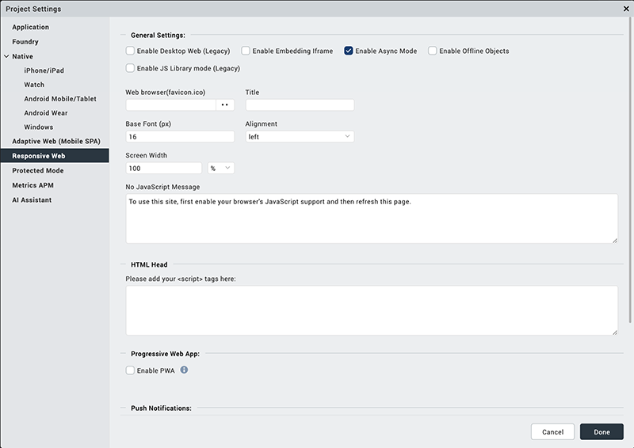

The following table describes all the fields in Responsive Web settings.

<table class="TableStyle-Basic" style="mc-table-style: url('Resources/TableStyles/Basic.css');width: 100%;" cellspacing="0"><colgroup><col style="width: 20%;" class="TableStyle-Basic-Column-Column1"><col style="width: 35%;" class="TableStyle-Basic-Column-Column1"><col style="width: 45%;" class="TableStyle-Basic-Column-Column1"></colgroup><tbody><tr class="TableStyle-Basic-Body-Body1"><th class="TableStyle-Basic-BodyE-Column1-Body1" style="text-align: left;">Section Name</th><th class="TableStyle-Basic-BodyE-Column1-Body1" style="text-align: left;">Field Name</th><th class="TableStyle-Basic-BodyD-Column1-Body1" style="text-align: left;">Description</th></tr><tr class="TableStyle-Basic-Body-Body1"><td class="TableStyle-Basic-BodyE-Column1-Body1" style="text-align: left;" rowspan="11">General Settings</td><td class="TableStyle-Basic-BodyE-Column1-Body1" style="text-align: left;">Enable Desktop Web (Legacy)</td><td class="TableStyle-Basic-BodyD-Column1-Body1" style="text-align: left;">Activates the Desktop Web Design for your Responsive Web application. This feature is provided as a backward compatibility support for a legacy feature.</td></tr><tr class="TableStyle-Basic-Body-Body1"><td class="TableStyle-Basic-BodyE-Column1-Body1" style="text-align: left;">Enable Embedding Iframe</td><td class="TableStyle-Basic-BodyD-Column1-Body1" style="text-align: left;">Sets the SPA or Desktop Web application behavior in a sub window. Enabling Embedding Iframe allows an application to open in a sub window.</td></tr><tr class="TableStyle-Basic-Body-Body1"><td class="TableStyle-Basic-BodyE-Column1-Body1" style="text-align: left;">Enable Async Mode</td><td class="TableStyle-Basic-BodyD-Column1-Body1" style="text-align: left;">All the network calls will be in asynchronous mode when enabled.</td></tr><tr class="TableStyle-Basic-Body-Body1"><td class="TableStyle-Basic-BodyE-Column1-Body1" style="text-align: left;">Enable JS Library mode (Legacy)</td><td class="TableStyle-Basic-BodyD-Column1-Body1" style="text-align: left;">Enables the JavaScript Library mode for the app. This feature is provided as a backward compatibility support for a legacy feature.</td></tr><tr><td>Enable ES5 build</td><td>
Enables ECMA standard conversion of the ES6 (and later) syntax to ES5 syntax. This feature is only available for apps that use the CSS Library mode, and does not work if the Legacy JS Library mode is enabled.
<b><i>Note: </i></b><ul><li>This property does not work during the live preview of an app.</li><li>This property does not work for offline applications on the Internet Explorer browser.</li></ul></td></tr><tr class="TableStyle-Basic-Body-Body1"><td class="TableStyle-Basic-BodyE-Column1-Body1" style="text-align: left;">Web browser (favicon.ico)</td><td class="TableStyle-Basic-BodyD-Column1-Body1" style="text-align: left;">Configures appropriate icon for an application in the Desktop Web Browser.</td></tr><tr class="TableStyle-Basic-Body-Body1"><td class="TableStyle-Basic-BodyE-Column1-Body1" style="text-align: left;">Title</td><td class="TableStyle-Basic-BodyD-Column1-Body1" style="text-align: left;">Sets the title of an application in the Desktop Web Browser.</td></tr><tr class="TableStyle-Basic-Body-Body1"><td class="TableStyle-Basic-BodyE-Column1-Body1" style="text-align: left;">Base Font (px)</td><td class="TableStyle-Basic-BodyD-Column1-Body1" style="text-align: left;">Configures appropriate base font size in pixel.</td></tr><tr class="TableStyle-Basic-Body-Body1" data-mc-conditions="Default.V9SP2FP"><td class="TableStyle-Basic-BodyE-Column1-Body1" style="text-align: left;">Base Target</td><td class="TableStyle-Basic-BodyD-Column1-Body1" style="text-align: left;">Specifies the default target for all hyperlinks and forms in the page. The possible values are _blank, _parent, _self, and _top.<b><i>Note: </i></b>This setting is applied at the application level. If you set a target in the anchor tag of a hyperlink, it overrides the base target for that hyperlink.</td></tr><tr class="TableStyle-Basic-Body-Body1"><td class="TableStyle-Basic-BodyE-Column1-Body1" style="text-align: left;">Alignment</td><td class="TableStyle-Basic-BodyD-Column1-Body1" style="text-align: left;">Defines the alignment of the application in the Desktop Web browser. The possible values are center, left, and right.</td></tr><tr class="TableStyle-Basic-Body-Body1"><td class="TableStyle-Basic-BodyE-Column1-Body1" style="text-align: left;">Screen Width</td><td class="TableStyle-Basic-BodyD-Column1-Body1" style="text-align: left;">Specifies the width that the application occupies in the Desktop Web browser. The Screen width value can be in percentage or pixel.</td></tr><tr class="TableStyle-Basic-Body-Body1"><td class="TableStyle-Basic-BodyE-Column1-Body1" style="text-align: left;">No JavaScript Message</td><td class="TableStyle-Basic-BodyD-Column1-Body1" style="text-align: left;">The message to be displayed when your browser does not support JavaScript.</td></tr><tr class="TableStyle-Basic-Body-Body1"><td class="TableStyle-Basic-BodyE-Column1-Body1" style="text-align: left;">Progressive Web App</td><td class="TableStyle-Basic-BodyE-Column1-Body1" style="text-align: left;">Enable PWA</td><td class="TableStyle-Basic-BodyD-Column1-Body1" style="text-align: left;">Builds a Progressive Web App.</td></tr><tr class="TableStyle-Basic-Body-Body1"><td class="TableStyle-Basic-BodyE-Column1-Body1" style="text-align: left;">Push Notifications</td><td class="TableStyle-Basic-BodyE-Column1-Body1" style="text-align: left;">Enable Push Notifications</td><td class="TableStyle-Basic-BodyD-Column1-Body1" style="text-align: left;">Enables Push Notifications for the app.</td></tr><tr class="TableStyle-Basic-Body-Body1"><td class="TableStyle-Basic-BodyB-Column1-Body1" style="text-align: left;">SEO</td><td class="TableStyle-Basic-BodyB-Column1-Body1" style="text-align: left;">Enable SEO</td><td class="TableStyle-Basic-BodyA-Column1-Body1" style="text-align: left;">Enables Search Engine Optimization for the app.</td></tr></tbody></table>

Protected Mode
--------------

Protected mode is a Volt MX Foundry token validation method. A successful validation occurs when the public key matches with the private key. It ensures that your app is not run on a rooted/ jail-broken device. Using Protected mode settings, you can configure the public and private encryption keys.

> **_Note:_** This option works only if the application is built in Release mode. The Protected Mode option works only if the application is built in Release mode. To know more about protecting your application, refer [Applying Application Security](ApplicationSecurity.md).

Click to view the image

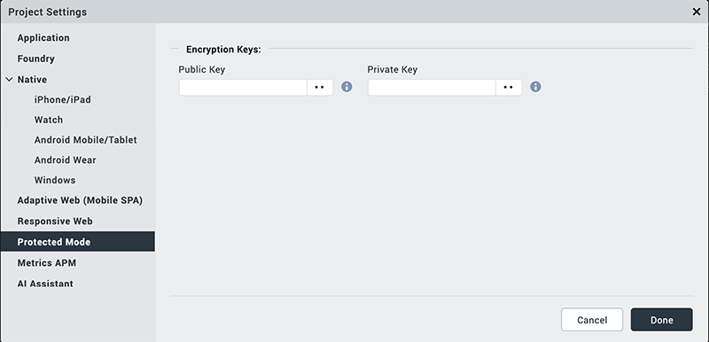

The following table describes all the fields in Protected Mode settings.

<table class="TableStyle-Basic" style="mc-table-style: url('Resources/TableStyles/Basic.css');" cellspacing="0"><colgroup><col style="width: 150pt;" class="TableStyle-Basic-Column-Column1"><col style="width: 150pt;" class="TableStyle-Basic-Column-Column1"><col style="width: 184pt;" class="TableStyle-Basic-Column-Column1"></colgroup><tbody><tr class="TableStyle-Basic-Body-Body1"><th class="TableStyle-Basic-BodyE-Column1-Body1" style="text-align: left;">Section Name</th><th class="TableStyle-Basic-BodyE-Column1-Body1" style="text-align: left;">Field Name</th><th class="TableStyle-Basic-BodyD-Column1-Body1" style="text-align: left;">Description</th></tr><tr class="TableStyle-Basic-Body-Body1"><td class="TableStyle-Basic-BodyE-Column1-Body1" style="text-align: left;" rowspan="2">Encryption Keys</td><td class="TableStyle-Basic-BodyE-Column1-Body1" style="text-align: left;">Public Key</td><td class="TableStyle-Basic-BodyD-Column1-Body1" style="text-align: left;">Configures the public key.</td></tr><tr class="TableStyle-Basic-Body-Body1"><td class="TableStyle-Basic-BodyB-Column1-Body1" style="text-align: left;">Private Key</td><td class="TableStyle-Basic-BodyA-Column1-Body1" style="text-align: left;">Configures the private key.</td></tr></tbody></table>

Metrics APM
-----------

Metrics Application Performance Monitoring deals with the set of metrics acquired by tracing the events of user’s interaction with the application.

Click to view the image

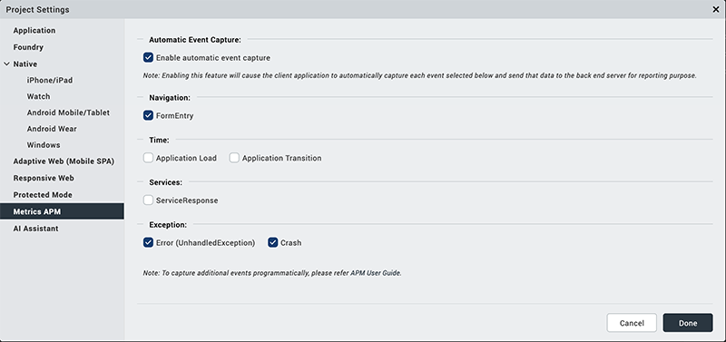

The following table describes all the fields in Metrics APM settings.

<table class="TableStyle-Basic" style="mc-table-style: url('Resources/TableStyles/Basic.css');width: 100%;" cellspacing="0"><colgroup><col style="width: 20%;" class="TableStyle-Basic-Column-Column1"><col style="width: 35%;" class="TableStyle-Basic-Column-Column1"><col style="width: 45%;" class="TableStyle-Basic-Column-Column1"></colgroup><tbody><tr class="TableStyle-Basic-Body-Body1"><th class="TableStyle-Basic-BodyE-Column1-Body1" style="text-align: left;">Section Name</th><th class="TableStyle-Basic-BodyE-Column1-Body1" style="text-align: left;">Field Name</th><th class="TableStyle-Basic-BodyD-Column1-Body1" style="text-align: left;">Description</th></tr><tr class="TableStyle-Basic-Body-Body1"><td class="TableStyle-Basic-BodyE-Column1-Body1" style="text-align: left;">Automatic Event Capture</td><td class="TableStyle-Basic-BodyE-Column1-Body1" style="text-align: left;">Enable automatic event capture</td><td class="TableStyle-Basic-BodyD-Column1-Body1" style="text-align: left;">Captures each event and send the data to the backend server for reporting purpose.</td></tr><tr class="TableStyle-Basic-Body-Body1"><td class="TableStyle-Basic-BodyE-Column1-Body1" style="text-align: left;">Navigation</td><td class="TableStyle-Basic-BodyE-Column1-Body1" style="text-align: left;">FormEntry</td><td class="TableStyle-Basic-BodyD-Column1-Body1" style="text-align: left;">Allows automatic tracking for iOS native and android apps when a form in an application is opened.</td></tr><tr class="TableStyle-Basic-Body-Body1"><td class="TableStyle-Basic-BodyE-Column1-Body1" style="text-align: left;" rowspan="2">Time</td><td class="TableStyle-Basic-BodyE-Column1-Body1" style="text-align: left;">Application load</td><td class="TableStyle-Basic-BodyD-Column1-Body1" style="text-align: left;">This event is invoked when the application is loaded and the first form is shown.</td></tr><tr class="TableStyle-Basic-Body-Body1"><td class="TableStyle-Basic-BodyE-Column1-Body1" style="text-align: left;">Application Transition</td><td class="TableStyle-Basic-BodyD-Column1-Body1" style="text-align: left;">This event is invoked when the application transits either from foreground to background and vice versa.</td></tr><tr class="TableStyle-Basic-Body-Body1"><td class="TableStyle-Basic-BodyE-Column1-Body1" style="text-align: left;">Services</td><td class="TableStyle-Basic-BodyE-Column1-Body1" style="text-align: left;">ServiceResponse</td><td class="TableStyle-Basic-BodyD-Column1-Body1" style="text-align: left;">Allows automatic tracking when an HTTP response is received from the service request or network call in the application.</td></tr><tr class="TableStyle-Basic-Body-Body1"><td class="TableStyle-Basic-BodyE-Column1-Body1" style="text-align: left;" rowspan="2">Exception</td><td class="TableStyle-Basic-BodyE-Column1-Body1" style="text-align: left;">Error</td><td class="TableStyle-Basic-BodyD-Column1-Body1" style="text-align: left;">This event is invoked when application ends up in an unhandled exception in JavaScript code that the global exception handler catches up.</td></tr><tr class="TableStyle-Basic-Body-Body1"><td class="TableStyle-Basic-BodyB-Column1-Body1" style="text-align: left;">Crash</td><td class="TableStyle-Basic-BodyA-Column1-Body1" style="text-align: left;">This event is invoked when application crashes and resumes after crash.</td></tr></tbody></table>

<!-- AI AI Assistant
------------

Using AI Assistant Settings you can configure the Rules Whitelist that consists of the Rules that need to be ignored in the Analysis error report.

Click to view the image

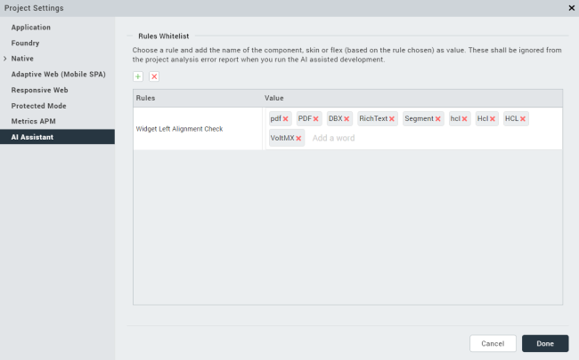

The following table describes all the fields in the AI Assistant settings.

<table class="TableStyle-Basic" style="mc-table-style: url('Resources/TableStyles/Basic.css');" cellspacing="0"><colgroup><col style="width: 150pt;" class="TableStyle-Basic-Column-Column1"><col style="width: 150pt;" class="TableStyle-Basic-Column-Column1"><col style="width: 184pt;" class="TableStyle-Basic-Column-Column1"></colgroup><tbody><tr class="TableStyle-Basic-Body-Body1" data-mc-conditions="Default.V9SP1M1"><th class="TableStyle-Basic-BodyE-Column1-Body1" style="text-align: left;" data-mc-conditions="Default.V9SP1M1">Section Name</th><th class="TableStyle-Basic-BodyE-Column1-Body1" style="text-align: left;" data-mc-conditions="Default.V9SP1M1">Field Name</th><th class="TableStyle-Basic-BodyD-Column1-Body1" style="text-align: left;" data-mc-conditions="Default.V9SP1M1">Description</th></tr><tr class="TableStyle-Basic-Body-Body1" data-mc-conditions="Default.V9SP1M1"><td class="TableStyle-Basic-BodyE-Column1-Body1" style="text-align: left;" rowspan="4" data-mc-conditions="Default.V9SP1M1">Rules Whitelist</td><td class="TableStyle-Basic-BodyE-Column1-Body1" style="text-align: left;" data-mc-conditions="Default.V9SP1M1">+</td><td class="TableStyle-Basic-BodyD-Column1-Body1" style="text-align: left;" data-mc-conditions="Default.V9SP1M1">Add an Exception.</td></tr><tr class="TableStyle-Basic-Body-Body1" data-mc-conditions="Default.V9SP1M1"><td class="TableStyle-Basic-BodyE-Column1-Body1" style="text-align: left;" data-mc-conditions="Default.V9SP1M1">x</td><td class="TableStyle-Basic-BodyD-Column1-Body1" style="text-align: left;" data-mc-conditions="Default.V9SP1M1">Delete an Exception.</td></tr><tr class="TableStyle-Basic-Body-Body1" data-mc-conditions="Default.V9SP1M1"><td class="TableStyle-Basic-BodyE-Column1-Body1" style="text-align: left;" data-mc-conditions="Default.V9SP1M1">Rules</td><td class="TableStyle-Basic-BodyD-Column1-Body1" style="text-align: left;" data-mc-conditions="Default.V9SP1M1">Select the rule that you want to add the exception to.</td></tr><tr class="TableStyle-Basic-Body-Body1" data-mc-conditions="Default.V9SP1M1"><td class="TableStyle-Basic-BodyB-Column1-Body1" style="text-align: left;" data-mc-conditions="Default.V9SP1M1">Value</td><td class="TableStyle-Basic-BodyA-Column1-Body1" style="text-align: left;" data-mc-conditions="Default.V9SP1M1">Name of the resource, skin or widget that must not be analyzed.</td></tr></tbody></table>
-->