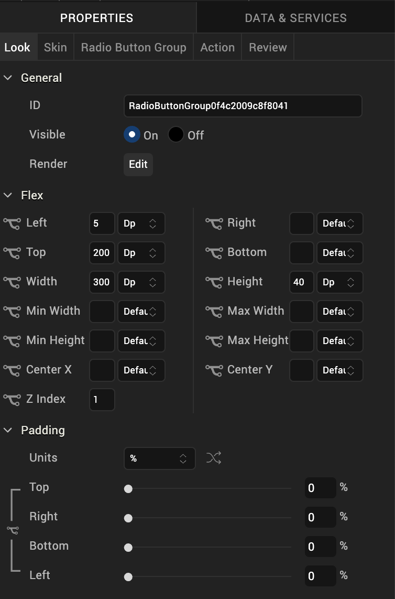
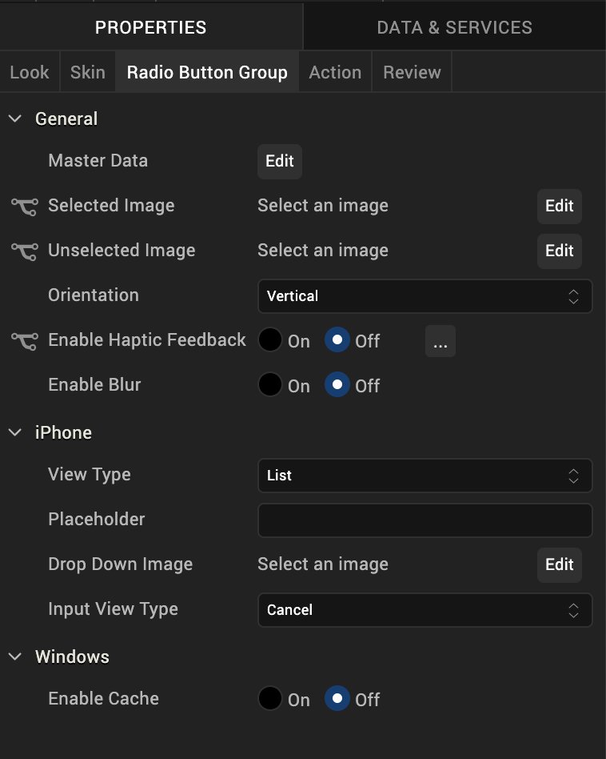
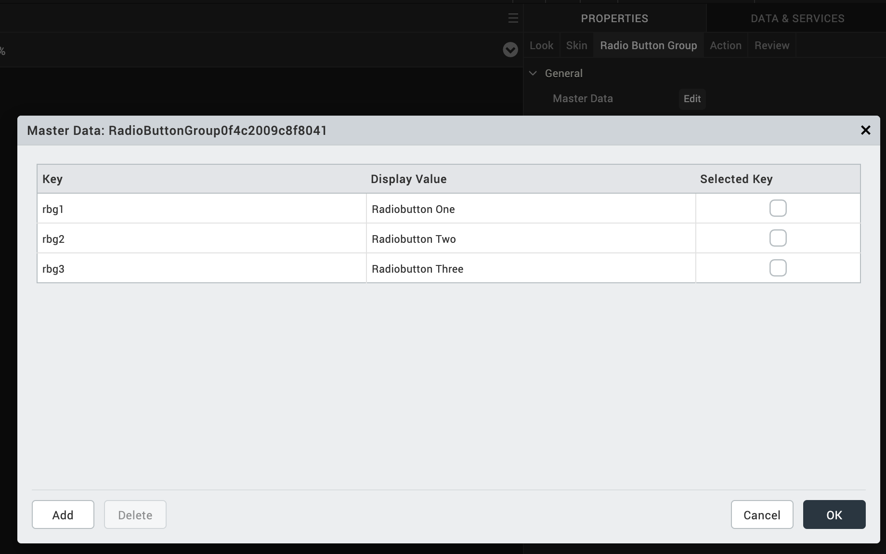
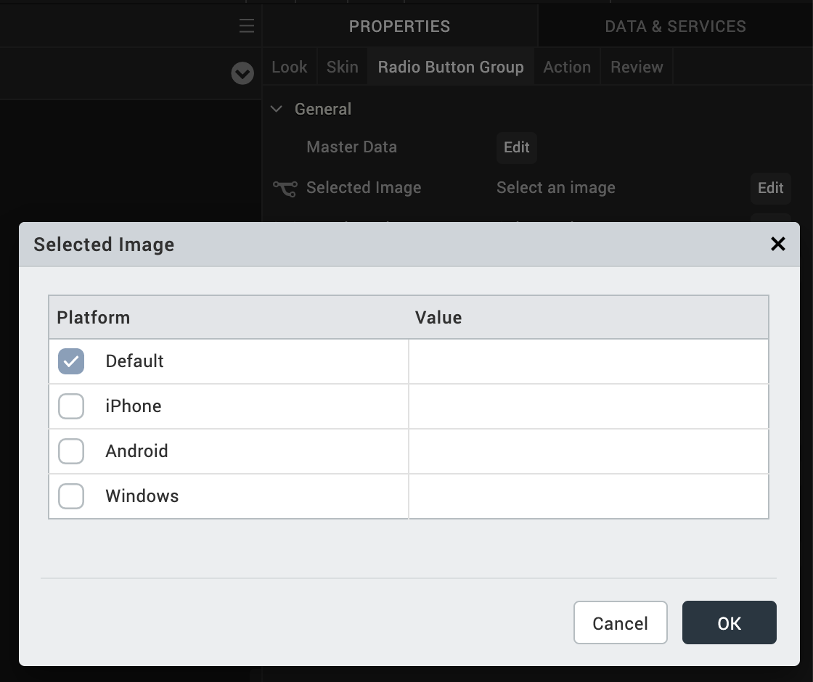
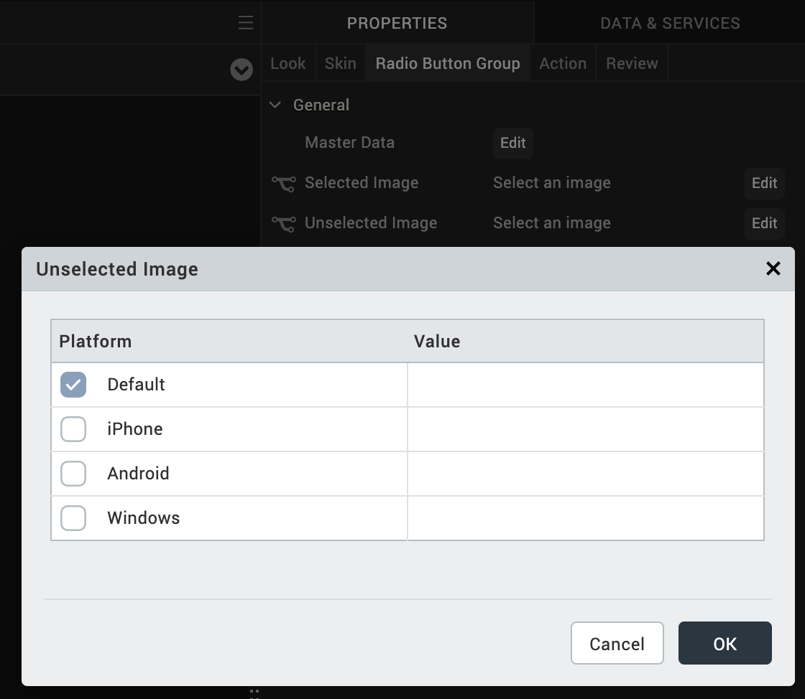

                           

RadioButtonGroup
----------------

Use a RadioButtonGroup widget to select from a group of radio buttons when a user can choose only one option.

To learn how to use this widget programmatically, refer [VoltMX Iris Widget guide](../../../Iris/iris_widget_prog_guide/Content/RadioButtonGroup.md).

### Important Considerations

The following are important considerations for a RadioButtonGroup Widget.

#### All Platforms

*   A RadioButtonGroup widget is always a group widget.
*   Use a RadioButtonGroup widget if there are a limited number of possible selections and you can make only one selection. If you can make more than one selection from the group, use a [CheckBoxGroup](CheckBoxGroup.md) widget. To display a list of selections, use a [ListBox](ListBox.md) widget.

#### Android

*   If you set the [Orientation](#orientation) property to horizontal, do not place more than two items in the group. If you place more than two items and the associated text is large, additional items may not fit in the screen width and will not be visible.

### Look Properties

Look properties define the appearance of the widget. The following are the major properties you can set:

*   Whether the widget is visible.
*   The platforms on which the widget is rendered.
*   How the widget aligns with its parent widget and neighboring widgets.
*   If the widget displays content, where the content appears.

For descriptions of the properties available on the Look tab of the Properties pane, see [Look](Look.md#Flex).

### Skin Properties

Skin properties define a skin for the widget, including background color, borders, and shadows. If the widget includes text, you can also specify the text font.

For the RadioButtonGroup widget, you can apply a skin and its associated properties for the following states:

  
| Skin | Definition |
| --- | --- |
| Normal | The default skin of the widget. |
| Focus | The skin applied when the focus is on the widget. |
| Hover Skin | The look and feel of the widget when the cursor hovers over the widget. > **_Note:_** Hover Skins is available only on Windows (native) Tablet devices. |

For more information about applying skins, see [Understanding Skins and Themes](Customizing_the_Look_and_Feel_with_Skins.md).

### RadioButtonGroup Properties

RadioButtonGroup properties specify properties that are available on any platform supported by Volt MX Iris, and assign platform-specific properties.

#### Master Data

Specifies the set of values that must be displayed for the user to make a selection from the available choices.

To specify this set of values, click the **Edit** button of the **Master Data** field to open the **Master Data** dialog box.

The Master Data dialog box contains the following columns:

*   Key: The unique identifier of each radio button.
*   Display Value: The label or descriptive text displayed for each radio button.
*   Select Key : Whether a radio button is selected by default.

To add more radio buttons to the widget, click **Add**. To delete a radio button, click inside a cell, and then click **Delete**.

Click **OK** to create the master data.

#### Selected Image

Specifies the image to be displayed when you make a selection.

> **_Note:_** If you specify a **Selected Image**, make sure to also specify an **Unselected Image**.

To provide a default or platform-specific image, click the **Edit** button to open the **Selected Image** dialog box.

To provide a platform-specific image or replace the default image, select the platform and click inside the corresponding **Value** field to open the **Selected Image** dialog box. You can either:

*   Select an available image.
*   Provide an image URL.

#### Unselected Image

Specifies the image to be displayed when a selection is cleared.

To provide a default or platform-specific image, click the **Edit** button to open the **Unselected Image** dialog box.

To provide a platform-specific image or replace the default image, select the platform and click inside the corresponding **Value** field to open the **Selected Image** dialog box. You can either:

*   Select an available image.
*   Provide an image URL.

#### Orientation

Specifies whether the alignment of the radio buttons is horizontal or vertical.

Default: Vertical

#### View Type

For the iOS platform, specifies the view type of the RadioButtonGroup , either List, Table, Toggle, or On-screen Wheel.

Default: List

*   > **_Note:_**  If you select the On-screen Wheel view type, you cannot view the on-screen wheel on the Iris canvas.  
    

#### Drop Down Image

If the view type is List, specifies the image used for the drop-down box indicator. The default is an inverted triangle.

To specify a different image or a platform-specific image, click the **Edit** button to open the **Drop Down Image** dialog box.

From the **Drop Down Image** dialog box, select an image and click **OK**.

#### Group Cells

If the view type is Table, specifies whether the Group Cells style is applied. The Group Cells style groups items in the radio button group.

Default: Cells are not grouped.

#### View Style

If the view type is Toggle, specifies the view style of the toggle button, either Plain, Bordered, or Bar.

Default: Plain

#### Equal Segments

If the view type is Toggle, specifies whether to distribute the segments in equal proportions.

Default: Segments are distributed in equal proportions.

#### Enable Tint Color

If the view type is Toggle, specifies whether to enable a tint color.

Default: Tint color is not enabled.

#### Tint Color

If tint color is enabled, specifies the tint color. To select a tint color, click the color picker to open the color selection dialog box, and then select a color.

#### Tool Tip

For the Windows Tablet platform, specifies a message that displays when you hover the mouse pointer over the widget .

### Actions

Actions define what happens when an event occurs. On a RadioButtonGroup widget, you can run an action when the following event occurs:

*   onSelection: The action is triggered when an item is selected.
*   onTouchStart: The action is triggered when the user touches the touch surface. This event occurs asynchronously.
*   onTouchMove: The action is triggered when the touch moves on the touch surface continuously until movement ends. This event occurs asynchronously.
*   onTouchEnd: The action is triggered when the user touch is released from the touch surface. This event occurs asynchronously.

For more information, see the topic, [Add Actions](working_with_Action_Editor.md).

### Placement Inside a Widget

The following table summarizes where a RadioButtonGroup widget can be placed:

<table style="mc-table-style: url('Resources/TableStyles/Basic.css');" class="TableStyle-Basic" cellspacing="0"><colgroup><col class="TableStyle-Basic-Column-Column1"> <col class="TableStyle-Basic-Column-Column1"></colgroup><tbody><tr class="TableStyle-Basic-Body-Body1"><td class="TableStyle-Basic-BodyE-Column1-Body1">Flex Form</td><td class="TableStyle-Basic-BodyD-Column1-Body1">Yes</td></tr><tr class="TableStyle-Basic-Body-Body1"><td class="TableStyle-Basic-BodyE-Column1-Body1">VBox Form</td><td class="TableStyle-Basic-BodyD-Column1-Body1">Yes</td></tr><tr class="TableStyle-Basic-Body-Body1"><td class="TableStyle-Basic-BodyE-Column1-Body1">FlexContainer</td><td class="TableStyle-Basic-BodyD-Column1-Body1">Yes</td></tr><tr class="TableStyle-Basic-Body-Body1"><td class="TableStyle-Basic-BodyE-Column1-Body1">FlexScrollContainer</td><td class="TableStyle-Basic-BodyD-Column1-Body1">Yes</td></tr><tr class="TableStyle-Basic-Body-Body1"><td class="TableStyle-Basic-BodyE-Column1-Body1">ScrollBox</td><td class="TableStyle-Basic-BodyD-Column1-Body1">Horizontal Orientation - YesVertical Orientation- Yes</td></tr><tr class="TableStyle-Basic-Body-Body1"><td class="TableStyle-Basic-BodyE-Column1-Body1">Tab</td><td class="TableStyle-Basic-BodyD-Column1-Body1">Yes</td></tr><tr class="TableStyle-Basic-Body-Body1"><td class="TableStyle-Basic-BodyE-Column1-Body1">Segment</td><td class="TableStyle-Basic-BodyD-Column1-Body1">No</td></tr><tr class="TableStyle-Basic-Body-Body1"><td class="TableStyle-Basic-BodyE-Column1-Body1">Popup</td><td class="TableStyle-Basic-BodyD-Column1-Body1">Yes</td></tr><tr class="TableStyle-Basic-Body-Body1"><td class="TableStyle-Basic-BodyB-Column1-Body1">Template&nbsp;</td><td class="TableStyle-Basic-BodyA-Column1-Body1">Header- NoFooter- No</td></tr></tbody></table>

<table style="margin-left: 0;margin-right: auto;mc-table-style: url]('Resources/TableStyles/RevisionTable.css');" class="TableStyle-RevisionTable" cellspacing="0" data-mc-conditions="Default.md5 Only"><colgroup><col class="TableStyle-RevisionTable-Column-Column1" style="width: 26px;"> <col class="TableStyle-RevisionTable-Column-Column1"> <col class="TableStyle-RevisionTable-Column-Column1"></colgroup><tbody><tr class="TableStyle-RevisionTable-Body-Body1"><td class="TableStyle-RevisionTable-BodyE-Column1-Body1" data-mc-conditions="Default.HTML5 Only">Rev</td><td class="TableStyle-RevisionTable-BodyE-Column1-Body1" data-mc-conditions="Default.HTML5 Only">Author</td><td class="TableStyle-RevisionTable-BodyD-Column1-Body1" data-mc-conditions="Default.HTML5 Only">Edits</td></tr><tr class="TableStyle-RevisionTable-Body-Body1"><td class="TableStyle-RevisionTable-BodyE-Column1-Body1" data-mc-conditions="Default.HTML5 Only">8</td><td class="TableStyle-RevisionTable-BodyE-Column1-Body1" data-mc-conditions="Default.HTML5 Only">SHS</td><td class="TableStyle-RevisionTable-BodyD-Column1-Body1" data-mc-conditions="Default.HTML5 Only">SHS</td></tr><tr class="TableStyle-RevisionTable-Body-Body1"><td class="TableStyle-RevisionTable-BodyB-Column1-Body1" data-mc-conditions="Default.HTML5 Only">7.2.1</td><td class="TableStyle-RevisionTable-BodyB-Column1-Body1" data-mc-conditions="Default.HTML5 Only">SHS</td><td class="TableStyle-RevisionTable-BodyA-Column1-Body1" data-mc-conditions="Default.HTML5 Only">SHS</td></tr></tbody></table>
