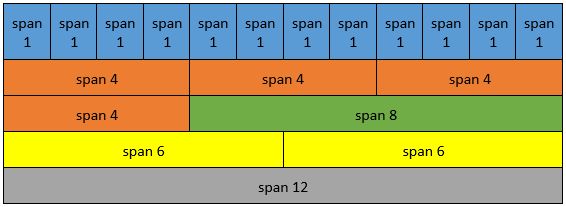
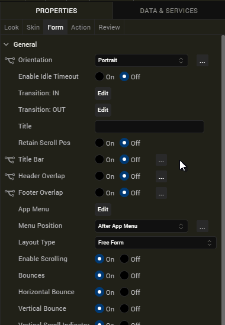

                         

##  Responsive Design

Responsive design enables developers to create applications that can fit their contents based on the form factor of the device. Using Volt MX Iris, you can develop Mobile (Native and Adaptive Web), Tablet (Native and Adaptive Web), and Responsive Web applications, that are responsive in nature.

*   **Responsive Grid Layout**: Using the Responsive Container, a developer can define the elements in a flex container on a form to suit various form factors. You can use the Responsive Containers on Mobile (Native and Adaptive Web), Tablet (Native and Adaptive Web), and Responsive Web channels.
*   **Responsive Web Design**: Available only on the Responsive Web channel, the Responsive Web Design allows you to design a responsive web app with customizations that you can apply at a deeper level. For more information, click [here](Responsive_Design_8_2.md).

Overview
--------

Responsive Grid Layout provides a quick and convenient way to create responsive apps for the Web, Tablet, and Mobile channels (including Portrait and Landscape mode). Using Responsive Grid Layout, you can customize the UI to create flexible, multi-column layouts that use breakpoints. The Responsive Grid Layout reduces the time taken to implement Responsive properties for Container and child widgets as there are fewer properties that require fewer code changes.

To support the Responsive Grid Layout, a new Layout Type, **Responsive Grid**, has been added to the Container widgets such as, **Flex Form**, **FlexContainer**, and **FlexScrollContainer** widgets.

The Responsive Grid layout divides the container widget into columns based on the value of the **Span** property. The maximum number of columns is twelve. The Span property sets the width of the child widget based on the 12-column layout. The **Offset** property determines the position of the left edge of the widget. This position is measured either from the left edge of the parent widget or from the right edge of the widget present to its left.

> **_Note:_** If the value of Span + Offset is more than 12, the next child widget that you add is wrapped and appears in a row below the current row.

The columns of the Responsive Container resize and re-arrange automatically depending on the Screen size. The following table displays the size () width of the child widget for different span values.

When the Responsive Grid Layout is applied to a container widget, the child widgets of the Responsive Container will have a new section in the Look tab, **Responsive Configuration**, that has the **Span** and **Offset** properties specified for each breakpoint.

You can only add FlexContainer widgets as child widgets in a Responsive Container. Within the Responsive Container, the child FlexContainer can have its own child widgets nested, as long as the Layout Type for the FlexContainer widget (child of the Responsive Container) is not Responsive Grid. Accessing child widgets of a Responsive Container through code is similar to accessing child widgets in other FlexContainers.

> **_Note:_** Duplicate widgets cannot be placed in Responsive Containers.

> **_Note:_** You can only configure transformational animation for the direct child widgets of a Responsive Container.

Span and Offset properties override the positional and width properties of direct child widget. Therefore, in addition to the Span and Offset properties, you can only configure the following Flex properties for the child FlexContainer widget of the Responsive Container:

*   Height
*   Min Height
*   Max Height
*   Z Index

From the V9 Service Pack 3 release, Quantum Visualizer has introduced support for the following properties to provide spacing within a Responsive Container:

* **Padding:** The Padding property provides space between the Responsive Container and its child widgets. The values for the Padding property must be provided in % units. For example, if you provide a padding of 10 px for the left, right, top, and bottom, the spacing is applied as follows:

* ** GutterX:** The GutterX property provides horizontal spacing (on the left and right of a widget) between the child widgets of the Responsive Container. The value for the GutterX property must be provided in px, dp, and % units. For example, if you provide a GutterX value of 10 px, the spacing is applied as follows:

* **GutterY:** The GutterY property provides vertical spacing (only on the top of a widget) between the child widgets of the Responsive Container. The value for the GutterY property must be provided in px, dp, and % units. For example, if you provide a GutterY value of 10 px, the spacing is applied as follows:

Responsive Container for Web
----------------------------

When a Responsive Container is added to a Form in the Responsive Web channel, you might observe the following:

*   In the Responsive Configuration section, default breakpoints of 640, 1024, and 1366 are added for Web apps. However, you can modify and delete these breakpoint values and also add new values.
*   When a new breakpoint is added, all child widgets of the Responsive Container support the new breakpoint. In such cases, widgets will be populated with the closest smaller breakpoint span and offset values to the newly-created breakpoint.
*   If a breakpoint is modified, all FlexContainer widgets present in the Responsive Container will reflect the modified breakpoint with the same span and offset values that were set to it earlier.
*   When a breakpoint is deleted, the breakpoint will be removed from all child widgets.
*   Breakpoint forking is not supported for FlexContainer widgets present within the cells of a Responsive Container. However, the child widgets in those FlexContainer widgets support breakpoint forking.

**General Steps to implement Responsive Grid Layout for Mobile & Tablet apps**

The process of using Responsive Grid Layout for Mobile or Tablet includes the following broad steps:

*   Create a Form and configure the Orientation property as both (Portrait and landscape).
*   Add a FlexContainer or FlexScrollContainer based on your requirements.
*   Configure the Layout Type of the container as Responsive Grid.
*   Add child container widgets as required.
*   Modify the Span and Offset values of the child widgets for Portrait and Landscape orientations.
*   Build and view the app.

**General Steps to implement Responsive Grid Layout for Responsive Web/Desktop Web apps**

The process of using Responsive Grid Layout for Web apps include the following broad steps:

*   Create a Form and define the breakpoints or use the default breakpoints.
*   Add FlexContainer widgets based on your requirements.
*   Configure the Layout Type of the container as Responsive Grid.
*   Add child container widgets as required.
*   Modify the Span and Offset values of the child widgets for different breakpoints.
*   Build and view the app.

Responsive Grid Layout – Mobile & Tablets
-----------------------------------------

The following content provides detailed steps on implementing Responsive Grid Layout in your project. Following the steps will result in creating a form with six different FlexContainers that are embedded in a FlexScrollContainer. These six containers are configured using the span feature to make them responsive.

To create a Responsive Grid Layout for a mobile or tablet, do the following:

1.  In the project you want to add Responsive Grid Layout, create a new form for the Mobile or Tablet channel.
2.  Rename the form **frmHome**.
3.  From the **Properties** panel, navigate to the **Form** tab.
4.  Under the **General** section, modify the following values.
    *   Orientation: **Both**  
        
5.  From the bottom-left corner of Iris, navigate to the **Default Library**.
6.  From the library, drag the **FlexScrollContainer** widget onto **frmHome** form on the canvas.
7.  Right-click the widget and select **Fit to Parent**.
8.  Rename the FlexScrollContainer, **flxScrollResponsive**.  
    
9.  From the **Properties** panel, navigate to the **FlexScrollContainer** tab.
10.  Under the General section, from the **Layout Type** drop-down list, select **Responsive Grid**.  
    
11.  From the bottom-left corner of Iris, navigate to the **Default Library**.
12.  Drag the **FlexContainer** widget onto the **flxScrollResponsive** on the canvas.
13.  Rename the container **flxOne**.  
    
14.  From the **Properties** panel, navigate to the **Skin** tab.
15.  Under the **Background** section, provide the following values.
    *   Type: **Single Color**
    *   Color: Click the square and for #, provide the value, **3a5f87**
    *   Opacity: **100%**  
        
16.  From the **Properties** panel, navigate to the **Look** tab.
17.  Under the Flex section, set the following values.
    *   Height: **50%**  
        
18.  Under the **Responsive Configuration** section, set the following values.
    *   Under **Span**, for **Portrait**, select **4**
    *   Under **Span**, for **Landscape**, select **6**  
          
        
19.  From the **Project** explorer, navigate to **Mobile** > **Forms** > **frmHome**, and select .
    
Using the steps in the section, add five more FlexContainers. The following table provides the configuration details.  
      
  | Type          | Color         | Opacity       | ID          |Height        |Portrait Span | Landscape Span | Offset Portrait | 
  |-------------  |-------------  | ------------- |-------------| -------------|------------- |------------- |------------- |
  | Single Color      | 3eadcf     | 100%      | FlxTwo     |50%     |4   |6   |NA   |
  | Single Color      | b352b3     | 100%      | FlxThree    |50%     |4   |6   |NA   |
  | Single Color      | 239651   | 100%     | FlxFour     |200 DP     |8   |6   |2   |
  | Single Color      | b83e6b     | 100%      | FlxFive     |200 DP     |6   |6   |NA   |
  | Single Color      | 8cc74a     | 100%      | FlxSix     |200 DP    |6   |6   |NA   |
    
20.  From the top of the canvas, select the button **Toggle Orientation**, to view this form in the **Landscape** mode.
21.  Build your app and view the app on your device.
    
Play around with the app in the portrait mode and landscape mode to see the responsive behaviour.
    

Responsive Grid Layout – Web
----------------------------

The following content provides detailed steps on implementing Responsive Grid Layout in your project. Following the steps will result in creating a form with six different FlexContainers that are embedded in a FlexScrollContainer. These six containers are configured using the span feature to make them responsive.

To create a Responsive Grid Layout for web, do the following:

1.  In the project you want to add Responsive Grid Layout, create a new form for Responsive Web/Desktop Web.
2.  Rename the form, **frmHome**.
3.  From the top of the canvas, enable breakpoint forking.
4.  From the **Properties** panel, navigate to the **Look** tab.
5.  Under the **Breakpoints** section, you can find three pre-defined breakpoints.
6.  From the bottom-left corner of Iris, navigate to the **Default Library**.
7.  Drag the **FlexContainer** onto the **frmHome** on the canvas.
8.  Rename the container **flxOne**.
9.  From the **Properties** panel, navigate to the **Skin** tab.
10.  Under the **Background** section, provide the following values.
    *   Type: **Single Color**
    *   Color: Click the square and for #, provide the value, **3a5f87**
    *   Opacity: **100%**
11.  From the **Properties** panel, navigate to the **Look** tab.
12.  Under the **Flex** section, set the following values.
    *   Height: **33.33%**
13.  Under the **Responsive Configuration** section, set the following values.
    *   Under **Span**, for **640**, select **4**
    *   Under **Span**, for **1024**, select **6**
    *   Under **Span**, for **1366**, select **3**
14.  From the Project explorer, navigate to **Responsive Web** > **Forms**, and select **frmHome**.
    
Using the steps in the section, add five more FlexContainers. The following table provides the configuration details.
    
| Type          | Color         | Opacity       | ID          |Height        |First breakpoint Span | Second breakpoint Span | Third breakpoint Span | First breakpoint Offset | Second breakpoint Offset  | Third breakpoint Offset | 
|-------------  |-------------  | ------------- |-------------| -------------|------------- |------------- |------------- |------------- |------------- |------------- |
| Single Color      | 3eadcf     | 100%      | FlxTwo     |33.33%    |4   |6   |3   | 0|0 | 0|
| Single Color      | b352b3     | 100%      | FlxThree    |33.33%   |4   |6   |3   |0 | 0| 0| 
| Single Color      | 239651   | 100%     | FlxFour     |33.33%     |8   |6   |3   | 2| 0| 0|
| Single Color      | b83e6b     | 100%      | FlxFive     |33.33%     |6   |6   |12   |0 | 0|0 |
| Single Color      | 8cc74a     | 100%      | FlxSix     |33.33%    |6   |6   |8   |0 | 0| 2|
    
15.  From the top of the canvas, select different breakpoints to view the responsive behavior.
16.  Build your app and view the app on your device.  
    Play around with the app in different layouts to see the responsive behavior.
