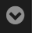
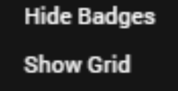
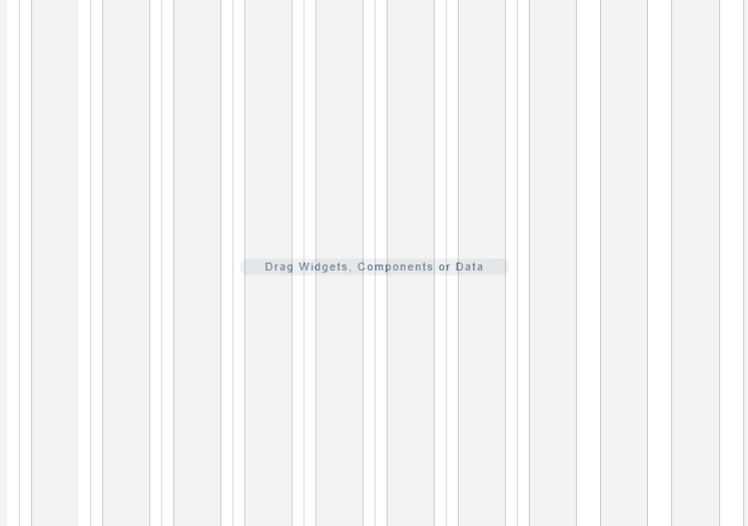
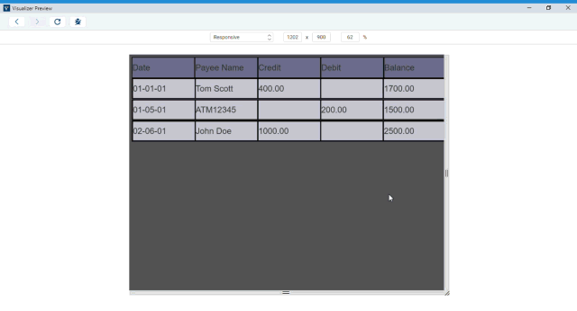
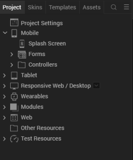

                         

Design a Responsive Web App
===========================

Responsive design enables developers to create applications that can fit their contents based on the form factor of the device. Using Volt MX Iris, you can develop mobile native, tablet and desktop web applications, that are responsive in nature.

*   **Responsive Grid Layout**: Using the Responsive Container, a developer can define the elements in a flex container on a form to suit various form factors. You can use the Responsive Containers on Mobile Native, Tablet and Desktop web channels. For more information, click [here](ResponsiveGridLayout.md).
*   **Responsive Web Design**: Available only on the Desktop web channel, the Responsive Web Design allows you to design a responsive web app with customizations that you can apply at a deeper level.

Responsive Web Design Overview
------------------------------

Responsive Web Design is an approach to web-page creation that makes use of flexible layouts, flexible images, and cascading style sheet ](CSS) media queries. The goal of Responsive Web Design is to build web pages that can detect a user's screen size and orientation, and then change the layout accordingly. Responsive Web Design is about using.md and CSS to automatically resize, hide, shrink, or enlarge a website, to make it look good on all devices (desktops, tablets, and phones).

The Responsive Web Design feature has been implemented in Volt MX Iris. When you resize a web browser screen, content in the browser resizes based on the resizing design. Using Responsive design, you can design a web page for different form factors in a single FlexForm.

Responsive Web Design supports the following features:

*   Browser size changes
*   Browser zoom-in and zoom-out
*   Screen resolution changes

> **_Note:_** A **Progressive Web App** (PWA) acts as a progression of a Responsive Web app. For example, if you have a website (web page/web app) that is mobile responsive, you can leverage the new features supported by modern web browsers to make it a Progressive Web App. For more information about Progressive Web Apps, click [here](ProgressiveWebApp.md).

From Volt MX Iris V9 SP2, the existing Responsive Web Design feature has been enhanced. Prior to Volt MX Iris V8 SP2, Responsive Web Design was achieved through code. From Volt MX Iris V9 SP2 onwards, you can build Responsive Web desktop applications from within Volt MX Iris.

<iframe src="https://www.youtube.com/embed/qfdRonVOStU" allowfullscreen=""></iframe>

For a more hands-on approach on the Responsive Web Design feature provided by Volt MX Iris AppPlatform, import and preview the **Resort Feature** sample app by using Volt MX Iris.

The Responsive Web design feature is currently available only for the Desktop Web platform.

> **_Important:_** You must enable the Responsive Web feature in the Desktop Web Properties section [here](Desktop_Web_Properties.md#Enable_Responsive_Web).

When your app is open in a browser, if the browser window resizes, content which is in a bigger layout does not resize according to the smaller layout automatically. Responsive web enables you to design your desktop web applications to fit various layouts and create a glitch free browsing experience.

There are three pre-existing breakpoints: Mobile, Tablet, and Desktop These breakpoints help you to resize your web application to pre-set scales. You can either use them or you can create your own custom breakpoint and use it. The ruler in the form assists you in viewing these breakpoints. When you hover on the breakpoint section, the breakpoint area is highlighted in the ruler indicating the screen size.

You can switch between various breakpoints set on the canvas. When you click a break point, the canvas resizes to the width specified on that breakpoint and all the content in the canvas adjusts according to the specified canvas width. You cannot hide the ruler when breakpoints are set for a form.

You can resize the breakpoints using the resize handle icon on the right side of the canvas. This provides a quick review so that you can determine the exact width where the content design breaks during the resize. You can also use a key (Command + D key in Mac and Ctrl + D key in Windows) when you reach the required width to insert a breakpoint of a specified width when you are resizing a breakpoint. You can drag a breakpoint in a ruler.

For New projects, you can use the three default values or create a new one by using the Add New button.

*   Desktop - 1200 PX
*   Tablet - 1024 PX
*   Mobile - 640 PX
*   Add New - Button

For existing projects, you do not have any default breakpoints. You can add a breakpoint by using the Add New button.

Breakpoints are always sorted from largest to smallest. If you add a new breakpoint which is larger than the existing large breakpoint, the newly added largest one goes to the top.

> **_Important:_** A new event **onBreakpointChange** is added to the Actions list in the Properties pane. You can define what happens to the form when the breakpoint changes.

Enable Breakpoint Forking
-------------------------

You can choose the layout for each of the breakpoints separately by using the Breakpoint Forking feature. When this feature is turned on, you can rearrange your layout in the form, specific to each breakpoint. This helps you in defining how you want to display the form in each layout. You can choose the changes at the breakpoint level or a global level for all breakpoints.

> **_Important:_** When you turn Breakpoint Forking on, you can fork your widgets separately for each breakpoint. If you do not fork your widgets for each breakpoint, the canvas will resize only a few widgets and not all of them.

### Limitation

A limitation related to Breakpoint Forking and setting the height of a widget as Preferred/any non-Preferred value is present in a Responsive Web form of Volt MX Iris.

Consider a scenario where you have a Responsive Web form with Breakpoint Forking turned off. You add any widget to the form and under **Properties** > **Look** > **Flex**, set the **Height** of the widget as **Preferred**. When you then turn on Breakpoint Forking and select a breakpoint, it is not possible to change the Height of the widget to any non-Preferred value (such as 10 Dp).

The same limitation exists when you first set the Height of a widget as any non-Preferred value (such as 10 Dp), then turn on Breakpoint Forking, and try to modify the Height of the widget to Preferred.

Enable Grid Lines
-----------------

You can choose to enable grid lines on your Responsive Web canvas. These grid lines help you to properly align widgets and other elements of your Responsive Web app. You can use grid lines as reference points while placing various app elements according to the breakpoints that you have specified.

After you enable or disable grid lines for one Responsive Web form, the corresponding setting is applied for all Responsive Web forms in Volt MX Iris. Grid lines for Responsive Web forms are disabled by default.

**To enable grid lines for Responsive Web, follow these steps:**

1.  Select a Responsive Web form.
2.  At the upper-right corner of the Project Canvas, click the down-arrow icon . A list of options appears.  
      
       

Click **Show Grid**.  
    

> **_Note:_** If grid lines are already enabled and you want to disable this feature, click **Hide Grid** from the down-arrow icon list.

1.  Volt MX Iris enables grid lines for your Responsive Web form.  
      
    

Working with Skins, Widgets, and Components
-------------------------------------------

You can also fork skins for different breakpoints. For Video and Image widgets, the source of images and videos can be forked based on the breakpoint. For Labels, whenever you change a breakpoint in the canvas, the width of the label changes and the content wrapping is adjusted for the breakpoint.

When you drag and drop a widget to the form and make changes, unless you have selected the Breakpoint Forking feature, all changes reflect across breakpoints. If a breakpoint is forked, changes will not reflect in that breakpoint.

When you drag and drop a widget on any breakpoint, the widget is added to all breakpoints. When you delete or rename a widget on a breakpoint, the widget is deleted or renamed on all breakpoints. You can change properties of a widget specific to each breakpoint.

In Volt MX Iris V9 SP2, for a Segment widget, you can change the values of the following properties for each breakpoint.

*   [rowTemplate](../../../Iris/iris_widget_prog_guide/Content/Segment_Properties.md#rowTempl)
*   [sectionHeaderTemplate](../../../Iris/iris_widget_prog_guide/Content/Segment_Properties.md#sectionH2)
*   [data](../../../Iris/iris_widget_prog_guide/Content/Segment_Properties.md#data)

An example where this feature can be implemented is in displaying the list of transactions for a banking application.  
If you have a responsive web banking application, you can use this feature to customize different detail views for different breakpoints. When a user views the application in a web browser, you can design the application to display the payee name, date, transaction type, and amount. When the same list is viewed on a mobile device, you can modify the row template and data properties to show only the payee name and transaction amount. This provides a better user experience as the user can view the full list easily.

> **_Note:_** From the Volt MX Iris V9 SP2 FP 7 release, [accessibilityConfig](../../../Iris/iris_widget_prog_guide/Content/Button_Properties.md#accessibilityConfig) property is breakpoint-forkable. You can also provide different i18N keys for each breakpoint as values for the attributes in the `accessibilityConfig` property. While forking the accessibilityConfig property for each breakpoint, you must fork the entire **Accessibility Config** section. The individual attributes inside the **Accessibility Config** section are not forkable for each breakpoints.  
If you provide the `tabIndex` of a widget as zero and want to fork any attribute inside the `accessibilityConfig` property such as the `a11yLabel` property between breakpoints, then you must provide the `tabindex` property value for all breakpoints.

### Responsive Web Components

To create a responsive web component, you will have to create a responsive web UI on a form, and then convert the set of widgets into a component. To convert a set of widgets in the form to component, follow these steps.

1.  Create a form inside a Responsive Web application and open it on the Iris Canvas.
2.  Add a FlexContainer widget to your form.
3.  After you have added the FlexContainer widget, add the required widgets inside this parent widget.
4.  On the Iris canvas, right-click on the parent FlexContainer widget and select **Create Component**. Select **w/o contract** or **with contract** as per your requirement.  
    The **Create New Component** window appears.
5.  In the **Create New Component** window, provide the **Namespace** and the **Name** of the component.  
    The component is now added to the **Templates** tab under the **Component** section.  
    You will notice that the **onBreakpointChange** event has been added under the Action tab of the parent FlexContainer of the component.

When you add responsive web components to a collection library, the responsive properties (such as custom breakpoints) of these components do not change even when you reuse the component in a different project or form through the collection library. Similarly, widgets with responsive data also retain their responsive configuration when reused. You can use Desktop web templates for the Responsive Web application. You can also create different templates for different breakpoints. Once you publish your responsive web app, you can preview the app in the kdw (desktop web output) mode.

While using Components with Responsive web breakpoints on forms, the following rules are applicable:

*   When the breakpoints on the form are different from the breakpoints on the components, the breakpoints of the component is added to the form by default.  
    For example, if the form has 1380, 680, 400; if the component has 1150, 800, and 200 when the app is published, all six breakpoints will be supported.  
    You can delete these breakpoints, if required.
*   In a scenario where the component must be displayed in a break-point for which its layout has not been configured, the component will display the default layout of the component.  
    For example, if the component has the layout configured for 800 and 400 and the form has the layout configured for 900 and 700. If the form is displayed on a screen with 900 px, the component will be displayed in its default layout.

Responsive Web APIs
-------------------

The following are the APIs, keys, and constants associated with Responsive Web.

*   [voltmx.application.setApplicationBehaviors (Breakpoint key)](../../../Iris/iris_api_dev_guide/content/voltmx.application_functions.md#voltmx.app)
*   [voltmx.application.getCurrentBreakpoint();](../../../Iris/iris_api_dev_guide/content/voltmx.application_functions.md#voltmx.application.getCurrentBreakpoint)
*   [constants.BREAKPOINT\_MAX\_VALUE](../../../Iris/iris_api_dev_guide/content/voltmx.application_functions.md#constants)
*   [Custom components level properties setting and precedence in context of responsive web apps](#custom-components-level-properties-setting-and-precedence-in-context-of-responsive-web-apps)

Create a Breakpoint
-------------------

**To create a Responsive Design application, do the following:**

1.  On the the **Project** menu in Volt MX Iris), click **New Project** to open the **Start a New Project** screen of the **New Project** wizard.
2.  Select **Web App**, and then click **Next.**
3.  In the next screen, select **Desktop** and then click **Next**.  
    Volt MX Iris opens the **Project Name** screen.
4.  In the **Project Name** text box, enter a name for your project.

*   A project name should contain fewer than 14 characters.
    
*   A project name can be alphanumeric. However, the first character of a project should always be a letter.
*   Do not use any of the following reserved keywords as a project name: authService, workspace, mfconsole, vpns, middleware, accounts, syncservice,
    syncconsole, services, admin, middleware, and appdownload.

5.  Click **Create**. As this is a new project, in the Project Explorer, you will see Responsive Web / Desktop.  

    

6.  Right-click **Form** > **New Form**. This results in creating a new form with a default name assigned to it.
7.  You will have three different breakpoints by default.  
    You can view these breakpoints in the Properties pane.  
    
8.  To add a new breakpoint, click **Add New**. A new row appears.  
    
9.  Enter the breakpoint details. You will see that the new breakpoint is added.  
      
    The breakpoint is added and it reflects in the Properties pane and the Canvas.

Create a Form with Breakpoint Forking Off
-----------------------------------------

**To create a form with Responsive Web with Breakpoint Forking Off, do the following**:

1.  In your Iris Project, on the form that you want to use Responsive Web design, in Iris Canvas, select **Responsive Web**.  
    The Responsive web layout appears on Iris Canvas.  
    **Tip**: You may want to set the view of Canvas to 75%. Setting the canvas to 75% view makes it easier to navigate through three different breakpoints.
2.  Drag and drop a **FlexContainer** to the form.
3.  Ensure that this FlexContainer is spread across all three default breakpoints.  
    **Tip**: For better visibility on how the canvas changes the FlexContainer in different breakpoints, you may want to change the background color of the FlexContainer.
4.  Add a few TextBox widgets to the FlexContainer.  
    **Tip**: Add three TextBox widgets spread across the entire canvas.
5.  Add a few buttons below the FlexContainer in the form.  
    **Tip**: Ensure that three buttons are spread across the entire canvas.
6.  Using the resize handle, resize the canvas to different breakpoints, observe how the breakpoints change.  
    

Create a Form with Breakpoint Forking On
----------------------------------------

**To create a form with Responsive Web with Breakpoint Forking On, do the following**:

1.  In your Iris Project, on the form that you want to use Responsive Web design, in Iris Canvas, select **Responsive Web**.  
    The Responsive web layout appears on Iris Canvas.  
    **Tip**: You may want to set the view of Canvas to 75%. Setting the canvas to 75% view makes it easier to navigate through three different breakpoints.
2.  Drag and drop a **FlexContainer** to the form.
3.  Ensure that this FlexContainer is spread across all three default breakpoints.  
    **Tip**: For better visibility on how the canvas changes the FlexContainer in different breakpoints, you may want to change the background color of the FlexContainer.
4.  Add a few TextBox widgets to the FlexContainer.  
    **Tip**: Add three TextBox widgets spread across the entire canvas.
5.  Add a few buttons below the FlexContainer in the form.  
    **Tip**: Ensure that three buttons are spread across the entire canvas.
6.  On Iris Canvas, toggle the Breakpoint Forking button.  
    
7.  At this point, your UI elements are already organized for the largest breakpoint.  
    
8.  Using the canvas resize handle, resize the canvas to the tablet layout.
    
9.  Reorganize your UI elements for this layout.
    
10.  Using the canvas resize handle, resize the canvas to the mobile layout.
    
11.  Reorganize your UI elements for this layout.
    
12.  Your form now has three different views for three different breakpoints.
13.  Using the resize handle, resize the canvas to different breakpoints, observe how the breakpoints change.  
    
14.  To view your app locally on an internet browser, from the **Project Menu**, click **Run** and select **Run**.
15.  The project is built for the Responsive web channel and you can view the app in your internet browser.

To invoke any function that is not supported by Iris, you can do it through code. Click [here](Responsive_Design.md) for more information.

Impact of Using CSS 3.0 on Responsive Web
-----------------------------------------

In Visualizer V9 GA, CSS 3.0 Flex engine is used. The usage of CSS 3.0 impacts apps designed for Responsive Web output. If your Responsive Web was creating using a Visualizer version prior to V9 GA and if you import the app into Iris V9.2, the following are the implications:

*   If you have created any custom CSS feature, it will break. You must make the application side code changes again to restore the feature.
*   From the FlexRule engine perspective, implicit height calculation of a widget would result to 0, if the parent height is AUTOGROW.
*   With flex form AppMenu, Form2.headers, Form2.footers and any of their related properties are redundant.
*   ScreentLevelWidget will not be supported.
*   Duplicate widget id will throw an error. Currently, for older projects (created before 7.0) Iris bypasses this rule.
*   The blockedUISkin and progressIndicatorSkin properties are a deprecated long back. Instead, the showLoadingIndicator API is introduced. The blockedUISkin and progressIndicatorSkin properties existed for interactive widgets like the Button widget.
*   There is an inconsistency between platforms with regards to the behavior of the linespacing property of the Label widget. Now, the textStyle property is supported with more configurations. So the linespacing property is completely deprecated.
*   Implementing strict widget properties and API parameters validation - If a widget property needs a constant, then the application developer must assign a constant. If an API parameter needs a Boolean value, then passing true or false will throw an error.
*   The Button and Label widgets with blank text inside a segment will get rendered. If an application developer’s intention is not to show that widget, then the isVisible property must be set to false either in the template or in the master data.
*   In few cases, for each widget, there can be a difference of 1px max.
*   When the widget size is less than the border size, the border will not be hidden even if the clipBound property is set to true. Further, the widget will take more space than the given size. Similarly, when the widget size is less than the padding size, the widget will take more space than given size because of the padding.
*   The widget frame will only be available inside the doLayout event callback. Previously, the application developer had to request for the widget.frame in the postShow of a form. Any such case will not work anymore.
*   The Blur functionality may come with a slight change in the UI. The technical reason behind can be discussed depending upon each individual case.
*   By default, Slider used to have 5% margin, which will not be available.
*   Because the box layout slider used to have a height of 150dp, now, the height will be derived by its flex rule, else the height will fallback to 150dp.
*   Slider thumb has a default thumbHeight/thumbWidth, but in the current JS engine, image size is calculated it on the image load and that is taken as thumbHeight/thumbWidth. In the new CSS 3.0 Iris defaults thumbHeight/thumbWidth to their default value and will not calculate on image load. Image load calculation is a bottleneck in CSS 3.0 in Iris, we are avoiding it.
*   There is a discrepancy in firing the onTextChange event in SPA/DesktopWeb. SPA is in line with other platforms. The same will be followed for the DesktopWeb app (creating a breaking change).
*   If corresponding i18n key is defined, it's respective getter will return the localized value. (For example, if at constructor level both "text" & "i18n\_text" is populated for a button, then previously buttonModel.text used to return value stored in the text property, but it would render localized text. With CSS 3.0, the buttonModel.text returns the value of the key in "i18n\_text" and renders the localized text too).
*   The voltmx.application.getCurrentForm() used to return the previous form in the Form2.init callback. Now it will return the current form, will align with that of preShow or postShow callback.
*   Project Settings > Desktop Web > Screen Width will now always be 100% even for non-responsive projects. The workaround is to wrap all direct widgets of the Form in another container and align that accordingly.
*   Segment data property's value, now visible will not be honored, instead app developer needs to use the isVisible property.
*   All deprecated properties and methods (already mention in doc) will not work and would throw errors. (For example, Segment properties like... selectedIndex/selectedIndices and more...)
*   The Calendar icon image will stretch/shrink to fit the height of calendar by maintaining icon's aspect-ratio.
*   The Calendar date is a deprecated property and will not be honored anymore, app developer must use the dateComponents property instead.

## Custom components level properties setting and precedence in context of responsive web apps

### Channel

Responsive Web/Desktop 

### Subject

The fix or workaround for having precedence for `component level properties setting` over form level properties settings through component level controller & constructor specified code.

### Components In Scope

<b>(With Contract/Without Contract)</b>

### Background

The solution mentioned in this document is for covering a scenario wherein if a customer(s) expects component level properties setting to be having precedence over form level properties settings.  

In VoltMX 9.2 IRIS (and in 9.5 as well), there has been a design change (use case) implemented wherein form level properties settings would take precedence over component level properties settings in below scenarios or cases: 

1. If the channel selected is responsive web & 

2. If the responsive web application doesn’t include <b>preShow</b> OR <b>onMapping</b> event implemented at app level 

### Workaround Description: 

As stated above, if responsive web app doesn’t include <b>preShow</b> OR <b>onMapping</b> event implemented at app level then, to have component level precedence, follow the below approach: 

1. Inside the Form<b> -> </b>Action Editor<b> -> </b>preShow event<b>
   -> </b>Add snippet<b> -> </b>add below line: 

     **voltmx.visualizer.syncComponentInstanceDataCache(eventobject);**

2. Click on `Save` button and close action editor

With this addition, whatever properties that are being set at component level through controller & constructor inside the controller, will always take precedence over form level properties settings.  

> **_Note:_** As stated in the beginning of description above, the above addition is only required if either <b>preshow</b> OR <b>onMapping</b> is not implemented by responsive web app. If responsive web app has already had any one of these two events implemented with some code inside them, <b>then this fix is not required</b>, it will work seamlessly.
 