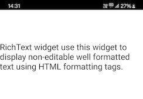

                           

RichText
--------

Use a RichText widget to display formatted text. The RichText widget uses HTML formatting tags to display text with links, images, and character styles such as bold and italic.

To learn how to use this widget programmatically, refer [VoltMX Iris Widget guide](../../../Iris/iris_widget_prog_guide/Content/RichText.md).

### Important Considerations

The following is an important considerations for a RichText widget.

*   If you specify a skin for a RichText widget, font level settings such as color style and size are applied to the entire content of the widget. Use the label style HTML formatting tag to override the text color specified by the skin.

### Look Properties

Look properties define the appearance of the widget. The following are the major properties you can set:

*   Whether the widget is visible.
*   The platforms on which the widget is rendered.
*   How the widget aligns with its parent widget and neighboring widgets.
*   If the widget displays content, where the content appears.

For descriptions of the properties available on the Look tab of the Properties pane, see [Look](Look.md#Flex).

### Skin Properties

Skin properties define a skin for the widget, including background color, borders, and shadows. If the widget includes text, you can also specify the text font.

For a RichText widget, you can apply a skin and its associated properties for the following states:

  
| Skin | Definition |
| --- | --- |
| Normal | The default skin of a widget. |
| Link | The skin applied to a link in the RichText widget. |
| Link Focus | The skin applied to link when it has the focus. |
| Telephone Link | The skin applied to a telephone link in the RichText widget. > **_Note:_** Telephone Link skins are available only on the Windows platform. |
| Hover | The look and feel of the widget when the cursor hovers over the widget. > **_Note:_** Hover skins are available only on the Windows (native) Tablet platform. |
| Super Script | The skin applied to superscripts in the RichText widget. > **_Note:_** Super Script skins are available only on the Windows platform. |

For more information about applying skins, see [Understanding Skins and Themes](Customizing_the_Look_and_Feel_with_Skins.md).

### Rich Text Properties

Rich Text properties specify properties that are available on any platform supported by Volt MX Iris, and assign platform-specific properties.

#### Rich Text Wrapping

Specifies how the label wraps text, either Word Wrap or Character Wrap:

*   Word Wrap (Default): Text wraps between words at the end of a line.
*   Character Wrap: Text wraps between characters at the end of a line.

> **_Note:_** This property is specific to the iOS platform.

#### Tool Tip

For the Windows Tablet platform, specifies a message that displays when you hover the mouse pointer over the widget.

> **_Note:_** As from V9.5.15 onwards, `windows desktop` channel has been removed or not supported, so the `Rich Text` property that was applicable to only this channel, is no longer supported and is not visible.

### Actions

Actions define what happens when an event occurs. On a RichText widget, you can run an action when the following event occurs:

*   onClick: The action is triggered when the user clicks on the widget.
*   onTouchStart: The action is triggered when the user touches the touch surface. This event occurs asynchronously.
*   onTouchMove: The action is triggered when the touch moves on the touch surface continuously until movement ends. This event occurs asynchronously.
*   onTouchEnd: The action is triggered when the user touch is released from the touch surface. This event occurs asynchronously.

For more information, see the topic, [Add Actions](working_with_Action_Editor.md).

### Placement Inside a Widget

The following table summarizes where a RichText widget can be placed:

<table style="mc-table-style: url('Resources/TableStyles/Basic.css');" class="TableStyle-Basic" cellspacing="0"><colgroup><col class="TableStyle-Basic-Column-Column1"> <col class="TableStyle-Basic-Column-Column1"></colgroup><tbody><tr class="TableStyle-Basic-Body-Body1"><td class="TableStyle-Basic-BodyE-Column1-Body1">Flex Form</td><td class="TableStyle-Basic-BodyD-Column1-Body1">Yes</td></tr><tr class="TableStyle-Basic-Body-Body1"><td class="TableStyle-Basic-BodyE-Column1-Body1">VBox Form</td><td class="TableStyle-Basic-BodyD-Column1-Body1">Yes</td></tr><tr class="TableStyle-Basic-Body-Body1"><td class="TableStyle-Basic-BodyE-Column1-Body1">FlexContainer</td><td class="TableStyle-Basic-BodyD-Column1-Body1">Yes</td></tr><tr class="TableStyle-Basic-Body-Body1"><td class="TableStyle-Basic-BodyE-Column1-Body1">FlexScrollContainer</td><td class="TableStyle-Basic-BodyD-Column1-Body1">Yes</td></tr><tr class="TableStyle-Basic-Body-Body1"><td class="TableStyle-Basic-BodyE-Column1-Body1">ScrollBox</td><td class="TableStyle-Basic-BodyD-Column1-Body1">Horizontal Orientation - YesVertical Orientation- Yes</td></tr><tr class="TableStyle-Basic-Body-Body1"><td class="TableStyle-Basic-BodyE-Column1-Body1">Tab</td><td class="TableStyle-Basic-BodyD-Column1-Body1">Yes</td></tr><tr class="TableStyle-Basic-Body-Body1"><td class="TableStyle-Basic-BodyE-Column1-Body1">Segment</td><td class="TableStyle-Basic-BodyD-Column1-Body1">Yes</td></tr><tr class="TableStyle-Basic-Body-Body1"><td class="TableStyle-Basic-BodyE-Column1-Body1">Popup</td><td class="TableStyle-Basic-BodyD-Column1-Body1">Yes</td></tr><tr class="TableStyle-Basic-Body-Body1"><td class="TableStyle-Basic-BodyB-Column1-Body1">Template&nbsp;</td><td class="TableStyle-Basic-BodyA-Column1-Body1">Header- NoFooter- No</td></tr></tbody></table>

### Widget Appearance on Platforms

The appearance of the RichText widget varies as follows:

  
| Platform | Appearance |
| --- | --- |
| Android |  |
| iOS |  |
| SPA |  |

