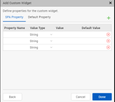

                         


Custom Widgets for SPA and Desktop Web
======================================

A custom widget is a group of widgets created to perform a specific task, functionality or signal.

In Volt MX Iris, you can use custom widgets in the following methods.

*   Custom widgets created using third party web libraries and frameworks.
*   Custom widgets created in Volt MX Iris and wrapped as components. These components can be re-used in other applications. For more information about how to create components and use them, refer the [Working with Components](C_DesigningWorkingWithComponents.md#creating-applications-with-components).

This document describes the process of using custom widgets using third party web libraries and frameworks in SPA and Desktop web channels and how to import them as a component.

This section provides information about the following processes of custom widgets in SPA and Desktop web applications.

*   [Defining new custom widgets in Volt MX Iris](#defining-new-custom-widgets-in-volt-mx-iris)
*   [Edit Custom Widget and Wrapper in Volt MX Iris](#edit-custom-widget-and-wrapper-in-volt-mx-iris)
*   [Clip Bounds Property for Custom widget](#clip-bounds-property-for-custom-widget)
*   [Import the Custom Widget into Volt MX Iris](#import-the-custom-widget-into-volt-mx-iris)
*   [Export a Custom Widget in Volt MX Iris](#export-a-custom-widget-in-volt-mx-iris)
*   [Delete a Custom Widget in Volt MX Iris](#delete-a-custom-widget-in-volt-mx-iris)

Defining New Custom Widgets in Volt MX Iris
-------------------------------------------------

You can define custom widgets in Volt MX Iris using a third party library or framework.

Here are the steps for defining a third-party custom widgets or web library in SPA and Desktop Web application using Volt MX Iris.

1.  In Volt MX Iris, open the application to which you want to add the custom web widget.
2.  From the **Edit** menu of the Iris, select **Manage Web Libraries**.  
    The **Manage Web Libraries** window appears.  
      
    
3.  To add a new custom widget, click **Add New**.  
    The **Add Custom Widget** window appears.
4.  In the **Add Custom Widget** window, provide the following information:
    *   **Widget Name**: The name used to display the custom widget in your application.
    *   **Widget Library**: Click **Browse** to navigate to the location of the folder containing the custom widget/ library.  
        
        > **_Note:_** To reuse a third-party library already added to your application, select the required library from the **Widget Library** drop-down list.  
        
    *   **Export as Component**: Toggle the switch to **On** to add the custom widget as a component to your application.  
          
        When you Toggle the switch to **Off**, the custom widget is not added as a component.  
        The custom widget is added as a new widget to the Default Library of Volt MX Iris.
5.  Click **Next**.
6.  In the new window that appears customize the properties of the custom widget as per your requirement, and then click **Done**.  
      
    The **Create New Component with Contract** window appears.
7.  Provide the following details in the Create New Component with Contract window:
    *   **Namespace**: Provide the name of the namespace of the component
    *   **Name**: Provide the name of the component that will contain the custom widget.  
        This field is auto-populated with the name of the custom widget.  
          
        
8.  Click **OK**.
9.  The custom widget is added to your application with a default wrapper contract file.  
    Click **Yes**, to edit the custom widget wrapper.js file.  
    Click **No**, if not required.  
      
    For more information about how to write and import a contract definition file, refer [Write and Import the Contract Definition File](#write-and-import-the-contract-definition-file).  
    
10.  Click **Done**.  
    The new custom widget has been added to the **Templates** explorer, under Components.  
    The custom widget is also be added under Default Library on the bottom-left of your canvas.

> **_Note:_** For SPA applications, to view the added custom web widget in the Default Library, you must open the form in the web view of the canvas. To open the form in web view, from the top of the canvas(near the button BVR), select the platform as web. For example, for an iOS SPA application, from the drop-down, select **iOS Mobile: Web**.  
In Desktop Web application, the Default Library opens in web view by default.

### Write and Import the Contract Definition File

When you create or import a custom widget into Volt MX Iris, two functions are created automatically inside the widget wrapper file: _initializeWidget_ and _modelChange_.

When the _initializeWidget_ function is created, it does not contain any code. However, the initializeWidget function might contain the code for library initialization as a comment. You must edit this function to provide the code for making the custom widget functional. This code has the configurations required for the custom widget to start working including the initialization of the objects.

All changes in state are notified to the custom widget through the widget wrapper contract (_modelChange_). The developer of the custom widget and its wrapper can make use of the information provided in the _modelChange_ call and make changes to the custom widget state accordingly.

If you want to use a widget developed by using any third party library or framework, you should expose the widget to the Volt MX SPA platform by implementing an interface defined in JavaScript. The contract definition is as follows:

```
/*Using this function you initialize the widget. A parentNode is  a container where you place the custom widget. It is the placeholder div that respects the layout of a Volt MX Widget and the custom widget is placed in the parentNode. The widgetModel parameter is a hashmap containing key - value pairs of the properties and its corresponding values.*/

function initializeWidget(parentNode, widgetModel) 

/*Using the modelChange function any changes to the widget property is mapped both in Volt MX widget model and the third party widget property. The widgetModel is a hash map containing key-value pairs of the properties and its corresponding values. propertyChanged is the key of the property being changed. propertyValue is the value assigned to the key.*/

function modelChange(widgetModel, propertyChanged, propertyValue)						

```

#### Sample wrapper \*.js file for SPA

Here is the contract definition file for the **NewGrid** widget that you want to import into your project.

```
/*Ensure the name of the class is the same as that of the widget name specified through IDE*/
NewGrid = {
    /*Initialize widget is invoked by SPA for widget initialization using the constructor*/
    initializeWidget: function(parentElement, widgetModel) {
        parentElement.innerHTML = '<div id="jsGrid" style="height:100%; width:100%;"><div id="div1"></div></div>';
        var clients = [{
            "Name": "Otto Clay",
            "Age": 25,
            "Country": 1,
            "Address": "Ap #897-1459 Quam Avenue",
            "Married": false
        }, {
            "Name": "Connor Johnston",
            "Age": 45,
            "Country": 2,
            "Address": "Ap #370-4647 Dis Av.",
            "Married": true
        }, {
            "Name": "Lacey Hess",
            "Age": 29,
            "Country": 3,
            "Address": "Ap #365-8835 Integer St.",
            "Married": false
        }, {
            "Name": "Timothy Henson",
            "Age": 56,
            "Country": 1,
            "Address": "911-5143 Luctus Ave",
            "Married": true
        }, {
            "Name": "Ramona Benton",
            "Age": 32,
            "Country": 3,
            "Address": "Ap #614-689 Vehicula Street",
            "Married": false
        }];

        var countries = [{
                Name: "",
                Id: 0
            }, {
                Name: "United States",
                Id: 1
            }, {
                Name: "Canada",
                Id: 2
            }, {
                Name: "United Kingdom",
                Id: 3
            }


        ];

        $("#jsGrid").jsGrid({
            height: "auto",
            width: "100%",
            inserting: true,
            editing: true,
            sorting: ((widgetModel.sortable === 'true' || widgetModel.sortable === true) ? true : false),
            paging: true,
            data: clients,
            fields: [{
                name: "Name",
                type: "text",
                width: 150,
                validate: "required"
            }, {
                name: "Age",
                type: "number",
                width: 50
            }, {
                name: "Address",
                type: "text",
                width: 200
            }, {
                name: "Country",
                type: "select",
                items: countries,
                valueField: "Id",
                textField: "Name"
            }, {
                name: "Married",
                type: "checkbox",
                title: "Is Married",
                sorting: false
            }, {
                type: "control"
            }]
        });
    },

    modelChange: function(widgetModel, propertyChanged, propertyValue) {
        if (propertyChanged === 'data') {
            $("#jsGrid").jsGrid({
                data: propertyValue
            });
        } else if (propertyChanged === 'sortable') {
            $("#jsGrid").jsGrid({
                sorting: ((propertyValue === 'true' || propertyValue === true) ? true : false)
            });
        }
    }
};
```

> **_Important:_** If you specify an absolute value for a property in the library files, the widgets placed next to it or after it might be distorted. We recommend not to provide an absolute value.

> **_Important:_** Third-party container custom widgets such as tab panes are not supported.

Edit Custom Widget and Wrapper in Volt MX Iris
----------------------------------------------------

After adding the Custom widgets, you can edit the custom widget and wrapper.js file in Volt MX Iris.

You can edit all the properties of the custom widget except for the name of the custom widget.

Follow these steps to edit the custom widget and widget wrapper.js file.

1.  From the **Edit** menu of the Iris, select **Manage Web Libraries**.
2.  In the **Manage Web Libraries** window, select the  icon to edit the custom widget.  
    The **Edit Custom Widget** window appears.
3.  Click **Next**.
4.  In the new window, customize the properties of the custom widget as required.
5.  In the same window, under **Files**, for the custom widget wrapper, select  icon to edit the wrapper.js file.  
    The custom widget wrapper file opens in the JS code editor

Clip Bounds Property for Custom widget
--------------------------------------

From Volt MX Iris V9 SP2 FP7 , support for the Clip Bounds property is available for custom widgets in a Responsive Web app. Using this feature, developers can enable or disable the visibility of the content overflow. Content overflow is the content that appears outside the view area of the widget. The default value for the Clip Bounds property is OFF. When the Clip Bounds property is set to OFF, the content overflow is visible. Prior to the V9 SP2 FP7 release, to display the content overflow, developers had to modify the custom widget dimensions, which creates layout issues in some cases.

> **_Note:_** For existing custom widgets, the default value of the Clip Bounds property is ON. For new custom widgets, the default value of the clip Bounds property is OFF.

For example, if the HTML content that is rendered by a third-party library exceeds the custom widget dimensions, content overflow occurs. Using the Clip Bounds property, developers can configure whether the content must be clipped or must be allowed to overflow.

Import the Custom Widget into Volt MX Iris
------------------------------------------------

Follow these steps to import a custom web widget into your applications.

1.  Using Volt MX Iris open the web application to which you want to add the custom widget.
2.  From the Project menu of the Iris, navigate to Import > Custom Web Widget.  
    A file explorer window appears.
3.  Navigate to the folder containing the zip file of the custom widget. Select the custom widget.
4.  Click Open.  
    The custom widget has been successfully imported to your application.  
    

Export a Custom Widget in Volt MX Iris
--------------------------------------------

Follow these steps to export the custom widget and widgetwrapper.js file.

1.  From the **Edit** menu of the Iris, select **Manage Web Libraries**.
2.  In the **Manage Web Libraries** window, select the  icon to export the custom widget.  
    A file explorer window appears.
3.  Select a folder from your system.  
    Click **Select Folder**.

The custom widget is now saved as a zip file in the specified folder.

Delete a Custom Widget in Volt MX Iris
--------------------------------------------

Follow these steps to delete the custom widget from your applicaation.

1.  From the **Edit** menu of the Iris, select **Manage Web Libraries**.
2.  In the **Manage Web Libraries** window, select the  icon to delete the custom widget.  
    A Iris dialog appears.  
    
3.  Click **Yes**.  
    The custom widget is now deleted from your application.
