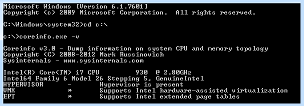
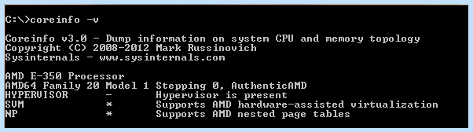

                           

Windows Phone and Tablet
========================

Using Volt MX Iris, you can develop applications on a number of Windows versions for different devices and channels. For instructions on how to do so, click one of the following options.

*   [Windows UWP Tablet](#windows-uwp-tablet)

Windows UWP Tablet
------------------

With Volt MX Iris, you can create an app that supports Windows 10 universal Windows program (UWP) tablets. Getting your system set up to build and test Windows 10 applications in Volt MX Iris involves the following tasks.

*   The Windows 10 SDK works best on the Windows 10, Version 1511 operating system. However, it is also supported on the following versions of Windows, although not all tools are supported on these versions: Windows 8.1, Windows 8, Windows 7, Windows Server 2012, Windows Server 2008 R2
*   If you want to use the Windows 10 tablet simulator, your computer must be running, at a minimum, Windows 8.0.

Getting your system set up to build and test Windows 10 applications in Volt MX Iris involves the following tasks.

1.  [Confirm your system meets Windows 10 development requirements](#confirm-your-system-meets-windows10-development-requirements)
2.  [Create and/or sign in to your Microsoft account](#create-andor-sign-in-to-your-microsoft-account)
3.  [Install and Configure the Windows SDK 10](#install-and-configure-the-windows-sdk10)

### Confirm Your System Meets Windows 10 Development Requirements

To develop for the Windows 10 platform and run its emulator, your computer needs to meet certain hardware and software requirements. The procedures in this section guide you through confirming that your system meets them. At a minimum, it needs to be capable of running Microsoft Windows 8.

1. [Confirm that your computer's CPU supports SLAT](#confirm-that-your-computers-cpu-supports-slat).

2. [Confirm other system requirements for Windows 10](#confirm-other-system-requirements-for-windows-10).

#### Confirm that your computer's CPU supports SLAT

To run the Windows 10 tablet simulator, your computer needs a central processing unit (CPU) that supports Second Level Address Translation (SLAT) .

> **_Note:_** SLAT support is necessary to use the Windows 8 emulator. If your CPU does not support SLAT, you can still install and use the Windows 8 SDK in Volt MX Iris on a computer running Windows 8 Pro or greater, but you won't be able to use the Windows 10 tablet simulator.

To check if your CPU supports SLAT, do the following:

1.  Download _Coreinfo.zip_ from the [Windows Sysinternals](http://technet.microsoft.com/en-us/sysinternals/cc835722.aspx "http://technet.microsoft.com/en-us/sysinternals/cc835722.aspx") web page.
2.  Extract the zip file to a folder, such as _C:\\Coreinfo_.
3.  Click **Start**, and then in the **Search programs and files** text box, type _cmd.exe_.
4.  When it appears in the search results, right-click it, and then click **Run as administrator**.
5.  In the command window that launches, type coreinfo.exe -v, and then press **Enter**.
6.  **Edit the system environments**. Doing so opens the **System Properties** dialog box.
7.  Navigate to the path where you extracted the zip file.
8.  In the command window that launches, type coreinfo.exe -v, and then press **Enter**. After a few seconds, a license agreement for Coreinfo appears. If you agree to the terms, click **Agree**. Coreinfo will then display the results of its analysis.

An asterisk (\*) displays if the CPU supports the Windows 8 platform. If no asterisk displays, then the CPU does not support the Windows 8 platform.

For example, for an Intel CPU, if the processor supports SLAT, an asterisk (\*) displays in the EPT row, indicating support for extended page tables, as seen here.

If you have an AMD processor, then an asterisk (\*) is displayed for NP (Nested Page tables), as seen here.

#### Confirm Other System Requirements for Windows 10

To develop for the Windows 10 platform and run its tablet simulator, your computer needs to meet the following additional system requirements for hardware and software.

*   64-bit (x64) CPU
*   2.5 GB of internal storage
*   4 GB RAM
*   Windows 8 Pro edition or greater

### Create and/or sign in to your Microsoft account

While it is possible to download and install the Windows SDK 10 without a Microsoft account, getting additional resources, such as emulators, requires one. So if you don't already have an account, creating one at this point in the process will cause the least amount of disruption to you.

To create and/or sign in to your Microsoft account, do the following:

1.  Using a web browser, navigate to the [Windows Dev Center](https://dev.windows.com/en-us "https://dev.windows.com/en-us").
2.  Click **Sign in**.
3.  Do one of the following, depending on which applies to you:
    *   **You already have a Microsoft account.** Enter the email address and password of your account, and then click **Sign in**.
    *   **You do not have a Microsoft account.** Do the following.
        1.  Scroll down to the prompt that asks _Don't have a Microsoft account?_, and then click **Sign up now**. Doing so opens the _Create an account_ page.
        2.  Fill in the required fields, and then click **Create account**. A verification page appears informing you that Microsoft has sent you an email message to confirm your identity.
        3.  Following the instructions on the verification page, check the email account you associated with your Microsoft account, and using the link in the email message Microsoft sent you, verify your identity.
            
            > **_Note:_** If you do not see the email message in your inbox, check your spam or junk mail folder.
            
4.  Once you have verified your Microsoft account, if you are not already signed in, do so now by following the initial steps of this procedure.
    
    > **_Note:_** If you are signed in, the email address you associated with your Microsoft account appears in the upper right corner of the web page.
    

### Install and configure the Windows SDK 10

The Windows SDK 10 contains resources to develop universal Windows apps (UWA) for Windows 10, as well as apps and desktop applications for Windows Phone, including emulators.

To install the Windows SDK 10, do the following:

1.  Using a web browser, navigate to the [Windows SDK 10](https://dev.windows.com/en-us/downloads/windows-10-sdk) page on the Microsoft Download Center.
2.  Click **Download the standalone SDK**.
3.  Choose the language version you want to install, and then click **Download**. Doing so initiates the downloading of _sdksetup.exe_.
4.  Once _sdksetup.exe_ has downloaded, launch it and follow the prompts to install the SDK.
