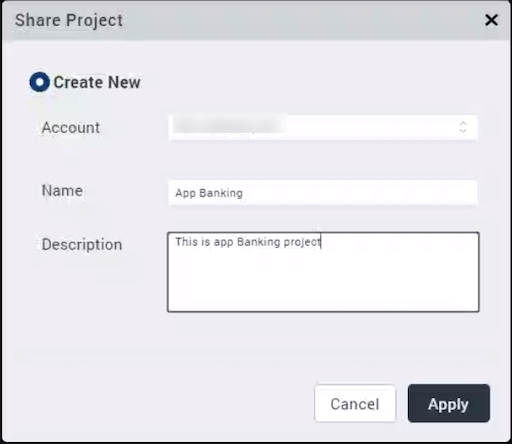
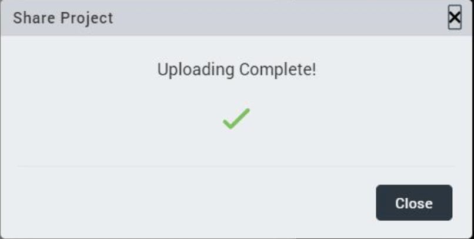
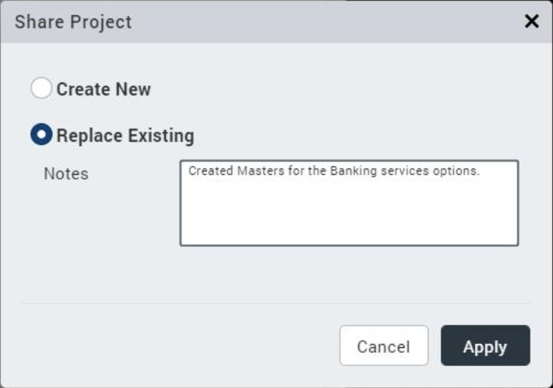

                          

Export a Volt MX Iris Project
===================================

You can export a project to a local space on your computer or you can export a project to a Volt MX Cloud account.

For more information, click any of the following sections:

*   [Share a Local Project](#share-a-local-project)
*   [Share a Project on the Cloud](#share-a-project-on-the-cloud)

Share a Local Project
---------------------

You can export your Volt MX Iris project locally so that you can share the project with stakeholders, who can then download and import the project, review it, and make necessary changes.

To export your project to a local space on your system, do the following:

1.  From the **Project** menu, go to **Export** > **Local Project**.  
    The Save As dialog Box appears.
2.  Navigate to the folder where you want to save the project, and then click Save.  
    Volt MX Iris exports the project as a zipped file.

Share a Project on the Cloud
----------------------------

By publishing your project to the cloud, your stakeholders can download the complete project, make changes, and then upload the modified project back to the cloud.

To publish your project to the cloud, do the following:

1.  If you are not currently logged in to your Volt MX account, do so now by clicking **Login** in the top right corner of the Volt MX Iris window. The Volt MX Account sign-in window opens.
2.  Enter your email and password credentials for your Volt MX account, and then click **Continue**. Once you are signed in, your account name displays in the top right corner of the Volt MX Iris window.
3.  From the **Project** menu, go to **Export** > **Cloud Project**.

    The Share Project dialog box displays.

     

4.  From the **Account** drop-down list, select the cloud account to which you want the project published.

    > **_Note:_** If your profile is linked to a single account, the Share Project dialog box does not contain a list for the Account field.

5.  In the **Name** text box, the project name is populated automatically. To change this, enter the name that you want people to see when they log in to the cloud account to download the project.
6.  If you want, in the **Description** text box, type a brief description of your project, such as a version number or something about what's new in this iteration.
7. Click **Apply**. The upload begins.
8. Depending on the size of your project and the speed of your internet connection, uploading the project may take some time. After the project is uploaded, Volt MX Iris displays a confirmation message. Click **Close** to complete the process of sharing the project.
    

      

    
    The maximum allowed file size is 256 MB (in .zip format).
    

Now that the project is uploaded to the cloud, users can download and view it using the import feature in Volt MX Iris. For more information, see [Import a Volt MX Iris Project from a Cloud Account](ImportVoltMXIrisProject.md#import-a-project-from-a-cloud-account).

### Invite Users to a Cloud Account

Publishing a project to a cloud account presumes necessitates that stakeholders have access to it. To grant access, you invite users to the cloud account.

To invite users to a cloud account, do the following:

.As an admin of a cloud, you can invite users by following the below steps:

1.  Visit http://manage.hclvoltmx.com and enter your Volt MX account credentials.
2.  After validating your login credentials, click the **Settings** icon along the left edge of the page.

    

3.  Click **Invite User**.
4.  In the **Invite User** dialog box,
    *   Enter the email address of the user you're inviting.
    *   Select an account role to be assigned to the user. Available roles include: Owner, Admin, Billing, and Member.
    *   From the existing cloud accounts, select the type of access to be provided to the user. Selecting the **Full Access** option results in adding the user to the cloud account.

The user receives an email invitation to join the cloud account, complete with instructions on how to do so.

Modifying a Shared Project
--------------------------

This procedure assumes that you have already imported the shared project into Volt MX Iris. For more information, see [Import a Volt MX Iris Project from a Cloud Account](ImportVoltMXIrisProject.md#import-a-project-from-a-cloud-account).

To modify a shared project, do the following:

1.  In Volt MX Iris, if you are not already logged in, log in to your Volt MX account.
2.  Open the shared project in Volt MX Iris.
3.  Make the necessary changes to the project and save it. To make it easier for stakeholders to recognize the changes you have made, use the Review tab on the Properties Editor to add notes. For more information, see [Capture Product Requirements with Review Notes](CapProdReqsWithNotes.md).
4.  On the **Publish** menu, click **Project**.
5.  Volt MX Iris prompts you to confirm that you want to replace the existing project on the cloud. Click **Apply** to upload the modified project.
    
     
    
6.  Depending on the size of your project and the speed of your internet connection, uploading the project may take some time. After the project is uploaded, Volt MX Iris displays a confirmation message. Click **Close** to complete the process of sharing the project.
    
     
    

### Shared Project Limitations

You can re-upload a project to the same cloud that you imported it from. For example, a user shares a project on a cloud account **A**. You can import this project (assuming you have the necessary permissions) and make changes to the project, and then upload it back to the same cloud account **A**. But you cannot share this project on any other cloud account even if you have access to multiple accounts (like cloud account **B**, **C** and **D**).

Hence, it is always advisable that an admin create a cloud account specific to a project and invite all the stakeholders of the project to this account. This ensures that the project is available for all to share and modify.
