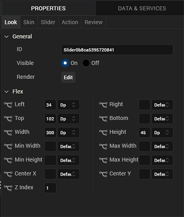
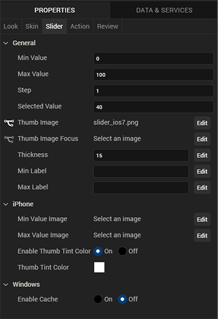
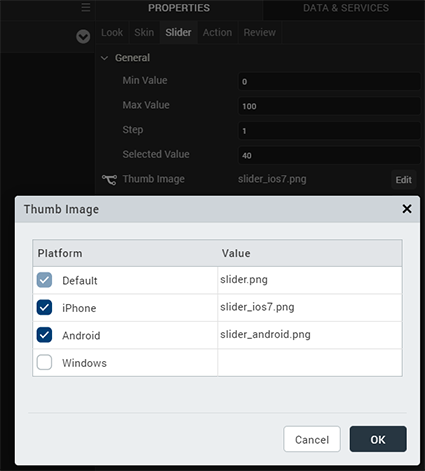
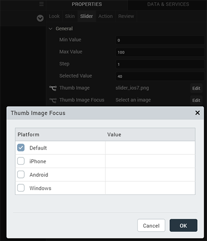
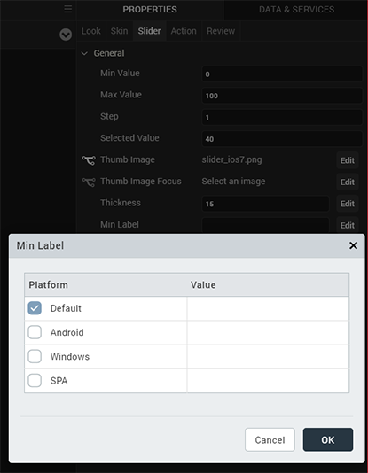
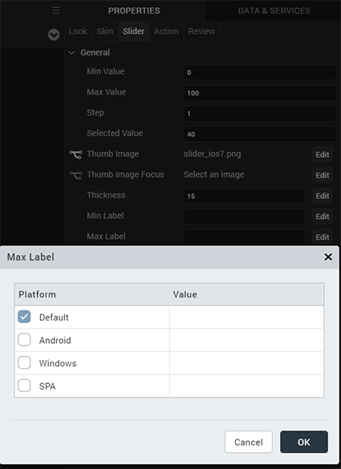
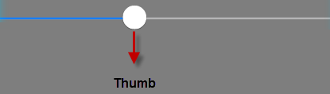
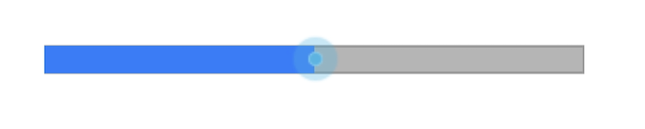
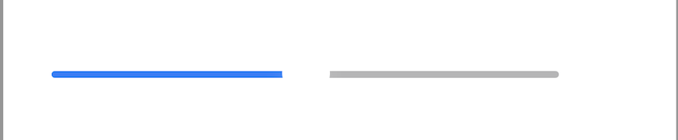

                           

Slider
------

Use a Slider widget to select from a range of values by moving a slider indicator horizontally. You can display minimum and maximum values, and update the displayed value when you drag the indicator along the slider.

To learn how to use this widget programmatically, refer [VoltMX Iris Widget guide](../../../Iris/iris_widget_prog_guide/Content/Slider.md).

> **_Note:_** The Slider widget is not supported in SPA platforms.

### Important Considerations

The following are important considerations for a Slider widget.

*   All platforms (except iPhone): Use the [Min Label](#min-label) and [Max Label](#max-label) properties to specify minimum and maximum values.
*   iPhone: Use the [Min Value Image](#min-value-image) and the [Max Value Image](#max-value-image) properties to display images of minimum and maximum values.

### Look Properties

Look properties define the appearance of the widget. The following are the major properties you can set:

*   Whether the widget is visible.
*   The platforms on which the widget is rendered.
*   How the widget aligns with its parent widget and neighboring widgets.
*   If the widget displays content, where the content appears.

For descriptions of the properties available on the Look tab of the Properties pane, see [Look](Look.md#Flex).

### Skin Properties

Skin properties define a skin for the widget, including background color, borders, and shadows. If the widget includes text, you can also specify the text font.

For a Slider widget, you can apply a skin and its associated properties for the following states:

  
| Skin | Definition |
| --- | --- |
| Left | The skin applied to the background of the slider on left side of the thumb image. |
| Right | The skin applied to the background of the slider on right side of the thumb image. |
| Min Label | The skin applied to the min property of the slider. |
| Max Label | The skin applied to the max property of the slider. |

For more information about applying skins, see [Understanding Skins and Themes](Customizing_the_Look_and_Feel_with_Skins.md).

### Slider Properties

Slider properties specify properties that are available on any platform supported by Volt MX Iris, and assign platform-specific properties.

> **_Note:_** In this section, the properties that can be forked are identified by an icon  located to the left of the property. For more information, see [Fork a Widget Property](Forking.md#fork-a-widget-property).

#### Min Value

Specifies the minimum value that you can select.

**Default**: 0

#### Max Value

Specifies the maximum value that you can select.

**Default**: 100

#### Step

Specifies the increment by which the slider value is increased or decreased between the minimum and maximum values.

**Default**: 1

You can specify a value between the difference of the maximum and minimum values of the slider; for example, if the minimum value is 40 and the maximum value is 45, the step value can be between 1 and 5.

#### Selected Value

Specifies the value that is displayed as the selected value.

**Default**: 40

If you do not specify a selected value, the value displayed is the minimum value plus half the difference between the minimum and the maximum value. For example, if the minimum value is 0 and the maximum value is 100, the value displayed is 50.

If you specify a selected value that is less than the minimum value, the selected value uses the minimum value. If you specify a selected value that is greater than the maximum value, the selected value uses the maximum value.

#### Thumb Image

Specifies the image used for the indicator, or thumb.

To provide a default or platform-specific image, click the **Edit** button to open the Thumb Image dialog box.

To provide a platform-specific image or to replace the default image, select the desired platform and click inside the **Value** field to open the **Select Image** dialog box. You can either select an available image or provide an image URL.

#### Thumb Image Focus

Specifies an image to indicate that the thumb has the focus.

To provide a default or a platform-specific image, click the **Edit** button to open the **Thumb Focus Image** dialog box.

To provide a platform-specific image or to replace the default image, select the desired platform and click inside the **Value** field to open the **Select Image** dialog box. You can either select an available image or provide an image URL.

#### Thickness

Specifies the thickness of the seek bar.

**Default**: 15

#### Min Label

Specifies the text displayed below the minimum value of the slider. This text become the default for all platforms.

To provide a platform-specific label, click the **Edit** button to open the **Min Label** dialog box.

#### Max Label

Specifies the text displayed below the maximum value of the slider. This text become the default for all platforms.

To provide a platform-specific label, click the **Edit** button to open the **Max Label** dialog box.

#### Min Value Image

For the iOS platform, specifies an image for the minimum value of the slider.

Click the **Edit** button to open the **Min Value Image** dialog box, and either select an available image or provide and image URL.

#### Max Value Image

For the iOS platform, specifies the image for the maximum value of the slider.

Click the **Edit** button to open the **Max Value Image** dialog box, and either select an available image or provide and image URL.

#### Enable Thumb Tint Color

For the iOS platform, specifies whether to enable a color for the slider thumb.

#### Thumb Tint Color

*   For the iOS platform, specifies a tint color for the thumb if tint color is enabled. To select a tint color, click the color picker to open the color selection dialog box, and then select a color.

### Actions

Actions define what happens when an event occurs. On a Slider widget, you can run an action when the following events occur:

*   onSlide: The action is triggered when the slider moves.
    
    *   For touch-based devices, the action is triggered when you stop sliding the thumb indicator.
    *   For non touch-based devices, the action is triggered when the left or right key is released.
*   onSelection: The action is triggered when you makes a selection.
    
    *   For touch-based devices, the action is triggered when you stop sliding the thumb indicator.
        
    *   For non touch-based devices, the action is triggered when the left or right key is released.
        

*   onTouchStart: The action is triggered when the user touches the touch surface. This event occurs asynchronously.
*   onTouchMove: The action is triggered when the touch moves on the touch surface continuously until movement ends. This event occurs asynchronously.
*   onTouchEnd: The action is triggered when the user touch is released from the touch surface. This event occurs asynchronously.

For more information, see the topic, [Add Actions](working_with_Action_Editor.md).

### Placement Inside a Widget

The following table summarizes where an Image widget can be placed:

<table style="mc-table-style: url('Resources/TableStyles/Basic.css');" class="TableStyle-Basic" cellspacing="0"><colgroup><col class="TableStyle-Basic-Column-Column1"> <col class="TableStyle-Basic-Column-Column1"></colgroup><tbody><tr class="TableStyle-Basic-Body-Body1"><td class="TableStyle-Basic-BodyE-Column1-Body1">Flex Form</td><td class="TableStyle-Basic-BodyD-Column1-Body1">Yes</td></tr><tr class="TableStyle-Basic-Body-Body1"><td class="TableStyle-Basic-BodyE-Column1-Body1">VBox Form</td><td class="TableStyle-Basic-BodyD-Column1-Body1">Yes</td></tr><tr class="TableStyle-Basic-Body-Body1"><td class="TableStyle-Basic-BodyE-Column1-Body1">FlexContainer</td><td class="TableStyle-Basic-BodyD-Column1-Body1">Yes</td></tr><tr class="TableStyle-Basic-Body-Body1"><td class="TableStyle-Basic-BodyE-Column1-Body1">FlexScrollContainer</td><td class="TableStyle-Basic-BodyD-Column1-Body1">Yes</td></tr><tr class="TableStyle-Basic-Body-Body1"><td class="TableStyle-Basic-BodyE-Column1-Body1">ScrollBox</td><td class="TableStyle-Basic-BodyD-Column1-Body1">Horizontal Orientation - Yes Vertical Orientation- Yes</td></tr><tr class="TableStyle-Basic-Body-Body1"><td class="TableStyle-Basic-BodyE-Column1-Body1">Tab</td><td class="TableStyle-Basic-BodyD-Column1-Body1">Yes</td></tr><tr class="TableStyle-Basic-Body-Body1"><td class="TableStyle-Basic-BodyE-Column1-Body1">Segment</td><td class="TableStyle-Basic-BodyD-Column1-Body1">No</td></tr><tr class="TableStyle-Basic-Body-Body1"><td class="TableStyle-Basic-BodyE-Column1-Body1">Popup</td><td class="TableStyle-Basic-BodyD-Column1-Body1">Yes</td></tr><tr class="TableStyle-Basic-Body-Body1"><td class="TableStyle-Basic-BodyB-Column1-Body1">Template&nbsp;</td><td class="TableStyle-Basic-BodyA-Column1-Body1">Header- NoFooter- No</td></tr></tbody></table>

### Widget Appearance on Platforms

The appearance of the Slider widget on varies as follows:

  
| Platform | Appearance |
| --- | --- |
| Android |  |
| iPhone |  |

