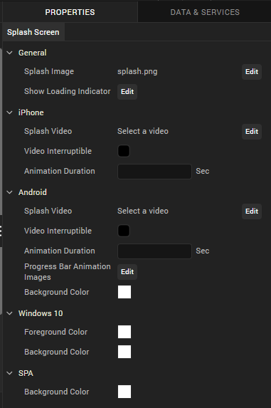
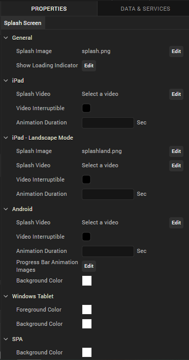
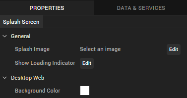

                         


Configure Splash Screens
========================

A splash screen is the initial screen that appears when you launch an application.

This topic covers the following procedures:

[Configure the Splash Screen for the Mobile Channel](#configure-the-splash-screen-for-the-mobile-channel)

[Configure the Splash Screen for the Tablet Channel](#configure-the-splash-screen-for-the-tablet-channel)

[Configure the Splash Screen for the Desktop Channel](#configure-the-splash-screen-for-the-desktop-channel)

[Clear the Splash Screen of a Channel](#clear-the-splash-screen-of-a-channel)

Configure the Splash Screen for the Mobile Channel
--------------------------------------------------

To configure the splash screen for the mobile channel, do the following:

1.  In the Project Explorer, on the **Project** tab, expand the Mobile channel, and then click **Splash Screen**. Its properties display in the Properties pane.
    
    
    
2.  In the General section, click **Edit** to select a Splash Image. The Splash Image dialog appears.
    
    *   If you want a default splash image for all the platforms, select default option under platform and assign a desired image.
    *   If you want to set image for selected platforms, you need to select required platform and an image respectively.
    
    > **_Note:_** Splash screen Image names should not have spaces, uppercase letters, special characters. Supported formats for the image are PNG, JPEG, and GIF.
    
3.  In the General section, click **Edit** to configure a Loading Indicator. This property is applicable only for iPhone, Android, Windows platform.
    *   The Show Loading Indicator dialog appears in which you need to select required platform and set value to true in order to show loading indicator.
    *   If you want to set same value for all platforms, select default option under platform and set its value to true or false.
4.  Click **Edit** to select Splash Video. Choose Splash Video dialog appears in which you need to select a video (Make sure the video is placed in common folder under Resources). This property is applicable only for iPhone and Android platforms.
    
    > **_Note:_** Splash video occupies the time between start of the application till the initialization of the application. Once the application gets initialized, it ends the video (even if it is not complete) and launches the application. The preferable video formats are MP4 and M4V.
    
    > **_Note:_** For iOS apps, to mix the audio of the splash video with other music apps (running in the background) you must add a new **mix audio** attribute in the **infoplist\_configuration.json** file of the app in the **resources** file of the app project.  
      
    `"mixAudio":true`  
    
5.  Select if the video can be interrupted using Video Interpretable check box.
6.  Specify the Animation Duration in seconds. Each progress bar image you specify appears on the screen for the specified number of seconds.
7.  Specify the Progress Bar Animation Images by clicking the **Edit** button. Browse and select to add each progress bar animation image. This property is applicable only for Android.
8.  Select the Background Color
    *   Under Android and Windows, the Color picker dialog appears in which you need to choose a desired background color.
    *   Under SPA, the Color picker dialog appears in which you need to choose a desired background color.

### Native iOS Configuration for Xcode Launch Storyboard

As Apple has deprecated support for Splash images from April 2020, support for creating and launching an Xcode Storyboard through Iris has been added from Visualizer V9 Fixpack3.

Volt MX  Iris has deprecated support for the iOS Splash screens. You must use the Launch Storyboard feature to configure splash screens for iOS devices. The launch storyboard feature supports all the existing functionality of the splash screen such as support for video, active indicator, and others. However, the Splash image that you set will not work.

Storyboards are flexible to any device orientation and any device size. Using the storyboard, you can design a splash screen by configuring the **UISupportedInterfaceOrientations** key with information about the supported orientations in the `infoplist_configuration.json` file.

> **_Important:_** These settings are equivalent to the app-level setting. If a specific orientation is mentioned here, and an unsupported orientation is mentioned at the form-level, the application may crash.

Here is an example for configuring the **infoplist\_configuration** file to support the Xcode Storyboard feature on an application setting level.

```
{
    "UISupportedInterfaceOrientations": [
        "UIInterfaceOrientationPortrait",
        "UIInterfaceOrientationPortraitUpsideDown",
        "UIInterfaceOrientationLandscapeLeft",
        "UIInterfaceOrientationLandscapeRight"
    ]
}
```

*   If the application must only support portrait orientation, you must mention only the **UIInterfaceOrientationPortrait**, **UIInterfaceOrientationPortraitUpsideDown** values for iPad and { {**UIInterfaceOrientationPortrait**} } value for iPhone.
*   If the application must only support landscape orientation, you must mention only the **UIInterfaceOrientationLandscapeLeft**, **UIInterfaceOrientationLandscapeRight** values for both iPhone and iPad.

> **_Note:_** If you do not configure the **UISupportedInterfaceOrientations** key, iPhone apps will support all device orientations other than the upside-down orientation, and iPad apps will support all device orientations, by default.

### Configure the Splash Screen for iOS Native Devices

As Apple has deprecated support for Splash images from April 2020, support to customize a Splash screen for the iOS Native channel has been added in Iris from Volt MX Iris V9 Fixpack 10. For the iOS Native channel, you can add widgets to the Splash screen, and also customize the properties for the widgets.

Volt MX  Iris has deprecated support for the iOS Splash images. You must use the Launch Storyboard feature to configure the splash screens for iOS devices. The launch storyboard feature supports all the existing functionality of the splash screen such as support for video, active indicator, and others. However, the Splash image that you set will not work.

> **_Note:_** If you import a project that was created in previous versions of Volt MX Iris, you must re-configure the Splash screen for the iOS Native channel.

For the iOS Native channel, in addition to the steps mentioned at [Configure the Splash Screen for the Mobile Channel](#configure-the-splash-screen-for-the-mobile-channel), you can configure the Background of the Form from the [Skin](#configure-the-skin-properties-of-the-splash-screen) tab, and also drag and drop the [Widgets from the Default Library](#add-widgets-from-the-default-library) onto the Form.

> **_Note:_** Currently, only the Image and Label widgets can be added to a Splash Screen Form.

#### Configure the Skin Properties of the Splash Screen

In the Background section of the Skins tab, from the Type drop-down list, select the type of background you want.

> **_Note:_** Background Type for the Splash Screen Skin only supports Single Color.

*   Click the square color icon to open the Color Palette window.  
    To select a particular hue, on the vertical color bar drag the two opposing arrows to the hue you want, and then change the hue’s lightness, darkness, and saturation by dragging to the desired location on the large color square. You can also assign a color by changing the RGB values, the HSB values, or pasting a hexadecimal value from another program into the **#** text box. To close the Color Palette window, click anywhere outside of it.
*   By default, the opacity is set to 100, making the background completely opaque with no transparency. However, if you want the background to have a degree of transparency, you can decrease its opacity. To do so, type a value between 0 and 100 in the Opacity text box, or drag the opacity slider to the degree of opacity that you want.

#### Add Widgets from the Default Library

The Splash Screen Form only supports the Image and Label widgets.

When you add an Image widget to a Splash Screen, the following properties are available in the Properties panel:

  
| Look | Image |
| --- | --- |
| 
##### General

Visible Controls whether or not the widget is visible to the user of the app. To make a widget visible, click **On**. To make a widget invisible, click **Off**.

##### **Flex Properties**

The Flex properties enables you to resize, move and position a widget. Following are the options that can be used as units of the Flex properties: **dp**: Specifies the values in terms of device independent pixels. **%**: Specifies the values in percentage relative to the parent dimensions. **Left**: Determines the left edge of the widget and measured from the left bound of the parent container. **Right**: Determines the right edge of the widget and measured from the right bound of the parent container. **Top**: Determines the top edge of the widget and measured from the top bounds of the parent container. **Bottom**: Determines the bottom edge of the widget and measured from the bottom bounds of the parent container. **Width**: Width determines the width of the widget as measured along the x-axis. **Height**: Determines the height of the widget as measured along the y-axis (height of the parent). **Center X**: The Center X property refers to the center of the widget as measured from the left boundary of the parent container. **Center Y**: The Center Y property refers to the center of the widget as measured from the top boundary of the parent container. | 

##### Source

Specifies the source of the image to be displayed. You can specify an image from the Resources folder. To specify an image:

Click the **Edit** button to open the Source dialog box. Locate and select the image you want from the list of available images. Click **Open**. The Source property displays the file name.

##### Content Mode

Specifies how the image is scaled within the Image widget. **Default**: Scale Aspect Fit The following scale options are available: **Scale to Fill**: Scales the image horizontally and vertically in the frame of the image widget (stretches). It does not maintain the aspect ratio. Scale Aspect Fit: Fits the image into the frame based on the dimension of the image and the frame of the widget (either fits horizontally or fits vertically depending on the dimensions of the image widget, or the rendering room available for the image). It maintains the aspect ratio of the image. **Scale Aspect Fill**: Fills the image completely in the frame of the image widget (fills both horizontally and vertically depending on the dimensions of the image, covering the complete frame of the widget). It maintains the aspect ratio of the image. |

When you add a Label widget to a Splash Screen, the following properties are available in the Properties panel:

  
| Look | Skin |
| --- | --- |
| 
##### General

**Visible**: Controls whether or not the widget is visible to the user of the app. To make a widget visible, click **On**. To make a widget invisible, click **Off**.

##### Appearance

Content Align Allows you to define how content lines up within the widget. Following alignment options are available:

Horizontal Alignment : Aligns content relative to the left and right margins of the widget. The available options for alignment are Left, Center , and Right.> **_Note:_** Horizontal alignment of a widget is possible only when the Expand Horiz property is enabled.

**Text** Specifies the text displayed on a widget.

##### **Flex Properties**

The Flex properties enables you to resize, move and position a widget. Following are the options that can be used as units of the Flex properties: **dp**: Specifies the values in terms of device independent pixels. **%**: Specifies the values in percentage relative to the parent dimensions. **Left**: Determines the left edge of the widget and measured from the left bound of the parent container. **Top**: Determines the top edge of the widget and measured from the top bounds of the parent container. **Width**: Width determines the width of the widget as measured along the x-axis. **Height**: Determines the height of the widget as measured along the y-axis (height of the parent). **Center X**: The Center X property refers to the center of the widget as measured from the left boundary of the parent container. **Center Y**: The Center Y property refers to the center of the widget as measured from the top boundary of the parent container. | 

##### General

**Name**:When you create a new skin, Volt MX Iris generates a unique name for it. And while you're welcome to keep the name that Volt MX Iris generates, you might find it more useful and easily recognizable if you rename it.

##### Fonts

You can modify the following font properties of a widget: **Color**: Denotes the font color. To modify the font color, do one of the following:**Select a color.** To do so, click the square color icon to open the Color Palette window. To select a particular hue, on the vertical color bar drag the two opposing arrows to the hue you want, and then change the hue’s lightness, darkness, and saturation by dragging to the desired location on the large color square. You can also assign a color by changing the RGB values, the HSB values, or pasting a hexadecimal value from another program into the **#** text box. To close the Color Palette window, click anywhere outside of it.**Reuse an existing color.** For more information, see [Copy and Paste a Color or Gradient](Copy_and_Paste_a_Color.md). **Opacity**: You can change the opacity level of the font color. **Size**: You can set the font size by pixels (0 to 600) or as a percentage (0 to 600) of the baseline font size of 28 pixels. > **_Note:_** The Volt MX Iris framework, however, consumes only percentage-based values for font size. As the px values are purely representational, you must use percentage-based values while setting the skin's font size. > **_Note:_** In iOS devices with OS 13, for certain font sizes, you will observe spacing. **Font Family**: Click the **Edit** button of the **Font Family** property to open the **Font Names** window. |

Configure the Splash Screen for the Tablet Channel
--------------------------------------------------

To configure the splash screen for the tablet channel, do the following:

1.  In the Project Explorer, on the **Properties** tab, expand the Tablet channel, and then click **Splash Screen**. Its properties display in the Properties editor.
    
    
    
2.  In the General section, click **Edit** to select a Splash Image. The Splash Image dialog appears.
    
    *   If you want a default splash image for all the platforms, select default option under platform and assign a desired image.
    *   If you want to set image for selected platforms, you need to select required platform and an image respectively.
    *   You need to set image for iPad-Landscape Mode separately.
    
    > **_Note:_** Splash screen Image names should not have spaces, uppercase letters, special characters. Supported formats for the image are PNG, JPEG, and GIF.
    
3.  In the General section, click **Edit** to configure a Loading Indicator. This property is applicable only for iPad, Android, Windows platforms.
    *   The Show Loading Indicator dialog appears in which you need to select required platform and set value to true in order to show loading indicator.
    *   If you want same value for all platforms, select default option under platform and set its value to true or false.
4.  Click **Edit** to select Splash Video. Choose Splash Video dialog appears in which you need to select a video (Make sure the video is placed in common folder under Resources). This property is applicable only for iPad and Android platforms.
    
    > **_Note:_** Splash video occupies the time between start of the application till the initialization of the application. Once the application gets initialized, it ends the video (even if it is not complete) and launches the application. The preferable video formats are MP4 and M4V.
    
5.  Select if the video can be interrupted using Video Interpretable check box.
6.  Specify the Animation Duration in seconds. Each progress bar image you specify, appears on the screen for the specified number of seconds.
7.  Specify the Progress Bar Animation Images by clicking the **Edit** button. Browse and select to add each progress bar animation image. This property is applicable only for Android.
8.  Select the Background Color.
    *   Under Android, the color picker dialog appears, in which you need to choose a desired background color.
    *   Under SPA, the color picker dialog appears in which you need to choose a desired background color.

### Native iOS Configuration for Xcode Launch Storyboard

As Apple has deprecated support for Splash images from April 2020, support for creating and launching an Xcode Storyboard through Iris has been added from Volt MX Iris V9 Fixpack3.

Volt MX  Iris has deprecated support for the iOS Splash screens. You must use the Launch Storyboard feature to configure splash screens for iOS devices. The launch storyboard feature supports all the existing functionality of the splash screen such as support for video, active indicator, and others. However, the Splash image that you set will not work.

Storyboards are flexible to any device orientation and any device size. Using the storyboard, you can design a splash screen by configuring the **UISupportedInterfaceOrientations** key with information about the supported orientations in the `infoplist_configuration.json` file.

> **_Important:_** These settings are equivalent to the app-level setting. If a specific orientation is mentioned here, and an unsupported orientation is mentioned at the form-level, the application may crash.

Here is an example for configuring the **infoplist\_configuration** file to support the Xcode Storyboard feature on an application setting level.

```
{
    "UISupportedInterfaceOrientations~ipad": [
        "UIInterfaceOrientationPortrait",
        "UIInterfaceOrientationPortraitUpsideDown",
        "UIInterfaceOrientationLandscapeLeft",
        "UIInterfaceOrientationLandscapeRight"
    ]
}

```

*   If the application must only support portrait orientation, you must mention only the **UIInterfaceOrientationPortrait**, **UIInterfaceOrientationPortraitUpsideDown** values for iPad and { {**UIInterfaceOrientationPortrait**} } value for iPhone.
*   If the application must only support landscape orientation, you must mention only the **UIInterfaceOrientationLandscapeLeft**, **UIInterfaceOrientationLandscapeRight** values for both iPhone and iPad.

> **_Note:_** If you do not configure the **UISupportedInterfaceOrientations** key, iPhone apps will support all device orientations other than the upside-down orientation, and iPad apps will support all device orientations, by default.

### Configure the Splash Screen for iOS Native Devices

As Apple has deprecated support for Splash images from April 2020, support to customize a Splash screen for the iOS Native channel has been added in Iris from Volt MX Iris V9 Fixpack 10. For the iOS Native channel, you can add widgets to the Splash screen, and also customize the properties for the widgets.

Volt MX  Iris has deprecated support for the iOS Splash images. You must use the Launch Storyboard feature to configure the splash screens for iOS devices. The launch storyboard feature supports all the existing functionality of the splash screen such as support for video, active indicator, and others. However, the Splash image that you set will not work.

> **_Note:_** If you import a project that was created in previous versions of Volt MX Iris, you must re-configure the Splash screen for the iOS Native channel.

For the iOS Native channel, in addition to the steps mentioned at [Configure the Splash Screen for the Tablet Channel](#configure-the-splash-screen-for-the-tablet-channel), you can configure the Background of the Form from the [Skin](#configure-the-skin-properties-of-the-splash-screen) tab, and also drag and drop the [Widgets from the Default Library](#add-widgets-from-the-default-library) onto the Form.

> **_Note:_** Currently, only the Image and Label widgets can be added to a Splash Screen Form.

#### Configure the Skin Properties of the Splash Screen

In the Background section of the Skins tab, from the Type drop-down list, select the type of background you want.

> **_Note:_** Background Type for the Splash Screen Skin only supports Single Color.

*   Click the square color icon to open the Color Palette window.  
    To select a particular hue, on the vertical color bar drag the two opposing arrows to the hue you want, and then change the hue’s lightness, darkness, and saturation by dragging to the desired location on the large color square. You can also assign a color by changing the RGB values, the HSB values, or pasting a hexadecimal value from another program into the **#** text box. To close the Color Palette window, click anywhere outside of it.
*   By default, the opacity is set to 100, making the background completely opaque with no transparency. However, if you want the background to have a degree of transparency, you can decrease its opacity. To do so, type a value between 0 and 100 in the Opacity text box, or drag the opacity slider to the degree of opacity that you want.

#### Add Widgets from the Default Library

The Splash Screen Form only supports the Image and Label widgets.

When you add an Image widget to a Splash Screen, the following properties are available in the Properties panel:

  
| Look | Image |
| --- | --- |
| 
##### General

Visible Controls whether or not the widget is visible to the user of the app. To make a widget visible, click **On**. To make a widget invisible, click **Off**.

##### **Flex Properties**

The Flex properties enables you to resize, move and position a widget. Following are the options that can be used as units of the Flex properties: **dp**: Specifies the values in terms of device independent pixels. **%**: Specifies the values in percentage relative to the parent dimensions. **Left**: Determines the left edge of the widget and measured from the left bound of the parent container. **Right**: Determines the right edge of the widget and measured from the right bound of the parent container. **Top**: Determines the top edge of the widget and measured from the top bounds of the parent container. **Bottom**: Determines the bottom edge of the widget and measured from the bottom bounds of the parent container. **Width**: Width determines the width of the widget as measured along the x-axis. **Height**: Determines the height of the widget as measured along the y-axis (height of the parent). **Center X**: The Center X property refers to the center of the widget as measured from the left boundary of the parent container. **Center Y**: The Center Y property refers to the center of the widget as measured from the top boundary of the parent container. | 

##### Source

Specifies the source of the image to be displayed. You can specify an image from the Resources folder. To specify an image:

Click the **Edit** button to open the Source dialog box. Locate and select the image you want from the list of available images. Click **Open**. The Source property displays the file name.

##### Content Mode

Specifies how the image is scaled within the Image widget. **Default**: Scale Aspect Fit The following scale options are available: **Scale to Fill**: Scales the image horizontally and vertically in the frame of the image widget (stretches). It does not maintain the aspect ratio. Scale Aspect Fit: Fits the image into the frame based on the dimension of the image and the frame of the widget (either fits horizontally or fits vertically depending on the dimensions of the image widget, or the rendering room available for the image). It maintains the aspect ratio of the image. **Scale Aspect Fill**: Fills the image completely in the frame of the image widget (fills both horizontally and vertically depending on the dimensions of the image, covering the complete frame of the widget). It maintains the aspect ratio of the image. |

When you add a Label widget to a Splash Screen, the following properties are available in the Properties panel:

  
| Look | Skin |
| --- | --- |
| 
##### General

**Visible**: Controls whether or not the widget is visible to the user of the app. To make a widget visible, click **On**. To make a widget invisible, click **Off**.

##### Appearance

Content Align Allows you to define how content lines up within the widget. Following alignment options are available:

Horizontal Alignment : Aligns content relative to the left and right margins of the widget. The available options for alignment are Left, Center , and Right.> **_Note:_** Horizontal alignment of a widget is possible only when the Expand Horiz property is enabled.

**Text** Specifies the text displayed on a widget.

##### **Flex Properties**

The Flex properties enables you to resize, move and position a widget. Following are the options that can be used as units of the Flex properties: **dp**: Specifies the values in terms of device independent pixels. **%**: Specifies the values in percentage relative to the parent dimensions. **Left**: Determines the left edge of the widget and measured from the left bound of the parent container. **Top**: Determines the top edge of the widget and measured from the top bounds of the parent container. **Width**: Width determines the width of the widget as measured along the x-axis. **Height**: Determines the height of the widget as measured along the y-axis (height of the parent). **Center X**: The Center X property refers to the center of the widget as measured from the left boundary of the parent container. **Center Y**: The Center Y property refers to the center of the widget as measured from the top boundary of the parent container. | 

##### General

**Name**:When you create a new skin, Volt MX Iris generates a unique name for it. And while you're welcome to keep the name that Volt MX Iris generates, you might find it more useful and easily recognizable if you rename it.

##### Fonts

You can modify the following font properties of a widget: **Color**: Denotes the font color. To modify the font color, do one of the following:**Select a color.** To do so, click the square color icon to open the Color Palette window. To select a particular hue, on the vertical color bar drag the two opposing arrows to the hue you want, and then change the hue’s lightness, darkness, and saturation by dragging to the desired location on the large color square. You can also assign a color by changing the RGB values, the HSB values, or pasting a hexadecimal value from another program into the **#** text box. To close the Color Palette window, click anywhere outside of it.**Reuse an existing color.** For more information, see [Copy and Paste a Color or Gradient](Copy_and_Paste_a_Color.md). **Opacity**: You can change the opacity level of the font color. **Size**: You can set the font size by pixels (0 to 600) or as a percentage (0 to 600) of the baseline font size of 28 pixels. > **_Note:_** The Volt MX Iris framework, however, consumes only percentage-based values for font size. As the px values are purely representational, you must use percentage-based values while setting the skin's font size. > **_Note:_** In iOS devices with OS 13, for certain font sizes, you will observe spacing. **Font Family**: Click the **Edit** button of the **Font Family** property to open the **Font Names** window. |

Configure the Splash Screen for the Desktop Channel
---------------------------------------------------

To configure the splash screen for the Desktop channel, do the following:

1.  On the Project Explorer, on the **Properties** tab, expand the Desktop channel, and then click **Splash Screen**.
2.  In the General section, click the **Edit** button that corresponds with **Select an image**. The Splash Image dialog displays.
3.  appears in which you need to select Desktop Web platform and an image.
    
    > **_Note:_** Splash screen Image names should not have spaces, uppercase letters, special characters. Supported format for the image is PNG. Supported formats for the image are PNG, JPEG, and GIF.
    



5.  In the General section, click **Edit** to configure a Loading Indicator. The Show Loading Indicator dialog appears in which you need to select Desktop Web platform and set value to true in order to enable this property.
6.  In Desktop Web section, select Background Color. The color picker dialog appears in which you need to choose a desired background color.

### Configure a Splash Screen by using Custom CSS/HTML

In Volt MX Iris V9 Service Pack 2, you can utilize CSS and HTML capabilities to implement a splash screen for Responsive web apps by using Custom CSS and Custom HTML code.

> **_Note:_** Ensure that you use the V9 Service Pack 2 version of both Volt MX Iris and Volt MX Foundry to utilize this feature.

When you design a splash screen by using Custom CSS code, Volt MX Iris applies the custom HTML code to the splash screen content and then applies the Custom CSS code.

You can implement any of the functionalities supported by custom CSS and custom HTML in the splash screen.

To add Custom CSS or Custom HTML code to a Splash Screen, follow these steps:

1.  From the **Project** Explorer, expand the Responsive Web/Desktop channel, and then click **Splash Screen**.
2.  From the **Properties** panel, in the **Desktop Web** section, select the **Custom HTML/CSS** check-box to enable it.  
    The Custom CSS and Custom HTML text boxes appear.
3.  Add or paste the custom code in the Custom CSS or Custom HTML text box, and save the project.

### Limitations

*   The Custom CSS or Custom HTML based splash screen is only supported on the Responsive Web channel.
*   The Responsive Web app must be published on the Volt MX Foundry V9 Service Pack 2 version, for the Custom CSS or Custom HTML code to be effective.
*   You cannot access Local Resources ](such as local images or fonts) in both the Custom CSS and Custom.md codes.
*   The Custom CSS or Custom HTML code does not support locale-based splash screens.

> **_Note:_** You can use either the image-based splash screen or implement a splash screen by using Custom CSS ](or Custom.md) code. If you use an image and add custom code, the splash screen is implemented based on the custom code.

Clear the Splash Screen of a Channel
------------------------------------

You can clear the splash screen configuration so that you can either restart the configuration or do without a splash screen.

To clear the splash screen configuration of a channel, do the following:

1.  In the Project Explorer, on the **Project** tab, expand the channel for which you want to clear the splash screen.
2.  Click **Splash Screen**.
3.  In the Properties Editor, on the **Splash Screen** tab, click the **Edit** button associated with the Splash Image property.
4.  Ensure that the check box for the platform you want to clear the splash screen from is checked, then click that platform's Value cell.
5.  Click once any image file that is listed so that it is selected in the list, then click it again so that no image in the list is selected.
6.  Click **OK** to close the Select Image dialog box.
7.  Repeat steps 4 through 6 for any other platforms that you want to clear the splash screen from.
8.  Click **OK** to close the Splash Image dialog box.

*   In the Project Explorer, on the **Project** tab, click the context menu arrow for the desired channel (Mobile, Tablet, or Desktop), and then click **Clear Splash Screen**.
