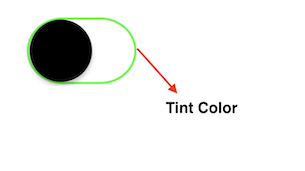

                           

Switch
------

Use a Switch widget to let a user choose between two mutually exclusive choices or states, similar to the Switch control on an iPhone .

The Switch widget displays the value that is currently in effect. Slide the control to select or reveal the other value.

To learn how to use this widget programmatically, refer [VoltMX Iris Widget guide](../../../Iris/iris_widget_prog_guide/Content/Switch.md).

> **_Note:_** The Switch widget is supported on iOS, Android, and Windows platforms, both Native and SPA.

### Important Considerations

The following are important considerations for a Switch widget:

*   Use a predictable pair of values so that the user does not have to slide the switch to know the other value.
*   Consider using the Switch widget to change the state of other user interface elements in the view. For example, in an airline application booking screen you could use a Switch widget to let the user select between One Way and Round Trip, displaying a different set of user interface elements for each option.

### Look

Look properties define the appearance of the widget. The following are the major properties you can set:

*   Whether the widget is visible.
*   The platforms on which the widget is rendered.
*   How the widget aligns with its parent widget and neighboring widgets.
*   If the widget displays content, where the content appears.

For descriptions of the properties available on the Look tab of the Properties pane, see [Look](Look.md#Flex).

### Skin

Skin properties define a skin for the widget, including background color, borders, and shadows. If the widget includes text, you can also specify the text font.

For the Switch widget, you can apply a skin and its associated properties for the following states:

  
| Skin | Definition |
| --- | --- |
| Normal | The default skin of a widget. |
| Focus | The skin applied when the focus is on a widget. |
| Thumb Color | The color of switch's slider button. This property is available under BackGround when you fork the skin for iPhone Native, and also when you fork the entire form for Android Native.  |
| Tint Color | This property is available under BackGround only when you fork the skin for iPhone Native.  |

For more information about applying skins, see [Understanding Skins and Themes](Customizing_the_Look_and_Feel_with_Skins.md).

### Switch Properties

Switch properties specify properties that are available on any platform supported by Volt MX Iris, and assign platform-specific properties.

#### State

Lets you toggle the switch colors.

#### Left Text

Specifies the text to be displayed on the left portion of the switch.

#### Right Text

Specifies the text to be displayed on the right portion of the switch.

### Actions

Actions define what happens when an event occurs. On a Switch widget, you can run an action when the following events occur:

*   onSlide: The action is triggered when there is a change in the default selected value.
*   onTouchStart: The action is triggered when the user touches the touch surface. This event occurs asynchronously.
*   onTouchMove: The action is triggered when the touch moves on the touch surface continuously until movement ends. This event occurs asynchronously.
*   onTouchEnd: The action is triggered when the user touch is released from the touch surface. This event occurs asynchronously.

For more information, see [Add Actions](working_with_Action_Editor.md).

### Placement Inside a Widget

The following table summarizes where a Switch widget can be placed:

  
| Widget | Switch placement inside a widget |
| --- | --- |
| Flex Form | Yes |
| VBox Form | Yes |
| FlexContainer | Yes |
| FlexScrollContainer | Yes |
| ScrollBox | Horizontal Orientation - yesVertical Orientation- Yes |
| Tab | Yes |
| Segment | Yes |
| Popup | Yes |
| Template  | Header- NoFooter- No |

<table style="margin-left: 0;margin-right: auto;mc-table-style: url]('Resources/TableStyles/RevisionTable.css');" class="TableStyle-RevisionTable" cellspacing="0" data-mc-conditions="Default.md5 Only"><colgroup><col class="TableStyle-RevisionTable-Column-Column1" style="width: 42px;"> <col class="TableStyle-RevisionTable-Column-Column1"> <col class="TableStyle-RevisionTable-Column-Column1"></colgroup><tbody><tr class="TableStyle-RevisionTable-Body-Body1"><td class="TableStyle-RevisionTable-BodyE-Column1-Body1" data-mc-conditions="Default.HTML5 Only,Default.Iris7-1,Default.Iris7-1-1,Default.Iris7-2">Rev</td><td class="TableStyle-RevisionTable-BodyE-Column1-Body1" data-mc-conditions="Default.HTML5 Only,Default.Iris7-1,Default.Iris7-1-1,Default.Iris7-2">Author</td><td class="TableStyle-RevisionTable-BodyD-Column1-Body1" data-mc-conditions="Default.HTML5 Only,Default.Iris7-1,Default.Iris7-1-1,Default.Iris7-2">Edits</td></tr><tr class="TableStyle-RevisionTable-Body-Body1"><td class="TableStyle-RevisionTable-BodyB-Column1-Body1" data-mc-conditions="Default.HTML5 Only,Default.Iris7-1,Default.Iris7-1-1,Default.Iris7-2">8</td><td class="TableStyle-RevisionTable-BodyB-Column1-Body1" data-mc-conditions="Default.HTML5 Only,Default.Iris7-1,Default.Iris7-1-1,Default.Iris7-2">SHS</td><td class="TableStyle-RevisionTable-BodyA-Column1-Body1" data-mc-conditions="Default.HTML5 Only,Default.Iris7-1,Default.Iris7-1-1,Default.Iris7-2">SHS</td></tr></tbody></table>
