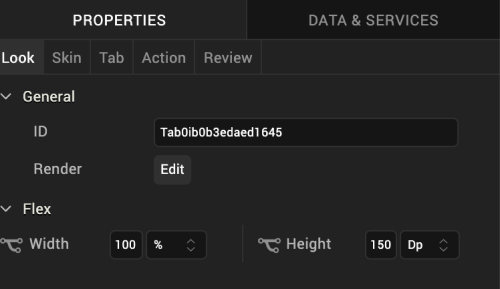
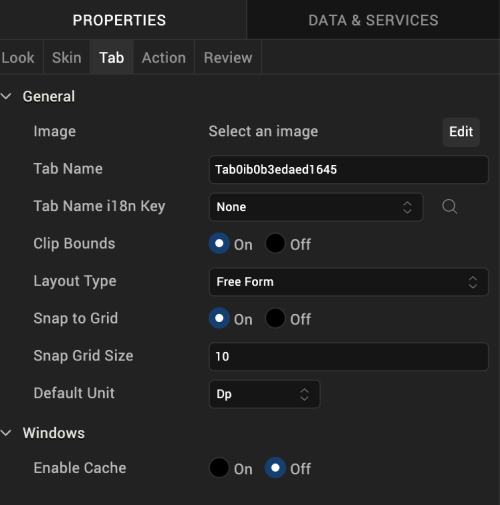

                          

Tab
---

Use a Tab widget to hold a collection of widgets on a form. You can use multiple tabs to display groups of related widgets. A user views one tab at a time.

### Look Properties

Look properties define the appearance of the widget.

### Tab Properties

Tab properties specify properties that are available on any platform supported by Volt MX Iris, and assign platform-specific properties.

#### Image

Specifies an image to display next to the tab name. To select an image, click **Edit** to display the **Image** window. From the list of images, choose an image, and then click **OK**.

#### Tab Name

Specifies the name of the tab.

#### Clip Bounds

Specifies whether to clip child widgets displayed in the tab pane when they go out of boundaries.

#### Layout Type

Specifies whether the arrangement of widgets in the tab flows horizontally, vertically, or in both directions.

Default: Vertical

#### Snap to Grid

Specifies whether the widget aligns to the nearest intersection of lines in the grid, or other widgets.

#### Snap Grid Size

Specifies the grid size. This option is available only when **Snap to Grid** is enabled.

#### Default Unit

Specifies the default unit used for interpretation of numbers with no qualifiers when passed to layout properties.

Following are the options:

*   dp: Specifies the values in terms of device independent pixels.
*   px: Specifies the values in terms of device hardware pixels.
*   %: Specifies the values in percentage relative to the parent dimensions.

### Actions

Actions define what happens when an event occurs. On a Tab widget, you can run an action when the following events occur:

*   onInit: The action is triggered when the user navigates to the tab.
*   onTouchStart: The action is triggered when the user touches the touch surface. This event occurs asynchronously.
*   onTouchMove: The action is triggered when the touch moves on the touch surface continuously until movement ends. This event occurs asynchronously.
*   onTouchEnd: The action is triggered when the user touch is released from the touch surface. This event occurs asynchronously.

For more information, see [Add Actions](working_with_Action_Editor.md).

### Placement Inside a Widget

A Tab widget can only be placed inside a TabPane widget.

<table style="margin-left: 0;margin-right: auto;mc-table-style: url]('Resources/TableStyles/RevisionTable.css');" class="TableStyle-RevisionTable" cellspacing="0" data-mc-conditions="Default.md5 Only"><colgroup><col class="TableStyle-RevisionTable-Column-Column1" style="width: 26px;"> <col class="TableStyle-RevisionTable-Column-Column1"> <col class="TableStyle-RevisionTable-Column-Column1"></colgroup><tbody><tr class="TableStyle-RevisionTable-Body-Body1"><td class="TableStyle-RevisionTable-BodyE-Column1-Body1" data-mc-conditions="Default.HTML5 Only">Rev</td><td class="TableStyle-RevisionTable-BodyE-Column1-Body1" data-mc-conditions="Default.HTML5 Only">Author</td><td class="TableStyle-RevisionTable-BodyD-Column1-Body1" data-mc-conditions="Default.HTML5 Only">Edits</td></tr><tr class="TableStyle-RevisionTable-Body-Body1"><td class="TableStyle-RevisionTable-BodyE-Column1-Body1" data-mc-conditions="Default.HTML5 Only">8</td><td class="TableStyle-RevisionTable-BodyE-Column1-Body1" data-mc-conditions="Default.HTML5 Only">SHS</td><td class="TableStyle-RevisionTable-BodyD-Column1-Body1" data-mc-conditions="Default.HTML5 Only">SHS</td></tr><tr class="TableStyle-RevisionTable-Body-Body1"><td class="TableStyle-RevisionTable-BodyB-Column1-Body1" data-mc-conditions="Default.HTML5 Only">7.2.1</td><td class="TableStyle-RevisionTable-BodyB-Column1-Body1" data-mc-conditions="Default.HTML5 Only">SHS</td><td class="TableStyle-RevisionTable-BodyA-Column1-Body1" data-mc-conditions="Default.HTML5 Only">SHS</td></tr></tbody></table>
