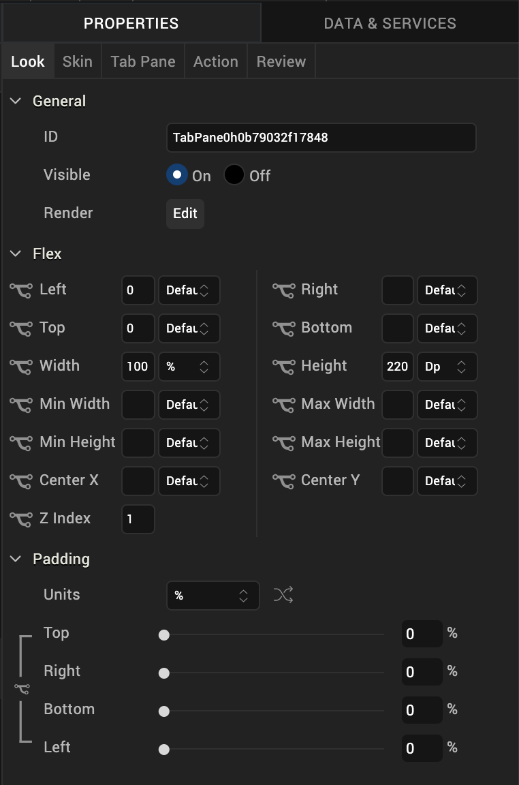
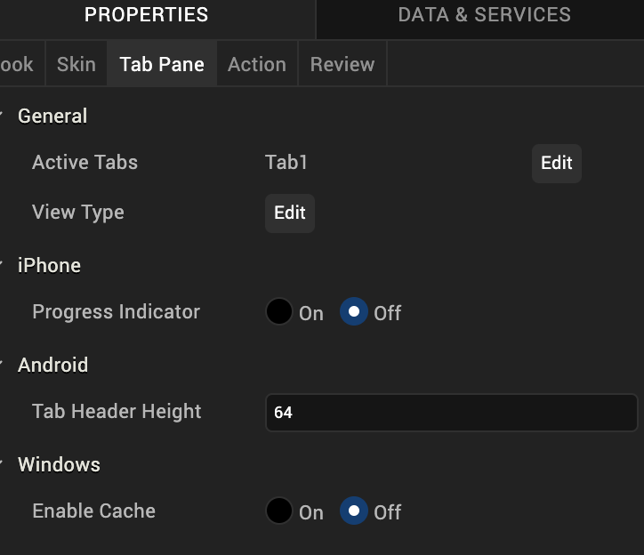

                           

TabPane
-------

Use a TabPane widget to organize multiple tabs. Each tab hold a collection of widgets on a form. A user views one tab at a time.

To learn how to use this widget programmatically, refer [VoltMX Iris Widget guide](../../../Iris/iris_widget_prog_guide/Content/TabPane.md#tabpane-widget).

### Important Considerations

The following are important considerations for a TabPane widget:

*   You can navigate within the TabPane only using the down key.
*   If you press the down key, the focus shifts to the next widget in the TabPane.
*   If you press the down key while you are on the last widget in the TabPane, you are taken to the top most widget in the TabPane.
*   If you press the right or the left arrow keys, you move to next or previous tabs.
*   Tab cycling is supported (that is, if you are on the last tab and you press the right arrow, you move to the first tab).

*   On devices that have a navigation key, the following are applicable:
    *   Each tab has a context menu. The context menu appears in the menu options when the tab has the focus.
    *   Widget focus within a tab is saved. For example, if Widget2 of Tab2 has the focus, and you navigate to Tab1 and then back to Tab2, Widget2 still has the focus.
        

### Look Properties

Look properties define the appearance of the widget. The following are the major properties you can set:

*   Whether the widget is visible.
*   The platforms on which the widget is rendered.
*   How the widget aligns with its parent widget and neighboring widgets.
*   If the widget displays content, where the content appears.

For descriptions of the properties available on the Look tab of the Properties pane, see [Look](Look.md#Flex).

### Skin Properties

Skin properties define a skin for the widget, including background color, borders, and shadows. If the widget includes text, you can also specify the text font.

For a TabPane widget, you can apply a skin and its associated properties for the following states

  
| Skin | Definition |
| --- | --- |
| Active | The skin applied when a TabPane is active. |
| Active Focus | The skin applied when a TabPane is active and has the focus. |
| Inactive | The skin applied to inactive tabs. |
| Page | The skin for the page indicator. The skin is applicable only when View Type is set to Page and images are specified for Focused Page and Unfocused Page icons. |

For more information about applying skins, see [Understanding Skins and Themes](Customizing_the_Look_and_Feel_with_Skins.md).

### TabPane Properties

TabPane properties specify properties that are available on any platform supported by Volt MX Iris, and assign platform-specific properties.

#### Active Tabs

Specifies whether tabs in the TabPane are active or inactive.

#### Full Screen Widget

For a TabPane on a VBox form, specifies whether the TabPane occupies the entire form.

> **_Note:_** Do not place more than one full-screen widget on a form.

> **_Note:_** This property is available only when a TabPane is placed inside a VBox form.

#### View Type

Specifies the TabPane view type for each platform. To specify the view type, click the **Edit** button to open the View Type dialog box, select a platform, and then select a view type.

Following are the options:

*   Tab
*   Collapsible
*   Page (iPhone and Android only)
*   Panorama (Windows only)

#### Height

Specifies the height of the TabPane as a percentage of the [Height Reference](#Height_Reference) property.

> **_Note:_** This property is available only when TabPane is placed inside a VBox Forms.

#### Height Reference

Specifies how the Height percentage is calculated.

Following are the options:

*   Form Reference: The height percentage is calculated based on the height of the form, excluding headers and footers. This option does not apply if the TabPane is placed inside a popup or a template.
*   Parent Width: If the TabPane is placed inside a popup or in templates, the width is calculated based on the width of the parent container.
    
    > **_Note:_** This property is available only when TabPane is placed inside a VBox Forms.
    

#### Progress Indicator

Specifies whether the progress indicator is displayed.

> **_Note:_** This property is specific to the iOS platform.

#### Progress Indicator Color

Specifies the color of the progress indicator, either Grey or White.

> **_Note:_** This property is specific to the iOS platform.

#### Tab Header Height

Specifies the height of the tab header.

> **_Note:_** This property is specific to the Android platform.

### Actions

Actions define what happens when an event occurs. On a Tab widget, you can run an action when the following events occur:

*   onTabClick: The action is triggered when the tab is clicked. This action is available only when the **View Type** is set to **Collapsible View**, and is triggered when you expand or collapse a tab.
*   onTouchStart: The action is triggered when the user touches the touch surface. This event occurs asynchronously.
*   onTouchMove: The action is triggered when the touch moves on the touch surface continuously until movement ends. This event occurs asynchronously.
*   onTouchEnd: The action is triggered when the user touch is released from the touch surface. This event occurs asynchronously.

For more information, see [Add Actions](working_with_Action_Editor.md).

### Placement inside a Widget

The following table summarizes where a TabPane widget can be placed:

<table style="mc-table-style: url('Resources/TableStyles/Basic.css');" class="TableStyle-Basic" cellspacing="0"><colgroup><col class="TableStyle-Basic-Column-Column1" style="width: 79px;"> <col class="TableStyle-Basic-Column-Column1"></colgroup><tbody><tr class="TableStyle-Basic-Body-Body1"><td class="TableStyle-Basic-BodyE-Column1-Body1">Flex Form</td><td class="TableStyle-Basic-BodyD-Column1-Body1">Yes.</td></tr><tr class="TableStyle-Basic-Body-Body1"><td class="TableStyle-Basic-BodyE-Column1-Body1">VBox Form</td><td class="TableStyle-Basic-BodyD-Column1-Body1">Yes, only 1</td></tr><tr class="TableStyle-Basic-Body-Body1"><td class="TableStyle-Basic-BodyE-Column1-Body1">FlexContainer</td><td class="TableStyle-Basic-BodyD-Column1-Body1">Yes</td></tr><tr class="TableStyle-Basic-Body-Body1"><td class="TableStyle-Basic-BodyE-Column1-Body1">FlexScrollContainer</td><td class="TableStyle-Basic-BodyD-Column1-Body1">Yes</td></tr><tr class="TableStyle-Basic-Body-Body1"><td class="TableStyle-Basic-BodyE-Column1-Body1">VBox</td><td class="TableStyle-Basic-BodyD-Column1-Body1">Yes, only 1</td></tr><tr class="TableStyle-Basic-Body-Body1"><td class="TableStyle-Basic-BodyE-Column1-Body1">ScrollBox</td><td class="TableStyle-Basic-BodyD-Column1-Body1">Horizontal Orientation -NoVertical Orientation- No</td></tr><tr class="TableStyle-Basic-Body-Body1"><td class="TableStyle-Basic-BodyE-Column1-Body1">Tab</td><td class="TableStyle-Basic-BodyD-Column1-Body1">No</td></tr><tr class="TableStyle-Basic-Body-Body1"><td class="TableStyle-Basic-BodyE-Column1-Body1">Segment</td><td class="TableStyle-Basic-BodyD-Column1-Body1">Horizontal Orientation -NoVertical Orientation- No</td></tr><tr class="TableStyle-Basic-Body-Body1"><td class="TableStyle-Basic-BodyE-Column1-Body1">Popup</td><td class="TableStyle-Basic-BodyD-Column1-Body1">Yes, only 1</td></tr><tr class="TableStyle-Basic-Body-Body1"><td class="TableStyle-Basic-BodyB-Column1-Body1">Template&nbsp;</td><td class="TableStyle-Basic-BodyA-Column1-Body1">Header- NoFooter- No</td></tr></tbody></table>

<table style="margin-left: 0;margin-right: auto;mc-table-style: url]('Resources/TableStyles/RevisionTable.css');" class="TableStyle-RevisionTable" cellspacing="0" data-mc-conditions="Default.md5 Only"><colgroup><col class="TableStyle-RevisionTable-Column-Column1" style="width: 26px;"> <col class="TableStyle-RevisionTable-Column-Column1"> <col class="TableStyle-RevisionTable-Column-Column1"></colgroup><tbody><tr class="TableStyle-RevisionTable-Body-Body1"><td class="TableStyle-RevisionTable-BodyE-Column1-Body1" data-mc-conditions="Default.HTML5 Only">Rev</td><td class="TableStyle-RevisionTable-BodyE-Column1-Body1" data-mc-conditions="Default.HTML5 Only">Author</td><td class="TableStyle-RevisionTable-BodyD-Column1-Body1" data-mc-conditions="Default.HTML5 Only">Edits</td></tr><tr class="TableStyle-RevisionTable-Body-Body1"><td class="TableStyle-RevisionTable-BodyE-Column1-Body1" data-mc-conditions="Default.HTML5 Only">8</td><td class="TableStyle-RevisionTable-BodyE-Column1-Body1" data-mc-conditions="Default.HTML5 Only">SHS</td><td class="TableStyle-RevisionTable-BodyD-Column1-Body1" data-mc-conditions="Default.HTML5 Only">SHS</td></tr><tr class="TableStyle-RevisionTable-Body-Body1"><td class="TableStyle-RevisionTable-BodyB-Column1-Body1" data-mc-conditions="Default.HTML5 Only">7.2.1</td><td class="TableStyle-RevisionTable-BodyB-Column1-Body1" data-mc-conditions="Default.HTML5 Only">SHS</td><td class="TableStyle-RevisionTable-BodyA-Column1-Body1" data-mc-conditions="Default.HTML5 Only">SHS</td></tr></tbody></table>
