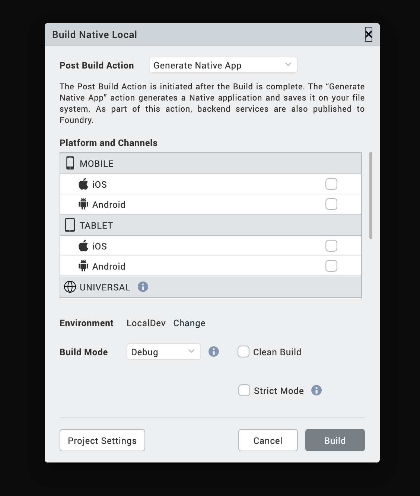
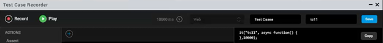
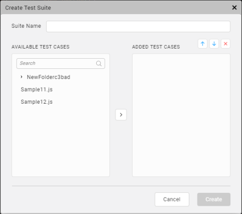
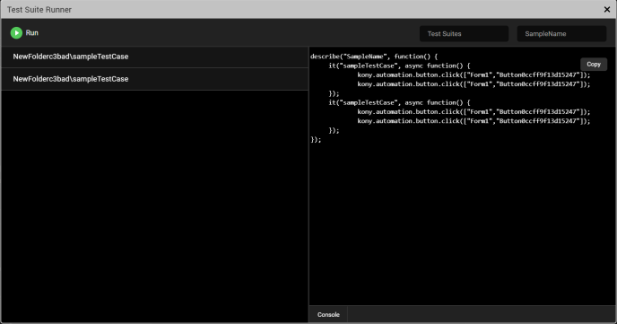
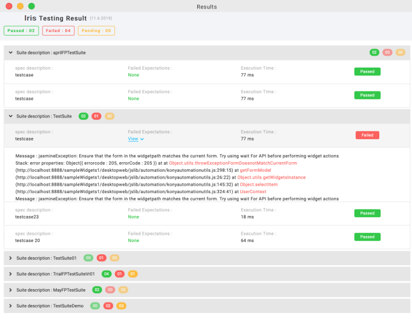

                         


Jasmine Test Automation
=======================

From V9 onwards, Volt MX Irisintroduces the test automation feature using which you can leverage the capabilities of the Jasmine test framework to record activity on an application and generate test scripts. Further, you can edit the recorded test script by adding certain actions such as Wait, Assert, and Scroll to Widget. Once you configure the actions, you can run the generated test scripts using the Live Preview option in Iris on your system, or on a mobile device to test the application.

The following topics describe the tasks related to Jasmine automation in Volt MX Iris.

*   [Create Test Resources](#create-test-resources)
*   [VoltMXAutomator](#volt-mx-automator)
*   [Deploy the Test Resources](#deploy-the-test-resources)

Create Test Resources
---------------------

There are three types of test resources in Jasmine based on their hierarchy:

*   [Test case](#test-case)
*   [Test suite](#test-suite)
*   [Test Plan](#test-plan)


### Test Case

Test Case is a test script that is written by a user or generated by recording the user's activity on the application.

The following topics cover some of the key tasks related to test cases.

*   [Create a Test Case](#create-a-test-case)
*   [Edit a Test Case](#edit-a-test-case)

#### Create a Test Case

You can create a test case by recording your activity on the app. The app must be previewed by using the [Live Preview](LivePreview.md#live-preview) feature or launched on a device by using the [Build and Publish](CloudBuildStarter.md#build-and-publish-on) feature. You can then record the user activity on the app to create a test case. Further, you can edit the recorded test case while or after creating the test case.

*   [Create a Test Case using Live Preview](#create-a-test-case-using-live-preview)
*   [Create a Test Case using Build and Publish](#create-a-test-case-using-build-and-publish)
*   [Create a Test Case using Dashboard](#create-a-new-test-case-using-dashboard)

##### Create a Test Case using Live Preview

If you use the live preview feature to view your app, follow these steps to create a test case for the app:

1.  In Iris, from the main menu, navigate to **Build** > **Live Preview Settings**.  
    The **Live Preview Settings** window appears. 


    


2.  Select the platforms and channels for which you want to build the application.
3.  From the **Preview Mode** drop-down list, select the **Test** mode.
    
4.  Click **Save and Run**.  
    The app launches on the device. The **Iris Preview** window appears.
5.  In Iris, from the **Project** Explorer, go to **Test Resources** > **Jasmine**.
6.  Expand the required < channel >, right-click on **Test Cases** or any of the sub folders and select **Create a Test Case**.  
    The **Test Case Recorder** window appears.  
      
      
    
    > **Note:**  
    *   When you minimize the **Test Case Recorder** window, a **View** option appears in the **Test** tab on the lower pane of Iris. You can click **View** to re-open the window that you have minimized.  
    *   When you minimize the **Test Case Recorder** window while playing a test case, a progress bar appears in the **Test** tab indicating the progress of test case being played. Once the test case is played completely, a toast message appears on the lower-right of Iris.          
    *   After minimizing the **Test Case Recorder** window, a few options such as **Edit**, **Delete**, and **Rename** are disabled for the test files. Also, the options to create a new Test Case, Test Suite, or Test Plan are disabled.  
           
    
      
    
7.  Re-launch the application.  
    The device connects successfully.
    
    > **_Note:_** If the device does not connect successfully, refer this [FAQ](FAQs.md#DeviceConnectedSuccessfully).  
    
8.  On the upper-left corner of the window, select **Record** to start the recording.
    
    > **_Note:_** Any activity performed by a user on the application is recorded until the user clicks **Stop**.
    
9.  After the recording starts, a **stop** option appears in the **Test Case Recorder** window. To discontinue the recording, click **Stop**.  
    You can now edit the test case to add more actions, if required. To know more about editing the test case, click [here](#TestCaseEdit).
10.  On the upper-right corner of the window, type a name for the test case and click **Save**.  
    The test case is created.

##### Create a Test Case using Build and Publish

If you want to connect to a native device instead of viewing the app using live preview, ensure that your system and the device on which you want to run the app are on the same network.

In this case, follow these steps to create a test case:

1.  In Iris, from the main menu, navigate to **Build** > **Build Native Local**.  
    The **Build Native Local** window appears.
    
    
    
    > **_Note:_** The **Build Native Local** feature enables you to build an app on the local machine. To know more about the feature, click [here](../../../Iris/iris_user_guide/Content/LocalBuildStarter.md). If you want to build the app on the cloud, select **Build and Publish Native**.
    
2.  Select the platforms and channels for which you want to build the application.
    
3.  From the **Post Build Action** drop-down menu, select **Run on my Device**.
    
4.  From the **Build Mode** drop-down list, select the **Test** mode.
    
5.  Click **Build**. The build generation begins. You can check the status of your build in the Build tab. If there are any errors, they appear in the Build tab.
    
    Once the build is completed, the app is launched on the device.
    
6.  In Iris, from the **Project** Explorer, go to **Test Resources** > **Jasmine**.
7.  Expand the required < channel >, right-click on **Test Cases** or any of the sub folders and select **Create a Test Case**.  
    The **Test Case Recorder** window appears.  
      
      
    
    > **Note:**  
    *   When you minimize the **Test Case Recorder** window, a **View** option appears in the **Test** tab on the lower pane of Iris. You can click **View** to re-open the window that you have minimized. For more information, click [here](#NoteMinimize).  
        
8.  Re-launch the application.  
    The device connects successfully.
    
    > **_Note:_** If the device does not connect successfully, refer this [FAQ](FAQs.md#DeviceConnectedSuccessfully).  
    
9.  On the upper-left corner of the window, select **Record** to start the recording.
    
    > **_Note:_** Any activity performed by a user on the application is recorded until the user clicks **Stop**.
    
10.  After the recording starts, a **stop** option appears in the **Test Case Recorder** window. To discontinue the recording, click **Stop**.  
    You can now edit the test case to add more actions, if required. To know more about editing the test case, click [here](#TestCaseEdit).
11.  On the upper-right corner of the window, type a name for the test case and click **Save**.  
    The test case is created.

To play the recorded script, re-launch the app and click **Play**. The recorded script plays in the **Iris Preview** window. You can view the result of the test case in the **Console** tab.

> **_Note:_** When you copy the recorded test case and paste it on the test case folder or sub folder in any channel. The copied test case file behaves similarly to the recorded test case.  
This behavior is not applicable for **Test Suites** and **Test Plans**.

#### Edit a Test Case

You can edit the test case to add certain actions without having to record from the device. For every activity that is recorded such as a button click or entering text, you can add several other actions before or after the activity in the Test Recorder. You can edit a test case in the following ways.

*   [Edit a Test Case Using Test Recorder](#edit-a-test-case-using-test-recorder)
*   [Add a Timeout for a Test case Using Test Recorder](#timeout)
*   [Edit a Test Case Manually](#edit-a-test-case-manually)

##### Edit a Test Case Using Test Recorder

Using the Test Recorder, you can edit a test case while creating the test case or after the test case is created.

**To edit a recorded test case, follow these steps:**

1.  From the Project explorer, navigate to **Test Resources** > **Jasmine** > **< channel >** > **Test Cases**.
2.  Right-click a test case and click **Open in Test Recorder**.  
    The **Test Case Recorder** window appears.  
    
3.  Select any user activity that is recorded.
    
    
    
4.  Click the add icon to add any of the following actions to the top of the canvas:
    
    *   **Insert Code Snippet:** Enter the code and description and click **Save**.
    *   **Wait:** Delays the selected action by specified period of time.
    *   **Fetch Widget Path**: This action enables you to get the path of a widget in the application by selecting the widget. The application can be launched in the device, web browser, or in the Live Preview window. To get the path of any widget in the Test Recorder window, follow these steps.  
        
        1.  From the top-left of the **Test Recorder** window, click **Record**.
        2.  From the top of the canvas, click the add icon, and select **Fetch Widget Path** .
        3.  Select the required widget in the application.  
            A new node with the path of the widget is added to the canvas of the **Test Recorder** window.
        4.  To complete the **Fetch Widget Path** action, select any of the following actions from the left of the Test Recorder window as per your requirement: **Wait For**, **Assert**, and **Scroll to Widget**.
        
        > **_Note:_** In iOS platform, **Fetch Widget Path** action is not supported for FlexForm, FlexScrollContainer, and FlexContainer widgets.
        
        > **_Note:_** In Android platform, you cannot perform any scrolling actions after the **Fetch Widget Path** action is performed. You must perform the scrolling action before the **Fetch Widget Path** action.
        
    
5.  From the **Actions** panel, select any of the following actions for the corresponding user activity.  
    
    *   **Assert:** Validates the value of a specified property for any widget.
    
    In Volt MX Iris V9 SP 2 GA, when you add an assert action in the Test Case Recorder window, you can view the link icon  in the assert statement. Click the icon to view a list of options that you can use to customize the type of assertion to be applied on the specified property of the widget.
    
    This feature allows you to add custom matches for any test case that improves the test automation.
    
    Prior to the V9 SP2 release, the default matcher was configured as **expect(a).toEqual(b)** and if a developer wanted to add a new match, they had to add the code manually.
    
    
    
    The following types of Assertion options are available:
    
    > **_Important:_** When you toggle the button next to the **Negative Assertion** option to **On**, all the Assertion options turn into Negations.
    
    *   The **toBe** matcher compares with ===.
        
    *   The **toEqual** matcher works for simple literals and variables.
        
    *   The **toMatch** matcher is for regular expression.
        
    *   The **toBeDefined** matcher compares against an undefined value.
        
    *   The **toBeUndefined** matcher compares against undefined.
        
    *   The **toBeNull** matcher compares against a null value.
        
    *   The **toBeTruthy** matcher performs boolean casting testing.
        
    *   The **toBeFalsy** matcher performs boolean casting testing.
        
    *   The **toContain** matcher finds an item in an Array and a substring.
        
    *   The **toBeLessThan** matcher performs mathematical comparisons.
        
    *   The **toBeGreaterThan** matcher performs mathematical comparisons.
        
    *   The **toThrow** matcher tests whether a function throws an exception.
        
    
    *   **Screenshot:** Takes a screen shot of the app on the device. This action is applicable on native applications only and not on Desktop web applications.
    *   **Wait:** Delays the next action for a specified period after the selected action is performed. The time period is in milliseconds.
    *   **Wait For:** This is applied to the widget involved in the selected user activity. Delays the selected action until the widget being awaited appears.
    
    > **_Note:_** In Volt MX Iris V9 SP 2 GA, on a new form, when a new action is performed, the Test Case Recorder automatically adds the **Wait For** statement to the recording.
    
    *   **Scroll To Widget:** Scrolls to a specified widget on the application.
    *   **Scroll To Row:** Scrolls to a specified row of the Segment widget.
    *   **Record From Here:** Starts the recording from the selected action in the recording.
    *   **Fetch Widget Path**: This action enables you to get the path of a widget in the application by selecting the widget. The application can be launched in the device, web browser, or in the Live Preview window.  
        To get the path of any widget in the **Test Recorder** window, follow these steps.
        1.  From the top-left of the **Test Recorder** window, click **Record**.
        2.  From the left of the **Test Recorder** window, select **Fetch Widget Path** .
        3.  Select the required widget in the application.  
            A new node with the path of the widget is added to the canvas of the **Test Recorder** window.
        4.  To complete the **Fetch Widget Path** action, select any of the following actions from the left of the Test Recorder window as per your requirement: **Wait For**, **Assert**, and **Scroll to Widget**.
    
    > **_Note:_** In iOS platform, **Fetch Widget Path** action is not supported for FlexForm, FlexScrollContainer, and FlexContainer widgets.
    
    > **_Note:_** In Android platform, you cannot perform any scrolling actions after the **Fetch Widget Path** action is performed. You must perform the scrolling action before the **Fetch Widget Path** action.  
    
6.  To open context menu for a recorded step in the canvas, click on the three dots corresponding to it:
    *   **Insert Code Snippet**: To add a code snippet after the selected action, click this option. Enter the code and description and click Save.
    *   **Wait**: To introduce a delay before the selected action, click this option. It delays the selected action by specified period of time.
    *   **Edit**: To edit the path of the widget (if applicable) in the current selection, click this option. Modify the widget path, and then click anywhere outside the box. If the step under consideration is a code snippet, then this option will expand the code snippet area.
7.  On the top-right corner of the Test Case Recorder window , click **Save**.  
    A new <testSuite>\_<testcase>.js file will be created for the respective channel.

You have successfully edited the test case. To run the edited recording, click **Play**.

###### Add Timeout For a Test case

 

In Volt MX Iris V9 SP 2 onwards, a developer can configure the timeout for a test case in the Test Case Recorder window. Prior to the V9 SP2 release, a default timeout of five seconds (in the milliseconds unit, 5000 MS) was configured, and developers couldn't customize the timeout value.

> **_Note:_** If the test case takes longer than the configured time, Jasmine interrupts the test case and the test case fails.

To add a timeout value for a Test Case, follow these steps:

1.  From the Project explorer, navigate to **Test Resources** > **Jasmine** > **channel** > **Test Cases**.
2.  Right-click a test case and click **Open in Test Recorder**.  
    The **Test Case Recorder** window appears.
3.  Click the timeout  icon.
4.  Enter the timeout value. For example, 10000 MS.  
    By default, the timer is configured to **5000** MS.
5.  Enter a name for the test case in **Test Case Name** .  
    The test case is automatically saved.  
      
    

##### Edit a Test Case Manually

Further to the ability to change the test case using the Test Case Recorder window, you can also edit the recorded test scripts manually through code. Using the edit option, you can also modify the test scripts that are written manually.

**To edit a test case manually, follow these steps:**

1.  In Iris, from the **Project** explorer, navigate to **Test Resources** > **Jasmine** > **< channel >** > **Test Cases**.
2.  Right-click the test case that you want to edit manually.
3.  Select **Edit Test Case**.  
    The corresponding JavaScript file opens in the Iris canvas.  
    
    > **_Important:_** Once you open a test case in this manner, for subsequent changes, you will not find this option. You can double-click the file directly from the Project explorer to open the file and make changes.
    
    > **_Note:_** If you open a test case JavaScript file by double-clicking it prior to using the **Edit Test Case** option, the file will open in the read-only mode.
    
4.  Make the required changes to the JavaScript file.
5.  Save the JavaScript file.  
    The changes are saved.  
    
    > **_Note:_** The read-only attribute of the test script is disabled.
    

You have successfully edited the test case. Once you edit a recorded test case, you can play the test script in the Test Case Recorder and view the test result.

To play the test case, use the **Open in Test Recorder** option for the same test case. The following **Test Case Recorder** window appears.


From the **Test** **Case** **Recorder** window, you can click **Play** to run the test case that has been edited manually.

You can also rename the test case, if required. The **Record** option is disabled by default when you edit manually.

### Test Suite

Test Suite is a collection of several test cases. Create a test suite to group various test cases and run them in an order in which they are grouped.

The following topics describe how you can create and run a test suite.

*   [Create a Test Suite](#create-a-test-suite)
*   [Run a Test Suite](#run-a-test-suite)

#### Create a Test Suite

**Follow these steps to create a test suite:**

1.  From the Project explorer, go to **Test Resources** > **Jasmine**.
2.  Expand any channel, such as Mobile, and go to **Test Suites**.
3.  Right-click on **Test Suites** and select **Create a Test Suite**. The **Create Test Suite** window appears.  
      
      
    
4.  From the available test cases, select the test cases that you want to add to the test suite.
5.  Drag and drop the selected test cases in the ADDED TEST CASES pane.  
    By using the **up** and **down** icons, you can change the sequence to the order in which you want the test cases to run.  
    If you want to remove a test case from the test suite, select the test case and click the **delete** icon.
6.  Type a name in the **Suite Name** box and click **Create**.  
    A new < testSuite.js > file is created in the **Test Suites** folder.

You have successfully created a test suite. To edit the test suite, navigate to the Project explorer, right-click on the test suite and select **Edit Test Suite**. Once the modifications are done, click **Save**.  

#### Run a Test Suite

After creating a test suite, run the test suite to play the all the test cases and test the application.

**Follow these steps to run a test suite:**

1.  From the Project explorer, navigate to **Test Resources** > **Jasmine**.
2.  Expand any < channel > and go to **Test Suites**.
3.  Select a < testSuite.js > file.
4.  Right-click on the file and select **Run**.  
    The **VoltMX Iris Test Suite Runner** window appears.  
      
      
      
    The left pane of the window displays all the test cases in the specified test suite.  
    The right pane of the window displays the code in the order of the test cases. On selecting a test case from the left pane, the corresponding code on the right pane is highlighted.  
    The **Console** tab displays the results of the test.  
      
    
    > **Note:**  
    *   When you minimize the **Test Suite Runner** window, a **View** option appears in the **Test** tab on the lower pane of Iris. You can click **View** to re-open the window that you have minimized.  
    *   When you minimize the **Test Suite Runner** window while running a test suite, a progress bar appears in the **Test** tab indicating the progress of test suite that is running. Once the test suite is run completely, a toast message appears on the lower-right of Iris.  
    *   After minimizing the **Test Suite Runner** window, a few options such as **Run**, **Edit**, **Delete**, and **Rename** are disabled for the test files. Also, the options to create a new Test Case, Test Suite, or Test Plan are disabled.  
        
    > **_Note:_** If you want to play all the test cases in the test suite, click **Run** on the upper-left corner of the **Test Suite Runner** window.
    

### Test Plan

Test plan is a collection of several test suites. You can create a test plan to play various test suites that were created.

The following topics provide more information about how to create, edit, and invoke test plans.

*   [Create a Test Plan](#create-a-test-plan)
*   [Modify the **testPlan.js** file](#modify-the-testplanjs-file)

#### Create a Test Plan

You can create a new test plan from the Project explorer. Once a test pan is created, a corresponding JavaScript file is created.

**To create a new test plan, follow these steps:**

1.  From the Project Explorer, go to **Test Resources** > **Jasmine**.
2.  Expand the channel where you created the test cases and test suites earlier.
3.  Right-click on **Test Plans** and click **Create a Test Plan**.  
    The **Create Test Plan** window appears.
    
    
    
4.  From the available test suites, select the test suites that you want to add to the test plan.
5.  Drag and drop the selected test suites under ADDED TEST SUITES.  
    By using the **up** and **down** arrow icons, you can change the sequence to the order in which you want the test suites to run.  
    If you want to remove a test suite from the test plan, select the test suite and click the **delete** icon.
6.  Type a name in the **Plan Name** box and click **Create**.  
    The < PlanName.js > file is created in the **Test Plans** folder.
7.  If you want to edit the test plan that you have created, right-click on the file and select **Edit Test Plan**.  
    Click **Save** after the modifications are made.

#### Modify the testPlan.js file

To enable testing in Iris, a default testPlan.js file is present in the Test Plan folder at **Project** > **Test Resources** > **Mobile** > **Test Plans** > **testPlan.js**. By using this file, you can run a test plan that you have created or run selected test suites directly. The `testPlan.js` file contains the following code:

```
//This is the entry point for automation. You can either:
//1.Require any one of the created test plans like this:
require([/*<Test Plans/ file>*/]);

// or
//2. Require the test suites along with executing jasmine as below
//Nested require for test suites will ensure the order of test suite exectuion
require([/*<Test Suites/test suite1>*/],function(){
  require([/*<Test Suites/test suite2>*/], function(){
    //and so on
    	require([/*<Test Suites/last test suite>*/], function(){
        		jasmine.getEnv().execute();  
        });
  });
});

//Since this is file is to be manually edited, make sure to update 
//any changes (rename/delete) to the test suites/plans.
```

You can modify and invoke the require function in the testPlan.js file in the following ways:

*   [Invoke the **require** Function for Test Plan](#invoke-the-require-function-for-test-plan)
*   [Invoke the **require** Function for Selected Test Suites](#invoke-the-require-function-for-selected-test-suites)

##### Invoke the require Function for Test Plan

While testing an application, you can create multiple test plans, but you can run only one test plan at a time. To run a specific test plan you must invoke the **require** function for the test plan.

Follow these steps to execute a test plan:

1.  From the Project Explorer, navigate to **Test Resources** > **Jasmine**\> **< Channel >** > **Test Plans**
2.  From the **Test Plans** folder, open the `TestPlan.js` file.
3.  In the `TestPlan.js` file, modify the default code in the following format.  
 ```

         require([<Test Plans file>]);// Write the name of a test plan that you want to execute. 
 ```
4.  Save the file.  
    When the test plan is run next time, the plan defied by you in the previous step will be executed.

##### Invoke the require Function for Selected Test Suites

By modifying the testPlan.js file, you can also run a group of test suites, without creating a test plan explicitly. To run a group of test suites, you must invoke the **require** function for each test suite.

Follow these steps to invoke the require function for selected test suites:

1.  From the Project Explorer, navigate to **Test Resources** > **Jasmine**\> **< Channel >** > **Test Plans**
2.  From the **Test Plans** folder, open the `TestPlan.js` file.
    
3.  In the `TestPlan.js` file, modify the default code in the following format.
```
// Consider a test plan with three test suites: test suite1, test suite2, and test suite3  
    //Nested require for test suites will ensure the order of test suite exectuion
    require(["Test Suites/<test suite1>"],function(){
      require(["Test Suites/<test suite2>"], function(){
        	require(["<Test Suites/<test suite3>"], function(){
            		jasmine.getEnv().execute();  
            });
      });
    });
```
4.  Save the file.  
    When the test plan is run next time, the test suites defined by you in the previous step will be executed.  
    

Volt MX  Automator
-----------------

Volt MX  Automator is a one-stop shop where you can view the latest executed test cases. You can find more details about the time of execution of a test, channel on which a test is executed, and the test results. You can open the VoltMXAutomator window by clicking the following icon in the left navigation bar of Volt MX Iris.


You can view the last five tests executed on the Dashboard and the recorded test scripts, if you want. In addition, you can record a new test case from the Dashboard without having to navigate to the **Test Resources** folder in the **Project** explorer.

Using Dashboard, you can perform the following tasks:

*   [View the Testing History](#view-the-testing-history)
*   [View the Recordings of the Executed Test Scripts](#view-the-recording-of-an-executed-test-script)
*   [Create a new Test Case using Dashboard](#create-a-new-test-case-using-dashboard)

You can find the **VoltMX Automator** icon on the left navigation bar of Iris. Click the icon to open the **Dashboard** window.


### View the Testing History

The Dashboard displays the information about the last five test results of the application. The latest tests that have executed can be test cases or test suites.

The Dashboard window displays the following details for each of the five tests that have been executed:

*   **Time stamp:** The time at which the test was executed.
*   **Channel:** The channel on which you ran a test case or test suite.
*   **Passed:** The number of the test cases that ran successfully.
*   **Not Run:** The number of ignored test cases that the user do not want to run.
*   **Failed:** The number of test cases that failed due to errors.
*   **Results:** Click on the file to view the test results of each test suite.
    

    
    
    
    The number of passed test cases, failed test cases, and pending test cases are displayed across each test suite. Furthermore, you can expand the test result of each test suite to view more information such as:
    *   **Spec description:** Displays the name of the test case.
    *   **Failed exceptions:** Displays the location of errors in the test case along with the file location.
    
    In Volt MX Iris V9 SP 2 , in the Results window, when you click **View Details** option, details of failed expectations appear. Details include the name of the test case, code line number, column number, jasmine message, stack trace, and the associated screen-shot of the failure. When you click on the screen shot, the image maximizes.
    
    
    
    *   **Execution Time:** Displays the time taken by a test case for completing the execution.

### View the Recording of an Executed Test Script

In the Dashboard window, a play icon is displayed for each of the latest five tests that have been executed.


You can click the play icon to run the recorded test script.

### Create a New Test Case using Dashboard

Using Dashboard, you can start recording a new test script directly from the Dashboard window, without having to [create a test case from the Project explorer](#create-a-test-case).

To create a new test case from the **Dashboard** window, follow these steps:

1.  From the main menu, click **Build** > **Live Preview Settings**.
    
2.  In the **Platform and Channels** section, select the appropriate checkboxes.
    
    For the **Preview** Mode, select **Test**.
    
3.  Click **Save and Run**.
    
    The app launches on the device. In case of Inline preview, the **Iris Preview** window appears.
    
4.  From the left navigation bar of Iris, click the **VoltMX Automator** icon.  
    The **Dashboard** window appears.
5.  In the upper-right corner of the window, click **Start New**.  
    The **Test Case Recorder** window appears.
6.  From the **Iris Preview** window, re-launch the application.  
    The device connects successfully.
    
7.  On the upper right corner of the **Test Case Recorder** window, select the channel for which you want to create the test case.
    
8.  On the upper-left corner of the **Test Case Recorder** window, select **Record** to start recording a test script.  
    After the recording starts, a **stop** option appears.
    
9.  To discontinue the recording, click **Stop**.
    
10.  On the upper-right corner of the window, type a name for the test case and click **Save**.
    
11.  To play the recorded script, re-launch the app and click **Play**.
    
    The recorded script plays in the Iris Preview window.  
    You can view the result of the test case in the Console tab.
    

Deploy the Test Resources
-------------------------

A `testPlan.js` file is present for each channel and is executed when the app is launched without opening the test recorder. After the test scripts are generated, deploy the test resources to retrieve the test scripts from the server and test the application.

**To deploy your application, follow these steps:**

1.  In Iris, from the Project explorer, go to **Test Resources** > **Jasmine**.
2.  Right-click on **Jasmine** and select **Deploy**.

The results of the deployment will be available in the HTML format ](with the `TestResult_dd-mm-yyyy_hh-mm-ss.md` nomenclature), in the following locations based on the platform.

| Platform | Test Result Location |
| --- | --- |
| Responsive Web | Downloads |
| Android | /sdcard/Android/data/<App-package-name>/files/ JasmineTestResults/ <AppName>Here is an example of a sample path: /sdcard/Android/data/com.orgname.JasmineSample/files/JasmineTestResults/JasmineSample |
| iOS | App data directory/ JasmineTestResults |
| Windows | App data directory/ JasmineTestResults |

 

> **_Note:_** On the Android and iOS platforms, after each Jasmine callback (Spec Done, Suite Done, Jasmine Done) is executed, the results override the results from the preceding stage. This ensures that there are no missing reports in case the app crashes during a callback execution.

For more information on queries about Jasmine Test automation, refer [FAQs](FAQs.md#jasmine-test-automation-faqs).

## Source Control for Test Resources


While working with multiple developers on a large codebase, each developer must ensure that they check-in the resources into a source control tool for better code management.
For each channel that uses Jasmine Test Resources in Volt MX Iris, developers must adhere to the following guidelines while checking-in files into a source control tool.

* [Source Control for Test Cases](#source-control-for-test-cases)
* [Source Control for Test Suites](#source-control-for-test-suites)
* [Source Control for Test Plans](#source-control-for-test-plans)

## Source Control for Test Cases


For Test Cases that are generated by using the Test Case Recorder, ensure that you push the meta files of the Test Cases into the source repository. The Test Cases are regenerated from their meta files during the project load process. Therefore, pushing the JavaScript files of the Test Case (testCase.js files) into the repository is optional.

For Test Cases that are created manually, you must push both the JavaScript files and the associated meta files of the Test Cases into the source repository.

In addition to checking-in the JavaScript and meta files of the Test Cases, you must also push the test data files (testCase_data.js files) for each Test Case into the source repository.

## Source Control for Test Suites


For Test Suites that are generated by using the Test Suite Creator, ensure that you push the meta files of the Test Suite into the source repository. The Test Suites are regenerated from their meta files during the project load process. Therefore, pushing the JavaScript files of the Test Suite (testSuite.js files) into the repository is optional.

For Test Suites that are created manually, you must push the JavaScript files of the Test Suite (testSuite.js files) into the source repository.

## Source Control for Test Plans


For a Test Plan that is generated by using the Test Plan Creator, ensure that you push the meta files of the Test Plan into the source repository. The Test Plan is regenerated from the meta file during the project load process. Therefore, pushing the JavaScript file of the Test Plan (testPlan.js file) into the repository is optional.

For a Test Plan that is created manually, you must push the JavaScript file of the Test Plan (testPlan.js file) into the source repository.

### Important Considerations

* The testPlan.js file is the point of entry for the execution of the Jasmine Test Resources. Therefore, ensure that you always push the testPlan.js file into the repository.

* From the V9 ServicePack 5 release, ensure that you push the Page Object Model Files (pom files) into the repository.

Data Externalization
---------------------

From the Volt MX Iris V9 Service Pack 3 release, the Volt MX Test Automation Framework creates a test data file for the input data of each Test Case that the user records. The test data file is an editable JavaScript (.js) file that is present at the same location as the Test Case, with the name of the Test Case appended with _data. For example, if a Test Case with the name tc1.js is present at `Test Cases/folder1/tc1.js,` the test data file is created with the name `tc1_data.js` in the same location (`as Test Cases/folder1/tc1_data.js`).

> **_Important:_** 
For Test Cases that were recorded prior to the Volt MX Iris V9 Service Pack 3 release, the test data file is not created. However, if you add or edit any steps in the Test Case recording after upgrading Volt MX Iris, the data for those steps is externalized in the TestCase.js file, and is added in a corresponding data file.

The test data file is a JS file that contains an automatically generated dataset with the key dataset and the value as a unique global object .This dataset stores the recorded input data for each step of the Test Case. For better readability, the input data in a dataset is further divided into the following types based on the actions:

* input : Data associated with the following widget actions is captured in the input key:

   * Input text in the TextArea and TextBox widgets.
   * Sliding of the Slider widget.

     > **_Note:_** The input values for the Slider widget must be provided only in numbers. The JSON key-value pairs are created for each slider action after validating the input data. If you do not provide valid values, the input textbox displays a tooltip about the error, and you will not be able to Play or Save the Test Case or Close the Test Case Recorder window.

   * Clicking an item from a RadioButtonGroup widget.

* assert : The data associated with the Assert actions in the Test Case Recorder window is captured in the assert key.

Following is a list of supported datatypes for the assertion values:

* String
* Number
* JSON Object (must be added inline)
* Array
* Boolean
* Null

> **_Note:_** The JSON key-value pairs are created for each assertion after validating the input data. If you do not provide valid values, the input textbox displays a tooltip about the error, and you will not be able to Play or Save the Test Case or Close the Test Case Recorder window.

> **_Note:_** If you want to create a new dataset, you must make a copy of the original dataset (in the same file), rename the dataset key, and make changes to the copy. This ensures that the keys are not modified and the structure of the dataset is maintained.

Here is a sample test data file that contains multiple datasets:

```
var testcaseData_1616407300354 = {
    "dataset": {
        "input": {
            "tb1": "voltmx",
            "tb2": "India",
            "tb11616407444117": "voltmx1",
            "Slider0f6af49b9d9d842": 45
        },
        "assert": {
            "tb1": "voltmx"
        }
    },
    "dataset1": {
        "input": {
            "tb1": "voltmx",
            "tb2": "India",
            "tb11616407444117": "voltmx1",
            "Slider0f6af49b9d9d842": 100
        },
        "assert": {
            "tb1": "voltmx"
        }
    }
};

```

In a dataset, the key is the ID of the widget used in the step, and the value is the input data provided for the step.

> **_Note:_** If a widget is used multiple times, a unique String is appended to the widget ID for each use.

Within the Test Case Recorder window, you can rename the key associated with a value, to make it more user-understandable. To do so, click the context menu of the recorded step, and select Edit Data Key. In the window that appears, you can perform the following actions:

* Enter a new key: When you enter a new key name, the old key that was
  associated with the step is deleted (if it is not used in other steps),and the new key with the same value is added in the test data file.

* Use an existing key: When you update the name of the key to one that already exists, the key is renamed, and the existing value for the key will be used as the data.

> **_Note:_** When you replace a key that is not used in other steps, the key along with its associated value is deleted from the test data file. However, if you delete a key that is used in multiple steps, only the selected step is deleted from the Test Case, and the key-value pair is not deleted from the data file as it is used in other steps.

## Important Considerations for Data Externalization

* You cannot rename a test data file. However, if you rename a Test Case file, the test data file associated with it is also renamed.

* The test data file contains a variable that uniquely identifies the test case data file. Ensure that you do not make any changes to the name of the variable in the test data file.

* If you want to associate a data file that has a different name with a Test Case, you must place the test data file in the same location as the Test Case file, and update the following fields in the meta file of the Test Case, and reload the Test Resources:

  * "dataFileName" : Name of the data file. For example, "tc1_data".
  * "dataFileVarName": The JS variable used in the file. For example, "testcaseData_1616408745104".


* The auto-generated dataset is associated with a Test Case and the Test Suites using the Test Case, by default. However, if you want to modify the association of the default dataset with the Test Case and Test Suite, you must update the following fields in the respective meta files:

  *  For Test Case: In the meta file of the Test Case, update the value of the datasetName key to the name of the required dataset, and reload the Test Resources.
  *  For Test Suite: In the meta file of the Test Suite, in the testCaseInfo array of the required Test Case, update the value of the selectedDataset key the name of the dataset.

Modifying the association of the default dataset may be required in scenarios where you want to associate different Test data to be used in different Test Suites that use the same TestCase. For example, you might want to reuse the same login Test Case for both the Admin and the User Test Suite flows but with different login data for each flow.

Here is a sample Test Case file after data externalization:

```
it("tc1", async function() {
    var _data = testcaseData_1616407300354.dataset;
    await voltmx.automation.playback.waitFor(["Form1","tb1"]);
    voltmx.automation.textbox.enterText(["Form1","tb1"],_data.input.tb1);
    expect(voltmx.automation.widget.getWidgetProperty(["Form1","tb1"], "text")).toEqual(_data.assert.tb1);
    voltmx.automation.textbox.enterText(["Form1","tb2"],_data.input.tb2);
    voltmx.automation.textbox.enterText(["Form1","tb1"],_data.input.tb11616407444117);
    voltmx.automation.slider.slide(["Form1","Slider0f6af49b9d9d842"], _data.input.Slider0f6af49b9d9d842);
});

```

Here is a sample Test Suite file after data externalization:

```
define(["Test Cases/tc1_data","Test Cases/tc2_data"],function() {
  describe("ts1", function() {
   it("tc1", async function() {
        var _data = testcaseData_1616407300354.dataset;
        await voltmx.automation.playback.waitFor(["Form1","tb1"]);
        voltmx.automation.textbox.enterText(["Form1","tb1"],_data.input.tb1);
        expect(voltmx.automation.widget.getWidgetProperty(["Form1","tb1"], "text")).toEqual(_data.assert.tb1);
        voltmx.automation.textbox.enterText(["Form1","tb2"],_data.input.tb2);
        voltmx.automation.textbox.enterText(["Form1","tb1"],_data.input.tb11616407444117);
        voltmx.automation.slider.slide(["Form1","Slider0f6af49b9d9d842"], _data.input.Slider0f6af49b9d9d842);
    });
 
    it("tc2", async function() {
      let _data = testcaseData_1614164997036.dataset;
      await voltmx.automation.playback.waitFor(["Form1","tb1"]);
      voltmx.automation.textbox.enterText(["Form1","tb1"],_data.input.tb1);
    });
  });
});

```

Cross-Application Testing
--------------------------

If an application performs some actions and the results (or status) of those actions must be validated in another app (or multiple other apps),developers require multiple apps to run in a single test run. By using cross-application testing, developers can test the functionality of multiple applications in a single test run with proper sequencing of tests and communication between the test apps.


> **_Note:_** Cross-application testing is currently supported only on the Responsive Web platform with the Jasmine Test Framework.

Creating a test script for cross-app testing involves the following steps:

1. [Create the IntegrationTests json file](#create-the-integrationtests-json-file)
2. [Add testresources for the Child Apps](#add-testresources-for-the-child-apps)


## Create the IntegrationTests json file

The IntegrationTests.json file contains details of all the apps that the current app can launch and communicate with.

Follow these steps to create the IntegrationTests.json file:

1. Navigate to the `< Workspace> /< Project >/testresources` folder.
2. Create a new Folder with the name JasmineIntegrationTests.
3. In the JasmineIntegrationTests folder, create a JSON file with the
   name IntegrationTests.json.
4. Add the details of each app that the current app can communicate
    with, in the following format:

```
"<AppID>": { "URL": "<AppURL>", "protocol": "<http/https>", "ScriptURL": "<ScriptURL>" },

```

> **_Note:_** The App ID of the current app is also present in the JSON file, and is shared among all the apps mentioned in the file.

Here is a sample IntegrationTests.json file:

```
{
    "App1": {
        "URL":"https://m100000012001.voltmxcloud.com/apps/App1",
        "protocol": "http"
        "ScriptURL": "localhost:8888/testresources/App1/"
    },
    "App2": {
        "URL":"https://m100000012001.voltmxcloud.com/apps/App2",
        "protocol": "http"
        "ScriptURL": "localhost:8888/testresources/App2/"
    }
}

```

## Add testresources for the Child Apps

The test resources of the child apps mentioned in the IntegrationTests.json file must be placed in the JasmineIntegrationTests folder.

Follow these steps to create the folder structure for the test resources of the child apps:

1. In the JasmineIntegrationTests folder, create a folder with the name of the app that the current app can communicate with. For example, App1.

2. Create a folder with the name Jasmine, within the folder of the app.

3. In the Jasmine folder, create new folders with the following names:

* Common
* Desktop
* Mobile
* Tablet

Follow the same steps for each app that you want the current app to communicate with.

Here is a sample folder structure of the JasmineIntegrationTests folder for the test resources of an app that can communicate with two other apps:

### JasmineIntegrationTests

* App1
  * Jasmine //Jasmine folder from the testresources of 'App1'
    * Common
    * Desktop
    * Mobile
    * Tablet
* App2
  * Jasmine //Jasmine folder from the testresources of 'App2'
    * Common
    * Desktop
    * Mobile
    * Tablet
    * IntegrationTests.json

Testing Micro App Projects
--------------------------

From the V9 Service Pack 3 release, you can record Jasmine Test Cases for individual apps as well as composite apps. A composite app can contain multiple dependent micro apps, which may contain forms with the same names. Therefore, to mitigate conflicts that may occur, the Volt MX Test Automation Framework automatically adds the name of the micro app as a prefix for each of the Test Cases and Test Suites in the project. When you record a new Test Case in an app, the name of the app is added as a prefix to the name of the test case and to the widget path of each step.

For example, when you create a test case in a micro app called MicroApp1, the test case name is MicroApp1/testCase1.

Within MicroApp1, the widget path to enter text in txtBox1 present in Form1 is recorded as voltmx.automation.textbox.enterText(["MicroApp1/Form1","txtBox1"],_data.input.txtBox1); .

Similarly, if you record a test case in a composite app CompositeApp1 that has MicroApp1 as a dependent micro app, the Test Case code appears as follows:

```
it("CompositeApp1/testCase1", async function() {
	var _data = testcaseData_1624005573911.dataset;
	await voltmx.automation.playback.waitFor(["CompositeApp1/Form1","Segment1"]);
	voltmx.automation.textbox.enterText(["CompositeApp1/Form1","Segment1[0]","TextField1"],_data.input.TextField1);
	voltmx.automation.textbox.enterText(["CompositeApp1/Form1","Segment1[1]","TextField1"],_data.input.TextField2);
	voltmx.automation.button.click(["CompositeApp1/Form1","btnNavigate"]);
	await voltmx.automation.playback.waitFor(["MicroApp1/Form1","txtBox1"]);
	voltmx.automation.textbox.enterText(["MicroApp1/Form1","txtBox1"],_data.input.txtBox1);
	voltmx.automation.button.click(["MicroApp1/Form1","btnNavigate"]);
});

```

> **_Note:_** If you are not switching to the Micro App Architecture, it is not mandatory to add the app name as a prefix to the test case or the widget path of a step in the recording.

Create a Test Suite for Micro App Projects
------------------------------------------

You can create a Test Suite that contains test cases from the application and its dependent Micro Apps (if there are any linked Micro Apps).

### Follow these steps to create a test suite:

1. From the Project explorer, expand Test Resources > Jasmine.

2. Expand any channel, such as Mobile.

3. Right-click Test Suites, and then select Create a Test Suite.
The Create Test Suite window appears.


    


4. From the Available Test Cases section, select the test case that you want to add to the test suite.

   > **_Note:_** The Available Test Suites section displays a list of all the test suites available in the Base App. To add test suites from a dependent micro app, select the Micro App from the App Name drop-down list.

 Click the forward arrow (>) or drag and drop the test case to add the test cases in the Added Test Cases section.

   > **_Note:_** By using the up and down arrow icons, you can change the sequence order in which you want to run the test suites.

   If you want to remove a test suite from the test plan, select the test suite and click the delete icon.

 Type a name in the Plan Name box and then click Create or Save.

   The Test Plan is successfully created.

When you create a test plan, a corresponding JavaScript file is created, and appears at Project > Test Resources > <Platform/Channel> > Test Plans > <PlanName.js>. By using this file, you can run a test plan that you have created or run selected test suites directly.
If you want to edit the test plan, right-click the <PlanName.js> file from the Project Explorer, and then click Edit Test Plan.

In case an app has dependent Micro apps, the testPlan.js file must use the following format:

```
//This is the entry point for automation. You can either:
//1.Require any one of the created test plans like this:
require([<AppName>/*<Test Plans/ file>*/]);

// or
//2. Require the test suites along with executing jasmine as below
//Nested require for test suites will ensure the order of test suite exectuion
require([<CompositeAppName>/*<Test Suites/test suite1>*/],function(){
  require([<MicroAppName>/*<Test Suites/test suite2>*/], function(){
    //and so on
    	require([<MicroAppName>/*<Test Suites/last test suite>*/], function(){
        		jasmine.getEnv().execute();  
        });
  });
});

//Since this is file is to be manually edited, make sure to update any changes (rename/delete) to the test suites/plans.

```

Important Considerations
--------------------------

### Volt MX Iris V9 SP3 Release Updates

* You cannot run the test cases of a micro app directly from the composite app.
However, you can record new test cases in the composite app that may contain test scenarios from both the composite app as well as the dependent micro apps.

* If you want to add the test cases of dependent micro apps while testing the composite app, ensure that you have all the test resources of the dependent micro apps at a single location. You can then use the test cases of a dependent micro app by using the test case name (that is prefixed with the name of the micro app) and widget paths of the micro app.

### Volt MX Iris V9 SP4 Release Updates

* Support to reuse Test Cases and Test Suites of the dependent micro apps in a composite app has been added in the Volt MX  Test Framework.

* If you upgrade an older version of a project to the Micro Apps Architecture, all the Test Suites, and Test Plans that were automatically generated (read-only files) in the older project are upgraded to the Micro Apps Architecture.
However, if the project contains Test Suites and Test Plans that have been created manually, ensure that you add the <AppName> in all the define and require statements respectively, during the project upgrade process.

* In the Test Automation Window of a composite app, you cannot create or open Test Cases, Test Suites, or Test Plans for the linked micro apps. The Deploy Test Resources option is also disabled for the linked micro apps in a composite app.
To perform CRUD operations for the Test Cases, Test Suites, or Test Plans of a Micro App, you must navigate to the individual micro app and make the updates.

* If you rename the Composite App, the <AppName> is automatically updated in the Test Resources of the Base App and all the dependent Micro Apps.However, if you navigate to an individual micro app (that is linked to a base app) and rename the app, the references to the Test Resources of the micro app are not updated in the composite app.

* If you unlink a micro app from the composite app, the references to the Test Resources of the unlinked app remain unaffected in the project. You must manually delete any references to the Test Resources of the unlinked micro app to avoid issues during test code execution.

Page Object Models in Jasmine Test Automation
----------------------------------------------

From the V9 Service Pack 5 release, Volt MX Iris has introduced support for Page Object Models (POM) in the Jasmine Test Automation Framework. A Page Object Model is a design pattern that is popularly used in Test Automation to enhance the maintenance of Test Scripts and reduce code duplication that may occur due to the repeated usage of widgets in the Test Cases.

The Volt MX Test Automation Framework uses the widgets from the Page Object Model when it interacts with the elements of the Page (Form, Component, or Template). If a developer updates the UI of the Page, they must only update the code in the Page Object Model without having to update the Test Cases.
Volt MX Iris creates a Page Object Model file for each Page (Form, Component, or Template) in the app. Each Page Object Model file contains information about all the widgets present in the Page.

Prior to the V9 Service Pack 5 release, while recording Test Cases for the Responsive Web and Native channels by using the Jasmine Test Automation Framework, the framework extracts elements (widgets) from each Page to record the Test Case. As the widgets are part of the Test Case, when a developer creates multiple Test Cases for a Page and then updates the widgetID of one element, they must update all the Test Cases that are affected by that change.

To avoid updating all the test cases that the updated element is referred in, developers can use the Page Object Model approach, where the Test Cases reference the key of the element (widgetID) from the Page Object Model file. Therefore, whenever there is a change in the widgetID, they must only make updates at one place, that is in the POM file.

A Page Object Model file is an editable JSON file that contains key-value pairs for each element of a Page. The key is the name used by the Test Case to refer to an element (widget) and the value is the actual widgetID of the element. The first key in a Page Object Model file is the _path key that provides the path of the Page in the <appName>/<Page> format. In the Micro Apps Architecture, the _path key defines the Project Name and the Page that Volt MX Framework uses to determine the micro app that contains the Test Case. The name of the Page Object Model file is the name of the Page (Form, Component, or Template) with the _pom.json suffix.

Here is a sample JSON file that demonstrates a simple Page Object for the Login page of an app:

```
{
"_path":"SCALE/frmLogin",
"Title":"lblTitle",
"UserName":"tbxUserName",
"Password":"tbxPassword",
"LoginButton":"btnLogin"
};

```

> **_Note:_** Currently, when a POM file is generated, the name of the key is the same as the widgetID. You must manually rename the key to a friendly name for easier identification.

### Important Considerations

* Developers can continue to use the Test Case Recorder for Testing. The Page Object Model approach is an optional feature to enhance the maintainability of Test Resources.

> **_Note:_** Support for the Page Object Model approach is only available for Test Cases that have been created manually.

* Volt MX Iris also supports the generation of Page Object Model files for apps that use the Micro Apps Architecture.However, you must generate the Page Object Model files for each micro app separately before deploying the Test Resources.

* When you import a Micro App into a project, Volt MX Iris imports the Page Object Model files associated with the Micro App into the project.

* You can create Test Cases by using the Page Object Model files.

* You can use and execute Test Cases that were created by using Page Object Model files on voltmx App Factory.

Generate Page Object Model Files
--------------------------------

Volt MX Iris generates the Page Object Model files for all the Forms, Components, and Templates present in the app. You can generate Page Object Model files for the complete project or each channel separately.

Follow these steps to generate the Page Object Model Files for a specific channel (Mobile, Tablet, or Responsive Web):

1. From the Project Explorer, navigate to Test Resources > Jasmine.

2. Expand any channel (Mobile, Tablet, or Responsive Web) and right-click Page Object Models.

3. From the context menu that appears, select Generate POM Files.


    


Volt MX Iris generates the POM files, and the files appear in the Test Resources > Jasmine > < Channel > (Mobile, Tablet, or Responsive Web) > Page Object Models section of the Project Explorer.

> **_Note:_** To generate the Page Object Model files for the complete project, from the Project Explorer > Test Resources section, right-click Jasmine, and then select Generate POM Files.

### Important Considerations

* The Page Object Model files for Forms appear in the Test Resources > Jasmine > <Channel> (Mobile, Tablet, or Responsive Web) > Page Object Models > Forms section of the Project Explorer.

* The Page Object Model files for Templates appear in the Test Resources > Jasmine > <Channel> (Mobile, Tablet, or Responsive Web) > Page Object Models > Templates section of the Project Explorer.

* The Page Object Model files for Components appear in the Test Resources > Jasmine > Common > Page Object Models section of the Project Explorer.

* In an app that uses the Micro App Architecture, you must generate the Page Object Model files for the Base App and each Micro App separately.

* If you try to generate the Page Object Model files for a channel that already has Page Object Model files, Volt MX Iris displays a prompt to regenerate the Page Object Model files in the Regenerating POM Files dialog box.

    Click Yes to regenerate and overwrite the existing POM files.

    Click No to only generate the POM files for the new Forms.


    


### Regenerate Page Object Model Files

When you make changes to the elements of a Form or Template, you must regenerate the Page Object Model file for the updates to be captured.

Follow these steps to regenerate the Page Object Model Files:

1. From the Project Explorer, navigate to Test Resources > Jasmine.

2.  Expand the channel (Mobile, Tablet, or Responsive Web) in which the
    Form or Template has been updated.For Component updates, expand the Common folder.

3.  Expand the Page Object Models > Forms (or Templates or Components)
    folder, and right-click the POM file that must be generated again.

4.  From the context menu that appears, select Re-Generate.

    


Volt MX Iris regenerates the specified Page Object Model file, and the updated POM file appears in the Test Resources > Jasmine > <Channel> (Mobile, Tablet, Responsive Web, or Common)> Page Object Models section of the Project Explorer.

> **_Note:_** You can also regenerate the Page Object Model files for the complete project. To do so, navigate to the Project Explorer > Test Resources section, right-click Jasmine, and then select Generate POM Files. In the Regenerating POM Files dialog box that appears, click Yes to regenerate and overwrite the existing POM files.  
> 

### Deploy Page Object Model Files

When you deploy the Page Object Model files for an app, Volt MX Iris generates and deploys a PageObjectModel.json file. The PageObjectModel.json file is a meta file that contains consolidated data of all the Page Object Model files in the project (across all the channels and linked Micro Apps).

> **_Note:_** The PageObjectModel.json file only consolidates data that is available in the Page Object Model files that have already been generated in an app (Standalone app, or Composite App with Linked Micro Apps).

After deploying the Page Object Model files, you can use the voltmx.automation.pageObjectModel.getPageObjects API to retrieve the specified Page Objects in a Test Case.

### Follow these steps to deploy the Page Object Model Files at the channel-level:

 1. From the Project Explorer, navigate to Test Resources > Jasmine.

 2. Expand any channel and right-click Page Object Models.

 3. From the context menu that appears, select Deploy POM Files.  


    


 Volt MX Iris deploys the POM files, and a deployment success message appears in the Console.

 > **_Note:_** Deploy the Page Object Model files at the channel- level if you want to run standalone Test Cases and Test Suites.

### Follow these steps to deploy the Page Object Model Files at the project-level:

1. From the Project Explorer, navigate to the Test Resources section.

2. Right-click Jasmine, and then select Deploy.

> **_Note:_** When you deploy the Jasmine Test Scripts at the project-level, the Page Object Model files are deployed along with the Test Scripts.

### Important Considerations

* In an app that uses the Micro App Architecture, you can only deploy the Page Object Model files at the Composite App-level (the Deploy option is disabled at the Micro App level).

      
    

However, if you have already generated the Page Object Model files for the linked Micro Apps, those files are deployed as part of the Deployment process of the Composite App.


