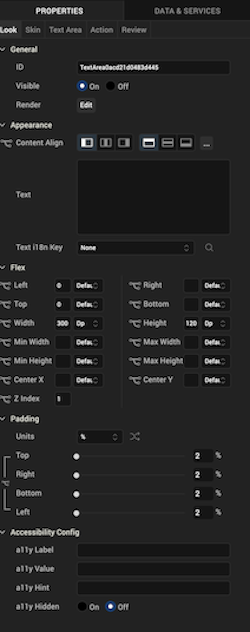
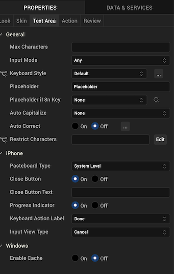
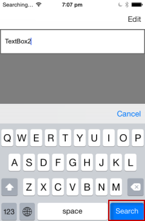
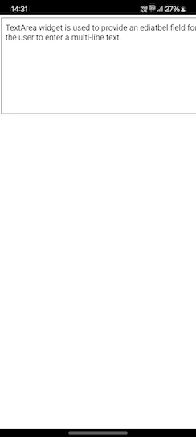
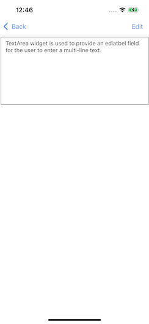
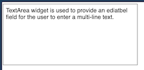

                           

TextArea2
---------

Use a TextArea widget to enable a user to enter multiple lines of text. For example, you can add a TextArea widget to the **Feedback** section of an application to enable users to enter comments.

To learn how to use this widget programmatically, refer [VoltMX Iris Widget guide](../../../Iris/iris_widget_prog_guide/Content/TextArea.md).

### Important Considerations

The following are important considerations for a TextArea Widget.

*   Editing on devices with a small form factor takes place on a new screen.
*   Editing on devices with a medium or large form factor takes place on the same screen.
*   In Mobile web, some browsers by default enable a vertical or horizontal scroll bar for the text area, even if the number of lines are less than 
    number of visible lines. The Mobile Web platform does not control whether the scroll bars appear.

### Look Properties

Look properties define the appearance of the widget. The following are the major properties you can set:

*   Whether the widget is visible.
*   The platforms on which the widget is rendered.
*   How the widget aligns with its parent widget and neighboring widgets.
*   If the widget displays content, where the content appears.

For descriptions of the properties available on the Look tab of the Properties pane, see [Look](Look.md#Flex).

### Skin Properties

Skin properties define a skin for the widget, including background color, borders, and shadows. If the widget includes text, you can also specify the text font.

For the TextArea widget, you can apply a skin and its associated properties for the following states:

  
| Skin | Definition |
| --- | --- |
| Normal | The default skin of a widget. |
| Focus | The skin applied when the widget has the focus. |
| Blocked UI | The skin applied to block the interface until the action in progress (for example, a service call) is completed. > **_Note:_** The Blocked UI skin is available only for SPA platforms. |
| Placeholder | The skin applied to placeholder text in the widget. Only the font color skin attribute is applicable. |
| Hover Skin | The look and feel of a widget when the cursor hovers over the widget. > **_Note:_** The Hover skin is available only on the Windows (native) Tablet platform. |

For more information about applying skins, see [Understanding Skins and Themes](Customizing_the_Look_and_Feel_with_Skins.md).

### Text Area Properties

TextArea properties specify properties that are available on any platform supported by Volt MX Iris, and assign platform-specific properties.

> **_Note:_** In this section, the properties that can be forked are identified by an icon ( ) located to the left of the property. For more information, see [Fork a Widget Property](Forking.md#fork-a-widget-property).

#### Max Characters

Specifies the maximum number of characters that the text field can accept.

#### Input Mode

Specifies whether the text area accepts any characters or only numeric values. The Numeric Only option is not supported on server-side Mobile Web platforms.

#### Keyboard Style

Specifies the style of keyboard displayed when a user enters text or numeric values in the text area.

> **_Note:_** This property is specific to the Android platform.

#### Placeholder

Specifies placeholder text for the text area; for example, a hint that describes what should be entered.

#### Auto Correct

Specifies whether auto-correction is enabled. Click the ellipsis (**...**) button to make the Auto Correct property setting platform-specific.

> **_Note:_** You cannot execute this property on the Iris Canvas.

> **_Note:_** This property is specific to the iOS and the SPA platform.

#### Auto Capitalize

Specifies the character capitalization behavior.

Following are the options available:

*   None: No action takes place on the input string.
    
    Example : This is sample text.
    
*   Words: Changes the first character of all the words to uppercase. (Not supported on Mobile Web)
    
    Example : This Is Sample Text.
    
*   Sentences: Changes the first character of all the sentences to uppercase.
    
    Example : This is sample text.
    
*   All: Changes all the characters to uppercase. (Not supported on Mobile Web)
    
    Example : THIS IS SAMPLE TEXT.
    

#### Pasteboard Type

Enables an application to share data within the application or with another application using system-wide or application-specific paste boards.

Typically, an object in the application writes data to a pasteboard when the user requests a copy or cut operation on a selection in the user interface. Another object in the same or different application then reads that data from the pasteboard and presents it to the user at a new location; this usually happens when the user requests a paste operation.

> **_Note:_** You can only paste the text to a text area with the same pasteboard type as that of the source textbox. For example, if you set the Pasteboard type as _App Level Persistent_ , you can paste the text only to another text area whose pasteboard type is also set to _App Level Persistent_ .

> **_Note:_** This property is specific to the iOS platform.

#### Close Button

Specifies whether the keypad window displays a **Done** button.

> **_Note:_** This property is specific to the iOS platform.

#### Close Button Text

Specifies alternate text for the "Done" button. This property is available only when the Close Button is enabled.

> **_Note:_** This property is specific to the iOS platform.

#### Progress Indicator

Specifies whether to display a progress indicator showing that widget content is being loaded.

> **_Note:_** This property is specific to the iOS platform.

#### Keyboard Action Label

Specifies the text displayed on the action key of the keyboard.

**Default**: Done

For example, the following shows the keyboard action label set to "Search":

> **_Note:_** This property is specific to the iOS platform.

#### Tool Tip

For the Windows Tablet platform, specifies a message that displays when you hover the mouse pointer over the widget .

### Actions

Actions define what happens when an event occurs. On a TextArea widget, you can run an action when the following events occur:

*   onTextChange: The action is triggered when text in the text area changes. The action is not triggered if the text changes programmatically.
*   onDone: The action is triggered when the user has entered text and clicks or touches the action key.
*   onTouchStart: The action is triggered when the user touches the touch surface. This event occurs asynchronously.
*   onTouchMove: The action is triggered when the touch moves on the touch surface continuously until movement ends. This event occurs asynchronously.
*   onTouchEnd: The action is triggered when the user touch is released from the touch surface. This event occurs asynchronously.
*   onBeginEditing: The action is triggered when the user clicks within the text area to start editing (iOS and Android).
*   onEndEditing: The action is triggered when the user ends the editing process by clicking on another widget or the **Done** button (iOS and Android).

For more information, see [Add Actions](working_with_Action_Editor.md).

### Placement Inside a Widget

The following table summarizes where a TextArea2 widget can be placed:

<table style="mc-table-style: url('Resources/TableStyles/Basic.css');" class="TableStyle-Basic" cellspacing="0"><colgroup><col class="TableStyle-Basic-Column-Column1"> <col class="TableStyle-Basic-Column-Column1"></colgroup><tbody><tr class="TableStyle-Basic-Body-Body1"><td class="TableStyle-Basic-BodyE-Column1-Body1">Flex Form</td><td class="TableStyle-Basic-BodyD-Column1-Body1">Yes</td></tr><tr class="TableStyle-Basic-Body-Body1"><td class="TableStyle-Basic-BodyE-Column1-Body1">VBox Form</td><td class="TableStyle-Basic-BodyD-Column1-Body1">Yes</td></tr><tr class="TableStyle-Basic-Body-Body1"><td class="TableStyle-Basic-BodyE-Column1-Body1">FlexContainer</td><td class="TableStyle-Basic-BodyD-Column1-Body1">Yes</td></tr><tr class="TableStyle-Basic-Body-Body1"><td class="TableStyle-Basic-BodyE-Column1-Body1">FlexScrollContainer</td><td class="TableStyle-Basic-BodyD-Column1-Body1">Yes</td></tr><tr class="TableStyle-Basic-Body-Body1"><td class="TableStyle-Basic-BodyE-Column1-Body1">ScrollBox</td><td class="TableStyle-Basic-BodyD-Column1-Body1">Horizontal Orientation - YesVertical Orientation- Yes</td></tr><tr class="TableStyle-Basic-Body-Body1"><td class="TableStyle-Basic-BodyE-Column1-Body1">Tab</td><td class="TableStyle-Basic-BodyD-Column1-Body1">Yes</td></tr><tr class="TableStyle-Basic-Body-Body1"><td class="TableStyle-Basic-BodyE-Column1-Body1">Segment</td><td class="TableStyle-Basic-BodyD-Column1-Body1">No</td></tr><tr class="TableStyle-Basic-Body-Body1"><td class="TableStyle-Basic-BodyE-Column1-Body1">Popup</td><td class="TableStyle-Basic-BodyD-Column1-Body1">Yes</td></tr><tr class="TableStyle-Basic-Body-Body1"><td class="TableStyle-Basic-BodyB-Column1-Body1">Template&nbsp;</td><td class="TableStyle-Basic-BodyA-Column1-Body1">Header- NoFooter- No</td></tr></tbody></table>

### Widget Appearance on Platforms

The appearance of the TextArea2 widget varies as follows:

  
| Platform | Appearance |
| --- | --- |
| Android |  |
| iOS |  |
| SPA |  |

