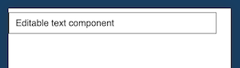

                           

TextBox2
--------

Use a TextBox widget to enable a user to enter single line of text. For example, you can add TextBox widgets to the **Login** page of an application to enable users to enter their login credentials.

To learn how to use this widget programmatically, refer [VoltMX Iris Widget guide](../../../Iris/iris_widget_prog_guide/Content/TextBox.md).

### Look Properties

Look properties define the appearance of the widget. The following are the major properties you can set:

*   Whether the widget is visible.
*   The platforms on which the widget is rendered.
*   How the widget aligns with its parent widget and neighboring widgets.
*   If the widget displays content, where the content appears.

For descriptions of the properties available on the Look tab of the Properties pane, see [Look](Look.md#Flex).

### Skin Properties

Skin properties define a skin for the widget, including background color, borders, and shadows. If the widget includes text, you can also specify the text font.

For the TextBox widget, you can apply a skin and its associated properties for the following states:

  
| Skin | Definition |
| --- | --- |
| Normal | The default skin of a widget. |
| Focus | The skin applied when the widget has the focus. |
| Blocked UI | The skin applied to block the interface until the action in progress (for example, a service call) is completed. > **_Note:_** The Blocked UI skin is available only for SPA platforms. |
| Placeholder | The skin applied to placeholder text in the widget. Only the font color skin attribute is applicable. |
| Hover Skin | Tthe look and feel of a widget when the cursor hovers over the widget. > **_Note:_** The Hover skin is available only on the Windows (native) Tablet platform. |

For more information about applying skins, see [Understanding Skins and Themes](Customizing_the_Look_and_Feel_with_Skins.md).

### TextBox Properties

TextBox properties specify properties that are available on any platform supported by Volt MX Iris, and assign platform-specific properties.

> **_Note:_** In this section, the properties that can be forked are identified by an icon  located to the left of the property. For more information, see [Fork a Widget Property](Forking.md#fork-a-widget-property).

#### Mask Text

Specifies whether the text entered by the user is hidden by a mask character, such as asterisk or dot. This is typically enabled for a text box used to enter secure information, such as a password.

Default: Off (Mask Text is disabled)

#### Max Characters

Specifies the maximum number of characters that a user can enter in the text box.

#### Input Mode

Specifies whether the text area accepts any characters or only numeric values.

#### Height Mode

Specifies how the text box height is determined, either by the intrinsic content or the system default. The default option is available only for iPhone and SPA platforms.

To provide a platform-specific or default value, click the Ellipsis button (**...**) to open the Height Mode dialog box, and then select a value.

#### Container Height

Specifies the dimensions of the text box, based on the [Height Reference](#Height_Reference) option. This property is available for non-flex forms when the [Height Mode](#height-mode) is Custom.

#### Height Reference

Specifies how the text box dimensions are determined:

*   Form Reference: If the text box is not placed inside a popup or in templates, the height percentage is based on the height of the form, excluding headers and footers. T
*   Parent Width: If the text box is placed inside a popup or in templates, the width is based on the width of the parent container.
    
    > **_Note:_** This property is unavailable on Flex Forms.
    

#### View Type

Specifies whether the text box can be used as a search field. The default setting is a text field.

The selected view type becomes the default for all the platforms. To provide a platform-specific value or a different default value, click the Ellipsis button (**...**) to open the **View Type** dialog box, and then select a value.

#### Keyboard Style

Specifies the style of keyboard displayed when a user enters text or numeric values in the text area.

> **_Note:_** This property is specific to the Android platform.

#### Placeholder

Specifies placeholder text for the text area; for example, a hint that describes what should be entered.

#### Auto Capitalize

Specifies the character capitalization behavior.

Following are the options available:

*   None: No action takes place on the input string.
    
    **Example** : This is sample text.
    
*   Words: Changes the first character of all the words to uppercase. (Not supported on Mobile Web)
    
    **Example** : This Is Sample Text.
    
*   Sentences: Changes the first character of all the sentences to uppercase.
    
    **Example** : This is sample text.
    
*   All: Changes all the characters to uppercase. (Not supported on Mobile Web)
    
    **Example** : THIS IS SAMPLE TEXT.
    

#### Auto Filter

Specifies whether characters entered in the text box are matched against the filter list, and possible matches are displayed.

**Default**: Off (input characters are not matched against the filter list)

#### Auto Correct

Specifies whether auto-correction is enabled. Click the ellipsis (**...**) button to make the Auto Correct property setting platform-specific.

> **_Note:_** You cannot execute this property on the Iris Canvas.

> **_Note:_** This property is specific to the SPA platform.

#### Pasteboard Type

Enables an application to share data within the application or with another application using system-wide or application-specific paste boards.

Typically, an object in the application writes data to a pasteboard when the user requests a copy or cut operation on a selection in the user interface. Another object in the same or different application then reads that data from the pasteboard and presents it to the user at a new location; this usually happens when the user requests a paste operation.

> **_Note:_** You can only paste the text to a text box with the same pasteboard type as that of the source textbox. For example, if you set the Pasteboard type as _App Level Persistent_ , you can paste the text only to another text box whose pasteboard type is also set to _App Level Persistent_ .

> **_Note:_** This property is specific to the iOS platform.

#### Close Button

Specifies whether the keypad window displays a **Done** button.

> **_Note:_** This property is specific to the iOS platform.

#### Close Button Text

Specifies alternate text for the "Done" button. This property is available only when the _[Close Button](#close-button)_ is enabled.

> **_Note:_** This property is specific to the iOS platform.

#### Clear Button

Specifies whether the keypad window displays a **Clear** button that clears text in the text box.

> **_Note:_** This property is specific to the iOS platform.

#### Progress Indicator

Specifies whether to display a progress indicator showing that widget content is being loaded.

> **_Note:_** This property is specific to the iOS platform.

#### Keyboard Action Label

Specifies the text displayed on the action key of the keyboard.

**Default**: Done

> **_Note:_** This property is specific to iOS and Android platform.

#### Left Image

Specifies an image displayed on the left side of the text box. For example, use a magnifying glass image to indicate the text box is used as a search field:

To select an image, click the **Edit** button to open the **LeftViewImage** dialog box, and then select an available image or provide an image URL.

> **_Note:_** This property is specific to the iOS platform.

<table style="margin-left: 0;margin-right: auto;"><colgroup><col> <col> <col> <col></colgroup><tbody><tr><td data-mc-conditions="Default.DoNotPublish">Done</td><td data-mc-conditions="Default.DoNotPublish">Go</td><td data-mc-conditions="Default.DoNotPublish">Search</td><td data-mc-conditions="Default.DoNotPublish">Next</td></tr><tr><td data-mc-conditions="Default.DoNotPublish">Send</td><td data-mc-conditions="Default.DoNotPublish">Google</td><td data-mc-conditions="Default.DoNotPublish">Join</td><td data-mc-conditions="Default.DoNotPublish">Route</td></tr><tr><td data-mc-conditions="Default.DoNotPublish">Yahoo</td><td data-mc-conditions="Default.DoNotPublish">Call</td><td data-mc-conditions="Default.DoNotPublish">&nbsp;</td><td data-mc-conditions="Default.DoNotPublish">&nbsp;</td></tr></tbody></table>

#### Auto Complete

Specifies whether characters entered in the text box are matched against a dictionary of words, and word suggestions are displayed.

**Default**: Off (word suggestions are not displayed)

> **_Note:_** This property is specific to the SPA platform.

#### Tool Tip

For the Windows Tablet platform, specifies a message that displays when you hover the mouse pointer over the widget .

### Actions

Actions define what happens when an event occurs. On a TextBox widget, you can run an action when the following events occur:

*   onTextChange: The action is triggered when text in the text area changes. The action is not triggered if the text changes programmatically.
*   onDone: The action is triggered when the user has entered text and clicks or touches the action key.
*   onTouchStart: The action is triggered when the user touches the touch surface. This event occurs asynchronously.
*   onTouchMove: The action is triggered when the touch moves on the touch surface continuously until movement ends. This event occurs asynchronously.
*   onTouchEnd: The action is triggered when the user touch is released from the touch surface. This event occurs asynchronously.

*   onBeginEditing: The action is triggered when the user clicks within the text box to start editing (iOS, Android, and Single Page Application (SPA)).
*   onEndEditing: The action is triggered when the user the user ends the editing process by clicking on another widget or the **Done** button (iOS, Android, and Single Page Application (SPA)).

For more information, see [Add Actions](working_with_Action_Editor.md).

### Placement Inside a Widget

The following table summarizes where a TextBox2 widget can be placed:

<table style="mc-table-style: url('Resources/TableStyles/Basic.css');" class="TableStyle-Basic" cellspacing="0"><colgroup><col class="TableStyle-Basic-Column-Column1"> <col class="TableStyle-Basic-Column-Column1"></colgroup><tbody><tr class="TableStyle-Basic-Body-Body1"><td class="TableStyle-Basic-BodyE-Column1-Body1">Flex Form</td><td class="TableStyle-Basic-BodyD-Column1-Body1">Yes</td></tr><tr class="TableStyle-Basic-Body-Body1"><td class="TableStyle-Basic-BodyE-Column1-Body1">VBox Form</td><td class="TableStyle-Basic-BodyD-Column1-Body1">Yes</td></tr><tr class="TableStyle-Basic-Body-Body1"><td class="TableStyle-Basic-BodyE-Column1-Body1">FlexContainer</td><td class="TableStyle-Basic-BodyD-Column1-Body1">Yes</td></tr><tr class="TableStyle-Basic-Body-Body1"><td class="TableStyle-Basic-BodyE-Column1-Body1">FlexScrollContainer</td><td class="TableStyle-Basic-BodyD-Column1-Body1">Yes</td></tr><tr class="TableStyle-Basic-Body-Body1"><td class="TableStyle-Basic-BodyE-Column1-Body1">ScrollBox</td><td class="TableStyle-Basic-BodyD-Column1-Body1">Horizontal Orientation - YesVertical Orientation- Yes</td></tr><tr class="TableStyle-Basic-Body-Body1"><td class="TableStyle-Basic-BodyE-Column1-Body1">Tab</td><td class="TableStyle-Basic-BodyD-Column1-Body1">Yes</td></tr><tr class="TableStyle-Basic-Body-Body1"><td class="TableStyle-Basic-BodyE-Column1-Body1">Segment</td><td class="TableStyle-Basic-BodyD-Column1-Body1">No</td></tr><tr class="TableStyle-Basic-Body-Body1"><td class="TableStyle-Basic-BodyE-Column1-Body1">Popup</td><td class="TableStyle-Basic-BodyD-Column1-Body1">Yes</td></tr><tr class="TableStyle-Basic-Body-Body1"><td class="TableStyle-Basic-BodyB-Column1-Body1">Template&nbsp;</td><td class="TableStyle-Basic-BodyA-Column1-Body1">Header- NoFooter- No</td></tr></tbody></table>

### Widget Appearance on Platforms

The appearance of the TextBox2 widget varies as follows:

  
| Platform | Appearance |
| --- | --- |
| Android |  |
| iOS |  |
| SPA |  |

