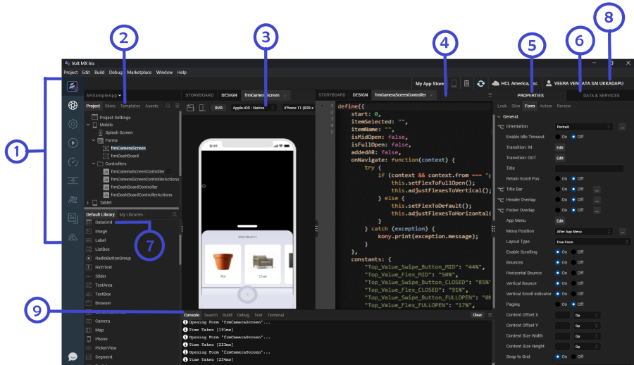

                           

   

The Volt MX Iris Default Perspective
==========================================

Volt MX  Iris's default perspective is optimized to help you create your app. This is what it looks like, its panes labeled for the sake of illustration. Click a number to locate its description in the sections that follow.

Left Navigation Bar
-------------------

Corresponding to item number 1 in the [diagram](#the-volt-mx-iris-default-perspective), the left navigation bar gives you access to a number of frequently-used features.

<table style="mc-table-style: url]('Resources/TableStyles/Inner.css');" class="TableStyle-Inner" cellspacing="0"><colgroup><col style="width: 48px;" class="Column-Column1"> <col class="Column-Column1"></colgroup><tbody><tr class="Body-Body1"><td class="BodyE-Column1-Body1"></td><td class="BodyD-Column1-Body1"><b>VoltMX on web.</b> Launches a browser window that opens the product page for VoltMX Iris.</td></tr><tr class="Body-Body1"><td class="BodyE-Column1-Body1"></td><td class="BodyD-Column1-Body1"><b>Iris.</b> This icon is selected by default. It enables you to switch to Iris from the Foundry environment.</td></tr><tr class="Body-Body1"><td class="BodyE-Column1-Body1"></td><td class="BodyD-Column1-Body1"><b>Project Settings.</b> Launches the Project Settings window.</td></tr><tr class="Body-Body1"><td class="BodyE-Column1-Body1"></td><td class="BodyD-Column1-Body1"><b>Run.</b> Builds and runs the project.</td></tr><tr class="Body-Body1"><td class="BodyE-Column1-Body1"></td><td class="BodyD-Column1-Body1"><b>VoltMX Automator.</b> Launches the Dashboard for the Test Automation framework.</td></tr><tr class="Body-Body1"><td class="BodyE-Column1-Body1"></td><td class="BodyD-Column1-Body1"><b>VoltMX Foundry.</b> Launches the VoltMX Foundry console and opens the foundry application that is linked to the Iris project.</td></tr><tr class="Body-Body1"><td class="BodyE-Column1-Body1"></td><td class="BodyD-Column1-Body1"><b><a href="https://marketplace.hclvoltmx.com/" target="_blank">HCL Forge .</a></b> Launches the HCL Forge window</td></tr><tr class="Body-Body1"><td class="BodyE-Column1-Body1"></td><td class="BodyD-Column1-Body1"><b>Documentation.</b> Launches a web browser window that opens to the documentation for VoltMX Iris.</td></tr><tr class="Body-Body1"><td class="BodyE-Column1-Body1"></td><td class="BodyD-Column1-Body1"><a href="../../../Iris/iris_user_guide/Content/Hikes.html" target="_blank"><b>Hikes.</b></a> Launches the hike catalog.</td></tr><!-- AI tr class="Body-Body1"><td class="BodyB-Column1-Body1"></td><td class="BodyA-Column1-Body1"><b>VoltMX IQ.</b> Launches the Volt MX IQ chat window that can answer your queries and give suitable suggestions from HCL Forge , Base Camp, and Documention.</td></tr--></tbody></table>

Project Explorer
----------------

Corresponding to item number 2 in the [diagram](#the-volt-mx-iris-default-perspective), this pane lists the currently open application, as well as the elements that comprise it, including forms, pop-ups, templates, script modules, web modules, media resources, online services, and offline services. This is the pane you use to open forms and scripts for editing.

If the Project Explorer is too narrow, cutting off the names of various project elements and assets, you can widen it by hovering over its right edge until the cursor becomes a double-headed arrow, and then drag the Project Explorer wider.

The Project Explorer is organized into the following tabs:

*   **Project.** Contains global project settings, the forms and popups of your project organized by device type, the code modules, as well as actions and services.
*   **Skins.** Lists the available skins according to widget type.
*   **Templates.** Lists available, pre-configured elements such as headers and footers, organized by device type.
*   **Assets.** Lists the various files that comprise your application.
*   **Search.** Makes it possible for you to quickly locate a project element or asset.
*   **Context Menu.** Displays all the elements in the selected tab. When you click on an element, you are navigated to the selected element in the tab.
    

Right-clicking a file in this pane displays a set of Volt MX commands available for that particular file type. Double-clicking a file opens it using either the default Volt MX functionality (as in the case of a form), or the default Windows program assigned to that file type (such as a graphics program for an image file).

[Return to the diagram](#the-volt-mx-iris-default-perspective)

Iris Canvas
-----------------

Corresponding to item numbers 3 and 4, the Iris Canvas can be divided into two side-by-side panes, as illustrated in the [diagram](#the-volt-mx-iris-default-perspective). To split the Iris Canvas, on the **Window** menu, point to **Arrange**, and then click **Side by Side**. In the diagram, the side-by-side panes display a form for a mobile phone in the left pane, and the Code Editor in the right. But you can open any number of assets in these panes, such as another form so that you are displaying two forms side by side, or another editor, such as the Action Editor, where you can construct and assign actions to the widgets on your forms. Or, if you want, you can switch to single pane mode so that one pane uses the entire Iris Canvas.

The **BVR** button (beyond visual range) gives you the flexibility of positioning and viewing widgets beyond the visual limitations of the device’s screen so that they’re present, but currently not visible to the user. This is especially helpful for animations where, for example, you want a screen element to come swooping in from the side onto the screen as the result of the user doing something, such as pressing a button . You can place any widget you want beyond the visible range and then have it change its position when it’s needed.

The platform-selection dropdown has a list of platforms and channels, and the device-selection dropdown has a list of devices based on the selected platform. You can select a platform, channel, and a mobile device from the dropdowns to view the form in the selected device.

At any given time, the properties of only the element that currently has focus are displayed. On the Iris Canvas, the name of the element with focus is highlighted. If the element with focus is either an action or a code editor, even though the Properties pane of the last-used widget appears, those properties at the moment are read-only.

> **_Note:_** To pan in BVR mode, you can press the space bar and drag.

[Return to the diagram](#the-volt-mx-iris-default-perspective)

Properties Panel
----------------

Corresponding to item number 5 in the [diagram](#the-volt-mx-iris-default-perspective), this pane displays the properties for a number of aspect of your application, divided into five tabs:

*   **Look.** Contains properties that are specific to the selected widget, such as its ID, the channels to render for, padding.
*   **Skin.** Contains properties for assigning, importing, copying and pasting skins for the selected widget, and setting the properties for the skin. The properties that are available vary from widget to widget.
*   **Form/ Widget.**Contains properties for the selected form or widget. They include general properties and specific properties for various platforms such as iPhone, Android, Windows8.
*   **Action.** Contains general and platform-specific actions that you can apply to the current widget when a particular event occurs. For example, you can edit the action you want to take place for the event _onHide_. When you initiate the editing of an action, the Action Editor opens on the Iris Canvas. For more information, see _Action Editor_.
*   **Review.** Provides a way to create and read notes and comments by you or others regarding forms and widgets.

[Return to the diagram](#the-volt-mx-iris-default-perspective)

Data & Services Panel
---------------------

Corresponding to item number 6 in the [diagram](#the-volt-mx-iris-default-perspective), the Data & Services panel enables you to link back-end data services to your application's user interface elements seamlessly with low-code to no-code.

Using the sample services in the Data & Services panel, you can bind back-end services to your apps and test the user interface. If you are an advanced user of Iris and have previously created back-end services in your Volt MX Foundry instance, you can view those services in the Data panel. Further, you can create new back-end services from the Data panel and associate the services with your apps.

The Data & Services panel contains two lists:

*   **Sample Services.** The Sample Services drop-down list contains several sample services that you can start using straight away in your app. These sample services come pre-built with Volt MX Iris.
*   **Project Services.** Using Project Services, you can create a new service.

You can also perform various other actions from the hamburger menu icon  of the Data & Services panel:

*   [Manually refresh](DataPanel.md#manual-refresh) the data in the Data & Services panel by using the Refresh button.  
*   [Publish your Volt MX Irisapp to Volt MX Foundry](PublishVoltMXFoundryServicesApp.md), and much more.  

[Return to the diagram](#the-volt-mx-iris-default-perspective)

Account Information
-------------------

Corresponding to item number 8 in the [diagram](#the-volt-mx-iris-default-perspective), the Account Information area displays a and connected devices icon, Notes button, download icon, your Volt MX Cloud account, your Volt MX account user name.

*   **Connected device.** Displays the names of the connected devices.
    
*   **Notes.** When you click on the notes button, it synchronizes the project notes so that you can see notes about the project that others have added.
    
*   **Download icon.** On clicking the download icon, it notifies you about the latest Iris version available. You can download the latest version by clicking on the download button. It also shows the latest release notes.
    
*   **VoltMX Cloud account.** Displays your Volt MX Cloud account name.
    
*   **VoltMX account username.** Displays your Volt MX account user name. If you are not logged in to your Volt MX account, the Account Information area displays the Login. On clicking, the Login dialog box is opened.
    

[Return to the diagram](#the-volt-mx-iris-default-perspective)

Library Explorer
----------------

Corresponding to item number 7 in the [diagram](#the-volt-mx-iris-default-perspective), the Library Explorer consists of three panes: Default Library, My Libraries, and Search bar.

*   **Default Library.** Contains a list of widgets, collections, and components. You can drag and drop any widget from the Default Library onto the form in the canvas.

> **_Note:_** From Volt MX Iris V8 SP4 Fixpack 28 onwards, the Default Library filter has been enhanced to segregate components according to their respective channels. As a result, mobile-only components are displayed in the Default Library when a Mobile form or a Tablet form is open at that time on the Project Canvas. Similarly, web-only components are displayed in the Default Library when a Web form is open on the Project Canvas. However, when there is no form open on the Project Canvas, all the available components are displayed in the Default Library.

*   **My Libraries.** Contains imported or custom designed collections and skins. Collections of widgets that make up a functional unit, make it easier for you to develop your app. Skins provide your app with a unified look and feel across widgets, platforms, and channels.
    
*   **Search bar.** Enables you to search for the custom collections or skins.
    

[Return to the diagram](#the-volt-mx-iris-default-perspective)

Console
-------

Corresponding to item number 9 in the [diagram](#the-volt-mx-iris-default-perspective), the lower pane consists of the four tabs: Console, Search, Build and Debug.

*   **Console.** Displays a running record of Volt MX Iris's activity, from loading a workspace and initializing services to building an app, launching it, and monitoring its activity.
    
*   **Search.** Enables you to search for any word from the controllers and replace it everywhere with a new word.
    
*   **Build.** Displays the build status when a build is in progress.
    
*   **Debug.** Displays the debugger that it attached.
    
*   **Terminal.** Displays the system terminal.

[Return to the diagram](#the-volt-mx-iris-default-perspective)
