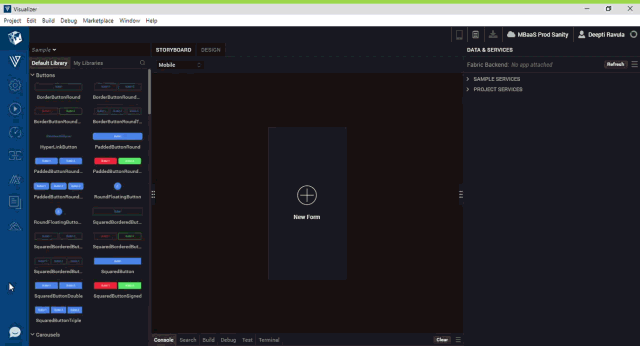

# Volt IQ 

Volt IQ is a chatbot designed to help Volt Iris users through their journey to create applications for various channels on Volt MX AppPlatform. The chatbot can assist users in various ways: building a binary, importing projects, searching for help materials on Volt MX Community in a single query, and more.

Volt IQ interacts with users and provides answers for some FAQs. This chatbot can answer casual queries such as "how to upgrade Iris?" and "what is my Iris version?". Using Volt IQ, users can also get information such as the version of Iris and Foundry that is installed on their system.

The chatbot also helps users in optimization, translation, and in helping them complete many more time-consuming tasks with ease. It uses advanced AI algorithms to provide the best-suited recommendations that enhance users’ app-building experience.

> **_Important_** : Users must have an internet connection for Volt IQ to work. If the network connectivity is lost after launching Volt IQ, users must reconnect to the internet and then click the Refresh icon in the chat window.

<!-- ## Enable Volt IQ

The Volt IQ feature is available by default for all Volt MX Developers and users who are **Early adopters** of Volt Iris.

Non-Volt MX users (who are not Early adopters) can enable the Volt IQ feature manually. To do so, follow these steps:

1.  Open the Iris configuration file that is located at: `<installation>\install_config.js`
2.  Search for the **enableIQChat** key. If `exports.enableIQChat!=1` or `exports.enableIQChat=null` is already available, modify it to `exports.enableIQChat=true`. Otherwise add the `exports.enableIQChat=true` entry.

    > **_Note_**: To disable Volt IQ, modify `exports.enableIQChat=true` to `exports.enableIQChat!=1`.

3.  Save and close the `install_config.js` file.

4.  Restart Volt Iris.

    The Volt IQ icon appears at the lower-left corner of Iris.

     -->

## Interact with Volt IQ

In Volt Iris, you can find the Volt IQ icon at the lower-left corner of the canvas. When you click on the icon, a chat window opens; using which you can start interacting with Volt IQ.

To open the Volt IQ, follow these steps:

1.  Open Volt Iris.
2.  From the left navigation bar, click on the Volt IQ icon.  
    The Volt IQ chat window is displayed.
3.  Enter your query into the chat box. Volt IQ then provides an appropriate response.    
    
        
    
    

<!--  -->

Volt IQ responds in different ways based on the type of query entered in the chat box. The types of responses of Volt IQ when you enter a query are as follows:

*   Provides an appropriate response in the chat window.
*   Performs action on Volt Iris.
*   Prompts for more information. In this case, Volt IQ requires more information to provide the appropriate response for your query. If you do not want to continue the conversation, you can enter **cancel** in the chat box.

> **_Note_**: In Volt Iris, you can move or resize the Volt IQ chat window. Drag the lower-right part of the chat window to resize it.  
You can also move the Volt IQ chat window out of Volt Iris. Click the pop-out icon at the upper-right corner of the chat window to move it out of Volt Iris. In the popped-out window, you can click the undock icon at the upper-right corner of the chat window to move it inside the Volt Iris.

## Capabilities of Volt IQ

Volt IQ can perform the following tasks:

*   [Design Suggestions](#Pattern)
*   [Generic search](#Generic)
    *   [Search from HCL Marketplace](#VoltMXMarketplace)
    *   [Search from Volt MX Community](#VoltMXBase)
    *   [Search from YouTube](#YouTube)
    *   [Search from Hike Catalog](#Hike)
*   [Translate project to different languages](#Translation)
*   [Iris actions](#Utility)
    *   [Clean up project](#Project)
    *   [Import/ Export project (Local/ Cloud)](#Import)
    *   [Import components (Local/ Cloud)](#ImportComp)
    *   [Run project](#Run)
    *   [Build project](#Build)
    *   [Test Project](#Test)
    *   [Analyse Project](#Analyse)

### Volt IQ Design Suggestions

The Volt IQ Design Suggestions feature assists you to develop applications faster. Volt IQ predicts the UI of your form and recommends relevant designs. These predictions can help you to reuse existing components and designs, without having to create them from scratch.

For instance, if you design a form with two TextBox widgets, and one Button widget, Volt IQ predicts that you could be creating a Login form and recommends designs such as the [Login](https://marketplace.hclvoltmx.com/items/login-advanced?search=login) component from [HCL Marketplace](https://marketplace.hclvoltmx.com/).

Furthermore, Volt IQ can detect duplicate designs in your project. To fetch the duplicates of a design, type a command, such as “identify duplicates”, in the Volt IQ chat window and press Enter. A list of duplicate design groups is displayed in the Volt IQ Design Suggestions window. You can then view each duplicate design and copy it to a form.  

   

#### Interact with Volt IQ Design Suggestions

While you are designing a form, Volt IQ compares the UI of the form with the existing designs from the current project, HCL Marketplace and default library. Volt IQ then generates a list of recommended designs based on the visual, textual, and widget hierarchical similarities of the designs.  

<blockquote><em><b>Note:</b></em>
<ul>
<li>For Volt IQ to show design suggestions for a form, you must add at least three widgets to the form.</li>
<li>Before executing a command, users must refresh the project/projects</li>
</ul>
</blockquote>

   

            
 

<!--  -->

When similar designs are detected in the current project or in HCL Marketplace or in default library, a Volt IQ bubble appears on the lower-left corner of the screen.  

The bubble provides the following options:

*   **Yes:** Enables you to view a list of design suggestions in the **Volt IQ Design Suggestions** window.
*   **Pause:** Enables you to pause the design suggestions for an hour.
*   **Turn Off Suggestions:** Enables you to disable the design suggestions until they are re-enabled.

Here is the list of sources from which you receive the suggestions:

*   [Current project](#CurrentProject)
*   [HCL Marketplace](#Marketplace)
*   [Volt IrisLibrary](#Library)

**Designs from the Current Project**

You can perform the following actions on a design suggestion from the current project:

*   **Navigate:** Navigates you to the location of the design in the project.    
    
    

    <!--  -->

*   **Copy:** Copies the design to the clipboard.

<!-- *   **Convert to component:** Enables you to convert a design suggestion into a component without contract, and imports it into the project. -->

**Components from HCL Marketplace**

You can perform the following actions on a design suggestion from HCL Marketplace :

*   **View:** Opens the component in HCL Marketplace and displays details of the component.

    <!--  -->

*   **Download:** Downloads the component into **My Library of Volt Iris**.

    > **_Note_**: Volt IQ Design Suggestions is an offline feature. However, you must have an active Internet connection to download a recommended HCL Marketplace component.

**Designs from Default Library**

You can perform the following action on a design suggestion from the Default library:

*   **View:** Displays the suggested design in the **Default Library** section of Iris.

#### Enable/ Disable Design Suggestions

In Iris, you can enable or disable the design suggestions from the main menu directly. To do so, follow these steps:

1.  From the main menu, click **Help**.
2.  If you've paused or turned off design suggestions, you will see **Enable Design Suggestions**. Click **Enable Design Suggestions** to fetch the design suggestions for the current form.  

    If the design suggestions is already enabled, you will see **Disable Design Suggestions**. Click **Disable Design Suggestions** to stop the design suggestions from being displayed.

You can also enable or disable the design suggestions by using a command in the Volt IQ chat window. For example, you can enter commands such as **turn on design suggestions** or **turn off design suggestions**. 

<!--  -->

### Generic Search

The Generic search functionality helps you fetch data from HCL Marketplace , Community, and YouTube, based on the availability of results.

Here are some generic search queries:

*   How to run on android and iPhone
*   How to create a sample app in volt iris

#### HCL Marketplace Search

The HCL Marketplace search feature is integrated with Volt IQ. Using the bot, you can search for components from HCL Marketplace , and import those components into your Iris project.

To fetch results exclusively from HCL Marketplace , enter @marketplace \< Text query to search in HCL Marketplace \>  

<!--  -->

Here are a few HCL Marketplace search queries:

*   @markerplace Placelocator
*   @marketplace login
*   @marketplace Rangeslider

#### Volt MX Community Search

The Volt MX Community search functionality is integrated with Volt IQ. Using the bot, you can search for articles from support portal and the product documents in Community.

To fetch results exclusively from Volt MX Community, enter @community <Text query to search in Community>

Some Community search queries are as follows:

*   @community NFI examples
*   @community error in importing component
*   @community what is preprocessor?

#### YouTube Search

The YouTube search is integrated with Volt IQ and using the bot, you can search for any videos on the HCL Digital Solutions channel.

To fetch results exclusively from YouTube, enter @youtube <Text query to search in YouTube>

Here are a few YouTube search queries:

*   @youtube Getting started with iris
*   @youtube creating a component

#### Hike Search

Using Volt IQ, you can search for any hike that is available in the hike catalog. When you type a query in the Volt IQ chat window, you will see a list of related hikes under the HIKES tab.

Each result displays basic information of a hike such as the name, number of steps, and a **PLAY HIKE** button. You can click **PLAY HIKE** to open the hike in Volt Iris.

To fetch results exclusively from the hike catalog, type @Hikes < Text query to search in Hike Catalog >

For example:

*   @hikes Creating a component
*   @hikes Action editor
*   @hikes Identity services

### Translation

Volt IQ helps you translate an application into different languages by using the Google translate API. During translation, the text in an application is converted into equivalent i18n keys in the target language. The properties of widgets that are set through the Properties panel and through code are translated.

Default locale is the language that is displayed in an app when the app is launched during run time. You can configure or modify the default locale of an app from the Project Settings of Iris. If the default locale is not set already, Volt IQ updates the default locale to the language that you want to translate your app into.

Volt IQ supports all locales supported by Google Translate. For the locales that are not directly supported by Iris, Google Translate is used for the translation internally, and the locale is added as a custom locale.

Translation can be done in two ways:

*   **Specify the target language:** You can specify the target language directly in your query.
*   **Bot prompts the language:** You can enter your query to translate the project without specifying the target language.

<!--  -->

Here are a few queries about translation:

*   Can you translate this app to German?
*   Translate this app to Spanish
*   Localize to Spanish
*   Can you translate this app?
*   Translate my app  

### Iris Actions

Volt IQ helps you save time by triggering small actions on Volt Iris, using commands in the bot. For the list of Iris actions that are supported on Volt IQ, refer [Iris actions.](../Content/Volt_IQCommands.md)

Following are a few Iris actions.

#### Project Clean Up

Cleaning unused skins and actions from a Iris project improves the performance of Volt Iris at run time. Using Volt IQ, you can clean up the unused skins and actions from Iris project. It also gives the count of unused or duplicate elements, and provides an option to delete them.

Some queries about project clean up are as follows:

*   Clean my project
*   Sanitize my project
*   Project clean up
*   Clean unused items

#### Import and Export Project (Local/ Cloud)

The bot helps you import and export projects into Volt Iris.

*   **Import Project:** You can import the projects that are stored in the local storage or on the cloud. When you import a local project, the bot shows a list of related local projects in the file explorer. You can select the project that you want to import. When you import a cloud project, the cloud account window appears. You can then select the cloud project that you want to import.
*   **Export Project: **You can export a project to the local storage or to the cloud. When you export project locally, the current Iris project is zipped and stored in the local storage. When you export project to cloud, the current project is shared to cloud.

Here are a few queries about importing a project:

*   Import project from cloud
*   Import project from local
*   Import project
*   Export project

#### Import Component (Local/Cloud)

You can import the following types of components into Volt Iris:

*   **Local components:** These components are imported from the local storage. When you import a local component, the bot shows you a list of components in the file explorer. You can then select the component that you want to import.
*   **Cloud components:** These components are imported from HCL Marketplace . When you search for a component from cloud, the HCL Marketplace window appears. You can search for a component and import the component from the HCL Marketplace window.

Here are a few queries on importing components:

*   Import local component
*   Import component
*   Import component from cloud

#### Run Project

Using the bot, you can run your current project. The bot helps you generate a live preview by triggering the action directly on Iris.

Some queries about running the project are as follows:

*   Run for iPhone
*   Run for Android
*   Run for web and Android

#### Build Project

Volt IQ helps you build the current project for a required platform. You can generate the binaries by entering a build command in the bot. The bot triggers the build action directly on Iris.

Here are the queries on building your project for various platforms:

*   Build for Android
*   Build for iPhone
*   Build for Android tablet
*   Build for Desktop Web

#### Test Project

Using Volt IQ, you can create new and open existing **Test Cases**, **Test Suites** and **Test Plans**. You can also run the **Test** **Suites** for a specific channel. When you provide any command to the bot, it will open the corresponding window inside the Volt Iris. Once the window is open, you can perform the tasks such as run, record, rename, play and save.

Here are the commands related to Test Cases that you can provide the bot.

*   create test-case
*   open test-case /< name of the test case.js file >
*   open test-case for mobile /< name of the test case.js file >
*   open test-case for tablet /< name of the test case.js file >
*   open test-case for desktop /< name of the test case.js file >

Here are the commands related to Test Suites that you can provide the bot. You must provide the channel for which you are testing while running these commands.

*   create test-suite
*   open test-suite for mobile /< name of the test suite.js file >

*   open test-suite for tablet /< name of the test suite.js file >
*   open test-suite for desktop /< name of the test suite.js file >

*   run test-suite for mobile /< name of the test suite.js file >

*   run test-suite for tablet /< name of the test suite.js file >
*   run test-suite for desktop /< name of the test suite.js file >

Here are the commands related to Test Plans that you can provide the bot. You must provide the channel for which you are testing while running these commands.

*   create test-plan
*   open test-plan for mobile /< name of the test plan.js file >

*   open test-plan for tablet /< name of the test plan.js file >
*   open test-plan for desktop /< name of the test plan.js file >

#### Analyse Project

Using Volt IQ bot, you can open the AI Assisted Development window to Analyse and scan your project for any unused resources, skins, and widgets. You can also increase the performance of your application and check the fonts used throughout the application.

<!-- For more information on AI Assisted Development, click [here](AIAssisted.htm#top). -->

Here are the commands you can use to open the AI Assisted Development window.

*   Run AI Assisted Development
*   Launch AI Assisted Development
*   Launch Cop
*   Open AI Assisted Development
*   Open Cop

You can also open the AI Assisted Development window to display specific rule categories such as, Best Practices, Performance, and Style Guide. Here are the commands you can use to open the the AI Assisted Development window to specific categories.

*   Analyse <rule category>
*   Open <rule category>
*   Run <rule category>

