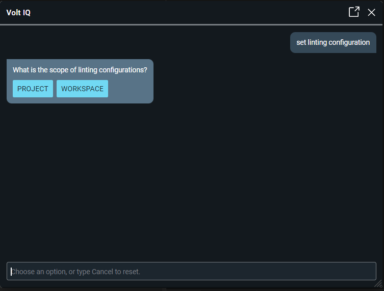
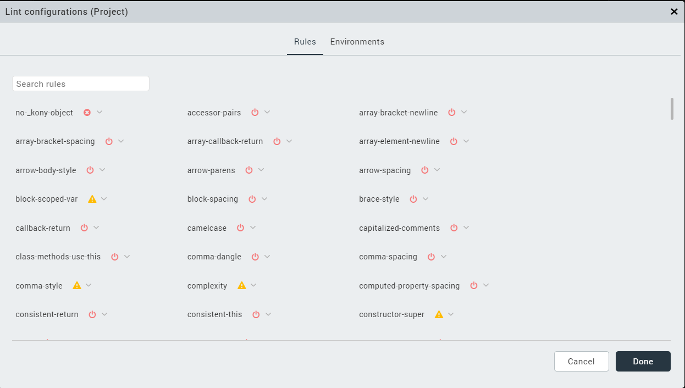
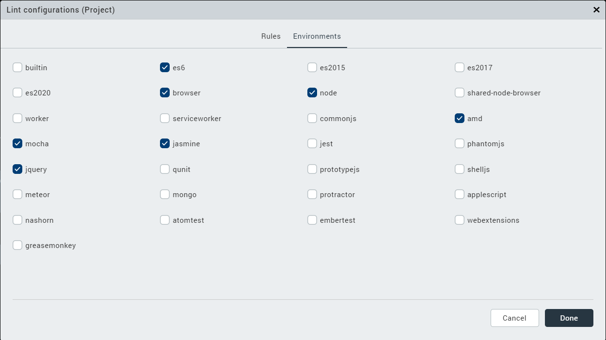

                          

Volt IQ JS lint
================

While developing or running an application, there are chances of encountering errors - errors which demand significant time to debug and fix.   

Instead of using debuggers, one can use Linters. These help developers identify bugs such as typos, undeclared variables, invocation of uninstantiated functions and much more. Linters play a significant role in reducing errors, improving the quality of the source code, and accelerating app development.

A Linter is a tool that analyses source code and flags syntax and (potential) run-time errors. While linters such as JSLint and JSHint have default rules to scan against the JavaScript code and identify errors, with ESLint users can configure a custom set of rules - write their own linting rules alongside the built-in ones. Volt IQ JS lint leverages and extends ESList to give an enhanced Linting experience to Volt MX developers.

Volt IQ JS lint is a linter plugin that is used for JavaScript code. Using this, users can perform the following tasks:

*   [Configure default rules](#configure-default-rules)
*   [Write custom rules](#write-custom-rules)

Configure Default Rules
-----------------------

Volt IQ JS lint has a predefined set of rules based on which the source code is validated. If any of the rules are violated in the code, a configured error message or a warning appears. Users can enable or disable the default rules and change the configuration of the rules to warnings or errors.

To configure these rules, follow these steps:

1.  From the left navigation bar, select the Volt IQ icon.  
    The **Volt IQ** chat window appears.
2.  Type a command to see the lint configurations.  
    For example: change linting rules, set lint configuration  
    Volt IQ prompts for the scope of lint configurations.  
    
    
    
3.  Select the scope of the lint configurations to any of the following:
    
    *   **Project:** Applies the lint configurations to the current project only.
    *   **Workspace:** Applies the lint configurations to all the projects inside the workspace.
        
    
    A **Lint configurations** window appears.
    
    
    
4.  In the **Rules** tab, click the arrow icon beside a rule and select any of the following:
    *   **Turn Off:** Disables the specific rule and therefore no error or warning is displayed in Iris
    *   **Warning:** Displays warning symbol when the specified rule is violated
    *   **Error:** Displays an error symbol when the specified rule is violated
5.  In the **Environments** tab, enable the required JavaScript libraries or packages.  
    
6.  Click **Done**.

You have successfully configured the default Lint rules.

Write Custom Rules
------------------

Using Volt IQ JS lint, users can also write custom rules. Users can create custom rules using JavaScript code. These rules can be made applicable to a specific project or to all the projects in a workspace.

To add custom rules to lint configurations in your project, follow these steps:

1.  Navigate to the project folder in your Iris workspace.  
    
    > **_Note:_** If you want to apply custom rules to all the projects in your Iris workspace, navigate to the Workspace folder.  
    
    
2.  Create a new folder with the name **.kslint**.
3.  In the folder, create a new file **lintrules.js**.
4.  Enter code in the file defining your custom rules. The custom rules must be defined in the following code format:   

    <pre><code>((function(mod) {
                    if (typeof exports == "object" & amp; & amp; typeof module == "object") // CommonJS
                        module.exports = mod();
                    else if (typeof define == "function" & amp; & amp; define.amd) // AMD
                        return define([], mod);
                    else // Plain browser env
                        return mod();
                })(function() {
                    return {
                        //Write your dictionary of rules here
                    }
    }))</code></pre>


5.  Save the file.  
6.  Restart Volt Iris, if you already have Iris open.

You have successfully added the custom rules to the Lint configurations.

Here is an example of a custom rule that you can copy and paste into your project folder and see how it works. In this example, the code defines a new rule that every private function must be prefixed with "\_".

```
(function(mod) {
    if (typeof exports == "object" && typeof module == "object") // CommonJS
        module.exports = mod();
    else if (typeof define == "function" && define.amd) // AMD
        return define([], mod);
    else // Plain browser env
        return mod();
})(function() {

    return {
        "no-private-function-without-_": {
            meta: {
                type: "problem",

                docs: {
                    description: "The private function must be prefixed with '_'",
                    category: "Possible Errors",
                    recommended: true,
                    url: ""
                },
                schema: [], // no options
                severity: 2,
                fixable: true
            },
            create: context => {
                return {
                    FunctionDeclaration: node => {
                        if (node.id.name[0] !== '_') {
                            context.report({
                                node: node.id,
                                message: `Private
                                function must be prefixed with '_'`,
                                fix: function(fixer) {
                                    return fixer.insertTextBefore(node.id, '_');
                                }
                            })
                        }
                    }
                };
            }
        }
    }
})
```


<!-- ```
(function(mod) {
    if (typeof exports == "object" && typeof module == "object") // CommonJS
        module.exports = mod();
    else if (typeof define == "function" && define.amd) // AMD
        return define([], mod);
    else // Plain browser env
        return mod();
})(function() {

    return {
        "no-private-function-without-_": {
            meta: {
                type: "problem",

                docs: {
                    description: "The private function must be prefixed with '_'",
                    category: "Possible Errors",
                    recommended: true,
                    url: ""
                },
                schema: [], // no options
                severity: 2,
                fixable: true
            },
            create: context = & gt; {
                return {
                    FunctionDeclaration: node = & gt; {

                        if (node.id.name[0] !== '_') {

                            context.report({
                                node: node.id,
                                message: \`Private

                                function must be prefixed with '_'\`,
                                fix: function(fixer) {
                                    return fixer.insertTextBefore(node.id, '_');
                                }
                            })
                        }
                    }
                };
            }
        }
    }
})
``` -->
