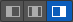
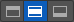

                          

Slider Widget for Watch
=======================

With the Slider widget, you can select a value from a defined range of values by moving the thumb (the control that you slide) in a horizontal direction along the seek bar, which is also known as the track. Optionally, you can display a minimum value and a maximum value. By adding an action sequence, the value or process can update continuously, appearing on the track when the thumb is moved.

  
_The Slider widget_

Unlike other platforms, the Apple Watch does not display the minimum and maximum values programmatically at either end of the slider, but you can compensate for this by using the [Min Image](#min-image) and the [Max Image](#max-image) properties to indicate the values. By default, these two values are represented by a minus symbol image and a plus symbol image.

Click any of the following to learn about the properties found on the tabs of the Slider widget.

[Look Tab](#look-tab)

[Skin Tab](#skin-tab)

[Slider Tab](#slider-tab)

[Action Tab](#action-tab)

[Review Tab](#review-tab)

Look Tab
--------

On the **Look** tab, you define properties and behaviors related to a Slider widget's appearance and position. The following sections describe each of the properties.

### ID

Denotes the name of a widget. When a widget is added to a form, a unique name is assigned to the widget. You can rename a widget by entering a new name in the **ID** box.

> **_Note:_** You can also rename a widget from the Project Explorer by right-clicking a widget, and then clicking **Rename**.

### Visible

Controls whether or not the user of the app can see the widget.

*   To make a widget visible, click **On** .
*   To make a widget invisible, click **Off**.

### Enabled

Controls whether the widget is functional or not. You can programmatically make the widget functional or nonfunctional through an action sequence, triggered by the user.

*   To enable the widget, click **On**.
*   To disable the widget, click **Off**.

### Render

Defines whether a widget appears on a specific platform. Currently, the Watch channel supports only the Apple Watch Native and HTML5 SPA platforms. Clicking the Render property's **Edit** button opens the **Render Platforms** dialog box.

Clear the check box of the platforms for which the widget should not be rendered.

**The Difference between Visible and Render**

*   When a Widget is _not_ rendered for a platform, it implies that the widget is hidden from that specific platform.
*   Whereas, when a widget is set as invisible, it implies that the widget is available, but is invisible. This feature is useful when you wanted to display a widget based on certain conditions.

### Widget Align

The Widget Align property specifies how the edge of the widget is aligned with respect to its parent's edge. The following alignment options are available:

<table style="margin-left: 0;margin-right: auto;"><colgroup><col style="width: 69pt;"> <col style="width: 352pt;"></colgroup><tbody><tr><td></td><td>Aligns the left edge of the widget with the left edge of its parent.</td></tr><tr><td></td><td>Aligns the horizontal center of the widget with the horizontal center of its parent.</td></tr><tr><td></td><td>Aligns the right edge of the widget with the right edge of its parent.</td></tr><tr><td></td><td>Aligns the top edge of the widget with the top edge of its parent.</td></tr><tr><td></td><td>Aligns the vertical center of the widget with the vertical center of its parent.</td></tr><tr><td></td><td>Aligns the bottom edge of the widget with the bottom edge of its parent.</td></tr></tbody></table>

### **Text**

Specifies the text that the user sees when running the app.

### Width

The Width property sets the x-axis dimension of the widget using the numeric quantity and type of unit that you specify.

You can use the following units of measure to set the width of the widget.

**%.**  Specifies the width as a percentage of the parent's dimensions.

**Dp.**  Specifies the width in terms of device independent pixels.

**Preferred Size.**  Specifies an optimal width for the widget given the size of the font and the amount of text that the widget displays. The Preferred Size can vary from one platform to another.

### Height

The Width property sets the y-axis dimension of the widget using the numeric quantity and type of unit that you specify.

You can use the following units of measure to set the height of the widget.

**%.**  Specifies the height as a percentage of the parent's dimensions.

**Dp.**  Specifies the height in terms of device independent pixels.

**Preferred Size.**  Specifies an optimal height for the widget given the size of the font and the amount of text that the widget displays. The Preferred Size can vary from one platform to another.

Skin Tab
--------

A widget’s appearance is defined by the skin that is applied to it. Every widget has a skin, even if it’s just the Volt MX Iris default skin. Skins give you the ability to establish visual continuity in your app. On the **Skin** tab, you can select to use a specific skin for your widget. In addition, you can configure the widget's background and font.

In the Mobile, Tablet, and Desktop channels, a widget may have a number of states, such as Normal (when it's not being interacted with), Focus (e.g. when it's been tabbed to), or Pressed. However, the Watch channel has only one slider state: Normal.

### Enable

Depending on the current task at hand on the Watch screen, it may make sense for the Slider widget to be disabled, even as it's visible. A particular action taken by the user can then trigger the Slider widget to become enabled. Depending on the needs of your Watch app, you can set the Slider app to be initially enabled or not. By default, the **Enabled** checkbox is checked.

### General

Under the General section of the **Skin** tab, you can change the name of the skin currently applied (if it's not one of the default skins), or you can select from the other available slider skins by clicking the magnifying glass icon next to the **Name** text box.

#### Platform

In channels that support multiple platforms, it's possible to fork a skin by clicking the Platform ellipsis button , and then selecting the platforms that you want to fork the widget to. In the case of the Watch channel, currently the only platform available is Watch (Native). For more information, see [Forking](Forking.md).

### Background

Under the Background section of the **Skin** tab, you can set the type of background you want to use, and set the color and its opacity.

#### Type

For the Watch channel, the Slider widget is capable of a Single Color background.

#### Color

With Single Color as the background type, you can configure the hue you want by clicking the square color icon and dragging the cursor to the color of your choosing.

#### Opacity

Similarly, with Single Color as the background type, you can configure the opacity of the background color. By default, the opacity is set to 100, making the background completely opaque with no transparency. However, if you want the background to have a degree of transparency, you can decrease its opacity. To do so, type a value between 0 and 100 in the Opacity text box, or drag the opacity slider to the degree of opacity that you want.

For more information about applying skins, see [Understanding Skins and Themes](Customizing_the_Look_and_Feel_with_Skins.md).

Slider Tab
----------

On this tab, you configure properties unique to the Slider widget.

### Min Value

The Min Value property specifies the minimum value on the Slider widget that you can select. The default value is 0 (zero). You can set any positive or negative number you want, up to 4 bytes in length.

### Max Value

The Max Value property specifies the minimum value on the Slider widget that you can select. The default value is 100. You can set any positive or negative number you want, up to 4 bytes in length.

### Step

The Step property specifies the number of increments by which the slider value is increased or decreased between the minimum and maximum slider values you've set. You can specify a number between 1 and 5. The default value is 3. If you enter a number that is not between 1 and 5, Volt MX Iris uses the default value of 3.

### Selected Value

The Selected Value property specifies the value representing the position of the thumb along the slider when the widget is initially presented to the user. You can either set this value yourself, or let the Volt MX Iris determine an initial value for you. In the absence of you specifically setting the Selected Value property, Volt MX Iris calculates it as the Min Value plus half the difference between the Max Value and the Min Value (Selected Value = Min Value + (Max Value – Min Value/2)).

In the absence of you setting any values for Min Value, Max Value, and Selected Value, the default setting for the Selected Value property is 40.

If you set the Selected Value property to a number lower than the Min Value number, Volt MX Iris will calculate the Selected Value to be equal to the Min Value. If you set the Selected Value property to a number higher than the Max Value number, Volt MX Iris will calculate the Selected Value to be equal to the Max Value.

### Min Image

Specific to the iOS platform, the Min Image property specifies the image for the minimum value of the slider. If you do not specify an image, Volt MX Iris uses a minus symbol. The aspect ratio for this image is 1:1, and any image that does not have this ratio will be stretched and scrunched to the 1:1 ratio.

To set the Min Image property, click its **Edit** button. From the Min Image dialog box, you can either select one of the listed images, or provide a URL. The listed images are located in the following folders:

<Workspace>\<ProjectName>\resources\common  
<Workspace>\<ProjectName>\resources\watch\common  
<Workspace>\<ProjectName>\resources\watch\native\watchos

For more information, see [Add and Manage Images and Other Media](Adding_and_Managing_Images.md).

### Max Image

Specific to the iOS platform, the Max Image property specifies the image for the maximum value of the slider. If you do not specify an image, Volt MX Iris uses a plus symbol. The aspect ratio for this image is 1:1, and any image that does not have this ratio will be stretched and scrunched to the 1:1 ratio.

To set the Max Image property, click its **Edit** button. From the Max Image dialog box, you can either select one of the listed images, or provide a URL. The listed images are located in the following folders:

<Workspace>\<ProjectName>\resources\common  
<Workspace>\<ProjectName>\resources\watch\common  
<Workspace>\<ProjectName>\resources\watch\native\watchos

For more information, see [Add and Manage Images and Other Media](Adding_and_Managing_Images.md).

### Continuous

The Continuous property specifies whether the slider displays the seek bar as segmented or not. The number of segments is set by the Step property. By default, the Continuous property is set to **Off**, displaying both the progress-made portion and progress-remaining portion of the seek bar as segmented. When the Continuous property is set to **On**, the progress-made portion has a very subtle segmentation, while the progress-remaining portion isn't segmented at all.

  
_Continuous property set to Off_

  
  
_Continuous property set to On_

Action Tab
----------

On the **Action** tab, you define the events that are executed when an action is run. On a Slider widget, you can run the following action:

*   **onValueChange.** This action is invoked when the progress on the Slider widget changes.

For more information on using this action, see the topic, [Add Actions](working_with_Action_Editor.md).

Review Tab
----------

On this tab, you can add and review notes. With the Review Notes feature, you can capture feedback from users who are evaluating your app design. Such requirements capturing helps ensure that the design of your app successfully meets the requirements of potential users. The Review Notes feature supports rich text formatting such as font type and size, paragraph alignment, numbered and bulleted lists, block quotes, and even tables.

For more information, see [Capture Product Requirements with Review Notes](CapProdReqsWithNotes.md).
