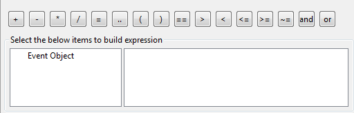
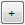
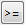
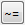
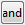
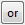

                         

Working with the Expression Editor
----------------------------------

You use the Expression Editor when you need to generate an expression using two or more variables (or widget data) with the help of API calls. The Expression Editor displays a list of all APIs by category. You can select the category and then the required APIs to build expressions.

Using the Expression Editor, you can assign data to variables, perform operations on strings, numbers, variables, and data store keys.

You can access Expression Editor:

*   from the [Mapping Editor](ActionsMapping.md)
*   when you add a code snippet in the Action Editor.

You can build an expression within the following action items:

*   Preprocess decision
*   Decision
*   Snippet
*   Conditions (Right-click a decision and select Else-if)
*   Local Variables (simple and collection)

The Expression Editor looks like this:

### Operators

The Expression Editor has various operators that signify a specific operation. The position of the cursor is very important. The operators or APIs are inserted at the position where the cursor is placed.

The operators are explained below:

  
| Operator | Explanation |
| --- | --- |
|  | _Plus_ operator. Performs addition. |
|  | _Minus_ operator. Performs subtraction. |
|  | _Multiply_ operator. Performs multiplication. |
|  | _Divide_ operator. Performs division. |
|  | _Assign_ operator. Assigns data to a variable, string, number, or data store key. |
|  | _Concatenation_ operator. Concatenates two strings |
|  | _Left brace_. |
|  | _Right brace_. |
|  | _Equals_ operator. Compares two values and returns true if they match. |
|  | _Greater than_. |
|  | _Less than_. |
|  | _Less than or equals to_. |
|  | _Greater than or equals to_. |
|  | _Not equal to_ operator. Compares two values and returns true if they do not match. |
|  | Logical _and_ operator. |
|  | Logical _or_ operator. |

### Event Object

The Expression Editor has various event objects that are associated with a widget and its event. An eventobject stands for _frm.widget_. The table below lists the event objects for some widgets:

  
| Widget | Widget Event | Event Object |
| --- | --- | --- |
| Browser | onsucess | eventobject |
|^^| onfailure |
| Button | onclick | eventobject |
| Camera | onclick | eventobject |
| 2D/3D Chart | onclick | eventobject, column\_number, row\_number |
| Map | onselection | location |
|^^| onpinselect | eventobject, siteinfo |

To set a dynamic property for a button on a form, navigate to the onclick event of the button and click an Event Object, and select eventobject

eventobject.skin= skin;

### Passing Parameters

While passing parameters to the APIs, you should be aware of the following:

1.  When you see <<string>>, you have to delete and replace it with a relevant string.
2.  When you see <<int>>, delete that and replace it with a relevant integer.
3.  When you see <<table>\>, delete and replace it a relevant table name.

> **_Note:_** If you are retrieving values from widgets, variables, data store keys, or i18n keys, then you can directly include that in the expression. If you are specifying a constant explicitly, then it should be enclosed within double quotes ("").

### Evaluation

The formed or generated expressions need to be evaluated.

*   Expressions built within the preprocess decision are evaluated at build time, that is, within the IDE.
*   Expressions built within a snippet are evaluated at build time, that is, within the IDE.
*   Expressions built within the decision action item are evaluated at the actual runtime, that is, on the mobile device.

*   An expression within a decision or a preprocess decision should always evaluate a Boolean value.
*   When you build an expression with the help of operators and APIs, click **Compile** to check if the built expression is syntactically correct.
