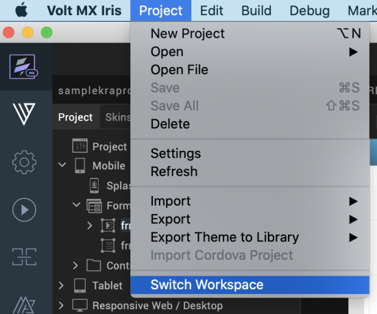
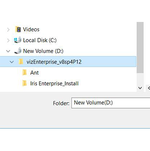
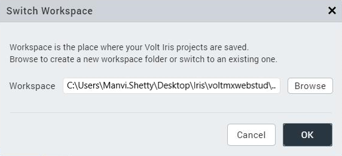

                           

Workspaces: Repositories for Your Projects
==========================================

A workspace is a repository for the projects that you create, and it resides on your computer as a folder. You can keep all your projects in one workspace, or you can cluster related projects together by creating multiple workspaces. When you launch Volt MX Iris, it prompts you to indicate the workspace that you want to work in. The default workspace is home to the Volt MX Iris sample app.

You can switch your workspace either during the [VoltMX Iris startup process](#During) or [from within Volt MX Iris](#From). This feature helps you to switch the workspace when the default workspace has an issue or is not valid. Furthermore, you can switch the workspace if you want to access projects that are located in another workspace.

> **_Important:_** When you switch the workspace, all your preferences set via **Edit** > **Preferences** (on Windows) or **Iris** > **Preferences** (On Mac) will change. You will have to configure your preferences again.  
  
Along with other preferences, paths saved for Home of Android and Java also change. Ensure that you configure all your preferences again.  
  
To preserve preferences from your previous workspace, copy your existing preferences file **<workspace\_dir>/iris\_preferences.json** to the new workspace.

To switch your workspace in Volt MX Iris, follow these steps:

1.  From the **Project** menu, click **Switch Workspace**.  
    The **Switch Workspace** window appears.  
      
    
2.  Click **Browse**. The **Select Workspace Directory** window appears.  
      
      
    
3.  Select the workspace that you want to switch to, and then click **OK**.  
      
    
4.  Click **OK**. Volt MX Iris prompts you to save your current project if any elements require saving, and then it restarts, accessing the workspace that you just selected.

  
| Rev | Author | Edits |
| --- | --- | --- |
| 9.0 | PG | PG |
