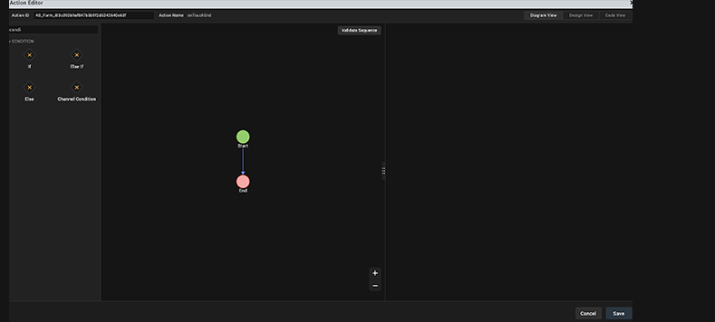
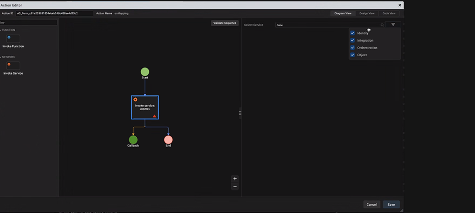
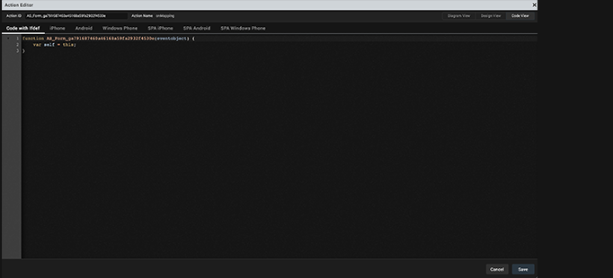
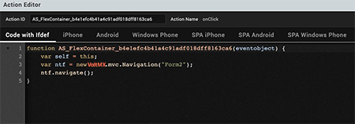
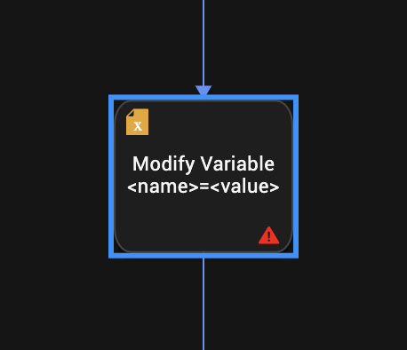
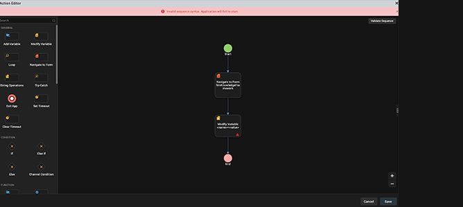

                          

Add Actions by using Action Editor
==================================

After you have added widgets to a form, you can make the form and form elements functional by adding actions to them. To do so, select the form or widget with the action sequence, click the Action tab on the Properties pane, and then click the Edit button of the action you want. The action sequence opens in the Action Editor window.

The Action Editor window displays the Action ID of the Form and the Name of the action for which you are creating an action sequence. There are three types of views in the Action Editor by using which you can create and view Action Sequences. The three types of views are as follows:

*   [Diagram View](#diagram-view)
*   [Design View](#design-view)
*   [Code View](#code-view)

The Action Editor opens in the Diagram view, by default.

> **_Note:_** You can rename an action by editing the Action ID field.

Search for an Action in Action Editor
-------------------------------------

You can search for an action from the left pane of the Action Editor, as shown in the following images. The type of search that is available in the Action Editor is called as _Fuzzy Search_. So when you start typing in the Search box, filtered results that match the search query begin to appear.

In addition, you can search for actions by typing relevant tags in the Search box. For example, if you type _Code_ in the Search box, the **Add Snippet** action appears as the search result. Currently, the search by tags functionality is limited to only these two tags: _Code_ and _Conditional_.

Type the appropriate action tag name or start to type a specific action in the Search box, above the **General** action category. Only the actions that match the search query are displayed.

> **_Note:_** This feature is applicable in Diagram View and Design View, but not in Code View.

Here, when you type _Loop_ in the Search box, the **Loop** action is displayed.

Here, when you type the _Conditional_ tag, all the actions belonging to the **Condition** category are displayed.

Diagram View
------------

Using the Diagram View, you can quickly create and view the flow of an Action Sequence in a graphical representation. In the Diagram View, the Action Editor window is divided into three parts. The left pane contains a list of all the different actions that you can assign to a widget along with the icons associated with the action. The column in the middle contains a canvas that displays a flow diagram of the action sequence that you create. The right pane displays the properties and parameters that you can configure for the action that you select.

The Action Editor Canvas contains two nodes, by default; **Start** and **End**. To add an action in the Diagram View, from the left pane, either click the icon of the action you want to add in the action sequence or drag the icon of the action you want to add and drop it on the canvas. The action is added to the action sequence in between the Start and Stop nodes on the action editor canvas. After an action is added, the properties pane appears. For more information about the various actions available in Volt MX Iris, refer [Categories of Actions](#categories-of-actions).

> **_Note:_** The Properties Editor always displays the properties of the most recently selected widget. If you switch between the Diagram View and the Design View of an action sequence, regardless of what widget it is associated with, the Properties Editor will continue to display the properties of the most recently selected widget.

In Diagram View, the main flow and the nested flow are displayed in different colors. The main flow is displayed in blue color and the nested flow is displayed in orange color. This feature helps you to visually differentiate between the main flow and the nested flow in graphical view of the added actions, and helps you to easily understand the flow.

In Diagram View, you can click the **+** icon to zoom in to the graphical representation of the added actions and click the **\-** icon to zoom out.

Design View
-----------

Using the Design View, you can create and view the flow of an Action Sequence. In the Design View, the Action Editor window is divided into three parts. The left pane contains a list of all the different actions that you can associate with a widget. The column in the middle contains a canvas that displays the action sequence that you create. The right pane displays the properties and parameters that you can configure for the action that you select.

In Design View, the Action Editor Canvas contains a Start action, by default. To add an action in the action sequence, from the left pane, you can either click the action you want to add or drag an action and drop it on the canvas. The selected action is added to the action sequence after the Start action on the Action Editor canvas. After an action is added, the properties pane appears. For more information about the different actions available in Volt MX Iris, refer [Categories of Actions](#categories-of-actions).

> **_Note:_** The Properties Editor always displays the properties of the most recently selected widget. If you switch between the Diagram View and the Design View of an action sequence, regardless of what widget it is associated with, the Properties Editor will continue to display the properties of the most recently selected widget, and those properties will not be currently editable.

Code View
---------

Once you have configured an action, Volt MX Iris generates a code snippet that depicts the action sequence that you can reuse in a JavaScript module.

Depending on the channel of the selected form, in the Code View window, you can view the code of the action sequence for the following platforms and channels:

*   Code with Ifdef
*   iPhone
*   Android
*   SPA iPhone
*   SPA Android
*   Desktop Windows
*   Desktop Web

Categories of Actions
---------------------

In Volt MX Iris, there are seven categories of actions that you can add to a widget. Click a category for instructions on how to add its actions to an action sequence.

[General Actions](ActionsNavigation.md): For adding navigation from one form to another, add and modify variables, add loop actions, perform String operations, execute a try-catch block, or closing an app.

[Conditions Actions](ActionsConditions.md): For running an action based on certain conditions.

[Network Actions](ActionsNetworkAPIs.md): For invoking a loading indicator, an Object service, an Identity service, an Orchestration Service, or an Integration service.

[Widgets Actions](ActionsWidgets.md): For setting widget properties, updating master data, replacing a widget skin, or setting a map location.

[Client Actions](ActionsExternal.md): For sending an SMS message, an email message, displaying an alert, opening a webpage, placing a phone call, set and get local storage, display, anchor, or dismiss a pop-up.

[Functions Actions](ActionsFunctions.md): For writing code snippets or reusing an existing action.

[Animation Actions](ActionsAnimation.md): For moving, scaling, rotating, or transforming a widget, or changing its background color.

[Mapping Actions](ActionsMapping.md): For mapping (i.e. associating) the properties of one widget with another.

For the above actions, when you right-click on them in an action sequence, the following options are available:

*   **Copy**: For copying an action.
*   **Paste**: For pasting a copied action. Available when you copy an action
*   **Delete**: For deleting an action.
*   **Move Down**: For moving down an action in the sequence. Available when more than one action is defined.
*   **Move Up**: For moving up an action in the sequence. Available when more than one action is defined.
*   **Indent In:** For moving an action inside a condition action. Available when an action is below a condition action.
*   **Indent Out:** For moving an action outside a condition action. Available when an action is below a condition action.

This topic also contains information related to the following subjects:

[Important Considerations](#important-considerations)

[Add Watch Actions](#add-watch-actions)

[Validate the Code of an Action](#validate-the-code-of-an-action)

[Generate Code from an Action](#Generate)

[Copy an Action Sequence](#copy-an-action-sequence)

[Disable an Action](#disable-an-action)

[List All Action Sequences in the Actions Node](#ListAllActionSequencesInTheActionsNode)

Important Considerations
------------------------

The following are limitations you should be aware of relative to actions:

*   Animation actions are available only for flex widgets.
*   The Action Editor does not check whether you have assigned a valid action or not. If you assign an invalid action, the app might not function as expected during functional preview.
*   You cannot run the actions on the Iris Canvas.
*   The Properties Editor always displays the properties of the most recently selected widget. If you switch to an action sequence or code, regardless of what widget it is associated with, the Properties Editor will continue to display the properties of the most recently selected widget, and those properties will not be currently editable.
    
    > **_Note:_** If your project was originally created using Volt MX Iris 2.5 that was then imported into Volt MX Studio 6.5, and you import it into the latest version of Volt MX Iris, the action sequences are not imported.
    

Add Watch Actions
-----------------

In Volt MX Iris, you add action sequences for Apple Watch as functions written in the Swift programming language; watchOS does not support JavaScript. For more information, see [Swift](https://developer.apple.com/swift/) on the Apple Developer site.

You can access all the Swift code snippets in your project from the Watch folder, located under Modules on the Project pane of the Project Explorer.

> **_Note:_** For projects with Watch action sequences written in JavaScript, created in Volt MX Iris 7.0, to continue working on such a project in Volt MX Iris 7.0.3 or later, those Watch action sequences will have to be rewritten in Swift. When you attempt to open such a project in Volt MX Iris 7.0.3, a dialog box appears stating that continuing will cause all Watch action sequences with JavaScript to be dropped, and they will need to be rewritten. You can choose to continue, which opens the project and drops those Watch action sequences with JavaScript, or cancel, which doesn't open the project and leaves it unchanged.

To add a Swift code snippet, do the following:

1.  From the Project tab of the Project Explorer, navigate to the Watch channel, locate the form or widget you want to apply the action to, click its context menu arrow, and then select one of the action sequences, such as onTouchStart. Doing so opens the Action Editor and creates an action sequence for you to configure.
2.  Click **Add Swift Snippet** from the Functions section. The action is added to the action sequence and is the current action of focus.
3.  In the bottom pane of the Action Editor, in the code editor, enter the Swift code that you want to add, or paste it in from another source by pressing **Ctrl+V**.
4.  Save the action by pressing **Ctrl+S**.

Validate the Code of an Action
------------------------------

After you have configured an action, you can verify to ensure that the code of the action sequence is valid.

To validate the code of an action sequence, do the following:

1.  Open the action sequence that you want to validate. To do so, select the widget with the action sequence, click the Action tab on the Properties pane, and then click the **Edit** button of the action you want. The action sequence opens on the Iris Canvas.
2.  In Design View and Diagram View, Volt MX Iris points out statements in the action sequence that are in error or are incomplete with a red information icon. Correct these statements.

      
  
    

3.  To validate the action sequence, in the Action Editor window, for Design View/Diagram View click **Validate Code**.

4.  Volt MX Iris evaluates the action sequence. If the code is not valid, Volt MX Iris displays an appropriate error message. Follow the feedback of the validator and correct the sequence.  
      
    
5.  After you correctly revise the sequence, Volt MX Iris verifies the validity of the action sequence and displays an appropriate success message.

Copy an Action Sequence
-----------------------

You can copy an entire action sequence and apply it to another widget.

To copy an action sequence, do the following:

1.  Open the action sequence you want to copy.
2.  Right-click the top node name of the action sequence, and then click **Copy**.
3.  Navigate to the widget you want to paste the action sequence to, right-click it, and then select the action that you want to paste to.
4.  Right-click the top node name of the action sequence, and then click **Paste**.

Reuse an Action Sequence
------------------------

To reuse the code snippet for the action sequence specific to a platform, do the following:

1.  From the Code View window, select the tab for the platform and channel that you want.
2.  Click in the pane to set the focus, and then select the code snippet by pressing **Ctrl+A**.
3.  Copy the snippet by pressing **Ctrl+C**.

Delete an Action
----------------

You can delete unwanted actions from an action sequence.

To delete an action in an action sequence, do the following:

1.  Open the action sequence that has the action or actions you want to disable.
2.  Right-click the action you want to delete, and click **Delete**. The action is removed from the action sequence.

Disable an Action
-----------------

You can disable an action to help you isolate trouble areas in your testing of action sequences.

To disable an action in an action sequence, do the following:

1.  Open the action sequence that has the action or actions you want to disable.
2.  Right-click the action you want to disable, and click **Disable**. The name of the action fades, indicating that it is disabled.
