                           


Creating Apple Watch Applications in Volt MX Iris
=======================================================

With Volt MX Iris, you can create your entire iOS app from end to end. Specifically, you can write an iOS app that runs on a user's iOS device, you can add your Watch app's business logic in the WatchKit Extension, and you can design the entire user interfaces of both the iOS app and the Watch app. The user interfaces for both your iOS app and your Watch app are forms and widgets that you simply drag and drop onto the Iris palette. For information about which user interface objects are supported on the watch, please see [Watch Applications, Forms, and Widgets](#apple-watch-forms-and-widgets).

Adding a Watch App to your Volt MX Iris Project
-----------------------------------------------------

In Volt MX Iris, Apple Watch apps can be added to your current project in the same way as a mobile, desktop, or tablet. In Iris's Project Explorer pane, you will see that in addition to the Mobile, Tablet, and Desktop channels, there is also a Apple Watch channel displayed under Wearables, as shown in the following illustration.


If you do not see Watch channel, right click on the project name in the Project Explorer, select “Filter” and ensure that “Wearables” is selected.


An Apple Watch app can be built by adding forms and user interface objects to the Watch channel. The ability to interactively build both an Apple Watch app and its associated iOS app interactively provides a simple, integrated, and intuitive method of creating an integrated phone and watch application.  

In addition, when you build your Apple Watch app project, you also need to select Apple Watch apps in the build settings in Volt MX Iris, as shown below.  


 

Apple Watch Forms and Widgets
----------------------------------

An Apple Watch app's user interface is created with forms and widgets. There are two types of forms in a watch application: App forms and Notification forms.  

App forms can be added by right clicking on “Forms” in the Apple Watch channel in the Project Explorer, and selecting “New Form”. 

Navigation forms can be added by right clicking on “Notifications” in the Apple Watch channel in the Project Explorer, and selecting “New Notification”. 

An Apple Watch application cannot dynamically create forms at run time. You must add all forms the app needs in Iris at design time. If your app has more than one form, it can dynamically select which form it will display at any given time. 

Notification forms can be either static or dynamic, meaning that they can contain either static content that does not change, or they can hold dynamic information that changes. 

Iris supports the following widgets for Apple Watch applications:

*   Button
*   Date
*   Group: horizontal and vertical
*   Image
*   Label
*   Line
*   Map
*   Segment
*   Slider
*   Switch
*   Timer  

Apple Watch Templates
----------------------  

To help build the user interface for your app, Volt MX Wearables for Apple Watch supports templates for Segment widgets. For example, the sample app shown in the figure below has a Segment widget on its `Form2` form.  

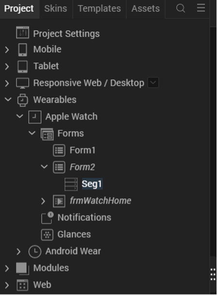

 
To use a template with the Segment widget, select the **Templates** tab, as shown below.  

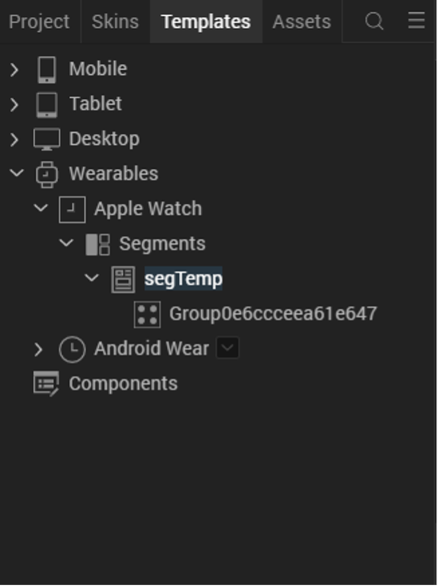

 
The Templates tab displays a list of all of the available templates in your project and enables you to add templates for each channel. In this example, there is one segment template (segTemp) for the Apple Watch channel. It contains a single group.  

In templates, you can add any supported widgets. These will be applied to segments that use the template and displayed in the UI when your app displays the segment. Templates can be applied to a segment using the following steps:  

1.	Select the **Project** tab of the Project Explorer and select the segment.
    

2.	In the **Properties** pane, select the **Segment** tab.

3.	Select the template to apply to the segment in the **Row Template** dropdown.    

    

 
Apple Watch Actions
---------------------

> **_Note:_** Actions other than Add Swift Snippet are only supported for Apple Watch on V9 Servicepack 5 Fixpack 15 or later.

Adding actions enables you to build business logic into your Apple Watch application. Apple Watch actions are typically event handlers that are triggered by user interactions with the UI, but they can also be callbacks that are invoked by notifications. You add an action to a form or widget with the following steps.  

1.	Select the **Action** tab in the **Properties** pane, as shown below. If there is no **Action** tab, no actions are supported by the selected form or widget.  
    
2.	The **Action** tab displays the list of actions that the form or widget supports. Click the **Edit** button next to the action you wish to add or edit. Volt MX Iris displays a list of actions. For more information on available actions, see the [Categories of Actions documentation](../../iris_user_guide/Content/working_with_Action_Editor.html#categories-of-actions). 


Apple Watch Modules
--------------------

If your app requires long swift snippets, consider putting them into a function in a Swift code module. Your app can call the function from an action's code snippet. Create a Swift code module by right clicking on the **Apple Watch** folder under **Modules/Wearables** in the Project Explorer and select **New Swift module**.


 
You can put any valid code in your custom Swift modules that your app needs. This includes classes, methods, constants, module global variables, or whatever else you may need to write your app.  

Communication Between the iPhone App and the WatchKit Extension  
---------------------------------------------------------------------  

Watch apps are paired with iPhones via Bluetooth. Watch apps send information requests to their respective iOS apps by calling the `sendMessage:replyHandler:errorHandler:` method, which is in the `WCSession` class in the Apple Watch Connectivity API. In addition to using the `sendMessage:replyHandler:errorHandler:` method for information requests, your watch app can invoke it to perform time-consuming tasks such as network calls. In these cases, the watch application relies on the iOS application to execute the business logic. Calling the the `sendMessage:replyHandler:errorHandler:` method wakes the parent application up in the background (if it is not already running in the foreground), executes the operation, and returns the data that the Watch application needs. The watch callback method that handles the WatchKit request must return immediately or nearly immediately.

To fetch data from the iOS app, the Watch app calls `sendMessage:replyHandler:errorHandler:` in accordance with the [Apple guidelines](https://developer.apple.com/documentation/watchconnectivity/wcsession) for using the `WCSession` class. The following example demonstrates how the Watch app fetchs data from the iOS app.


```
<Class Start>

import Foundation
import WatchConnectivity
import WatchKit

class PhoneCommunicator : NSObject, WCSessionDelegate {

    static var sharedInstance:PhoneCommunicator? = nil;
    var session:WCSession? = nil;

    override init() {
        super.init();
        session = WCSession.defaultSession();
        if(session!.delegate == nil){
            session!.delegate = self;
            session!.activateSession();
        }
    }

    class func getSharedInstance() -> (PhoneCommunicator) {
        if(sharedInstance == nil){
            sharedInstance =  PhoneCommunicator();
        }
        return sharedInstance!;
    }

    func pingPhone() {
        if WCSession.isSupported() {
            print("session is supported on watch");
            if(session!.reachable){
                print("session reachable on phone");
                session!.sendMessage(
                    ["requestId": "sayHello"], 
                    replyHandler: { 
                        (response) -> Void in print("in reply handler");
                        print("\(response["reply"]!)");
                    },
                    errorHandler: { 
                        (error) -> Void in print("in error callback");
                        print("\(error)")
                    }
                )
            }
        }
    }
}
<Class End>
```


### REQUIREMENTS
<!-- This feature is available for all iPhone and Apple Watch OS versions supported by Volt MX. Your application must have at least one mobile form and one Apple Watch form. Not supported for Android devices.   -->
This feature is available for all iPhone and Apple Watch OS versions supported by Volt MX. Your application must have at least one mobile form and one Apple Watch form. Not supported for Android devices.

### ENABLING WATCH CONNECTIVITY  

> **_Note_**: Low code watch connectivity is only supported for Apple Watch apps paired with an iOS app on V9 Servicepack 5 Fixpack 15 or later. 

Volt MX now supports adding Watch Connectivity support in a low-code way. To enable Watch Connectivity, follow these steps:  

1.	Open the Project Settings
2.	Navigate to Native -> Watch
3.	Select the option for Enable Watch Connectivity and press the Done button
    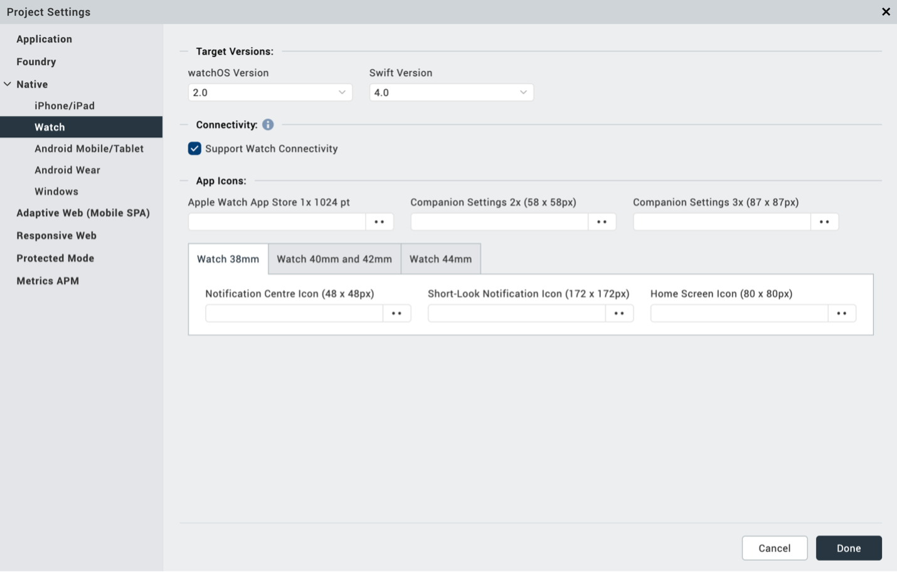
 

When Watch Connectivity support is turned on, two new files are created and added to your project: WatchConnectivity.js and WatchConnectivity.swift.   

WatchConnectivity.swift provides methods that can be used to send requests to your companion iPhone application.  


 

WatchConnectivity.js provides the structure for processing requests received by the iPhone app. These files are read-only, as they do not need to be edited directly. 


 
### SENDING REQUESTS TO THE COMPANION PHONE APP  

> **_Note_**: Low code watch connectivity is only supported for Apple Watch apps paired with an iOS app on V9 Servicepack 5 Fixpack 15 or later. 

For any operations that require significant processing time, Apple recommends that they be performed on the companion iPhone application instead of on the Apple Watch application. To request information from the companion app, use the Send Watch Connectivity Request action. This action is available for Apple Watch Forms and Widgets (this action is not supported in Glances or Notifications). The Send Watch Connectivity Request action takes in two parameters: a string key, and a collection of information. These are passed to the phone to perform the necessary operation according to the key value. Similar to other actions, the Send Watch Connectivity action has code paths for success and failure responses, as well as the default code path that continues to execute while the companion app processes the request.  


 

### PROCESSING REQUESTS IN THE COMPANION PHONE APP

> **_Note_**: Low code watch connectivity is only supported for Apple Watch apps paired with an iOS app on V9 Servicepack 5 Fixpack 15 or later. 

To set up the companion iPhone application to process this request, navigate to Mobile App Events by tapping on the Mobile channel. Select Edit for the Watch Connectivity App Event.   

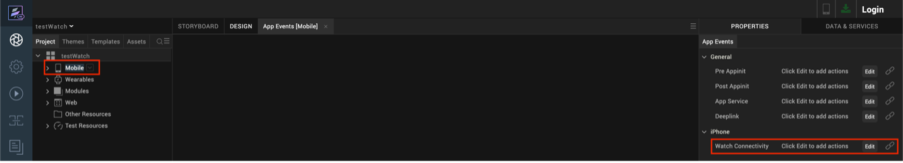

This action sequence takes in a string key (key), a collection of information (info), and a reply handler (replyHandler). The key and info variables will be the key and info provided via the Send Watch Connectivity Request action on the watch form/widget. The reply handler is the handler that corresponds to the success and failure code paths for the Send Watch Connectivity Request action.  

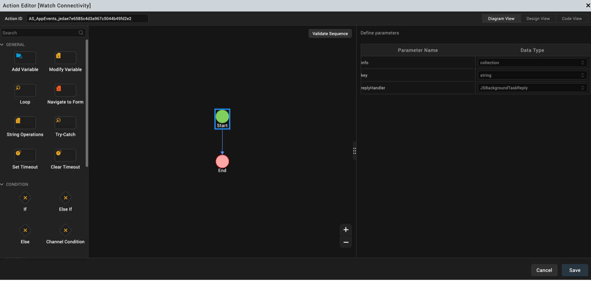
 

The key can be used to differentiate between multiple different actions that the mobile app may be expected to perform. Code generated here will be called when the companion app receives a request from the watch. If your companion app will need to process multiple types of requests from the watch, it is recommended that you start this action sequence by checking the key to see if it matches one of your expected actions. When the request has been successfully processed, the Send Info to Watch action can be used to send any relevant information back to the watch’s reply handler. This method takes in a collection of information and a reply handler. The reply handler that is a parameter for the Watch Connectivity action sequence should be used.  


 


Handling Notifications
-----------------------

Apple Watch apps can respond to both local notifications and remote notifications. They are processed by the iOS app that is paired with the Apple Watch app. iOS decides whether to send the notifications to the watch or phone. For more information, see [Apple’s documentation](https://developer.apple.com/documentation/watchos-apps/taking-advantage-of-notification-forwarding).  

To process notifications, you must create the appropriate notification forms for the Apple Watch app.   


### CREATING NOTIFICATIONS ON THE WATCH  

To create notifications, use the following steps:  

1.	Right click the **Notifications** node in the Volt MX Iris Project Explorer under Wearables/Apple Watch.  
2.	In the menu that appears, click **New Notification**. By default, this creates a static notification. It can only display information and alerts.  
3.	If you want to change the notification to a dynamic notification, which can have interactive elements such as buttons, select the notification that you created in step 2.  
4.	Use the down arrow next to the name of the notification to pull down the context menu and click **Create Dynamic Notification**, as shown in the following illustration.  
    
 
Volt MX Iris adds a new node for the dynamic notification form to your project, as depicted in the illustration below.  

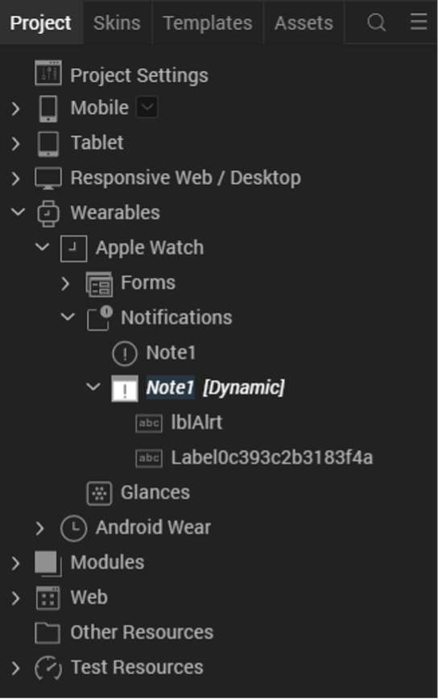
 
When you create a dynamic notification form, the form can receive events. Therefore, you can add event handlers to the form by clicking the **Action** tab in the **Properties** pane, and then choosing the **Edit** button followed by **Add Swift Snippet**. 

### PROCESSING NOTIFICATIONS

Notifications are processed by the iOS app that is paired with your Watch app. Your app processes local notifications using the functions in the [voltmx.localnotifications namespace](../../iris_api_dev_guide/content/voltmx.localnotifications_functions.md). Your iOS app does not have to register for local notifications. 

To process remote notifications, it uses the functions in the [voltmx.push namespace](../../iris_api_dev_guide/content/voltmx.push_functions.md). When your iOS app starts, it must register for the remote notifications that it needs to receive by invoking the [voltmx.push.register](../../iris_api_dev_guide/content/voltmx.push_functions.md#voltmxpushregister) function. It can then get its notifications using the [voltmx.push.getMessages](../../iris_api_dev_guide/content/voltmx.push_functions.md#push.getmessages) and [voltmx.push.getMessageCount](../../iris_api_dev_guide/content/voltmx.push_functions.md#cb1) functions. You can also use the [voltmx.push.setCallbacks function](../../iris_api_dev_guide/content/voltmx.push_functions.md#cb1) to set the notification handlers for the notifications you want to process.  

### ADDING NOTIFICATION HANDLERS
You add notification handlers in your Swift code by selecting the **Action** tab in the **Properties** pane, and then choosing the **Edit** button followed by **Add Swift Snippet**. Your code must handle the notifications in accordance with Apple guidelines. For more information, please see the following [Apple documentation](https://developer.apple.com/documentation/watchos-apps/notifications).  

Many notification event handlers have a parameter named completionHandler, as indicated by the red circle in the figure below. 

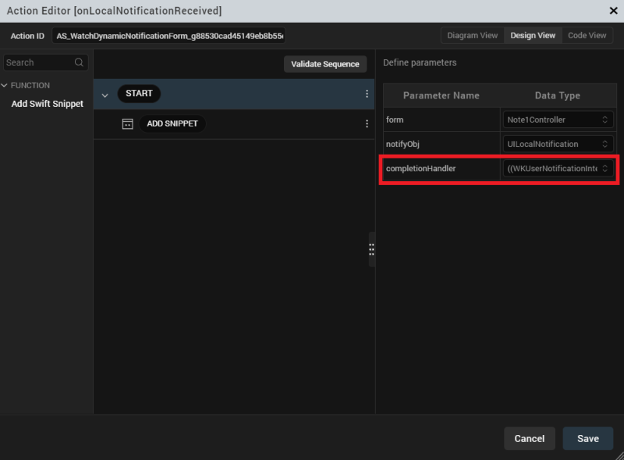  

 
The completionHandler parameter contains a callback function that your event handler must call upon successful completion in order for the event to be handled properly. This call must be placed at the end of your event handler. Failure to invoke the completionHandler function results in undefined behavior.  

How to Create a Sample Watch App on iOS
-----------------------------------------

This walkthrough provides a brief introduction on how to create Watch apps for iOS.  

### BEGINNING THE SAMPLE WATCH APP

When you build your own watch app, it must be built in conjunction with an iOS app. So the first step is to create an iOS and/or iPadOS app in Iris. To do so, add forms and code to the Mobile and/or Tablet in the Volt MX Iris Project tree, as the following illustration shows. 

  
 
You must ensure that your iOS/iPadOS app has at least one form or your app will not build.  

If you need information on creating iOS/iPadOS apps in Volt MX Iris, please see the [VoltMX Widget Programmer's Guide](../../iris_widget_prog_guide/Content/Overview.md) and the [VoltMX Iris API Developer's Guide](../../iris_api_dev_guide/content/introduction.md).  

In the Volt MX Iris Project tree there is an additional platform (also called a channel) that is specifically for the watch. This channel, named Apple Watch, contains sub-items for forms and notifications.  

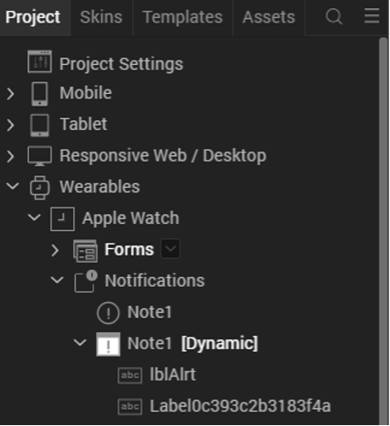  


### ADDING FORMS TO THE SAMPLE WATCH APP  

You can design a user interface for your watch app by dragging user interface objects and forms from the Widgets list in the lower left of the Iris screen and dropping them onto the Forms node.  

  

 
In this figure, you can see that the watch app has a single form, which is highlighted in the **Project** tree on the left. This is a container form that you can drag other widgets into.  


Like any other type of application built with Volt MX Iris, Watch apps can have multiple forms. Each form can contain a variety of user interface objects, such as buttons, labels, sliders, and etc.  

### ADDING ACTIONS TO THE WIDGETS AND FORMS  

> **_Note:_** Only Add Swift Snippet is supported on versions older than V9 Servicepack 5 Fixpack 15.

As with forms and widgets in other types of applications, forms and widgets in a watch app can respond to actions. For example, if your Watch app contains a button, you can add an event handler action to have the button widget process user interactions.  

To do so, click on the **Action** tab in the **Properties** pane, as shown below.  

To add code for an action such as a Button widget's onClick event handler, use the following procedure.  

1.	Select the widget for which you want to add the event handler in the Project tree
2.	In the **Properties** pane, click the **Action** tab.
3.	Click the **Edit** button in the **Action** pane of the Volt MX Iris **Properties** window. 
      
4.	The Action Editor appears. Click the **Navigate to Form** action. For more information on how to use the action editor, see the [Add Actions](../../iris_user_guide/Content/working_with_Action_Editor.md) documentation. 
5.	When you click **Navigate to Form**, Iris opens a window for you to define the name of the form to which you will navigate when the button is pressed.     
    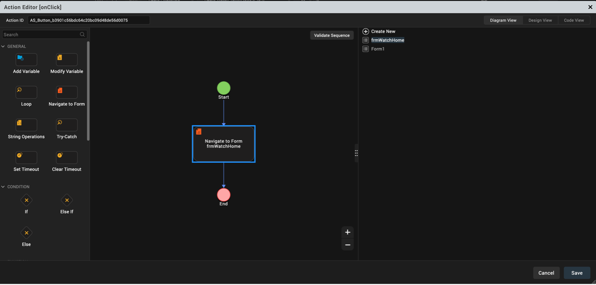  
    Notice in the preceding figure that **Navigate to Form** has been added to the list of actions that respond to the button's **onClick** event. The **onClick event** for a button takes one parameter, called form, that contains the button's form. 
6.	Click **Save** to save the action sequence.  


### ADDING NOTIFICATIONS TO THE SAMPLE WATCH APP

You can add notification forms by clicking the notification in the **Project** tree and selecting the down arrow to pull down the context menu. From the context menu, choose **New Notifications**. 

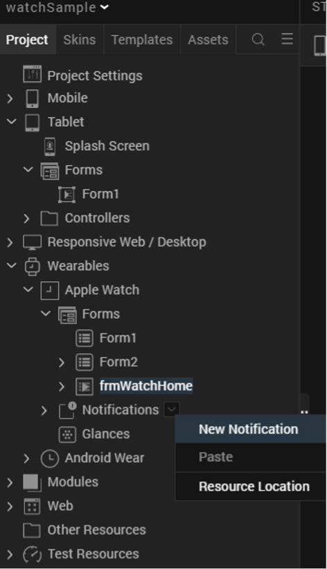  
 
When you do, a notifications form will be added to your app. In this example, we will create a form for the fictional Watch Sample app.  

  

As with regular forms, you can drag user interface objects onto your notification form. Because they display primarily only static information, the palette of user interface objects that are available for notification forms is more limited than with regular forms.  

To add a dynamic notification, simply select a notification form, click on its down arrow, and select **Create Dynamic Notification** from the context menu.  

  
 
> **_Note_**: Each static notification in your app can have at most one dynamic notification associated with it.  

### BUILDING THE SAMPLE WATCH APP 

When you have finished adding widgets, actions, code snippets, and code modules to your app, you can build it by selecting **Build** from the Volt MX Iris main menu. Next, click **Build Native Local**. The Volt MX Iris **Build Native Local** dialog box appears. In this dialog box, you must check **iOS** to build your Watch app's parent iOS app. You must also check **iOS** under **Wearables** to build your Apple Watch app.  

  

 
If the app builds correctly, Volt MX Iris outputs a .KAR file. The .KAR file contains the storyboards for your app, the code for the actions and other event handlers, and any code that you added in custom Swift modules.  

To compile, debug, and run your app, you must extract the .KAR file and load it into Xcode. With your app in Xcode, you are ready to compile and debug it. If you make changes to your app's code in Xcode, it is recommend that you copy the changes back into the code editor in Volt MX Iris. 

Internationalizing Watch Applications
-----------------------------------------

Apps for Volt MX Wearables can be customized for international use. In particular, you can define different strings that your app can use in its user interface for different locales. There are two ways to do this. First, you can define locale strings using Volt MX Iris. Second, you can add them to your app programmatically.  

To define locale strings in Volt MX Iris, use the following steps.  

1.	Select **Edit** from the main menu, and then choose **Internationlization(i18n)**, as shown in the figure below.
      
2.	In the dialog box that appears, enter the keys for the text you want to localize, as shown in the following figure. Use the plus symbol at the right of the dialog box to select the languages that you want to localize for. For each language that you add, enter the localized string. Click Finish. The **Configure Internationalization** dialog box closes.
    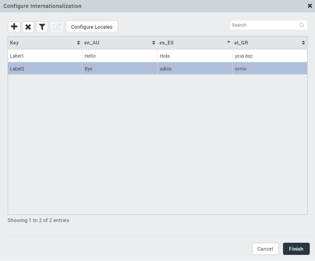  
3.	Select the widget whose UI text you want to localize.
4.	In the **Properties** pane, select the key you create in step 2.
    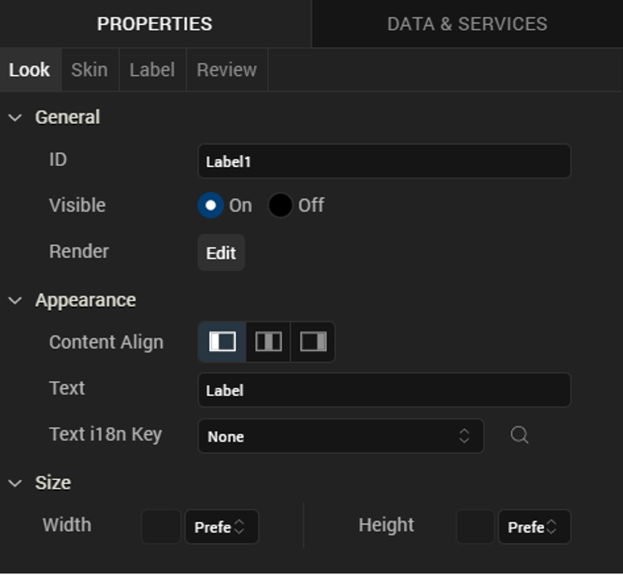   

For example, if you created a key called sKey, selected the locales, and entered the localized strings in step 2, you would then select a widget as instructed in step 3. The **Properties** pane for the label widget would look similar to the figure above. You would next select the key sKey in the **Text i18n Key** field. The result would be that, instead of the string "Label" being used for the Label widget's label when you app runs, your app would automatically use the localized strings if the app was being on a device is set to one of the locales you chose in step 2.


<!-- When you develop a mobile or tablet app, you do so by adding forms, widgets, and so forth to the appropriate channels. Likewise, you can build a watch app by adding forms and user interface objects to the Watch channel. The ability to interactively build both a Watch app and its associated iOS app interactively provides a simple, integrated, and intuitive method of creating an integrated phone and watch application.

In addition, when you build your Watch app project, you also need to select Apple Watch apps in the build settings in Volt MX Iris, as shown below.


Watch Applications, Forms, and Widgets
--------------------------------------

You create your watch app's user interface with forms and widgets. You can use three types of forms in a watch application: App forms, Notification forms, and Glance forms. All of these are directly available on the Widgets tab of the Volt MX Library pane in Iris.

A watch application cannot dynamically create forms at run time as you can in a mobile or desktop app. You must add all of the forms your watch app needs in Iris at design time. If your app has more than one form, it can dynamically select which form it will display at any given time.

Notification forms can be either static or dynamic. That is, they can contain either static content that does not change, or they can hold dynamic information that changes.

Glance forms follow the Apple layout. Specifically, there are upper and lower areas to the glance form as defined in the Apple programming guidelines. Glance forms only support a few types of widgets. For example, you cannot add a button to a glance form because glances are not actionable.

Iris enables you to use the following widgets in your watch application.

*   Button
*   Date
*   Group: horizontal and vertical
*   Image
*   Label
*   Line
*   Map
*   Segment
*   Slider
*   Switch
*   Timer

Watch Applications and Templates
--------------------------------

To help you build the user interface for your app, Volt MX Wearables for Apple Watch supports templates, but only for SegmentedUI widgets. For example, the sample app shown in the figure below has a SegmentedUI widget on its `frmSecond` form. To use a template with the SegmentedUI widget, you first click on the **Templates** tab, as shown below.


The Templates tab displays a list of all of the SegmentedUI widgets in your Watch app and enables you to add templates for each one. In this example, there is only one segment. It has a single template, and it's called segTemp, as the following figure illustrates.


In your templates, you can add Group widgets, buttons, images, and so forth. These are applied to segments and displayed in the UI when your app displays the segment.

After you have your template looking the way you want it to, you can apply it to a segment by using the following steps.

1.  Click on the **Project** tab and then selecting the segment, as illustrated below.
    
    
    
2.  Go to the **Properties** pane and click the **Segment** tab, which is displayed in the following figure.
    
    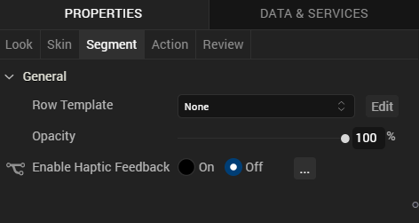
    
3.  Now select the template to apply to the segment from the **Row Template** list.
    

Watch Applications, Actions, and Modules
----------------------------------------

Adding actions enables you to build the business logic directly into your watch application. Watch app actions are typically event handlers that are triggered by user interactions with the UI. They can also be callbacks that are invoked by notifications. These are written in Swift. You add an action to a form or widget with the following steps.

1.  Click the **Action** tab in the **Properties** pane, as shown below.
    
    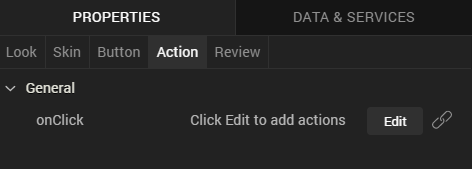
    
2.  The **Action** tab displays the list of actions that the form or widget supports. Click the **Edit** button. Volt MX Iris displays a list of actions. Currently the only action that is supported is adding a Swift code snippet.
    
3.  **Add Swift Snippet** and add your code in the editor pane that appears.

If your snippet takes more than a few lines of code, you should consider putting it into a function an a Swift code module. Your app can then call the function from an action's code snippet. As with any other type of project, you can group your watch app's functions into modules and include them in your project. You create a Swift code module by clicking on **Modules** in the Project tree and then selecting **New Swift module** from the **Watch** node, as shown in the illustration below.


Note that you can put any valid code in your custom Swift modules that you need for you app. This includes classes, methods, constants, module global variables, or whatever else you may need to write your app.

Communication Between the iPhone App and the WatchKit Extension
---------------------------------------------------------------

Watch apps are paired with iPhones via Bluetooth. Watch apps send information requests to their respective iOS apps by calling the `sendMessage:replyHandler:errorHandler:` method, which is in the `WCSession` class in the Apple Watch Connectivity API. In addition to using the `sendMessage:replyHandler:errorHandler:` method for information requests, your watch app can invoke it to perform time-consuming tasks such as network calls. In these cases, the watch application relies on the iOS application to execute the business logic. Calling the the `sendMessage:replyHandler:errorHandler:` method wakes the parent application up in the background (if it is not already running in the foreground), executes the operation, and returns the data that the Watch application needs. The watch callback method that handles the WatchKit request must return immediately or nearly immediately.

To fetch data from the iOS app, the Watch app calls `sendMessage:replyHandler:errorHandler:` in accordance with the [Apple guidelines](https://developer.apple.com/library/ios/documentation/WatchConnectivity/Reference/WCSession_class/index.md) for using the `WCSession` class. The following example demonstrates how the Watch app fetchs data from the iOS app.

```
<Class Start>
 	
import Foundation
import WatchConnectivity
import WatchKit

class PhoneCommunicator : NSObject, WCSessionDelegate {
    
    static var sharedInstance:PhoneCommunicator? = nil;
    var session:WCSession? = nil;
    
    override init() {
        super.init();
        session = WCSession.defaultSession();
        if(session!.delegate == nil){
            session!.delegate = self;
            session!.activateSession();
        }
    }
    
    class func getSharedInstance() -> (PhoneCommunicator) {
        if(sharedInstance == nil){
            sharedInstance =  PhoneCommunicator();
        }
        return sharedInstance!;
    }
    
    func pingPhone() {
        if WCSession.isSupported() {
            print("session is supported on watch");
            if(session!.reachable){
                print("session reachable on phone");
                session!.sendMessage(
			        ["requestId": "sayHello"], 
			        replyHandler: { 
			            (response) -> Void in print("in reply handler");
				        print("\(response["reply"]!)");
                    },
                    errorHandler: { 
			            (error) -> Void in print("in error callback");
                        print("\(error)")
                    }
			    )
            }
        }
    }
}

<Class End>


		
```

Handling Notifications
----------------------

Your Apple Watch app responds to both local notifications and remote notifications. They are processed by your iOS app that is paired with your Watch app. iOS itself decides whether to actually send the notifications to the watch.

To process notifications, you must use Volt MX Iris to create the appropriate notification forms in the Watch app.

##### Creating Notifications on the Watch

To create notifications, use the following steps.

1.  Go to the **Notifications** node in the Volt MX Iris **Project** pane and select it.
2.  In the menu that appears, click **New Notification**. By default, this creates a static notification that cannot be interacted with. It can only display information and alerts.
3.  If you want to change the notification to a dynamic notification, which can have interactive elements such as buttons, select the notification that you created in step 2.
4.  Use the down arrow next to the name of the notification to pull down the context menu and click **Create Dynamic Notification**, as shown in the following illustration.
    
    
    
    Volt MX Iris adds a new node for the dynamic notification form to your project, as depicted in the illustration below.
    
    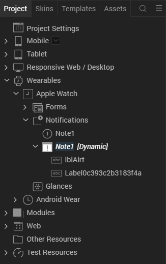
    

When you create a dynamic notification form, the form can receive events. Therefore, you can add event handlers to the form by clicking the **Action** tab in the **Properties** pane, and then choosing the **Edit** button followed by **Add Swift Snippet**.

##### Processing Notifications

Notifications are processed by the iOS app that is paired with your Watch app. Your app processes local notifications using the functions in the [voltmx.localnotifications namespace](../../../Iris/iris_api_dev_guide/content/voltmx.localnotifications_functions.md). Your iOS app does not have to register for local notifications.

To process remote notifications, it uses the functions in the [voltmx.push namespace](../../../Iris/iris_api_dev_guide/content/voltmx.push_functions.md). When your iOS app starts, it must register for the remote notifications that it needs to receive by invoking the [voltmx.push.register](../../../Iris/iris_api_dev_guide/content/voltmx.push_functions.md#volt-mx-push-register) function. It can then get its notifications using the [voltmx.push.getMessages](../../../Iris/iris_api_dev_guide/content/voltmx.push_functions.md#push.getmessages) and [voltmx.push.getMessageCount](../../../Iris/iris_api_dev_guide/content/voltmx.push_functions.md#cb1) functions. You can also use the [voltmx.push.setCallbacks](../../../Iris/iris_api_dev_guide/content/voltmx.push_functions.md#volt-mx-push-setcallbacks) function to set the notification handlers for the notifications you want to process.

##### Adding Notification Handlers

You add notification handlers in your Swift code by selecting the **Action** tab in the **Properties** pane, and then choosing the **Edit** button followed by **Add Swift Snippet**. Your code must handle the notifications in accordance with Apple guidelines. For more information, please see the following Apple documentation.

*   [Notifications](https://developer.apple.com/library/ios/documentation/General/Conceptual/WatchKitProgrammingGuide/BasicSupport.md#//apple_ref/doc/uid/TP40014969-CH18-SW1)
*   [Local and Remote Notification Programming Guide](https://developer.apple.com/library/prerelease/ios/documentation/NetworkingInternet/Conceptual/RemoteNotificationsPG/Chapters/Introduction.md)

Many notification event handlers have a parameter named _completionHandler_, as indicated by the red circle in the figure below.


The _completionHandler_ parameter contains a callback function that your event handler _must_ call upon successful completion in order for the event to be handled properly. This call _must_ be placed at the end of your event handler. Failure to invoke the _completionHandler_ function results in undefined behavior.

How to Create a Sample Watch App on iOS
---------------------------------------

This walkthrough provides a brief introduction on how to create Watch apps for iOS.

##### Beginning the Sample Watch App

When you build your own watch app, it must be built in conjunction with an iOS app. So the first step is to create an iOS app in Iris. To do so, you add forms and code to the Mobile or Tablet nodes (or both) in the Volt MX Iris Project tree, as the following illustration shows.


You must ensure that your iOS app has at least one form or your app will not build.

If you need information on creating iOS mobile or tablet apps in Volt MX Iris, please see the [VoltMX Widget Programmer's Guide](../../../Iris/iris_widget_prog_guide/Content/Overview.md) and the [VoltMX Iris API Developer's Guide](../../../Iris/iris_api_dev_guide/content/introduction.md).

In the Volt MX Iris Project tree there is an additional platform (also called a channel) that is specifically for the watch. This channel, named Watch, contains three sub-items; one for forms, one for notifications, and one for glances, as shown below.


##### Adding Forms to the Sample Watch App

You can design a user interface for your watch app by dragging user interface objects and forms from the Widgets list in the lower left of the Iris screen and dropping them onto the Forms node, as illustrated below.


In this figure, you can see that the watch app has a single form, which is highlighted in the **Project** tree on the left. This is a container form that you can drag other widgets into.

Like any other type of application built with Volt MX Iris, Watch apps can have multiple forms. Each form can contain a variety of user interface objects, such as buttons, labels, sliders, and so forth.

##### Adding Actions to the Widgets and Forms

As with forms and widgets in other types of applications, forms andwidgets in a watch app can respond to actions. For example, if your Watch app contains a button, you can add an event handler action to have the button widget process user interactions. Your Watch app's event handlers must be written in Swift, as required by Apple.

To do so, click on the **Action** tab in the **Properties** pane, as shown below.

To add code for an action such as a Button widget's `onClick` event handler, use the following procdedure.

1.  Select the widget that you want to add the event handler to in the Project tree
2.  In the **Properties** pane, click the **Action** tab, as shown in the following figure.
    
    
    
3.  Click the **Edit** button in the **Action** pane of the Volt MX Iris**Properties** window, as shown in the previous illustration. When you do, you are presented with the option of adding a Swift code snippet, which is illustrated in the following figure.
    
    
    
4.  When you click **Add Swift Snippet**, Iris opens a window for you to define the parameters to your callback. This is shown in the figure below.
    
    
    

Notice in the preceding figure that **Code Snippet** has been added to the list of actions that respond to the button's **onClick** event. The **onClick** event for a button takes one parameter, called _form_, that contains the button's form. The _form_ parameter is of type `frmHomeController`. When you build your app, Volt MX Iris turns all of this into Swift code for your event handler.

Form controllers are generally the targets of your app's actions. So Volt MX Iris creates a form controller for every form in your app. In the example above, Iris created the `frmHomeController` type for the button's form. As the illustration above indicates, when the button's **onClick** event handler is invoked, it is passed the form controller of the form that invoked the handler.

Other actions have more parameters than the Button widget's **onClick** event does. In such cases, the additional parameters are listed in the **Define Parameters** window.

To type code into your event handler, click the **Code Snippet** node, which is shown in the preceding illustration. Volt MX Iris responds by displaying a code editor window. Use the code editor window to enter the Swift code that you want in our event handler, as shown in the figure below.


In the preceding illustration, the event handler pushes a new form. By this action, the app navigates to a form called `frmFirst`. The Swift method call in the example above is simply a standard call to an Apple API function. In general, this is exactly how your app responds to events. That is, it uses actions and code snippets written in Swift to process input from the user.

Clicking the Generate button generates the Swift code for the event handler and pops it up in a window, as the following figure shows.


As you can see, Volt MX Iris generates the Button widget's handler for the `onClick` event using the parameters shown previously and the code snippet given above. When you build your project, Volt MX Iris stores the code for your actions, like the code for the `onClick` event shown in the preceding figure, in a file called SwiftCallbacksBridge.swift. If you need to debug the code in your actions, that's where you will find it.

> **_Important:_** Many event handlers have a parameter named _completionHandler_. The _completionHandler_ parameter contains a callback function that your event handler _must_ call in order for the event to be handled properly. Failure to invoke the _completionHandler_ function results in undefined behavior.

##### Complex Actions

The example in the preceding topic performed a simple navigation from one form to another in its event handler. However, if your app's event handler needs to perform a complex action, you generally should define a function in a separate Swift code module and call the function from your app's event handler. If you do, the code snippet for the event handler will probably be very simple and straightforward. But it can still perform complex processing by invoking one or more functions from your custom Swift code module.

Moving event handler code into functions in Swift code modules provides you with several advantages. For instance, it enables you to define and access module global variables. You can also manually import libraries that may not normally be imported by the code that Volt MX Iris generates.

##### Adding Notifications to the Sample Watch App

You can add notification forms by clicking the notification in the **Project** tree and selecting the down arrow to pull down the context menu. From the context menu, choose **New Notifications**.

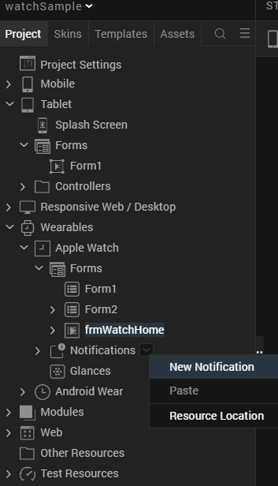

When you do, a notifications form will be added to your app. In this example, we will create a form for the fictional Volt MX Airlines that will display such information as flight schedules. The form appears below.


As with regular forms, you can drag user interface objects onto your notification form. Because they display primarily only static information, the palette of user interface objects that are available for notification forms is more limited than with regular forms. But you are able to add such user interface elements as images, labels, timers, and so on.

Dynamic notifications are also available if you need them. To add a dynamic notification, simply select a notification form, click on its down arrow, and select **Create Dynamic Notification** from the context menu.

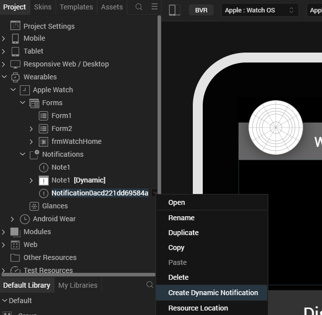

> **_Note:_** Each static notification in your app can have at most one dynamic notification associated with it.

##### Adding Glances to the Sample Watch App

Every application must have one (and only one) glance form. The glance form itself has an upper and a lower group of user interface controls. To customize the controls, you simply drag user interface objects into the target group. Because glances are not actionable, none of the actionable user interface objects, such as button and segment objects, can be put on a glance form.

##### Building the Sample Watch App

When you have finished adding widgets, actions, code snippets, and code modules to your app, you can build it by selecting **Product** from the Volt MX Iris main menu. Next, click **Build**. The Volt MX Iris **Build Generation** dialog box appears. In this dialog box, you must check **iOS** to build your Watch app's parent iOS app. You must also check **Apple Watch** to build your Watch app.

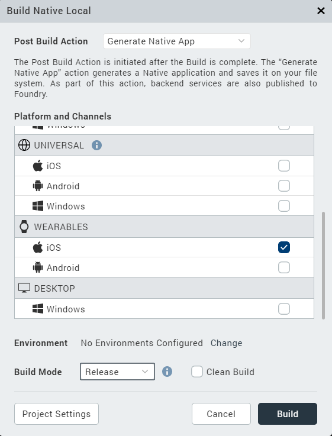

If the app builds correctly, Volt MX Iris outputs a .KAR file. The .KAR file contains the storyboards for your app, the code for the actions and other event handlers, and any code that you added in custom Swift modules.

To compile, debug, and run your app, you must next extract the .KAR file and load it into Xcode,With your app in Xcode, you are ready to compile and debug it. If you make changes to you app's code in Xcode, it is recommend that you copy the changes back into the code editor in Volt MX Iris.

Internationalizing Watch Applications
-------------------------------------

Apps for Volt MX Wearables can be customized for international use. In particular, you can define different strings that your app can use in its user interface for different locales. There are two ways to do this. First, you can define locale strings using Volt MX Iris. Second, you can add them to your app programmatically.

To define locale strings in Volt MX Iris, use the following steps.

1.  Select **Edit** from the main menu, and then choose **Internationlization(i18n)**, as shown in the figure below.
    
    
    
2.  In the dialog box that appears, enter the keys for the text you want to localize, as shown in the following figure. Use the plus symbol at the right of the dialog box to select the languages that you want to localize for. For each language that you add, enter the localized string. Click Finish. The **Configure Internationalization** dialog box closes.
    
    
    
3.  Select the widget whose UI text you want to localize.
4.  In the **Properties** pane, select the key you create in step 2.
    
    
    
    For example, if you created a key called sKey, selected the locales, and entered the localized strings in step 2, you would then select a widget as instructed in step 3. The **Properties** pane for the label widget would look similar to the figure above. You would next select the key sKey in the **Text i18n Key** field. The result would be that, instead of the string "Label" being used for the Label widget's label when you app runs, your app would automatically use the localized strings if the app was being on a device is set to one of the locales you chose in step 2. -->
