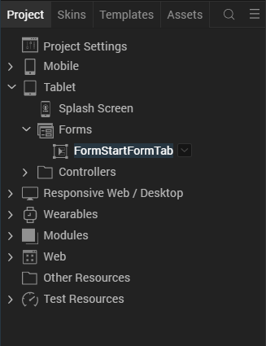
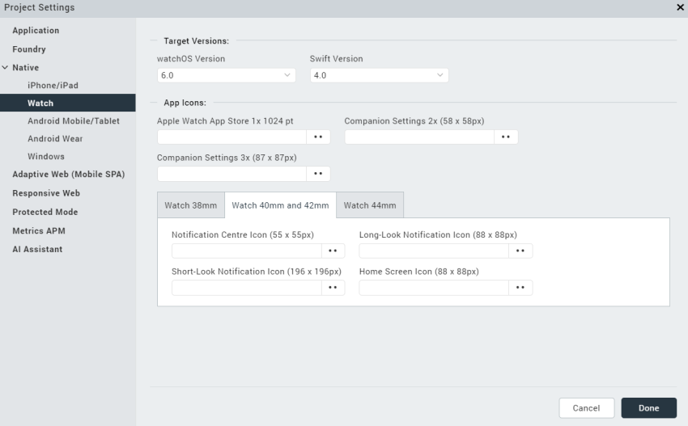

                           

Importing Projects from Volt MX Studio 6.5
=======================================

Apple Watch apps developed with Volt MX Studio 6.5 can be imported into the current version of Volt MX Iris.

If your Apple Watch app was developed under Volt MX Studio 6.5, it was targeted at Apple's Watch OS1. However, Apple now requires apps in the App Store to be targeted to Watch OS2. To do this, you should import your project from Volt MX Studio 6.5 into Volt MX Iris 7.0 or later. Your app does not have to take advantage of the new features offered in Watch OS2 and Volt MX Iris 7.0. If that's the case with your app, then importing your project is straightforward. You just need to ensure that you have enabled the Watch app in your Volt MX Studio 6.5 project before you import it into Volt MX Iris 7.0. You can continue to use Xcode and Objective-C as you did before.

If, on the other hand, you want to use the Watch OS2 and Volt MX Iris 7.0 features in you app, you will need to use Volt MX Iris 7.0 or later to design the user interface of your app and add its application logic. The application logic must be rewritten in Swift, rather than Objective-C. Once you make this conversion, you can access all of the new features available for your use.

Whether you use the newer features or not, you should check to ensure that the **Watch Compatibility Mode** in the **Project Settings** dialog box. To do so, use the procedure below.

1.  From Volt MX Iris **Project** pane, which is shown in the following illustration, click **Project Settings**.
    
    
    
2.  When the **Project Settings** dialog box appears, select the **Native** tab.
3.  Click the **iPhone/iPad/Watch** tab.

If there is no check mark in the **Watch Compatibility Mode** checkbox, click it to make one appear.

<table style="margin-left: 0;margin-right: auto;" data-mc-conditions="Default.HTML5 Only"><colgroup><col style="width: 41px;"> <col> <col></colgroup><tbody><tr><td>Rev</td><td>Author</td><td>Edits</td></tr><tr><td>7.0.3</td><td>DC</td><td>&nbsp;</td></tr></tbody></table>
