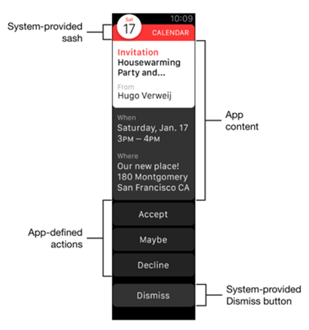

                           

iOS WatchKit Application Architecture
=====================================

A watch application in Volt MX needs three basic components:

1.	An iOS app that you create with Volt MX Iris and runs on an iPhone.
2.	A WatchKit Extension process that executes the watch app's application logic. This is bundled with your Watch app and runs on the Apple Watch.
3.	An Apple Watch app that displays user interface elements and handles navigation.

These three components are illustrated in the following diagram.

Apple Watch apps created in Volt MX Iris require an iOS app for launching. The services a watch app performs should be short tasks that quickly deliver information or require quick, minimal interactions. Longer-running tasks should be moved to the paired iOS app that runs on the user's iOS device and communicates with the Apple Watch app via Bluetooth.  

Every Apple Watch app has a WatchKit Extension built into it that contains the app's custom logic. The custom logic in the WatchKit Extension is written in Swift and Objective-C. The Apple Watch app and the WatchKit Extension work together to start your app’s interface. When you interact with your app on an Apple Watch, the Apple Watch app chooses the appropriate scene from your Apple Watch app's storyboards to handle the interaction.

Apple Watch Apps and Volt MX Iris
-----------------------------------

When you create Apple Watch apps with Volt MX Iris, you build your app's user interface using Iris's interactive environment and tools. To add code, you can add Swift modules or use the Volt MX Iris code editor to write Swift code. You can also use the Action Editor to add low-code actions on V9 Servicepack 5 Fixpack 15 or later.

WatchKit App Life Cycle
-------------------------

You can launch your app and interact with notifications using a custom UI. Some interactions launch your Apple Watch app and the embedded WatchKit Extension. The Watch app and WatchKit Extension pass information back and forth until you stop interacting with your app. watchOS then suspends the extension until the next user interaction.

For more information on Apple Watch app architecture, [please see the Apple documentation](https://developer.apple.com/library/ios/documentation/General/Conceptual/WatchKitProgrammingGuide/DesigningaWatchKitApp.md).

Guidelines for Creating Wearables App
-------------------------------------

To create a Wearables app for the Apple Watch, use the  [Apple guidelines](https://developer.apple.com/library/ios/documentation/General/Conceptual/WatchKitProgrammingGuide/iOSSupport.md#//apple_ref/doc/uid/TP40014969-CH21-SW1).

Guidelines for Creating a Wearables App's UI
--------------------------------------------

You must follow certain guidelines when you create a UI for an Apple Watch app. The following are a few key elements for designing an Apple Watch app:

**Designing a Watch**: An Apple Watch comes in seven sizes  —  38mm, 40mm, 41mm, 42mm, 44mm, 45mm, and 49mm. Volt MX Iris currently supports viewing all seven of these sizes in the Iris Canvas. The watch features a retina display, and you must provide images at double the resolution. You need not provide different sized images (although you can), or design two different layouts because Apple uses relative sizing and spacing options so images and objects resize to fill the available space.

**App Anatomy**: An Apple Watch app supports hierarchical and paginated navigation methods.

**Glances (Deprecated)**: Glances are used to display timely and contextual information from the iOS app. Glances are accessed by swiping upward and then swiping through horizontally. A glance is read-only and will not allow you to work in your app directly. When you tap a glance, the corresponding watch app is launched.

**Notifications**: The watch app supports local and remote notifications. The two stages of notifications are short look and long look. When you receive a notification, the short-look notification appears. You can add user actions, graphics, and content to notifications.

For more information, refer to the respective links:

  
| Design Elements | iOS |
| --- | --- |
| Designing for the Watch | [Click here](https://developer.apple.com/design/human-interface-guidelines/designing-for-watchos) |
| App Anatomy | [Click here](https://developer.apple.com/documentation/watchkit/storyboard_support/building_watchos_app_interfaces_using_the_storyboard/navigating_between_scenes?language=objc) |
| Notifications | [Click here](https://developer.apple.com/design/human-interface-guidelines/notifications) |

User Interactions With a Watch App and the Associated Workflow
--------------------------------------------------------------

*   Interacting with glances(deprecated): Glances can only be tapped. On tapping the glance, the associated watch app will open.
*   Interacting with notifications: You can interact with notifications by tapping on actions. Actions can be configured to execute the business logic in the foreground or the background. The foreground mode opens the watch application and the background mode executes the business logic in the phone app.
*   Interacting with user interface objects in an Apple Watch app: The business logic is executed in the WatchKit Extension.

Guidelines for Executing Business Logic in the Phone Background
---------------------------------------------------------------

When you do not use an app for a certain length of time, the system moves the app to the background state. You need to follow the Apple [guidelines](https://developer.apple.com/library/ios/documentation/iPhone/Conceptual/iPhoneOSProgrammingGuide/BackgroundExecution/BackgroundExecution.md#//apple_ref/doc/uid/TP40007072-CH4-SW8) to make your app responsive when it is in the background.

Glance (Deprecated)
-------------------

A glance quickly conveys information. Unlike notifications, glances do not have any buttons and are non-interactive. The glance may not be needed for all applications.

Glances are initialized early so that the glance is displayed quickly to the user. 

Notifications
-------------

Apple Watch apps support both local notifications and remote notifications. Remote notifications, which originate on a server and are transmitted over the internet to the watch, are also known as push notifications. For more information on notifications, refer to the following links:

*   [Notifications](https://developer.apple.com/documentation/watchos-apps/notifications/)
*   [Testing your notifications](https://developer.apple.com/documentation/watchos-apps/testing-custom-notification-interfaces/)
*   [Notification guidelines](https://developer.apple.com/design/human-interface-guidelines/notifications)

The code that reacts to and handles notifications, like all of the custom code in your Watch app, resides in the WatchKit Extension and must be written in Swift. As a result, if your Wearables app needs to register for notifications, it uses the normal processes that all Apple Watch apps use. These are well documented in the list of links given above.

When your app shows notifications, it first displays a short look notification form. If the user continues to look at the notification, then your watch app switches to a long look notification form.

A short look notification form contains your app's icon, the app's name, and a string that presents the title of the notification, as shown in the following illustration.

A long look notification form presents more detailed information, as you can see in the figure below.

The long look notification form contains a sash that is provided by the system. Next is the app's notification content. Your app may define specific action buttons that send action messages back to the iOS app that is paired with your Apple Watch app. Finally, the system provides a Dismiss button.

The long look notification form supports two types of interfaces: static and dynamic.

Static notification forms must follow these rules:

*   All images must be in the app's bundle.
*   The interface cannot include controls, tables, maps, or other interactive elements.
*   The interface’s notificationAlertLabel outlet must be connected to a label. The label’s contents are set to the notification’s alert message. The text for all other labels cannot change.

Dynamic notification forms enable you to customize the way your watch app displays a notification's content. The following illustration shows the difference between a static and a dynamic notification form.

In this example, the static form uses a simple presentation with static labels. The dynamic interface presents more detailed information in a customized form.
