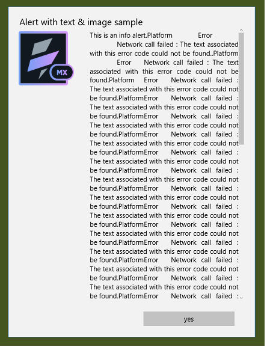
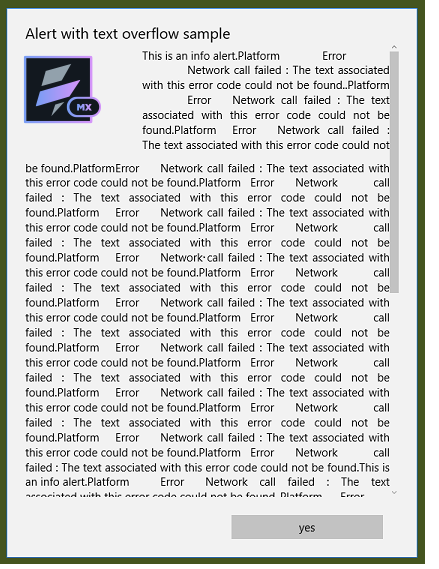

                                 


Alert Properties
================

The properties of the Alert widget are:

* * *


<details close markdown="block"><summary>accessibilityConfig Property</summary>

* * *

Enables you to control accessibility behavior and alternative text for the widget.

For more information on using accessibility features in your app, see the [Accessibility](../../../Iris/app_design_dev/Content/Accessibility_Overview.md) appendix in the VoltMX IrisUser Guide.

### Syntax
```

accessibilityConfig
```

### Type

Object

### Read/Write

Read + Write

### Remarks

*   The accessibilityConfig property is enabled for all the widgets which are supported under the Flex Layout.

> **_Note:_** From VoltMX Iris V9 SP2 GA version, you can provide i18n keys as values to all the attributes used inside the `accessibilityConfig` property. Values provided in the i18n keys take precedence over values provided in `a11yLabel`, `a11yValue`, and `a11yHint` fields.

The accessibilityConfig property is a JavaScript object which can contain the following key-value pairs.

  
| Key | Type | Description | ARIA Equivalent |
| --- | --- | --- | --- |
| a11yIndex | Integer with no floating or decimal number. | This is an optional parameter. Specifies the order in which the widgets are focused on a screen. | For all widgets, this parameter maps to the `aria-index`, `index`, or `taborder` properties. |
| a11yLabel | String | This is an optional parameter. Specifies alternate text to identify the widget. Generally the label should be the text that is displayed on the screen. | For all widgets, this parameter maps to the `aria-labelledby` property of ARIA in HTML. > **_Note:_** For the Image widget, this parameter maps to the **alt** attribute of ARIA in HTML. |
| a11yValue | String | This is an optional parameter. Specifies the descriptive text that explains the action associated with the widget. On the Android platform, the text specified for a11yValue is prefixed to the a11yHint. | This parameter is similar to the a11yLabel parameter. If the a11yValue is defined, the value of a11yValue is appended to the value of a11yLabel. These values are separated by a space. |
| a11yHint | String | This is an optional parameter. Specifies the descriptive text that explains the action associated with the widget. On the Android platform, the text specified for a11yValue is prefixed to the a11yHint. | For all widgets, this parameter maps to the `aria-describedby` property of ARIA in HTML. |
| a11yHidden | Boolean | This is an optional parameter. Specifies if the widget should be ignored by assistive technology. The default option is set to _false_. This option is supported on iOS 5.0 and above, Android 4.1 and above, and SPA | For all widgets, this parameter maps to the `aria-hidden` property of ARIA in HTML. |
| a11yARIA | Object | This is an optional parameter. For each widget, the key and value provided in this object are added as the attribute and value of the HTML tags respectively. Any values provided for attributes such as `aria-labelledby` and `aria-describedby` using this attribute, takes precedence over values given in `a11yLabel` and `a11yHint` fields. When a widget is provided with the following key value pair or attribute using the a11yARIA object, the tabIndex of the widget is automatically appended as zero.`{"role": "main"}``aria-label` | This parameter is only available on the Desktop Web platform. |

### Android limitations

*   If the results of the concatenation of a11y fields result in an empty string, then `accessibilityConfig` is ignored and the text that is on widget is read out.
*   The soft keypad does not gain accessibility focus during the right/left swipe gesture when the keypad appears.

### SPA/Desktop Web limitations

*   When `accessibilityConfig` property is configured for any widget, the `tabIndex` attribute is added automatically to the `accessibilityConfig` property.
*   The behavior of accessibility depends on the Web browser, Web browser version, Voice Over Assistant, and Voice Over Assistant version.
*   Currently SPA/Desktop web applications support only a few ARIA tags. To achieve more accessibility features, use the attribute a11yARIA. The corresponding tags will be added to the DOM as per these configurations.

### Example 1

This example uses the button widget, but the principle remains the same for all widgets that have an accessibilityConfig property.

```

//This is a generic property that is applicable for various widgets.
//Here, we have shown how to use the accessibilityConfig Property for button widget.
/*You need to make a corresponding use of the accessibilityConfig property for other applicable widgets.*/

Form1.myButton.accessibilityConfig = {
    "a11yLabel": "Label",
    "a11yValue": "Value",
    "a11yHint": "Hint"    
};
```

### Example 2

This example uses the button widget to implement internationalization in `accessibilityConfig` property, but the principle remains the same for all widgets.

```

/*Sample code to implement internationalization in accessibilityConfig property in Native platform.*/

Form1.myButton.accessibilityConfig = {
    "a11yLabel": voltmx.i18n.getLocalizedString("key1")     
};  
/*Sample code to implement internationalization in accessibilityConfig property in Desktop Web platform.*/

Form1.myButton.accessibilityConfig = {
    "a11yLabel": "voltmx.i18n.getLocalizedString(\"key3\")"
};
```

### Platform Availability

*   Available in the IDE
*   iOS, Android, SPA, and Desktop Web

* * *

</details>
<details close markdown="block"><summary>alertIcon Property</summary>

* * *

Specifies the Icon to be displayed to visually indicate the type of alert.

### Syntax
```

alertIcon
```

### Type

String

### Read/Write

No

### Remarks

In Android platform, the alert icon can be either a string specifying a local resource, or an image object created using the API: voltmx.image.

In iOS platform, you can provide the alert icon only as a string. iOS platform does not support the use of the image object.

### Examples

Using a local resource for the alert icon:

```

//Creating the alert with the alertIcon:"icon.png"
var alertBasic = {
    message: "Sample Alert",
    alertIcon: "icon.png"
};
//The icon.png should be available in resources folder.
var alertPSP = {};

var alert = voltmx.ui.Alert(alertBasic, alertPSP);
```

Using an image object:

```

//Creating the alert with an image object
imgObjRef = voltmx.image.createImage("local.png");
pspConfig = {};
var alert = voltmx.ui.Alert({
    "message": "Alert text",
    "alertType": constants.ALERT_TYPE_INFO,
    "alertTitle": "Alert Title",
    "yesLabel": "Yes",
    "noLabel": "",
    "alertIcon": imgObjRef,
    "alertHandler": null
}, pspConfig);
```

### Platform Availability

*   Available in the IDE
*   iOS (does not support the image object)
*   Android
*   Windows

* * *

</details>
<details close markdown="block"><summary>alertTitle Property</summary>

* * *

Specifies the Title of the alert.

### Syntax
```

alertTitle
```

### Type

String

### Accessible from Code

No

### Example

```

//Creating the alert with the alertTitle:"Confirmation"
var alertBasic = {
    message: "Sample Alert",
    alertTitle: "Confirmation"
};

var alertPSP = {};

var alert = voltmx.ui.Alert(alertBasic, alertPSP);
```

### Accessible from IDE

Yes

### Platform Availability

Available on all platforms

* * *

</details>
<details close markdown="block"><summary>alertType Property</summary>

* * *

Specifies the Type of the alert window to be displayed. You can select one of the following:

*   Confirmation - This type is used when you want the user to verify or accept something. For example, In this type, the user has to click either "OK" or "Cancel" buttons to proceed or exit.
*   error - This type is used to display when user enters incorrect value. For example, username or password in a login screen.
*   info (Default)- This type is used to display some information to the user.

Use the below constants to display alert type using constructor:

*   ALERT\_TYPE\_CONFIRMATION
*   ALERT\_TYPE\_ERROR
*   ALERT\_TYPE\_INFO (Default)

### Syntax
```

alertType
```

### Type

Number

### Accessible from Code

No

### Example

```

//Creating the alert with the alertType:constants.ALERT_TYPE_CONFIRMATION
var alertBasic = {
    message: "Sample Alert",
    alertType: constants.ALERT_TYPE_CONFIRMATION
};

var alertPSP = {};

var alert = voltmx.ui.Alert(alertBasic, alertPSP);
```

### Accessible from IDE

Yes

### Platform Availability

Available on all platforms

* * *

</details>
<details close markdown="block"><summary>cursorType Property</summary>

* * *

In Desktop Web applications, when you hover the mouse over any widget, a mouse pointer appears. Using the cursorType property in Iris, you can specify the type of the mouse pointer.

### Syntax
```

cursorType
```

### Type

String.

You must provide valid CSS cursor value such as wait, grab, help, etc. to the cursorType property.

### Read/Write

Read + Write

### Remarks

To add the `cursorType` property using VoltMX Iris in a Desktop Web application, follow these steps.

1.  In VoltMX Iris, open the Desktop Web application. From the **Project** explorer, expand **Responsive Web/ Desktop**\> **Forms** and select the form to which you need to make the changes.
2.  On the canvas, select the widget for which you want to specify the cursor type. For example, button.
3.  From the **Properties** panel, navigate to the **Skin** tab > **Hover Skin** tab.  
    You will find that the details of the hover skin is not enabled here.
4.  Check the **Enable** option to add a hover skin to your widget.  
    The details and configurations of the hover skin is enabled.
5.  Under the **General** section, for the Platform option, click the ellipsis icon.  
    The **Fork Skin** window appears.
6.  In the **Fork Skin** window, for **Desktop**, check under **HTML5 SPA**.
7.  Click **Ok**. You have successfully forked your hover skin for Desktop Web application.  
    You can see that the **Cursor Type** property has been added under the **General** section.
8.  Select a value from the drop-down list to set the **Cursor Type** for the widget.

### Example

```

//This is a generic property and is applicable for many widgets.  
  
/*The example provided is for the Button widget. Make the required changes in the example while using other widgets.*/
  
frmButton.myButton.cursorType = "wait";

```

### Platform Availability

*   Available in IDE
*   Desktop Web

* * *

</details>
<details close markdown="block"><summary>message Property</summary>

* * *

Specifies the message description of the alert to be displayed.

### Syntax
```

message
```

### Type

String

### Accessible from Code

No

### Example

```

//Creating the alert with the message:"Sample Alert"
var alertBasic = {
    message: "Sample Alert"
};

var alertPSP = {};

var alert = voltmx.ui.Alert(alertBasic, alertPSP);
```

### Accessible from IDE

Yes

### Platform Availability

Available on all platforms

* * *

</details>
<details close markdown="block"><summary>noLabel Property</summary>

* * *

Specifies the descriptive Text for the "**No**" label.

### Syntax
```

noLabel
```

### Type

String

### Accessible from Code

No

### Example

```

//Creating the alert with the noLabel:"No"
var alertBasic = {
    message: "Sample Alert",
    alertType: constants.ALERT_TYPE_CONFIRMATION,
    noLabel: "No"
};

var alertPSP = {};

```

### Accessible from IDE
Yes

### Platform Availability
Available on all platforms

* * *

</details>
<details close markdown="block"><summary>retainContentAlignment Property</summary>

* * *

This property is used to retain the content alignment property value, as it was defined.

> **_Note:_** Locale-level configurations take priority when invalid values are given to this property, or if it is not defined.

The mirroring widget layout properties should be defined as follows.

```

function getIsFlexPositionalShouldMirror(widgetRetainFlexPositionPropertiesValue) {
    return (isI18nLayoutConfigEnabled &&
    localeLayoutConfig[defaultLocale]
    ["mirrorFlexPositionalProperties"] == true &&
    !widgetRetainFlexPositionPropertiesValue);
}
```

The following table illustrates how widgets consider Local flag and Widget flag values.

  
| Properties | Local Flag Value | Widget Flag Value | Action |
| --- | --- | --- | --- |
| Mirror/retain FlexPositionProperties | true | true | Use the designed layout from widget for all locales. Widget layout overrides everything else. |
| Mirror/retain FlexPositionProperties | true | false | Use Mirror FlexPositionProperties since locale-level Mirror is true. |
| Mirror/retain FlexPositionProperties | true | not specified | Use Mirror FlexPositionProperties since locale-level Mirror is true. |
| Mirror/retain FlexPositionProperties | false | true | Use the designed layout from widget for all locales. Widget layout overrides everything else. |
| Mirror/retain FlexPositionProperties | false | false | Use the Design/Model-specific default layout. |
| Mirror/retain FlexPositionProperties | false | not specified | Use the Design/Model-specific default layout. |
| Mirror/retain FlexPositionProperties | not specified | true | Use the designed layout from widget for all locales. Widget layout overrides everything else. |
| Mirror/retain FlexPositionProperties | not specified | false | Use the Design/Model-specific default layout. |
| Mirror/retain FlexPositionProperties | not specified | not specified | Use the Design/Model-specific default layout. |

### Syntax
```

retainContentAlignment
```

### Type

Boolean

### Read/Write

No (only during widget-construction time)

### Example

```

//This is a generic property that is applicable for various widgets.
//Here, we have shown how to use the retainContentAlignment property for Button widget.
/*You need to make a corresponding use of the 
retainContentAlignment property for other applicable widgets.*/
var btn = new voltmx.ui.Button({
    "focusSkin": "defBtnFocus",
    "height": "50dp",
    "id": "myButton",
    "isVisible": true,
    "left": "0dp",
    "skin": "defBtnNormal",
    "text": "text always from top left",
    "top": "0dp",
    "width": "260dp",
    "zIndex": 1
}, {
    "contentAlignment": constants.CONTENT_ALIGN_TOP_LEFT,
    "displayText": true,
    "padding": [0, 0, 0, 0],
    "paddingInPixel": false,
    "retainFlexPositionProperties": false,
    "retainContentAlignment": true
}, {});
```

### Platform Availability

*   Available in IDE
*   Windows, iOS, Android, and SPA

* * *

</details>
<details close markdown="block"><summary>retainFlexPositionProperties Property</summary>

* * *

This property is used to retain flex positional property values as they were defined. The flex positional properties are left, right, and padding.

> **_Note:_** Locale-level configurations take priority when invalid values are given to this property, or if it is not defined.

The mirroring widget layout properties should be defined as follows.

```

function getIsFlexPositionalShouldMirror(widgetRetainFlexPositionPropertiesValue) {
    return (isI18nLayoutConfigEnabled &&
    localeLayoutConfig[defaultLocale]
    ["mirrorFlexPositionalProperties"] == true &&
    !widgetRetainFlexPositionPropertiesValue);
}
```

The following table illustrates how widgets consider Local flag and Widget flag values.

  
| Properties | Local Flag Value | Widget Flag Value | Action |
| --- | --- | --- | --- |
| Mirror/retain FlexPositionProperties | true | true | Use the designed layout from widget for all locales. Widget layout overrides everything else. |
| Mirror/retain FlexPositionProperties | true | false | Use Mirror FlexPositionProperties since locale-level Mirror is true. |
| Mirror/retain FlexPositionProperties | true | not specified | Use Mirror FlexPositionProperties since locale-level Mirror is true. |
| Mirror/retain FlexPositionProperties | false | true | Use the designed layout from widget for all locales. Widget layout overrides everything else. |
| Mirror/retain FlexPositionProperties | false | false | Use the Design/Model-specific default layout. |
| Mirror/retain FlexPositionProperties | false | not specified | Use the Design/Model-specific default layout. |
| Mirror/retain FlexPositionProperties | not specified | true | Use the designed layout from widget for all locales. Widget layout overrides everything else. |
| Mirror/retain FlexPositionProperties | not specified | false | Use the Design/Model-specific default layout. |
| Mirror/retain FlexPositionProperties | not specified | not specified | Use the Design/Model-specific default layout. |

### Syntax
```

retainFlexPositionProperties
```
### Type

Boolean

### Read/Write

No (only during widget-construction time)

### Example

```

//This is a generic property that is applicable for various widgets.
//Here, we have shown how to use the retainFlexPositionProperties property for Button widget.
/*You need to make a corresponding use of the 
retainFlexPositionProperties property for other applicable widgets.*/
var btn = new voltmx.ui.Button({
    "focusSkin": "defBtnFocus",
    "height": "50dp",
    "id": "myButton",
    "isVisible": true,
    "left": "0dp",
    "skin": "defBtnNormal",
    "text": "always left",
    "top": "0dp",
    "width": "260dp",
    "zIndex": 1
}, {
    "contentAlignment": constants.CONTENT_ALIGN_CENTER,
    "displayText": true,
    "padding": [0, 0, 0, 0],
    "paddingInPixel": false,
    "retainFlexPositionProperties": true,
    "retainContentAlignment": false
}, {});
```

### Platform Availability

*   Available in IDE
*   Windows, iOS, Android, and SPA

* * *

</details>
<details close markdown="block"><summary>retainFlowHorizontalAlignment Property</summary>

* * *

This property is used to convert Flow Horizontal Left to Flow Horizontal Right.

> **_Note:_** Locale-level configurations take priority when invalid values are given to this property, or if it is not defined.

The mirroring widget layout properties should be defined as follows.

```

function getIsFlexPositionalShouldMirror(widgetRetainFlexPositionPropertiesValue) {
    return (isI18nLayoutConfigEnabled &&
    localeLayoutConfig[defaultLocale]
    ["mirrorFlexPositionalProperties"] == true &&
    !widgetRetainFlexPositionPropertiesValue);
}
```

The following table illustrates how widgets consider Local flag and Widget flag values.

  
| Properties | Local Flag Value | Widget Flag Value | Action |
| --- | --- | --- | --- |
| Mirror/retain FlexPositionProperties | true | true | Use the designed layout from widget for all locales. Widget layout overrides everything else. |
| Mirror/retain FlexPositionProperties | true | false | Use Mirror FlexPositionProperties since locale-level Mirror is true. |
| Mirror/retain FlexPositionProperties | true | not specified | Use Mirror FlexPositionProperties since locale-level Mirror is true. |
| Mirror/retain FlexPositionProperties | false | true | Use the designed layout from widget for all locales. Widget layout overrides everything else. |
| Mirror/retain FlexPositionProperties | false | false | Use the Design/Model-specific default layout. |
| Mirror/retain FlexPositionProperties | false | not specified | Use the Design/Model-specific default layout. |
| Mirror/retain FlexPositionProperties | not specified | true | Use the designed layout from widget for all locales. Widget layout overrides everything else. |
| Mirror/retain FlexPositionProperties | not specified | false | Use the Design/Model-specific default layout. |
| Mirror/retain FlexPositionProperties | not specified | not specified | Use the Design/Model-specific default layout. |

### Syntax
```

retainFlowHorizontalAlignment
```
### Type

Boolean

### Read/Write

No (only during widget-construction time)

### Example

```

//This is a generic property that is applicable for various widgets.
//Here, we have shown how to use the retainFlowHorizontalAlignment property for Button widget.
/*You need to make a corresponding use of the 
retainFlowHorizontalAlignment property for other applicable widgets. */
var btn = new voltmx.ui.Button({
 "focusSkin": "defBtnFocus",
 "height": "50dp",
 "id": "myButton",
 "isVisible": true,
 "left": "0dp",
 "skin": "defBtnNormal",
 "text": "always left",
 "top": "0dp",
 "width": "260dp",
 "zIndex": 1
}, {
 "contentAlignment": constants.CONTENT_ALIGN_CENTER,
 "displayText": true,
 "padding": [0, 0, 0, 0],
 "paddingInPixel": false,
 "retainFlexPositionProperties": true,
 "retainContentAlignment": false,
 "retainFlowHorizontalAlignment ": false
}, {});
```

### Platform Availability

*   Available in IDE
*   Windows, iOS, Android, and SPA

* * *

</details>
<details close markdown="block"><summary>textOverflow Property</summary>

* * *

Specifies whether text wrapping is enabled below the image when the text message is more than image height.

### Syntax

textOverflow

### Type

boolean

### Remarks

If this value is true, text wrapping is enabled. The default value is false.



Alert with text wrapping disabled.



Alert with text wrapping enabled.

### Example

```

  //Creating the alert with the textOverflow:true

var basicProperties = {
    message: "Sample ALert",
    textOverflow: true
};
var platformSpecificProperties = {};

var alert = voltmx.ui.Alert(basicProperties, platformSpecificProperties);
```

### Platform Availability

Windows

* * *

</details>
<details close markdown="block"><summary>yesLabel Property</summary>

* * *

Specifies the descriptive Text for the "**Yes**" label.

### Syntax
```

yesLabel
```

### Type

String

### Accessible from Code

No

### Example

```

//Creating the alert with the yesLabel:"Yes"
var alertBasic = {
    message: "Sample Alert",
    yesLabel: "Yes"
};

var alertPSP = {};

var alert = voltmx.ui.Alert(alertBasic, alertPSP);
```

### Accessible from IDE

Yes

### Platform Availability

Available on all platforms

* * *

