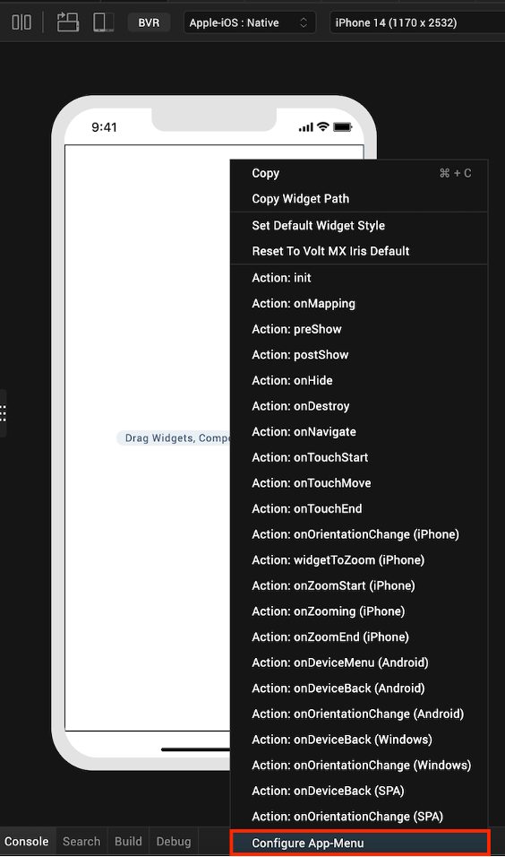
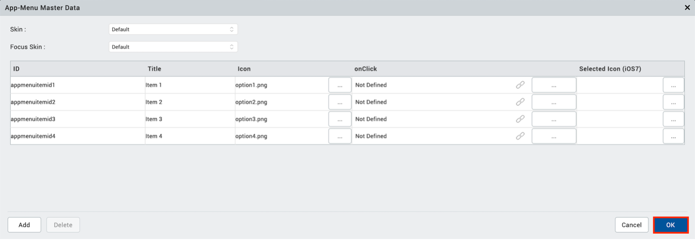
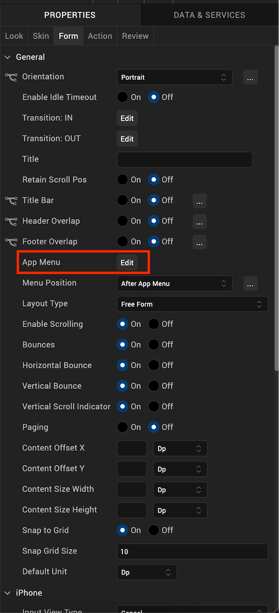
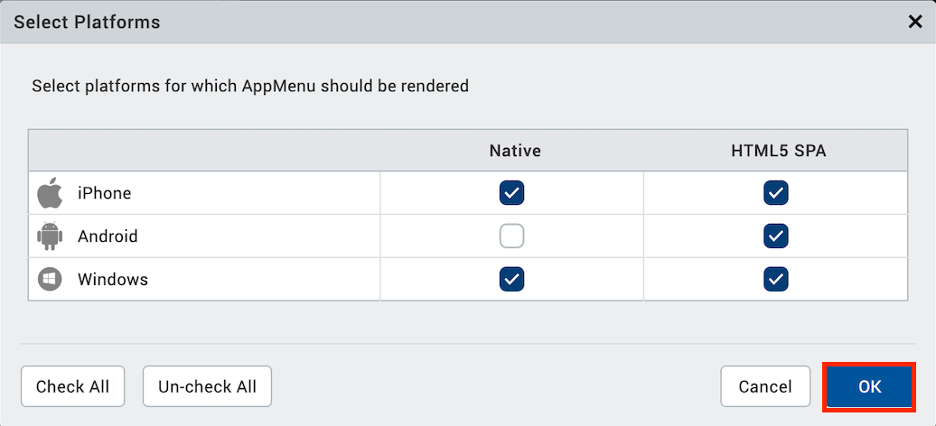
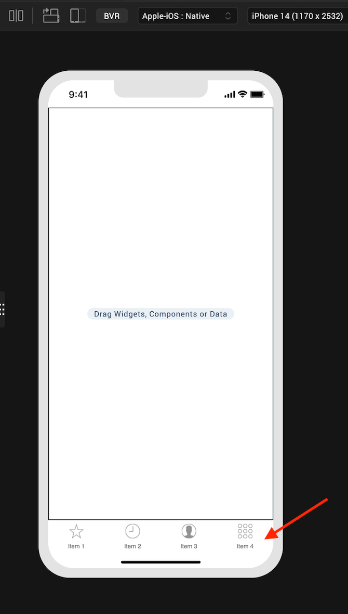

                                
# App Menu Widget ( Tab Bar )  

<!-- ### Tab Bar -->

### [Tab Bar](#app-menu-widget--tab-bar)

The _Application Menu_ _(App Menu)_ is a bar that is displayed at the bottom of an app, containing icons for features that apply to the application, rather than to a specific application screen or window.

Following are the real-time use cases of AppMenu widget:

*   In many banking applications, AppMenu widget is used for features such as Accounts, payments, transfers, atm locations, and services that must be available on every form of the application.
    
*   Some social media applications have a menu bar at the bottom, containing home, search, and profile icons.
    

The AppMenu widget capabilities can be broadly categorized into the following:

*   [UI Appearance](#ui-appearance)
*   [Data Management](#data-management)
*   [Internationalization](#internationalization)
*   [3D Touch](#3d-touch)
*   [User Input Handling](#user-input-handling)
*   [Animations](#animations)
*   [Miscellaneous](#miscellaneous)
*   [Enabling RTL](Alert.md#enabling-rtl)
*   [Configurations Common To All Widgets](#configurations-common-to-all-widgets)

#### UI Appearance

 

| Properties | Description |
| --- | --- |
| [Focus Skin](AppMenu_Properties.md#Focus) | Specifies the look and feel when there is focus on the App Menu. |
| [Skin](AppMenu_Properties.md#Skin) | Specifies the look and feel of the App Menu. |

 

#### Data Management

| Methods | Description |
| --- | --- |
| [addAppMenuItemAt](AppMenu_Methods.md#addAppMe) | Adds an App Menu item at the given index. |
| [createAppMenu](AppMenu_Methods.md#createAp) | Allows you to create App Menu dynamically through code. |
| [getAppMenuBadgeValue](AppMenu_Methods.md#getAppMe) | Enables you to read the badge value (if any) attached to the given Appmenu item. |
| [getCurrentAppMenu](AppMenu_Methods.md#getCurre) | Returns the unique identifier of the current app menu that is set through setCurrentAppMenu. |
| [removeAppMenuItemAt](AppMenu_Methods.md#removeAp) | Removes the specified App Menu item. |
| [setAppMenuBadgeValue](AppMenu_Methods.md#setAppMe) | Allows you to set a badge value to the given app menu item at the upper, right corner of the menu item. |
| [setAppMenuFocusByID](AppMenu_Methods.md#setAppMe2) | Takes ID (which is set using createAppMenu) instead of index and sets the focus on the menu item of the current app menu. |
| [setCurrentAppMenu](AppMenu_Methods.md#setCurre) | Uses the unique identifier which represents the App Menu and sets it as current app menu. |

  

#### Internationalization

| Properties | Description |
| --- | --- |
| [i18n Key](AppMenu_Properties.md#i18n) | Specifies the i18n Key to be used for internationalization. |

#### 3D Touch

| Methods | Description |
| --- | --- |
| [registerForPeekandPop](AppMenu_Methods.md#register) | Registers a widget to enable 3D Touch peek and pop gestures. |
| [setOnPeek](AppMenu_Methods.md#setOnPek) | Sets and overrides the existing onPeekCallback for the widget. |
| [setOnPop](AppMenu_Methods.md#setOnPop) | Overrides the existing onPopCallback for the widget. |
| [unregisterForPeekandPop](AppMenu_Methods.md#unregist) | Unregisters a widget from 3D Touch peek and pop gestures. |

#### User Input Handling

| Methods | Description |
| --- | --- |
| [addGestureRecognizer](AppMenu_Methods.md#addGestureRecognizer) | Allows you to set a gesture recognizer for a specified gesture for a specified widget. |
| [removeGestureRecognizer](AppMenu_Methods.md#removeGestureRecognizer) | Allows you to remove the specified gesture recognizer for the specified widget. |
| [setGestureRecognizer](AppMenu_Methods.md#setGestureRecognizer) | Allows you to set a gesture recognizer for a specified gesture for a specified widget. |

 

#### Animations

| Methods | Description |
| --- | --- |
| [Animate](AppMenu_Methods.md#animate_Method) | Applies an animation to the widget. |

#### Miscellaneous

| Methods | Description |
| --- | --- |
| [getBadge](AppMenu_Methods.md#getBadge) | Enables you to read the badge value (if any) attached to the specified widget. |
| [setBadge](AppMenu_Methods.md#setBadge) | Enables you to set the badge value to the given widget at the upper, right corner of the widget. |

 

| Properties | Description |
| --- | --- |
| [Appbar Button Style](AppMenu_Properties.md#Appbar) | Specifies the button style for application bar. |
| [Event](AppMenu_Properties.md#Event) | Specifies the event for the App Menu item. |
| [Icon](AppMenu_Properties.md#Icon) | Specifies the image to be displayed for the App Menu item. |
| [Position](AppMenu_Properties.md#Position) | Specifies the position of the button for application bar. |
| [Render](AppMenu_Properties.md#Render) | Specifies if the widget code must be included in the platform when the code is generated. |
| [Title](AppMenu_Properties.md#Title) | Specifies a general or descriptive text for App Menu. |

#### Enabling RTL

| Properties | Description |
| --- | --- |
| [retainContentAlignment](AppMenu_Properties.md#retainContentAlignment) | Helps to retain the content alignment of the widget while applying RTL. |
| [retainFlexPositionProperties](Alert_Basic_Properties.md#retainFlexPositionProperties) | Helps to retain the left, right and padding properties while applying RTL. |
| [retainFlowHorizontalAlignment](Alert_Basic_Properties.md#retainFlowHorizontalAlignment) | Enables you to change the horizontal flow of the widget from left to right. |

#### Configurations common to all widgets

| Methods | Description |
| --- | --- |
| [convertPointFromWidget](AppMenu_Methods.md#convertPointFromWidget) | Allows you to convert the coordinate system from a widget to a point (receiver's coordinate system). |
| [convertPointToWidget](AppMenu_Methods.md#convertPointToWidget) | Allows you to convert the coordinate system from a a point (receiver's coordinate system) to a widget. |
| [removeFromParent](AppMenu_Methods.md#removeFromParent) | Allows you to remove a child widget from a parent widget. |
| [setEnabled](AppMenu_Methods.md#setEnabled) | Specifies the widget that must be enabled or disabled. |
| [setFocus](AppMenu_Methods.md#setFocus) | Specifies the widget on which there must be focus. |
| [setVisibility](AppMenu_Methods.md#setVisibility) | Use this method to set the visibility of the widget. |

 

| Properties | Description |
| --- | --- |
| [ID](AppMenu_Properties.md#ID) | A unique identifier of App Menu consisting of alpha numeric characters. |  

AppMenu Widget Basics
---------------------  

### Enabling via Low Code

The AppMenu widget can be enabled via low code, but the approach is different than that of other low code widgets. To enable the AppMenu for a form, right click on the form and select “Configure App-Menu”. 

  

This will open the App-Menu Master Data editor. This editor allows you to add, delete, and update items, as well as change the Skin and Focus Skin. Update the master data with your desired data and select “OK” to apply any changes.

  

Now that the AppMenu is populated with data, it needs to be enabled to show on the form. In the form’s “PROPERTIES” window, select the “Edit” button beside “App Menu”.

  

Select all platforms on which you wish to display the AppMenu and select “OK” to apply changes.

  

The AppMenu will now appear for the selected platforms.  

  

### Android Specific Behavior

*   AppMenu is not supported for Android : Native.

### iOS Specific Behavior

*   In iOS 7 and iOS 7.1, AppMenu supports only single color. If the color is not specified, then by default native color ( transparent) is applied to iOS 7 and cyan color is applied to iOS7.1.

*   For Mobile, If you add more than five AppMenu items, the menu items beyond the fifth AppMenu item are grouped under the Menu item “More” (added automatically by the iOS platform) and if you select More, the rest of the Menu items are displayed in a list with the icons set for them.

*   For Tablet, If you add more than eight AppMenu items, the menu items beyond the eigth AppMenu item are grouped under the Menu item “More” (added automatically by the iOS platform) and if you select More, the rest of the Menu items are displayed in a list with the icons set for them.

*   Transition Animations are not supported when a flow of transitions from a form with AppMenu to a form without AppMenu.

### Mobile Web Specific Behavior  

*   For iOS : Web, Android : Web, and Windows : Web, if you add more than four App Menu items, the menu items beyond the fourth AppMenu item are grouped under the Menu item More and if you select More, the rest of the Menu items are displayed in a list without any icons (even if the icons are set through code).

