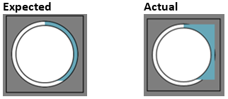

                               


Platform Specific Limitations
=============================

This section lists the limitations, properties or the widgets not supported by platforms.

iOS Limitations
---------------

Following are the limitations of iOS platform:

### Flex Layout

*   Touch events will not work for the part of the widget that is outside the parent’s boundaries when clipBounds property of the parent is set to false.
*   Dimensions of Switch and PickerView widgets are dictated by underlying SDK and might differ from the values specified through width and height properties.
*   Widget shadows won’t work as of now. Place the widget inside a FlexContainer and configure shadows for the FlexContainer instead. Also clipBounds property of the flex container should be set to false.
*   Scrolling events of FlexScrollContainer will not work if a scrollable widgets like SegmentedUI or Map with scrolling, in the same direction as FlexScrollContainer is present.
*   For contentSize property, both width and height must be specified. Otherwise it will lead into undefined behaviors.
*   Touch events will not work if the touch is started on the part of the widget, which is outside the parent’s boundaries when the clipBounds is false.
*   If two widgets are overlapping, then if the widget with higher zIndex has not registered for any touch/click events then below widget will not get the events even in the overlapped region.
*   Switch widget will have constant width and height.
*   Multiple, simultaneous innovations of the removeAt or removeSectionAt methods results in undefined behavior.

### Gesture Limitations Using Flex Layout

*   The events onTouchStart, onTouchEnd, and onTouchMove may not work or yield desired results when registered on scrollable widgets such as FlexScrollContainer, Map, SegmentedUI,TabPane, TextArea, and Browser. These widgets internally uses the lower level touch events to get the scrolling behavior and may conflict with the externally registered touch events. On other non scrollable widgets these lower level events get fired along with the existing events as per the widget behavior. For example, onClick on Button widget get fired along with touch events if touch events are registered with the Button.

Android Limitations
-------------------

Following are the limitations of Android platform:

### Flex Layout

*   If the height is given to a segment in the constructor itself, then groupCells property will not work for segment inside FlexContainer.
*   clipBounds property for Map and Browser widgets will not work during animation, because the rendering happens in native openGL using GPU.
*   zIndex property will not work for TabPane and DataGrid widgets.
*   Android OS native theme skinning comes with some transparent pixels in the background image. Due to which even if left and top are specified as zero (0) without applying any skin, you will observe some gap from the parent containers left and top for the below widgets:
    *   Button
    *   Check box
    *   Label
    *   Radio Group
    *   RichText
    *   Slider
    *   TextBox
    *   Camera
    *   Phone
*   Slider widget placed inside horizontal scroll container (FlexScrollContainer or ScrollBox), then you will not be able to slide because of double scrolling issue.
*   skin set to group widgets is applied to each individual item. Thus it appears as if the widget has not occupied the given height though it actually occupies. This can be verified by placing any other widget below it.
*   Whenever a Text-Area/Text-Box widget gets focus, Android OS tries to bring Text-Area/Text-Box into visible region. Bringing the widget into the visible region depends on the container scroll direction. That is, if the scroll direction is horizontal, the Text-Area/Text-Box is brought into visible region by scrolling in horizontal direction, similarly with vertical direction also.
    
    For instance, there is an HBox container widget with 150 percent width. An Image Widget is placed in this container widget, which occupies 80 percent of container’s width. A TextBox Widget is added in the container widget, beside the Image Widget. As the Image Widget occupies 80 percent of the container, the TextBox Widget goes beyond the screen width horizontally and is not visible. When this TextBox is in focus, Android OS brings the TextBox into visible region by scrolling in horizontal direction.
    
*   By default, TextBox/TextArea widget added to the Flex Form gets focus when this form gets rendered.
    
*   As the number of Flex containers with auto grow increase in a form, it will lead to poor performance in rendering the UI. In this case, the UI goes through a several measure cycles to arrive at the exact dimensions and positioning of a widget on the screen.
    
*   If you use a deep layout hierarchy, it leads to poor UI rendering. This is Android native behavior. Volt MX Iris recommends that you use a flat layout hierarchy.
    

### Gesture Limitations Using Flex Layout

*   onTouchStart, onTouchMove, and onTouchEnd events will not work on Map, Browser, and group widgets.
*   For contentSize property both width and height must be specified. Otherwise, it will lead into undefined behaviors.
*   Scroll container can be scrolled only till the end of the content and over scrolling is not possible. Thus, if the x and y values are given to setContentOffset exceed the actual scrollable content, then it will scroll only till the end of the content. For example, if the total content width is 150% and the content off set given to x is 100% then it will scroll only 50% to get the remaining content into the view port.
*   Touch events will not work for the part of the widget which is outside the parent’s boundaries when the clipBounds is false.
*   In devices with Android OS Version less than 4.2, zIndex is respected in drawing order only. But touch events are propagated in the order of widget indices present in the parent. Thus, even though a widget has a higher zIndex it will not receive touch events if it is not the last widget among the siblings.
*   If two widgets are overlapping, then if the wi22kdget with higher zIndex has not registered for any touch/click events then the widgets present below it, will get the events in the overlapped region also.
*   During horizontal scroll, if the direction is changed to vertical (in more than 45 Degrees) without raising the finger then the events will be consumed by any other widget in the parent hierarchy which can scroll vertically.
*   If the Form has enableScrolling as true, then if any child widgets registered for touch events or gestures, will not receive the desired events as the Form consumes events in vertical direction. But same will work in horizontal direction.
*   The events onTouchStart, onTouchEnd, and onTouchMove may not work or yield desired results when registered on scrollable widgets such as FlexScrollContainer, Map, SegmentedUI,TabPane, TextArea, and Browser. These widgets internally uses the lower level touch events to get the scrolling behavior and may conflict with the externally registered touch events. On other non scrollable widgets these lower level events get fired along with the existing events as per the widget behavior. For example, onClick on Button widget get fired along with touch events if touch events are registered with the Button.

Desktop Web Limitations
-----------------------

This section lists the properties that are not supported by the Desktop Web platform.

1.  ComboBox and ListBox, skin styles "Transparent" and "One Color" are supported in background color tab.
2.  ComboBox and ListBox, browser does not support if the properties defined in font tab and border are different for **skin** and **focusSkin**.
3.  On Firefox browser, TextBox and TextArea widgets does not support percentage (%) based padding, while other browsers does support.
4.  For all widgets in Internet Explorer 7 and 8, transparency ( border/font) is not supported for skin.
5.  On safari browser, ListBox and ComboBox widgets does not support padding.
6.  Rounded Corners will not work for all widgets in Internet Explorer 8 because of border-radius property is not supported in Internet Explorer 8 and its lower versions.
7.  Vertical split and Horizontal split will not work for all widgets in Internet Explorer 9 and its lower versions.
8.  For non-modal popups (isModal = false), popup transparency (transparencyBehindThePopup) property is not applied as the background widgets are accessible to the user.
9.  A valid calendar year selection range is from 1900 to 2099. If you select an year beyond the range shows an alert message (you can customize this error message).
10.  In Internet Explorer 8 and below browsers do not support all geolocation APIs.
11.  focusSkin applied to the container widgets ( like HBox, VBox, Segment ) is not inherited by the inner widgets in IE browsers (IE8, IE9, IE10). To overcome this apply focusSkin at every widget inside the container widget.
12.  For ScrollBox and TabPane widgets, angle background Multi Step Gradient is not supported.
13.  Desktop Web platform does not support browser (Internet Explorer 8 ) running in compatibility mode.
14.  Vertical gradient and Horizontal gradient are supported for all widgets in Internet Explorer 8 and above versions.
15.  Preview of map widget is not supported.
16.  On Internet Explorer browsers, focusSkin applied to the widgets CheckBox and RadioButton will work on click of text, but not on icon.
17.  For Browser widget, Desktop Web platform supports BROWSER\_REQUEST\_METHOD\_GET option only.
18.  Video widget in print API is not supported in Firefox browser.
19.  To apply focusSkin for dynamically created widgets or cloned widgets, assign focusSkin dynamically after adding the widget to the form hierarchy.
```
formid.widgetid.focusSkin = "skinname";
```
20.  To apply hoverSkin for dynamically created widgets or cloned widgets, assign hoverSkin dynamically after adding the widget to the form hierarchy.
```
formid.widgetid.hoverSkin = "skinname";
```
21.  In Desktop Web platform, only left, right, and center alignment options can be applied to the content. This limitation is applicable for all widgets.
    
22.  For Browser widget, resetting of URL does not work.
23.  In Desktop Web platform, nested containers in a non-percentage HBOX are not supported.

SPA Limitations
---------------

This section lists the properties that are not supported by the SPA platform.

*   focusSkin is not supported in Android devices.
*   For Horizontal Image strip, the stripview and slot view are not supported. If the images are of different size, It is mandatory to mention the width and height property. Else, the alignment of the images may get disturbed on the screen.
*   The property secureTextEntry for textarea is not supported in IE (desktop and mobile).
*   HBox position attribute is not supported in SPA (mobile and desktop). Instead use for header / footer to dock elements.
*   showLoadingScreen() should be preferred over blockedUI, as blockedUI cannot cater to multiple service calls which may be either chained or nested depending upon the application logic.
*   A valid calendar year selection range is from 1900 to 2099. If you select an year beyond the range shows an alert message (you can customize this error message).
*   On SPA (Windows devices) platform, focusSkin applied to the widgets Calendar, ListBox, and SegmentedUI is not inherited by the inner widgets in IE browsers (IE8, IE9, IE10). To overcome this apply focusSkin at every widget inside the container widget.
*   Preview of map widget is not supported.
*   On Windows device browsers, focusSkin applied to the widgets CheckBox and RadioButton will work on click of text, but not on icon.
*   For Browser widget, SPA platform supports BROWSER\_REQUEST\_METHOD\_GET option only.
*   On SPA platform, <script> tag is not supported.
*   To apply focusSkin for dynamically created or cloned widgets, assign focusSkin dynamically after adding the widget to the form hierarchy.
```
formid.widgetid.focusSkin = "skinname";
```
*   On SPA (iOS devices) platform, when accessibility is set for FlexContainer, the FlexContainer's child widgets will not be focused. Only the FlexContainer Widget will be focused.
*   In SPA platform, only left, right, and center alignment options can be applied to the content. This limitation is applicable for all widgets.
    
*   For Browser widget, resetting of URL does not work.
*   For a form, when data is updated using a service callBack through any external service or network callback, form forceLayout must be invoked.

### Flex Layout

*   Setting enableScrolling property to false on Flex scroll container will not retain the scroll position and vertical and horizontal offset will be reset to 0,0 respectively. But if API Level is 6000 then this will not reset to 0,0 respectively.  
    
*   onZoomStart, onZoomEnd, onZooming, and onDecelerationStarted are not supported in SPA.
*   zoomToRect and setZoomScale APIS are not supported in SPA.
*   doLayout is synchronous event in SPA unlike richclients.
*   In Windows SPA onScrolling events will be triggered with more gaps in touch points, because of this scrolling may not be smooth.
*   Though opacity is set to complete transparent, all events are consumed on the same widget and not the widget which is behind the original widget. Complete opaque doesn’t mean that events to pass through it.
*   Calling forceLayout() on a container triggers doLayout() on grandchild widgets which has a change in location or size but not on all grandchildren widgets.
*   When complex forms have to be designed, it is suggested to turn off visibility for the widgets which are outside the view port or not required widgets. Enable the visibility when required. This causes application to load faster.
*   Scroll events will not propagate in segmented UI, TabPane and other scrollable widgets which has containerHeight property set.
*   DataGrid height is not fixed in SPA, it goes by its content.
*   After text/data change in any widgets, widget dimension will get updated only after forceLayout() api on parent container or in next layout cycle.
*   In SPA, implicit forceLayout will not happen at the end of the closure, developer has to call forceLayout to get changes reflected.
*   Implicit forceLayout will happen in case of visibility change or changes in widget hierarchy (add/remove of widgets).
*   Scrolling events are not fired after the touch release till FlexScrollContainer is decelerating. onScrollEnd event will be fired only after deceleration is complete.
*   Shadow in focus skin for a widget will not work if widget is placed in FlexContainer or FlexScrollContainer.
*   When you set contentOffset that is less than containerWidth/containerHeight, then offset point will come to view port, but will not add any extra space to get the offset point to top right corner of container.

### Gesture Limitations Using Flex Layout

*   Gesture conflicts should be avoided in application code such as Scroll Container in another scroll container with same scroll direction enabled.
*   Touch events will not propagate in segmented UI, datagrid and other widgets which has containerHeight property set, as this will conflict with touch events to handle scroll in these widgets.
*   Pan, pinch & zoom are supported in iPhone SPA (IOS 7 and above) only, but not in other SPA platforms.
*   When both Tap and Double Tap gestures are set, both will trigger for each double tap. Tap is fired twice (one for each tap) on double tap.
*   It is not advised to assign both low level touch events and gestures (which may conflict with touch events) on same widget.
*   Map is not supposed to be kept in Scroll container since it might lead to gesture conflict.
*   onTouchMove event on any widget is executed asynchronously. If there is complex operations in onTouchMove event then drag may not be smooth.
*   addGestureRecognizer will add the event every time it is called hence same event may trigger several times if event is registered multiple times.
*   In SPA Windows long press event is not supported.
*   For Switch widget on safari browser will have constant width and height. In case of SPA Android and SPA Windows Switch will have constant height, but width may vary. Any additional width and height, which is more than required may leave the empty space on the right, bottom, and or left, top side of the switch widget.
*   The events onTouchStart, onTouchEnd, and onTouchMove may not work or yield desired results when registered on scrollable widgets such as FlexScrollContainer, Map, SegmentedUI,TabPane, TextArea, and Browser. These widgets internally uses the lower level touch events to get the scrolling behavior and may conflict with the externally registered touch events. On other non scrollable widgets these lower level events get fired along with the existing events as per the widget behavior. For example, onClick on Button widget get fired along with touch events if touch events are registered with the Button.

Windows Limitations
-------------------

This section lists the properties that are not supported by Windows platform.

*   The widgets Phone, PickerView, Switch, and Video are not supported.
*   Windows applications are not supported on Windows RT.
*   The application icon that is set from Application Properties > Common > Desktop icon size should be multiple of 8 pixel and less than 256 pixel. For example, the icon image should be 8x8 or 16x16 px, it should be not 16x17 px.
*   Windows platform does not support Segment Pageview.
*   The panning mode (touch) happens only when scrolling direction is in both horizontal and vertical. Because to this, the Scroll Indicators are enabled based on the scroll direction.

### Flex Layout

*   Setting the enableScrolling property to false on the FlexScrollContainer will not retain the scroll position. The vertical and horizontal offset will be reset to 0,0 respectively. This is an underlying OS limitation.
*   ScrollToWidget and ScrollToOffSet APIs will not work when enableScrolling is set to false or scrollDirection is set to None. This is an underlying OS limitation.
*   Setting the clipBounds property to false on flexcontainer with Free form layout may not work if flex container has borderwidth. It automatically clips.
*   convertPointFromWidget and convertPointToWidget APIs are not supposed to be called in doLayout of any widget since this might cause application hang due to thread conflicts.
*   OnScrolling event will be triggered with huge delays. Any UI updates in onScrolling may not yield smooth UI changes.
*   Calling forceLayout() on a container triggers doLayout() on grandchild widgets which has a change in location or size but not on all grandchildren widgets.
*   Though opacity is set to complete transparent, all events are consumed on the same widget and not the widget which is behind the original widget. Complete opaque doesn’t mean that events to pass through it.
*   Any widget goes out of Flex container which has clipBounds set to true, may appear with its text but not with skin. This is an OS limitation.
*   When complex forms have to be designed, it is suggested to turn off visibility for the widgets which are outside the view port or not required. Enable the visibility when required. This causes application to load faster.
*   Switch widget will have constant width and height.
*   Windows platform does not support FlexContainer's clipBounds property for Browser and Map Widgets.
*   Segment widget with autogrowMode is not supported inside the FlexContainer with autogrowMode.
*   If the scrolling direction for ScrollContainer is defined as both horizontal and vertical, the ContentOffset property is respected to both X and Y coordinates. If the scroll direction is defined as vertical, it is respected only to Y coordinate but not to X coordinate, and vice versa.
*   In Tablet with Windows platform, when Clip Bounds is enabled for a FlexContainer with corner radius, the area after the radius is not clipped. The child widget of the FlexContainer is still shown in rectangle shape.  
    
*   Animations are applied to all of the specified rows, even if the rows are not in the visible area whenever one of the following methods are called.
    *   addDataAt
        
    *   addAll
        
    *   addSectionAt
        
    *   removeAt
        
    *   removeAll
        
    *   removeSectionAt
        
    *   setDataAt
        
    *   setSectionAt
        
    *   SetData
        
*   When an animation is applied before a previous animation completes, the previous animation is canceled and the widget may not be updated.

### Gesture Limitations Using Flex Layout

*   Gesture conflicts should be avoided in application code such as Scroll Container in another scroll container with the same scroll direction enabled. For example, Slider, TabPane (Pivot and Panorama), Switch like scrollable widgets inside horizontal flex scroll container.
*   Touch events will not work on ScrollBox and Segmented UI (table view with scrolling enabled).
*   When both Tap and Double Tap gestures are set, both will trigger for each double tap. Tap is not ignored.
*   Do not assign low level touch events on clickable widgets to achieve click behavior.
*   Do not assign both low level touch events and gestures (which may conflict with touch events) on same widget.
*   Map and Browser widgets are not supposed to be kept in Scroll container as it may lead to gesture conflict. Any such gesture conflict may cause application rejection from Microsoft Store.
*   onTouchMove event on any widget is executed asynchronously. Because of this, drag may not be smooth.
*   AddgestureRecognizer will add the event every time it is called, hence same event may trigger several times if event is registered multiple times.
*   The events onTouchStart, onTouchEnd, and onTouchMove may not work or yield desired results when registered on scrollable widgets such as FlexScrollContainer, Map, SegmentedUI,TabPane, TextArea, and Browser. These widgets internally uses the lower level touch events to get the scrolling behavior and may conflict with the externally registered touch events. On other non scrollable widgets these lower level events get fired along with the existing events as per the widget behavior. For example, onClick on Button widget get fired along with touch events if touch events are registered with the Button.

