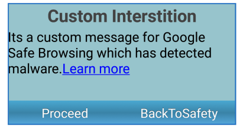

                                


Browser Events
==============

The Browser widget has the following events associated with it:

* * *


<details close markdown="block"><summary>doLayout Event</summary>

* * *

This event is invoked for every widget when the widget position and dimensions are computed.

### Syntax
```

doLayout()
```

### Read/Write

Read + Write

### Remarks

This event is invoked for all the widgets placed inside flex containers. This event is invoked in the order in which the widgets are added to the widget hierarchy and expect the frame property of the widget is calculated and available for use within this event.

This event is used to set the layout properties of child widgets in the relation to self and peer widgets whose layout is not yet performed.

The number of times this event invoked may vary per platform. It is not recommended to write business logic assuming that this function is invoked only once when there is a change in positional or dimensional properties. This event will not trigger when transformations are applied though widget is moved or scaled or rotated from its original location.

### Example

```

//Sample code to set doLayout event callback to a button widget.
/*This code changes the top property of button2 and makes it appear below button1.*/
myForm.button1.doLayout=doLayoutButton1;

function doLayoutButton1(){
      
    myForm.button2.top = myForm.button1.frame.height;
}
```

### Platform Availability

*   iOS
*   Android
*   Windows
*   SPA

* * *

</details>
<details close markdown="block"><summary>handleRequest Event</summary>

* * *

An event callback which gets invoked by the platform before browser widget navigates to a new URL.

### Syntax
```

handleRequest()
```

### Optional Parameters

eventobject

Optional. A unique Id that identifies the browser widget.

params

Optional. An object that identifies the url parameters as key-values pair.

Following are the parameters of the object.

> **_originalURL \[String\]_ - Optional**
> 
> Specifies the original url of the current page.
> 
> **q_ueryParams\[Object\]_ - Optional**
> 
> Specifies the dictionary containing the query parameters passed to the URL as key, values in the dictionary.
> 
> **_requestMethod\[String\]_ - Optional** - Supported only on iOS
> 
> Specifies the request method type. Following are the available options:
> 
> > *   Constants.BROWSER\_REQUEST\_METHOD\_GET
> > *   Constants.BROWSER\_REQUEST\_METHOD\_POST
> 
> **_header\[JSObject\]_ - Optional** - Supported only on iOS
> 
> Specifies a dictionary containing all the HTTP header fields.

### Read/Write

Write only

### Remarks

This is useful in scenarios where the developer wants to keep track of the URLs that the browser field navigates to. For example, in a payment flow (that is, being executed inside a browser widget) on successful redirection to a payment confirmation page the developer would like to take the user to a new native form.

On iOS platform, whenever handleRequest is set to browser and request comes to browser widget to load the url or.html, then before loading the content, handle request is called. Also, whenever a user selects any hyperlink then also handleRequest is called.

The return value from this function determines how the browser widget handles the original request. If a false value is returned, then the browser widget continues navigation to the original URL and if the true value is returned then the developer has to handle the request.

The handleRequest event is not triggered for the web pages that change the HTML content dynamically within the same page. For example, SPA apps.

The handleRequest event is not triggered for the bookmark navigation on the same page in the Android platform.

### Example

```

//The below function is the call back for handleRequest event
function handleRequestCallback(browserWidget, params) {
    voltmx.print("handleRequest event triggered");
    voltmx.print("Original URL" + params["originalURL"]);
    voltmx.print("Request Method" + params["requestMethod"]);
    voltmx.print("Header" + JSON.stringify(params["header"]));
    //Ignore this request and continue loading other URLs.
    return false;
    //If false is returned, platform will load the originalurl in the browser widget.
}

frmobj.brw1.handleRequest = handleRequestCallback
```

### Platform Availability

*   iPhone
*   iPad
*   Android
*   Windows

* * *

</details>
<details close markdown="block"><summary>onFailure Event</summary>

* * *

An event callback which gets invoked by the platform when the given URL fails to load. The behavior of this callback has changed in Iris 7.3 and may require changes to your code, particularly the addition of the errorObject parameter.

### Syntax
```

onFailure()
```

### Optional Parameters

eventObject

Required. A unique Id that identifies the browser widget.

errorObject

Required. An object that provides details for the error. See Remarks for possible values. This value is new in Iris 7.3.

### Read/Write

Read + Write

### Remarks

The errorObject is a dictionary object that has these predefined keys:

*   errorCode - the VoltMX error code
*   errorMessage – error message
*   errorDetails – platform specific error details
*   httpStatusCode - Actual HTTP status code. For iOS this will be set to -1.

All errors reported by this callback:

  
| Error Code | Error Message | Android | Windows | iOS |
| --- | --- | --- | --- | --- |
| 1000 | Unknown error while connecting. The platform cannot differentiate between network errors, The platform reports error code 1000 by default. | ERROR\_UNKNOWN | Unknown InternalServerError OperationCanceled UnexpectedClientError UnexpectedStatusCode | ErrorUnknown |
| 1001 | Cannot connect to host. | ERROR\_CONNECT ERROR\_HOST\_LOOKUP | CannotConnect, ConnectionAborted, ConnectionReset, Disconnected, ServiceUnavailable ServerUnreachable NotFound, HostNameNotResolved | ErrorCannotConnectToHost ErrorDNSLookupFailed ErrorCannotFindHost, ErrorRedirectToNonExistentLocation |
| 1002 | Input Stream Related Errors | ERROR\_IO |   | ErrorRequestBodyStreamExhausted |
| 1003 | Permission Related | ERROR\_AUTHENTICATION ERROR\_PROXY\_AUTHENTICATION ERROR\_UNSUPPORTED\_AUTH\_SCHEME | Unauthorized PaymentRequired UseProxy Forbidden ProxyAuthenticationRequired | ErrorUserAuthenticationRequired |
| 1004 | Invalid input url | ERROR\_BAD\_URL ERROR\_UNSUPPORTED\_SCHEME | RequestEntityTooLarge RequestUriTooLong | ErrorBadURL, ErrorUnsupportedURL |
| 1005 | Invalid method provided |   | MethodNotAllowed NotImplemented |   |
| 1006 | File Errors | ERROR\_FILE ERROR\_FILE\_NOT\_FOUND |   | ErrorFileDoesNotExist, ErrorFileIsDirectory, ErrorNoPermissionsToReadFile, ErrorDataLengthExceedsMaximum |
| 1007 | Device Connectivity related issues |   |   | ErrorNetworkConnectionLost, ErrorNotConnectedToInternet ErrorDataNotAllowed ErrorCallIsActive ErrorInternationalRoamingOff |
| 1008 | Request failed. |   | BadRequest Conflict ExpectationFailed PreconditionFailed |   |
| 1009 | Invalid Server Response |   | ErrorHttpInvalidServerResponse |   |
| 1010 | Request timed out. | ERROR\_TIMEOUT | RequestTimeout, Timeout |   |
| 1011 | User Canceled |   |   | ErrorBadServerResponse ErrorCannotParseResponse ErrorCannotDecodeRawData, ErrorCannotDecodeContentData ErrorBadServerResponse |
| 1012 | Redirection related Errors | ERROR\_REDIRECT\_LOOP | HttpsToHttpOnRedirection, HttpToHttpsOnRedirection, MovedPermanently RedirectFailed SeeOther TemporaryRedirect UnexpectedRedirection | ErrorHTTPTooManyRedirects |
| 1013 | Too many requests during this load | ERROR\_TOO\_MANY\_REQUESTS |   |   |
| 1014 | User canceled authentication |   |   | ErrorUserCancelledAuthentication |
| 1015 | App transport security requires secure connection |   |   | ErrorAppTransportSecurityRequiresSecureConnection |
| 1016 | Resource related Errors |   | Found Gone MultipleChoices NotModified RequestedRangeNotSatisfiable LengthRequired NotAcceptable UnsupportedMediaType | ErrorResourceUnavailable, ErrorZeroByteResource |
| 1018 | SSL related error | ERROR\_FAILED\_SSL\_HANDSHAKE | CertificateCommonNameIsIncorrect, CertificateContainsErrors, CertificateExpired, CertificateIsInvalid, CertificateRevoked, CertificateRevoked | ErrorSecureConnectionFailed,  ErrorServerCertificateHasBadDate,  ErrorServerCertificateUntrusted,  ErrorServerCertificateHasUnknownRoot,  ErrorServerCertificateNotYetValid,  ErrorClientCertificateRejected,  ErrorClientCertificateRequired,  ErrorCannotLoadFromNetwork |

This event is also not called when [htmlString](Browser_Properties.md#htmlString) is set to the web widget.

### Example

```

// This function is the callback for the onFailure event that checks for iOS native error -999
function onFailureCallback(eventObj, error) {
	if (error.errorCode !== 1011) { 
		// native error -999 is mapped to error 1011.
		voltmx.print("Unable to display report.");
	}
}
frmBrowser.myBrowser.onFailure=onFailureCallback;				
```

### Platform Availability

*   iOS
*   Android
*   Windows

Not available on SPA

* * *

</details>
<details close markdown="block"><summary>onPageFinished Event</summary>

* * *

This event is sent when a page is finished loading.

### Syntax
```

onPageFinished (eventobject, params)
```

### Parameters

eventobject

Optional. A unique Id that identifies the browser widget.

params

Optional. An object that identifies the url parameters as key-values pair. See Remarks for possible values.

### Remarks

The following are the parameters of the params object.

_originalURL \[String\] - Optional_

Specifies the original url of the current page.

_queryParams\[Object\] - Optional_

Specifies the dictionary containing the query parameters passed to the URL as key, values in the dictionary.

### Example

```

Form2.brw1.onPageFinished = onPageFinishedCallback;

function onPageFinishedCallback(eventobject, params) {

    voltmx.print("The eventobject is: " + eventobject + "@@@@ params are: " + params);
}

```

### Platform Availability

*   iOS
*   Android
*   Windows

* * *

</details>
<details close markdown="block"><summary>onPageStarted Event</summary>

* * *

This event is sent when a page starts loading.

### Syntax
```

onPageStarted (eventObject, params)
```

### Parameters

eventObject

Optional. A unique Id that identifies the browser widget.

params

Optional. An object that identifies the url parameters as key-values pair. See Remarks for possible values.

### Remarks

The following are the parameters of the params object.

_originalURL \[String\] - Optional_

Specifies the original url of the current page.

_queryParams\[Object\] - Optional_

Specifies the dictionary containing the query parameters passed to the URL as key, values in the dictionary.

### Example

```

Form2.brw1.onPageStarted = onPageStartedCallback;

function onPageStartedCallback(eventobject, params) {

    voltmx.print("The eventobject is: " + eventobject + "@@@@ params are: " + params);
}

```

Platform Availability

*   iOS
*   Android
*   Windows

* * *

</details>
<details close markdown="block"><summary>onProgressChanged Event</summary>

* * *

The onProgressChanged callback event shows you the progress of the page loading in the Browser Widget. The platform invokes the event when the page is loading.

### Syntax
```

onProgressChanged
```

### Read/Write

Read + Write

### Remarks

When you set the onProgressChanged event in the Browser Widget, the progress value of the loading page is passed as a parameter to the callback.

### Example

```

// The following function is the callback for onProgressChanged event
function onProgessChangedCallback(progress) {
    alert("Progress value -" + progress);
}

frmBrowser.myBrowser.onProgressChanged = onProgessChangedCallback;
```

### Platform Availability

*   Available in the IDE
*   Available only on the Android platform.

* * *

</details>
<details close markdown="block"><summary>onReachingBegining Event</summary>

* * *

Specifies the scrolling events which gets called when scrolling reaches beginning of the widget.

### Syntax
```

onReachingBegining()
```

### Optional Parameters

browser

Handle to the widget reference.

scrollDirection - Mandatory

Specifies the direction in which the scroll box must scroll. Following are the available options:

*   SCROLL\_VERTICAL: Specifies the browser must scroll vertical direction.
*   SCROLL\_BOTH: Specifies the browser must scroll in both horizontal and vertical direction.

> **_Note:_** To set the value through code, prefix the option with _constants._ such as _**constants.<option>**_.

### Read/Write

Read + Write

### Example

```

//Sample code to set onReachingBeginning event callback to a Browser widget.

frmBrowser.myBrowser.scrollingEvents={
        onReachingBeginning: onReachingBeginningCallBCk
    };
function onReachingBeginningCallBCk (webwidget, scrollDirection) {
    alert("onReachingBegining event triggered");
}  

```

### Platform Availability

Available on iPad platform.

* * *

</details>
<details close markdown="block"><summary>onReachingEnd Event</summary>

* * *

Specifies the scrolling events which gets called when scrolling reaches the end of the widget.

### Syntax
```

onReachingEnd()
```

### Optional Parameters

browser

Handle to the widget reference.

scrollDirection - Mandatory

Specifies the direction in which the scroll box must scroll. Following are the available options:

*   SCROLL\_VERTICAL: Specifies the browser must scroll vertical direction.
*   SCROLL\_BOTH: Specifies the browser must scroll in both horizontal and vertical direction.

> **_Note:_** To set the value through code, prefix the option with _constants._ such as _**constants.<option>**_.

### Read/Write

Read + Write

### Example

```

//Sample code to set onReachingEnd event callback to a Browser widget.

frmBrowser.myBrowser.scrollingEvents={
        onReachingEnd: onReachingEndCallBCk
    };
function onReachingEndCallBCk (webwidget, scrollDirection) {
    alert("onReachingEnd event triggered");
}  

```

### Platform Availability

Available on iPad platform.

* * *

</details>
<details close markdown="block"><summary>onReceive Event</summary>

* * *

This event is triggered whenever a page is loaded that has an event callback such as digest authentication.

### Handler signature

onReceive (eventType)

### Parameters

eventType

Required. The constant that identifies the event type. See Remarks for possible values.

### Remarks

The only possible value for eventType is constants.WEBWIDGET\_RECEIVE\_TYPE\_HTTP\_AUTH

### Example

```

Form2.brw1.onReceive = onReceiveCallback;

function onReceiveCallback(eventtype) {

    voltmx.print("The event type is: " + eventtype);
}
```

### Platform Availability

*   Android
    

* * *

</details>
<details close markdown="block"><summary>onSafeBrowsingHit Event</summary>

* * *

This event registers a callback that notifies the application that a loading URL has been flagged by **Safe Browsing**. If this event callback is not registered, the application displays a default interstitial page.

### Handler signature

onSafeBrowsingHit()

### Parameters

*   **browserwidgetref** \[widgetref\]: This parameter provides the widget reference of the Browser widget that has triggered the **onSafeBrowsingHit** event.
*   **requestUrl**\[String\]: This parameter provides the URL which triggered the _onSafeBrowsingHit_ event.
*   **threatType** \[Number\]: This parameter specifies the reason why the _requestUrl_ parameter is a threat.  
      
    The following constant are applicable for this parameter:  
    *   _constants.BROWSER\_SAFE\_BROWSING\_THREAT\_UNKNOWN_
    *   _constants.BROWSER\_SAFE\_BROWSING\_THREAT\_MALWARE_
    *   _constants.BROWSER\_SAFE\_BROWSING\_THREAT\_PHISHING_
    *   _constants.BROWSER\_SAFE\_BROWSING\_THREAT\_UNWANTED\_SOFTWARE_

### Remarks

*   You should use the **onSafeBrowsingHit** callback and the [setSafeBrowsingResponse](Browser_Methods.md#setSafeBrowsingResponse) Method together to create a custom interstitial page when the Browser widget loads a flagged URL.

### Example

```

/*Sample snippet for creating a custom interstitial flexContainer inside the form:frmBrowser with the browser widget:myBrowser*/
//setting safebrowsing hit callback
frmBrowser.myBrowser.onSafeBrowsingHit = onSafeBrowsingHitForCustomInterstition;
var reqUrl;

function onSafeBrowsingHitForCustomInterstition(widget, requestUrl, threatType) {
    reqUrl = requestUrl; //getting SafeBrowsingPrivacyPolicyUrl to display the link in custom interstitial page.
    var doc = voltmx.ui.BrowserSettings.getSafeBrowsingPrivacyPolicyUrl();
    frmBrowser.richtext.text = "&lt;p&gt;Its a custom message for Google Safe Browsing which has detected malware." + "&lt;a href=" + doc + "&gt;&lt;font color=\"blue\"&gt;Learn more/font&gt;&lt;/a&gt;&lt;/p&gt;";
    //making the interstitial flexContainer visible in onSafeBrowsingHit event callback.
    frmBrowser.flexCustomInterstition.isVisible = true;
}

function proceed_button_click(eventobject) { //making the interstitial flexContainer invisible after clicking proceed button
    frmBrowser.flexCustomInterstition.isVisible = false;
    frmBrowser.browserID.setSafeBrowsingResponse(reqUrl, constants.BROWSER_SET_SAFEBROWSING_RESPONSE_PROCEED);
}

function backtosafety_button_click(eventobject) { //making custom interstitial flexContainer invisible after clicking backtosafety button.
    frmBrowser.flexCustomInterstition.isVisible = false;
    frmBrowser.browserID.setSafeBrowsingResponse(reqUrl, constants.BROWSER_SET_SAFEBROWSING_RESPONSE_BACKTOSAFETY);
}
```

The screenshot of the custom interstitial FlexContainer created by using the Example code is as follows.



### Platform Availability

*   Android(API Level 27 and later)

* * *

</details>
<details close markdown="block"><summary>onScrollWidgetPosition Event</summary>

* * *

This event callback is invoked by the platform when the widget location position gets changed on scrolling. The onScrollWidgetPosition event returns the positional coordinates of the widget's location with respect to the screen (screenX and screenY) and the parent container (frameX and frameY). This event is invoked asynchronously, and is not available for FlexForm widget.

### Syntax

onScrollWidgetPosition()

### Read/Write

Read + Write

### Example

```

var LabelWdg = new voltmx.ui.Label(basicConf, layoutConf, pspConf);
form.add(LabelWdg);
LabelWdg.onScrollWidgetPosition = onScrollWidgetPositionCallBack;

function onScrollWidgetPositionCallBack(wdg, screenX, screenY, frameX, frameY) { //wdg : Widget that is registered for onScrollWidgetPosition.
    /*screenX : Position of widget with respect to 
the screen's X - coordinates (after downsizing the navigation bar and status bar).*/
    /*screenY : Position of widget with respect to the screen's Y - 
coordinates (after downsizing the navigation bar and status bar).*/
    //frameX : Position of widget with respect to parent container's X- coordinates.
    //frameY : Position of widget with respect to parent container's Y- coordinates.
}
```

### Platform Availability

*   Not Accessible from IDE
*   Android, iOS, SPA, and Windows

* * *

</details>
<details close markdown="block"><summary>onSuccess Event</summary>

* * *

An event callback which gets invoked by the platform when the given request URL is successful in loading the data.

### Syntax
```

onSuccess()
```

### Read/Write

Read + Write

### Remarks

This event is called every time the page is loaded. This event is not called when [.htmlString](Browser_Properties.md#htmlString) is set to the web widget.

This event gets called whenever the URL is loaded, or you navigate from one URL to another, or the browser URL internally redirects to another URL. This event is also called whenever the content is loaded, and when a URL contains any third party content using an iframe.

### Example

```

//Sample code to set a callback to onSuccess event of a Browser widget.  
  
frmBrowser.myBrowser.onSuccess= onSuccessCallback;

function onSuccessCallback(browser) {

   alert("onSuccess event triggered");
}
```

For more information about defining an action sequence for this event, see _Event Editor_ in the _VoltMX IrisUser Guide_.

### Platform Availability

Available on all platforms except Desktop Web, and SPA.

* * *

