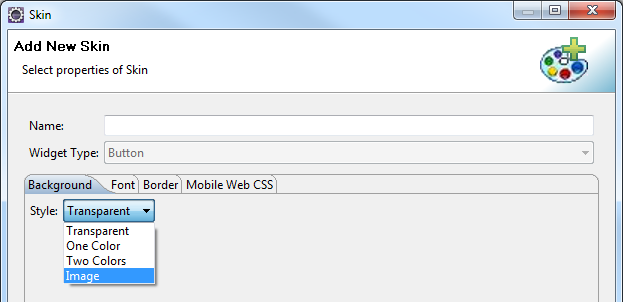

                                 

You are here: Creating a Button Using a Constructor: voltmx.ui.Button

Button Widget
=============

Button widget is a UI element that is used to trigger any actions. These actions can be navigating to another form, perform animations, interacting with a dialog box, etc.

A button displays text with a background image or a background color.

Button widget is employed in many scenarios where the user performs an on-click action on a button. Some of them are:

*   **Login and Logout:** Login screen and Logout screen generally contain buttons to log in and log out of an application.
*   **Navigation:** The previous and next buttons are used in applications to navigate to the previous form or next form.
    
*   **Dialog Box:** Buttons are employed in dialog boxes to enable interaction between the user and the application.
    
*   **Modify Properties of other widgets:** Button can modify properties of other widgets in the form, with an on-click action.
    
*   **Invoke Services:** You can get data from the backend into the form, with an on-click action of a button. For instance, consider a form that contains a segment to be populated with employee details from the backend. A button in the form can be given an on-click action to invoke the services.
    
*   **Perform Animations:** You can animate other widgets to move, rotate or scale using a button widget. The most common use case for this is the Hamburger menu. You can click on a hamburger menu to move a container which is not in the device frame to the visible area.
    

Widgets are normally added to your application using Volt MX Iris, but can also be added from code. For general information on using widgets in Iris, see [Designing an Application](../../../Iris/iris_user_guide/Content/Part_II_CreatingAnApplication.md) in the [Iris User Guide](../../../Iris/iris_user_guide/Content/Introduction.md).

For general information on the Button widget see the [Button](../../../Iris/iris_user_guide/Content/Button.md) topic in the Volt MX Iris User Guide.

The Button widget capabilities can be broadly categorized into the following:

*   [Layout](#layout)
*   [UI Appearance](#ui-appearance)
*   [Animations](#animations)
*   [Data Management](#data-management)
*   [3D Touch](#3d-touch)
*   [User Input Handling](#user-input-handling)
*   [Enabling RTL](#enabling-rtl)
*   [Miscellaneous](#miscellaneous)
*   [Configurations Common To All Widgets](#configurations-common-to-all-widgets)

#### Layout

  
| Events | Description |
| --- | --- |
| [doLayout](Button_Events.md#doLayout) | Invoked for every widget when the widget position and dimensions are computed. |

 

| Properties | Description |
| --- | --- |
| [anchorPoint](Button_Properties.md#anchorPo) | Specifies the anchor point of the widget bounds rectangle using the widget's coordinate space. |
| [bottom](Button_Properties.md#bottom) | Determines the bottom edge of the widget and is measured from the bottom bounds of the parent container. |
| [contentAlignment](Button_Properties.md#contentAlignment) | Specifies the alignment of the text for a widget with respect to its boundaries. |
| [centerX](Button_Properties.md#centerX) | Determines the center of a widget measured from the left bounds of the parent container. |
| [centerY](Button_Properties.md#centerY) | Determines the center of a widget measured from the top bounds of the parent container. |
| [height](Button_Properties.md#height) | Determines the height of the widget and measured along the y-axis. |
| [left](Button_Properties.md#left) | Determines the lower left corner edge of the widget and is measured from the left bounds of the parent container. |
| [maxHeight](Button_Properties.md#maxHeigh) | Specifies the maximum height of the widget and is applicable only when the height property is not specified. |
| [maxWidth](Button_Properties.md#maxWidth) | Specifies the maximum width of the widget and is applicable only when the width property is not specified. |
| [minHeight](Button_Properties.md#minHeigh) | Specifies the minimum height of the widget and is applicable only when the height property is not specified. |
| [minWidth](Button_Properties.md#minWidth) | Specifies the minimum width of the widget and is applicable only when the width property is not specified. |
| [padding](Button_Properties.md#padding) | Defines the space between the content of the widget and the widget boundaries. |
| [paddingInPixel](Button_Properties.md#paddingInPixel) | Indicates if the padding is to be applied in pixels or in percentage. |
| [top](Button_Properties.md#top) | Determines the top edge of the widget and measured from the top bounds of the parent container. |
| [width](Button_Properties.md#width) | Determines the width of the widget and is measured along the x-axis. |
| [zIndex](Button_Properties.md#zIndex) | Specifies the stack order of a widget. |

#### UI Appearance

| Properties | Properties |
| --- | --- |
| [backgroundColor](Button_Properties.md#backgrou) | Specifies the background color of the widget in hex format. |
| [backgroundColorMultiStepGradient](Button_Properties.md#backgroundColorMultiStepGradient) | Specifies the multi-step gradient color for the background of the widget. |
| [backgroundColorTwoStepGradient](Button_Properties.md#backgroundColorTwoStepGradient) | Specifies the two-step gradient color for the background of the widget. |
| [backgroundImage](Button_Properties.md#backgroundImage) | Sets the image for the background of the widget. |
| [borderColor](Button_Properties.md#borderColor) | Specifies the border color of the widget. |
| [borderColorGradient](Button_Properties.md#borderColorGradient) | Specifies the multi-step gradient color for the border of the widget. |
| [borderStyle](Button_Properties.md#borderStyle) | Specifies the border style for the widget. |
| [borderWidth](Button_Properties.md#borderWidth) | Specifies the width of the border for the widget in pixels. |
| [cornerRadius](Button_Properties.md#cornerRadius) | Specifies the radius of the border for the widget. |
| [disabledStateSkinProperties](Button_Properties.md#disabledStateSkinProperties) | Specifies the skin properties that define the look and feel of the widget, when the widget is disabled or blocked. |
| [focusStateSkinProperties](Button_Properties.md#focusStateSkinProperties) | Specifies the skin properties that define the look and feel of the widget, when the widget is in focus. |
| [fontColor](Button_Properties.md#fontColor) | Specifies the font color of the widget. |
| [fontFamily](Button_Properties.md#fontFamily) | Specifies the font family for the font of the widget. |
| [fontSize](Button_Properties.md#fontSize) | Specifies the font size for the widget in percentage (%) units. |
| [fontStyle](Button_Properties.md#fontStyle) | Specifies the font style for the widget. |
| [fontWeight](Button_Properties.md#fontWeight) | Specifies the weight for the font of the widget. |
| [hoverStateSkinProperties](Button_Properties.md#hoverStateSkinProperties) | Specifies the skin properties that define the look and feel of the widget, when the cursor hovers on the widget. |
| [pressedStateSkinProperties](Button_Properties.md#pressedStateSkinProperties) | Specifies the skin properties that define the look and feel of the widget, when the widget is pressed or clicked. |
| [shadowColor](Button_Properties.md#shadowColor) | Specifies the color for the shadow of the widget. |
| [shadowOffset](Button_Properties.md#shadowOffset) | This property specifies the current coordinates of the shadow region in the widget. |
| [shadowRadius](Button_Properties.md#shadowRadius) | Specifies the radius for the blur value of the shadow. |
| [textShadowColor](Button_Properties.md#textShadowColor) | Specifies the color for the text shadow of the widget. |
| [textShadowOffset](Button_Properties.md#textShadowOffset) | This property specifies the current coordinates of the text shadow region in the widget. |
| [textShadowRadius](Button_Properties.md#textShadowRadius) | Specifies the radius for the blur value of the text shadow. |
| [clipView](Button_Properties.md#clipView) | Defines a shape to clip the widget view. |
| [focusSkin](Button_Properties.md#focusSki) | Specifies the look and feel of the Button when in focus. |
| [glowEffect](Button_Properties.md#glowEffe) | Specifies if there must be glow effect when you touch the button. |
| [hoverSkin](Button_Properties.md#hoverSkin) | Specifies the look and feel of a widget when the cursor hovers on the widget. |
| [pressedSkin](Button_Properties.md#pressedS) | Specifies the skin to indicate that the Button is pressed or clicked. |
| [rippleBackground](Button_Properties.md#rippleBackground) | Defines the ripple background for a Button Widget. |
| [shadowDepth](Button_Properties.md#shadowDepth) | Defines the depth of the shadow effect applied to the Button Widget. |
| [shadowType](Button_Properties.md#shadowType) | Sets a type of the shadow effect to apply to the Button Widget. |
| [showProgressIndicator](Button_Properties.md#showProg) | Specifies if the progress indicator must be displayed when the button is clicked. |

####   Animations

| Methods | Description |
| --- | --- |
| [animate](Button_Method.md#animate) | Applies an animation to the widget. |

 

| Properties | Description |
| --- | --- |
| [transform](Button_Properties.md#transfor) | Contains an animation transformation that can be used to animate the widget. |
| [widgetSwipeMove](Button_Properties.md#widgetSwipeMove) | Used to enable and configure the left or right swipe actions for a widget. |

  

#### Data Management

| Methods | Description |
| --- | --- |
| [clone](Button_Method.md#clone) | When this method is used on a container widget, then all the widgets inside the container are cloned. |

| Properties | Description |
| --- | --- |
| [cacheConfig](Button_Properties.md#cacheConfig) | Used to configure the cachePolicy and storagePolicy of the cache responses. |

#### 3D Touch

| Methods | Description |
| --- | --- |
| [registerForPeekandPop](Button_Method.md#register) | Registers a widget to enable 3D Touch peek and pop gestures. |
| [setOnPeek](Button_Method.md#setOnPek) | Sets and overrides the existing onPeekCallback for the widget. |
| [setOnPop](Button_Method.md#setOnPop) | Sets and overrides the existing onPopCallback for the widget. |
| [unregisterForPeekandPop](Button_Method.md#unregist) | Unregisters a widget from 3D Touch peek and pop gestures. |

 

#### User Input Handling

| Events | Description |
| --- | --- |
| [onClick](Button_Events.md#onClick) | An event callback is invoked by the platform when the user performs a click action on the button. |
| [onScrollWidgetPosition](Button_Events.md#onScrollWidgetPosition) | An event callback is invoked by the platform when the widget location position gets changed on scrolling. |
| [onTouchEnd](Button_Events.md#onTouchE) | An event callback is invoked by the platform when the user touch is released from the touch surface. |
| [onTouchMove](Button_Events.md#onTouchM) | An event callback is invoked by the platform when the touch moves on the touch surface continuously until movement ends. |
| [onTouchStart](Button_Events.md#onTouchS) | An event callback is invoked by the platform when the user touches the touch surface. |

 

| Methods | Description |
| --- | --- |
| [addGestureRecognizer](Browser_Methods.md#addGestureRecognizer) | Allows you to set a gesture recognizer for a specified gesture for a specified widget. |
| [removeGestureRecognizer](Button_Method.md#removeGestureRecognizer) | Allows you to remove the specified gesture recognizer for the specified widget. |
| [setGestureRecognizer](Button_Method.md#setGestureRecognizer) | Allows you to set a gesture recognizer for a specified gesture for a specified widget. |

 

#### Enabling RTL

| Properties | Description |
| --- | --- |
| [retainContentAlignment](Button_Properties.md#retainContentAlignment) | Helps to retain the content alignment of the widget while applying RTL. |
| [retainFlexPositionProperties](Button_Properties.md#retainFlexPositionProperties) | Helps to retain the left, right and padding properties while applying RTL. |
| [retainFlowHorizontalAlignment](Button_Properties.md#retainFlowHorizontalAlignment) | Enables you to change the horizontal flow of the widget from left to right. |

#### Miscellaneous

| Methods | Description |
| --- | --- |
| [getBadge](Button_Method.md#getBadge) | Enables you to read the badge value (if any) attached to the specified widget. |
| [setBadge](Button_Method.md#setBadge) | Enables you to set the badge value to the given widget at the upper, right corner of the widget. |

 

| Properties | Description |
| --- | --- |
| [buttonType](Button_Properties.md#buttonType) | Supports native iOS button types. |
| [cursorType](Button_Properties.md#cursorType) | Specifies the type of mouse pointer used. |
| [enableHapticFeedback](Button_Properties.md#enableHapticFeedback) | Allows you to enable or disable haptic feedback on the Button widget. |
| [externalURL](Button_Properties.md#external) | Specifies that the URL must be opened directly from the web site without having to contact the Volt MX Foundry. |
| [nativeButtonFocusImage](Button_Properties.md#nativeButtonFocusImage) | Allows you to set an image to be used when the button has focus. |
| [nativeButtonNormalImage](Button_Properties.md#nativeButtonNormalImage) | Allows you to set an image to be used for a button. |
| [rawBytes](Button_Properties.md#rawbytes) | Specifies the rawbytes representing an image that can be used as a background for the button. |
| [text](Button_Properties.md#text) | Specifies a general or descriptive text for the Button widget. |
| [toolTip](Button_Properties.md#toolTip) | Specifies the hint text when the cursor hovers over a widget, without clicking it. |

  

#### Configurations common to all widgets

| Methods | Description |
| --- | --- |
| [blur](Button_Properties.md#blur) | Enables you to make the widget look unfocused. |
| [convertPointFromWidget](Button_Method.md#convertPointFromWidget) | Allows you to convert the coordinate system from a widget to a point (receiver's coordinate system). |
| [convertPointToWidget](Button_Method.md#convertPointToWidget) | Allows you to convert the co-ordinate system from point(receiver's co-ordinate system) to a Widget. |
| [removeFromParent](Button_Method.md#removeFromParent) | Allows you to remove a child widget from a parent widget. |
| [setEnabled](Button_Method.md#setEnabled) | Specifies the widget that must be enabled or disabled. Syntax |
| [setFocus](Button_Method.md#setFocus) | Specifies the widget on which there must be focus. |
| [setVisibility](Button_Method.md#setVisibility) | Use this method to set the visibility of the widget. |

 

| Properties | Description |
| --- | --- |
| [enable](Button_Properties.md#enable) | Allows you to make a widget visible but not actionable. |
| [enableCache](Button_Properties.md#enableCa) | Enables you to improve the performance of Positional Dimension Animations. |
| [info](Button_Properties.md#info) | A custom JSObject with the key value pairs that a developer can use to store the context with the widget. |
| [isVisible](Button_Properties.md#isVisibl) | Controls the visibility of a widget on the form. |
| [parent](Button_Properties.md#parent) | Helps you access the parent of the widget. |

 

| Events | Description |
| --- | --- |
| [postOnclickJS](Button_Events.md#postOncl) | Allows the developer to execute custom JavaScript function after the onClick callback of the widget is invoked. |
| [preOnclickJS](Button_Events.md#preOncli) | Allows the developer to execute custom JavaScript function before the onClick callback of the widget is invoked. |

Button Widget Basics
--------------------

### Creating a Button Using a Constructor: voltmx.ui.Button

```

var button1 = new voltmx.ui.Button(basicConf, layoutConf, pspConf);
```

*   **basicConf** is an object with basic properties.
*   **layoutConf** is an object with layout properties.
*   **pspConf** is an object with platform specific properties.

> **_Note:_** The configuration properties should be passed only in the respective configuration objects otherwise they are ignored

Example

```

```

```
//The below function is the callback function for onClick event call.
function onClickCallBack() {
    //Write your logic here.
}

//Defining the button with onClick:onClickCallBck.
var btnBasic = {
    id: "Onbutton",
    isVisible: true,
    skin: "btnSkin",
    focusSkin: "btnFSkin",
    text: "Click Here",
    onClick: onClickCallBck
};

var btnLayout = {
    containerWeight: 100,
    padding: [5, 5, 5, 5],
    margin: [5, 5, 5, 5],
    hExpand: true,
    vExpand: false,
    displayText: true
};

var btnPSP = {
    pressedSkin: "presSkin",
    externalURL: "https://www.abcd.com",   
    submitURL: "https://www.abcd.com",   
    glowEffect:true  
 };

 //Creating the button.
 var Onbutton = new voltmx.ui.Button(btnBasic, btnLayout, btnPSP);
```

### Customizing a Button's Appearance

You can customize the appearance of the button using the following properties:

*   widgetAlignment: Specifies the alignment of the widget.
*   margin: Defines the space around a widget.
*   padding: Defines the space between the content of the widget and the widget boundaries.
*   [skin](Button_Properties.md#skin): Specifies the skin.
*   [focusSkin](Button_Properties.md#focusSki): Specifies the focus skin.
*   hExpand: Expand the button horizontally.
*   vExpand: Expand the button vertically.

### Important Considerations

The Button Widget has the following considerations:

*   You can specify a background image for a Button. You can set the image from the Button skin for both normal and focus skins.



*   To avoid jumping effect or to avoid overlap of neighboring widgets, you must ensure that the image for normal and focus skins are of the same size.

