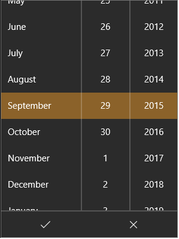

                                

You are here: Creating a Calendar Using a Constructor: voltmx.ui.Calendar

Calendar Widget
===============

Calendar widget is used to select and display dates in your application. Some scenarios in which you can leverage the features of a Calendar widget are as follows:

*   To select a range of dates for scheduling a trip or for insurance claims
*   To show the tasks performed by a field service agent in the form of a grid, for any given date.

Here are some of features of the Calendar widget:

From Volt MX Iris V9 SP2, the Calendar widget is enhanced with a new look in Iris. Users can now select the year and month using the drop-down list. Prior to V9 SP2, users had to click on the Calendar icon and then click on the month/year to display the list. Further, users had to continue to choose the month and year from a grid view and then confirm the month/year after selecting the options.

> **_Note:_** This feature is applicable only on the latest CSS lib.

**Customizing Cells:** Personalize the various cells inside a Calendar widget. This feature allows you to customize how you want to display the selected dates, un-selected dates, and other facets of a calendar.

**Setting the Location:** Customize where the calendar popup should appear in an app. For instance, in a banking app, you can set the location of the Calendar popup while selecting the date of transaction.

**Enabling a Range of Dates:** Enable a range of dates by just setting the start date and end date. For example, in a travel application, you can use this feature to display the duration of your stay while booking a hotel.

Widgets are normally added to your application using Volt MX Iris, but can also be added from code. For general information on using widgets in Iris, see [Designing an Application](../../../Iris/iris_user_guide/Content/Part_II_CreatingAnApplication.md) in the [Iris User Guide](../../../Iris/iris_user_guide/Content/Introduction.md).

For general information on this widget see the [](../../../Iris/iris_user_guide/Content/Button.md)[Calendar](../../../Iris/iris_user_guide/Content/Calendar.md?Highlight=gridcalendar) topic in the Volt MX Iris User Guide.

The Calender widget capabilities can be broadly categorized into the following:

*   [Layout](#layout)
*   [UI Appearance](#ui-appearance)
*   [Animations](#animations)
*   [Customizing Calendar](#customizing-calendar)
*   [Data Management](#data-management)
*   [3D Touch](#3d-touch)
*   [User Input Handling](#user-input-handling)
*   [Enabling RTL](#enabling-rtl)
*   [Miscellaneous](#miscellaneous)
*   [Configurations common to all widgets](#configurations-common-to-all-widgets)

#### Layout

  
| Events | Description |
| --- | --- |
| [doLayout](Calendar_Events.md#doLayout) | Invoked for every widget when the widget position and dimensions are computed. |

 

| Properties | Description |
| --- | --- |
| [anchorPoint](Calendar_Properties.md#anchorPo) | Specifies the anchor point of the widget bounds rectangle using the widget's coordinate space. |
| [bottom](Calendar_Properties.md#bottom) | Determines the bottom edge of the widget and is measured from the bottom bounds of the parent container. |
| [centerX](Calendar_Properties.md#centerX) | Determines the center of a widget measured from the left bounds of the parent container. |
| [centerY](Calendar_Properties.md#centerY) | Determines the center of a widget measured from the top bounds of the parent container. |
| [containerHeight](Calendar_Properties.md#containe) | Available only when viewType is set as CALENDAR\_VIEW\_TYPE\_GRID\_POPUP or CALENDAR\_VIEW\_TYPE\_GRID\_ONSCREEN. |
| [containerHeightReference](Calendar_Properties.md#containe2) | Available only when viewType is set as CALENDAR\_VIEW\_TYPE\_GRID\_POPUP or CALENDAR\_VIEW\_TYPE\_GRID\_ONSCREEN and when you set the containerHeight. |
| [contentAlignment](Calendar_Properties.md#contentAlignment) | Specifies the alignment of the text for a widget with respect to its boundaries. |
| [height](Calendar_Properties.md#height) | Determines the height of the widget and measured along the y-axis. |
| [maxHeight](Calendar_Properties.md#maxHeigh) | Specifies the maximum height of the widget and is applicable only when the height property is not specified. |
| [maxWidth](Calendar_Properties.md#maxWidth) | Specifies the maximum width of the widget and is applicable only when the width property is not specified. |
| [minHeight](Calendar_Properties.md#minHeigh) | Specifies the minimum height of the widget and is applicable only when the height property is not specified. |
| [minWidth](Calendar_Properties.md#minWidth) | Specifies the minimum width of the widget and is applicable only when the width property is not specified. |
| [padding](Calendar_Properties.md#padding) | Defines the space between the content of the widget and the widget boundaries. |
| [paddingInPixel](Calendar_Properties.md#paddingInPixel) | Indicates if the padding is to be applied in pixels or in percentage. |
| [right](Calendar_Properties.md#right) | Determines the lower right corner of the widget and is measured from the right bounds of the parent container. |
| [top](Calendar_Properties.md#top) | Determines the top edge of the widget and measured from the top bounds of the parent container. |
| [width](Calendar_Properties.md#width) | Determines the width of the widget and is measured along the x-axis. |
| [zIndex](Calendar_Properties.md#zIndex) | Specifies the stack order of a widget. |

 

#### UI Appearance

| Properties | Description |
| --- | --- |
| [backgroundColor](Calendar_Properties.md#backgrou) | Specifies the background color of the widget in hex format. |
| [backgroundColorMultiStepGradient](Calendar_Properties.md#backgroundColorMultiStepGradient) | Specifies the multi-step gradient color for the background of the widget. |
| [backgroundColorTwoStepGradient](Calendar_Properties.md#backgroundColorTwoStepGradient) | Specifies the two-step gradient color for the background of the widget. |
| [backgroundImage](Calendar_Properties.md#backgroundImage) | Sets the image for the background of the widget. |
| [borderColor](Calendar_Properties.md#borderColor) | Specifies the border color of the widget. |
| [borderColorGradient](Calendar_Properties.md#borderColorGradient) | Specifies the multi-step gradient color for the border of the widget. |
| [borderStyle](Calendar_Properties.md#borderStyle) | Specifies the border style for the widget. |
| [borderWidth](Calendar_Properties.md#borderWidth) | Specifies the width of the border for the widget in pixels. |
| [cornerRadius](Calendar_Properties.md#cornerRadius) | Specifies the radius of the border for the widget. |
| [disabledStateSkinProperties](Calendar_Properties.md#disabledStateSkinProperties) | Specifies the skin properties that define the look and feel of the widget, when the widget is disabled or blocked. |
| [focusStateSkinProperties](Calendar_Properties.md#focusStateSkinProperties) | Specifies the skin properties that define the look and feel of the widget, when the widget is in focus. |
| [fontColor](Calendar_Properties.md#fontColor) | Specifies the font color of the widget. |
| [fontFamily](Calendar_Properties.md#fontFamily) | Specifies the font family for the font of the widget. |
| [fontSize](Calendar_Properties.md#fontSize) | Specifies the font size for the widget in percentage (%) units. |
| [fontStyle](Calendar_Properties.md#fontStyle) | Specifies the font style for the widget. |
| [fontWeight](Calendar_Properties.md#fontWeight) | Specifies the weight for the font of the widget. |
| [hoverStateSkinProperties](Calendar_Properties.md#hoverStateSkinProperties) | Specifies the skin properties that define the look and feel of the widget, when the cursor hovers on the widget. |
| [pressedStateSkinProperties](Calendar_Properties.md#pressedStateSkinProperties) | Specifies the skin properties that define the look and feel of the widget, when the widget is pressed or clicked. |
| [shadowColor](Calendar_Properties.md#shadowColor) | Specifies the color for the shadow of the widget. |
| [shadowOffset](Calendar_Properties.md#shadowOffset) | This property specifies the current coordinates of the shadow region in the widget. |
| [shadowRadius](Calendar_Properties.md#shadowRadius) | Specifies the radius for the blur value of the shadow. |
| [textShadowColor](Calendar_Properties.md#textShadowColor) | Specifies the color for the text shadow of the widget. |
| [textShadowOffset](Calendar_Properties.md#textShadowOffset) | This property specifies the current coordinates of the text shadow region in the widget. |
| [textShadowRadius](Calendar_Properties.md#textShadowRadius) | Specifies the radius for the blur value of the text shadow. |
| [focusSkin](Calendar_Properties.md#focusSki) | Skin property that determines the look and feel when there is focus on a widget. |
| [headerSkin](Calendar_Properties.md#headerSk) | Used to provide a header for the DatePicker skin, if headerText is set. |
| [hoverSkin](Calendar_Properties.md#hoverSkin) | Specifies the look and feel of a widget when the cursor hovers on the widget. |
| [skin](Calendar_Properties.md#skin) | Specifies a background skin for Calendar. |
| [timeSheetSkin](Calendar_Properties.md#timeShee) | Specifies each cell color of the timesheet view when the calendar view type it set as CALENDAR\_VIEW\_TYPE\_MONTH\_VIEW. |
| [viewConfig](Calendar_Properties.md#viewConf) | Specifies the view configuration for different view types. |
| [viewType](Calendar_Properties.md#viewType) | Specifies the view type of the Calendar. |

 

| Methods | Description |
| --- | --- |
| [setDatesSkin](Calendar_Methods.md#setDates) | Allows you to set the skin and control the look and feel of each cell in the calendar. |

#### Animations

| Methods | Description |
| --- | --- |
| [animate](Calendar_Methods.md#animate) | Applies an animation to the widget. |

 

| Properties | Description |
| --- | --- |
| [transform](Calendar_Properties.md#transfor) | Contains an animation transformation that can be used to animate the widget. |
| [widgetSwipeMove](Calendar_Properties.md#widgetSwipeMove) | Used to enable and configure the left or right swipe actions for a widget. |

#### Customizing Calendar

| Methods | Description |
| --- | --- |
| [open](Calendar_Methods.md#open) | Allows you to open the Calendar widget's popup view dynamically. |
| [setContext](Calendar_Methods.md#setConte) | Specifies the calendar that must be displayed for the context and also helps you to position the calendar on the screen. |
| [dismiss](Calendar_Methods.md#dismiss) | Allows you to dismiss the calendar widget's popup view on which the method is called. |
| [enableRangeOfDates](Calendar_Methods.md#enableRa) | Allows you to enable/disable the range of dates that fall between the startdate and enddate and disables/enables the rest of the dates. |
| [getAppointments](Calendar_Methods.md#getAppoi) | Used to get the appointments from the calendar view types. |
| [navigateToNextMonth](Calendar_Methods.md#navigate2) | Allows you to navigate to next month of the calendar widget. |
| [navigateToPreviousMonth](Calendar_Methods.md#navigate) | Allows you to navigate to previous month of the calendar widget |
| [switchToDate](Calendar_Methods.md#switchTo) | Used to switch date from the calendar view types. |

 

| Properties | Description |
| --- | --- |
| [calendarIcon](Calendar_Properties.md#calendar-properties) | Replaces the system default calendar icon. |
| [calendarIconAlignment](Calendar_Properties.md#calendarIconAlignment) | Determines the position of the calendar icon inside the calendar input box. |
| [calendarLanguage](Calendar_Properties.md#calLangu) | Used to provide a languagefor the DatePicker. |
| [dateComponents](Calendar_Properties.md#dateComp) | Specifies the default date that must appear in the Date field. |
| [dateEditable](Calendar_Properties.md#dateEdit) | Determines whether the calendar date must be entered in the calendar textbox. |
| [dateFormat](Calendar_Properties.md#dateForm) | The date format in which the selected date must appear on the display and when accessed programmatically the "date" property. |
| [day](Calendar_Properties.md#day) | Reads the day portion of the currently selected date. |
| [dayTextAlignmentInCell](Calendar_Properties.md#dayTextA) | Available only when viewType is set as CALENDAR\_VIEW\_TYPE\_GRID\_POPUP or CALENDAR\_VIEW\_TYPE\_GRID\_ONSCREEN. |
| [displayedMonth](Calendar_Properties.md#displaye) | Applicable only when viewType is set as CALENDAR\_VIEW\_TYPE\_GRID\_POPUP or CALENDAR\_VIEW\_TYPE\_GRID\_ONSCREEN. |
| [gridTheme](Calendar_Properties.md#gridTheme) | Used to change the pre-defined CSS of a calendar widget. |
| [formattedDate](Calendar_Properties.md#formatte) | Currently selected data as String the format that is set through "dateFormat" property. |
| [hideDaysHeader](Calendar_Properties.md#hideDays) | It indicates if the weekdays are hidden on the header for grid calendar. |
| [hideMonthsHeader](Calendar_Properties.md#hideMont) | It indicates if the months header is hidden for grid calendar including the navigation buttons. |
| [hidePreviousNextMonthDates](Calendar_Properties.md#hidePreviousNextMonthDates) | Specifies the visibility of the previous and next months in a calendar. |
| [hour](Calendar_Properties.md#hour) | Reads the hour portion of the currently selected date. |
| [isDayVisible](Calendar_Properties.md#isDayVis) | Specifies whether the Day combo box of the DatePicker is visible. |
| [isMonthVisible](Calendar_Properties.md#isMonthV) | Specifies whether the Month combo box of the DatePicker is visible. |
| [isYearVisible](Calendar_Properties.md#isYearVi) | Specifies whether the Year combo box of the DatePicker is visible. |
| [minutes](Calendar_Properties.md#minutes) | Reads the minutes portion of the currently selected date. |
| [month](Calendar_Properties.md#month) | Reads the month portion of the currently selected date. |
| [noOfMonths](Calendar_Properties.md#noOfMont) | Specifies the number between 1 and 12 which indicates the number of months to be displayed when the calendar is selected. |
| [seconds](Calendar_Properties.md#seconds) | Reads the seconds portion of the currently selected date. |
| [validEndDate](Calendar_Properties.md#validEnd) | Array representing the day, month and year portions of the date in the same order. |
| [validStartDate](Calendar_Properties.md#validSta) | Array representing the day, month, and year portions of the date in the same order. |
| [wheelBackgroundColor](Calendar_Properties.md#wheelBac) | Specifies the background color for the wheel that is displayed when you click the Calendar. |
| [year](Calendar_Properties.md#year) | Reads the year portion of the currently selected date. |

  

#### Data Management

| Methods | Description |
| --- | --- |
| [clone](Calendar_Methods.md#clone) | When this method is used on a container widget, all the widgets inside the container are cloned. |
| [clear](Calendar_Methods.md#clear) | Enables you to clear the date in the calendar and the date format is shown. |
| [clearAppointments](Calendar_Methods.md#clearApp) | Used to clear existing appointments from the calendar view types. |
| [clearData](Calendar_Methods.md#clearDat) | Allows you to remove the data that is set through setData method. |
| [deleteAppointments](Calendar_Methods.md#deleteAp) | Allows you to delete existing appointments or array of string consisting of unique ids that represent each appointment to any of the calendar scheduler views. |
| [modifyAppointment](Calendar_Methods.md#modifyAp) | Allows you to modify the existing appointment with new appointment. |
| [removeDataAt](Calendar_Methods.md#removeDa) | Allows you to remove data set in a specific argument. |
| [setData](Calendar_Methods.md#setData) | Allows you to set new data to the widgets as specified in the widgetDataMap. |
| [setDataAt](Calendar_Methods.md#setDataA) |  |

 

| **Properties** | **Description** |
| --- | --- |
| [data](Calendar_Properties.md#data) | JS Objects that represents the actual data to be rendered in each cell. |
| [inputAccessoryViewType](Calendar_Properties.md#inputAccessoryViewType) | The extra buttons (or controls) allow specific operations needed by your application, such as moving to the next or previous text field, making the keyboard disappear and so on. The area above the keyboard is known as Input Accessory View |
| [widgetDataMapForCell](Calendar_Properties.md#widgetDa) | Specifies the mapping information between the widget id's and the keys in the data. |

 

#### 3D Touch

| Methods | Description |
| --- | --- |
| [registerForPeekandPop](Calendar_Methods.md#register) | Registers a widget to enable 3D Touch peek and pop gestures. |
| [setOnPeek](Calendar_Methods.md#setOnPek) | Sets and overrides the existing onPeekCallback for the widget. |
| [setOnPop](Calendar_Methods.md#setOnPop) | Overrides the existing onPopCallback for the widget. |
| [unregisterForPeekandPop](Calendar_Methods.md#unregist) | Unregisters a widget from 3D Touch peek and pop gestures. |

#### User Input Handling

| Events | Description |
| --- | --- |
| [onAppointmentTap](Calendar_Events.md#onAppoin) | Triggered when you tap any of the existing appointments |
| [onEmptyCellTap](Calendar_Events.md#onEmptyC) | Triggered when you tap on any of the empty cells of the calendar day view. |
| [onScrollWidgetPosition](Calendar_Events.md#onScrollWidgetPosition) | This event callback is invoked by the platform when the widget location position gets changed on scrolling. |
| [onSelection](Calendar_Events.md#onSelect) | This event is triggered when an item is selected or deselected. |
| [onTouchEnd](Calendar_Events.md#onTouchEnd) | An event callback is invoked by the platform when the user touch is released from the touch surface. |
| [onTouchMove](Calendar_Events.md#onTouchMove) | An event callback is invoked by the platform when the touch moves on the touch surface continuously until movement ends. |
| [onTouchStart](Calendar_Events.md#onTouchStart) | An event callback is invoked by the platform when the user touches the touch surface. |

 

| Methods | Description |
| --- | --- |
| [addGestureRecognizer](Calendar_Methods.md#addGestureRecognizer) | Allows you to set a gesture recognizer for a specified gesture for a specified widget. |
| [removeGestureRecognizer](Calendar_Methods.md#removeGestureRecognizer) | Allows you to remove the specified gesture recognizer for the specified widget. |
| [setGestureRecognizer](Calendar_Methods.md#setGestureRecognizer) | Allows you to set a gesture recognizer for a specified gesture for a specified widget. |

 

| Properties | Description |
| --- | --- |
| [selectedDates](Calendar_Properties.md#selectedDates) | Specifies the array of dates selected when multiple dates are selected. |
| [selectionType](Calendar_Properties.md#selectionType) | Specifies the method of date selection in a Calendar widget. |

#### Enabling RTL

| Properties | Description |
| --- | --- |
| [retainContentAlignment](Calendar_Properties.md#retainContentAlignment) | Helps to retain the content alignment of the widget while applying RTL. |
| [retainFlexPositionProperties](Calendar_Properties.md#retainFlexPositionProperties) | Helps to retain the left, right and padding properties while applying RTL. |
| [retainFlowHorizontalAlignment](Calendar_Properties.md#retainFlowHorizontalAlignment) | Enables you to change the horizontal flow of the widget from left to right. |

#### Miscellaneous

| Methods | Description |
| --- | --- |
| [getBadge](Calendar_Methods.md#getBadge) | Enables you to read the badge value (if any) attached to the specified widget. |
| [setBadge](Calendar_Methods.md#setBadge) | Enables you to set the badge value to the given widget at the upper, right corner of the widget. |

 

| Properties | Description |
| --- | --- |
| [cellTemplate](Calendar_Properties.md#cellTemp) | Available only when viewType is set as CALENDAR\_VIEW\_TYPE\_GRID\_POPUP or CALENDAR\_VIEW\_TYPE\_GRID\_ONSCREEN. |
| [cursorType](Calendar_Properties.md#cursorType) | Specifies the type of the mouse pointer used. |
| [titleOnPopup](Calendar_Properties.md#titleOnP) | Specifies the title text to be displayed on the calendar popup. |
| [toolTip](Calendar_Properties.md#toolTip) | Specifies the hint text when the cursor hovers over a widget, without clicking it. |

 

#### Configurations common to all widgets

| Methods | Description |
| --- | --- |
| [blur](Calendar_Properties.md#blur) | Enables you to make the widget look unfocused. |
| [convertPointFromWidget](Calendar_Methods.md#convertPointFromWidget) | Allows you to convert the coordinate system from a widget to a point (receiver's coordinate system). |
| [convertPointToWidget](Calendar_Methods.md#convertPointToWidget) | You can convert the receiver's co-ordinate system from a point to a Widget. |
| [removeFromParent](Calendar_Methods.md#removeFromParent) | Allows you to remove a child widget from a parent widget. |
| [setEnabled](Calendar_Methods.md#setEnabl) | Allows you to enable/disable a list of dates if the startdate and enddate are not set in the calendar, then this API is used to enable/disable any date in the calendar. |
| [setEnabledAll](Calendar_Methods.md#setEnabl2) | Allows you to enable all the dates that fall between the startdate and enddate. |
| [setFocus](Calendar_Methods.md#setFocus) | Specifies the widget on which there must be focus. |
| [setVisibility](Calendar_Methods.md#setVisibility) | Use this method to set the visibility of the widget. |

 

<table style="width: 100%;mc-table-style: url]('Resources/Snippets/Resources/TableStyles/2015DefinitiveBasicTable.css');margin-left: 0;margin-right: auto;" class="TableStyle-2015DefinitiveBasicTable" cellspacing="0"><colgroup><col class="TableStyle-2015DefinitiveBasicTable-Column-Column1" style="width: 346px;"><col class="TableStyle-2015DefinitiveBasicTable-Column-Column1"></colgroup><tbody><tr class="TableStyle-2015DefinitiveBasicTable-Body-Body1"><th class="TableStyle-2015DefinitiveBasicTable-BodyE-Column1-Body1"><b>Properties</b></th><th class="TableStyle-2015DefinitiveBasicTable-BodyD-Column1-Body1"><b>Description</b></th></tr><tr class="TableStyle-2015DefinitiveBasicTable-Body-Body1"><td class="TableStyle-2015DefinitiveBasicTable-BodyE-Column1-Body1"><a href="Calendar_Properties.html#accessibilityConfig" target="_blank">accessibilityConfig</a></td><td class="TableStyle-2015DefinitiveBasicTable-BodyD-Column1-Body1">Enables you to control accessibility behavior and alternative text for the widget.</td></tr><tr class="TableStyle-2015DefinitiveBasicTable-Body-Body1"><td class="TableStyle-2015DefinitiveBasicTable-BodyE-Column1-Body1"><a href="Calendar_Properties.html#enable" target="_blank">enable</a></td><td class="TableStyle-2015DefinitiveBasicTable-BodyD-Column1-Body1">Allows you to make a widget visible but not actionable.</td></tr><tr class="TableStyle-2015DefinitiveBasicTable-Body-Body1" data-mc-conditions="Default.V9SP2GA"><td class="TableStyle-2015DefinitiveBasicTable-BodyE-Column1-Body1"><a href="Calendar_Properties.html#enableOrDisableDates">enableOrDisable</a></td><td class="TableStyle-2015DefinitiveBasicTable-BodyD-Column1-Body1">Allows you to enable or disable the list of given dates when the calendar is shown.</td></tr><tr class="TableStyle-2015DefinitiveBasicTable-Body-Body1"><td class="TableStyle-2015DefinitiveBasicTable-BodyE-Column1-Body1"><a href="Calendar_Properties.html#id" target="_blank">id</a></td><td class="TableStyle-2015DefinitiveBasicTable-BodyD-Column1-Body1">Defines a string of alpha numeric characters that uniquely identifies a calendar widget within an application.</td></tr><tr class="TableStyle-2015DefinitiveBasicTable-Body-Body1"><td class="TableStyle-2015DefinitiveBasicTable-BodyE-Column1-Body1"><a href="Calendar_Properties.html#info" target="_blank">info</a></td><td class="TableStyle-2015DefinitiveBasicTable-BodyD-Column1-Body1">A custom JSObject with the key value pairs that a developer can use to store the context with the widget.</td></tr><tr class="TableStyle-2015DefinitiveBasicTable-Body-Body1"><td class="TableStyle-2015DefinitiveBasicTable-BodyB-Column1-Body1"><a href="Calendar_Properties.html#isVisibl">isVisible</a></td><td class="TableStyle-2015DefinitiveBasicTable-BodyA-Column1-Body1">Controls the visibility of a widget on the form.</td></tr></tbody></table>

Calendar Widget Basics
----------------------

The calendar widget allows you to select a date from a graphical calendar. The calendar widget appears as a label with a small calendar icon (icon does not appear on Mobile Web platforms) and displays the date or the date format specified by you. You can interact with the calendar widget by clicking on it.

When the calendar widget is clicked, a grid-like calendar is displayed The calendar allows you to select a single date and move back-and-forth between months and years.

The appearance is not the same on all platforms.

> **_Note:_** When the native calendar view is used, the individual dates cannot be enabled or disabled using the setEnable API. Also, when you use native calendar view, you cannot restrict the user to select the dates within the [validStartDate](Calendar_Properties.md#validSta) and [validEndDate](Calendar_Properties.md#validEnd) range.

### Creating a Calendar Using a Constructor: voltmx.ui.Calendar

```

var mycal = new voltmx.ui.Calendar(basicConf, layoutConf, pspConf);
```

*   **basicConf** is an object with basic properties.
*   **layoutConf** is an object with layout properties.
*   **pspConf** is an object with platform specific properties.

> **_Note:_** The configuration properties should be passed only in the respective configuration objects otherwise they are ignored.

Example

```
//The below function is the callback function for onSelection event
function onSelectionCallBck(calendar) {
    alert("onSelection event triggered");
}

//Defining the properties for Calendar with onSelection:onSelectionCallBck
var calBasicConf = {
    id: "calID",
    isVisible: true,
    skin: "voltmxtextar",
    focusSkin: "calFocus",
    dateFormat: "dd/MM/yyyy",
    viewType: constants.CALENDAR_VIEW_TYPE_GRID_POPUP,
    validStartDate: [01, 01, 2012],
    validEndDate: [31, 12, 2012],
    placeholder: "JSCalendar",
    calendarIcon: "cal.png",
    onSelection: onSelectionCallBck
};

var calLayoutConf = {
    padding: [2, 2, 2, 2],
    margin: [5, 5, 5, 5],
    containerWeight: 100,
    hExpand: true,
    vExpand: true
};

var calPSPConf = {
    titleOnPopup: "calendarPopUpTitle"
};

//Creating the Calendar.
var Calendar = new voltmx.ui.Calendar(calBasicConf, calLayoutConf, calPSPConf);

//Reading the titleOnPopup property of calendar widget
alert("Calendar titleOnPopup ::" + Calendar.titleOnPopup);
```

### Customizing Appearance

You can customize the appearance of the calendar widget using the following properties:

*   widgetAlignment: Specifies the alignment of the widget.
*   margin: Defines the space around a widget.
*   padding: Defines the space between the content of the widget and the widget boundaries.
*   [skin](Calendar_Properties.md#skin): Specifies the skin.
*   [focusSkin](Calendar_Properties.md#focusSki): Specifies the focus skin.

### Important Considerations

The Calendar widget has the following important considerations:

*   On Android platform, restricting the date selection between validStartDate and validEndDate is not possible with Native Calendar View.
*   On Android, when targeting older versions (5.0 through 6.0) the top label of the Calendar Widget may show duplicate data. This is an issue with the native behavior for the Android platform. It has been resolved in later versions of the OS (7.1 and later).
*   On Desktop Web and SPA platforms, a valid calendar year selection range is from 1900 to 2099. If you select an year beyond the range shows an alert message (you can customize this error message).

### DatePicker control

A new calendar control, the DatePicker, is available in Windows platform. Create this control using the Calendar viewType property value CALENDAR\_VIEW\_TYPE\_DATEPICKER.



Calendar DatePicker native control popup


#### Limitations and Considerations for DatePicker Control

*   This control is supported in Windows 10 only.
*   This control does not support HExpand and VExpand.
*   This control does not support ContentAlignment.
*   This control does not support WidgetAlignment.
*   This control is a Pickerview. This view and its properties are not compatible with other calendar view types. Therefore, changing the viewType dynamically will not work.
*   The constant CALENDAR\_VIEW\_TYPE\_DATEPICKER may not be available in Volt MX Iris. Therefore, this view must be created dynamically using code.

### gridcalendar Templates

The Calendar widget provides gridcalendar templates to give you further control of the contents of a calendar cell.

#### What is a Template for gridcalendar?

A gridcalendar template enables you to define a template for Calendar Day cell. Only one template can be used for each Calendar. This is primarily useful for developers to achieve a customized look and feel of a Calendar Day cell.

You can define a template using the following widgets:

*   HBox (deprecated)
*   VBox (deprecated)
*   FlexContainer (new in Iris 7.3)
*   Button
*   Image
*   Label

#### Where to use a gridcalendar Template

gridcalendar templates are used to achieve custom look and feel of Calendar Day cell.

The gridcalendar templates are used:

*   To define a Calendar Day cell with custom look and feel.
*   To achieve the behavior of widgets such as an Image and a label for a Calendar Day cell.
*   To perform an onclick action on a Calendar Day cell.

