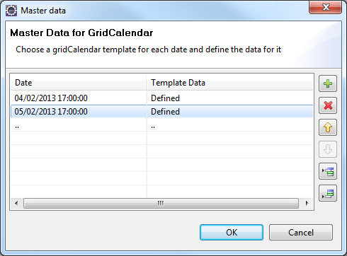
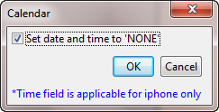
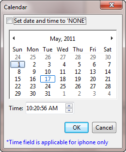

                                   


## <a id="calendar-properties"></a> Calendar Properties


The properties of Calendar widget are as follows.

* * *


<details close markdown="block"><summary>accessibilityConfig Property</summary>

* * *

Enables you to control accessibility behavior and alternative text for the widget.

For more information on using accessibility features in your app, see the [Accessibility](../../../Iris/app_design_dev/Content/Accessibility_Overview.md) appendix in the VoltMX IrisUser Guide.

### Syntax

```

accessibilityConfig
```

### Type

Object

### Read/Write

Read + Write

### Remarks

*   The accessibilityConfig property is enabled for all the widgets which are supported under the Flex Layout.

> **_Note:_** From VoltMX Iris V9 SP2 GA version, you can provide i18n keys as values to all the attributes used inside the `accessibilityConfig` property. Values provided in the i18n keys take precedence over values provided in `a11yLabel`, `a11yValue`, and `a11yHint` fields.

The accessibilityConfig property is a JavaScript object which can contain the following key-value pairs.

  
| Key | Type | Description | ARIA Equivalent |
| --- | --- | --- | --- |
| a11yIndex | Integer with no floating or decimal number. | This is an optional parameter. Specifies the order in which the widgets are focused on a screen. | For all widgets, this parameter maps to the `aria-index`, `index`, or `taborder` properties. |
| a11yLabel | String | This is an optional parameter. Specifies alternate text to identify the widget. Generally the label should be the text that is displayed on the screen. | For all widgets, this parameter maps to the `aria-labelledby` property of ARIA in HTML. > **_Note:_** For the Image widget, this parameter maps to the **alt** attribute of ARIA in HTML. |
| a11yValue | String | This is an optional parameter. Specifies the descriptive text that explains the action associated with the widget. On the Android platform, the text specified for a11yValue is prefixed to the a11yHint. | This parameter is similar to the a11yLabel parameter. If the a11yValue is defined, the value of a11yValue is appended to the value of a11yLabel. These values are separated by a space. |
| a11yHint | String | This is an optional parameter. Specifies the descriptive text that explains the action associated with the widget. On the Android platform, the text specified for a11yValue is prefixed to the a11yHint. | For all widgets, this parameter maps to the `aria-describedby` property of ARIA in HTML. |
| a11yHidden | Boolean | This is an optional parameter. Specifies if the widget should be ignored by assistive technology. The default option is set to _false_. This option is supported on iOS 5.0 and above, Android 4.1 and above, and SPA | For all widgets, this parameter maps to the `aria-hidden` property of ARIA in HTML. |
| a11yARIA | Object | This is an optional parameter. For each widget, the key and value provided in this object are added as the attribute and value of the HTML tags respectively. Any values provided for attributes such as `aria-labelledby` and `aria-describedby` using this attribute, takes precedence over values given in `a11yLabel` and `a11yHint` fields. When a widget is provided with the following key value pair or attribute using the a11yARIA object, the tabIndex of the widget is automatically appended as zero.`{"role": "main"}``aria-label` | This parameter is only available on the Desktop Web platform. |

### Android limitations

*   If the results of the concatenation of a11y fields result in an empty string, then `accessibilityConfig` is ignored and the text that is on widget is read out.
*   The soft keypad does not gain accessibility focus during the right/left swipe gesture when the keypad appears.

### SPA/Desktop Web limitations

*   When `accessibilityConfig` property is configured for any widget, the `tabIndex` attribute is added automatically to the `accessibilityConfig` property.
*   The behavior of accessibility depends on the Web browser, Web browser version, Voice Over Assistant, and Voice Over Assistant version.
*   Currently SPA/Desktop web applications support only a few ARIA tags. To achieve more accessibility features, use the attribute a11yARIA. The corresponding tags will be added to the DOM as per these configurations.

### Example 1

This example uses the button widget, but the principle remains the same for all widgets that have an accessibilityConfig property.

```

//This is a generic property that is applicable for various widgets.
//Here, we have shown how to use the accessibilityConfig Property for button widget.
/*You need to make a corresponding use of the accessibilityConfig property for other applicable widgets.*/

Form1.myButton.accessibilityConfig = {
    "a11yLabel": "Label",
    "a11yValue": "Value",
    "a11yHint": "Hint"    
};
```

### Example 2

This example uses the button widget to implement internationalization in `accessibilityConfig` property, but the principle remains the same for all widgets.

```


/*Sample code to implement internationalization in accessibilityConfig property in Native platform.*/

Form1.myButton.accessibilityConfig = {
    "a11yLabel": voltmx.i18n.getLocalizedString("key1")     
};  
/*Sample code to implement internationalization in accessibilityConfig property in Desktop Web platform.*/

Form1.myButton.accessibilityConfig = {
    "a11yLabel": "voltmx.i18n.getLocalizedString(\"key3\")"
};
```

### Platform Availability

*   Available in the IDE
*   iOS, Android, SPA, and Desktop Web

* * *

</details>
<details close markdown="block"><summary>anchorPoint Property</summary>

* * *

Specifies the anchor point of the widget bounds rectangle using the widget's coordinate space.

### Syntax

```

anchorPoint
```

### Type

JSObject

### Read/Write

Read + Write

### Remarks

The value for this property is a JavaScript dictionary object with the keys "x" and "y". The values for the "x" and "y" keys are floating-point numbers ranging from 0 to 1. All geometric manipulations to the widget occur about the specified point. For example, applying a rotation transform to a widget with the default anchor point causes the widget to rotate around its center.

The default value for this property is center ( {"x":0.5, "y":0.5} ), that represents the center of the widgets bounds rectangle. The behavior is undefined if the values are outside the range zero (0) to one (1).

### Example

```
Form1.widget1.anchorPoint = {
    "x": 0.5,
    "y": 0.5
};
```

### Platform Availability

*   iOS, Android, Windows, and SPA

* * *

</details>
<details close markdown="block"><summary>applyCellSkinsFontStyles Property</summary>

* * *

Specifies whether font attributes (such as Font Size, Font Family, Font Weight, and Font Style) must be applied to the Calendar widget. 

### Syntax

```

applyCellSkinsFontStyles 
```

### Type

Boolean

### Read/Write

Read + Write

### Remarks

Before using the applyCellSkinsFontStyles property, ensure that you set the value of the viewType property of the Calendar widget as CALENDAR_VIEW_TYPE_ GRID_ONSCREEN or CALENDAR_VIEW_TYPE_ GRID_POPUP.

### Example

```
Form1.Calendar1.applyCellSkinsFontStyles = true;
```

### Platform Availability

*   Android

* * *

</details>
<details close markdown="block"><summary>appointmentData Property</summary>

* * *

Specifies the appointment data as an array of objects. This property is not a constructor property.

### Syntax

```

appointmentData
```

### Type

JSObject

### Read/Write

Read + Write

### Remarks

You can pass either a null or an array of appointment. For example,

```


//format of the appointment data.
var data = [{
    "startData": "2014-10-12 00:00:00",
    "endDate": "2014-10-13 04:00:00",
    "Subject": "Travel to Paris",
    "isAllDay": false,
    "Location": "Paris, France",
    "Description": "Travel to Paris for a meeting",
    "skin": {
        "cellcolor": "#FF09609"
    },
    "info": {}
}, {
    "startData": "2014-10-14 00:00:00",
    "endDate": "2014-10-15 04:00:00",
    "Subject": "Travel to Paris",
    "isAllDay": false,
    "Location": "Paris, France",
    "Description": "Travel to Paris for a meeting",
    "skin": {
        "cellcolor": "#FF09609"
    },
    "info": {}
}];

Form1.calendar1.appointmentData = data;

```

### Platform Availability

Available on Windows10

* * *

</details>
<details close markdown="block"><summary>backgroundColor Property</summary>

* * *

Specifies the background color of the widget.

### Syntax

backgroundColor

### Type

Color constant or Hexadecimal number

### Read/Write

Read + Write

Remarks

*   The initial value of backgroundColor has to be specified explicitly. If not, Iris will not deduce the values from the existing skin and this will lead to undefined behavior.
*   Colors can be specified using a 6 digit or an 8-digit hex value with alpha position. For example, ffff65 or ffffff00.
*   When the 4-byte color format (RGBA) string is used, an alpha (A) value of 65 specifies that the color is transparent. If the value is 00, the color is opaque. The Alpha value is in percentage and must be given in the hexadecimal value for the color (100% in hexadecimal value is 65).  
    For example, red complete opaque is FF000000. Red complete transparent is FF000065. The values 0x and # are not allowed in the string.
*   A color constant is a String that is defined at the theme level. Ensure that you append the **$** symbol at the beginning of the color constant.
*   This property does not have a default value.
*   This property has more priority than (and overrides) the background property of the configured skin. Even if there is no skin configured for the widget, this property updates the skin.
*   The backgroundColor, backgroundColorTwoStepGradient, backgroundColoMultiStepGradient, and backgroundImage properties are mutually exclusive. The property that was set most recently is given higher priority over other properties.

### Example

This example uses the button widget, but the principle remains the same for all widgets that have the backgroundColor property.

```

Form1.btn1.backgroundColor = "ea5075";
```

### Platform Availability

*   Android
*   iOS
*   Desktop Web (Not available on Desktop Web Legacy SDK)

* * *

</details>
<details close markdown="block"><summary>backgroundColorMultiStepGradient Property</summary>

* * *

Specifies the multi-step gradient color for the background of the widget.

### Syntax

```

backgroundColorMultiStepGradient
```

Type

JSON Object

Read/Write

Read + Write

Input Parameters

*   **gradientType** \[Constant\]: Specifies the configuration type of the gradient. This parameter can have the following constant values:
    
    *   `voltmx.skin.MULTI_STEP_GRADIENT_TYPE_TO_TOP`: Constant for the gradient type toTop.
    *   `voltmx.skin.MULTI_STEP_GRADIENT_TYPE_TO_RIGHT`: Constant for the gradient type toRight.
    *   `voltmx.skin.MULTI_STEP_GRADIENT_TYPE_TO_BOTTOM`: Constant for the gradient type toBottom.
    *   `voltmx.skin.MULTI_STEP_GRADIENT_TYPE_TO_LEFT`: Constant for the gradient type toLeft.
    *   `voltmx.skin.MULTI_STEP_GRADIENT_TYPE_CUSTOM`: Constant for the gradient type custom.  
        For the custom gradient type, you must specify the angle by using the [angle](#angle) property.
*   **angle** \[Number\]: Specifies the angle for the gradient in degrees, counted counter-clockwise. This property is only applicable for the custom gradient type.
*   **colors** \[Array\]: Specifies the colors for the multi-step gradient. Colors is an array of color hex values that indicate the reference color values of the gradient. This parameter contains an array of hexadecimal numbers that represent the colors or constants defined at the theme level.
*   **colorStops** \[Array\]: Specifies the color stops for the multi-step gradient. Color Stops are the locations of the reference colors on the gradient, from 0 (the start of the gradient) to 100 (the final value of the gradient). This parameter contains an array of numbers that represent the color stops.

Remarks

*   The default value of the gradientType key is `voltmx.skin.MULTI_STEP_GRADIENT_TYPE_TO_TOP`.
*   Colors can be specified using a 6 digit or an 8-digit hex value with alpha position. For example, ffff65 or ffffff00.
*   When the 4-byte color format (RGBA) string is used, an alpha (A) value of 65 specifies that the color is transparent. If the value is 00, the color is opaque. The Alpha value is in percentage and must be given in the hexadecimal value for the color (100% in hexadecimal value is 65).  
    For example, red complete opaque is FF000000. Red complete transparent is FF000065. The values 0x and # are not allowed in the string.
*   A color constant is a String that is defined at the theme level. Ensure that you append the **$** symbol at the beginning of the color constant.
*   This property does not have a default value.
*   This property has more priority than (and overrides) the background property of the configured skin. Even if there is no skin configured for the widget, this property updates the skin.
*   The backgroundColor, backgroundColorTwoStepGradient, backgroundColoMultiStepGradient, and backgroundImage properties are mutually exclusive. The property that was set most recently is given higher priority over other properties.

### Example

This example uses the button widget, but the principle remains the same for all widgets that have the backgroundColorMultiStepGradient property.

```

Form1.btn1.backgroundColorMultiStepGradient = {
    "gradientType": voltmx.skin.MULTI_STEP_GRADIENT_TYPE_CUSTOM  
    "angle": 45,
    "colors": ["ea5075", "f1fa70", "eefd04"],
    "colorStops": [0, 90, 100]
};
```

### Platform Availability

*   Android
*   iOS
*   Desktop Web (Not available on Desktop Web Legacy SDK)

* * *

</details>
<details close markdown="block"><summary>backgroundColorTwoStepGradient Property</summary>

* * *

Specifies the two-step gradient color for the background of the widget.

### Syntax

```

backgroundColorTwoStepGradient
```

### Type

JSON Object

### Read/Write

Read + Write

Input Parameters

*   **topColor** \[Constant or Hex\]: Specifies the top color of the two-step gradient. The value of this parameter can be a hexadecimal number that represents a color or a constant that is defined at the theme level.
    
*   **bottomColor** \[Constant or Hex\]:Specifies the bottom color of the two-step gradient. The value of this parameter can be a hexadecimal number that represents a color or a constant that is defined at the theme level.
    
*   **style** \[Constant\]: Specifies the configuration style of the two-step gradient. This parameter can have the following constant values:
    
    *   `voltmx.skin.TWO_STEP_GRADIENT_STYLE_VERTICAL_GRADIENT`: Constant for the vertical gradient style.
    *   `voltmx.skin.TWO_STEP_GRADIENT_STYLE_VERTICAL_SPLIT`: Constant for the vertical split style.
    *   `voltmx.skin.TWO_STEP_GRADIENT_STYLE_HORIZONTAL_GRADIENT`: Constant for the horizontal gradient style.
    *   `voltmx.skin.TWO_STEP_GRADIENT_STYLE_HORIZONTAL_SPLIT`: Constant for the horizontal split style.

### Remarks

*   The default value of the style key is `voltmx.skin.TWO_STEP_GRADIENT_STYLE_VERTICAL_GRADIENT`.
*   Colors can be specified using a 6 digit or an 8-digit hex value with alpha position. For example, ffff65 or ffffff00.
*   When the 4-byte color format (RGBA) string is used, an alpha (A) value of 65 specifies that the color is transparent. If the value is 00, the color is opaque. The Alpha value is in percentage and must be given in the hexadecimal value for the color (100% in hexadecimal value is 65).  
    For example, red complete opaque is FF000000. Red complete transparent is FF000065. The values 0x and # are not allowed in the string.
*   A color constant is a String that is defined at the theme level. Ensure that you append the **$** symbol at the beginning of the color constant.
*   This property does not have a default value.
*   This property has more priority than (and overrides) the background property of the configured skin. Even if there is no skin configured for the widget, this property updates the skin.
*   The backgroundColor, backgroundColorTwoStepGradient, backgroundColoMultiStepGradient, and backgroundImage properties are mutually exclusive. The property that was set most recently is given higher priority over other properties.

### Example

This example uses the button widget, but the principle remains the same for all widgets that have the backgroundColorTwoStepGradient property.

```

Form1.btn1.backgroundColorTwoStepGradient = {  
     "topColor": "ea5075",  
    "bottomColor": "eefd04",  
    "style": voltmx.skin.TWO_STEP_GRADIENT_STYLE_VERTICAL_GRADIENT  
};
```

### Platform Availability

*   Android
*   iOS
*   Desktop Web (Not available on Desktop Web Legacy SDK)

* * *

</details>
<details close markdown="block"><summary>backgroundImage Property</summary>

* * *

Sets the image for the background of the widget.

### Syntax

backgroundImage

### Type

String

### Read/Write

Read + Write

### Remarks

*   This property does not have a default value.
*   This property has more priority than (and overrides) the background property of the configured skin. Even if there is no skin configured for the widget, this property updates the skin.
*   The backgroundColor, backgroundColorTwoStepGradient, backgroundColoMultiStepGradient, and backgroundImage properties are mutually exclusive. The property that was set most recently is given higher priority over other properties.

### Example

This example uses the button widget, but the principle remains the same for all widgets that have the backgroundImage property.

```

Form1.btn1.backgroundImage = "bgImg.png";
```

### Platform Availability

*   Android
*   iOS
*   Desktop Web (Not available on Desktop Web Legacy SDK)

* * *

</details>
<details close markdown="block"><summary>blur Property</summary>

* * *

You can enable or disable a blur-effect for a widget(for example, a FlexContainer) by making use of a constructor-level property, called **blur**. The **blur** property accepts a dictionary that contains the following keys: enabled, value and style. You must specify an appropriate value for the dictionary keys, otherwise the property will not be valid.

### Syntax

blur

**Input Parameters**

*   _enabled_: Accepts a Boolean value that basically decides whether to enable or disable the blur-effect for the widget. This is a mandatory attribute.
*   _value_: Level of the blur-effect that needs to be set for the widget. It should ideally be between 0 to 100. If the level is set as 0 no blur is set, even when the enabled property is set as true. This is a mandatory attribute. Even when the _enabled_ attribute is set as false, you need to specify a numerical value to this attribute.
    
*   _style_: Specifies the style in which the blur property can be applied to a widget. This is an optional parameter specific to iOS. The default value of this parameter is constants.BLUR\_EFFECT\_LIGHT. You can specify any of the following values to this parameter:  
    *   constants.BLUR\_EFFECT\_NONE
    *   constants.BLUR\_EFFECT\_EXTRALIGHT
        
    *   constants.BLUR\_EFFECT\_LIGHT (default)
    *   constants.BLUR\_EFFECT\_DARK
        
    *   constants.BLUR\_EFFECT\_REGULAR
        
    *   constants.BLUR\_EFFECT\_PROMINENT
        

### Read/Write

Read + Write

### Remarks

*   If you set _enabled_ as true, the blur-effect for the widget is enabled.
*   If you set _enabled_ as false, the blur-effect for the widget is disabled.
*   If you specify _value_ as less than 0, the value is taken as 0.
    
*   If you specify _value_ as greater than 100, the value is taken as 100.

### Limitations

*   For Android:
    *   If a FlexContainer or a FlexScrollContainer contains a Map widget, the blur-effect is not applied to the map.
        
    *   If a FlexContainer or a FlexScrollContainer contains a Browser or Video widget, the blur-effect is applied but does not get updated. For example, when the video starts playing, the new rendered frame does not get displayed with the blur-effect.
        
    *   Even if you apply 100% blur for widgets that display any text( such as Label or Calendar widgets), the text on these widgets is not blurred. This is a Native Android limitation. To generate the blur effect for the text, apply a skin with darker background to the Label or Calendar widget. This is true even when the widgets are placed in a FlexContainer with blur effect and the widgets do not have a skin.
    *   Blur effect will not work on widgets added inside BOX containers.

### Example 1

To dynamically set the blur-effect for any widget, such as a FlexContainer, use the following code.

```

//This is a generic property that is applicable for various widgets.
//Here, we have shown how to use the blur property for FlexContainer widget.
/*You need to make a corresponding use of the 
blur property for other applicable widgets.*/

Form1.myFlexContainer.blur = {
    "enabled": true,
    "value": 60
};

```

### Example 2

To dynamically set the blur-effect for any widget, such as a FlexContainer in iOS, use the following code.

```

Form1.widget1.blur = {
    "enabled": true,
    "value": 60,
    "style": constants.BLUR_EFFECT_DARK
};
```

### Platform Availability

*   Android, iOS, Windows, SPA , and Desktop web

 

* * *

</details>
<details close markdown="block"><summary>borderColor Property</summary>

* * *

Specifies the border color of the widget.

### Syntax

```

borderColor
```

### Type

Color constant or Hexadecimal number

### Read/Write

Read + Write

### Remarks

*   Colors can be specified using a 6 digit or an 8-digit hex value with alpha position. For example, ffff65 or ffffff00.
*   When the 4-byte color format (RGBA) string is used, an alpha (A) value of 65 specifies that the color is transparent. If the value is 00, the color is opaque. The Alpha value is in percentage and must be given in the hexadecimal value for the color (100% in hexadecimal value is 65).  
    For example, red complete opaque is FF000000. Red complete transparent is FF000065. The values 0x and # are not allowed in the string.
*   A color constant is a String that is defined at the theme level. Ensure that you append the **$** symbol at the beginning of the color constant.
*   This property does not have a default value.
*   This property has more priority than (and overrides) the border property of the configured skin. Even if there is no skin configured for the widget, this property updates the skin.

### Example

This example uses the button widget, but the principle remains the same for all widgets that have the borderColor property.

```

Form1.btn1.borderColor = "ea5075";
```

### Platform Availability

*   Android
*   iOS
*   Desktop Web (Not available on Desktop Web Legacy SDK)

* * *

</details>
<details close markdown="block"><summary>borderColorGradient Property</summary>

* * *

Specifies the multi-step gradient color for the border of the widget.

### Syntax

borderColorGradient

### Type

JSON Object

### Read/Write

Read + Write

### Input Parameters

*   **gradientType** \[Constant\]: Specifies the configuration type of the gradient. This parameter can have the following constant values:
    
    *   `voltmx.skin.MULTI_STEP_GRADIENT_TYPE_TO_TOP`: Constant for the gradient type toTop.
    *   `voltmx.skin.MULTI_STEP_GRADIENT_TYPE_TO_RIGHT`: Constant for the gradient type toRight.
    *   `voltmx.skin.MULTI_STEP_GRADIENT_TYPE_TO_BOTTOM`: Constant for the gradient type toBottom.
    *   `voltmx.skin.MULTI_STEP_GRADIENT_TYPE_TO_LEFT`: Constant for the gradient type toLeft.
    *   `voltmx.skin.MULTI_STEP_GRADIENT_TYPE_CUSTOM`: Constant for the gradient type custom.  
        For the custom gradient type, you must specify the angle by using the [angle](#angle) property.
*   **angle** \[Number\]: Specifies the angle for the gradient in degrees, counted counter-clockwise. This property is only applicable for the custom gradient type.
*   **colors** \[Array\]: Specifies the colors for the multi-step gradient. Colors is an array of color hex values that indicate the reference color values of the gradient. This parameter contains an array of hexadecimal numbers that represent the colors or constants defined at the theme level.
*   **colorStops** \[Array\]: Specifies the color stops for the multi-step gradient. Color Stops are the locations of the reference colors on the gradient, from 0 (the start of the gradient) to 100 (the final value of the gradient). This parameter contains an array of numbers that represent the color stops.

### Remarks

*   The default value of the gradientType key is `voltmx.skin.MULTI_STEP_GRADIENT_TYPE_TO_TOP`.
*   Colors can be specified using a 6 digit or an 8-digit hex value with alpha position. For example, ffff65 or ffffff00.
*   When the 4-byte color format (RGBA) string is used, an alpha (A) value of 65 specifies that the color is transparent. If the value is 00, the color is opaque. The Alpha value is in percentage and must be given in the hexadecimal value for the color (100% in hexadecimal value is 65).  
    For example, red complete opaque is FF000000. Red complete transparent is FF000065. The values 0x and # are not allowed in the string.
*   A color constant is a String that is defined at the theme level. Ensure that you append the **$** symbol at the beginning of the color constant.
*   This property does not have a default value.
*   This property has more priority than (and overrides) the border property of the configured skin. Even if there is no skin configured for the widget, this property updates the skin.

### Example

This example uses the button widget, but the principle remains the same for all widgets that have the borderColorGradient property.

```

Form1.btn1.borderColorGradient = {
    "gradientType": voltmx.skin.MULTI_STEP_GRADIENT_TYPE_CUSTOM  
    "angle": 45,
    "colors": ["ea5075", "f1fa70", "eefd04"],
    "colorStops": [0, 90, 100]
};
```

### Platform Availability

*   Android
*   iOS

* * *

</details>
<details close markdown="block"><summary>borderStyle Property</summary>

* * *

Specifies the border style for the widget.

### Syntax

borderStyle

### Type

Constant

### Read/Write

Read + Write

### Remarks

*   This property can have the following constant values:
    
    *   **voltmx.skin.BORDER\_STYLE\_PLAIN**: Constant for the plain border style.
    *   **voltmx.skin.BORDER\_STYLE\_ROUNDED\_CORNER**: Constant for the rounded corner style.
    *   **voltmx.skin.BORDER\_STYLE\_COMPLETE\_ROUNDED\_CORNER**: Constant for the complete rounded corner style.
    *   **voltmx.skin.BORDER\_STYLE\_CUSTOM**: Constant for the custom border style.
*   The cornerRadius property is only applicable when the borderStyle is voltmx.skin.BORDER\_STYLE\_CUSTOM.
*   This property does not have a default value.
*   This property has more priority than (and overrides) the border property of the configured skin. Even if there is no skin configured for the widget, this property updates the skin.

### Example

This example uses the button widget, but the principle remains the same for all widgets that have the borderStyle property.

```

Form1.btn1.borderStyle = voltmx.skin.BORDER_STYLE_PLAIN;
```

### Platform Availability

*   Android
*   iOS

* * *

</details>
<details close markdown="block"><summary>borderWidth Property</summary>

* * *

Specifies the width of the border for the widget in pixels.

### Syntax

borderWidth

**Type**

Number or JSON Object

### Read/Write

Read + Write

### Remarks

*   This property does not have a default value.
*   The default unit for the value of this property is pixels.
*   The Desktop Web platform supports both Number and JSON Object (with the top, bottom, right, and left keys) values for the borderWidth parameter. The Android and iOS platforms support only Number values for the borderWidth parameter.
*   This property has more priority than (and overrides) the border property of the configured skin. Even if there is no skin configured for the widget, this property updates the skin.

### Example

This example uses the button widget, but the principle remains the same for all widgets that have the borderWidth property.

```
 
Form1.btn1.borderWidth = 2;
```

### Platform Availability

*   Android
*   iOS
*   Desktop Web (Not available on Desktop Web Legacy SDK)

 

* * *

</details>
<details close markdown="block"><summary>bottom Property</summary>

* * *

This property determines the bottom edge of the widget and is measured from the bottom bounds of the parent container.

The bottom property determines the position of the bottom edge of the widget’s bounding box. The value may be set using DP (Device Independent Pixels), Percentage, or Pixels. In freeform layout, the distance is measured from the bottom edge of the parent container. In flow-vertical layout, the value is ignored. In flow-horizontal layout, the value is ignored.

The bottom property is used only if the Height property is not provided.

### Syntax

```
 
bottom
```

### Type

String

### Read/Write

Read + Write

### Remarks

The property determines the bottom edge of the widget and is measured from the bottom bounds of the parent container.

If the layoutType is set as voltmx.flex.FLOW\_VERTICAL, the bottom property is measured from the top edge of bottom sibling widget. The vertical space between two widgets is measured from bottom of the top sibling widget and the top of the bottom sibling widget.

### Example

```

//Sample code to set the bottom property for widgets by using DP, Percentage and Pixels.
frmHome.widgetID.bottom = "50dp";

frmHome.widgetID.bottom = "10%";

frmHome.widgetID.bottom = "10px";
```

### Platform Availability

*   Available in the IDE
*   iOS, Android, Windows, SPA , and Desktop Web

* * *

</details>
<details close markdown="block"><summary>calendarIcon Property</summary>

* * *

Replaces the system default calendar icon.

### Syntax

```

calendarIcon
```

### Type

String / image Object

### Read/Write

Read + Write

### Remarks

This property is applicable only when the _viewType_ is set as CALENDAR\_VIEW\_TYPE\_GRID\_POPUP.

The value can either be a reference to a local image resource, or an image object.

You can create an image Object by using voltmx.image Namespace functions.

### Example

Using a string to indicate a local resource reference:

```

//Sample code to set calendarIcon property for a Calendar widget.

frmCalendar.myCalendar.calendarIcon="cal.png";
```

Using a image object (voltmx.image):

```

imgObjRef = voltmx.image.createImage("local.png");
frmCalendar.myCalendar.calendarIcon = imgObjRef;
```

### Platform Availability

*   Available in the IDE
*   iOS
*   Android
*   Windows

* * *

</details>
<details close markdown="block"><summary>calendarIconAlignment Property</summary>

* * *

This property helps you to configure the position of the calendar icon inside the calendar input box.

### Syntax

```

calendarIconAlignment
```

### Type

Number

### Read/Write

Read + Write

### Remarks

The default value of the `calendarIconAlignment` property is _constants.CALENDAR\_ICON\_ALIGN\_RIGHT_.

You can specify any of the following values for this property.

*   constants.CALENDAR\_ICON\_ALIGN\_RIGHT : When you set this value, the calendar icon is set to the right of the calendar input box.  
    
*   constants.CALENDAR\_ICON\_ALIGN\_LEFT: When you set this value, the calendar icon is set to the left of the calendar input box.
    
> **_Note:_** When RTL is enabled for the application, even if you specify the value as RIGHT or LEFT, the position of the calendar icon does not change.
    
*   constants.CALENDAR\_ICON\_ALIGN\_AUTO :Behavior of this constant depends on the RTL feature configuration.  
    When you configure this constant, if RTL is disabled, the calendar icon is set to the right of the calendar input box.  
      
    When you configure this constant, if RTL is enabled, the position of the calendar icon depends on the value of the `contentAlignment` property of the Calendar widget. The following table lists the expected position of the calendar icon in this scenario, with the expected alignment of the content.

  
| Resulting content | Position of the calendar icon |
| --- | --- |
| Left | Right |
| Right | Left |
| Center | Right |

### Example

```

//Sample code to set the calendarIconAlignment property for a Calendar widget.

frmCalendar.myCalendar.calendarIconAlignment=constants.CALENDAR_ICON_ALIGN_RIGHT;
```

### Platform Availability

*   Desktop Web, SPA, iOS, Android

* * *

</details>
<details close markdown="block"><summary>calendarLanguage Property</summary>

* * *

This property is used to provide a languagefor the DatePicker.

### Syntax

```

calendarLanguage
```

### Type

String

### Read/Write

Read + Write

### Remarks

The possible value for this property are:

*   "GregorianCalendar"
*   "HebrewCalendar"
*   "HijriCalendar"
*   "JapaneseCalendar"
*   "JulianCalendar"
*   "KoreanCalendar"
*   "TaiwanCalendar"
*   "ThaiCalendar"
*   "UmAlQuraCalendar"

### Example

```

Form1.calendar1.calendarLanguage="GregorianCalendar";
```

### Platform Availability

*   Windows

* * *

</details>
<details close markdown="block"><summary>calendarStyle Property</summary>

* * *

Defines the style of the calendar to be displayed.

### Syntax

```

calendarStyle
```

### Type

String Constant

### Read/Write

Read + Write

### Remarks

This property is applicable only when the viewType is set as CALENDAR_VIEW_TYPE_NATIVE.

Following are the supported calendarStyles:

*   CALENDAR_STYLE_AUTOMATIC (Default)
*   CALENDAR_STYLE_INLINE
*   CALENDAR_STYLE_COMPACT
*   CALENDAR_STYLE_WHEEL

### Example


```
//Sample code to set the calendarStyle property for a Calendar widget.

frmCalendar.myCalendar.calendarStyle= constants.CALENDAR_STYLE_AUTOMATIC;
```

### Platform Availability


*   Not available in the IDE
*   iOS


* * *

</details>
<details close markdown="block"><summary>cellTemplate Property</summary>

* * *

This property is available only when viewType is set as CALENDAR\_VIEW\_TYPE\_GRID\_POPUP or CALENDAR\_VIEW\_TYPE\_GRID\_ONSCREEN.

### Syntax

```

cellTemplate
```

### Type

voltmx.ui.FlexContainer- \[Mandatory\]

### Read/Write

Read + Write

### Remarks

The default value for this property is None.

It specifies the common template to be used for a Calendar Day cell. A template can be used only when the data is present for a Calendar Day cell set through data property or setData method. If the data is not set to a cell, the cell is displayed with the default look without any template.

You can define a template using the following widgets:

*   FlexContainer
*   Label
*   Button
*   Image

### Example

```

/*Sample code to set cellTemplate property for a Calendar widget where calcellTemplate is the template.*/

frmCalendar.myCalendar.cellTemplate=calcellTemplate;
```

### Platform Availability

*   Available in the IDE
*   iOS
*   Android

* * *

</details>
<details close markdown="block"><summary>centerX Property</summary>

* * *

This property determines the center of a widget measured from the left bounds of the parent container.

The centerX property determines the horizontal center of the widget’s bounding box. The value may be set using DP (Device Independent Pixels), Percentage, or Pixels. In freeform layout, the distance is measured from the left edge of the parent container. In flow-vertical layout, the distance is measured from the left edge of the parent container. In flow-horizontal layout, the distance is measured from the right edge of the previous sibling widget in the hierarchy.

### Syntax

```

centerX
```

### Type

String

### Read/Write

Read + Write

### Remarks

If the layoutType is set as voltmx.flex.FLOW\_HORIZONTAL, the centerX property is measured from right edge of the left sibling widget.

### Example

```

//Sample code to set the centerX property for widgets by using DP, Percentage and Pixels.
frmHome.widgetID.centerX = "50dp";

frmHome.widgetID.centerX = "10%";

frmHome.widgetID.centerX = "10px";
```

### Platform Availability

*   Available in the IDE
*   iOS, Android, Windows, SPA, and Desktop Web

* * *

</details>
<details close markdown="block"><summary>centerY Property</summary>

* * *

This property determines the center of a widget measured from the top bounds of the parent container.

The centerY property determines the vertical center of the widget’s bounding box. The value may be set using DP (Device Independent Pixels), Percentage, or Pixels. In freeform layout, the distance is measured from the top edge of the parent container. In flow-horizontal layout, the distance is measured from the top edge of the parent container. In flow-vertical layout, the distance is measured from the bottom edge of the previous sibling widget in the hierarchy.

### Syntax

```

centerY
```

### Type

String

### Read/Write

Read + Write

### Remarks

If the layoutType is set as voltmx.flex.FLOW\_VERTICAL, the centerY property is measured from bottom edge of the top sibling widget.

### Example

```

//Sample code to set the centerY property for widgets by using DP, Percentage and Pixels.
frmHome.widgetID.centerY = "50dp";

frmHome.widgetID.centerY = "10%";

frmHome.widgetID.centerY = "10px";
```

### Platform Availability

*   Available in the IDE
*   iOS, Android, Windows, SPA, and Desktop Web

* * *

</details>
<details close markdown="block"><summary>containerHeight Property</summary>

* * *

This property is available only when viewType is set as CALENDAR\_VIEW\_TYPE\_GRID\_POPUP or CALENDAR\_VIEW\_TYPE\_GRID\_ONSCREEN.

### Syntax

```

containerHeight
```

### Type

Number

### Read/Write

Read + Write

### Remarks

It specifies the available height of the container in terms of percentage. The percentage is with reference to the value of containerHeightReference property.

### Example

```

//Sample code to set containerHeight property for a Calendar widget.

frmCalendar.myCalendar.containerHeight=100;
```

### Platform Availability

*   Available in the IDE
*   iPhone
*   iPad

* * *

</details>
<details close markdown="block"><summary>containerHeightReference Property</summary>

* * *

This property is available only when viewType is set as CALENDAR\_VIEW\_TYPE\_GRID\_POPUP or CALENDAR\_VIEW\_TYPE\_GRID\_ONSCREEN and when you set the [containerHeight](#containe).

### Syntax

```

containerHeightReference
```

### Type

Number

### Read/Write

Read + Write

### Remarks

The default value for this property is HEIGHT\_BY\_FORM\_REFERENCE.

The container height percentage is calculated based on the below options.

*   HEIGHT\_BY\_FORM\_REFERENCE: The Calendar height is percentage calculated based on the height of the Form excluding headers and footers.
*   HEIGHT\_BY\_PARENT\_WIDTH: Use this option if the Calendar is placed inside a Box. The width is calculated based on the width of the Box.

To set the value through code, prefix the option with _constants._ such as _**constants.<option>**_.

### Example

```

//Sample code to set containerHeightReference property for a Calendar widget.

frmCalendar.myCalendar.containerHeightReference=constants.HEIGHT_BY_FORM_REFERENCE;
```

### Platform Availability

*   Available in the IDE
*   iPhone
*   iPad

* * *

</details>
<details close markdown="block"><summary>cornerRadius Property</summary>

* * *

Specifies the radius of the border for the widget.

### Syntax

cornerRadius

**Type**

Number or JSON Object

### Read/Write

Read + Write

### Remarks

*   The cornerRadius property is only applicable when the borderStyle is voltmx.skin.BORDER\_STYLE\_CUSTOM.
*   For a Responsive Web app, a corner radius of value zero applies a plain border, and a corner radius value greater than zero applies a rounded border.
*   The Android and Desktop Web platforms support both Number and JSON Object (with the top, bottom, right, and left keys) values for the cornerRadius parameter. The iOS platform supports only Number values for the cornerRadius parameter.
*   The default unit for the value of this property is pixels.
*   This property does not have a default value.
*   This property has more priority than (and overrides) the border property of the configured skin. Even if there is no skin configured for the widget, this property updates the skin.

### Example

This example uses the button widget, but the principle remains the same for all widgets that have the cornerRadius property.

```

Form1.btn1.cornerRadius = 60;
```

### Platform Availability

*   Android
*   iOS
*   Desktop Web (Not available on Desktop Web Legacy SDK)

 

* * *

</details>
<details close markdown="block"><summary>contentAlignment Property</summary>

* * *

This property specifies the alignment of the text on the widget with respect to its boundaries.

### Syntax

```

contentAlignment
```

### Type

Number

### Read/Write

Read+Write

### Remarks

The default value for the property is _CONTENT\_ALIGN\_CENTER_.

The following are the available options:

*   constants.CONTENT\_ALIGN\_TOP\_LEFT
*   constants.CONTENT\_ALIGN\_TOP\_CENTER
*   constants.CONTENT\_ALIGN\_TOP\_RIGHT
*   constants.CONTENT\_ALIGN\_MIDDLE\_LEFT
*   constants.CONTENT\_ALIGN\_CENTER
*   constants.CONTENT\_ALIGN\_MIDDLE\_RIGHT
*   constants.CONTENT\_ALIGN\_BOTTOM\_LEFT
*   constants.CONTENT\_ALIGN\_BOTTOM\_CENTER
*   constants.CONTENT\_ALIGN\_BOTTOM\_RIGHT

### Limitations

Desktop Web/ SPA platforms do not support _contentAlignment_ property in Camera widget, ComboBox widget and ListBox widget.

### Example

```

/*Sample code to set the contentAlignment property of the widgetID Button widget in frmHome Form.*/  
  
frmHome.widgetID.contentAlignment=constants.CONTENT_ALIGN_TOP_LEFT;  

```

### Platform Availability

*   Available in IDE
*   Available on all platforms

* * *

</details>
<details close markdown="block"><summary>cursorType Property</summary>

* * *

In Desktop Web applications, when you hover the mouse over any widget, a mouse pointer appears. Using the cursorType property in Iris, you can specify the type of the mouse pointer.

### Syntax

```

cursorType
```

### Type

String.

You must provide valid CSS cursor value such as wait, grab, help, etc. to the cursorType property.

### Read/Write

Read + Write

### Remarks

To add the `cursorType` property using VoltMX Iris in a Desktop Web application, follow these steps.

1.  In VoltMX Iris, open the Desktop Web application. From the **Project** explorer, expand **Responsive Web/ Desktop**\> **Forms** and select the form to which you need to make the changes.
2.  On the canvas, select the widget for which you want to specify the cursor type. For example, button.
3.  From the **Properties** panel, navigate to the **Skin** tab > **Hover Skin** tab.  
    You will find that the details of the hover skin is not enabled here.
4.  Check the **Enable** option to add a hover skin to your widget.  
    The details and configurations of the hover skin is enabled.
5.  Under the **General** section, for the Platform option, click the ellipsis icon.  
    The **Fork Skin** window appears.
6.  In the **Fork Skin** window, for **Desktop**, check under **HTML5 SPA**.
7.  Click **Ok**. You have successfully forked your hover skin for Desktop Web application.  
    You can see that the **Cursor Type** property has been added under the **General** section.
8.  Select a value from the drop-down list to set the **Cursor Type** for the widget.

### Example

```
 
//This is a generic property and is applicable for many widgets.  
  
/*The example provided is for the Button widget. Make the required changes in the example while using other widgets.*/
  
frmButton.myButton.cursorType = "wait";

```

### Platform Availability

*   Available in IDE
*   Desktop Web

* * *

</details>
<details close markdown="block"><summary>data Property</summary>

* * *

A JSObjects that represents the actual data to be rendered in each cell.

### Syntax

```

data
```

### Type

JSObject

### Read/Write

Read + Write

### Example

Format of the data is follows:

```

//Format for the JS Object for the data property of Calendar widget.
var data1 = {
    "12/11/2012": {
        template: newBox,
        lblAppointments: "4",
        lblTasks: "2"
    },
    "02/01/2012": {
        "lblAppointments": "4",
        "lblTasks": "21"
    }
};

frmHome.mycal.setData(data1);
```

  
To specify the data, follow these steps:

1.  Click the Ellipsis () button against the cellTemplate property. The Select/Search gridCalendars window appears.
2.  Select the template and click OK. The template is now assigned to a calendar.
3.  Click the Ellipsis () button against the data property.The Master Data for GridCalendar window appears.



4. Click  button to add a row and select the Date and then update Template Data.
5. Click OK.

### Platform Availability

*   Available in the IDE
*   iOS
*   Android

* * *

</details>
<details close markdown="block"><summary>dateComponents Property</summary>

* * *

Specifies the default date that must appear in the Date field.

### Syntax
```

dateComponents
```

### Type

Array

### Read/Write

Read + Write

### Remarks

The value should be an array object with six elements in \[dd, mm, yyyy, hh, mm, ss\] format.

If a platform or the particular calendar view doesn't support the user to set the hh, mm, ss then they always are set 00:00:00 by default irrespective of what developer sets. Individual platforms need to cross check this per view basis and add it to the final documentation.

To specify a date for the calendar

1.  Click the Ellipsis  button against the Date property. The following popup appears:
    
    
    
2.  Clear the Set date and time to 'NONE' option. The following popup appears:
    
    
    
3.  Select the require date and time (optional and applicable only for iPhone). Click OK. The selected date will appear in the calendar when rendered.

### Example

```

//Sample code to set dateComponents property for a Calendar widget.  
/*In this example, dateComponents property sets 31-12-2012, 04:30:55 as the default date and time.*/

frmCalendar.myCalendar.dateComponents=[31, 12, 2012, 04, 30, 55];
```

Platform Availability

*   Available in the IDE
*   Available on all platforms.

* * *

</details>
<details close markdown="block"><summary>dateEditable Property</summary>

* * *

This property determines whether the calendar date must be entered in the calendar textbox.

### Syntax

```

dateEditable
```

### Type

Boolean

### Read/Write

Read + Write

### Remarks

Normally a user can enter date by choosing the date icon or entering the date in the textbox. Set this property to _false_, to avoid user from entering the date in textbox and allow the user to select the date only through icon.

The default value for this property is true.

If set to _true_, the calendar textbox is editable.

If set to _false_, the calendar textbox is not editable.

### Example

```

//Sample code to enable dateEditable property for a Calendar widget.  
frmCalendar.myCalendar.dateEditable=true;
```

### Platform Availability

*   This property is available on Desktop Web platform

* * *

* * *

</details>
<details close markdown="block"><summary>dateFormat Property</summary>

* * *

The date format in which the selected date must appear on the display and when accessed programmatically the "date" property.

### Syntax

```

dateFormat
```

### Type

String

### Read/Write

Read + Write

### Remarks

The possible supported date formats are:

*   MM/dd/yyyy
*   dd/MM/yyyy (default)
*   MM/dd/yy

> **_Note:_** Above are the date formats that will be shown in IDE, but developer can pass the format as any one of the Unicode supported Date Formats.

For list of standard characters and formats, please see the following link.

[http://unicode.org/reports/tr35/tr35-6.html#Date\_Format\_Patterns](http://unicode.org/reports/tr35/tr35-6.html#Date_Format_Patterns)

DatePicker control

The DatePicker control supports the following formats for day, month, and year. If the user provides another format, the default will be used.

Supported formats for Day

d dddd (day digit and full day name)

d ddd(day digit and abbreviated day name)

dddd(full day name eg. Sunday)

ddd(abbreviated day name)

dd(2 digit day number)

d(day digit can be one digit or two digit)

Supported formats for Month

M MMMM(month in number and full month name)

M MMM(month in number and short month name)

MMMM(full month name)

MMM(short month name)

MM(two digit month name)

M

Supported formats for Year

yyyy(four digit year format)

yy(two digit year format)

> **_Important:_** The default date sequence for the DatePicker combo box is Day Month Year. This sequence cannot be changed.

### Example

```

//Sample code to set the dateFormat property for a Calendar widget.  
frmCalendar.myCalendar.dateFormat="dd/MM/yyyy";
```

### Platform Availability

*   Available in the IDE
*   Available on all platforms

* * *

</details>
<details close markdown="block"><summary>day Property</summary>

* * *

Reads the day portion of the currently selected date.

### Syntax

```

day
```

### Type

Number

### Read / Write

Read only

### Example

```

//Sample code to read the day property of the date selected in a Calendar widget.  
var dayCalendar=frmCalendar.myCalendar.day;
```

### Platform Availability

*   Available in the IDE
*   Available on all platforms

* * *

</details>
<details close markdown="block"><summary>dayTextAlignmentInCell Property</summary>

* * *

This property is available only when viewType is set as CALENDAR\_VIEW\_TYPE\_GRID\_POPUP or CALENDAR\_VIEW\_TYPE\_GRID\_ONSCREEN.

### Syntax

```

dayTextAlignmentInCell
```

### Type

Number

### Read/Write

Read + Write

### Remarks

It specifies the alignment of the text for a Calendar Day cell with respect to its boundaries. The default value is CONTENT\_ALIGN\_CENTER. To choose another alignment, click the drop-down arrow next to the property and select the desired alignment.

The default value for this property is CONTENT\_ALIGN\_CENTER (content is aligned at the center of the Calendar).

The following are the available options:

*   CONTENT\_ALIGN\_TOP\_LEFT - Specifies the text should align at top left corner of the Calendar Day cell.
*   CONTENT\_ALIGN\_TOP\_CENTER - Specifies the text should align at top center of the Calendar Day cell.
*   CONTENT\_ALIGN\_TOP\_RIGHT- Specifies the text should align at top right of the Calendar Day cell.
*   CONTENT\_ALIGN\_MIDDLE\_LEFT- Specifies the text should align at middle left of the Calendar Day cell.
*   CONTENT\_ALIGN\_CENTER- Specifies the text should align at center of the Calendar Day cell.
*   CONTENT\_ALIGN\_MIDDLE\_RIGHT- Specifies the text should align at middle right of the Calendar Day cell.
*   CONTENT\_ALIGN\_BOTTOM\_LEFT- Specifies the text should align at bottom left of the Calendar Day cell.
*   CONTENT\_ALIGN\_BOTTOM\_CENTER- Specifies the text should align at bottom center of the Calendar Day cell.
*   CONTENT\_ALIGN\_BOTTOM\_RIGHT - Specifies the text should align at bottom right of the Calendar Day cell.

### Example

```

//Sample code to set the dayTextAlignmentInCell property of a Calendar widget.  
frmCalendar.myCalendar.dayTextAlignmentInCell=constants.CONTENT_ALIGN_MIDDLE_LEFT;
```

### Platform Availability

*   Available in the IDE
*   iOS
*   Android

* * *

</details>
<details close markdown="block"><summary>disabledStateSkinProperties Property</summary>

* * *

Specifies the skin properties that define the look and feel of the widget, when the widget is disabled or blocked.

### Syntax

```

disabledStateSkinProperties
```

### Type

JSON Object

### Read/Write

Read + Write

### Remarks

*   This property does not have a default value.
*   This property has more priority than (and overrides) the disabledSkin property of the configured skin. Even if there is no skin configured for the widget, this property updates the skin.

### Example

This example uses the button widget, but the principle remains the same for all widgets that have the disabledStateSkinProperties property.

```

Form1.btn1.disabledStateSkinProperties= {  
     background: {  
        backgroundType: voltmx.skin.BACKGROUND_TYPE_MULTI_STEP_GRADIENT,  
        backgroundColorMultiStepGradient : {  
            gradientType: voltmx.skin.MULTI_STEP_GRADIENT_TYPE_TO_TOP,  
            colors: ["ea5075", "f1fa70", "eefd04"],  
            colorStops: [0, 90, 100]  
        },  
    },  
    border: {  
        borderType: voltmx.skin.BORDER_TYPE_SINGLE_COLOR,  
        borderColor: "ea5075",  
        borderStyle: voltmx.skin.BORDER_STYLE_PLAIN,  
        borderWidth: 50  
    },  
    fonts: {  
        fontColor: "ea5075",  
        fontFamily: "Serif",  
        fontSize: '100',  
        fontStyle: voltmx.skin.FONT_STYLE_NONE,  
        fontWeight: voltmx.skin.FONT_WEIGHT_NORMAL  
    },  
    textShadow: {  
        textShadowRadius: 5,  
        textShadowColor: "ea5075",  
        textShadowOffset: {  
            x: 20,  
            y: 4  
        }  
    }
```

### Platform Availability

*   Android

* * *

* * *

</details>
<details close markdown="block"><summary>displayedMonth Property</summary>

* * *

This property is applicable only when viewType is set as CALENDAR\_VIEW\_TYPE\_GRID\_POPUP or CALENDAR\_VIEW\_TYPE\_GRID\_ONSCREEN.

### Syntax

```

displayedMonth
```

### Type

Array with month and year

### Read/Write

Read + Write

### Remarks

It sets or gets the current displayed month and year of the calendar. Using this property you can change the current month and year. For example, if you want to show January, 2013 using displayedMonth is displayed as \[1,2013\].

The default value for this property is defined in dateComponents and get modified each time when the date is changed in dateComponents.

The property displayedMonth takes precedence over the dataComponents when both are specified during the construction of the widget.

Modifying the displayedMonth will not have any influence on dateComponent property.

### Example

```

//Sample code to set the displayedMonth property of a Calendar widget as January 2013.  
frmCalendar.myCalendar.displayedMonth=[1,2013];
```

### Platform Availability

*   iOS
*   Android

* * *

</details>
<details close markdown="block"><summary>enable Property</summary>

* * *

The `enable` property is used to control the actionability of the widgets. In a scenario where you want to display a widget but not invoke any action on the widget, configure the `enable` property to false to achieve it.

This is a constructor level property and applicable for all widgets in VoltMX Iris.

### Syntax

```

enable
```

### Type

Boolean

### Read/Write

Read + Write

### Remarks

The default value of this property is true.

When `enable` property is configured to true, the action associated with a widget can be invoked by the user in the application.

When `enable` property is configured to false, the action associated with a widget cannot be invoked by the user in the application.

### Example

```

//This is a generic property and is applicable for many widgets.  
  
/*The example provided is for the Button widget. Make the changes required in the example while using other widgets.*/
  
frmButton.myBtn.enable= true;
```

### Platform Availability

*   Android, iOS, Windows, SPA, and Desktop web

 

* * *

</details>
<details close markdown="block"><summary>enableCache Property</summary>

* * *

The property enables you to improve the performance of Positional Dimension Animations.

### Syntax

```

enableCache
```

### Type

Boolean

### Read/Write

Read + Write

### Remarks

The default value for this property is true.

> **_Note:_** When the property is used, application consumes more memory. The usage of the property enables tradeoff between performance and visual quality of the content. Use the property cautiously.

### Example

```

Form1.widgetID.enableCache = true;
```

### Platform Availability

*   Available in the IDE.
*   Windows

* * *

</details>
<details close markdown="block"><summary>enableOrDisableDates Property</summary>

* * *

This property allows you to enable or disable the list of dates in the calendar.

If some other property already configures the dates in the calendar widget, then this property takes precedence over it. Further, it deletes the configured dates and considers the dates set by this property as the most recent.

### Syntax

```

enableOrDisableDates
```

### Type

JSObject

### Read/Write

Read + Write

### Input Parameters

  
| Key | Value |
| --- | --- |
| _dates_ | This specifies the date in the table format and the format for the date is “dd/mm/yyyy”. It is a JSObject. It is a mandatory key. |
| _skin_ | This specifies the skin to represent the enabled or disabled dates. It works only after you specify the dates key. It accepts the skin name as String. |
| _hasToEnable_ | Specifies the Boolean value that indicates whether to enable or disable the listed dates. It works only after you specify the dates key. |

### Remarks

When the **hasToEnable** attribute set to true, the dates set to this property are enabled and the remaining dates between startdate and enddate are disabled.

When the **hasToEnable** is set to false, the dates set to this property are disabled and the remaining dates between startdate and enddate are enabled.

### Example

Platform Availability

*   iOS, Android
*   Desktop Web (available only in CSS3.0 based library)

* * *

</details>
<details close markdown="block"><summary>focusStateSkinProperties Property</summary>

* * *

Specifies the skin properties that define the look and feel of the widget, when the widget is in focus.

### Syntax

```

focusStateSkinProperties
```

### Type

JSON Object

### Read/Write

Read + Write

### Remarks

*   This property does not have a default value.
*   This property has more priority than (and overrides) the focusSkin property of the configured skin. Even if there is no skin configured for the widget, this property updates the skin.

### Example

This example uses the button widget, but the principle remains the same for all widgets that have the focusStateSkinProperties property.

```
 
Form1.btn1.focusStateSkinProperties = {  
     background: {  
        backgroundType: voltmx.skin.BACKGROUND_TYPE_MULTI_STEP_GRADIENT,  
        backgroundColorMultiStepGradient : {  
            gradientType: voltmx.skin.MULTI_STEP_GRADIENT_TYPE_TO_TOP,  
            colors: ["ea5075", "f1fa70", "eefd04"],  
            colorStops: [0, 90, 100]  
        }  
    },  
    border: {  
        borderType: voltmx.skin.BORDER_TYPE_SINGLE_COLOR,  
        borderColor: "ea5075",  
        borderStyle: voltmx.skin.BORDER_STYLE_PLAIN,  
        borderWidth: 5  
    },  
    fonts: {  
        fontColor: "ea5075",  
        fontFamily: "Serif",  
        fontSize: '100',  
        fontStyle: voltmx.skin.FONT_STYLE_NONE,  
        fontWeight: voltmx.skin.FONT_WEIGHT_NORMAL  
    },  
    textShadow: {  
        textShadowRadius: 5,  
        textShadowColor: "ea5075",  
        textShadowOffset: {  
            x: 20,  
            y: 4  
        }  
    }
```

### Platform Availability

*   Android
*   iOS
*   Desktop Web (Not available on Desktop Web Legacy SDK)

* * *

* * *

</details>
<details close markdown="block"><summary>fontColor Property</summary>

* * *

Specifies the font color of the widget.

### Syntax

```
 
fontColor
```

### Type

Color constant or Hexadecimal number

### Read/Write

Read + Write

### Remarks

*   Colors can be specified using a 6 digit or an 8-digit hex value with alpha position. For example, ffff65 or ffffff00.
*   When the 4-byte color format (RGBA) string is used, an alpha (A) value of 65 specifies that the color is transparent. If the value is 00, the color is opaque. The Alpha value is in percentage and must be given in the hexadecimal value for the color (100% in hexadecimal value is 65).  
    For example, red complete opaque is FF000000. Red complete transparent is FF000065. The values 0x and # are not allowed in the string.
*   A color constant is a String that is defined at the theme level. Ensure that you append the **$** symbol at the beginning of the color constant.
*   This property does not have a default value.
*   This property has more priority than (and overrides) the fonts property of the configured skin. Even if there is no skin configured for the widget, this property updates the skin.

### Example

This example uses the button widget, but the principle remains the same for all widgets that have the fontColor property.

```

Form1.btn1.fontColor = "ea5075";
```

### Platform Availability

*   Android
*   iOS
*   Desktop Web (Not available on Desktop Web Legacy SDK)

* * *

</details>
<details close markdown="block"><summary>fontFamily Property</summary>

* * *

Specifies the font family for the font of the widget.

### Syntax

```

fontFamily
```

**Type**

String

### Read/Write

Read + Write

### Remarks

*   This property does not have a default value.
*   This property has more priority than (and overrides) the fonts property of the configured skin. Even if there is no skin configured for the widget, this property updates the skin.

### Example

This example uses the button widget, but the principle remains the same for all widgets that have the fontFamily property.

```
 
Form1.btn1.fontFamily = "Serif";
```

### Platform Availability

*   Android
*   iOS
*   Desktop Web (Not available on Desktop Web Legacy SDK)

 

* * *

</details>
<details close markdown="block"><summary>fontSize Property</summary>

* * *

Specifies the font size for the widget in percentage (%) units.

### Syntax

fontSize

**Type**

Number

### Read/Write

Read + Write

### Remarks

*   This property does not have a default value.
*   This property has more priority than (and overrides) the fonts property of the configured skin. Even if there is no skin configured for the widget, this property updates the skin.

### Example

This example uses the button widget, but the principle remains the same for all widgets that have the fontSize property.

```
 
Form1.btn1.fontSize = 150;
```

### Platform Availability

*   Android
*   iOS
*   Desktop Web (Not available on Desktop Web Legacy SDK)

 

* * *

</details>
<details close markdown="block"><summary>fontStyle Property</summary>

* * *

Specifies the font style for the widget.

### Syntax

fontStyle

### Type

Constant

### Read/Write

Read + Write

### Remarks

*   This property can have the following constant values:
    
    *   **voltmx.skin.FONT\_STYLE\_NONE**: Constant for the normal font style.
    *   **voltmx.skin.FONT\_STYLE\_ITALIC**: Constant for the italic font style.
    *   **voltmx.skin.FONT\_STYLE\_UNDERLINE**: Constant for the underline font style.
*   This property does not have a default value.
*   This property has more priority than (and overrides) the fonts property of the configured skin. Even if there is no skin configured for the widget, this property updates the skin.

### Example

This example uses the button widget, but the principle remains the same for all widgets that have the fontStyle property.

```

Form1.btn1.fontStyle = voltmx.skin.FONT_STYLE_NONE;
```

### Platform Availability

*   Android
*   Desktop Web (Not available on Desktop Web Legacy SDK)

* * *

</details>
<details close markdown="block"><summary>fontWeight Property</summary>

* * *

Specifies the weight for the font of the widget.

### Syntax

fontWeight

### Type

Constant

### Read/Write

Read + Write

### Remarks

*   This property can have the following constant values:
    
    *   **voltmx.skin.FONT\_WEIGHT\_NORMAL**: Constant for the normal font weight.
    *   **voltmx.skin.FONT\_WEIGHT\_BOLD**: Constant for the bold font weight.
*   This property does not have a default value.
*   This property has more priority than (and overrides) the fonts property of the configured skin. Even if there is no skin configured for the widget, this property updates the skin.

### Example

This example uses the button widget, but the principle remains the same for all widgets that have the fontWeight property.

```

Form1.btn1.fontWeight = voltmx.skin.FONT_WEIGHT_NORMAL;
```

### Platform Availability

*   Android
*   Desktop Web (Not available on Desktop Web Legacy SDK)

* * *

</details>
<details close markdown="block"><summary>gridTheme Property</summary>

* * *

This is a skin property. This property helps you to change the pre-defined CSS of a Calendar widget, and to customize the UI of the Calendar dialog box.

### Syntax

gridTheme

### Type

String

### Read/Write

Read + Write

### Input Parameters

You can assign any of these values to this property.

*   voltmx.calendar.LEGACY: Old look of the dialog box is applied
*   voltmx.calendar.MODERN: New look of the dialog box is applied

> **_Note:_** In VoltMX Iris V 8 SP2 and later, the Calendar dialog box opens using the Legacy theme by default. In VoltMX Iris versions later than V8 SP2, the Calendar dialog box opens using the Modern theme by default.

### Remarks

If the Calendar dialog box is open when the gridTheme property is applied dynamically, the dialog box is dismissed so that the change in the theme can be applied.

### Example

```

//Sample code to set the gridTheme property of a Calendar widget.  
frmCalendar.myCalendar.gridTheme=voltmx.calendar.MODERN;
```

### Platform Availability

*   Not available in the IDE
*   SPA
*   Desktop Web

* * *

</details>
<details close markdown="block"><summary>focusSkin Property</summary>

* * *

This is a skin property and it determines the look and feel when there is focus on a widget.

### Syntax

focusSkin

### Type

String

### Read/Write

Read + Write

### Remarks

For more information on how to create and work with skins, see the _Working with Applications_ section of the _VoltMX Iris User Guide_.

You must be aware of the following:

*   Mobile Web does not support this property. For Advanced Mobile Web platforms, a platform specific progress indicator is displayed. For other Mobile Web platforms (Basic and BJS), the screen is refreshed.

### Example

```

//Sample code to set the focusSkin property of a Calendar widget.  
frmCalendar.myCalendar.focusSkin="calFocus";
```

### Platform Availability

*   Available in the IDE
*   Available on all platforms except on all Mobile Web

* * *

</details>
<details close markdown="block"><summary>formattedDate Property</summary>

* * *

Currently selected data as String the format that is set through "dateFormat" property.

### Syntax

formattedDate

### Type

String

### Read/Write

Read only

### Example

```

//Defining the properties for Calendar with dateFormat:"dd/MM/yyyy".
var calBasicConf = {
    id: "calID",
    isVisible: true,
    dateComponents: [31, 12, 2012, 04, 30, 55],
    skin: "textar",
    focusSkin: "calFocus",
    dateFormat: "dd/MM/yyyy",
    viewType: constants.CALENDAR_VIEW_TYPE_GRID_POPUP,
    validStartDate: [01, 01, 2012],
    validEndDate: [31, 12, 2012],
    date: [31, 12, 2012],
    placeholder: "JSCalendar",
    calendarIcon: "cal.png"
};

var calLayoutConf = {
    containerWeight: 100
};

var calPSPConf = {};

//Creating the Calendar
var Calendar = new voltmx.ui.Calendar(calBasicConf,
    calLayoutConf,
    calPSPConf);

//Reading the formattedDate property of calendar widget.
alert("Calendar formattedDate ::" + Calendar.formattedDate);
```

### Platform Availability

*   Available in the IDE
*   Available on all platforms

* * *

</details>
<details close markdown="block"><summary>headerSkin Property</summary>

* * *

This property is used to provide a header for the DatePicker skin, if headerText is set.

### Syntax

headerSkin

### Type

String

### Read/Write

Read + Write

### Example

Setting the headerSkin property on an existing widget

```

FormHover.widgetID.headerSkin="theHeaderSkin";
//theHeaderSkin is a header skin created under Skins tab.
```

### Platform Availability

Windows

* * *

</details>
<details close markdown="block"><summary>headerText Property</summary>

* * *

This property is used to provide text above the calendar DatePicker, like a header for the DatePicker control.

### Syntax

headerText

### Type

String

### Read/Write

Read + Write

### Example

```

FormCalendar.calendar1.headerText="Header text";
```

### Platform Availability

Windows

* * *

</details>
<details close markdown="block"><summary>height Property</summary>

* * *

It determines the height of the widget and measured along the y-axis.

The height property determines the height of the widget’s bounding box. The value may be set using DP (Device Independent Pixels), Percentage, or Pixels. For supported widgets, the height may be derived from either the widget or container’s contents by setting the height to “preferred”.

### Syntax

height

### Type

Number, String, and Constant

### Read/Write

Read + Write

### Remarks

Following are the available measurement options:

*   %: Specifies the values in percentage relative to the parent dimensions.
*   px: Specifies the values in terms of device hardware pixels.
*   dp: Specifies the values in terms of device independent pixels.
*   default: Specifies the default value of the widget.
*   voltmx.flex.USE\_PREFERED\_SIZE: When this option is specified, the layout uses preferred height of the widget as height and preferred size of the widget is determined by the widget and may varies between platforms.

**Example**

```

//Sample code to set the height property for widgets by using DP, Percentage and Pixels.
frmHome.calendar1.height="50dp";

frmHome.calendar1. height="10%";

frmHome.calendar1. height="10px";
```

### Platform Availability

*   Available in the IDE
*   iOS
*   Android
*   Windows
*   SPA

* * *

</details>
<details close markdown="block"><summary>hideDaysHeader Property</summary>

* * *

This property is available only when viewType is set as CALENDAR\_VIEW\_TYPE\_GRID\_POPUP or CALENDAR\_VIEW\_TYPE\_GRID\_ONSCREEN. It indicates if the weekdays are hidden on the header for grid calendar.

### Syntax

hideDaysHeader

### Type

Boolean

### Read/Write

Read + Write

### Remarks

The default value for this property is false

If set to _true,_ the weekdays are hidden and are not displayed.

If set to _false,_ the weekdays are displayed.

### Example

```

//Sample code to disable the hideDaysHeader property of a Calendar widget.  
frmCalendar.myCalendar.hideDaysHeader=false;
```

### Platform Availability

*   Available in the IDE
*   iOS
*   Android

* * *

</details>
<details close markdown="block"><summary>hideMonthsHeader Property</summary>

* * *

This property is available only when viewType is set as CALENDAR\_VIEW\_TYPE\_GRID\_POPUP or CALENDAR\_VIEW\_TYPE\_GRID\_ONSCREEN. It indicates if the months header is hidden for grid calendar including the navigation buttons.

### Syntax

hideMonthsHeader

### Type

Boolean

### Read/Write

Read + Write

### Remarks

If set to _true,_ the months header is hidden and the navigation buttons are not displayed.

If set to _false,_ the months header is displayed.

### Example

```

//Sample code to disable the hideMonthsHeader property of a Calendar widget.  
frmCalendar.myCalendar.hideMonthsHeader=false;
```

### Platform Availability

*   Available in the IDE
*   iOS
*   Android

* * *

</details>
<details close markdown="block"><summary>hidePreviousNextMonthDates Property</summary>

* * *

When you enable this property, the visibility of the previous and next months are disabled. You will be able to view only the current month.

The _hidePreviousNextMonthDates_ property is available for the Responsive Web and SPA platforms from VoltMX Iris V8 SP3 onwards.

### Syntax

hidePreviousNextMonthDates

### Type

Boolean

### Read/Write

Read + Write

### Remarks

The default value of the `hidePreviousNextMonthDates` property is false.

When you specify the value of this property as _false_, the previous and next months are visible but are not clickable.

When you specify the value of this property as _true_, the previous and next months are neither visible nor clickable.

If you change the value of `hidePreviousNextMonthDates` property while the calendar is open, the changes are reflected only after you re-open the calendar.

### Example

```

//Sample code to enable the hidePreviousNextMonthDates property for a Calendar widget.  
frmCalendar.myCalendar.hidePreviousNextMonthDates=true;
```

### Platform Availability

*   Android, iOS, Desktop Web, and SPA

* * *

</details>
<details close markdown="block"><summary>hour Property</summary>

* * *

Reads the hour portion of the currently selected date.

### Syntax

hour

### Type

Number

### Read/Write

Read only

### Example

```

//Sample code to read the hour property of the date selected in a Calendar widget.  
var hourCalendar=frmCalendar.myCalendar.hour;
```

### Platform Availability

*   Available in the IDE
*   Available on all platforms

* * *

</details>
<details close markdown="block"><summary>hoverSkin Property</summary>

* * *

Specifies the look and feel of a widget when the cursor hovers on the widget.

### Syntax

hoverSkin

### Type

String

### Read/Write

Read + Write

### Example

Setting the hoverSkin property on an existing widget

```

FormHover.widgetID.hoverSkin="theHoverSkin";
//the Hover Skin is a hover skin created under Skins tab
```

> **_Note:_** To apply hoverSkin for dynamically created widgets or cloned widgets, assign hoverSkin dynamically after adding the widget to the form hierarchy. This is applicable for the Desktop web platform.

```

formid.widgetid.hoverSkin = "skinname";
```

### Platform Availability

*   Available in the IDE
*   Windows

* * *

</details>
<details close markdown="block"><summary>hoverStateSkinProperties Property</summary>

* * *

Specifies the skin properties that define the look and feel of the widget, when the cursor hovers on the widget.

### Syntax

hoverStateSkinProperties

### Type

JSON Object

### Read/Write

Read + Write

### Remarks

*   This property does not have a default value.
*   This property has more priority than (and overrides) the hoverSkin property of the configured skin.

### Example

This example uses the button widget, but the principle remains the same for all widgets that have the hoverStateSkinProperties property.

```
 
Form1.btn1.hoverStateSkinProperties = {  
     background: {  
        backgroundType: voltmx.skin.BACKGROUND_TYPE_MULTI_STEP_GRADIENT,  
        backgroundColorMultiStepGradient : {  
            gradientType: voltmx.skin.MULTI_STEP_GRADIENT_TYPE_TO_TOP,  
            colors: ["ea5075", "f1fa70", "eefd04"],  
            colorStops: [0, 90, 100]  
        }  
    },  
    border: {  
        borderType: voltmx.skin.BORDER_TYPE_SINGLE_COLOR,  
        borderColor: "ea5075",  
        borderStyle: voltmx.skin.BORDER_STYLE_PLAIN,  
        borderWidth: 5  
    },  
    fonts: {  
        fontColor: "ea5075",  
        fontFamily: "Serif",  
        fontSize: '100',  
        fontStyle: voltmx.skin.FONT_STYLE_NONE,  
        fontWeight: voltmx.skin.FONT_WEIGHT_NORMAL  
    },  
    textShadow: {  
        textShadowRadius: 5,  
        textShadowColor: "ea5075",  
        textShadowOffset: {  
            x: 20,  
            y: 4  
        }  
    }
```

### Platform Availability

*   Desktop Web (Not available on Desktop Web Legacy SDK)

* * *

* * *

</details>
<details close markdown="block"><summary>id Property</summary>

* * *

Defines a string of alpha numeric characters that uniquely identifies a calendar widget within an application.

### Syntax

id

### Type

String

### Read/Write

Read only

### Example

```

//Defining the properties for Calendar with id:"calendar1".
var calBasicConf = {
    id: "calendar1",
    isVisible: true,
    skin: "textar",
    focusSkin: "calFocus",
    dateFormat: "dd/MM/yyyy",
    viewType: constants.CALENDAR_VIEW_TYPE_GRID_POPUP,
    validStartDate: [01, 01, 2012],
    validEndDate: [31, 12, 2012],
    placeholder: "JSCalendar",
    calendarIcon: "cal.png"
};

var calLayoutConf = {
    containerWeight: 100
};

var calPSPConf = {};

//Creating the Calendar.
var calendar1 = new voltmx.ui.Calendar(calBasicConf,
    calLayoutConf,
    calPSPConf);

//Reading the id property of calendar widget
alert("Calendar Id ::" + calendar1.id);
```

### Platform Availability

*   Available in the IDE
*   Available on all platforms

* * *

</details>
<details close markdown="block"><summary>info Property</summary>

* * *

A custom JSObject with the key value pairs that a developer can use to store the context with the widget.

### Syntax

info

### Type

JSObject

### Read/Write

Read + Write

### Remarks

This will help in avoiding the globals to most part of the programming.

This is a **non-Constructor** property. You cannot set this property through widget constructor. But you can read and write data to it.

Info property can hold any JSObject. After assigning the JSObject to info property, the JSObject should not be modified. For example,

```

var inf = {
    a: 'hello'
};
widget.info = inf; //works
widget.info.a = 'hello world';
/*This will not update the widget info a property to Hello world.
 widget.info.a will have old value as hello.*/
```

### Example

```

//Sample code to set info property for a Calendar widget

frmCalendar.myCalendar.info = {
    key: "caldate"
};

//Reading the info of the Calendar widget.
voltmx.print("Calendar info ::" +frmCalendar.myCalendar.info);
```

### Platform Availability

Available on all platforms

* * *

</details>
<details close markdown="block"><summary>inputAccessoryViewType Property</summary>

* * *

While building iPhone applications that support or provide text input, it is necessary to create some extra buttons (or other controls) beyond the ones provided by the default keyboard interface. VoltMX Iris by default, adds the Previous, Next, and Done buttons to the applicable input controls. These buttons allow specific operations needed by your application, such as moving to the next or previous text field, making the keyboard disappear and so on. The area above the keyboard is known as Input Accessory View.

### Syntax

inputAccessoryViewType

### Type

Number

### Read/Write

Yes

### Remarks

The default value for this property is CALENDAR\_INPUTACCESSORYVIEW\_DEFAULT.

This property, allows you to specify the type of accessory view that will be shown for all the input controls for **Calendar** widget.

> **_Note:_** For iOS, a header with 'Prev' and Next' buttons is added to the keypad by default. You can turn off this header at three levels: application-level, form-level, and widget-level.

To know more about how to set the inputAccessoryViewType property at application-level and form-level, refer the [inputAccessoryViewType](FlexForm_Properties.md#inputAcc) property under FlexForm widget.

To turn on/off the header at widget-level, assign any of the following constants to the inputAccessoryViewType property. You must specify each constant with the ‘constants.xx’ prefix.

*   CALENDAR\_INPUTACCESSORYVIEW\_NONE: Use this option if you do not want to specify the toolbar. This option should be used carefully, as setting this option for widgets like calendar leaves the user with no option to select and drop-down like a wheel calendar.
*   CALENDAR\_INPUTACCESSORYVIEW\_DEFAULT: Specifies that the toolbar that is defined in the Application level settings. To set the Application level settings, right-click on the project and navigate to **Properties> Native App>iPhone/iPad.**  
    
*   CALENDAR\_INPUTACCESSORYVIEW\_NEXTPREV: Specifies the navigation options as Next, Previous, and Done for a form.

*   CALENDAR\_INPUTACCESSORYVIEW\_CANCEL: Specifies that the input accessory view has a Cancel button. This constant does not trigger any events.

### Example

```

//Sample code to set inputAccessoryViewType property for a Calendar widget

frmCal.myCalendar.inputAccessoryViewType=constants.CALENDAR_INPUTACCESSORYVIEWTYPE_DEFAULT;
```

### Platform Availability

*   Available in the IDE
*   iPhone
*   iPad

* * *

</details>
<details close markdown="block"><summary>isDayVisible Property</summary>

* * *

This property specifies whether the Day combo box of the DatePicker is visible.

### Syntax

isDayVisible

### Type

Boolean

### Read/Write

Read + Write

### Remarks

If the value of this property is true, the Day combo box is visible. If the value is false, the combo box is hidden. The default value is true.

If this value is false, and the user changes the month, the corresponding month of the date returned in the callback will be changed. For example, if the user sets the date to 12/10/2015 (dd/mm/yyyy) and IsDayVIsible is false, if the user changes the month to November, the date returned will be 12/11/2015.

If isDayVisible, isMonthVisible, and isYearVisible are all false, the control will be useless.

### Example

```

Form1.calendar1.isDayVisible = true;
```

### Platform Availability

*   Windows

* * *

</details>
<details close markdown="block"><summary>isMonthVisible Property</summary>

* * *

This property specifies whether the Month combo box of the DatePicker is visible.

### Syntax

isMonthVisible

### Type

Boolean

### Read/Write

Read + Write

### Remarks

If this value is true, the Month combo box is visible. If the value is false, the combo box is hidden. The default value for this property is true.

If isDayVisible, isMonthVisible, and isYearVisible are all false, the control will be useless.

### Example

```

Form1.calendar1.isMonthVisible = true;
```

### Platform Availability

Windows

* * *

</details>
<details close markdown="block"><summary>isVisible Property</summary>

* * *

This property controls the visibility of a widget on the form.

### Syntax

isVisible

### Type

Boolean

### Read/Write

Read + Write

### Remarks

The default for this property is true.

If set to _false,_ the widget is not displayed.

If set to _true,_ the widget is displayed.

### Example

```

Form1.widget1.isVisible = true;
```

> **_Note:_** You can set the visibility of a widget dynamically from code using the setVisibility method.

### Platform Availability

*   Available in the IDE except for form and popup
*   Available on all platforms.

* * *

</details>
<details close markdown="block"><summary>isYearVisible Property</summary>

* * *

This property specifies whether the Year combo box of the DatePicker is visible.

### Syntax

isYearVisible

### Type

Boolean

### Read/Write

Read + Write

### Remarks

If the value of this property is true, the Year combo box of the DatePicker is visible. If the value is false, the combo box is hidden. The default value is true.

If isDayVisible, isMonthVisible, and isYearVisible are all false, the control will be useless.

### Example

```

Form1.calendar1.isYearVisible = true;
```

### Platform Availability

*   Windows

* * *

</details>
<details close markdown="block"><summary>left Property</summary>

* * *

This property determines the lower left corner edge of the widget and is measured from the left bounds of the parent container.

The left property determines the position of the left edge of the widget’s bounding box. The value may be set using DP (Device Independent Pixels), Percentage, or Pixels. In freeform layout, the distance is measured from the left edge of the parent container. In flow-vertical layout, the distance is measured from the left edge of the parent container. In flow-horizontal layout, the distance is measured from the right edge of the previous sibling widget in the hierarchy.

### Syntax

left

### Type

String

### Read/Write

Read + Write

### Remarks

If the layoutType is set as voltmx.flex.FLOW\_HORIZONTAL, the left property is measured from right edge of the left sibling widget.

### Example

```

//Sample code to set the left property for widgets by using DP, Percentage and Pixels.
frmHome.widgetID.left = "50dp";

frmHome.widgetID.left = "10%";

frmHome.widgetID.left = "10px";
```

### Platform Availability

*   Available in the IDE
*   iOS, Android, Windows, SPA, and Desktop Web

* * *

</details>
<details close markdown="block"><summary>maxHeight Property</summary>

* * *

This property specifies the maximum height of the widget and is applicable only when the height property is not specified.

The maxHeight property determines the maximum height of the widget’s bounding box. The value may be set using DP (Device Independent Pixels), Percentage, or Pixels. The maxHeight value overrides the preferred, or “autogrow” height, if the maxHeight is less than the derived content height of the widget.

### Syntax

maxHeight

### Type

Number

### Read/Write

Read + Write

### Example

```

//Sample code to set the maxHeight property for widgets by using DP, Percentage and Pixels.
frmHome.widgetID.maxHeight = "50dp";

frmHome.widgetID.maxHeight = "10%";

frmHome.widgetID.maxHeight = "10px";
```

### Platform Availability

*   Available in the IDE
*   iOS, Android, Windows, SPA, and Desktop Web

* * *

</details>
<details close markdown="block"><summary>maxWidth Property</summary>

* * *

This property specifies the maximum width of the widget and is applicable only when the width property is not specified.

The Width property determines the maximum width of the widget’s bounding box. The value may be set using DP (Device Independent Pixels), Percentage, or Pixels. The maxWidth value overrides the preferred, or “autogrow” width, if the maxWidth is less than the derived content width of the widget.

### Syntax

maxWidth

### Type

Number

### Read/Write

Read + Write

### Example

```

//Sample code to set the maxWidth property for widgets by using DP, Percentage and Pixels.
frmHome.widgetID.maxWidth = "50dp";

frmHome.widgetID.maxWidth = "10%";

frmHome.widgetID.maxWidth = "10px";
```

### Platform Availability

*   Available in the IDE
*   iOS, Android, Windows, SPA, and Desktop Web

* * *

</details>
<details close markdown="block"><summary>minHeight Property</summary>

* * *

This property specifies the minimum height of the widget and is applicable only when the height property is not specified.

The minHeight property determines the minimum height of the widget’s bounding box. The value may be set using DP (Device Independent Pixels), Percentage, or Pixels. The minHeight value overrides the preferred, or “autogrow” height, if the minHeight is larger than the derived content height of the widget.

### Syntax

minHeight

### Type

Number

### Read/Write

Read + Write

### Example

```

//Sample code to set the minHeight property for widgets by using DP, Percentage and Pixels.
frmHome.widgetID.minHeight = "50dp";

frmHome.widgetID.minHeight = "10%";

frmHome.widgetID.minHeight = "10px";
```

### Platform Availability

*   Available in the IDE
*   iOS, Android, Windows, SPA, and Desktop Web

* * *

</details>
<details close markdown="block"><summary>minutes Property</summary>

* * *

Reads the minutes portion of the currently selected date.

### Syntax

minutes

### Type

Number

### Read/Write

Read only

### Example

```

//Sample code to read the minutes property of the date selected in a Calendar widget.  
var minutesCalendar=frmCalendar.myCalendar.minutes;
```

### Platform Availability

*   Available in the IDE
*   Available on all platforms

* * *

</details>
<details close markdown="block"><summary>minWidth Property</summary>

* * *

This property specifies the minimum width of the widget and is applicable only when the width property is not specified.

The minWidth property determines the minimum width of the widget’s bounding box. The value may be set using DP (Device Independent Pixels), Percentage, or Pixels. The minWidth value overrides the preferred, or “autogrow” width, if the minWidth is larger than the derived content width of the widget.

### Syntax

minWidth

### Type

Number

### Read/Write

Read only

### Example

```

//Sample code to set the minWidth property for widgets by using DP, Percentage and Pixels.
frmHome.widgetID.minWidth = "50dp";

frmHome.widgetID.minWidth = "10%";

frmHome.widgetID.minWidth = "10px";
```

### Platform Availability

*   Available in the IDE
*   iOS, Android, Windows, SPA, and Desktop Web

* * *

</details>
<details close markdown="block"><summary>mode Property</summary>

* * *

Specifies the mode in which the calendar is used.

### Syntax

mode

### Type

String

### Read/Write

Read + Write

### Remarks

The available options are:

*   CALENDAR\_VIEW\_TYPE\_WHEEL\_ONSCREEN (applicable on WHEEL mode only)
*   CALENDAR\_VIEW\_TYPE\_WHEEL\_POPUP (applicable on WHEEL mode only)

*   CALENDAR\_WHEEL\_ONLY\_DATE (Default)
*   CALENDAR\_WHEEL\_ONLY\_TIME
*   CALENDAR\_WHEEL\_BOTH\_DATETIME

### Example

```

//Sample code to set mode property for a Calendar widget

frmCal.myCalendar.mode=constants.CALENDAR_WHEEL_ONLY_TIME;
```

### Platform Availability

*   iPhone
*   iPad

* * *

</details>
<details close markdown="block"><summary>month Property</summary>

* * *

Reads the month portion of the currently selected date.

### Syntax

month

### Type

Number

### Read/Write

Read only

### Example

```

//Sample code to read the month property of the date selected in a Calendar widget.  
var monthCalendar=frmCalendar.myCalendar.month;
```

### Platform Availability

*   Available in the IDE
*   Available on all platforms

* * *

</details>
<details close markdown="block"><summary>noOfMonths Property</summary>

* * *

Specifies the number between 1 and 12 which indicates the number of months to be displayed when the calendar is selected.

### Syntax

noOfMonths

### Type

Number

### Read/Write

Read + Write

### Example

```

//Sample code to read the noOfMonths property of the dates selected in a Calendar widget.  
var numberMonth=frmCalendar.myCalendar.noOfMonths;
```

### Platform Availability

*   Available in the IDE
*   Available only on the Desktop Web platform

* * *

</details>
<details close markdown="block"><summary>opacity Property</summary>

* * *

Specifies the opacity of the widget. The value of this property must be in the range 0.0 (transparent) to 1.0 (opaque). Any values outside this range are fixed to the nearest minimum or maximum value.

Specifies the opacity of the widget. Valid opacity values range from 0.0 (transparent), to 1.0 (opaque). Values set to less than zero will default to zero. Values more than 1.0 will default to 1. Interaction events set on a transparent widget will still be fired. To disable the events, also set the “isVisible” property to “false”.

### Syntax

opacity

### Type

Number

### Read/Write

Read + Write

### Remarks

> **_Note:_** This property has more priority compared to the values coming from the configured skin.

### Example

```

//Sample code to make the widget transparent by using the opacity property.
frmHome.widgetID.opacity = 0;

//Sample code to make the widget opaque by using the opacity property.
frmHome.widgetID.opacity = 1;
```

### Platform Availability

*   Not available in the IDE.
*   iOS, Android, Windows, SPA, and Desktop Web

* * *

</details>
<details close markdown="block"><summary>padding Property</summary>

* * *

This property defines the space between the content of the widget and the widget boundaries. You can use this option to define the top, left, right, and bottom distance between the widget content and the widget boundary.

When you are defining the padding (for any platform) the _first_ time, the value that you enter in the padding field (top, left, right, or bottom) is auto-populated across all the platforms.

  
The following image illustrates a widget with a defined padding:


### Syntax

padding

### Type

Array of numbers

### Read / Write

Read+Write

### Limitations

*   Desktop Web/ SPA platforms do not support _padding_ property in Image widget, Slider widget and Switch widget.
*   If no skin is applied to a Button, then Padding is not supported on iPhone. This is due to iOS Safari browser limitation. If you want the padding to be applied, apply a skin to the button and then apply padding

### Example

```

//Sample code to set the padding property for widgetID Button widget in frmHome Form.
frmHome.widgetID.padding= [2,2,2,2];
```

### Platform Availability

*   Available in IDE
*   Android, iOS, Desktop Web and SPA

* * *

</details>
<details close markdown="block"><summary>paddingInPixel Property</summary>

* * *

This property specifies whether the padding property is to be applied in pixels or in percentage.

### Syntax

paddingInPixel

### Type

Boolean

### Read/Write

Read Only

### Remarks

The default value of this property is _false_.

If the value of this property is _true,_ the padding are applied in pixels.

If the value of this property is _false,_ the padding are applied as set in [padding](#padding) property.

Limitations

Desktop Web/ SPA platforms do not support _paddingInPixel_ property in Image widget, Slider widget and Switch widget.

### Example

```

//Sample code to read paddingInPixel property for widgetID Button widget in frmHome form.

voltmx.print("PaddingInPixel property value is:"+fromHome.widgetID.paddingInPixel);
```

### Platform Availability

*   iOS, Android, Desktop Web and SPA.

* * *

</details>
<details close markdown="block"><summary>parent Property</summary>

* * *

Helps you access the parent of the widget. If the widget is not part of the widget hierarchy, the parent property returns null.

### Syntax

parent

### Read/Write

Read only

### Remarks

> **_Note:_** The property works for all the widgets inside a FlexForm, FlexContainer or FlexScrollContainer.

### Example

```

function func() {

    voltmx.print("The parent of the widget" + JSON.stringify(Form1.widgetID.parent));

}
```

### Platform Availability

*   Not available in the IDE
*   iOS, Android, Windows, SPA, and Desktop Web

* * *

</details>
<details close markdown="block"><summary>placeholder Property</summary>

* * *

Specifies the temporary or substitute text that must be displayed until a date is selected.

### Syntax

placeholder

### Type

String

### Read/Write

Read + Write

### Remarks

For example, you can display the placeholder text on the calendar widget as "Enter your date of travel", until the user clicks the calendar widget and selects a date.

### Example

```

//Sample code to set the placeholder property of a Calendar widget.  
frmCalendar.myCalendar.placeholder="Enter your date of travel";
```

### Platform Availability

*   Available in the IDE
*   Available on all platforms

* * *

</details>
<details close markdown="block"><summary>pressedStateSkinProperties Property</summary>

* * *

Specifies the skin properties that define the look and feel of the widget, when the widget is pressed or clicked.

### Syntax

pressedStateSkinProperties

### Type

JSON Object

### Read/Write

Read + Write

### Remarks

*   This property does not have a default value.
*   This property has more priority than (and overrides) the pressedSkin property of the configured skin. Even if there is no skin configured for the widget, this property updates the skin.

### Example

This example uses the button widget, but the principle remains the same for all widgets that have the pressedStateSkinProperties property.

```

Form1.btn1.pressedStateSkinProperties = {  
     background: {  
        backgroundType: voltmx.skin.BACKGROUND_TYPE_MULTI_STEP_GRADIENT,  
        backgroundColorMultiStepGradient : {  
            gradientType: voltmx.skin.MULTI_STEP_GRADIENT_TYPE_TO_TOP,  
            colors: ["ea5075", "f1fa70", "eefd04"],  
            colorStops: [0, 90, 100]  
        }  
    },  
    border: {  
        borderType: voltmx.skin.BORDER_TYPE_SINGLE_COLOR,  
        borderColor: "ea5075",  
        borderStyle: voltmx.skin.BORDER_STYLE_PLAIN,  
        borderWidth: 5  
    },  
    fonts: {  
        fontColor: "ea5075",  
        fontFamily: "Serif",  
        fontSize: '100',  
        fontStyle: voltmx.skin.FONT_STYLE_NONE,  
        fontWeight: voltmx.skin.FONT_WEIGHT_NORMAL  
    },  
    textShadow: {  
        textShadowRadius: 5,  
        textShadowColor: "ea5075",  
        textShadowOffset: {  
            x: 20,  
            y: 4  
        }  
    }
```

### Platform Availability

*   Android

* * *

* * *

</details>
<details close markdown="block"><summary>retainContentAlignment Property</summary>

* * *

This property is used to retain the content alignment property value, as it was defined.

> **_Note:_** Locale-level configurations take priority when invalid values are given to this property, or if it is not defined.

The mirroring widget layout properties should be defined as follows.

```

function getIsFlexPositionalShouldMirror(widgetRetainFlexPositionPropertiesValue) {
    return (isI18nLayoutConfigEnabled &&
    localeLayoutConfig[defaultLocale]
    ["mirrorFlexPositionalProperties"] == true &&
    !widgetRetainFlexPositionPropertiesValue);
}
```

The following table illustrates how widgets consider Local flag and Widget flag values.

  
| Properties | Local Flag Value | Widget Flag Value | Action |
| --- | --- | --- | --- |
| Mirror/retain FlexPositionProperties | true | true | Use the designed layout from widget for all locales. Widget layout overrides everything else. |
| Mirror/retain FlexPositionProperties | true | false | Use Mirror FlexPositionProperties since locale-level Mirror is true. |
| Mirror/retain FlexPositionProperties | true | not specified | Use Mirror FlexPositionProperties since locale-level Mirror is true. |
| Mirror/retain FlexPositionProperties | false | true | Use the designed layout from widget for all locales. Widget layout overrides everything else. |
| Mirror/retain FlexPositionProperties | false | false | Use the Design/Model-specific default layout. |
| Mirror/retain FlexPositionProperties | false | not specified | Use the Design/Model-specific default layout. |
| Mirror/retain FlexPositionProperties | not specified | true | Use the designed layout from widget for all locales. Widget layout overrides everything else. |
| Mirror/retain FlexPositionProperties | not specified | false | Use the Design/Model-specific default layout. |
| Mirror/retain FlexPositionProperties | not specified | not specified | Use the Design/Model-specific default layout. |

### Syntax

retainContentAlignment

### Type

Boolean

### Read/Write

No (only during widget-construction time)

### Example

```

//This is a generic property that is applicable for various widgets.
//Here, we have shown how to use the retainContentAlignment property for Button widget.
/*You need to make a corresponding use of the 
retainContentAlignment property for other applicable widgets.*/
var btn = new voltmx.ui.Button({
    "focusSkin": "defBtnFocus",
    "height": "50dp",
    "id": "myButton",
    "isVisible": true,
    "left": "0dp",
    "skin": "defBtnNormal",
    "text": "text always from top left",
    "top": "0dp",
    "width": "260dp",
    "zIndex": 1
}, {
    "contentAlignment": constants.CONTENT_ALIGN_TOP_LEFT,
    "displayText": true,
    "padding": [0, 0, 0, 0],
    "paddingInPixel": false,
    "retainFlexPositionProperties": false,
    "retainContentAlignment": true
}, {});
```

### Platform Availability

*   Available in IDE
*   Windows, iOS, Android, and SPA

* * *

</details>
<details close markdown="block"><summary>retainFlexPositionProperties Property</summary>

* * *

This property is used to retain flex positional property values as they were defined. The flex positional properties are left, right, and padding.

> **_Note:_** Locale-level configurations take priority when invalid values are given to this property, or if it is not defined.

The mirroring widget layout properties should be defined as follows.

```

function getIsFlexPositionalShouldMirror(widgetRetainFlexPositionPropertiesValue) {
    return (isI18nLayoutConfigEnabled &&
    localeLayoutConfig[defaultLocale]
    ["mirrorFlexPositionalProperties"] == true &&
    !widgetRetainFlexPositionPropertiesValue);
}
```

The following table illustrates how widgets consider Local flag and Widget flag values.

  
| Properties | Local Flag Value | Widget Flag Value | Action |
| --- | --- | --- | --- |
| Mirror/retain FlexPositionProperties | true | true | Use the designed layout from widget for all locales. Widget layout overrides everything else. |
| Mirror/retain FlexPositionProperties | true | false | Use Mirror FlexPositionProperties since locale-level Mirror is true. |
| Mirror/retain FlexPositionProperties | true | not specified | Use Mirror FlexPositionProperties since locale-level Mirror is true. |
| Mirror/retain FlexPositionProperties | false | true | Use the designed layout from widget for all locales. Widget layout overrides everything else. |
| Mirror/retain FlexPositionProperties | false | false | Use the Design/Model-specific default layout. |
| Mirror/retain FlexPositionProperties | false | not specified | Use the Design/Model-specific default layout. |
| Mirror/retain FlexPositionProperties | not specified | true | Use the designed layout from widget for all locales. Widget layout overrides everything else. |
| Mirror/retain FlexPositionProperties | not specified | false | Use the Design/Model-specific default layout. |
| Mirror/retain FlexPositionProperties | not specified | not specified | Use the Design/Model-specific default layout. |

### Syntax

retainFlexPositionProperties

Type

### Boolean

Read/Write

No (only during widget-construction time)

### Example

```

//This is a generic property that is applicable for various widgets.
//Here, we have shown how to use the retainFlexPositionProperties property for Button widget.
/*You need to make a corresponding use of the 
retainFlexPositionProperties property for other applicable widgets.*/
var btn = new voltmx.ui.Button({
    "focusSkin": "defBtnFocus",
    "height": "50dp",
    "id": "myButton",
    "isVisible": true,
    "left": "0dp",
    "skin": "defBtnNormal",
    "text": "always left",
    "top": "0dp",
    "width": "260dp",
    "zIndex": 1
}, {
    "contentAlignment": constants.CONTENT_ALIGN_CENTER,
    "displayText": true,
    "padding": [0, 0, 0, 0],
    "paddingInPixel": false,
    "retainFlexPositionProperties": true,
    "retainContentAlignment": false
}, {});
```

### Platform Availability

*   Available in IDE
*   Windows, iOS, Android, and SPA

* * *

</details>
<details close markdown="block"><summary>retainFlowHorizontalAlignment Property</summary>

* * *

This property is used to convert Flow Horizontal Left to Flow Horizontal Right.

> **_Note:_** Locale-level configurations take priority when invalid values are given to this property, or if it is not defined.

The mirroring widget layout properties should be defined as follows.

```

function getIsFlexPositionalShouldMirror(widgetRetainFlexPositionPropertiesValue) {
    return (isI18nLayoutConfigEnabled &&
    localeLayoutConfig[defaultLocale]
    ["mirrorFlexPositionalProperties"] == true &&
    !widgetRetainFlexPositionPropertiesValue);
}
```

The following table illustrates how widgets consider Local flag and Widget flag values.

  
| Properties | Local Flag Value | Widget Flag Value | Action |
| --- | --- | --- | --- |
| Mirror/retain FlexPositionProperties | true | true | Use the designed layout from widget for all locales. Widget layout overrides everything else. |
| Mirror/retain FlexPositionProperties | true | false | Use Mirror FlexPositionProperties since locale-level Mirror is true. |
| Mirror/retain FlexPositionProperties | true | not specified | Use Mirror FlexPositionProperties since locale-level Mirror is true. |
| Mirror/retain FlexPositionProperties | false | true | Use the designed layout from widget for all locales. Widget layout overrides everything else. |
| Mirror/retain FlexPositionProperties | false | false | Use the Design/Model-specific default layout. |
| Mirror/retain FlexPositionProperties | false | not specified | Use the Design/Model-specific default layout. |
| Mirror/retain FlexPositionProperties | not specified | true | Use the designed layout from widget for all locales. Widget layout overrides everything else. |
| Mirror/retain FlexPositionProperties | not specified | false | Use the Design/Model-specific default layout. |
| Mirror/retain FlexPositionProperties | not specified | not specified | Use the Design/Model-specific default layout. |

### Syntax

retainFlowHorizontalAlignment

### Type

Boolean

### Read/Write

No (only during widget-construction time)

Example

```

//This is a generic property that is applicable for various widgets.
//Here, we have shown how to use the retainFlowHorizontalAlignment property for Button widget.
/*You need to make a corresponding use of the 
retainFlowHorizontalAlignment property for other applicable widgets. */
var btn = new voltmx.ui.Button({
 "focusSkin": "defBtnFocus",
 "height": "50dp",
 "id": "myButton",
 "isVisible": true,
 "left": "0dp",
 "skin": "defBtnNormal",
 "text": "always left",
 "top": "0dp",
 "width": "260dp",
 "zIndex": 1
}, {
 "contentAlignment": constants.CONTENT_ALIGN_CENTER,
 "displayText": true,
 "padding": [0, 0, 0, 0],
 "paddingInPixel": false,
 "retainFlexPositionProperties": true,
 "retainContentAlignment": false,
 "retainFlowHorizontalAlignment ": false
}, {});
```

### Platform Availability

*   Available in IDE
*   Windows, iOS, Android, and SPA

* * *

</details>
<details close markdown="block"><summary>right Property</summary>

* * *

This property determines the lower right corner of the widget and is measured from the right bounds of the parent container.

The right property determines the position of the right edge of the widget’s bounding box. The value may be set using DP (Device Independent Pixels), Percentage, or Pixels. In freeform layout, the distance is measured from the left edge of the parent container. In flow-vertical layout, value is ignored. In flow-horizontal layout, the value is ignored.

The right property is used only if the width property is not provided.

### Syntax

right

### Type

String

### Read/Write

Read + Write

### Remarks

If the layoutType is set as voltmx.flex.FLOW\_HORIZONTAL, the right property is measured from left edge of the right sibling widget. The horizontal space between two widgets is measured from right of the left sibling widget and left of the right sibling widget.

### Example

```

//Sample code to set the right property for widgets by using DP, Percentage and Pixels.
frmHome.widgetID.right = "50dp";

frmHome.widgetID.right = "10%";

frmHome.widgetID.right = "10px";
```

### Platform Availability

*   Available in the IDE
*   iOS, Android, Windows, SPA, and Desktop Web

* * *

</details>
<details close markdown="block"><summary>seconds Property</summary>

* * *

Reads the seconds portion of the currently selected date.

### Syntax

seconds

### Type

Number

### Read/Write

Read only

### Example

```

//Sample code to read the seconds property of the date selected in a Calendar widget.  
var secondCalendar=frmCalendar.myCalendar.seconds;
```

### Platform Availability

*   Available in the IDE
*   Available on all platforms

* * *

</details>
<details close markdown="block"><summary>selectedDates Property</summary>

* * *

This property is valid only when the [selectionType](#selectionType) Property value is either CALENDER\_SELECTION\_TYPE\_MULTI\_SELECT or CALENDER\_SELECTION\_TYPE\_RANGE\_SELECT. **selectedDates**property returns an array of dates that has been selected in the Calendar widget.

### Syntax

selectedDates

### Type

Array

### Read/Write

Read + Write

### Input Parameters

The input parameters for the selectedDates Property vary with the value of the selectionType Property.

*   If the value of the selectionType Property is constants.CALENDER\_SELECTION\_TYPE\_MULTI\_SELECT, the input is an array of date components. Each item of the date component is of this format: \[dd,mm,yyyy\].
*   If the value of the selectionType Property is constants.CALENDER\_SELECTION\_TYPE\_RANGE\_SELECT, the input has two values: the from-date, to-date. The from-date and to-date are of this format: \[dd,mm,yyyy\].

### Example

```

/*Sample code to define selectedDates Property of a Calendar widget when the selectionType Property has the value constants.CALENDER_SELECTION_TYPE_RANGE_SELECT*/  
  
frmCalendar.myCalendar.selectedDates = [
 [10, 2, 2018],
 [3, 4, 2018]
];  

```

### Platform Availability

*   Not available in the IDE
*   Desktop Web

* * *

</details>
<details close markdown="block"><summary>selectionType Property</summary>

* * *

This property specifies the method of date selection in a Calendar widget.

### Syntax

selectionType

### Type

Number

### Read/Write

Read + Write

### Input Parameters

You can assign the following values to this property:

*   Single-select : constants.CALENDER\_SELECTION\_TYPE\_SINGLE\_SELECT (default)
*   Multi-select : constants.CALENDER\_SELECTION\_TYPE\_MULTI\_SELECT
*   Range-select : constants.CALENDER\_SELECTION\_TYPE\_RANGE\_SELECT

### Remarks

When you dynamically assign a value to the selectionType Property, the values in the [dateComponents](#dateComp) Property and [selectedDates](#selectionDates) Property are cleared. If the Calendar dialog box is opened when the property is changed dynamically, the dialog box is dismissed.

When the selectionType Property is selected as Multi-Select or Range-Select, the **Apply**button appears. After selecting the dates, click **Apply** to assign the dates to the widget. You can change the skin of this button by assigning a skin to the [doneButtonSkin](#doneButtonSkin) attribute of the [viewConfig](#viewConf) Property.

The following properties become undefined when you set the selectionType Property as Multi-Select or Range-Select:

*   [dateComponents](#dateComp)
*   [formattedDate](#formatte)
*   [day](#day)
*   [month](#month)
*   [year](#year)

### Example

```

//Sample code to set selectionType Property for a Calendar widget.  
  
frmCalendar.myCalendar.selectionType=constants.CALENDAR_SELECTION_TYPE_RANGE_SELECT;  

```

### Platform Availability

*   Not available in the IDE
*   Desktop Web

* * *

</details>
<details close markdown="block"><summary>shadowColor Property</summary>

* * *

Specifies the color for the shadow of the widget.

### Syntax

shadowColor

### Type

Color constant or Hexadecimal number
### Read/Write

Read + Write

### Remarks

*   Colors can be specified using a 6 digit or an 8-digit hex value with alpha position. For example, ffff65 or ffffff00.
*   When the 4-byte color format (RGBA) string is used, an alpha (A) value of 65 specifies that the color is transparent. If the value is 00, the color is opaque. The Alpha value is in percentage and must be given in the hexadecimal value for the color (100% in hexadecimal value is 65).
*   For example, red complete opaque is FF000000. Red complete transparent is FF000065. The values 0x and # are not allowed in the string.
*   A color constant is a String that is defined at the theme level. Ensure that you append the $ symbol at the beginning of the color constant.
*   This property does not have a default value.
*   This property has more priority than (and overrides) the shadow property of the configured skin. Even if there is no skin configured for the widget, this property updates the skin.

### Example

This example uses the button widget, but the principle remains the same for all widgets that have the shadowColor property.

```

Form1.btn1.shadowColor = "ea5075";

```

### Platform Availability


*   iOS
*   Desktop Web (Not available on Desktop Web Legacy SDK)


* * *

</details>
<details close markdown="block"><summary>shadowColor Property</summary>

* * *

Specifies the color for the shadow of the widget.

### Syntax

shadowColor

### Type

Color constant or Hexadecimal number

### Read/Write

Read + Write

### Remarks

*   Colors can be specified using a 6 digit or an 8-digit hex value with alpha position. For example, ffff65 or ffffff00.
*   When the 4-byte color format (RGBA) string is used, an alpha (A) value of 65 specifies that the color is transparent. If the value is 00, the color is opaque. The Alpha value is in percentage and must be given in the hexadecimal value for the color (100% in hexadecimal value is 65).  
    For example, red complete opaque is FF000000. Red complete transparent is FF000065. The values 0x and # are not allowed in the string.
*   A color constant is a String that is defined at the theme level. Ensure that you append the **$** symbol at the beginning of the color constant.
*   This property does not have a default value.
*   This property has more priority than (and overrides) the shadow property of the configured skin. Even if there is no skin configured for the widget, this property updates the skin.

### Example

This example uses the button widget, but the principle remains the same for all widgets that have the shadowColor property.

```

Form1.btn1.shadowColor = "ea5075";
```

### Platform Availability

*   iOS
*   Desktop Web (Not available on Desktop Web Legacy SDK)

* * *

</details>
<details close markdown="block"><summary>shadowOffset Property</summary>

* * *

This property specifies the current coordinates of the shadow region in the widget.

### Syntax

shadowOffset

### Type

JSON Object

### Read/Write

Read + Write

### Remarks

*   The JSON Object contains the X-coordinate and Y-coordinates for the offset in the following format:
    
    `{x: value in pixels, y: value in pixels}`
    
*   The default unit for the value of this property is pixels.
*   This property does not have a default value.
*   This property has more priority than (and overrides) the shadow property of the configured skin. Even if there is no skin configured for the widget, this property updates the skin.

### Example

This example uses the button widget, but the principle remains the same for all widgets that have the shadowOffset property.

```

Form1.btn1.shadowOffset= {
    "x": "3",
    "y": "27"
};
```

### Platform Availability

*   iOS
*   Desktop Web (Not available on Desktop Web Legacy SDK)

* * *

</details>
<details close markdown="block"><summary>shadowRadius Property</summary>

* * *

Specifies the radius for the blur value of the shadow.

### Syntax

shadowRadius

**Type**

Number

### Read/Write

Read + Write

### Remarks

*   The default value of the shadowRadius property for a Responsive Web app is 0.
*   The default unit for the value of this property is pixels.
*   This property does not have a default value.
*   This property has more priority than (and overrides) the shadow property of the configured skin. Even if there is no skin configured for the widget, this property updates the skin.

### Example

This example uses the button widget, but the principle remains the same for all widgets that have the shadowRadius property.

```

Form1.btn1.shadowRadius = 6;
```

### Platform Availability

*   iOS
*   Desktop Web (Not available on Desktop Web Legacy SDK)

 

* * *

</details>
<details close markdown="block"><summary>skin Property</summary>

* * *

Specifies a background skin for Calendar.

### Syntax

skin

### Type

String

### Read/Write

Read + Write

### Example

```

//Sample code to set skin Property for a Calendar widget.  
  
frmCalendar.myCalendar.skin="textar";  

```

### Platform Availability

*   Available in the IDE
*   Available on all platforms

* * *

</details>
<details close markdown="block"><summary>textShadowColor Property</summary>

* * *

Specifies the color for the text shadow of the widget.

### Syntax

textShadowColor

### Type

Color constant or Hexadecimal number

### Read/Write

Read + Write

### Remarks

*   Colors can be specified using a 6 digit or an 8-digit hex value with alpha position. For example, ffff65 or ffffff00.
*   When the 4-byte color format (RGBA) string is used, an alpha (A) value of 65 specifies that the color is transparent. If the value is 00, the color is opaque. The Alpha value is in percentage and must be given in the hexadecimal value for the color (100% in hexadecimal value is 65).  
    For example, red complete opaque is FF000000. Red complete transparent is FF000065. The values 0x and # are not allowed in the string.
*   A color constant is a String that is defined at the theme level. Ensure that you append the **$** symbol at the beginning of the color constant.
*   This property does not have a default value.
*   This property has more priority than (and overrides) the textShadow property of the configured skin. Even if there is no skin configured for the widget, this property updates the skin.

### Example

This example uses the button widget, but the principle remains the same for all widgets that have the textShadowColor property.

```

Form1.btn1.textShadowColor = "ea5075";
```

### Platform Availability

*   Android
*   iOS
*   Desktop Web (Not available on Desktop Web Legacy SDK)

* * *

</details>
<details close markdown="block"><summary>textShadowOffset Property</summary>

* * *

This property specifies the current coordinates of the text shadow region in the widget.

### Syntax

textShadowOffset

### Type

JSON Object

### Read/Write

Read + Write

### Remarks

*   The JSON Object contains the X-coordinate and Y-coordinates for the offset in the following format:
    
    `{x: value in pixels, y: value in pixels}`
    
*   The default unit for the value of this property is pixels.
*   This property does not have a default value.
*   This property has more priority than (and overrides) the textShadow property of the configured skin. Even if there is no skin configured for the widget, this property updates the skin.

### Example

This example uses the button widget, but the principle remains the same for all widgets that have the textShadowOffset property.

```

Form1.btn1.textShadowOffset = {
    "x": "2",
    "y": "24"
};
```

### Platform Availability

*   Android
*   iOS
*   Desktop Web (Not available on Desktop Web Legacy SDK)

* * *

</details>
<details close markdown="block"><summary>textShadowRadius Property</summary>

* * *

Specifies the radius for the blur value of the text shadow.

### Syntax

textShadowRadius

**Type**

Number

### Read/Write

Read + Write

### Remarks

*   The default value of the textShadowRadius property for a Responsive Web app is 0.
*   The default unit for the value of this property is pixels.
*   This property does not have a default value.
*   This property has more priority than (and overrides) the textShadow property of the configured skin. Even if there is no skin configured for the widget, this property updates the skin.

### Example

This example uses the button widget, but the principle remains the same for all widgets that have the textShadowRadius property.

```

Form1.btn1.textShadowRadius = 6;
```

### Platform Availability

*   Android
*   iOS
*   Desktop Web (Not available on Desktop Web Legacy SDK)

 

* * *

</details>
<details close markdown="block"><summary>timeSheetSkin Property</summary>

* * *

Specifies each cell color of the timesheet view when the calendar view type it set as CALENDAR\_VIEW\_TYPE\_MONTH\_VIEW.

### Syntax

timeSheetSkin

### Type

JSObject

### Read/Write

Read + Write

### Remarks

This property accepts skin as an array of key value pair for date and cell color.

This is a **non-Constructor** property. You cannot set this property through widget constructor. But you can read and write data to it.

Following are the date formats of the timesheet skin: "Mon, 13 Oct 2014", "10/13/2014", and "2014-10-12"

### Example

```

Form1.calendar.timeSheetSkin = "calendarSkin";
```

### Platform Availability

*   Available on Windows10

* * *

</details>
<details close markdown="block"><summary>titleOnPopup Property</summary>

* * *

Specifies the title text to be displayed on the calendar popup.

### Syntax

titleOnPopup

### Type

String

### Read/Write

Read + Write

### Example

```

//Sample code to set titleOnPopup Property for Calendar widget.  
  
frmCalendar.myCalendar.titleOnPopup="calendar PopUp Title";  

```

### Platform Availability

*   Available in the IDE
*   SPA

* * *

</details>
<details close markdown="block"><summary>toolTip Property</summary>

* * *

Specifies the hint text when the cursor hovers over a widget, without clicking it.

### Syntax

toolTip

### Type

String

### Read/Write

Read + Write

### Remarks

The text entered in the tooltip appears as a small box when the cursor hovers over a widget.

### Example

```

//Sample code to set toolTip Property for Calendar widget.  
  
frmCalendar.myCalendar.toolTip="sample text";  

```

### Platform Availability

*   Available in the IDE
*   Windows

* * *

</details>
<details close markdown="block"><summary>top Property</summary>

* * *

This property determines the top edge of the widget and measured from the top bounds of the parent container.

The top property determines the position of the top edge of the widget’s bounding box. The value may be set using DP (Device Independent Pixels), Percentage, or Pixels. In freeform layout, the distance is measured from the top edge of the parent container. In flow-vertical layout, the distance is measured from the bottom edge of the previous sibling widget in the hierarchy. In flow-horizontal layout, the distance is measured from the left edge of the parent container.

### Syntax

top

### Type

String

### Read/Write

Read + Write

### Remarks

If the layoutType is set as voltmx.flex.FLOW\_VERTICAL, the top property is measured from the bottom edge of the top sibling widget. The vertical space between two widgets is measured from bottom of the top sibling widget and top of the bottom sibling widget.

### Example

```

//Sample code to set the top property for widgets by using DP, Percentage and Pixels.
frmHome.widgetID.top = "50dp";

frmHome.widgetID.top = "10%";

frmHome.widgetID.top = "10px";
```

### Platform Availability

*   Available in the IDE
*   iOS, Android, Windows, SPA, and Desktop Web

* * *

</details>
<details close markdown="block"><summary>transform Property</summary>

* * *

Contains an animation transformation that can be used to animate the widget.

### Syntax

transform

### Type

JSObject

### Read/Write

Read + Write

### Remarks

This property is set to the identify transform by default. Any transformations applied to the widget occur relative to the widget's anchor point. The transformation contained in this property must be created using the [voltmx.ui.makeAffineTransform](../../../Iris/iris_api_dev_guide/content/voltmx.ui_functions.md#makeAffi) function.

### Example

This example uses the button widget, but the principle remains the same for all widgets that have a transform property.

```

//Animation sample
var newTransform = voltmx.ui.makeAffineTransform();
newTransform.translate3D(223, 12, 56);

//translates by 223 xAxis,12 in yAxis,56 in zAxis
widget.transform = newTransform;
```

### Platform Availability

*   iOS, Android, Windows, and SPA

* * *

</details>
<details close markdown="block"><summary>validEndDate Property</summary>

* * *

Array representing the day, month and year portions of the date in the same order.

When used for the DatePicker control, this property restricts the ending year.

### Syntax

validEndDate

### Type

Array

### Read/Write

Read + Write

### Remarks

The valid end date, accepts Array of \[dd, mm, yyyy, hh,mm,ss\]

If a platform or the particular calendar view doesn't support the user to set the hh,mm,ss then they always are set 00:00:00 by default irrespective of what developer sets. Individual platforms need to cross check this per view basis and add it to the final documentation.

For backward compatibility atleast three elements \[dd,mm,yyyy\] are mandatory from all the six elements.

When used in the DatePicker control, if this property changes on an event such as button click and the user selects a date that is above the validEndDate, then this control will retain the date that is selected, regardless of the specified end date.

### Example

```

//Sample code to set validEndDate Property for Calendar widget.  
  
frmCalendar.myCalendar.validEndDate=[31, 12, 2012];  

```

### Platform Availability

*   Available in the IDE
*   Available on all platforms

* * *

</details>
<details close markdown="block"><summary>validStartDate Property</summary>

* * *

Array representing the day, month, and year portions of the date in the same order.

When used for the DatePicker control, this property restricts the starting year in the DatePicker control.

### Syntax

validStartDate

### Type

Array

### Read/Write

Read + Write

### Remarks

The valid start date, accepts Array of \[dd, mm, yyyy, hh, mm, ss\]

If a platform or the particular calendar view doesn't support the user to set the hh,mm,ss then they always are set 00:00:00 by default irrespective of what developer sets. Individual platforms need to cross check this per view basis and add it to the final documentation.

For backward compatibility atleast three elements \[dd,mm,yyyy\] are mandatory from all the six elements.

### Example

```

//Sample code to set validStartDate Property for Calendar widget.  
  
frmCalendar.myCalendar.validStartDate=[01, 01, 2012];  

```

### Platform Availability

*   Available in the IDE
*   Available on all platforms

* * *

</details>
<details close markdown="block"><summary>viewConfig Property</summary>

* * *

The view configuration for different view types.

### Syntax

viewConfig

### Type

JSObject

### Read/Write

Read + Write

### Input Parameters

The possible keys are defined below:

*   **"gridSkin"** - The skin for grid calendar
*   **"gridCellSkin"** - The grid calendar cell skin
*   **"gridCellFocusSkin"** - The grid calendar cell focus skin
*   **"gridCellSelectedSkin"** - The grid calendar cell selected skin
*   **"gridCellTodaySkin"** - The grid calendar today cell skin
*   **"gridCellWeekendSkin"** - The grid calendar skin for weekend days
*   **"gridCellInactiveDaysSkin"** - The grid calendar skin for non-working inactive days
*   **"gridCellHoverSkin"** - This attribute is used to configure the skin of the text displayed when you move the cursor on the calendar date grid. This skin will be added to the active or selected cells. It will not be applied to inactive cells. It accepts the name of the skin as String. The default skin has black font colour and a grey background. It is supported only on the Desktop Web platform
*   **"gridMonthYearHoverSkin"** - This attribute is used to configure the skin of the text displayed when you move the cursor on the calendar month year grid/dropdown. It accepts the name of the skin as String. The default skin has black font colour and grey background. It is supported only on the Desktop Web platform
*   **"gridMonthYearSelectedSkin"** - This property is used to configure the skin of the month and year picked by the user. It accepts the skin name as a String. The default skin has white font colour and blue background. It is supported only on the Desktop Web platform
*   **"monthYearDone"** - This attribute is used to configure the custom image on the Ok button of the month year grid view. It accepts input as a String. It is supported only on the Desktop Web platform
*   **"monthYearCancel"** - This property is used to configure the custom image on the Cancel button of the month year grid view. It accepts input as a String. It is supported only on the Desktop Web platform
*   **"leftNavigationImage**" - The image to be set on the button that moves calendar to previous month. This can be a string identifier for an image resource or an image Object (voltmx.image). You can create an image Object by using voltmx.image Namespace functions.
*   **"rightNavigationImage"** - The image to be set on the button that moves calendar to next month. This can be a string identifier for an image resource or an image Object (voltmx.image). You can create an image Object by using voltmx.image Namespace functions.
*   **"allowWeekendSelectable"** - The Boolean flag to disable or enable the weekend days. If the value is false i.e., disabled, then gridCellInactiveDaysSkin is applied.
*   **"doneButtonSkin"** - The skin to be applied on the Done button that appear on a calendar popup, which ever platform done button is applicable.
*   **"cancelButtonSkin"** - The skin to be applied on a Cancel button that appear on a calendar popup, which ever platform cancel button is applicable.
*   **"noOfMonths"** - Accepts a number between 1 and 12 which indicates the number of months to be displayed when the calendar is selected. It is supported only on Desktop Web platform.
*   **"gridCellFromDateSkin"**\-This attribute accepts a skin name as a String. This skin is applied to the start date of a calendar, when the [selectionType](#selectionType) Property is CALENDER\_SELECTION\_TYPE\_RANGE\_SELECT. It is supported only on the Desktop Web platform.
*   **"gridCellToDateSkin"**\-This attribute accepts a skin name as a String. This skin is applied to the end date of a calendar, when the [selectionType](#selectionType) Property is CALENDER\_SELECTION\_TYPE\_RANGE\_SELECT. It is supported only on the Desktop Web platform.

### Remarks

*   Each view will have a key representing the view name and the value being the hash of key, value configurations.
*   For iOS platform, the option **"allowWeekendSelectable"** is not applicable when the calendar view type is set as wheelCalendar.
*   Possible hash of key value configurations for Grid Views are CALENDAR\_VIEW\_TYPE\_ GRID\_ONSCREEN and CALENDAR\_VIEW\_TYPE\_ GRID\_POPUP.
*   gridCellHoverSkin – If this property is not configured in the view config, the default skin (grey background black font) gets applied to the grid cells.
    
*   while using the gridCellSelectedSkin or gridCellTodaySkin and gridCellHoverSkin attribute, the priority is given to gridCellHoverSkin.
    

### Example 1

```
  
//Sample code to create a viewConfig object for gridView type
var myGridConfig = {
    gridConfig: {
        gridSkin: "mygridSkin",
        gridCellSkin: "mygridCellSkin",
        gridCellFocusSkin: "mygridCellFocusSkin",
        gridCellSelectedSkin: "mygridCellSelectedSkin",
        gridCellTodaySkin: "mygridCellTodaySkin",
        gridCellWeekendSkin: "mygridCellWeekendSkin",
        gridCellInactiveDaysSkin: "mygridCellInactiveDaysSkin",
        gridDaysSkin: "mygridDaysSkin",
        gridMonthSkin: "mygridMonthSkin",
        allowWeekendSelectable: false
    }
};  
  
frmCalendar.myCalendar.viewConfig=myGridConfig;  

```

### Example 2

Using an image object for rightNavigationImage. Also applicable to left NavigationImage.

```

imgObjRef = voltmx.image.createImage("local.png");
var myGridConfig = {
    gridConfig: {
        gridSkin: "mygridSkin",
        gridCellSkin: "mygridCellSkin",
        gridCellFocusSkin: "mygridCellFocusSkin",
        gridCellSelectedSkin: "mygridCellSelectedSkin",
        gridCellTodaySkin: "mygridCellTodaySkin",
        gridCellWeekendSkin: "mygridCellWeekendSkin",
        gridCellInactiveDaysSkin: "mygridCellInactiveDaysSkin",
        gridDaysSkin: "mygridDaysSkin",
        gridMonthSkin: "mygridMonthSkin",
        allowWeekendSelectable: false,
        "leftNavigationImage": "zoomout.png",
        "rightNavigationImage": imgObjRef
    }
};

frmCalendar.myCalendar.viewConfig = myGridConfig;
```

### Example 3

```

//Sample code to configure viewConfig property in Desktop Web platform  
mygridConfig = {  
"gridConfig": {  
"gridCellHoverSkin": "myskinname",  
"gridMonthYearHoverSkin": "myskinname ",  
"gridMonthYearSelectedSkin": "myskinname "  
}  
}  
frmCalendar.myCalendar.viewConfig = mygridConfig;
```

### Example 4

```

//Sample code to configure viewConfig property in Desktop Web platform  
 //Sample Code to config the ImageName(Image icon) for done/cancel images from the local resource or a proper  HTTP / HTTPS URL for an external resource.  
  
mygridConfig = {  
"gridConfig": {  
" monthYearDone ": "myimageName",  
" monthYearCancel ": "myimageName",  
}  
}  
frmCalendar.myCalendar.viewConfig = mygridConfig;
```

### Platform Availability

*   Available on the IDE
*   Available on all platforms

* * *

</details>
<details close markdown="block"><summary>viewType Property</summary>

* * *

Specifies the view type of the Calendar.

### Syntax

viewType

### Type

Number

### Read/Write

Read only

### Remarks

Below are the view types applicable on all platforms:

*   CALENDAR\_VIEW\_TYPE\_DATEPICKER - Specifies a DatePicker control. This value is supported in Windows 10 only.
*   CALENDAR\_VIEW\_TYPE\_DEFAULT: Specifies the default native calendar view in respective platforms.
*   CALENDAR\_VIEW\_TYPE\_ GRID\_ONSCREEN
*   CALENDAR\_VIEW\_TYPE\_ GRID\_POPUP ( Desktop and SPA platforms supports this option only)

On Android when the _viewType_ is set as CALENDAR\_VIEW\_TYPE\_DEFAULT, the user cannot be restricted to select the dates within the validStartDate and validEndDate.

Below are the view types applicable on iOS platform:

*   CALENDAR\_VIEW\_TYPE\_WHEEL\_ONSCREEN
*   CALENDAR\_VIEW\_TYPE\_WHEEL\_POPUP (Default)

Below are the view types applicable on Mobile Web platform:

*   CALENDAR\_VIEW\_TYPE\_LISTBOXES\_ONSCREEN
*   CALENDAR\_VIEW\_TYPE\_LISTBOXES\_COLLAPSIBLE
*   CALENDAR\_VIEW\_TYPE\_LISTBOXES\_POPUP

The below table shows the list of view types and their availability in different platforms:

  
| viewType Constants   | iOS | Android | Windows | Server Side Mobile Web (BJS) | Server Side Mobile Web (Advanced) | SPA/ Desktop Web |
| --- | --- | --- | --- | --- | --- | --- |
| CALENDAR\_VIEW\_TYPE\_DEFAULT | Yes | Yes | Yes\* | Yes\* | Yes\* | Yes \* |
| CALENDAR\_VIEW\_TYPE\_DATEPICKER | No | No | Yes | No | No | No |
| CALENDAR\_VIEW\_TYPE\_GRID\_ONSCREEN | Yes | Yes | Yes | No | No | No |
| CALENDAR\_VIEW\_TYPE\_GRID\_POPUP | Yes | Yes\* | Yes | No | Yes | Yes |
| CALENDAR\_VIEW\_TYPE\_WHEEL\_ONSCREEN | Yes | No | No | No | No | No |
| CALENDAR\_VIEW\_TYPE\_WHEEL\_POPUP | Yes\* | No | No | No | No | No |
| CALENDAR\_VIEW\_TYPE\_LISTBOXES\_ONSCREEN | No | No | No | Yes | Yes | No |
| CALENDAR\_VIEW\_TYPE\_LISTBOXES\_POPUP | No | No | No | No | No | No |
| CALENDAR\_VIEW\_TYPE\_METRO | No | No | Yes | No | No | No |
| CALENDAR\_VIEW\_TYPE\_DAY\_VIEW | No | No | Yes | No | No | No |
| CALENDAR\_VIEW\_TYPE\_WEEK\_VIEW | No | No | Yes | No | No | No |
| CALENDAR\_VIEW\_TYPE\_MONTH\_VIEW | No | No | Yes | No | No | No |

> **_Note:_** \* indicates the default option in respective platforms.

On Windows platform, when the viewType is set as CALENDAR\_VIEW\_TYPE\_DAY\_VIEW or CALENDAR\_VIEW\_TYPE\_WEEK\_VIEW or CALENDAR\_VIEW\_TYPE\_MONTH\_VIEW, only the below date formats are accepted: "Mon, 13 Oct 2014 00:00:00", "10/13/2014 02:15:00 AM", and "2014-10-12 00:00:00".

### Example

```

//Defining the properties for Calendar with viewType as GRID_POPUP
var calBasicConf = {
    id: "calendar1",
    isVisible: true,
    dateComponents: [31, 12, 2012, 04, 30, 55],
    skin: "textar",
    focusSkin: "calFocus",
    dateFormat: "dd/MM/yyyy",
    viewType: constants.CALENDAR_VIEW_TYPE_GRID_POPUP,
    validStartDate: [01, 01, 2012],
    validEndDate: [31, 12, 2012],
    date: [31, 12, 2012],
    placeholder: "JSCalendar",
    calendarIcon: "cal.png"
};

var calLayoutConf = {
    containerWeight: 100
};

var calPSPConf = {};

//Creating the Calendar.
var calendar1 = new voltmx.ui.Calendar(calBasicConf,
    calLayoutConf,
    calPSPConf);

//Reading the viewType property of calendar widget
alert("Calendar viewType ::" + calendar1.viewType);
```

### Platform Availability

*   Available in the IDE
*   Available on all platforms

* * *

</details>
<details close markdown="block"><summary>wheelBackgroundColor Property</summary>

* * *

Specifies the background color for the wheel that is displayed when you click the Calendar.

### Syntax

wheelBackgroundColor

### Type

JSObject

### Read/Write

Read + Write

### Remarks

This property is applicable only when you set the viewType as CALENDAR\_VIEW\_TYPE\_WHEEL\_POPUP.

### Example

```

//Sample code to set wheelBackgroundColor Property for Calendar widget.  
  
frmCalendar.myCalendar.wheelBackgroundColor="0000ff00";  

```

### Platform Availability

*   iPad
*   iPhone

* * *

</details>
<details close markdown="block"><summary>widgetDataMapForCell Property</summary>

* * *

Specifies the mapping information between the widget id's and the keys in the data.

### Syntax

widgetDataMapForCell

### Type

Array with month and year

### Read/Write

Read + Write

### Remarks

It is the developer responsibility to ensure that widget data map to accommodate all the widget ids required including the widgets referred in dynamic templates.

```

{   
 widgetID1: "dataId1",  
 widgetId2: "dataId2",  
 widgetId3: "dataId3",  
 widgetId4: "secDataId1",  
 widgetId5: "secDataId2"  
}
```

### Example

```

//Sample code to set widgetDataMapForCell property for Calendar widget.  
  
frmCalendar.myCalendar.widgetDataMapForCell= {
 widgetId1: "dataid1",
 widgetId2: "dataId2",
 widgetId3: "dataId3",
 widgetId4: "secDataId1",
 widgetId5: "secDataId2"
};  

```

### Platform Availability

*   iOS
*   Android

* * *

</details>
<details close markdown="block"><summary>widgetSwipeMove Property</summary>

* * *

This property is used to enable and configure left or right swipe actions for a widget. The widgetSwipeMove Property can be used for all widgets . The most common use case is for implementing swipe action for individual rows in Segment.

### Syntax

widgetSwipeMove

### Type

String

### Read/Write

Read + Write

### Input Parameters

<table style="width: 100%;margin-left: 0;margin-right: auto;mc-table-style: url('Resources/TableStyles/2015DefinitiveBasicTable.css');" class="TableStyle-2015DefinitiveBasicTable" cellspacing="0"><colgroup><col class="TableStyle-2015DefinitiveBasicTable-Column-Column1" style="width: 111px;"> <col class="TableStyle-2015DefinitiveBasicTable-Column-Column1" style="width: 93px;"> <col class="TableStyle-2015DefinitiveBasicTable-Column-Column1" style="width: 184px;"> <col class="TableStyle-2015DefinitiveBasicTable-Column-Column1"></colgroup><tbody><tr class="TableStyle-2015DefinitiveBasicTable-Body-Body1"><td class="TableStyle-2015DefinitiveBasicTable-BodyE-Column1-Body1" style="text-align: center;">Parameter Name</td><td class="TableStyle-2015DefinitiveBasicTable-BodyE-Column1-Body1">Type</td><td class="TableStyle-2015DefinitiveBasicTable-BodyE-Column1-Body1" style="text-align: center;">Default Value</td><td class="TableStyle-2015DefinitiveBasicTable-BodyD-Column1-Body1" style="text-align: center;">Description</td></tr><tr class="TableStyle-2015DefinitiveBasicTable-Body-Body1"><td class="TableStyle-2015DefinitiveBasicTable-BodyE-Column1-Body1">translate</td><td class="TableStyle-2015DefinitiveBasicTable-BodyE-Column1-Body1">Boolean</td><td class="TableStyle-2015DefinitiveBasicTable-BodyE-Column1-Body1">true</td><td class="TableStyle-2015DefinitiveBasicTable-BodyD-Column1-Body1">This is an optional parameter. When the value of this parameter is set as true, the widget moves along with the swipe in the same direction.</td></tr><tr class="TableStyle-2015DefinitiveBasicTable-Body-Body1"><td class="TableStyle-2015DefinitiveBasicTable-BodyE-Column1-Body1">Xboundaries</td><td class="TableStyle-2015DefinitiveBasicTable-BodyE-Column1-Body1">Array</td><td class="TableStyle-2015DefinitiveBasicTable-BodyE-Column1-Body1">Size of the current widget</td><td class="TableStyle-2015DefinitiveBasicTable-BodyD-Column1-Body1">This is an optional parameter and it defines the boundaries of the swipe in the X-axis.</td></tr><tr class="TableStyle-2015DefinitiveBasicTable-Body-Body1"><td class="TableStyle-2015DefinitiveBasicTable-BodyE-Column1-Body1">swipeLeft/swipeRight</td><td class="TableStyle-2015DefinitiveBasicTable-BodyE-Column1-Body1">JS Object</td><td class="TableStyle-2015DefinitiveBasicTable-BodyE-Column1-Body1">&nbsp;</td><td class="TableStyle-2015DefinitiveBasicTable-BodyD-Column1-Body1">This is an optional parameter and it is used to define the configuration of the widget while swiping to the left/ right. Each <i>swipeLeft</i> or <i>swipeRight</i>parameter is an array of configuration attributes containing <i>translateRange</i> , <i>callback</i> , <i>translatePos</i> , and <i>translate</i>. This JS&nbsp;Object defines the behavior of the widget during the swipe action.</td></tr><tr class="TableStyle-2015DefinitiveBasicTable-Body-Body1"><td class="TableStyle-2015DefinitiveBasicTable-BodyE-Column1-Body1">translateRange</td><td class="TableStyle-2015DefinitiveBasicTable-BodyE-Column1-Body1">Array</td><td class="TableStyle-2015DefinitiveBasicTable-BodyE-Column1-Body1">Size of the current widget</td><td class="TableStyle-2015DefinitiveBasicTable-BodyD-Column1-Body1">This is an optional parameter and it defines the sub-boundaries for the action when the swipe action ends.</td></tr><tr class="TableStyle-2015DefinitiveBasicTable-Body-Body1"><td class="TableStyle-2015DefinitiveBasicTable-BodyE-Column1-Body1">translatePos</td><td class="TableStyle-2015DefinitiveBasicTable-BodyE-Column1-Body1">Array</td><td class="TableStyle-2015DefinitiveBasicTable-BodyE-Column1-Body1">Previous position of the widget</td><td class="TableStyle-2015DefinitiveBasicTable-BodyD-Column1-Body1">This is an optional parameter and it determines the final translation position to be applied to the widget when the widget swipe reaches the <i>translateRange</i> value.</td></tr><tr class="TableStyle-2015DefinitiveBasicTable-Body-Body1"><td class="TableStyle-2015DefinitiveBasicTable-BodyB-Column1-Body1">callback</td><td class="TableStyle-2015DefinitiveBasicTable-BodyB-Column1-Body1">JS Object</td><td class="TableStyle-2015DefinitiveBasicTable-BodyB-Column1-Body1">null</td><td class="TableStyle-2015DefinitiveBasicTable-BodyA-Column1-Body1">This is an optional parameter and it defines the callback which needs to be triggered when the finger swipe reaches the sub boundary defined in <i>translateRange</i>. The attributes inside this parameter are described in the following table.</td></tr></tbody></table>

The following table consists of the parameters of the _callback_ parameter:

<table style="width: 100%;margin-left: 0;margin-right: auto;mc-table-style: url('Resources/TableStyles/2015DefinitiveBasicTable.css');" class="TableStyle-2015DefinitiveBasicTable" cellspacing="0"><colgroup><col class="TableStyle-2015DefinitiveBasicTable-Column-Column1" style="width: 111px;"> <col class="TableStyle-2015DefinitiveBasicTable-Column-Column1" style="width: 93px;"> <col class="TableStyle-2015DefinitiveBasicTable-Column-Column1"></colgroup><tbody><tr class="TableStyle-2015DefinitiveBasicTable-Body-Body1"><td class="TableStyle-2015DefinitiveBasicTable-BodyE-Column1-Body1" style="text-align: center;">Parameter Name</td><td class="TableStyle-2015DefinitiveBasicTable-BodyE-Column1-Body1">Type</td><td class="TableStyle-2015DefinitiveBasicTable-BodyD-Column1-Body1" style="text-align: center;">Description</td></tr><tr class="TableStyle-2015DefinitiveBasicTable-Body-Body1"><td class="TableStyle-2015DefinitiveBasicTable-BodyE-Column1-Body1">widgetHandle</td><td class="TableStyle-2015DefinitiveBasicTable-BodyE-Column1-Body1">&nbsp;</td><td class="TableStyle-2015DefinitiveBasicTable-BodyD-Column1-Body1">This parameter consists of the widget handle or ID of the widget on which the swipe action has been performed.</td></tr><tr class="TableStyle-2015DefinitiveBasicTable-Body-Body1"><td class="TableStyle-2015DefinitiveBasicTable-BodyE-Column1-Body1">context</td><td class="TableStyle-2015DefinitiveBasicTable-BodyE-Column1-Body1">JS Object</td><td class="TableStyle-2015DefinitiveBasicTable-BodyD-Column1-Body1">This is applicable only for widgets inside the Segment with row templates. Each context parameter consists of <i>rowIndex</i>, <i>sectionIndex</i> and <i>widgetref</i></td></tr><tr class="TableStyle-2015DefinitiveBasicTable-Body-Body1"><td class="TableStyle-2015DefinitiveBasicTable-BodyE-Column1-Body1">rowIndex</td><td class="TableStyle-2015DefinitiveBasicTable-BodyE-Column1-Body1">Number</td><td class="TableStyle-2015DefinitiveBasicTable-BodyD-Column1-Body1">This parameter stores the row index of the Segment containing the swiped widget.</td></tr><tr class="TableStyle-2015DefinitiveBasicTable-Body-Body1"><td class="TableStyle-2015DefinitiveBasicTable-BodyE-Column1-Body1">sectionIndex</td><td class="TableStyle-2015DefinitiveBasicTable-BodyE-Column1-Body1">Number</td><td class="TableStyle-2015DefinitiveBasicTable-BodyD-Column1-Body1">This parameter stores the section index of the Segment containing the swiped widget.</td></tr><tr class="TableStyle-2015DefinitiveBasicTable-Body-Body1"><td class="TableStyle-2015DefinitiveBasicTable-BodyB-Column1-Body1">widgetref</td><td class="TableStyle-2015DefinitiveBasicTable-BodyB-Column1-Body1">widgetHandle</td><td class="TableStyle-2015DefinitiveBasicTable-BodyA-Column1-Body1">This parameter stores the handle of the Segment containing the swiped widget.</td></tr></tbody></table>

### Remarks

*   For a Segment, the **widgetSwipeMove** Property is configured while setting the data of the Segment.

> **_Note:_** It is not recommended to assign the widgetSwipeMove property on a top Flex container of the segment template widget.

### Limitations

*   When a translation animation is applied to the same widget that has **widgetSwipeMove** already configured, the action which has been performed last takes precedence. For example, if you have set a translation animation on a FlexContainer and then set the _widgetSwipeMove_ property, the actions set in _widgetSwipeMove_ take precedence over the translation animation.
*   The state of the swipe transition of the widget is not retained.
*   In a Segment, the _widgetSwipeMove_ Property must be configured for the rows so that they reset to the previous position.

*   If the widgetSwipeMove property is configured on a top level Flex container of a segment template, the onRowClick event will not be triggered. - Applicable on iOS, Android, and SPA.
*   Android limitation: On Android devices, when the user lifts their finger, the transition occurs immediately.

### Example

Following is a code snippet for a mail app. Here we have used a Segment for listing the mail and the _widgetSwipeMove_ Property has been configured for the _SwipeFlex_ FlexContainer.

```

//This is a generic property that is applicable for various widgets.  
//Here, we have shown how to use the widetSwipeMove property for Button widget.
/*You need to make a corresponding use of the 
widgetSwipeMove property for other applicable widgets.*/  
//Example of a swipe move configuration.  
var swipeMoveConfig = {
 "translate": true,
 "Xboundaries": ["-60%", "60%"],
 "swipeLeft": [{
  "translateRange": ["-60%", "0%"],
  "callback": null,
  "translatePos": "-60%",
  "translate": true
 }, {
  "translateRange": ["0%", "60%"],
  "callback": null,
  "translatePos": "0%",
  "translate": true
 }],
 "swipeRight": [{
  "translateRange": ["-60%", "0%"],
  "callback": null,
  "translatePos": "0%",
  "translate": true
 }, {
  "translateRange": ["0%", "60%"],
  "callback": this.onCallback1,
  "translatePos": "60%",
  "translate": true
 }]
};  
  
this.view.myButton.widgetSwipeMove=swipeMoveConfig;  

```

### Platform Availability

*   iOS, SPA

* * *

</details>
<details close markdown="block"><summary>width Property</summary>

* * *

This property determines the width of the widget and is measured along the x-axis.

The width property determines the width of the widget’s bounding box. The value may be set using DP (Device Independent Pixels), Percentage, or Pixels. For supported widgets, the width may be derived from either the widget or container’s contents by setting the width to “preferred”.

### Syntax

width

### Type

Number, String, and Constant

### Read/Write

Read + Write

### Remarks

Following are the options that can be used as units of width:

*   %: Specifies the values in percentage relative to the parent dimensions.
*   px: Specifies the values in terms of device hardware pixels.
*   dp: Specifies the values in terms of device independent pixels.
*   default: Specifies the default value of the widget.
*   voltmx.flex.USE\_PREFERED\_SIZE: When this option is specified, the layout uses preferred width of the widget as width and preferred size of the widget is determined by the widget and may varies between platforms.

### Example

```

//Sample code to set the width property for widgets by using DP, Percentage and Pixels.
frmHome.widgetID.width = "50dp";

frmHome.widgetID.width = "10%";

frmHome.widgetID.width = "10px";
```

### Platform Availability

*   Available in the IDE
*   iOS, Android, Windows, SPA, and Desktop Web

* * *

</details>
<details close markdown="block"><summary>year Property</summary>

* * *

Reads the year portion of the currently selected date.

### Syntax

year

### Type

Number

### Read/Write

Read only

### Example

```

//Sample code to read the year property of the date selected in a Calendar widget.  
var yearCalendar=frmCalendar.myCalendar.year;
```

### Platform Availability

*   Available in the IDE
*   Available on all platforms

* * *

</details>
<details close markdown="block"><summary>zIndex Property</summary>

* * *

This property specifies the stack order of a widget. A widget with a higher zIndex is always in front of a widget with a lower zIndex.

The zIndex property is used to set the stack, or layer order of a widget. Widgets with higher values will appear “over”, or “on top of” widgets with lower values. Widgets layered over other widgets will override any interaction events tied to widgets beneath. Modifying the zIndex does not modify the order of the widgets in the VoltMX Iris hierarchy, inside of a flexContainer or form. The zIndex property accepts only positive values.

### Syntax

zIndex

### Type

Number

### Read/Write

Read + Write

### Remarks

The default value for this property is 1.

> **_Note:_** Modifying the zIndex does not modify the order of the widgets inside the FlexContainer. If zIndex is same for group of overlapping widgets then widget order decides the order of overlapping. The last added widget is displayed on top.

From VoltMX Iris V9 SP2 FP7, developers can configure the Z Index value for a Responsive Web app as **Auto** or **Custom**. When the selected Z Index value is **Auto**, the default Z Index value of 1 is applied. When the selected Z Index value is **Custom**, developers can specify a desired numeric value.

Prior to the V9 SP2 FP7 release, the default value for the Z Index was **1**. When developers imported any third-party libraries with the Z index set as **Auto**, content overflow was disabled as the value of Auto is less than 1.

> **_Note:_** The Z Index value Auto is supported only when the Enable JS Library mode is configured as unchecked.

For existing components, the value of the Z Index is configured as **1** for the Native channel. For the Responsive Web channel, the Z Index will be set as **Custom** with **1** as the value.

For new components, the value of the Z Index is configured as **1** for the Native channel. For the Responsive Web channel, the Z Index will be set as **Auto** or **1** based on the project level settings.

> **_Note:_** If ModalContainer property is set to true in any of the FlexContainer widget, the Z Index value of that container and all of its parent containers should be set to **Custom**.

**voltmx.flex.ZINDEX\_AUTO** : Constant to configure the Z Index value as **auto** programmatically.

```

//Sample code to set the ZIndex value to Auto  
 var flx = new voltmx.ui.FlexContainer({ 
  "id": "flx"
  "zIndex": voltmx.flex.ZINDEX_AUTO
});

```
```

//Sample code to set the ZIndex value to Auto
flx.zIndex = voltmx.flex.ZINDEX\_AUTO;

```

### Example

```

//Sample code to set the zIndex property for widgets.  
frmHome.widgetID.zIndex = 300;
```

### Platform Availability

*   Available in the IDE
*   iOS, Android, Windows, SPA, and Desktop Web

* * *

