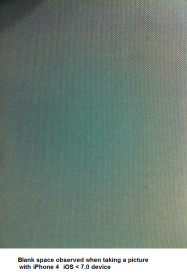

                                 


Camera Properties
=================

The properties for Camera widget are:

* * *


<details close markdown="block"><summary>accessibilityConfig Property</summary>

* * *

Enables you to control accessibility behavior and alternative text for the widget.

For more information on using accessibility features in your app, see the [Accessibility](../../../Iris/app_design_dev/Content/Accessibility_Overview.md) appendix in the VoltMX IrisUser Guide.

### Syntax

```

accessibilityConfig
```

### Type

Object

### Read/Write

Read + Write

### Remarks

*   The accessibilityConfig property is enabled for all the widgets which are supported under the Flex Layout.

> **_Note:_** From VoltMX Iris V9 SP2 GA version, you can provide i18n keys as values to all the attributes used inside the `accessibilityConfig` property. Values provided in the i18n keys take precedence over values provided in `a11yLabel`, `a11yValue`, and `a11yHint` fields.

The accessibilityConfig property is a JavaScript object which can contain the following key-value pairs.

  
| Key | Type | Description | ARIA Equivalent |
| --- | --- | --- | --- |
| a11yIndex | Integer with no floating or decimal number. | This is an optional parameter. Specifies the order in which the widgets are focused on a screen. | For all widgets, this parameter maps to the `aria-index`, `index`, or `taborder` properties. |
| a11yLabel | String | This is an optional parameter. Specifies alternate text to identify the widget. Generally the label should be the text that is displayed on the screen. | For all widgets, this parameter maps to the `aria-labelledby` property of ARIA in HTML. > **_Note:_** For the Image widget, this parameter maps to the **alt** attribute of ARIA in HTML. |
| a11yValue | String | This is an optional parameter. Specifies the descriptive text that explains the action associated with the widget. On the Android platform, the text specified for a11yValue is prefixed to the a11yHint. | This parameter is similar to the a11yLabel parameter. If the a11yValue is defined, the value of a11yValue is appended to the value of a11yLabel. These values are separated by a space. |
| a11yHint | String | This is an optional parameter. Specifies the descriptive text that explains the action associated with the widget. On the Android platform, the text specified for a11yValue is prefixed to the a11yHint. | For all widgets, this parameter maps to the `aria-describedby` property of ARIA in HTML. |
| a11yHidden | Boolean | This is an optional parameter. Specifies if the widget should be ignored by assistive technology. The default option is set to _false_. This option is supported on iOS 5.0 and above, Android 4.1 and above, and SPA | For all widgets, this parameter maps to the `aria-hidden` property of ARIA in HTML. |
| a11yARIA | Object | This is an optional parameter. For each widget, the key and value provided in this object are added as the attribute and value of the HTML tags respectively. Any values provided for attributes such as `aria-labelledby` and `aria-describedby` using this attribute, takes precedence over values given in `a11yLabel` and `a11yHint` fields. When a widget is provided with the following key value pair or attribute using the a11yARIA object, the tabIndex of the widget is automatically appended as zero.`{"role": "main"}``aria-label` | This parameter is only available on the Desktop Web platform. |

Android limitations

*   If the results of the concatenation of a11y fields result in an empty string, then `accessibilityConfig` is ignored and the text that is on widget is read out.
*   The soft keypad does not gain accessibility focus during the right/left swipe gesture when the keypad appears.

SPA/Desktop Web limitations

*   When `accessibilityConfig` property is configured for any widget, the `tabIndex` attribute is added automatically to the `accessibilityConfig` property.
*   The behavior of accessibility depends on the Web browser, Web browser version, Voice Over Assistant, and Voice Over Assistant version.
*   Currently SPA/Desktop web applications support only a few ARIA tags. To achieve more accessibility features, use the attribute a11yARIA. The corresponding tags will be added to the DOM as per these configurations.

### Example 1

This example uses the button widget, but the principle remains the same for all widgets that have an accessibilityConfig property.

```
//This is a generic property that is applicable for various widgets.
//Here, we have shown how to use the accessibilityConfig Property for button widget.
/*You need to make a corresponding use of the accessibilityConfig property for other applicable widgets.*/

Form1.myButton.accessibilityConfig = {
    "a11yLabel": "Label",
    "a11yValue": "Value",
    "a11yHint": "Hint"    
};
```

### Example 2

This example uses the button widget to implement internationalization in `accessibilityConfig` property, but the principle remains the same for all widgets.

```
/*Sample code to implement internationalization in accessibilityConfig property in Native platform.*/

Form1.myButton.accessibilityConfig = {
    "a11yLabel": voltmx.i18n.getLocalizedString("key1")     
};  
/*Sample code to implement internationalization in accessibilityConfig property in Desktop Web platform.*/

Form1.myButton.accessibilityConfig = {
    "a11yLabel": "voltmx.i18n.getLocalizedString(\"key3\")"
};
```

### Platform Availability

*   Available in the IDE
*   iOS, Android, SPA, and Desktop Web

* * *

</details>
<details close markdown="block"><summary>accessMode Property</summary>

* * *

Specifies how the captured image must be stored.

### Syntax

```

accessMode
```

### Type

Number

### Read/Write

Read + Write

Read only in the iOS platform.

### Remarks

The default value for the property is constants.CAMERA\_ACCESS\_MODE\_PUBLIC (except on Windows).

The options are:

*   constants.CAMERA\_ACCESS\_MODE\_PUBLIC: The captured image or video is stored on the device and is accessible to all the applications on the device. For example, the captured images are accessible in the ImageGallery.
*   constants.CAMERA\_ACCESS\_MODE\_PRIVATE: This is the default option for Windows. The captured image or video is stored on the device and is not accessible to any other application on the device.

> **_Note:_** In the Android platform, CAMERA\_ACCESS\_MODE\_PRIVATE is not respected when the enbaleOverlay property is set to false.

*   constants.CAMERA\_ACCESS\_MODE\_INMEMORY: For videos, the option is supported only on the iOS platform. The captured camera image or video is stored in memory and is never written to the disk.

> **_Note:_** In the Android platform, CAMERA\_ACCESS\_MODE\_INMEMORY is not respected if the enableOverlay property is set to true and the captureMode is video, and even if the enableOverlay property is set to false.

For backward compatibility, the following options are also supported:

*   CAMERA\_IMAGE\_ACCESS\_MODE\_PUBLIC
*   CAMERA\_IMAGE\_ACCESS\_MODE\_PRIVATE
*   CAMERA\_IMAGE\_ACCESS\_MODE\_INMEMORY

### Example

```
//Sample code to set accessMode property for Camera widget.

frmCamera.myCamera.accessMode=constants.CAMERA_ACCESS_MODE_PRIVATE;
```

### Platform Availability

Available in the IDE.

*   iPhone
*   iPad
*   Android
*   Windows

* * *

</details>
<details close markdown="block"><summary>backgroundColor Property</summary>

* * *

Specifies the background color of the widget.

### Syntax

```

backgroundColor
```

### Type

Color constant or Hexadecimal number

### Read/Write

Read + Write

### Remarks

*   The initial value of backgroundColor has to be specified explicitly. If not, Iris will not deduce the values from the existing skin and this will lead to undefined behavior.
*   Colors can be specified using a 6 digit or an 8-digit hex value with alpha position. For example, ffff65 or ffffff00.
*   When the 4-byte color format (RGBA) string is used, an alpha (A) value of 65 specifies that the color is transparent. If the value is 00, the color is opaque. The Alpha value is in percentage and must be given in the hexadecimal value for the color (100% in hexadecimal value is 65).  
    For example, red complete opaque is FF000000. Red complete transparent is FF000065. The values 0x and # are not allowed in the string.
*   A color constant is a String that is defined at the theme level. Ensure that you append the **$** symbol at the beginning of the color constant.
*   This property does not have a default value.
*   This property has more priority than (and overrides) the background property of the configured skin. Even if there is no skin configured for the widget, this property updates the skin.
*   The backgroundColor, backgroundColorTwoStepGradient, backgroundColoMultiStepGradient, and backgroundImage properties are mutually exclusive. The property that was set most recently is given higher priority over other properties.

### Example

This example uses the button widget, but the principle remains the same for all widgets that have the backgroundColor property.

```
Form1.btn1.backgroundColor = "ea5075";

```

### Platform Availability

*   Android
*   iOS
*   Desktop Web (Not available on Desktop Web Legacy SDK)

* * *

</details>
<details close markdown="block"><summary>backgroundColorMultiStepGradient Property</summary>

* * *

Specifies the multi-step gradient color for the background of the widget.

### Syntax

```

backgroundColorMultiStepGradient
```

### Type

JSON Object

### Read/Write

Read + Write

Input Parameters

*   **gradientType** \[Constant\]: Specifies the configuration type of the gradient. This parameter can have the following constant values:
    
    *   `voltmx.skin.MULTI_STEP_GRADIENT_TYPE_TO_TOP`: Constant for the gradient type toTop.
    *   `voltmx.skin.MULTI_STEP_GRADIENT_TYPE_TO_RIGHT`: Constant for the gradient type toRight.
    *   `voltmx.skin.MULTI_STEP_GRADIENT_TYPE_TO_BOTTOM`: Constant for the gradient type toBottom.
    *   `voltmx.skin.MULTI_STEP_GRADIENT_TYPE_TO_LEFT`: Constant for the gradient type toLeft.
    *   `voltmx.skin.MULTI_STEP_GRADIENT_TYPE_CUSTOM`: Constant for the gradient type custom.  
        For the custom gradient type, you must specify the angle by using the [angle](#angle) property.
*   **angle** \[Number\]: Specifies the angle for the gradient in degrees, counted counter-clockwise. This property is only applicable for the custom gradient type.
*   **colors** \[Array\]: Specifies the colors for the multi-step gradient. Colors is an array of color hex values that indicate the reference color values of the gradient. This parameter contains an array of hexadecimal numbers that represent the colors or constants defined at the theme level.
*   **colorStops** \[Array\]: Specifies the color stops for the multi-step gradient. Color Stops are the locations of the reference colors on the gradient, from 0 (the start of the gradient) to 100 (the final value of the gradient). This parameter contains an array of numbers that represent the color stops.

### Remarks

*   The default value of the gradientType key is `voltmx.skin.MULTI_STEP_GRADIENT_TYPE_TO_TOP`.
*   Colors can be specified using a 6 digit or an 8-digit hex value with alpha position. For example, ffff65 or ffffff00.
*   When the 4-byte color format (RGBA) string is used, an alpha (A) value of 65 specifies that the color is transparent. If the value is 00, the color is opaque. The Alpha value is in percentage and must be given in the hexadecimal value for the color (100% in hexadecimal value is 65).  
    For example, red complete opaque is FF000000. Red complete transparent is FF000065. The values 0x and # are not allowed in the string.
*   A color constant is a String that is defined at the theme level. Ensure that you append the **$** symbol at the beginning of the color constant.
*   This property does not have a default value.
*   This property has more priority than (and overrides) the background property of the configured skin. Even if there is no skin configured for the widget, this property updates the skin.
*   The backgroundColor, backgroundColorTwoStepGradient, backgroundColoMultiStepGradient, and backgroundImage properties are mutually exclusive. The property that was set most recently is given higher priority over other properties.

### Example

This example uses the button widget, but the principle remains the same for all widgets that have the backgroundColorMultiStepGradient property.

```
Form1.btn1.backgroundColorMultiStepGradient = {
    "gradientType": voltmx.skin.MULTI_STEP_GRADIENT_TYPE_CUSTOM  
    "angle": 45,
    "colors": ["ea5075", "f1fa70", "eefd04"],
    "colorStops": [0, 90, 100]
};
```

### Platform Availability

*   Android
*   iOS
*   Desktop Web (Not available on Desktop Web Legacy SDK)

* * *

</details>
<details close markdown="block"><summary>backgroundColorTwoStepGradient Property</summary>

* * *

Specifies the two-step gradient color for the background of the widget.

### Syntax

```

backgroundColorTwoStepGradient
```

### Type

JSON Object

### Read/Write

Read + Write

Input Parameters

*   **topColor** \[Constant or Hex\]: Specifies the top color of the two-step gradient. The value of this parameter can be a hexadecimal number that represents a color or a constant that is defined at the theme level.
    
*   **bottomColor** \[Constant or Hex\]:Specifies the bottom color of the two-step gradient. The value of this parameter can be a hexadecimal number that represents a color or a constant that is defined at the theme level.
    
*   **style** \[Constant\]: Specifies the configuration style of the two-step gradient. This parameter can have the following constant values:
    
    *   `voltmx.skin.TWO_STEP_GRADIENT_STYLE_VERTICAL_GRADIENT`: Constant for the vertical gradient style.
    *   `voltmx.skin.TWO_STEP_GRADIENT_STYLE_VERTICAL_SPLIT`: Constant for the vertical split style.
    *   `voltmx.skin.TWO_STEP_GRADIENT_STYLE_HORIZONTAL_GRADIENT`: Constant for the horizontal gradient style.
    *   `voltmx.skin.TWO_STEP_GRADIENT_STYLE_HORIZONTAL_SPLIT`: Constant for the horizontal split style.

### Remarks

*   The default value of the style key is `voltmx.skin.TWO_STEP_GRADIENT_STYLE_VERTICAL_GRADIENT`.
*   Colors can be specified using a 6 digit or an 8-digit hex value with alpha position. For example, ffff65 or ffffff00.
*   When the 4-byte color format (RGBA) string is used, an alpha (A) value of 65 specifies that the color is transparent. If the value is 00, the color is opaque. The Alpha value is in percentage and must be given in the hexadecimal value for the color (100% in hexadecimal value is 65).  
    For example, red complete opaque is FF000000. Red complete transparent is FF000065. The values 0x and # are not allowed in the string.
*   A color constant is a String that is defined at the theme level. Ensure that you append the **$** symbol at the beginning of the color constant.
*   This property does not have a default value.
*   This property has more priority than (and overrides) the background property of the configured skin. Even if there is no skin configured for the widget, this property updates the skin.
*   The backgroundColor, backgroundColorTwoStepGradient, backgroundColoMultiStepGradient, and backgroundImage properties are mutually exclusive. The property that was set most recently is given higher priority over other properties.

### Example

This example uses the button widget, but the principle remains the same for all widgets that have the backgroundColorTwoStepGradient property.

```
Form1.btn1.backgroundColorTwoStepGradient = {  
     "topColor": "ea5075",  
    "bottomColor": "eefd04",  
    "style": voltmx.skin.TWO_STEP_GRADIENT_STYLE_VERTICAL_GRADIENT  
};
```

### Platform Availability

*   Android
*   iOS
*   Desktop Web (Not available on Desktop Web Legacy SDK)

* * *

</details>
<details close markdown="block"><summary>backgroundImage Property</summary>

* * *

Sets the image for the background of the widget.

### Syntax

```

backgroundImage
```

### Type

String

### Read/Write

Read + Write

### Remarks

*   This property does not have a default value.
*   This property has more priority than (and overrides) the background property of the configured skin. Even if there is no skin configured for the widget, this property updates the skin.
*   The backgroundColor, backgroundColorTwoStepGradient, backgroundColoMultiStepGradient, and backgroundImage properties are mutually exclusive. The property that was set most recently is given higher priority over other properties.

### Example

This example uses the button widget, but the principle remains the same for all widgets that have the backgroundImage property.

```
Form1.btn1.backgroundImage = "bgImg.png";
```

### Platform Availability

*   Android
*   iOS
*   Desktop Web (Not available on Desktop Web Legacy SDK)

* * *

</details>
<details close markdown="block"><summary>base64 Property</summary>

* * *

Returns the base64-encoded string of the image raw bytes. If the image source is a URL, and if the image is not downloaded, or if it encounters an error while downloading, _null/nil_ is returned.

### Syntax

```

base64
```

### Type

JSObject

### Read/Write

Read + Write

### Remarks

This is a **non-constructor** property. You cannot set the property through a widget constructor. But you can read and write data to the property.

### Example

```

//Using base64 property in a form frmOnclick
function customhandlerbase64(camerawidget){
	frmOnclick2.img1.base64 = camerawidget.base64;
	frmOnclick2.show();
}
```

### Platform Availability

*   Not available in the IDE
*   Android
*   iOS
*   Windows
*   Desktop Web

* * *

</details>
<details close markdown="block"><summary>borderColor Property</summary>

* * *

Specifies the border color of the widget.

### Syntax

```

borderColor
```

### Type

Color constant or Hexadecimal number

### Read/Write

Read + Write

### Remarks

*   Colors can be specified using a 6 digit or an 8-digit hex value with alpha position. For example, ffff65 or ffffff00.
*   When the 4-byte color format (RGBA) string is used, an alpha (A) value of 65 specifies that the color is transparent. If the value is 00, the color is opaque. The Alpha value is in percentage and must be given in the hexadecimal value for the color (100% in hexadecimal value is 65).  
    For example, red complete opaque is FF000000. Red complete transparent is FF000065. The values 0x and # are not allowed in the string.
*   A color constant is a String that is defined at the theme level. Ensure that you append the **$** symbol at the beginning of the color constant.
*   This property does not have a default value.
*   This property has more priority than (and overrides) the border property of the configured skin. Even if there is no skin configured for the widget, this property updates the skin.

### Example

This example uses the button widget, but the principle remains the same for all widgets that have the borderColor property.

```
Form1.btn1.borderColor = "ea5075";
```

### Platform Availability

*   Android
*   iOS
*   Desktop Web (Not available on Desktop Web Legacy SDK)

* * *

</details>
<details close markdown="block"><summary>borderColorGradient Property</summary>

* * *

Specifies the multi-step gradient color for the border of the widget.

### Syntax

```

borderColorGradient
```

### Type

JSON Object

### Read/Write

Read + Write

Input Parameters

*   **gradientType** \[Constant\]: Specifies the configuration type of the gradient. This parameter can have the following constant values:
    
    *   `voltmx.skin.MULTI_STEP_GRADIENT_TYPE_TO_TOP`: Constant for the gradient type toTop.
    *   `voltmx.skin.MULTI_STEP_GRADIENT_TYPE_TO_RIGHT`: Constant for the gradient type toRight.
    *   `voltmx.skin.MULTI_STEP_GRADIENT_TYPE_TO_BOTTOM`: Constant for the gradient type toBottom.
    *   `voltmx.skin.MULTI_STEP_GRADIENT_TYPE_TO_LEFT`: Constant for the gradient type toLeft.
    *   `voltmx.skin.MULTI_STEP_GRADIENT_TYPE_CUSTOM`: Constant for the gradient type custom.  
        For the custom gradient type, you must specify the angle by using the [angle](#angle) property.
*   **angle** \[Number\]: Specifies the angle for the gradient in degrees, counted counter-clockwise. This property is only applicable for the custom gradient type.
*   **colors** \[Array\]: Specifies the colors for the multi-step gradient. Colors is an array of color hex values that indicate the reference color values of the gradient. This parameter contains an array of hexadecimal numbers that represent the colors or constants defined at the theme level.
*   **colorStops** \[Array\]: Specifies the color stops for the multi-step gradient. Color Stops are the locations of the reference colors on the gradient, from 0 (the start of the gradient) to 100 (the final value of the gradient). This parameter contains an array of numbers that represent the color stops.

### Remarks

*   The default value of the gradientType key is `voltmx.skin.MULTI_STEP_GRADIENT_TYPE_TO_TOP`.
*   Colors can be specified using a 6 digit or an 8-digit hex value with alpha position. For example, ffff65 or ffffff00.
*   When the 4-byte color format (RGBA) string is used, an alpha (A) value of 65 specifies that the color is transparent. If the value is 00, the color is opaque. The Alpha value is in percentage and must be given in the hexadecimal value for the color (100% in hexadecimal value is 65).  
    For example, red complete opaque is FF000000. Red complete transparent is FF000065. The values 0x and # are not allowed in the string.
*   A color constant is a String that is defined at the theme level. Ensure that you append the **$** symbol at the beginning of the color constant.
*   This property does not have a default value.
*   This property has more priority than (and overrides) the border property of the configured skin. Even if there is no skin configured for the widget, this property updates the skin.

### Example

This example uses the button widget, but the principle remains the same for all widgets that have the borderColorGradient property.

```
Form1.btn1.borderColorGradient = {
    "gradientType": voltmx.skin.MULTI_STEP_GRADIENT_TYPE_CUSTOM  
    "angle": 45,
    "colors": ["ea5075", "f1fa70", "eefd04"],
    "colorStops": [0, 90, 100]
};
```

### Platform Availability

*   Android
*   iOS

* * *

</details>
<details close markdown="block"><summary>borderStyle Property</summary>

* * *

Specifies the border style for the widget.

### Syntax

```

borderStyle
```

### Type

Constant

### Read/Write

Read + Write

### Remarks

*   This property can have the following constant values:
    
    *   **voltmx.skin.BORDER\_STYLE\_PLAIN**: Constant for the plain border style.
    *   **voltmx.skin.BORDER\_STYLE\_ROUNDED\_CORNER**: Constant for the rounded corner style.
    *   **voltmx.skin.BORDER\_STYLE\_COMPLETE\_ROUNDED\_CORNER**: Constant for the complete rounded corner style.
    *   **voltmx.skin.BORDER\_STYLE\_CUSTOM**: Constant for the custom border style.
*   The cornerRadius property is only applicable when the borderStyle is voltmx.skin.BORDER\_STYLE\_CUSTOM.
*   This property does not have a default value.
*   This property has more priority than (and overrides) the border property of the configured skin. Even if there is no skin configured for the widget, this property updates the skin.

### Example

This example uses the button widget, but the principle remains the same for all widgets that have the borderStyle property.

```
Form1.btn1.borderStyle = voltmx.skin.BORDER_STYLE_PLAIN;
```

### Platform Availability

*   Android
*   iOS

* * *

</details>
<details close markdown="block"><summary>borderWidth Property</summary>

* * *

Specifies the width of the border for the widget in pixels.

### Syntax

```

borderWidth
```

### Type

Number or JSON Object

### Read/Write

Read + Write

### Remarks

*   This property does not have a default value.
*   The default unit for the value of this property is pixels.
*   The Desktop Web platform supports both Number and JSON Object (with the top, bottom, right, and left keys) values for the borderWidth parameter. The Android and iOS platforms support only Number values for the borderWidth parameter.
*   This property has more priority than (and overrides) the border property of the configured skin. Even if there is no skin configured for the widget, this property updates the skin.

### Example

This example uses the button widget, but the principle remains the same for all widgets that have the borderWidth property.

```
 Form1.btn1.borderWidth = 2;
```

### Platform Availability

*   Android
*   iOS
*   Desktop Web (Not available on Desktop Web Legacy SDK)

 

* * *

</details>
<details close markdown="block"><summary>bottom Property</summary>

* * *

This property determines the bottom edge of the widget and is measured from the bottom bounds of the parent container.

The bottom property determines the position of the bottom edge of the widget’s bounding box. The value may be set using DP (Device Independent Pixels), Percentage, or Pixels. In freeform layout, the distance is measured from the bottom edge of the parent container. In flow-vertical layout, the value is ignored. In flow-horizontal layout, the value is ignored.

The bottom property is used only if the Height property is not provided.

### Syntax

```

bottom
```

### Type

String

### Read/Write

Read + Write

### Remarks

The property determines the bottom edge of the widget and is measured from the bottom bounds of the parent container.

If the layoutType is set as voltmx.flex.FLOW\_VERTICAL, the bottom property is measured from the top edge of bottom sibling widget. The vertical space between two widgets is measured from bottom of the top sibling widget and the top of the bottom sibling widget.

### Example

```
//Sample code to set the bottom property for widgets by using DP, Percentage and Pixels.
frmHome.widgetID.bottom = "50dp";

frmHome.widgetID.bottom = "10%";

frmHome.widgetID.bottom = "10px";
```

### Platform Availability

*   Available in the IDE
*   iOS, Android, Windows, SPA , and Desktop Web

* * *

</details>
<details close markdown="block"><summary>cameraOptions Property</summary>

* * *

Specifies the camera options that can be used on a form.

### Syntax

```

cameraOptions
```

### Type

JSObject

### Read/Write

Read + Write

### Remarks

The following are the configurable properties:

*   **flashMode**:Enables you to control the flash on the device when the camera is turned on.
    
    > **_Note:_** Devices may have different flash capabilities that are dependent on the camera driver.
    
    Default:_constants.FLASH\_MODE\_AUTO_
    
    The options are:
    
    *   constants.FLASH\_MODE\_AUTO: Specifies the flash must be turned on when required.
    *   constants.FLASH\_MODE\_ON: Specifies the flash must be turned on when you take a picture.
    *   constants.FLASH\_MODE\_OFF: Specifies the flash must not be turned on even when you take a picture.
    *   constants.FLASH\_MODE\_ALWAYS\_ON: Specifies the flash must not be turned on constantly when the camera is open. On the Android platform, the option is respected only when the overlay form is enabled.
*   **hideControlBar**:Enables you to show or hide the default control bar (capture and cancel buttons) of the respective platforms. Default:_false_
    
    > **_Note:_** For the iOS 7 and later versions, when the hideControlBar is set to true, there will be a blank space (black or white color) in place of camera control bar in an iPhone device. The space of the control bar depends on the device model (iPhone 5 has 96px and iPhone 4 has 54 px).Note the space of the control bar when designing the overlay form for the camera.
    
    > **_Note:_** The hideControlBar is applicable only when the enableOverlay property is set to true.
    
     
    
*   **focusMode**: Specifies the focus mode for the camera. This option is available only for Android platform and is respected when the enableOverlay is set to true. The different values that can be assigned to this property are as follows:
    *   constants.CAMERA\_FOCUS\_MODE\_AUTO (Default value for photo mode)
    *   constants.CAMERA\_FOCUS\_MODE\_CONTINUOUS (Default value for video mode)  
        

### Example

```
//Sample code to set cameraOptions property for Camera widget.

frmCamera.myCamera.cameraOptions={
        flashMode: "constants.FLASH_MODE_ON",
        hideControlBar: true,
        focusMode: "constants.FOCUS_MODE_CONTINUOUS"
    };
```

### Platform Availability

*   Not available in the IDE
*   iPhone
*   iPad
*   Android
*   Windows

* * *

</details>
<details close markdown="block"><summary>captureOrientation Property</summary>

* * *

Specifies the orientation of the captured image.

### Syntax

```

captureOrientation
```

### Type

Number

### Read/Write

Read + Write

Read only in the iOS platform.

### Remarks

The default value for the property is CAMERA\_CAPTURE\_ORIENTATION\_DEFAULT

> **_Note:_** The property works for the complete image and not for the cropped image when [referenceImageToCrop](#overlayC) is not provided. In cases where referenceImageToCrop is provided, the property is ignored.

> **_Note:_** For Windows 10, irrespective of the orientation, if the image has to be appeared as it is capture, set the displayOrientation as FORM\_DISPLAY\_ORIENTATION\_BOTH. If you set displayOrientation as FORM\_DISPLAY\_ORIENTATION\_PORTRAIT and the image is captured in landscape mode, then the captured image is tilted by 90 degrees when the device is rotated.

The options are:

*   CAMERA\_CAPTURE\_ORIENTATION\_LANDSCAPE: On the device the camera is always turned sideways so that the height of the screen becomes the width.
*   CAMERA\_CAPTURE\_ORIENTATION\_PORTRAIT: On the device the camera is always displayed such that the horizontal sides are shorter than the vertical sides.

### Example

```
//Sample code to set captureOrientation property for Camera widget.

frmCamera.myCamera.captureOrientation=constants.CAMERA_CAPTURE_ORIENTATION_LANDSCAPE;
```

### Platform Availability

*   Available in the IDE
*   iPhone
*   iPad

* * *

</details>
<details close markdown="block"><summary>captureMode Property</summary>

* * *

Specifies the capture mode of the camera.

### Syntax

```

captureMode
```

### Type

Number

### Read/Write

Read + Write

### Remarks

> **_Note:_** For Android platform, any changes to this property is ignored when the preview is on.

The options are:

*   constants.CAMERA\_CAPTURE\_MODE\_PHOTO (Default)
*   constants.CAMERA\_CAPTURE\_MODE\_VIDEO

> **_Note:_** In the Android platform, set the app level permissions CAMERA, WRITE\_EXTERNAL\_STORAGE and CAMERA\_RECORD\_AUDIO to record a video.

### Example

```
//Sample code to set captureMode property for Camera widget.

frmCamera.myCamera.captureMode=constants.CAMERA_CAPTURE_MODE_VIDEO;
```

### Platform Availability

*   Available in the IDE
*   iPhone
*   iPad
*   Android

* * *

</details>
<details close markdown="block"><summary>cameraSource Property</summary>

* * *

Specifies the source of the camera, either front or rear.

### Syntax

```

cameraSource
```

### Type

Number

### Read/Write

Read + Write

### Remarks

The options are:

*   constants.CAMERA\_SOURCE\_DEFAULT (Default Value)
*   constants.CAMERA\_SOURCE\_REAR
*   constants.CAMERA\_SOURCE\_FRONT

> **_Note:_** For the Android platform when the cameraSource is set to default, the platform checks for the rear camera. If the rear camera does not exist, the platform checks for the front camera. The property is not supported when the property _enableOverlay_ is set to false.

> **_Note:_** For the Android platform, in video mode, changing this property when the preview is on, requires setting the videoQualityLevel appropriately. otherwise, the onFailure event is invoked with an error code as CAMERA\_PREVIEW\_UNAVAILABLE. This happens because different camera sources have different quality levels supported, so before using particular source, supported level value needs to be set.

> **_Note:_** For Windows 10 tablet, if you set the cameraSource property to constants.CAMERA\_SOURCE\_REAR, the Custom Camera UI is rendered. However, if you set the cameraSource property for Windows 10 tablet to either the constants.CAMERA\_SOURCE\_FRONT or the constants.CAMERA\_SOURCE\_DEFAULT value, the Native Camera UI is rendered.

The following table illustrates the various differences between Native Camera UI and Custom Camera UI.

<table style="width: 100%;mc-table-style: url('Resources/TableStyles/Basic.css');" class="TableStyle-Basic" cellspacing="0"><colgroup><col class="TableStyle-Basic-Column-Column1" style="width: 50%;"> <col class="TableStyle-Basic-Column-Column1" style="width: 50%;"></colgroup><tbody><tr class="TableStyle-Basic-Body-Body1"><td class="TableStyle-Basic-BodyE-Column1-Body1" style="text-align: center;font-weight: bold;"><span style="font-size: 12pt;">Native Camera UI</span></td><td class="TableStyle-Basic-BodyD-Column1-Body1" style="text-align: center;font-size: 12pt;"><b>Custom Camera UI</b></td></tr><tr class="TableStyle-Basic-Body-Body1"><td class="TableStyle-Basic-BodyE-Column1-Body1" style="text-align: left;">Brightness settings option is available.</td><td class="TableStyle-Basic-BodyD-Column1-Body1">Brightness settings option is not available.</td></tr><tr class="TableStyle-Basic-Body-Body1"><td class="TableStyle-Basic-BodyE-Column1-Body1">You can resize the camera window, even though Maximize and Minimize buttons are not available.</td><td class="TableStyle-Basic-BodyD-Column1-Body1">You cannot resize the camera window.</td></tr><tr class="TableStyle-Basic-Body-Body1"><td class="TableStyle-Basic-BodyE-Column1-Body1">After you capture an image, the captured image is displayed for saving or deleting.</td><td class="TableStyle-Basic-BodyD-Column1-Body1">The captured image is automatically saved in the Pictures folder/application local location/in phone memory, based on the Camera widget access mode .</td></tr><tr class="TableStyle-Basic-Body-Body1"><td class="TableStyle-Basic-BodyE-Column1-Body1">Once you save the captured image, the UI closes automatically.</td><td class="TableStyle-Basic-BodyD-Column1-Body1">The captured image is automatically saved but the UI dialog does not close; you must close it by clicking the X button at the upper right corner of the screen.</td></tr><tr class="TableStyle-Basic-Body-Body1"><td class="TableStyle-Basic-BodyB-Column1-Body1">You can move the camera window.</td><td class="TableStyle-Basic-BodyA-Column1-Body1">You cannot move the camera window.</td></tr></tbody></table>

Native Camera UI


Custom Camera UI


### Example

```
//Sample code to set cameraSource property for Camera widget.

frmCamera.myCamera.cameraSource=constants.CAMERA_SOURCE_FRONT;
```

### Platform Availability

*   Available in the IDE
*   iPhone
*   iPad
*   Android
*   Desktop Web

* * *

</details>
<details close markdown="block"><summary>centerX Property</summary>

* * *

This property determines the center of a widget measured from the left bounds of the parent container.

The centerX property determines the horizontal center of the widget’s bounding box. The value may be set using DP (Device Independent Pixels), Percentage, or Pixels. In freeform layout, the distance is measured from the left edge of the parent container. In flow-vertical layout, the distance is measured from the left edge of the parent container. In flow-horizontal layout, the distance is measured from the right edge of the previous sibling widget in the hierarchy.

### Syntax

```

centerX
```

### Type

String

### Read/Write

Read + Write

### Remarks

If the layoutType is set as voltmx.flex.FLOW\_HORIZONTAL, the centerX property is measured from right edge of the left sibling widget.

### Example

```
//Sample code to set the centerX property for widgets by using DP, Percentage and Pixels.
frmHome.widgetID.centerX = "50dp";

frmHome.widgetID.centerX = "10%";

frmHome.widgetID.centerX = "10px";
```

### Platform Availability

*   Available in the IDE
*   iOS, Android, Windows, SPA, and Desktop Web

* * *

</details>
<details close markdown="block"><summary>centerY Property</summary>

* * *

This property determines the center of a widget measured from the top bounds of the parent container.

The centerY property determines the vertical center of the widget’s bounding box. The value may be set using DP (Device Independent Pixels), Percentage, or Pixels. In freeform layout, the distance is measured from the top edge of the parent container. In flow-horizontal layout, the distance is measured from the top edge of the parent container. In flow-vertical layout, the distance is measured from the bottom edge of the previous sibling widget in the hierarchy.

### Syntax

```

centerY
```

### Type

String

### Read/Write

Read + Write

### Remarks

If the layoutType is set as voltmx.flex.FLOW\_VERTICAL, the centerY property is measured from bottom edge of the top sibling widget.

### Example

```
//Sample code to set the centerY property for widgets by using DP, Percentage and Pixels.
frmHome.widgetID.centerY = "50dp";

frmHome.widgetID.centerY = "10%";

frmHome.widgetID.centerY = "10px";
```

### Platform Availability

*   Available in the IDE
*   iOS, Android, Windows, SPA, and Desktop Web

* * *

</details>
<details close markdown="block"><summary>compressionLevel Property</summary>

* * *

Specifies the compression level or picture quality with which the captured image must be stored. You can specify the compression level value between 0 (best picture quality) and 100 (low picture quality).

### Syntax

```

compressionLevel
```

### Type

Number

### Read/Write

Read + Write

### Remarks

The default value for the property is 0. The property is applicable only when the imageFormat is jpeg.

> **_Note:_** In the Android platform, the compressionLevel property is respected only when the enableOverlay is set to true and the captureMode is set to camera mode. Even if the enableOverlay is set to true and if the captureMode is set as video mode, the compressionLevel property is not respected.

### Example

```
//Sample code to set compressionLevel property for Camera widget.

frmCamera.myCamera.compressionLevel=25;
```

### Platform Availability

*   Available in the IDE
*   Available on all platforms except SPA.

* * *

</details>
<details close markdown="block"><summary>contentAlignment Property</summary>

* * *

This property specifies the alignment of the text on the widget with respect to its boundaries.

### Syntax

```

contentAlignment
```

### Type

Number

### Read/Write

Read+Write

### Remarks

The default value for the property is _CONTENT\_ALIGN\_CENTER_.

The following are the available options:

*   constants.CONTENT\_ALIGN\_TOP\_LEFT
*   constants.CONTENT\_ALIGN\_TOP\_CENTER
*   constants.CONTENT\_ALIGN\_TOP\_RIGHT
*   constants.CONTENT\_ALIGN\_MIDDLE\_LEFT
*   constants.CONTENT\_ALIGN\_CENTER
*   constants.CONTENT\_ALIGN\_MIDDLE\_RIGHT
*   constants.CONTENT\_ALIGN\_BOTTOM\_LEFT
*   constants.CONTENT\_ALIGN\_BOTTOM\_CENTER
*   constants.CONTENT\_ALIGN\_BOTTOM\_RIGHT

Limitations

Desktop Web/ SPA platforms do not support _contentAlignment_ property in Camera widget, ComboBox widget and ListBox widget.

### Example

```
/*Sample code to set the contentAlignment property of the widgetID Button widget in frmHome Form.*/  
  
frmHome.widgetID.contentAlignment=constants.CONTENT_ALIGN_TOP_LEFT;  

```

### Platform Availability

*   Available in IDE
*   Available on all platforms

* * *

</details>
<details close markdown="block"><summary>cornerRadius Property</summary>

* * *

Specifies the radius of the border for the widget.

### Syntax

```

cornerRadius
```

**### Type**

Number or JSON Object

### Read/Write

Read + Write

### Remarks

*   The cornerRadius property is only applicable when the borderStyle is voltmx.skin.BORDER\_STYLE\_CUSTOM.
*   For a Responsive Web app, a corner radius of value zero applies a plain border, and a corner radius value greater than zero applies a rounded border.
*   The Android and Desktop Web platforms support both Number and JSON Object (with the top, bottom, right, and left keys) values for the cornerRadius parameter. The iOS platform supports only Number values for the cornerRadius parameter.
*   The default unit for the value of this property is pixels.
*   This property does not have a default value.
*   This property has more priority than (and overrides) the border property of the configured skin. Even if there is no skin configured for the widget, this property updates the skin.

### Example

This example uses the button widget, but the principle remains the same for all widgets that have the cornerRadius property.

```
 Form1.btn1.cornerRadius = 60;
```

### Platform Availability

*   Android
*   iOS
*   Desktop Web (Not available on Desktop Web Legacy SDK)

 

* * *

</details>
<details close markdown="block"><summary>cursorType Property</summary>

* * *

In Desktop Web applications, when you hover the mouse over any widget, a mouse pointer appears. Using the cursorType property in Iris, you can specify the type of the mouse pointer.

### Syntax

```

cursorType
```

### Type

String.

You must provide valid CSS cursor value such as wait, grab, help, etc. to the cursorType property.

### Read/Write

Read + Write

### Remarks

To add the `cursorType` property using VoltMX Iris in a Desktop Web application, follow these steps.

1.  In VoltMX Iris, open the Desktop Web application. From the **Project** explorer, expand **Responsive Web/ Desktop**\> **Forms** and select the form to which you need to make the changes.
2.  On the canvas, select the widget for which you want to specify the cursor type. For example, button.
3.  From the **Properties** panel, navigate to the **Skin** tab > **Hover Skin** tab.  
    You will find that the details of the hover skin is not enabled here.
4.  Check the **Enable** option to add a hover skin to your widget.  
    The details and configurations of the hover skin is enabled.
5.  Under the **General** section, for the Platform option, click the ellipsis icon.  
    The **Fork Skin** window appears.
6.  In the **Fork Skin** window, for **Desktop**, check under **HTML5 SPA**.
7.  Click **Ok**. You have successfully forked your hover skin for Desktop Web application.  
    You can see that the **Cursor Type** property has been added under the **General** section.
8.  Select a value from the drop-down list to set the **Cursor Type** for the widget.

### Example

```
 //This is a generic property and is applicable for many widgets.  
  
/*The example provided is for the Button widget. Make the required changes in the example while using other widgets.*/
  
frmButton.myButton.cursorType = "wait";

```

### Platform Availability

*   Available in IDE
*   Desktop Web

* * *

</details>
<details close markdown="block"><summary>disabledStateSkinProperties Property</summary>

* * *

Specifies the skin properties that define the look and feel of the widget, when the widget is disabled or blocked.

### Syntax

```

disabledStateSkinProperties
```

### Type

JSON Object

### Read/Write

Read + Write

### Remarks

*   This property does not have a default value.
*   This property has more priority than (and overrides) the disabledSkin property of the configured skin. Even if there is no skin configured for the widget, this property updates the skin.

### Example

This example uses the button widget, but the principle remains the same for all widgets that have the disabledStateSkinProperties property.

```
Form1.btn1.disabledStateSkinProperties= {  
     background: {  
        backgroundType: voltmx.skin.BACKGROUND_TYPE_MULTI_STEP_GRADIENT,  
        backgroundColorMultiStepGradient : {  
            gradientType: voltmx.skin.MULTI_STEP_GRADIENT_TYPE_TO_TOP,  
            colors: ["ea5075", "f1fa70", "eefd04"],  
            colorStops: [0, 90, 100]  
        },  
    },  
    border: {  
        borderType: voltmx.skin.BORDER_TYPE_SINGLE_COLOR,  
        borderColor: "ea5075",  
        borderStyle: voltmx.skin.BORDER_STYLE_PLAIN,  
        borderWidth: 50  
    },  
    fonts: {  
        fontColor: "ea5075",  
        fontFamily: "Serif",  
        fontSize: '100',  
        fontStyle: voltmx.skin.FONT_STYLE_NONE,  
        fontWeight: voltmx.skin.FONT_WEIGHT_NORMAL  
    },  
    textShadow: {  
        textShadowRadius: 5,  
        textShadowColor: "ea5075",  
        textShadowOffset: {  
            x: 20,  
            y: 4  
        }  
    }
```

### Platform Availability

*   Android

* * *

* * *

</details>
<details close markdown="block"><summary>enable Property</summary>

* * *

The `enable` property is used to control the actionability of the widgets. In a scenario where you want to display a widget but not invoke any action on the widget, configure the `enable` property to false to achieve it.

This is a constructor level property and applicable for all widgets in VoltMX Iris.

### Syntax

```

enable
```

### Type

Boolean

### Read/Write

Read + Write

### Remarks

The default value of this property is true.

When `enable` property is configured to true, the action associated with a widget can be invoked by the user in the application.

When `enable` property is configured to false, the action associated with a widget cannot be invoked by the user in the application.

### Example

```
//This is a generic property and is applicable for many widgets.  
  
/*The example provided is for the Button widget. Make the changes required in the example while using other widgets.*/
  
frmButton.myBtn.enable= true;
```

### Platform Availability

*   Android, iOS, Windows, SPA, and Desktop web

 

* * *

</details>
<details close markdown="block"><summary>enableCache Property</summary>

* * *

The property enables you to improve the performance of Positional Dimension Animations.

### Syntax

```

enableCache
```

### Type

Boolean

### Read/Write

Read + Write

### Remarks

The default value for this property is true.

> **_Note:_** When the property is used, application consumes more memory. The usage of the property enables tradeoff between performance and visual quality of the content. Use the property cautiously.

### Example

```
Form1.widgetID.enableCache = true;
```

### Platform Availability

*   Available in the IDE.
*   Windows

* * *

</details>
<details close markdown="block"><summary>enableOverlay Property</summary>

* * *

The camera is launched with capability of over-lay a Form UI over the camera view.

### Syntax

```

enableOverlay
```

### Type

Boolean

### Read/Write

No

### Remarks

The default value for the property is false. If set to _true,_ the camera preview is overlaid on the form. If set to _false,_ the camera preview is not overlaid on the form.

### Example

```
//Sample code to set enableOverlay property as true for Camera widget.

frmCamera.myCamera.enableOverlay=true;
```

### Platform Availability

*   Available in the IDE
*   iPhone
*   iPad
*   Android

* * *

</details>
<details close markdown="block"><summary>enablePhotoCropFeature Property</summary>

* * *

Enables you to crop the captured image.

### Syntax

```

enablePhotoCropFeature
```

### Type

Boolean

### Read/Write

Read + Write

### Remarks

The default value for the property is false. If set to _true,_ the photo crop feature is enabled. If set to _false,_ the photo crop feature is not enabled.

> **_Note:_** In the Windows 10 platform, the default value is true.

> **_Note:_** The property is ignored when you set the [enableOverlay](#enableOv) property as _true_.

### Example

```
//Sample code to set enablePhotoCropFeature property as true for Camera widget.

frmCamera.myCamera.enablePhotoCropFeature=true;
```

### Platform Availability

*   Available in the IDE
*   Available on Windows

* * *

</details>
<details close markdown="block"><summary>enableZoom Property</summary>

* * *

Set this property as true to enable pinch to zoom of the camera preview in the overlay mode. The property is supported only when the enableOverlay property is set to true.

### Syntax

```

enableZoom
```

### Type

Boolean

### Read/Write

Read + Write

### Remarks

The default value for the property is false. If set to _true,_ the pinch to zoom of the camera preview is enabled. If set to _false,_ the pinch to zoom of the camera preview is disabled.

> **_Note:_** The property works only on devices with Android 2.2.x and later versions, which support camera zooming . When the camera is zoomed, the actual picture size may be smaller than the picture size setting based on Native Android Documentation.

> **_Note:_** In the Android platform, the enableZoom property is not respected when enableOverlay property is set to false.

### Example

```
//Sample code to set enableZoom property as true for Camera widget.

frmCamera.myCamera.enableZoom=true;
```

### Platform Availability

*   Available in the IDE
*   Android
*   Android Tablet

* * *

</details>
<details close markdown="block"><summary>focusSkin Property</summary>

* * *

Specifies the look and feel of the widget when in focus.

### Syntax

```

focusSkin
```

### Type

String

### Read/Write

Read + Write

### Example

```
//Sample code to set the focusSkin property for Camera widget.

frmCamera.myCamera.focusSkin="camFSkin";
```

### Platform Availability

*   Available in the IDE
*   Available on all platforms except server-side Mobile Web and SPA.

* * *

</details>
<details close markdown="block"><summary>focusStateSkinProperties Property</summary>

* * *

Specifies the skin properties that define the look and feel of the widget, when the widget is in focus.

### Syntax

```

focusStateSkinProperties
```

### Type

JSON Object

### Read/Write

Read + Write

### Remarks

*   This property does not have a default value.
*   This property has more priority than (and overrides) the focusSkin property of the configured skin. Even if there is no skin configured for the widget, this property updates the skin.

### Example

This example uses the button widget, but the principle remains the same for all widgets that have the focusStateSkinProperties property.

```
 Form1.btn1.focusStateSkinProperties = {  
     background: {  
        backgroundType: voltmx.skin.BACKGROUND_TYPE_MULTI_STEP_GRADIENT,  
        backgroundColorMultiStepGradient : {  
            gradientType: voltmx.skin.MULTI_STEP_GRADIENT_TYPE_TO_TOP,  
            colors: ["ea5075", "f1fa70", "eefd04"],  
            colorStops: [0, 90, 100]  
        }  
    },  
    border: {  
        borderType: voltmx.skin.BORDER_TYPE_SINGLE_COLOR,  
        borderColor: "ea5075",  
        borderStyle: voltmx.skin.BORDER_STYLE_PLAIN,  
        borderWidth: 5  
    },  
    fonts: {  
        fontColor: "ea5075",  
        fontFamily: "Serif",  
        fontSize: '100',  
        fontStyle: voltmx.skin.FONT_STYLE_NONE,  
        fontWeight: voltmx.skin.FONT_WEIGHT_NORMAL  
    },  
    textShadow: {  
        textShadowRadius: 5,  
        textShadowColor: "ea5075",  
        textShadowOffset: {  
            x: 20,  
            y: 4  
        }  
    }
```

### Platform Availability

*   Android
*   iOS
*   Desktop Web (Not available on Desktop Web Legacy SDK)

* * *

* * *

</details>
<details close markdown="block"><summary>fontColor Property</summary>

* * *

Specifies the font color of the widget.

### Syntax

```

fontColor
```

### Type

Color constant or Hexadecimal number

### Read/Write

Read + Write

### Remarks

*   Colors can be specified using a 6 digit or an 8-digit hex value with alpha position. For example, ffff65 or ffffff00.
*   When the 4-byte color format (RGBA) string is used, an alpha (A) value of 65 specifies that the color is transparent. If the value is 00, the color is opaque. The Alpha value is in percentage and must be given in the hexadecimal value for the color (100% in hexadecimal value is 65).  
    For example, red complete opaque is FF000000. Red complete transparent is FF000065. The values 0x and # are not allowed in the string.
*   A color constant is a String that is defined at the theme level. Ensure that you append the **$** symbol at the beginning of the color constant.
*   This property does not have a default value.
*   This property has more priority than (and overrides) the fonts property of the configured skin. Even if there is no skin configured for the widget, this property updates the skin.

### Example

This example uses the button widget, but the principle remains the same for all widgets that have the fontColor property.

```
Form1.btn1.fontColor = "ea5075";
```

### Platform Availability

*   Android
*   iOS
*   Desktop Web (Not available on Desktop Web Legacy SDK)

* * *

</details>
<details close markdown="block"><summary>fontFamily Property</summary>

* * *

Specifies the font family for the font of the widget.

### Syntax

```

fontFamily
```

### Type

String

### Read/Write

Read + Write

### Remarks

*   This property does not have a default value.
*   This property has more priority than (and overrides) the fonts property of the configured skin. Even if there is no skin configured for the widget, this property updates the skin.

### Example

This example uses the button widget, but the principle remains the same for all widgets that have the fontFamily property.

```
 Form1.btn1.fontFamily = "Serif";
```

### Platform Availability

*   Android
*   iOS
*   Desktop Web (Not available on Desktop Web Legacy SDK)

 

* * *

</details>
<details close markdown="block"><summary>fontSize Property</summary>

* * *

Specifies the font size for the widget in percentage (%) units.

### Syntax

```

fontSize
```

### Type

Number

### Read/Write

Read + Write

### Remarks

*   This property does not have a default value.
*   This property has more priority than (and overrides) the fonts property of the configured skin. Even if there is no skin configured for the widget, this property updates the skin.

### Example

This example uses the button widget, but the principle remains the same for all widgets that have the fontSize property.

```
 Form1.btn1.fontSize = 150;
```

### Platform Availability

*   Android
*   iOS
*   Desktop Web (Not available on Desktop Web Legacy SDK)

 

* * *

</details>
<details close markdown="block"><summary>fontStyle Property</summary>

* * *

Specifies the font style for the widget.

### Syntax

```

fontStyle
```

### Type

Constant

### Read/Write

Read + Write

### Remarks

*   This property can have the following constant values:
    
    *   **voltmx.skin.FONT\_STYLE\_NONE**: Constant for the normal font style.
    *   **voltmx.skin.FONT\_STYLE\_ITALIC**: Constant for the italic font style.
    *   **voltmx.skin.FONT\_STYLE\_UNDERLINE**: Constant for the underline font style.
*   This property does not have a default value.
*   This property has more priority than (and overrides) the fonts property of the configured skin. Even if there is no skin configured for the widget, this property updates the skin.

### Example

This example uses the button widget, but the principle remains the same for all widgets that have the fontStyle property.

```
Form1.btn1.fontStyle = voltmx.skin.FONT_STYLE_NONE;
```

### Platform Availability

*   Android
*   Desktop Web (Not available on Desktop Web Legacy SDK)

* * *

</details>
<details close markdown="block"><summary>fontWeight Property</summary>

* * *

Specifies the weight for the font of the widget.

### Syntax

```

fontWeight
```

### Type

Constant

### Read/Write

Read + Write

### Remarks

*   This property can have the following constant values:
    
    *   **voltmx.skin.FONT\_WEIGHT\_NORMAL**: Constant for the normal font weight.
    *   **voltmx.skin.FONT\_WEIGHT\_BOLD**: Constant for the bold font weight.
*   This property does not have a default value.
*   This property has more priority than (and overrides) the fonts property of the configured skin. Even if there is no skin configured for the widget, this property updates the skin.

### Example

This example uses the button widget, but the principle remains the same for all widgets that have the fontWeight property.

```
Form1.btn1.fontWeight = voltmx.skin.FONT_WEIGHT_NORMAL;
```

### Platform Availability

*   Android
*   Desktop Web (Not available on Desktop Web Legacy SDK)

* * *

</details>
<details close markdown="block"><summary>height Property</summary>

* * *

It determines the height of the widget and measured along the y-axis.

The height property determines the height of the widget’s bounding box. The value may be set using DP (Device Independent Pixels), Percentage, or Pixels. For supported widgets, the height may be derived from either the widget or container’s contents by setting the height to “preferred”.

### Syntax

```

height
```

### Type

Number, String, and Constant

### Read/Write

Read + Write

### Remarks

Following are the available measurement options:

*   %: Specifies the values in percentage relative to the parent dimensions.
*   px: Specifies the values in terms of device hardware pixels.
*   dp: Specifies the values in terms of device independent pixels.
*   default: Specifies the default value of the widget.
*   voltmx.flex.USE\_PREFERED\_SIZE: When this option is specified, the layout uses preferred height of the widget as height and preferred size of the widget is determined by the widget and may varies between platforms.

### Example

```
//Sample code to set the height property for widgets by using DP, Percentage and Pixels.
frmHome.camera1.height="50dp";

frmHome.camera1. height="10%";

frmHome.camera1. height="10px";
```

### Platform Availability

*   Available in the IDE
*   iOS
*   Android
*   Windows
*   SPA
*   Desktop Web

* * *

</details>
<details close markdown="block"><summary>hoverSkin Property</summary>

* * *

Specifies the look and feel of a widget when the cursor hovers on the widget.

### Syntax

```

hoverSkin
```

### Type

String

### Read/Write

Read + Write

### Example

Setting the hoverSkin property on an existing widget

```
FormHover.widgetID.hoverSkin="theHoverSkin";
//the Hover Skin is a hover skin created under Skins tab
```

> **_Note:_** To apply hoverSkin for dynamically created widgets or cloned widgets, assign hoverSkin dynamically after adding the widget to the form hierarchy. This is applicable for the Desktop web platform.

```
formid.widgetid.hoverSkin = "skinname";
```

### Platform Availability

*   Available in the IDE
*   Windows

* * *

</details>
<details close markdown="block"><summary>hoverStateSkinProperties Property</summary>

* * *

Specifies the skin properties that define the look and feel of the widget, when the cursor hovers on the widget.

### Syntax

```

hoverStateSkinProperties
```

### Type

JSON Object

### Read/Write

Read + Write

### Remarks

*   This property does not have a default value.
*   This property has more priority than (and overrides) the hoverSkin property of the configured skin.

### Example

This example uses the button widget, but the principle remains the same for all widgets that have the hoverStateSkinProperties property.

```
 Form1.btn1.hoverStateSkinProperties = {  
     background: {  
        backgroundType: voltmx.skin.BACKGROUND_TYPE_MULTI_STEP_GRADIENT,  
        backgroundColorMultiStepGradient : {  
            gradientType: voltmx.skin.MULTI_STEP_GRADIENT_TYPE_TO_TOP,  
            colors: ["ea5075", "f1fa70", "eefd04"],  
            colorStops: [0, 90, 100]  
        }  
    },  
    border: {  
        borderType: voltmx.skin.BORDER_TYPE_SINGLE_COLOR,  
        borderColor: "ea5075",  
        borderStyle: voltmx.skin.BORDER_STYLE_PLAIN,  
        borderWidth: 5  
    },  
    fonts: {  
        fontColor: "ea5075",  
        fontFamily: "Serif",  
        fontSize: '100',  
        fontStyle: voltmx.skin.FONT_STYLE_NONE,  
        fontWeight: voltmx.skin.FONT_WEIGHT_NORMAL  
    },  
    textShadow: {  
        textShadowRadius: 5,  
        textShadowColor: "ea5075",  
        textShadowOffset: {  
            x: 20,  
            y: 4  
        }  
    }
```

### Platform Availability

*   Desktop Web (Not available on Desktop Web Legacy SDK)

* * *

* * *

</details>
<details close markdown="block"><summary>id Property</summary>

* * *

id is a unique identifier of the Camera Widget consisting of alphanumeric characters. Every Camera Widget should have a unique id within a Form.

### Syntax

```

id
```

### Type

String - \[Mandatory\]

### Read/Write

Read only

### Example

```
//Defining the properties for a Camera with id:"camera1".
var camBasic = {
    id: "camera1",
    skin: "camSkin",
    focusSkin: "camFSkin",
    text: "Camera",
    isVisible: true
};

var camLayout = {
    padding: [5, 5, 5, 5],
    margin: [5, 5, 5, 5],
    paddingInPixel: true,
    marginInPixel: true,
    hExpand: true,
    vExpand: true
};

var camPSP = {};

//Creating the Camera.
var camera1 = new voltmx.ui.Camera(camBasic, camLayout, camPSP);

//Reading id of Camera.
alert("Camera id::" + camera1.id);
```

### Platform Availability

*   Available in the IDE.
*   Android
*   iOS
*   Windows
*   Desktop Web

* * *

</details>
<details close markdown="block"><summary>imageFormat Property</summary>

* * *

Specifies if the image must be stored as a _PNG (Portable Network Graphics)_ or a _JPEG (Joint Photographic Experts Group)_ image.

### Syntax

```

imageFormat
```

### Type

Number

### Read/Write

Read + Write

### Remarks

The default value for the property is CAMERA\_IMAGE\_FORMAT\_PNG.

The following are the available options:

*   CAMERA\_IMAGE\_FORMAT\_PNG:When you select the option, the image is always stored in the PNG format.
*   CAMERA\_IMAGE\_FORMAT\_JPEG:When you select the option, the image is always stored in the PEG format.

> **_Note:_** In the Android platform, the imageFormat property is respected only when the enableOverlay is set to true and the captureMode is set to camera. The imageFormat property is not respected when the captureMode is set to video, even if the enableOverlay is set to true.

### Example

```
//Sample code to set the imageFormat property for Camera widget.

frmCamera.myCamera.imageFormat=constants.CAMERA_IMAGE_FORMAT_PNG;
```

### Platform Availability

*   Available in the IDE.
*   iPhone
*   iPad

* * *

</details>
<details close markdown="block"><summary>info Property</summary>

* * *

A custom JSObject with the key-value pairs that a developer can use to store the context with the widget. The info Property helps you avoid globals in programming.

### Syntax

```

info
```

### Type

JSObject

### Read/Write

Read + Write

### Remarks

> **_Note:_** This is a **non-constructor** property. You cannot set the property through a widget constructor. You can read and write data to the property.

The info property can hold any JSObject. After assigning the JSObject to the info property, you should not modify t. For example,

```

var inf = {a: 'hello'};
widget.info = inf; //works
widget.info.a = 'hello world'; 
//This will not update the widget info a property to Hello world. 
//widget.info.a will have old value as hello.
```

### Example

```
//Sample code to set info property for a Camera widget

frmCamera.myCamera.info = {
    key: "camera images"
};

//Reading the info of the Camera widget.
voltmx.print("Camera info ::" +frmCamera.myCamera.info);
```

### Platform Availability

*   Not available in the IDE.
*   Available on all platforms except on server-side Mobile Web and SPA.

* * *

</details>
<details close markdown="block"><summary>isVisible Property</summary>

* * *

The property controls the visibility of a widget on the form.

### Syntax

```

isVisible
```

### Type

Boolean

### Read/Write

Read + Write

### Remarks

The default value for the property is true. If set to _false,_ the widget is not displayed. If set to _true,_ the widget is displayed.

> **_Note:_** The visibility of the widget can be controlled using the setVisibility method.

### Example

```
//This is a generic property that is applicable for various widgets.
//Here, we have shown how to use the isVisible Property for camera widget.
/*You need to make a corresponding use of the 
isVisible Property for other applicable widgets.*/
frmCamera.myCamera.isVisible=true;
```

### Platform Availability

*   Available in the IDE.
*   Android, iOS, Windows, and Desktop Web

* * *

</details>
<details close markdown="block"><summary>left Property</summary>

* * *

This property determines the lower left corner edge of the widget and is measured from the left bounds of the parent container.

The left property determines the position of the left edge of the widget’s bounding box. The value may be set using DP (Device Independent Pixels), Percentage, or Pixels. In freeform layout, the distance is measured from the left edge of the parent container. In flow-vertical layout, the distance is measured from the left edge of the parent container. In flow-horizontal layout, the distance is measured from the right edge of the previous sibling widget in the hierarchy.

### Syntax

```

left
```

### Type

String

### Read/Write

Read + Write

### Remarks

If the layoutType is set as voltmx.flex.FLOW\_HORIZONTAL, the left property is measured from right edge of the left sibling widget.

### Example

```
//Sample code to set the left property for widgets by using DP, Percentage and Pixels.
frmHome.widgetID.left = "50dp";

frmHome.widgetID.left = "10%";

frmHome.widgetID.left = "10px";
```

### Platform Availability

*   Available in the IDE
*   iOS, Android, Windows, SPA, and Desktop Web

* * *

</details>
<details close markdown="block"><summary>maxHeight Property</summary>

* * *

This property specifies the maximum height of the widget and is applicable only when the height property is not specified.

The maxHeight property determines the maximum height of the widget’s bounding box. The value may be set using DP (Device Independent Pixels), Percentage, or Pixels. The maxHeight value overrides the preferred, or “autogrow” height, if the maxHeight is less than the derived content height of the widget.

### Syntax

```

maxHeight
```

### Type

Number

### Read/Write

Read + Write

### Example

```
//Sample code to set the maxHeight property for widgets by using DP, Percentage and Pixels.
frmHome.widgetID.maxHeight = "50dp";

frmHome.widgetID.maxHeight = "10%";

frmHome.widgetID.maxHeight = "10px";
```

### Platform Availability

*   Available in the IDE
*   iOS, Android, Windows, SPA, and Desktop Web

* * *

</details>
<details close markdown="block"><summary>maxSideOfTheImage Property</summary>

* * *

Specifies the width of the camera picture/image. The property sets the resolution (width \* height) of the camera picture. For example, if maxSideOfTheImage = 1600, if the device has exact matching resolution (in width ie. 1600\*1200), then 1600 \* 1200 resolution is used to set the camera picture size.

### Syntax

```

maxSideOfTheImage
```

### Type

Number

### Read/Write

Read + Write

### Remarks

> **_Note:_** This is a **non-constructor** property. You cannot set the property through a widget constructor. You can read and write data to the property.

> **_Note:_** In the Android platform, the maxSideOfTheImage property is respected only when the enableOverlay is set to true and the captureMode is set to camera. The maxSideOfTheImage property is not respected when the captureMode is set to video, even if the enableOverlay is set to true.

### Example

```
//Sample code to set maxSideOfTheImage property for a Camera widget

frmCamera.myCamera.maxSideOfTheImage=20;
```

### Platform Availability

*   Not available in the IDE
*   Available on all platforms except server-side Mobile Web and SPA.

* * *

</details>
<details close markdown="block"><summary>maxWidth Property</summary>

* * *

This property specifies the maximum width of the widget and is applicable only when the width property is not specified.

The Width property determines the maximum width of the widget’s bounding box. The value may be set using DP (Device Independent Pixels), Percentage, or Pixels. The maxWidth value overrides the preferred, or “autogrow” width, if the maxWidth is less than the derived content width of the widget.

### Syntax

```

maxWidth
```

### Type

Number

### Read/Write

Read + Write

### Example

```
//Sample code to set the maxWidth property for widgets by using DP, Percentage and Pixels.
frmHome.widgetID.maxWidth = "50dp";

frmHome.widgetID.maxWidth = "10%";

frmHome.widgetID.maxWidth = "10px";
```

### Platform Availability

*   Available in the IDE
*   iOS, Android, Windows, SPA, and Desktop Web

* * *

</details>
<details close markdown="block"><summary>minHeight Property</summary>

* * *

This property specifies the minimum height of the widget and is applicable only when the height property is not specified.

The minHeight property determines the minimum height of the widget’s bounding box. The value may be set using DP (Device Independent Pixels), Percentage, or Pixels. The minHeight value overrides the preferred, or “autogrow” height, if the minHeight is larger than the derived content height of the widget.

### Syntax

```

minHeight
```

### Type

Number

### Read/Write

Read + Write

### Example

```
//Sample code to set the minHeight property for widgets by using DP, Percentage and Pixels.
frmHome.widgetID.minHeight = "50dp";

frmHome.widgetID.minHeight = "10%";

frmHome.widgetID.minHeight = "10px";
```

### Platform Availability

*   Available in the IDE
*   iOS, Android, Windows, SPA, and Desktop Web

* * *

</details>
<details close markdown="block"><summary>minWidth Property</summary>

* * *

This property specifies the minimum width of the widget and is applicable only when the width property is not specified.

The minWidth property determines the minimum width of the widget’s bounding box. The value may be set using DP (Device Independent Pixels), Percentage, or Pixels. The minWidth value overrides the preferred, or “autogrow” width, if the minWidth is larger than the derived content width of the widget.

### Syntax

```

minWidth
```

### Type

Number

### Read/Write

Read only

### Example

```
//Sample code to set the minWidth property for widgets by using DP, Percentage and Pixels.
frmHome.widgetID.minWidth = "50dp";

frmHome.widgetID.minWidth = "10%";

frmHome.widgetID.minWidth = "10px";
```

### Platform Availability

*   Available in the IDE
*   iOS, Android, Windows, SPA, and Desktop Web

* * *

</details>
<details close markdown="block"><summary>nativeUserInterface Property</summary>

* * *

Specifies if the camera must have the native interface on camera view (an interface with the default platform controls for camera) or the user interface with custom options.

### Syntax

```

nativeUserInterface
```

### Type

Boolean

### Read/Write

Read + Write

### Remarks

The default value for the property is true. If set to _false_, the user interface with custom options is displayed. If set to _true_, the native interface of the camera is displayed based on the platforms.

> **_Note:_** For iOS devices, avoid the _overlayForm_ option when the _nativeUserInterface_ is set to true.

### Example

```
//Sample code to enable nativeUserInterface property for a Camera widget

frmCamera.myCamera.nativeUserInterface=true;
```

### Platform Availability

*   Available in the IDE
*   iPhone
*   iPad

* * *

</details>
<details close markdown="block"><summary>opacity Property</summary>

* * *

Specifies the opacity of the widget. The value of this property must be in the range 0.0 (transparent) to 1.0 (opaque). Any values outside this range are fixed to the nearest minimum or maximum value.

Specifies the opacity of the widget. Valid opacity values range from 0.0 (transparent), to 1.0 (opaque). Values set to less than zero will default to zero. Values more than 1.0 will default to 1. Interaction events set on a transparent widget will still be fired. To disable the events, also set the “isVisible” property to “false”.

### Syntax

```

opacity
```

### Type

Number

### Read/Write

Read + Write

### Remarks

> **_Note:_** This property has more priority compared to the values coming from the configured skin.

### Example

```
//Sample code to make the widget transparent by using the opacity property.
frmHome.widgetID.opacity = 0;

//Sample code to make the widget opaque by using the opacity property.
frmHome.widgetID.opacity = 1;
```

### Platform Availability

*   Not available in the IDE.
*   iOS, Android, Windows, SPA, and Desktop Web

* * *

</details>
<details close markdown="block"><summary>overlayConfig Property</summary>

* * *

Specifies the overlay configuration parameters for overlaying a form.

### Syntax

```

overlayConfig
```

### Type

JSObject

### Read/Write

Read + Write

### Remarks

The following are the configurable properties applicable to iOS and Android platforms:

*   **overlayForm**:Specifies the reference of the form to be rendered over the camera view. When the option is set, the [captureOrientation](#captureO) property is not respected. The overlayForm parameter is ready only in the iOS platform.

> **_Note:_** For iOS devices, avoid the _overlayForm_ option when the _nativeUserInterface_ is set to true.

Default:_None_

*   **referenceImageToCrop**:Specifies the reference of the Image Widget in the overlayForm which guides the camera to crop the captured image to the referenceImage dimensions. Default:_None_
*   **tapAnywhere**:Specifies to capture an image with a tap on the camera overlay view. This option is applicable to Android platforms only. Default:_false_

Following are the configurable properties supported on iOS and Android platforms for the video capture mode.

*   **captureButtonSkin**:Specifies the skin for a captured button. The option is applicable to the Android platform only.
*   **captureButtonText**:Specifies the text for a captured button. The option is applicable to the Android platform only.
*   **startVideoButtonSkin**: Specifies the skin to the button to start the video.
*   **stopVideoButtonSkin**: Specifies the skin to the button to stop the video.
*   **startVideoButtonText**: Specifies the text to the button to start the video.
*   **stopVideoButtonText**: Specifies the text to the button to stop the video.
*   **timerControlSkin**: Specifies the skin to the timer control.

> **_Note:_** For the Windows 10 platform, the callback event is executed only when you come back to the calling form by selecting the Back button in the app menu in the Form overlay view.

### Example

```
/*Sample code to set overlayConfig property for a Camera widget where frmSample is the overlay form.*/
frmCamera.myCamera.overlayConfig = {
 overlayForm: "frmSample",
 referenceImageToCrop: "refImg.png",
 tapAnywhere: false,
 captureButtonSkin: "snap.png",
 captureButtonText: "Back"
};
```

### Platform Availability

*   Available in the IDE
*   iPhone
*   iPad
*   Android
*   Windows

* * *

</details>
<details close markdown="block"><summary>parent Property</summary>

* * *

Helps you access the parent of the widget. If the widget is not part of the widget hierarchy, the parent property returns null.

### Syntax

```

parent
```

### Read/Write

Read only

### Remarks

> **_Note:_** The property works for all the widgets inside a FlexForm, FlexContainer or FlexScrollContainer.

### Example

```
function func() {

    voltmx.print("The parent of the widget" + JSON.stringify(Form1.widgetID.parent));

}
```

### Platform Availability

*   Not available in the IDE
*   iOS, Android, Windows, SPA, and Desktop Web

* * *

</details>
<details close markdown="block"><summary>poster Property</summary>

* * *

This property helps you to define an image to be displayed on the Camera widget, when the device camera is not open.

### Syntax

```

poster
```

### Type

String

### Read/Write

Read + Write

### Example

```
//Sample code to set poster property for a Camera widget

frmCamera.myCamera.poster="cameraicon.png";  

```

### Platform Availability

*   Desktop Web

* * *

</details>
<details close markdown="block"><summary>pressedStateSkinProperties Property</summary>

* * *

Specifies the skin properties that define the look and feel of the widget, when the widget is pressed or clicked.

### Syntax

```

pressedStateSkinProperties
```

### Type

JSON Object

### Read/Write

Read + Write

### Remarks

*   This property does not have a default value.
*   This property has more priority than (and overrides) the pressedSkin property of the configured skin. Even if there is no skin configured for the widget, this property updates the skin.

### Example

This example uses the button widget, but the principle remains the same for all widgets that have the pressedStateSkinProperties property.

```
Form1.btn1.pressedStateSkinProperties = {  
     background: {  
        backgroundType: voltmx.skin.BACKGROUND_TYPE_MULTI_STEP_GRADIENT,  
        backgroundColorMultiStepGradient : {  
            gradientType: voltmx.skin.MULTI_STEP_GRADIENT_TYPE_TO_TOP,  
            colors: ["ea5075", "f1fa70", "eefd04"],  
            colorStops: [0, 90, 100]  
        }  
    },  
    border: {  
        borderType: voltmx.skin.BORDER_TYPE_SINGLE_COLOR,  
        borderColor: "ea5075",  
        borderStyle: voltmx.skin.BORDER_STYLE_PLAIN,  
        borderWidth: 5  
    },  
    fonts: {  
        fontColor: "ea5075",  
        fontFamily: "Serif",  
        fontSize: '100',  
        fontStyle: voltmx.skin.FONT_STYLE_NONE,  
        fontWeight: voltmx.skin.FONT_WEIGHT_NORMAL  
    },  
    textShadow: {  
        textShadowRadius: 5,  
        textShadowColor: "ea5075",  
        textShadowOffset: {  
            x: 20,  
            y: 4  
        }  
    }
```

### Platform Availability

*   Android

* * *

* * *

</details>
<details close markdown="block"><summary>rawBytes Property</summary>

* * *

Specifies the rawbytes representing an Image (usually the image captured from the camera) that can be used as a background for the Camera. You cannot assign rawBytes directly to a button widget. The rawBytes has to be assigned to an Image widget or Button widget that has image skin.

### Syntax

```

rawBytes
```

### Type

JSObject

### Read/Write

Read + Write

### Remarks

This is a **non-constructor** property. You cannot set the property through a widget constructor. You can read and write data to the property.

> **_Note:_** You can only retain the rawBytes obtained by using the Camera widget once in Android. If you need to reuse the rawBytes captured by the camera, you must assign the rawBytes to a variable in the JS code.

### Example

```
//Sample code to set rawBytes property for a Camera widget

frmCamera.myCamera.rawBytes="1111";  
  
//Sample code to read the rawBytes of a Camerawidget.
alert("Camera rawBytes::" + frmCamera.myCamera.rawBytes);  

```

### Platform Availability

*   Not available in the IDE
*   Android, iOS, Windows, and Desktop Web

* * *

</details>
<details close markdown="block"><summary>retainContentAlignment Property</summary>

* * *

This property is used to retain the content alignment property value, as it was defined.

> **_Note:_** Locale-level configurations take priority when invalid values are given to this property, or if it is not defined.

The mirroring widget layout properties should be defined as follows.

```
function getIsFlexPositionalShouldMirror(widgetRetainFlexPositionPropertiesValue) {
    return (isI18nLayoutConfigEnabled &&
    localeLayoutConfig[defaultLocale]
    ["mirrorFlexPositionalProperties"] == true &&
    !widgetRetainFlexPositionPropertiesValue);
}
```

The following table illustrates how widgets consider Local flag and Widget flag values.

  
| Properties | Local Flag Value | Widget Flag Value | Action |
| --- | --- | --- | --- |
| Mirror/retain FlexPositionProperties | true | true | Use the designed layout from widget for all locales. Widget layout overrides everything else. |
| Mirror/retain FlexPositionProperties | true | false | Use Mirror FlexPositionProperties since locale-level Mirror is true. |
| Mirror/retain FlexPositionProperties | true | not specified | Use Mirror FlexPositionProperties since locale-level Mirror is true. |
| Mirror/retain FlexPositionProperties | false | true | Use the designed layout from widget for all locales. Widget layout overrides everything else. |
| Mirror/retain FlexPositionProperties | false | false | Use the Design/Model-specific default layout. |
| Mirror/retain FlexPositionProperties | false | not specified | Use the Design/Model-specific default layout. |
| Mirror/retain FlexPositionProperties | not specified | true | Use the designed layout from widget for all locales. Widget layout overrides everything else. |
| Mirror/retain FlexPositionProperties | not specified | false | Use the Design/Model-specific default layout. |
| Mirror/retain FlexPositionProperties | not specified | not specified | Use the Design/Model-specific default layout. |

### Syntax

```

retainContentAlignment
```

### Type

Boolean

### Read/Write

No (only during widget-construction time)

### Example

```
//This is a generic property that is applicable for various widgets.
//Here, we have shown how to use the retainContentAlignment property for Button widget.
/*You need to make a corresponding use of the 
retainContentAlignment property for other applicable widgets.*/
var btn = new voltmx.ui.Button({
    "focusSkin": "defBtnFocus",
    "height": "50dp",
    "id": "myButton",
    "isVisible": true,
    "left": "0dp",
    "skin": "defBtnNormal",
    "text": "text always from top left",
    "top": "0dp",
    "width": "260dp",
    "zIndex": 1
}, {
    "contentAlignment": constants.CONTENT_ALIGN_TOP_LEFT,
    "displayText": true,
    "padding": [0, 0, 0, 0],
    "paddingInPixel": false,
    "retainFlexPositionProperties": false,
    "retainContentAlignment": true
}, {});
```

### Platform Availability

*   Available in IDE
*   Windows, iOS, Android, and SPA

* * *

</details>
<details close markdown="block"><summary>retainFlexPositionProperties Property</summary>

* * *

This property is used to retain flex positional property values as they were defined. The flex positional properties are left, right, and padding.

> **_Note:_** Locale-level configurations take priority when invalid values are given to this property, or if it is not defined.

The mirroring widget layout properties should be defined as follows.

```
function getIsFlexPositionalShouldMirror(widgetRetainFlexPositionPropertiesValue) {
    return (isI18nLayoutConfigEnabled &&
    localeLayoutConfig[defaultLocale]
    ["mirrorFlexPositionalProperties"] == true &&
    !widgetRetainFlexPositionPropertiesValue);
}
```

The following table illustrates how widgets consider Local flag and Widget flag values.

  
| Properties | Local Flag Value | Widget Flag Value | Action |
| --- | --- | --- | --- |
| Mirror/retain FlexPositionProperties | true | true | Use the designed layout from widget for all locales. Widget layout overrides everything else. |
| Mirror/retain FlexPositionProperties | true | false | Use Mirror FlexPositionProperties since locale-level Mirror is true. |
| Mirror/retain FlexPositionProperties | true | not specified | Use Mirror FlexPositionProperties since locale-level Mirror is true. |
| Mirror/retain FlexPositionProperties | false | true | Use the designed layout from widget for all locales. Widget layout overrides everything else. |
| Mirror/retain FlexPositionProperties | false | false | Use the Design/Model-specific default layout. |
| Mirror/retain FlexPositionProperties | false | not specified | Use the Design/Model-specific default layout. |
| Mirror/retain FlexPositionProperties | not specified | true | Use the designed layout from widget for all locales. Widget layout overrides everything else. |
| Mirror/retain FlexPositionProperties | not specified | false | Use the Design/Model-specific default layout. |
| Mirror/retain FlexPositionProperties | not specified | not specified | Use the Design/Model-specific default layout. |

### Syntax

```

retainFlexPositionProperties
```

### Type

Boolean

### Read/Write

No (only during widget-construction time)

### Example

```
//This is a generic property that is applicable for various widgets.
//Here, we have shown how to use the retainFlexPositionProperties property for Button widget.
/*You need to make a corresponding use of the 
retainFlexPositionProperties property for other applicable widgets.*/
var btn = new voltmx.ui.Button({
    "focusSkin": "defBtnFocus",
    "height": "50dp",
    "id": "myButton",
    "isVisible": true,
    "left": "0dp",
    "skin": "defBtnNormal",
    "text": "always left",
    "top": "0dp",
    "width": "260dp",
    "zIndex": 1
}, {
    "contentAlignment": constants.CONTENT_ALIGN_CENTER,
    "displayText": true,
    "padding": [0, 0, 0, 0],
    "paddingInPixel": false,
    "retainFlexPositionProperties": true,
    "retainContentAlignment": false
}, {});
```

### Platform Availability

*   Available in IDE
*   Windows, iOS, Android, and SPA

* * *

</details>
<details close markdown="block"><summary>retainFlowHorizontalAlignment Property</summary>

* * *

This property is used to convert Flow Horizontal Left to Flow Horizontal Right.

> **_Note:_** Locale-level configurations take priority when invalid values are given to this property, or if it is not defined.

The mirroring widget layout properties should be defined as follows.

```
function getIsFlexPositionalShouldMirror(widgetRetainFlexPositionPropertiesValue) {
    return (isI18nLayoutConfigEnabled &&
    localeLayoutConfig[defaultLocale]
    ["mirrorFlexPositionalProperties"] == true &&
    !widgetRetainFlexPositionPropertiesValue);
}
```

The following table illustrates how widgets consider Local flag and Widget flag values.

  
| Properties | Local Flag Value | Widget Flag Value | Action |
| --- | --- | --- | --- |
| Mirror/retain FlexPositionProperties | true | true | Use the designed layout from widget for all locales. Widget layout overrides everything else. |
| Mirror/retain FlexPositionProperties | true | false | Use Mirror FlexPositionProperties since locale-level Mirror is true. |
| Mirror/retain FlexPositionProperties | true | not specified | Use Mirror FlexPositionProperties since locale-level Mirror is true. |
| Mirror/retain FlexPositionProperties | false | true | Use the designed layout from widget for all locales. Widget layout overrides everything else. |
| Mirror/retain FlexPositionProperties | false | false | Use the Design/Model-specific default layout. |
| Mirror/retain FlexPositionProperties | false | not specified | Use the Design/Model-specific default layout. |
| Mirror/retain FlexPositionProperties | not specified | true | Use the designed layout from widget for all locales. Widget layout overrides everything else. |
| Mirror/retain FlexPositionProperties | not specified | false | Use the Design/Model-specific default layout. |
| Mirror/retain FlexPositionProperties | not specified | not specified | Use the Design/Model-specific default layout. |

### Syntax

```

retainFlowHorizontalAlignment
```

### Type

Boolean

### Read/Write

No (only during widget-construction time)

### Example

```
//This is a generic property that is applicable for various widgets.
//Here, we have shown how to use the retainFlowHorizontalAlignment property for Button widget.
/*You need to make a corresponding use of the 
retainFlowHorizontalAlignment property for other applicable widgets. */
var btn = new voltmx.ui.Button({
 "focusSkin": "defBtnFocus",
 "height": "50dp",
 "id": "myButton",
 "isVisible": true,
 "left": "0dp",
 "skin": "defBtnNormal",
 "text": "always left",
 "top": "0dp",
 "width": "260dp",
 "zIndex": 1
}, {
 "contentAlignment": constants.CONTENT_ALIGN_CENTER,
 "displayText": true,
 "padding": [0, 0, 0, 0],
 "paddingInPixel": false,
 "retainFlexPositionProperties": true,
 "retainContentAlignment": false,
 "retainFlowHorizontalAlignment ": false
}, {});
```

### Platform Availability

*   Available in IDE
*   Windows, iOS, Android, and SPA

* * *

</details>
<details close markdown="block"><summary>right Property</summary>

* * *

This property determines the lower right corner of the widget and is measured from the right bounds of the parent container.

The right property determines the position of the right edge of the widget’s bounding box. The value may be set using DP (Device Independent Pixels), Percentage, or Pixels. In freeform layout, the distance is measured from the left edge of the parent container. In flow-vertical layout, value is ignored. In flow-horizontal layout, the value is ignored.

The right property is used only if the width property is not provided.

### Syntax

```

right
```

### Type

String

### Read/Write

Read + Write

### Remarks

If the layoutType is set as voltmx.flex.FLOW\_HORIZONTAL, the right property is measured from left edge of the right sibling widget. The horizontal space between two widgets is measured from right of the left sibling widget and left of the right sibling widget.

### Example

```
//Sample code to set the right property for widgets by using DP, Percentage and Pixels.
frmHome.widgetID.right = "50dp";

frmHome.widgetID.right = "10%";

frmHome.widgetID.right = "10px";
```

### Platform Availability

*   Available in the IDE
*   iOS, Android, Windows, SPA, and Desktop Web

* * *

</details>
<details close markdown="block"><summary>scaleFactor Property</summary>

* * *

Specifies the ratio by which the captured image is reduced. You can set the scale factor between 10 and 100. If you set the scale factor as 100, no reduction takes place, and the actual image is returned. If you set the value as 10, the image returned is reduced to 10 percent of the actual captured image.

### Syntax

```

scaleFactor
```

### Type

Number

### Read/Write

Read + Write

### Remarks

> **_Note:_** In the Android platform, the scaleFactor property is respected only when the enableOverlay is set to true and the captureMode is set to camera. The scaleFactor property is not respected when the captureMode is set to video, even if the enableOverlay is set to true.

> **_Note:_** This is a **non-Constructor** property. You cannot set this property through widget constructor. But you can read and write data to it.

### Example

```
//Sample code to set scaleFactor property for a Camera widget

frmCamera.myCamera.scaleFactor=25;  

```

### Platform Availability

*   Available in the IDE
*   Android
*   iOS
*   Desktop Web

* * *

</details>
<details close markdown="block"><summary>shadowColor Property</summary>

* * *

Specifies the color for the shadow of the widget.

### Syntax

```

shadowColor
```

### Type

Color constant or Hexadecimal number

### Read/Write

Read + Write

### Remarks

*   Colors can be specified using a 6 digit or an 8-digit hex value with alpha position. For example, ffff65 or ffffff00.
*   When the 4-byte color format (RGBA) string is used, an alpha (A) value of 65 specifies that the color is transparent. If the value is 00, the color is opaque. The Alpha value is in percentage and must be given in the hexadecimal value for the color (100% in hexadecimal value is 65).  
    For example, red complete opaque is FF000000. Red complete transparent is FF000065. The values 0x and # are not allowed in the string.
*   A color constant is a String that is defined at the theme level. Ensure that you append the **$** symbol at the beginning of the color constant.
*   This property does not have a default value.
*   This property has more priority than (and overrides) the shadow property of the configured skin. Even if there is no skin configured for the widget, this property updates the skin.

### Example

This example uses the button widget, but the principle remains the same for all widgets that have the shadowColor property.

```
Form1.btn1.shadowColor = "ea5075";
```

### Platform Availability

*   iOS
*   Desktop Web (Not available on Desktop Web Legacy SDK)

* * *

</details>
<details close markdown="block"><summary>shadowOffset Property</summary>

* * *

This property specifies the current coordinates of the shadow region in the widget.

### Syntax

```

shadowOffset
```

### Type

JSON Object

### Read/Write

Read + Write

### Remarks

*   The JSON Object contains the X-coordinate and Y-coordinates for the offset in the following format:
    
    `{x: value in pixels, y: value in pixels}`
    
*   The default unit for the value of this property is pixels.
*   This property does not have a default value.
*   This property has more priority than (and overrides) the shadow property of the configured skin. Even if there is no skin configured for the widget, this property updates the skin.

### Example

This example uses the button widget, but the principle remains the same for all widgets that have the shadowOffset property.

```
Form1.btn1.shadowOffset= {
    "x": "3",
    "y": "27"
};
```

### Platform Availability

*   iOS
*   Desktop Web (Not available on Desktop Web Legacy SDK)

* * *

</details>
<details close markdown="block"><summary>shadowRadius Property</summary>

* * *

Specifies the radius for the blur value of the shadow.

### Syntax

```

shadowRadius
```

### Type

Number

### Read/Write

Read + Write

### Remarks

*   The default value of the shadowRadius property for a Responsive Web app is 0.
*   The default unit for the value of this property is pixels.
*   This property does not have a default value.
*   This property has more priority than (and overrides) the shadow property of the configured skin. Even if there is no skin configured for the widget, this property updates the skin.

### Example

This example uses the button widget, but the principle remains the same for all widgets that have the shadowRadius property.

```
 Form1.btn1.shadowRadius = 6;
```

### Platform Availability

*   iOS
*   Desktop Web (Not available on Desktop Web Legacy SDK)

 

* * *

</details>
<details close markdown="block"><summary>skin Property</summary>

* * *

Specifies the look and feel of the camera when it is not in focus.

### Syntax

```

skin
```

### Type

String

### Read/Write

Read + Write

### Example

```
//Sample code to set skin property for a Camera widget

frmCamera.myCamera.skin="camSkin";  

```

### Platform Availability

*   Available in the IDE.
*   Android
*   iOS
*   Desktop Web

* * *

</details>
<details close markdown="block"><summary>supportedVideoQualityLevels Property</summary>

* * *

The property returns an array of possible quality levels for the given device for the configured camera source. You can set one of the values from the returned array.

### Syntax

```

supportedVideoQualityLevels
```

### Type

Array

### Read/Write

Read only

### Remarks

Below are the video resolutions possible for Android devices. When you query the video resolutions of your device, all the available resolutions are returned in an array.

  
| Value | Description |
| --- | --- |
| constants.CAMERA\_VIDEO\_QUALITY\_HIGH | Quality level corresponding to the highest available resolution. |
| constants.CAMERA\_VIDEO\_QUALITY\_2160P | Quality level corresponding to the 2160p (3840x2160) resolution. |
| constants.CAMERA\_VIDEO\_QUALITY\_1080P | Quality level corresponding to the 1080p (1920 x 1080) resolution. |
| constants.CAMERA\_VIDEO\_QUALITY\_720P | Quality level corresponding to the 720p (1280 x 720) resolution. |
| constants.CAMERA\_VIDEO\_QUALITY\_480P | Quality level corresponding to the 480p (720 x 480) resolution. |
| constants.CAMERA\_VIDEO\_QUALITY\_480P | Quality level corresponding to the 480p (720 x 480) resolution. |
| constants.CAMERA\_VIDEO\_QUALITY\_CIF | Quality level corresponding to the cif (352 x 288) resolution. |
| constants.CAMERA\_VIDEO\_QUALITY\_QVGA | Quality level corresponding to the QVGA (320x240) resolution. |
| constants.CAMERA\_VIDEO\_QUALITY\_LOW | Quality level corresponding to the lowest available resolution. |
| constants.CAMERA\_VIDEO\_QUALITY\_HIGH\_SPEED\_HIGH | High speed ( >= 100fps) quality level corresponding to the highest available resolution. |
| constants.CAMERA\_VIDEO\_QUALITY\_HIGH\_SPEED\_2160P | High speed ( >= 100fps) quality level corresponding to the 2160p (3840 x 2160) resolution. |
| constants.CAMERA\_VIDEO\_QUALITY\_HIGH\_SPEED\_1080P | High speed ( >= 100fps) quality level corresponding to the 1080p (1920 x 1080 or 1920x1088) resolution. |
| constants.CAMERA\_VIDEO\_QUALITY\_HIGH\_SPEED\_720P | High speed ( >= 100fps) quality level corresponding to the 720p (1280 x 720) resolution. |
| constants.CAMERA\_VIDEO\_QUALITY\_HIGH\_SPEED\_480P | High speed ( >= 100fps) quality level corresponding to the 480p (720 x 480) resolution. |
| constants.CAMERA\_VIDEO\_QUALITY\_HIGH\_SPEED\_LOW | High speed ( >= 100fps) quality level corresponding to the lowest available resolution. |

> **_Note:_** When the enableOverlay property is set to false, only one option is supported that is constants.CAMERA\_VIDEO\_QUALITY\_HIGH.

### Example

```

var camBasic = {
    id: "camera1",
    skin: "camSkin",
    focusSkin: "camFSkin",
    text: "Camera",
    isVisible: true,
    onFailure: onFailureCalBck
};

var camLayout = {
    padding: [5, 5, 5, 5],
    margin: [5, 5, 5, 5],
    paddingInPixel: true,
    marginInPixel: true,
    hExpand: true,
    vExpand: true
};

var camPSP = {};

//Creating the Camera

var camera1 = new voltmx.ui.Camera(camBasic, camLayout, camPSP);

//Using supportedVideoQualityLevels property for Camera

alert("Supported Video Quality Levels::" + camera1.supportedVideoQualityLevels);
```

### Platform Availability

*   Android

* * *

</details>
<details close markdown="block"><summary>text Property</summary>

* * *

Specifies a general or descriptive text for the Camera Widget.

### Syntax

```

text
```

### Type

String

### Read/Write

Read + Write

### Example

```
//Sample code to set text property for a Camera widget

frmCamera.myCamera.text="Camera";  

```

### Platform Availability

*   Available in the IDE
*   Available on all platforms except on server-side Mobile Web and SPA.

* * *

</details>
<details close markdown="block"><summary>textShadowColor Property</summary>

* * *

Specifies the color for the text shadow of the widget.

### Syntax

```

textShadowColor
```

### Type

Color constant or Hexadecimal number

### Read/Write

Read + Write

### Remarks

*   Colors can be specified using a 6 digit or an 8-digit hex value with alpha position. For example, ffff65 or ffffff00.
*   When the 4-byte color format (RGBA) string is used, an alpha (A) value of 65 specifies that the color is transparent. If the value is 00, the color is opaque. The Alpha value is in percentage and must be given in the hexadecimal value for the color (100% in hexadecimal value is 65).  
    For example, red complete opaque is FF000000. Red complete transparent is FF000065. The values 0x and # are not allowed in the string.
*   A color constant is a String that is defined at the theme level. Ensure that you append the **$** symbol at the beginning of the color constant.
*   This property does not have a default value.
*   This property has more priority than (and overrides) the textShadow property of the configured skin. Even if there is no skin configured for the widget, this property updates the skin.

### Example

This example uses the button widget, but the principle remains the same for all widgets that have the textShadowColor property.

```
Form1.btn1.textShadowColor = "ea5075";
```

### Platform Availability

*   Android
*   iOS
*   Desktop Web (Not available on Desktop Web Legacy SDK)

* * *

</details>
<details close markdown="block"><summary>textShadowOffset Property</summary>

* * *

This property specifies the current coordinates of the text shadow region in the widget.

### Syntax

```

textShadowOffset
```

### Type

JSON Object

### Read/Write

Read + Write

### Remarks

*   The JSON Object contains the X-coordinate and Y-coordinates for the offset in the following format:
    
    `{x: value in pixels, y: value in pixels}`
    
*   The default unit for the value of this property is pixels.
*   This property does not have a default value.
*   This property has more priority than (and overrides) the textShadow property of the configured skin. Even if there is no skin configured for the widget, this property updates the skin.

### Example

This example uses the button widget, but the principle remains the same for all widgets that have the textShadowOffset property.

```
Form1.btn1.textShadowOffset = {
    "x": "2",
    "y": "24"
};
```

### Platform Availability

*   Android
*   iOS
*   Desktop Web (Not available on Desktop Web Legacy SDK)

* * *

</details>
<details close markdown="block"><summary>textShadowRadius Property</summary>

* * *

Specifies the radius for the blur value of the text shadow.

### Syntax

```

textShadowRadius
```

### Type

Number

### Read/Write

Read + Write

### Remarks

*   The default value of the textShadowRadius property for a Responsive Web app is 0.
*   The default unit for the value of this property is pixels.
*   This property does not have a default value.
*   This property has more priority than (and overrides) the textShadow property of the configured skin. Even if there is no skin configured for the widget, this property updates the skin.

### Example

This example uses the button widget, but the principle remains the same for all widgets that have the textShadowRadius property.

```
 Form1.btn1.textShadowRadius = 6;
```

### Platform Availability

*   Android
*   iOS
*   Desktop Web (Not available on Desktop Web Legacy SDK)

 

* * *

</details>
<details close markdown="block"><summary>toolTip Property</summary>

* * *

Specifies the information text that appears when the cursor hovers over a widget, without clicking it. The text entered in the toolTip property appears as a small box.

### Syntax

```

toolTip
```

### Type

String

### Read/Write

Read + Write

### Example

```
//Sample code to set toolTip property for a Camera widget

frmCamera.myCamera.toolTip="Click Here";  

```

### Platform Availability

*   Available in the IDE
*   Windows

* * *

</details>
<details close markdown="block"><summary>top Property</summary>

* * *

This property determines the top edge of the widget and measured from the top bounds of the parent container.

The top property determines the position of the top edge of the widget’s bounding box. The value may be set using DP (Device Independent Pixels), Percentage, or Pixels. In freeform layout, the distance is measured from the top edge of the parent container. In flow-vertical layout, the distance is measured from the bottom edge of the previous sibling widget in the hierarchy. In flow-horizontal layout, the distance is measured from the left edge of the parent container.

### Syntax

```

top
```

### Type

String

### Read/Write

Read + Write

### Remarks

If the layoutType is set as voltmx.flex.FLOW\_VERTICAL, the top property is measured from the bottom edge of the top sibling widget. The vertical space between two widgets is measured from bottom of the top sibling widget and top of the bottom sibling widget.

### Example

```
//Sample code to set the top property for widgets by using DP, Percentage and Pixels.
frmHome.widgetID.top = "50dp";

frmHome.widgetID.top = "10%";

frmHome.widgetID.top = "10px";
```

### Platform Availability

*   Available in the IDE
*   iOS, Android, Windows, SPA, and Desktop Web

* * *

</details>
<details close markdown="block"><summary>videoStabilization Property</summary>

* * *

The property enables you to reduce the shaking of the camera while shooting a video.

### Syntax

```

videoStabilization
```

### Type

Boolean

### Read/Write

Read + Write

### Remarks

The default value is false.

> **_Note:_** In the Android platform, the videoStabilization property is respected only when the enableOverlay is set to true and the captureMode is set to video. The videoStabilization property is not respected when the captureMode is set to camera, even if the enableOverlay is set to true.

### Example

```
//Sample code to enable videoStabilization property for a Camera widget

frmCamera.myCamera.videoStabilization=true;  

```

### Platform Availability

*   Available in the IDE
*   Available only in Android/Android Tablet

* * *

</details>
<details close markdown="block"><summary>videoFormat Property</summary>

* * *

The property specifies the video format of the captured video.

### Syntax

```

videoFormat
```

### Type

Number

### Read/Write

Read + Write

### Remarks

The options are:

*   CAMERA\_VIDEO\_FORMAT\_MP4 (Default)
*   CAMERA\_VIDEO\_FORMAT\_MOV

### Example

```
//Sample code to enable videoFormat property for a Camera widget

frmCamera.myCamera.videoFormat=constants.CAMERA_VIDEO_FORMAT_MOV;  

```

### Platform Availability

*   Available in the IDE
*   iPhone
*   iPad

* * *

</details>
<details close markdown="block"><summary>videoDuration Property</summary>

* * *

Use the property to specify the length of the captured video in seconds. Only positive numbers are accepted.

### Syntax

```

videoDuration
```

### Type

Number

### Read/Write

Read + Write

### Remarks

> **_Note:_** The value is assumed as undefined if you set zero or any other invalid values.

> **_Note:_** In the Android platform, the videoDuration property is respected only when the enableOverlay is set to true and the captureMode is set to video. The videoDuration property is not respected when the captureMode is set to camera, even if the enableOverlay is set to true.

### Example

```
//Sample code to set videoDuration property for a Camera widget

frmCamera.myCamera.videoDuration=10;  

```

### Platform Availability

*   Available in the IDE
*   iPhone
*   iPad
*   Android
*   Desktop Web

* * *

</details>
<details close markdown="block"><summary>videoQualityLevel Property</summary>

* * *

Use the property to specify the quality of the video.

### Syntax

```

videoQualityLevel
```

### Type

Number

### Read/Write

Read + Write

### Remarks

> **_Note:_** In the Android platform, the videoQualityLevel property is respected only when the enableOverlay is set to true and the captureMode is set to video. The videoQualityLevel property is not respected when the captureMode is set to camera, even if the enableOverlay is set to true.

The options for iOS platform are:

*   CAMERA\_VIDEO\_QUALITY\_MEDIUM (Default)
*   CAMERA\_VIDEO\_QUALITY\_HIGH
*   CAMERA\_VIDEO\_QUALITY\_LOW
*   CAMERA\_VIDEO\_QUALITY\_640x480
*   CAMERA\_VIDEO\_QUALITY\_1280x720
*   CAMERA\_VIDEO\_QUALITY\_960x540

The options for Android platform are:

  
| Value | Description |
| --- | --- |
| constants.CAMERA\_VIDEO\_QUALITY\_HIGH | Quality level corresponding to the highest available resolution. |
| constants.CAMERA\_VIDEO\_QUALITY\_2160P | Quality level corresponding to the 2160p (3840x2160) resolution. |
| constants.CAMERA\_VIDEO\_QUALITY\_1080P | Quality level corresponding to the 1080p (1920 x 1080) resolution. |
| constants.CAMERA\_VIDEO\_QUALITY\_720P | Quality level corresponding to the 720p (1280 x 720) resolution. |
| constants.CAMERA\_VIDEO\_QUALITY\_480P | Quality level corresponding to the 480p (720 x 480) resolution. |
| constants.CAMERA\_VIDEO\_QUALITY\_480P | Quality level corresponding to the 480p (720 x 480) resolution. |
| constants.CAMERA\_VIDEO\_QUALITY\_CIF | Quality level corresponding to the cif (352 x 288) resolution. |
| constants.CAMERA\_VIDEO\_QUALITY\_QVGA | Quality level corresponding to the QVGA (320x240) resolution. |
| constants.CAMERA\_VIDEO\_QUALITY\_LOW | Quality level corresponding to the lowest available resolution. |
| constants.CAMERA\_VIDEO\_QUALITY\_HIGH\_SPEED\_HIGH | High speed ( >= 100fps) quality level corresponding to the highest available resolution. |
| constants.CAMERA\_VIDEO\_QUALITY\_HIGH\_SPEED\_2160P | High speed ( >= 100fps) quality level corresponding to the 2160p (3840 x 2160) resolution. |
| constants.CAMERA\_VIDEO\_QUALITY\_HIGH\_SPEED\_1080P | High speed ( >= 100fps) quality level corresponding to the 1080p (1920 x 1080 or 1920x1088) resolution. |
| constants.CAMERA\_VIDEO\_QUALITY\_HIGH\_SPEED\_720P | High speed ( >= 100fps) quality level corresponding to the 720p (1280 x 720) resolution. |
| constants.CAMERA\_VIDEO\_QUALITY\_HIGH\_SPEED\_480P | High speed ( >= 100fps) quality level corresponding to the 480p (720 x 480) resolution. |
| constants.CAMERA\_VIDEO\_QUALITY\_HIGH\_SPEED\_LOW | High speed ( >= 100fps) quality level corresponding to the lowest available resolution. |

### Example

```
//Sample code to set videoQualityLevel property for a Camera widget

frmCamera.myCamera.videoQualityLevel=constants.CAMERA_VIDEO_QUALITY_HIGH;  

```

### Platform Availability

*   Not available in the IDE
*   iPhone
*   iPad
*   Android

* * *

</details>
<details close markdown="block"><summary>width Property</summary>

* * *

This property determines the width of the widget and is measured along the x-axis.

The width property determines the width of the widget’s bounding box. The value may be set using DP (Device Independent Pixels), Percentage, or Pixels. For supported widgets, the width may be derived from either the widget or container’s contents by setting the width to “preferred”.

### Syntax

```

width
```

### Type

Number, String, and Constant

### Read/Write

Read + Write

### Remarks

Following are the options that can be used as units of width:

*   %: Specifies the values in percentage relative to the parent dimensions.
*   px: Specifies the values in terms of device hardware pixels.
*   dp: Specifies the values in terms of device independent pixels.
*   default: Specifies the default value of the widget.
*   voltmx.flex.USE\_PREFERED\_SIZE: When this option is specified, the layout uses preferred width of the widget as width and preferred size of the widget is determined by the widget and may varies between platforms.

### Example

```
//Sample code to set the width property for widgets by using DP, Percentage and Pixels.
frmHome.widgetID.width = "50dp";

frmHome.widgetID.width = "10%";

frmHome.widgetID.width = "10px";
```

### Platform Availability

*   Available in the IDE
*   iOS, Android, Windows, SPA, and Desktop Web

* * *

</details>
<details close markdown="block"><summary>zIndex Property</summary>

* * *

This property specifies the stack order of a widget. A widget with a higher zIndex is always in front of a widget with a lower zIndex.

The zIndex property is used to set the stack, or layer order of a widget. Widgets with higher values will appear “over”, or “on top of” widgets with lower values. Widgets layered over other widgets will override any interaction events tied to widgets beneath. Modifying the zIndex does not modify the order of the widgets in the VoltMX Iris hierarchy, inside of a flexContainer or form. The zIndex property accepts only positive values.

### Syntax

```

zIndex
```

### Type

Number

### Read/Write

Read + Write

### Remarks

The default value for this property is 1.

> **_Note:_** Modifying the zIndex does not modify the order of the widgets inside the FlexContainer. If zIndex is same for group of overlapping widgets then widget order decides the order of overlapping. The last added widget is displayed on top.

From VoltMX Iris V9 SP2 FP7, developers can configure the Z Index value for a Responsive Web app as **Auto** or **Custom**. When the selected Z Index value is **Auto**, the default Z Index value of 1 is applied. When the selected Z Index value is **Custom**, developers can specify a desired numeric value.

Prior to the V9 SP2 FP7 release, the default value for the Z Index was **1**. When developers imported any third-party libraries with the Z index set as **Auto**, content overflow was disabled as the value of Auto is less than 1.

> **_Note:_** The Z Index value Auto is supported only when the Enable JS Library mode is configured as unchecked.

For existing components, the value of the Z Index is configured as **1** for the Native channel. For the Responsive Web channel, the Z Index will be set as **Custom** with **1** as the value.

For new components, the value of the Z Index is configured as **1** for the Native channel. For the Responsive Web channel, the Z Index will be set as **Auto** or **1** based on the project level settings.

> **_Note:_** If ModalContainer property is set to true in any of the FlexContainer widget, the Z Index value of that container and all of its parent containers should be set to **Custom**.

**voltmx.flex.ZINDEX\_AUTO** : Constant to configure the Z Index value as **auto** programmatically.

```
//Sample code to set the ZIndex value to Auto  
 var flx = new voltmx.ui.FlexContainer({ 
  "id": "flx"
  "zIndex": voltmx.flex.ZINDEX_AUTO
});

```
```
//Sample code to set the ZIndex value to Auto
flx.zIndex = voltmx.flex.ZINDEX\_AUTO;

```

### Example

```
//Sample code to set the zIndex property for widgets.  
frmHome.widgetID.zIndex = 300;
```

### Platform Availability

*   Available in the IDE
*   iOS, Android, Windows, SPA, and Desktop Web

* * *

