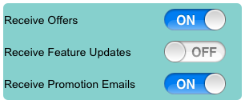

                                  
CheckBox Properties
===================

The properties of CheckBox widget are:

* * *

<details close markdown="block"><summary>accessibilityConfig Property</summary>

* * *

Enables you to control accessibility behavior and alternative text for the widget.

For more information on using accessibility features in your app, see the [Accessibility](../../../Iris/app_design_dev/Content/Accessibility_Overview.md) appendix in the Volt MX IrisUser Guide.

### Syntax
```

accessibilityConfig
```

### Type

     Object

### Read/Write

    Read + Write

### Remarks

*   The accessibilityConfig property is enabled for all the widgets which are supported under the Flex Layout.

> **_Note:_** From Volt MX Iris V9 SP2 GA version, you can provide i18n keys as values to all the attributes used inside the `accessibilityConfig` property. Values provided in the i18n keys take precedence over values provided in `a11yLabel`, `a11yValue`, and `a11yHint` fields.

The accessibilityConfig property is a JavaScript object which can contain the following key-value pairs.

  
| Key | Type | Description | ARIA Equivalent |
| --- | --- | --- | --- |
| a11yIndex | Integer with no floating or decimal number. | This is an optional parameter. Specifies the order in which the widgets are focused on a screen. | For all widgets, this parameter maps to the `aria-index`, `index`, or `taborder` properties. |
| a11yLabel | String | This is an optional parameter. Specifies alternate text to identify the widget. Generally the label should be the text that is displayed on the screen. | For all widgets, this parameter maps to the `aria-labelledby` property of ARIA in HTML. > **_Note:_** For the Image widget, this parameter maps to the **alt** attribute of ARIA in HTML. |
| a11yValue | String | This is an optional parameter. Specifies the descriptive text that explains the action associated with the widget. On the Android platform, the text specified for a11yValue is prefixed to the a11yHint. | This parameter is similar to the a11yLabel parameter. If the a11yValue is defined, the value of a11yValue is appended to the value of a11yLabel. These values are separated by a space. |
| a11yHint | String | This is an optional parameter. Specifies the descriptive text that explains the action associated with the widget. On the Android platform, the text specified for a11yValue is prefixed to the a11yHint. | For all widgets, this parameter maps to the `aria-describedby` property of ARIA in HTML. |
| a11yHidden | Boolean | This is an optional parameter. Specifies if the widget should be ignored by assistive technology. The default option is set to _false_. This option is supported on iOS 5.0 and above, Android 4.1 and above, and SPA | For all widgets, this parameter maps to the `aria-hidden` property of ARIA in HTML. |
| a11yARIA | Object | This is an optional parameter. For each widget, the key and value provided in this object are added as the attribute and value of the HTML tags respectively. Any values provided for attributes such as `aria-labelledby` and `aria-describedby` using this attribute, takes precedence over values given in `a11yLabel` and `a11yHint` fields. When a widget is provided with the following key value pair or attribute using the a11yARIA object, the tabIndex of the widget is automatically appended as zero.`{"role": "main"}``aria-label` | This parameter is only available on the Desktop Web platform. |

### Android limitations

*   If the results of the concatenation of a11y fields result in an empty string, then `accessibilityConfig` is ignored and the text that is on widget is read out.
*   The soft keypad does not gain accessibility focus during the right/left swipe gesture when the keypad appears.

### SPA/Desktop Web limitations

*   When `accessibilityConfig` property is configured for any widget, the `tabIndex` attribute is added automatically to the `accessibilityConfig` property.
*   The behavior of accessibility depends on the Web browser, Web browser version, Voice Over Assistant, and Voice Over Assistant version.
*   Currently SPA/Desktop web applications support only a few ARIA tags. To achieve more accessibility features, use the attribute a11yARIA. The corresponding tags will be added to the DOM as per these configurations.

### Example 1

This example uses the button widget, but the principle remains the same for all widgets that have an accessibilityConfig property.

```

//This is a generic property that is applicable for various widgets.
//Here, we have shown how to use the accessibilityConfig Property for button widget.
/*You need to make a corresponding use of the accessibilityConfig property for other applicable widgets.*/

Form1.myButton.accessibilityConfig = {
    "a11yLabel": "Label",
    "a11yValue": "Value",
    "a11yHint": "Hint"    
};
```

### Example 2

This example uses the button widget to implement internationalization in `accessibilityConfig` property, but the principle remains the same for all widgets.

```

/*Sample code to implement internationalization in accessibilityConfig property in Native platform.*/

Form1.myButton.accessibilityConfig = {
    "a11yLabel": voltmx.i18n.getLocalizedString("key1")     
};  
/*Sample code to implement internationalization in accessibilityConfig property in Desktop Web platform.*/

Form1.myButton.accessibilityConfig = {
    "a11yLabel": "voltmx.i18n.getLocalizedString(\"key3\")"
};
```

Platform Availability

*   Available in the IDE
*   iOS, Android, SPA, and Desktop Web

* * *

</details>
<details close markdown="block"><summary>anchorPoint Property</summary>

* * *

Specifies the anchor point of the widget bounds rectangle using the widget's coordinate space.

### Syntax

```

anchorPoint
```

### Type

    JSObject

### Read/Write

    Read + Write

### Remarks

The value for this property is a JavaScript dictionary object with the keys "x" and "y". The values for the "x" and "y" keys are floating-point numbers ranging from 0 to 1. All geometric manipulations to the widget occur about the specified point. For example, applying a rotation transform to a widget with the default anchor point causes the widget to rotate around its center.

The default value for this property is center ( {"x":0.5, "y":0.5} ), that represents the center of the widgets bounds rectangle. The behavior is undefined if the values are outside the range zero (0) to one (1).

### Example

```

Form1.widget1.anchorPoint = {
    "x": 0.5,
    "y": 0.5
};
```

### Platform Availability

*   iOS, Android, Windows, and SPA

* * *

</details>
<details close markdown="block"><summary>backgroundColor Property</summary>

* * *

Specifies the background color of the widget.

### Syntax

```

backgroundColor
```

### Type

    Color constant or Hexadecimal number

### Read/Write

    Read + Write

### Remarks

*   The initial value of backgroundColor has to be specified explicitly. If not, Iris will not deduce the values from the existing skin and this will lead to undefined behavior.
*   Colors can be specified using a 6 digit or an 8-digit hex value with alpha position. For example, ffff65 or ffffff00.
*   When the 4-byte color format (RGBA) string is used, an alpha (A) value of 65 specifies that the color is transparent. If the value is 00, the color is opaque. The Alpha value is in percentage and must be given in the hexadecimal value for the color (100% in hexadecimal value is 65).  
    For example, red complete opaque is FF000000. Red complete transparent is FF000065. The values 0x and # are not allowed in the string.
*   A color constant is a String that is defined at the theme level. Ensure that you append the **$** symbol at the beginning of the color constant.
*   This property does not have a default value.
*   This property has more priority than (and overrides) the background property of the configured skin. Even if there is no skin configured for the widget, this property updates the skin.
*   The backgroundColor, backgroundColorTwoStepGradient, backgroundColoMultiStepGradient, and backgroundImage properties are mutually exclusive. The property that was set most recently is given higher priority over other properties.

### Example

This example uses the button widget, but the principle remains the same for all widgets that have the backgroundColor property.

```

Form1.btn1.backgroundColor = "ea5075";
```

### Platform Availability

*   Android
*   iOS
*   Desktop Web (Not available on Desktop Web Legacy SDK)

* * *

</details>
<details close markdown="block"><summary>backgroundColorMultiStepGradient Property</summary>

* * *

Specifies the multi-step gradient color for the background of the widget.

### Syntax

```

backgroundColorMultiStepGradient
```

### Type

    JSON Object

### Read/Write

    Read + Write

### Input Parameters

*   **gradientType** \[Constant\]: Specifies the configuration type of the gradient. This parameter can have the following constant values:
    
    *   `voltmx.skin.MULTI_STEP_GRADIENT_TYPE_TO_TOP`: Constant for the gradient type toTop.
    *   `voltmx.skin.MULTI_STEP_GRADIENT_TYPE_TO_RIGHT`: Constant for the gradient type toRight.
    *   `voltmx.skin.MULTI_STEP_GRADIENT_TYPE_TO_BOTTOM`: Constant for the gradient type toBottom.
    *   `voltmx.skin.MULTI_STEP_GRADIENT_TYPE_TO_LEFT`: Constant for the gradient type toLeft.
    *   `voltmx.skin.MULTI_STEP_GRADIENT_TYPE_CUSTOM`: Constant for the gradient type custom.  
        For the custom gradient type, you must specify the angle by using the [angle](#angle) property.
*   **angle** \[Number\]: Specifies the angle for the gradient in degrees, counted counter-clockwise. This property is only applicable for the custom gradient type.
*   **colors** \[Array\]: Specifies the colors for the multi-step gradient. Colors is an array of color hex values that indicate the reference color values of the gradient. This parameter contains an array of hexadecimal numbers that represent the colors or constants defined at the theme level.
*   **colorStops** \[Array\]: Specifies the color stops for the multi-step gradient. Color Stops are the locations of the reference colors on the gradient, from 0 (the start of the gradient) to 100 (the final value of the gradient). This parameter contains an array of numbers that represent the color stops.

### Remarks

*   The default value of the gradientType key is `voltmx.skin.MULTI_STEP_GRADIENT_TYPE_TO_TOP`.
*   Colors can be specified using a 6 digit or an 8-digit hex value with alpha position. For example, ffff65 or ffffff00.
*   When the 4-byte color format (RGBA) string is used, an alpha (A) value of 65 specifies that the color is transparent. If the value is 00, the color is opaque. The Alpha value is in percentage and must be given in the hexadecimal value for the color (100% in hexadecimal value is 65).  
    For example, red complete opaque is FF000000. Red complete transparent is FF000065. The values 0x and # are not allowed in the string.
*   A color constant is a String that is defined at the theme level. Ensure that you append the **$** symbol at the beginning of the color constant.
*   This property does not have a default value.
*   This property has more priority than (and overrides) the background property of the configured skin. Even if there is no skin configured for the widget, this property updates the skin.
*   The backgroundColor, backgroundColorTwoStepGradient, backgroundColoMultiStepGradient, and backgroundImage properties are mutually exclusive. The property that was set most recently is given higher priority over other properties.

### Example

This example uses the button widget, but the principle remains the same for all widgets that have the backgroundColorMultiStepGradient property.

```

Form1.btn1.backgroundColorMultiStepGradient = {
    "gradientType": voltmx.skin.MULTI_STEP_GRADIENT_TYPE_CUSTOM  
    "angle": 45,
    "colors": ["ea5075", "f1fa70", "eefd04"],
    "colorStops": [0, 90, 100]
};
```

Platform Availability

*   Android
*   iOS
*   Desktop Web (Not available on Desktop Web Legacy SDK)

* * *

</details>
<details close markdown="block"><summary>backgroundColorTwoStepGradient Property</summary>

* * *

Specifies the two-step gradient color for the background of the widget.

### Syntax

```

backgroundColorTwoStepGradient
```

### Type

    JSON Object

### Read/Write

    Read + Write

### Input Parameters

*   **topColor** \[Constant or Hex\]: Specifies the top color of the two-step gradient. The value of this parameter can be a hexadecimal number that represents a color or a constant that is defined at the theme level.
    
*   **bottomColor** \[Constant or Hex\]:Specifies the bottom color of the two-step gradient. The value of this parameter can be a hexadecimal number that represents a color or a constant that is defined at the theme level.
    
*   **style** \[Constant\]: Specifies the configuration style of the two-step gradient. This parameter can have the following constant values:
    
    *   `voltmx.skin.TWO_STEP_GRADIENT_STYLE_VERTICAL_GRADIENT`: Constant for the vertical gradient style.
    *   `voltmx.skin.TWO_STEP_GRADIENT_STYLE_VERTICAL_SPLIT`: Constant for the vertical split style.
    *   `voltmx.skin.TWO_STEP_GRADIENT_STYLE_HORIZONTAL_GRADIENT`: Constant for the horizontal gradient style.
    *   `voltmx.skin.TWO_STEP_GRADIENT_STYLE_HORIZONTAL_SPLIT`: Constant for the horizontal split style.

### Remarks

*   The default value of the style key is `voltmx.skin.TWO_STEP_GRADIENT_STYLE_VERTICAL_GRADIENT`.
*   Colors can be specified using a 6 digit or an 8-digit hex value with alpha position. For example, ffff65 or ffffff00.
*   When the 4-byte color format (RGBA) string is used, an alpha (A) value of 65 specifies that the color is transparent. If the value is 00, the color is opaque. The Alpha value is in percentage and must be given in the hexadecimal value for the color (100% in hexadecimal value is 65).  
    For example, red complete opaque is FF000000. Red complete transparent is FF000065. The values 0x and # are not allowed in the string.
*   A color constant is a String that is defined at the theme level. Ensure that you append the **$** symbol at the beginning of the color constant.
*   This property does not have a default value.
*   This property has more priority than (and overrides) the background property of the configured skin. Even if there is no skin configured for the widget, this property updates the skin.
*   The backgroundColor, backgroundColorTwoStepGradient, backgroundColoMultiStepGradient, and backgroundImage properties are mutually exclusive. The property that was set most recently is given higher priority over other properties.

### Example

This example uses the button widget, but the principle remains the same for all widgets that have the backgroundColorTwoStepGradient property.

```

Form1.btn1.backgroundColorTwoStepGradient = {  
     "topColor": "ea5075",  
    "bottomColor": "eefd04",  
    "style": voltmx.skin.TWO_STEP_GRADIENT_STYLE_VERTICAL_GRADIENT  
};
```

### Platform Availability

*   Android
*   iOS
*   Desktop Web (Not available on Desktop Web Legacy SDK)

* * *

</details>
<details close markdown="block"><summary>backgroundImage Property</summary>

* * *

Sets the image for the background of the widget.

### Syntax

```

backgroundImage
```

### Type

    String

### Read/Write

    Read + Write

### Remarks

*   This property does not have a default value.
*   This property has more priority than (and overrides) the background property of the configured skin. Even if there is no skin configured for the widget, this property updates the skin.
*   The backgroundColor, backgroundColorTwoStepGradient, backgroundColoMultiStepGradient, and backgroundImage properties are mutually exclusive. The property that was set most recently is given higher priority over other properties.

### Example

This example uses the button widget, but the principle remains the same for all widgets that have the backgroundImage property.

```

Form1.btn1.backgroundImage = "bgImg.png";
```

### Platform Availability

*   Android
*   iOS
*   Desktop Web (Not available on Desktop Web Legacy SDK)

* * *

</details>
<details close markdown="block"><summary>blur Property</summary>

* * *

You can enable or disable a blur-effect for a widget(for example, a FlexContainer) by making use of a constructor-level property, called **blur**. The **blur** property accepts a dictionary that contains the following keys: enabled, value and style. You must specify an appropriate value for the dictionary keys, otherwise the property will not be valid.

### Syntax

```

blur
```

**Input Parameters**

*   _enabled_: Accepts a Boolean value that basically decides whether to enable or disable the blur-effect for the widget. This is a mandatory attribute.
*   _value_: Level of the blur-effect that needs to be set for the widget. It should ideally be between 0 to 100. If the level is set as 0 no blur is set, even when the enabled property is set as true. This is a mandatory attribute. Even when the _enabled_ attribute is set as false, you need to specify a numerical value to this attribute.
    
*   _style_: Specifies the style in which the blur property can be applied to a widget. This is an optional parameter specific to iOS. The default value of this parameter is constants.BLUR\_EFFECT\_LIGHT. You can specify any of the following values to this parameter:  
    *   constants.BLUR\_EFFECT\_NONE
    *   constants.BLUR\_EFFECT\_EXTRALIGHT
        
    *   constants.BLUR\_EFFECT\_LIGHT (default)
    *   constants.BLUR\_EFFECT\_DARK
        
    *   constants.BLUR\_EFFECT\_REGULAR
        
    *   constants.BLUR\_EFFECT\_PROMINENT
        

### Read/Write

    Read + Write

### Remarks

*   If you set _enabled_ as true, the blur-effect for the widget is enabled.
*   If you set _enabled_ as false, the blur-effect for the widget is disabled.
*   If you specify _value_ as less than 0, the value is taken as 0.
    
*   If you specify _value_ as greater than 100, the value is taken as 100.

### Limitations

*   For Android:
    *   If a FlexContainer or a FlexScrollContainer contains a Map widget, the blur-effect is not applied to the map.
        
    *   If a FlexContainer or a FlexScrollContainer contains a Browser or Video widget, the blur-effect is applied but does not get updated. For example, when the video starts playing, the new rendered frame does not get displayed with the blur-effect.
        
    *   Even if you apply 100% blur for widgets that display any text( such as Label or Calendar widgets), the text on these widgets is not blurred. This is a Native Android limitation. To generate the blur effect for the text, apply a skin with darker background to the Label or Calendar widget. This is true even when the widgets are placed in a FlexContainer with blur effect and the widgets do not have a skin.
    *   Blur effect will not work on widgets added inside BOX containers.

### Example 1

To dynamically set the blur-effect for any widget, such as a FlexContainer, use the following code.

```

//This is a generic property that is applicable for various widgets.
//Here, we have shown how to use the blur property for FlexContainer widget.
/*You need to make a corresponding use of the 
blur property for other applicable widgets.*/

Form1.myFlexContainer.blur = {
    "enabled": true,
    "value": 60
};

```

### Example 2

To dynamically set the blur-effect for any widget, such as a FlexContainer in iOS, use the following code.

```

Form1.widget1.blur = {
    "enabled": true,
    "value": 60,
    "style": constants.BLUR_EFFECT_DARK
};
```

### Platform Availability

*   Android, iOS, Windows, SPA , and Desktop web

 

* * *

</details>
<details close markdown="block"><summary>borderColor Property</summary>

* * *

Specifies the border color of the widget.

### Syntax

```

borderColor
```

### Type

    Color constant or Hexadecimal number

### Read/Write

    Read + Write

### Remarks

*   Colors can be specified using a 6 digit or an 8-digit hex value with alpha position. For example, ffff65 or ffffff00.
*   When the 4-byte color format (RGBA) string is used, an alpha (A) value of 65 specifies that the color is transparent. If the value
    is 00, the color is opaque. The Alpha value is in percentage and must be given in the hexadecimal value for the color (100% in hexadecimal value is 65).  
    For example, red complete opaque is FF000000. Red complete transparent is FF000065. The values 0x and # are not allowed in the string.
*   A color constant is a String that is defined at the theme level. Ensure that you append the **$** symbol at the beginning of the
    color constant.
*   This property does not have a default value.
*   This property has more priority than (and overrides) the border property of the configured skin. Even if there is no skin configured
    for the widget, this property updates the skin.

### Example

This example uses the button widget, but the principle remains the same for all widgets that have the borderColor property.

```

Form1.btn1.borderColor = "ea5075";
```

### Platform Availability

*   Android
*   iOS
*   Desktop Web (Not available on Desktop Web Legacy SDK)

* * *

</details>
<details close markdown="block"><summary>borderColorGradient Property</summary>

* * *

Specifies the multi-step gradient color for the border of the widget.

### Syntax

```

borderColorGradient
```

### Type

    JSON Object

### Read/Write

    Read + Write

### Input Parameters

*   **gradientType** \[Constant\]: Specifies the configuration type of the gradient. This parameter can have the following constant values:
    
    *   `voltmx.skin.MULTI_STEP_GRADIENT_TYPE_TO_TOP`: Constant for the gradient type toTop.
    *   `voltmx.skin.MULTI_STEP_GRADIENT_TYPE_TO_RIGHT`: Constant for the gradient type toRight.
    *   `voltmx.skin.MULTI_STEP_GRADIENT_TYPE_TO_BOTTOM`: Constant for the gradient type toBottom.
    *   `voltmx.skin.MULTI_STEP_GRADIENT_TYPE_TO_LEFT`: Constant for the gradient type toLeft.
    *   `voltmx.skin.MULTI_STEP_GRADIENT_TYPE_CUSTOM`: Constant for the gradient type custom.  
        For the custom gradient type, you must specify the angle by using the [angle](#angle) property.
*   **angle** \[Number\]: Specifies the angle for the gradient in degrees, counted counter-clockwise. This property is only applicable for the custom gradient type.
*   **colors** \[Array\]: Specifies the colors for the multi-step gradient. Colors is an array of color hex values that indicate the reference color values of the gradient. This parameter contains an array of hexadecimal numbers that represent the colors or constants defined at the theme level.
*   **colorStops** \[Array\]: Specifies the color stops for the multi-step gradient. Color Stops are the locations of the reference colors on the gradient, from 0 (the start of the gradient) to 100 (the final value of the gradient). This parameter contains an array of numbers that represent the color stops.

### Remarks

*   The default value of the gradientType key is `voltmx.skin.MULTI_STEP_GRADIENT_TYPE_TO_TOP`.
*   Colors can be specified using a 6 digit or an 8-digit hex value with alpha position. For example, ffff65 or ffffff00.
*   When the 4-byte color format (RGBA) string is used, an alpha (A) value of 65 specifies that the color is transparent. If the value is 00, the color is opaque. The Alpha value is in percentage and must be given in the hexadecimal value for the color (100% in hexadecimal value is 65).  
    For example, red complete opaque is FF000000. Red complete transparent is FF000065. The values 0x and # are not allowed in the string.
*   A color constant is a String that is defined at the theme level. Ensure that you append the **$** symbol at the beginning of the color constant.
*   This property does not have a default value.
*   This property has more priority than (and overrides) the border property of the configured skin. Even if there is no skin configured for the widget, this property updates the skin.

### Example

This example uses the button widget, but the principle remains the same for all widgets that have the borderColorGradient property.

```

Form1.btn1.borderColorGradient = {
    "gradientType": voltmx.skin.MULTI_STEP_GRADIENT_TYPE_CUSTOM  
    "angle": 45,
    "colors": ["ea5075", "f1fa70", "eefd04"],
    "colorStops": [0, 90, 100]
};
```

### Platform Availability

*   Android
*   iOS

* * *

</details>
<details close markdown="block"><summary>borderStyle Property</summary>

* * *

Specifies the border style for the widget.

### Syntax

```

borderStyle
```

### Type

    Constant

### Read/Write

    Read + Write

### Remarks

*   This property can have the following constant values:
    
    *   **voltmx.skin.BORDER\_STYLE\_PLAIN**: Constant for the plain border style.
    *   **voltmx.skin.BORDER\_STYLE\_ROUNDED\_CORNER**: Constant for the rounded corner style.
    *   **voltmx.skin.BORDER\_STYLE\_COMPLETE\_ROUNDED\_CORNER**: Constant for the complete rounded corner style.
    *   **voltmx.skin.BORDER\_STYLE\_CUSTOM**: Constant for the custom border style.
*   The cornerRadius property is only applicable when the borderStyle is voltmx.skin.BORDER\_STYLE\_CUSTOM.
*   This property does not have a default value.
*   This property has more priority than (and overrides) the border property of the configured skin. Even if there is no skin configured for the widget, this property updates the skin.

### Example

This example uses the button widget, but the principle remains the same for all widgets that have the borderStyle property.

```

Form1.btn1.borderStyle = voltmx.skin.BORDER_STYLE_PLAIN;
```

### Platform Availability

*   Android
*   iOS

* * *

</details>
<details close markdown="block"><summary>borderWidth Property</summary>

* * *

Specifies the width of the border for the widget in pixels.

### Syntax

```

borderWidth
```

**Type**

    Number or JSON Object

### Read/Write

    Read + Write

### Remarks

*   This property does not have a default value.
*   The default unit for the value of this property is pixels.
*   The Desktop Web platform supports both Number and JSON Object (with the top, bottom, right, and left keys) values for the borderWidth parameter. The Android and iOS platforms support only Number values for the borderWidth parameter.
*   This property has more priority than (and overrides) the border property of the configured skin. Even if there is no skin configured for the widget, this property updates the skin.

### Example

This example uses the button widget, but the principle remains the same for all widgets that have the borderWidth property.

```

Form1.btn1.borderWidth = 2;
```

### Platform Availability

*   Android
*   iOS
*   Desktop Web (Not available on Desktop Web Legacy SDK)

 

* * *

</details>
<details close markdown="block"><summary>bottom Property</summary>

* * *

This property determines the bottom edge of the widget and is measured from the bottom bounds of the parent container.

The bottom property determines the position of the bottom edge of the widget’s bounding box. The value may be set using DP (Device Independent Pixels), Percentage, or Pixels. In freeform layout, the distance is measured from the bottom edge of the parent container. In flow-vertical layout, the value is ignored. In flow-horizontal layout, the value is ignored.

The bottom property is used only if the Height property is not provided.

### Syntax

```

bottom
```

### Type

    String

### Read/Write

    Read + Write

### Remarks

The property determines the bottom edge of the widget and is measured from the bottom bounds of the parent container.

If the layoutType is set as voltmx.flex.FLOW\_VERTICAL, the bottom property is measured from the top edge of bottom sibling widget. The vertical space between two widgets is measured from bottom of the top sibling widget and the top of the bottom sibling widget.

### Example

```

//Sample code to set the bottom property for widgets by using DP, Percentage and Pixels.
frmHome.widgetID.bottom = "50dp";

frmHome.widgetID.bottom = "10%";

frmHome.widgetID.bottom = "10px";
```

### Platform Availability

*   Available in the IDE
*   iOS, Android, Windows, SPA , and Desktop Web

* * *

</details>
<details close markdown="block"><summary>centerX Property</summary>

* * *

This property determines the center of a widget measured from the left bounds of the parent container.

The centerX property determines the horizontal center of the widget’s bounding box. The value may be set using DP (Device Independent Pixels), Percentage, or Pixels. In freeform layout, the distance is measured from the left edge of the parent container. In flow-vertical layout, the distance is measured from the left edge of the parent container. In flow-horizontal layout, the distance is measured from the right edge of the previous sibling widget in the hierarchy.

### Syntax

```

centerX
```

### Type

String

### Read/Write

Read + Write

### Remarks

If the layoutType is set as voltmx.flex.FLOW\_HORIZONTAL, the centerX property is measured from right edge of the left sibling widget.

### Example

```

//Sample code to set the centerX property for widgets by using DP, Percentage and Pixels.
frmHome.widgetID.centerX = "50dp";

frmHome.widgetID.centerX = "10%";

frmHome.widgetID.centerX = "10px";
```

### Platform Availability

*   Available in the IDE
*   iOS, Android, Windows, SPA, and Desktop Web

* * *

</details>
<details close markdown="block"><summary>centerY Property</summary>

* * *

This property determines the center of a widget measured from the top bounds of the parent container.

The centerY property determines the vertical center of the widget’s bounding box. The value may be set using DP (Device Independent Pixels), Percentage, or Pixels. In freeform layout, the distance is measured from the top edge of the parent container. In flow-horizontal layout, the distance is measured from the top edge of the parent container. In flow-vertical layout, the distance is measured from the bottom edge of the previous sibling widget in the hierarchy.

### Syntax

```

centerY
```

### Type

String

### Read/Write

Read + Write

### Remarks

If the layoutType is set as voltmx.flex.FLOW\_VERTICAL, the centerY property is measured from bottom edge of the top sibling widget.

### Example

```

//Sample code to set the centerY property for widgets by using DP, Percentage and Pixels.
frmHome.widgetID.centerY = "50dp";

frmHome.widgetID.centerY = "10%";

frmHome.widgetID.centerY = "10px";
```

### Platform Availability

*   Available in the IDE
*   iOS, Android, Windows, SPA, and Desktop Web

* * *

</details>
<details close markdown="block"><summary>cornerRadius Property</summary>

* * *

Specifies the radius of the border for the widget.

### Syntax

```

cornerRadius
```

**Type**

Number or JSON Object

### Read/Write

Read + Write

### Remarks

*   The cornerRadius property is only applicable when the borderStyle is voltmx.skin.BORDER\_STYLE\_CUSTOM.
*   For a Responsive Web app, a corner radius of value zero applies a plain border, and a corner radius value greater than zero applies
    a rounded border.
*   The Android and Desktop Web platforms support both Number and JSON Object (with the top, bottom, right, and left keys) values for
    the cornerRadius parameter. The iOS platform supports only Number values for the cornerRadius parameter.
*   The default unit for the value of this property is pixels.
*   This property does not have a default value.
*   This property has more priority than (and overrides) the border property of the configured skin. Even if there is no skin configured
    for the widget, this property updates the skin.

### Example

This example uses the button widget, but the principle remains the same for all widgets that have the cornerRadius property.

```

Form1.btn1.cornerRadius = 60;
```

### Platform Availability

*   Android
*   iOS
*   Desktop Web (Not available on Desktop Web Legacy SDK)

 

* * *

</details>
<details close markdown="block"><summary>cursorType Property</summary>

* * *

In Desktop Web applications, when you hover the mouse over any widget, a mouse pointer appears. Using the cursorType property in Iris, you can specify the type of the mouse pointer.

### Syntax

```

cursorType
```

### Type

String.

You must provide valid CSS cursor value such as wait, grab, help, etc. to the cursorType property.

### Read/Write

Read + Write

### Remarks

To add the `cursorType` property using Volt MX Iris in a Desktop Web application, follow these steps.

1.  In Volt MX Iris, open the Desktop Web application. From the **Project** explorer, expand **Responsive Web/ Desktop**\> **Forms** and
    select the form to which you need to make the changes.
2.  On the canvas, select the widget for which you want to specify the cursor type. For example, button.
3.  From the **Properties** panel, navigate to the **Skin** tab > **Hover Skin** tab.  
    You will find that the details of the hover skin is not enabled here.
4.  Check the **Enable** option to add a hover skin to your widget.  
    The details and configurations of the hover skin is enabled.
5.  Under the **General** section, for the Platform option, click the ellipsis icon.  
    The **Fork Skin** window appears.
6.  In the **Fork Skin** window, for **Desktop**, check under **HTML5 SPA**.
7.  Click **Ok**. You have successfully forked your hover skin for Desktop Web application.  
    You can see that the **Cursor Type** property has been added under the **General** section.
8.  Select a value from the drop-down list to set the **Cursor Type** for the widget.

### Example

```

//This is a generic property and is applicable for many widgets.  
  
/*The example provided is for the Button widget. Make the required changes in the example while using other widgets.*/
  
frmButton.myButton.cursorType = "wait";

```

### Platform Availability

*   Available in IDE
*   Desktop Web

* * *

</details>
<details close markdown="block"><summary>disabledStateSkinProperties Property</summary>

* * *

Specifies the skin properties that define the look and feel of the widget, when the widget is disabled or blocked.

### Syntax

```

disabledStateSkinProperties
```

### Type

JSON Object

### Read/Write

Read + Write

### Remarks

*   This property does not have a default value.
*   This property has more priority than (and overrides) the disabledSkin property of the configured skin. Even if there is no skin
    configured for the widget, this property updates the skin.

### Example

This example uses the button widget, but the principle remains the same for all widgets that have the disabledStateSkinProperties property.

```

Form1.btn1.disabledStateSkinProperties= {  
     background: {  
        backgroundType: voltmx.skin.BACKGROUND_TYPE_MULTI_STEP_GRADIENT,  
        backgroundColorMultiStepGradient : {  
            gradientType: voltmx.skin.MULTI_STEP_GRADIENT_TYPE_TO_TOP,  
            colors: ["ea5075", "f1fa70", "eefd04"],  
            colorStops: [0, 90, 100]  
        },  
    },  
    border: {  
        borderType: voltmx.skin.BORDER_TYPE_SINGLE_COLOR,  
        borderColor: "ea5075",  
        borderStyle: voltmx.skin.BORDER_STYLE_PLAIN,  
        borderWidth: 50  
    },  
    fonts: {  
        fontColor: "ea5075",  
        fontFamily: "Serif",  
        fontSize: '100',  
        fontStyle: voltmx.skin.FONT_STYLE_NONE,  
        fontWeight: voltmx.skin.FONT_WEIGHT_NORMAL  
    },  
    textShadow: {  
        textShadowRadius: 5,  
        textShadowColor: "ea5075",  
        textShadowOffset: {  
            x: 20,  
            y: 4  
        }  
    }
```

### Platform Availability

*   Android

* * *

* * *

</details>
<details close markdown="block"><summary>enable Property</summary>

* * *

The `enable` property is used to control the actionability of the widgets. In a scenario where you want to display a widget but not invoke any action on the widget, configure the `enable` property to false to achieve it.

This is a constructor level property and applicable for all widgets in Volt MX Iris.

### Syntax

```

enable
```

### Type

Boolean

### Read/Write

Read + Write

### Remarks

The default value of this property is true.

When `enable` property is configured to true, the action associated with a widget can be invoked by the user in the application.

When `enable` property is configured to false, the action associated with a widget cannot be invoked by the user in the application.

### Example

```

//This is a generic property and is applicable for many widgets.  
  
/*The example provided is for the Button widget. Make the changes required in the example while using other widgets.*/
  
frmButton.myBtn.enable= true;
```

### Platform Availability

*   Android, iOS, Windows, SPA, and Desktop web

* * *

</details>
<details close markdown="block"><summary>enableCache Property</summary>

* * *

The property enables you to improve the performance of Positional Dimension Animations.

### Syntax

```

enableCache
```

### Type

Boolean

### Read/Write

Read + Write

### Remarks

The default value for this property is true.

> **_Note:_** When the property is used, application consumes more memory. The usage of the property enables tradeoff between performance and visual quality of the content. Use the property cautiously.

### Example

```

Form1.widgetID.enableCache = true;
```

### Platform Availability

*   Available in the IDE.
*   Windows

* * *

</details>
<details close markdown="block"><summary>focusSkin Property</summary>

* * *

Specifies the look and feel of the CheckBox when in focus.

### Syntax

```

focusSkin
```

### Type

String

### Read/Write

Read + Write

### Remarks

Mobile Web does not support this property, instead browser specific focus will be applied.

On Windows 10 Platform, focusSkin is applied only to the selected item, but not to the entire widget when in focus.

### Example

```

//Sample code to set the focusSkin property for CheckBoxGroup Widget.  
frmCheckBox.myCheckBox.focusSkin="chkFocusSkin";  

```

### Platform Availability

*   Available in the IDE
*   iOS
*   Android
*   SPA

* * *

</details>
<details close markdown="block"><summary>focusStateSkinProperties Property</summary>

* * *

Specifies the skin properties that define the look and feel of the widget, when the widget is in focus.

### Syntax

```

focusStateSkinProperties
```

### Type

JSON Object

### Read/Write

Read + Write

### Remarks

*   This property does not have a default value.
*   This property has more priority than (and overrides) the focusSkin property of the configured skin. Even if there is no skin
    configured for the widget, this property updates the skin.

### Example

This example uses the button widget, but the principle remains the same for all widgets that have the focusStateSkinProperties property.

```

Form1.btn1.focusStateSkinProperties = {  
     background: {  
        backgroundType: voltmx.skin.BACKGROUND_TYPE_MULTI_STEP_GRADIENT,  
        backgroundColorMultiStepGradient : {  
            gradientType: voltmx.skin.MULTI_STEP_GRADIENT_TYPE_TO_TOP,  
            colors: ["ea5075", "f1fa70", "eefd04"],  
            colorStops: [0, 90, 100]  
        }  
    },  
    border: {  
        borderType: voltmx.skin.BORDER_TYPE_SINGLE_COLOR,  
        borderColor: "ea5075",  
        borderStyle: voltmx.skin.BORDER_STYLE_PLAIN,  
        borderWidth: 5  
    },  
    fonts: {  
        fontColor: "ea5075",  
        fontFamily: "Serif",  
        fontSize: '100',  
        fontStyle: voltmx.skin.FONT_STYLE_NONE,  
        fontWeight: voltmx.skin.FONT_WEIGHT_NORMAL  
    },  
    textShadow: {  
        textShadowRadius: 5,  
        textShadowColor: "ea5075",  
        textShadowOffset: {  
            x: 20,  
            y: 4  
        }  
    }
```

### Platform Availability

*   Android
*   iOS
*   Desktop Web (Not available on Desktop Web Legacy SDK)

* * *

* * *

</details>
<details close markdown="block"><summary>focusTickedImage Property</summary>

* * *

Specifies the image to be displayed when you make a selection on non-touch devices.

### Syntax

```

focusTickedImage
```

### Type

String/Image object

### Read/Write

No

### Example

Using a local resource for the image:

```

//Defining the properties for CheckBox with focusTickedImage:"focTikImg.png"
var chkBasic = {
    id: "checkBox",
    isVisible: true
};
var chkLayout = {
    containerWeight: 100
};
var chkPSP = {
    focusTickedImage: "focTikImg.png"
};
//Creating the CheckBox.
var checkBox = new voltmx.ui.CheckBoxGroup(chkBasic, chkLayout, chkPSP);
```

Using an image object (voltmx.image) for the image:

```

imgObjRef = voltmx.image.createImage("local.png");
var chkBasic = {
    id: "checkBox",
    isVisible: true
};
var chkLayout = {
    containerWeight: 100
};
var chkPSP = {
    focusTickedImage: imgObjRef
};
//Creating the CheckBox.
var checkBox = new voltmx.ui.CheckBoxGroup(chkBasic, chkLayout, chkPSP);
```

### Platform Availability

*   Available in the IDE
*   iOS
*   Android
*   Windows

* * *

</details>
<details close markdown="block"><summary>focusUnTickedImage Property</summary>

* * *

Specifies the image to be displayed when you clear a selection on non-touch devices.

### Syntax

```

focusUnTickedImage
```

### Type

String/Image object

### Read/Write

No

### Example

Using a local resource for the image:

```

//Defining the properties for CheckBox with focusUnTickedImage:"focUnTikImg.png"
var chkBasic = {
    id: "checkBox",
    isVisible: true
};

var chkLayout = {
    containerWeight: 100
};

var chkPSP = {
    focusUnTickedImage: "focUnTikImg.png"
};
//Creating the CheckBox.
var checkBox = new voltmx.ui.CheckBoxGroup(chkBasic, chkLayout, chkPSP);
```

Using an image object (voltmx.image) for the image:

```

imgObjRef = voltmx.image.createImage("local.png");
var chkBasic = {
    id: "checkBox",
    isVisible: true
};
var chkLayout = {
    containerWeight: 100
};
var chkPSP = {
    focusUnTickedImage: imgObjRef
};

//Creating the CheckBox.
var checkBox = new voltmx.ui.CheckBoxGroup(chkBasic, chkLayout, chkPSP);
```

### Platform Availability

*   Available in the IDE
*   iOS
*   Android
*   Windows

* * *

</details>
<details close markdown="block"><summary>fontColor Property</summary>

* * *

Specifies the font color of the widget.

### Syntax

```

fontColor
```

### Type

Color constant or Hexadecimal number

### Read/Write

Read + Write

### Remarks

*   Colors can be specified using a 6 digit or an 8-digit hex value with alpha position. For example, ffff65 or ffffff00.
*   When the 4-byte color format (RGBA) string is used, an alpha (A) value of 65 specifies that the color is transparent. If the value
    is 00, the color is opaque. The Alpha value is in percentage and must be given in the hexadecimal value for the color (100% in hexadecimal value is 65).  
    For example, red complete opaque is FF000000. Red complete transparent is FF000065. The values 0x and # are not allowed in the string.
*   A color constant is a String that is defined at the theme level. Ensure that you append the **$** symbol at the beginning of the
    color constant.
*   This property does not have a default value.
*   This property has more priority than (and overrides) the fonts property of the configured skin. Even if there is no skin configured
    for the widget, this property updates the skin.

### Example

This example uses the button widget, but the principle remains the same for all widgets that have the fontColor property.

```

Form1.btn1.fontColor = "ea5075";
```

### Platform Availability

*   Android
*   iOS
*   Desktop Web (Not available on Desktop Web Legacy SDK)

* * *

</details>
<details close markdown="block"><summary>fontFamily Property</summary>

* * *

Specifies the font family for the font of the widget.

### Syntax

```

fontFamily
```

**Type**

String

### Read/Write

Read + Write

### Remarks

*   This property does not have a default value.
*   This property has more priority than (and overrides) the fonts property of the configured skin. Even if there is no skin configured
    for the widget, this property updates the skin.

### Example

This example uses the button widget, but the principle remains the same for all widgets that have the fontFamily property.

```

Form1.btn1.fontFamily = "Serif";
```

### Platform Availability

*   Android
*   iOS
*   Desktop Web (Not available on Desktop Web Legacy SDK)

* * *

</details>
<details close markdown="block"><summary>fontSize Property</summary>

* * *

Specifies the font size for the widget in percentage (%) units.

### Syntax

```

fontSize
```

**Type**

Number

### Read/Write

Read + Write

### Remarks

*   This property does not have a default value.
*   This property has more priority than (and overrides) the fonts property of the configured skin. Even if there is no skin configured
    for the widget, this property updates the skin.

### Example

This example uses the button widget, but the principle remains the same for all widgets that have the fontSize property.

```

Form1.btn1.fontSize = 150;
```

### Platform Availability

*   Android
*   iOS
*   Desktop Web (Not available on Desktop Web Legacy SDK)

* * *

</details>
<details close markdown="block"><summary>fontStyle Property</summary>

* * *

Specifies the font style for the widget.

### Syntax

```

fontStyle
```

### Type

Constant

### Read/Write

Read + Write

### Remarks

*   This property can have the following constant values:
    
    *   **voltmx.skin.FONT\_STYLE\_NONE**: Constant for the normal font style.
    *   **voltmx.skin.FONT\_STYLE\_ITALIC**: Constant for the italic font style.
    *   **voltmx.skin.FONT\_STYLE\_UNDERLINE**: Constant for the underline font style.
*   This property does not have a default value.
*   This property has more priority than (and overrides) the fonts property of the configured skin. Even if there is no skin configured
    for the widget, this property updates the skin.

### Example

This example uses the button widget, but the principle remains the same for all widgets that have the fontStyle property.

```

Form1.btn1.fontStyle = voltmx.skin.FONT_STYLE_NONE;
```

### Platform Availability

*   Android
*   Desktop Web (Not available on Desktop Web Legacy SDK)

* * *

</details>
<details close markdown="block"><summary>fontWeight Property</summary>

* * *

Specifies the weight for the font of the widget.

### Syntax

```

fontWeight
```

### Type

Constant

### Read/Write

Read + Write

### Remarks

*   This property can have the following constant values:
    
    *   **voltmx.skin.FONT\_WEIGHT\_NORMAL**: Constant for the normal font weight.
    *   **voltmx.skin.FONT\_WEIGHT\_BOLD**: Constant for the bold font weight.
*   This property does not have a default value.
*   This property has more priority than (and overrides) the fonts property of the configured skin. Even if there is no skin configured
    for the widget, this property updates the skin.

### Example

This example uses the button widget, but the principle remains the same for all widgets that have the fontWeight property.

```

Form1.btn1.fontWeight = voltmx.skin.FONT_WEIGHT_NORMAL;
```

### Platform Availability

*   Android
*   Desktop Web (Not available on Desktop Web Legacy SDK)

* * *

</details>
<details close markdown="block"><summary>groupCells Property</summary>

* * *

Specifies if the group cells style must be applied. when the style is applied the items in the check box are grouped and they are indicated with a round corner rectangle box.

### Syntax

```

groupCells
```

### Type

Boolean

### Read/Write

No

### Remarks

The default value for this property is false.

This property is applicable only when [viewType](#viewType) is set as CHECKBOX\_VIEW\_TYPE\_TABLEVIEW.

### Example

```

//Defining the properties for CheckBox with groupCells:true
var chkBasic = {
    id: "checkBox",
    isVisible: true
};

var chkLayout = {
    containerWeight: 100
};

var chkPSP = {
    groupCells: true
};

//Creating the CheckBox.
var checkBox = new voltmx.ui.CheckBoxGroup(chkBasic, chkLayout, chkPSP);
```

### Platform Availability

*   Available in the IDE
*   iPad
*   iPhone

* * *

</details>
<details close markdown="block"><summary>height Property</summary>

* * *

It determines the height of the widget and measured along the y-axis.

The height property determines the height of the widget’s bounding box. The value may be set using DP (Device Independent Pixels), Percentage, or Pixels. For supported widgets, the height may be derived from either the widget or container’s contents by setting the height to “preferred”.

### Syntax

```

height
```

### Type

Number, String, and Constant

### Read/Write

Read + Write

### Remarks

Following are the available measurement options:

*   %: Specifies the values in percentage relative to the parent dimensions.
*   px: Specifies the values in terms of device hardware pixels.
*   dp: Specifies the values in terms of device independent pixels.
*   default: Specifies the default value of the widget.
*   voltmx.flex.USE\_PREFERED\_SIZE: When this option is specified, the layout uses preferred height of the widget as height and
    preferred size of the widget is determined by the widget and may varies between platforms.

### Example

```

//Sample code to set the height property for widgets by using DP, Percentage and Pixels.
frmHome.checkbox1.height = "50dp";

frmHome.checkbox1. height = "10%";

frmHome.checkbox1. height = "10px";
```

### Platform Availability

*   Available in the IDE
*   iOS
*   Android
*   Windows
*   SPA

* * *

</details>
<details close markdown="block"><summary>hoverSkin Property</summary>

* * *

Specifies the look and feel of a widget when the cursor hovers on the widget.

### Syntax

```

hoverSkin
```

### Type

String

### Read/Write

Read + Write

### Example

Setting the hoverSkin property on an existing widget

```

FormHover.widgetID.hoverSkin="theHoverSkin";
//the Hover Skin is a hover skin created under Skins tab
```

> **_Note:_** To apply hoverSkin for dynamically created widgets or cloned widgets, assign hoverSkin dynamically after adding the widget to the form hierarchy. This is applicable for the Desktop web platform.

```

formid.widgetid.hoverSkin = "skinname";
```

### Platform Availability

*   Available in the IDE
*   Windows

* * *

</details>
<details close markdown="block"><summary>hoverStateSkinProperties Property</summary>

* * *

Specifies the skin properties that define the look and feel of the widget, when the cursor hovers on the widget.

### Syntax

```

hoverStateSkinProperties
```

### Type

JSON Object

### Read/Write

Read + Write

### Remarks

*   This property does not have a default value.
*   This property has more priority than (and overrides) the hoverSkin property of the configured skin.

### Example

This example uses the button widget, but the principle remains the same for all widgets that have the hoverStateSkinProperties property.

```

Form1.btn1.hoverStateSkinProperties = {  
     background: {  
        backgroundType: voltmx.skin.BACKGROUND_TYPE_MULTI_STEP_GRADIENT,  
        backgroundColorMultiStepGradient : {  
            gradientType: voltmx.skin.MULTI_STEP_GRADIENT_TYPE_TO_TOP,  
            colors: ["ea5075", "f1fa70", "eefd04"],  
            colorStops: [0, 90, 100]  
        }  
    },  
    border: {  
        borderType: voltmx.skin.BORDER_TYPE_SINGLE_COLOR,  
        borderColor: "ea5075",  
        borderStyle: voltmx.skin.BORDER_STYLE_PLAIN,  
        borderWidth: 5  
    },  
    fonts: {  
        fontColor: "ea5075",  
        fontFamily: "Serif",  
        fontSize: '100',  
        fontStyle: voltmx.skin.FONT_STYLE_NONE,  
        fontWeight: voltmx.skin.FONT_WEIGHT_NORMAL  
    },  
    textShadow: {  
        textShadowRadius: 5,  
        textShadowColor: "ea5075",  
        textShadowOffset: {  
            x: 20,  
            y: 4  
        }  
    }
```

### Platform Availability

*   Desktop Web (Not available on Desktop Web Legacy SDK)

* * *

* * *

</details>
<details close markdown="block"><summary>id Property</summary>

* * *

id is a unique identifier of CheckBox consisting of alpha numeric characters. Every CheckBox should have a unique id within an Form.

### Syntax

```

id
```

### Type

String

### Read/Write

Read only

### Example

```

//Defining the properties for CheckBox with id: "checkBox"
var chkBasic = {
    id: "checkBox",
    isVisible: true
};

var chkLayout = {
    containerWeight: 100
};

//Creating the CheckBox.
var checkBox = new voltmx.ui.CheckBoxGroup(chkBasic, chkLayout, {});

//Reading the ID of CheckBox
alert("CheckBox id is ::" + checkBox.id);
```

### Platform Availability

*   Available in the IDE
*   Available on all platforms

* * *

</details>
<details close markdown="block"><summary>info Property</summary>

* * *

A custom JSObject with the key value pairs that a developer can use to store the context with the widget. This will help in avoiding the globals to most part of the programming.

### Syntax

```

info
```

### Type

JSObject

### Read/Write

Read and Write

### Remarks

This is a **non-Constructor** property. You cannot set this property through widget constructor. But you can read and write data to it.

Info property can hold any JSObject. After assigning the JSObject to info property, the JSObject should not be modified. For example,

> ```

> var inf = {a: 'hello'};
> widget.info = inf; //works
> widget.info.a = 'hello world'; 
> //This will not update the widget info a property to Hello world. 
> //widget.info.a will have old value as hello.
> ```

### Example

```

//Sample code to set the info property for a CheckBoxGroup Widget.  
  
frmCheckBox.myCheckBox.info = {
 key: "checkboxitems"
};  

```

### Platform Availability

*   Not available in the IDE
*   Available on all platforms

* * *

</details>
<details close markdown="block"><summary>isVisible Property</summary>

* * *

This property controls the visibility of a widget on the form.

### Syntax

```

isVisible
```

### Type

Boolean

### Read/Write

Read + Write

### Remarks

The default value for this property is true.

You can also set the visibility of a widget dynamically from code using the setVisibility method.

### Example

```

//Sample code to set the isVisible property for a CheckBoxGroup Widget.  
  
frmCheckBox.myCheckBox.isVisible =true;  

```

#### Platform Availability

*   Available in the IDE
*   Available on all platforms

* * *

</details>
<details close markdown="block"><summary>itemOrientation Property</summary>

* * *

This property is used to define the arrangement of the items inside a CheckBoxGroup widget.

When you provide the value of the `itemOrientation` property as `constant.CHECKBOX_ITEM_ORIENTATION_VERTICAL`, all the items in the widget is arranged one below the other. When you provide the value of the `itemOrientation` property as `constant.CHECKBOX_ITEM_ORIENTATION_HORIZONTAL`, all the items in the widget is arranged one after the other parallel to the bottom of the screen.

### Syntax

```

itemOrientation
```

### Type

Constant

You can assign any of the following values to the _itemOrientation_ property.

*   constant.CHECKBOX\_ITEM\_ORIENTATION\_VERTICAL(default)
*   constant.CHECKBOX\_ITEM\_ORIENTATION\_HORIZONTAL

### Read/Write

No (Constructor level only)

### Limitations

Android

*   Android platform recommends to not add more items inside a CheckBoxGroup widget, when you set the value of `itemOrientation`property as `constant.CHECKBOX_ITEM_ORIENTATION_HORIZONTAL`. If there are more than two items in a CheckBoxGroup widget and the associated text with the items are large, all the items might not fit inside the width of the widget.

### Example

```

//Sample code to create myCheck CheckBoxGroup widget with a vertical orientation.
var checkBox = new voltmx.ui.CheckBoxGroup({
 id: "myCheck",
 isVisible: true
}, {
 itemOrientation: constant.CHECKBOX_ITEM_ORIENTATION_VERTICAL,
 widgetAlignment: constants.WIDGET_ALIGN_TOP_LEFT,
}, {});
```

### Platform Availability

*   Available in the IDE
*   Android, Windows, SPA, Desktop Web

* * *

</details>
<details close markdown="block"><summary>left Property</summary>

* * *

This property determines the lower left corner edge of the widget and is measured from the left bounds of the parent container.

The left property determines the position of the left edge of the widget’s bounding box. The value may be set using DP (Device Independent Pixels), Percentage, or Pixels. In freeform layout, the distance is measured from the left edge of the parent container. In flow-vertical layout, the distance is measured from the left edge of the parent container. In flow-horizontal layout, the distance is measured from the right edge of the previous sibling widget in the hierarchy.

### Syntax

```

left
```

### Type

String

### Read/Write

Read + Write

### Remarks

If the layoutType is set as voltmx.flex.FLOW\_HORIZONTAL, the left property is measured from right edge of the left sibling widget.

### Example

```

//Sample code to set the left property for widgets by using DP, Percentage and Pixels.
frmHome.widgetID.left = "50dp";

frmHome.widgetID.left = "10%";

frmHome.widgetID.left = "10px";
```

### Platform Availability

*   Available in the IDE
*   iOS, Android, Windows, SPA, and Desktop Web

* * *

</details>
<details close markdown="block"><summary>masterData Property</summary>

* * *

Specifies the set of values that must be displayed for the user to make a selection from the available choices.

### Syntax

```

masterData
```

### Type

Array

### Read/Write

Read + Write

### Remarks

The default value for this property is user defined. You must specify the key and the display value.

To specify the set of values, click the Ellipsis () button against the property to open the MasterData for CheckBox window.

In the Master Data window, you can specify the _Key_, _Display Value_, _i18n Key_, and the _Accessibility Config_.  
  
You can use the _Selected_ column to specify the choice to be shown as selected when rendered. You can do this by selecting _true_ against the choice that you wish to show as selected.

Select the _Use as test data in preview mode_ option if you want to see the data you enter in the Master Data when you use the quick preview feature of the IDE. (For more information on Quick Preview, see the _Volt MX Iris User Guide_.

If the key or the display value is _nil_, the value will not be listed as one of the available choices.

The accessibilityConfigObject is optional and the object should contain the keys as defined in the accessibilityConfig property.

> ```

> //Format of the masterData property
> 
> [
> 	["key1","value1",accessibilityConfigObject],
> 	["key2","value2",accessibilityConfigObject],......,
> 	["keyn","valuen",accessibilityConfigObject]
> ]
> ```

### Example

```

//Sample code to set the masterData property for a CheckBoxGroup Widget.  
  
frmCheckBox.myCheckBox.masterData=[
 ["A", "Asia", accessibilityConfigObject],
 ["E", "Europe", accessibilityConfigObject]
];  

```

### Platform Availability

Available in the IDE.

Available on all platforms.

* * *

</details>
<details close markdown="block"><summary>masterDataMap Property</summary>

* * *

Specifies the set of values from which you can make one or more selections. You must set the values from the code.

### Syntax

```

masterDataMap
```

### Type

Array

### Read/Write

Read + Write

### Remarks

This is a non-Constructor property. You cannot set this property through widget constructor. But you can always read and write data to it.

This property is applicable only if the [masterData](#masterDa) is not set. You must use either the [masterData](#masterDa) or the masterDataMap to set data for the CheckBox.

You must specify a key, value, and the accessibilityConfig in a master data map.

```

//Format of the masterDataMap property
[
	[
		{"mykey":"item1","myvalue":"Item One","accessibilityConfig":acObject},
		{"mykey":"item2","myvalue":"Item Two","accessibilityConfig":acObject},
		{"mykey":"itemn","myvalue":"Item N","accessibilityConfig":"acObject}
	],
	"mykey",
	"myvalue"
]
```

The accessibilityConfig is the standard key expected in each items data array. It is optional and the object should contain the keys as defined in the accessibilityConfig property.

If the key or the value is _null/nil_, the value will not be listed as one of the available choices.

### Example

```

//Sample code to set the masterDataMap property for a CheckBoxGroup Widget.  
  
frmCheckBox.myCheckBox.masterDataMap = [
 [{
  "mykey": "key1",
  "myvalue": "value1",
  "accessibilityConfig": acObject
 }, {
  "mykey": "key2",
  "myvalue": "value2",
  "accessibilityConfig": acObject
 }, {
  "mykey": "key3",
  "myvalue": "value3",
  "accessibilityConfig": acObject
 }],
 "mykey", "myvalue"
];  

```

### Platform Availability

*   Not available in the IDE
*   Available on all platforms

* * *

</details>
<details close markdown="block"><summary>maxHeight Property</summary>

* * *

This property specifies the maximum height of the widget and is applicable only when the height property is not specified.

The maxHeight property determines the maximum height of the widget’s bounding box. The value may be set using DP (Device Independent Pixels), Percentage, or Pixels. The maxHeight value overrides the preferred, or “autogrow” height, if the maxHeight is less than the derived content height of the widget.

### Syntax

```

maxHeight
```

### Type

Number

### Read/Write

Read + Write

### Example

```

//Sample code to set the maxHeight property for widgets by using DP, Percentage and Pixels.
frmHome.widgetID.maxHeight = "50dp";

frmHome.widgetID.maxHeight = "10%";

frmHome.widgetID.maxHeight = "10px";
```

### Platform Availability

*   Available in the IDE
*   iOS, Android, Windows, SPA, and Desktop Web

* * *

</details>
<details close markdown="block"><summary>maxWidth Property</summary>

* * *

This property specifies the maximum width of the widget and is applicable only when the width property is not specified.

The Width property determines the maximum width of the widget’s bounding box. The value may be set using DP (Device Independent Pixels), Percentage, or Pixels. The maxWidth value overrides the preferred, or “autogrow” width, if the maxWidth is less than the derived content width of the widget.

### Syntax

```

maxWidth
```

### Type

Number

### Read/Write

Read + Write

### Example

```

//Sample code to set the maxWidth property for widgets by using DP, Percentage and Pixels.
frmHome.widgetID.maxWidth = "50dp";

frmHome.widgetID.maxWidth = "10%";

frmHome.widgetID.maxWidth = "10px";
```

### Platform Availability

*   Available in the IDE
*   iOS, Android, Windows, SPA, and Desktop Web

* * *

</details>
<details close markdown="block"><summary>minHeight Property</summary>

* * *

This property specifies the minimum height of the widget and is applicable only when the height property is not specified.

The minHeight property determines the minimum height of the widget’s bounding box. The value may be set using DP (Device Independent Pixels), Percentage, or Pixels. The minHeight value overrides the preferred, or “autogrow” height, if the minHeight is larger than the derived content height of the widget.

### Syntax

```

minHeight
```

### Type

Number

### Read/Write

Read + Write

### Example

```

//Sample code to set the minHeight property for widgets by using DP, Percentage and Pixels.
frmHome.widgetID.minHeight = "50dp";

frmHome.widgetID.minHeight = "10%";

frmHome.widgetID.minHeight = "10px";
```

### Platform Availability

*   Available in the IDE
*   iOS, Android, Windows, SPA, and Desktop Web

* * *

</details>
<details close markdown="block"><summary>minWidth Property</summary>

* * *

This property specifies the minimum width of the widget and is applicable only when the width property is not specified.

The minWidth property determines the minimum width of the widget’s bounding box. The value may be set using DP (Device Independent Pixels), Percentage, or Pixels. The minWidth value overrides the preferred, or “autogrow” width, if the minWidth is larger than the derived content width of the widget.

### Syntax

```

minWidth
```

### Type

Number

### Read/Write

Read only

### Example

```

//Sample code to set the minWidth property for widgets by using DP, Percentage and Pixels.
frmHome.widgetID.minWidth = "50dp";

frmHome.widgetID.minWidth = "10%";

frmHome.widgetID.minWidth = "10px";
```

### Platform Availability

*   Available in the IDE
*   iOS, Android, Windows, SPA, and Desktop Web

* * *

</details>
<details close markdown="block"><summary>opacity Property</summary>

* * *

Specifies the opacity of the widget. The value of this property must be in the range 0.0 (transparent) to 1.0 (opaque). Any values outside this range are fixed to the nearest minimum or maximum value.

Specifies the opacity of the widget. Valid opacity values range from 0.0 (transparent), to 1.0 (opaque). Values set to less than zero will default to zero. Values more than 1.0 will default to 1. Interaction events set on a transparent widget will still be fired. To disable the events, also set the “isVisible” property to “false”.

### Syntax

```

opacity
```

### Type

Number

### Read/Write

Read + Write

### Remarks

> **_Note:_** This property has more priority compared to the values coming from the configured skin.

### Example

```

//Sample code to make the widget transparent by using the opacity property.
frmHome.widgetID.opacity = 0;

//Sample code to make the widget opaque by using the opacity property.
frmHome.widgetID.opacity = 1;
```

### Platform Availability

*   Not available in the IDE.
*   iOS, Android, Windows, SPA, and Desktop Web

* * *

</details>
<details close markdown="block"><summary>padding Property</summary>

* * *

This property defines the space between the content of the widget and the widget boundaries. You can use this option to define the top, left, right, and bottom distance between the widget content and the widget boundary.

When you are defining the padding (for any platform) the _first_ time, the value that you enter in the padding field (top, left, right, or bottom) is auto-populated across all the platforms.

  
The following image illustrates a widget with a defined padding:


### Syntax

```

padding
```

### Type

Array of numbers

### Read / Write

Read+Write

### Limitations

*   Desktop Web/ SPA platforms do not support _padding_ property in Image widget, Slider widget and Switch widget.
*   If no skin is applied to a Button, then Padding is not supported on iPhone. This is due to iOS Safari browser limitation. If you want the padding to be applied, apply a skin to the button and then apply padding

### Example

```

//Sample code to set the padding property for widgetID Button widget in frmHome Form.
frmHome.widgetID.padding= [2,2,2,2];
```

### Platform Availability

*   Available in IDE
*   Android, iOS, Desktop Web and SPA

* * *

</details>
<details close markdown="block"><summary>paddingInPixel Property</summary>

* * *

This property specifies whether the padding property is to be applied in pixels or in percentage.

### Syntax

```

paddingInPixel
```

### Type

Boolean

### Read/Write

Read Only

### Remarks

The default value of this property is _false_.

If the value of this property is _true,_ the padding are applied in pixels.

If the value of this property is _false,_ the padding are applied as set in [padding](#padding) property.

### Limitations

Desktop Web/ SPA platforms do not support _paddingInPixel_ property in Image widget, Slider widget and Switch widget.

Example

```

//Sample code to read paddingInPixel property for widgetID Button widget in frmHome form.

voltmx.print("PaddingInPixel property value is:"+fromHome.widgetID.paddingInPixel);
```

### Platform Availability

*   iOS, Android, Desktop Web and SPA.

* * *

</details>
<details close markdown="block"><summary>parent Property</summary>

* * *

Helps you access the parent of the widget. If the widget is not part of the widget hierarchy, the parent property returns null.

### Syntax

```

parent
```

### Read/Write

Read only

### Remarks

> **_Note:_** The property works for all the widgets inside a FlexForm, FlexContainer or FlexScrollContainer.

### Example

```

function func() {

    voltmx.print("The parent of the widget" + JSON.stringify(Form1.widgetID.parent));

}
```

### Platform Availability

*   Not available in the IDE
*   iOS, Android, Windows, SPA, and Desktop Web

* * *

</details>
<details close markdown="block"><summary>pressedStateSkinProperties Property</summary>

* * *

Specifies the skin properties that define the look and feel of the widget, when the widget is pressed or clicked.

### Syntax

```

pressedStateSkinProperties
```

### Type

JSON Object

### Read/Write

Read + Write

### Remarks

*   This property does not have a default value.
*   This property has more priority than (and overrides) the pressedSkin property of the configured skin. Even if there is no skin
    configured for the widget, this property updates the skin.

### Example

This example uses the button widget, but the principle remains the same for all widgets that have the pressedStateSkinProperties property.

```

Form1.btn1.pressedStateSkinProperties = {  
     background: {  
        backgroundType: voltmx.skin.BACKGROUND_TYPE_MULTI_STEP_GRADIENT,  
        backgroundColorMultiStepGradient : {  
            gradientType: voltmx.skin.MULTI_STEP_GRADIENT_TYPE_TO_TOP,  
            colors: ["ea5075", "f1fa70", "eefd04"],  
            colorStops: [0, 90, 100]  
        }  
    },  
    border: {  
        borderType: voltmx.skin.BORDER_TYPE_SINGLE_COLOR,  
        borderColor: "ea5075",  
        borderStyle: voltmx.skin.BORDER_STYLE_PLAIN,  
        borderWidth: 5  
    },  
    fonts: {  
        fontColor: "ea5075",  
        fontFamily: "Serif",  
        fontSize: '100',  
        fontStyle: voltmx.skin.FONT_STYLE_NONE,  
        fontWeight: voltmx.skin.FONT_WEIGHT_NORMAL  
    },  
    textShadow: {  
        textShadowRadius: 5,  
        textShadowColor: "ea5075",  
        textShadowOffset: {  
            x: 20,  
            y: 4  
        }  
    }
```

### Platform Availability

*   Android

* * *

* * *

</details>
<details close markdown="block"><summary>retainContentAlignment Property</summary>

* * *

This property is used to retain the content alignment property value, as it was defined.

> **_Note:_** Locale-level configurations take priority when invalid values are given to this property, or if it is not defined.

The mirroring widget layout properties should be defined as follows.

```

function getIsFlexPositionalShouldMirror(widgetRetainFlexPositionPropertiesValue) {
    return (isI18nLayoutConfigEnabled &&
    localeLayoutConfig[defaultLocale]
    ["mirrorFlexPositionalProperties"] == true &&
    !widgetRetainFlexPositionPropertiesValue);
}
```

The following table illustrates how widgets consider Local flag and Widget flag values.

  
| Properties | Local Flag Value | Widget Flag Value | Action |
| --- | --- | --- | --- |
| Mirror/retain FlexPositionProperties | true | true | Use the designed layout from widget for all locales. Widget layout overrides everything else. |
| Mirror/retain FlexPositionProperties | true | false | Use Mirror FlexPositionProperties since locale-level Mirror is true. |
| Mirror/retain FlexPositionProperties | true | not specified | Use Mirror FlexPositionProperties since locale-level Mirror is true. |
| Mirror/retain FlexPositionProperties | false | true | Use the designed layout from widget for all locales. Widget layout overrides everything else. |
| Mirror/retain FlexPositionProperties | false | false | Use the Design/Model-specific default layout. |
| Mirror/retain FlexPositionProperties | false | not specified | Use the Design/Model-specific default layout. |
| Mirror/retain FlexPositionProperties | not specified | true | Use the designed layout from widget for all locales. Widget layout overrides everything else. |
| Mirror/retain FlexPositionProperties | not specified | false | Use the Design/Model-specific default layout. |
| Mirror/retain FlexPositionProperties | not specified | not specified | Use the Design/Model-specific default layout. |

### Syntax

```

retainContentAlignment
```

### Type

Boolean

### Read/Write

No (only during widget-construction time)

### Example

```

//This is a generic property that is applicable for various widgets.
//Here, we have shown how to use the retainContentAlignment property for Button widget.
/*You need to make a corresponding use of the 
retainContentAlignment property for other applicable widgets.*/
var btn = new voltmx.ui.Button({
    "focusSkin": "defBtnFocus",
    "height": "50dp",
    "id": "myButton",
    "isVisible": true,
    "left": "0dp",
    "skin": "defBtnNormal",
    "text": "text always from top left",
    "top": "0dp",
    "width": "260dp",
    "zIndex": 1
}, {
    "contentAlignment": constants.CONTENT_ALIGN_TOP_LEFT,
    "displayText": true,
    "padding": [0, 0, 0, 0],
    "paddingInPixel": false,
    "retainFlexPositionProperties": false,
    "retainContentAlignment": true
}, {});
```

### Platform Availability

*   Available in IDE
*   Windows, iOS, Android, and SPA

* * *

</details>
<details close markdown="block"><summary>retainFlexPositionProperties Property</summary>

* * *

This property is used to retain flex positional property values as they were defined. The flex positional properties are left, right, and padding.

> **_Note:_** Locale-level configurations take priority when invalid values are given to this property, or if it is not defined.

The mirroring widget layout properties should be defined as follows.

```

function getIsFlexPositionalShouldMirror(widgetRetainFlexPositionPropertiesValue) {
    return (isI18nLayoutConfigEnabled &&
    localeLayoutConfig[defaultLocale]
    ["mirrorFlexPositionalProperties"] == true &&
    !widgetRetainFlexPositionPropertiesValue);
}
```

The following table illustrates how widgets consider Local flag and Widget flag values.

  
| Properties | Local Flag Value | Widget Flag Value | Action |
| --- | --- | --- | --- |
| Mirror/retain FlexPositionProperties | true | true | Use the designed layout from widget for all locales. Widget layout overrides everything else. |
| Mirror/retain FlexPositionProperties | true | false | Use Mirror FlexPositionProperties since locale-level Mirror is true. |
| Mirror/retain FlexPositionProperties | true | not specified | Use Mirror FlexPositionProperties since locale-level Mirror is true. |
| Mirror/retain FlexPositionProperties | false | true | Use the designed layout from widget for all locales. Widget layout overrides everything else. |
| Mirror/retain FlexPositionProperties | false | false | Use the Design/Model-specific default layout. |
| Mirror/retain FlexPositionProperties | false | not specified | Use the Design/Model-specific default layout. |
| Mirror/retain FlexPositionProperties | not specified | true | Use the designed layout from widget for all locales. Widget layout overrides everything else. |
| Mirror/retain FlexPositionProperties | not specified | false | Use the Design/Model-specific default layout. |
| Mirror/retain FlexPositionProperties | not specified | not specified | Use the Design/Model-specific default layout. |

### Syntax

```

retainFlexPositionProperties
```

### Type

Boolean

### Read/Write

No (only during widget-construction time)

### Example

```

//This is a generic property that is applicable for various widgets.
//Here, we have shown how to use the retainFlexPositionProperties property for Button widget.
/*You need to make a corresponding use of the 
retainFlexPositionProperties property for other applicable widgets.*/
var btn = new voltmx.ui.Button({
    "focusSkin": "defBtnFocus",
    "height": "50dp",
    "id": "myButton",
    "isVisible": true,
    "left": "0dp",
    "skin": "defBtnNormal",
    "text": "always left",
    "top": "0dp",
    "width": "260dp",
    "zIndex": 1
}, {
    "contentAlignment": constants.CONTENT_ALIGN_CENTER,
    "displayText": true,
    "padding": [0, 0, 0, 0],
    "paddingInPixel": false,
    "retainFlexPositionProperties": true,
    "retainContentAlignment": false
}, {});
```

### Platform Availability

*   Available in IDE
*   Windows, iOS, Android, and SPA

* * *

</details>
<details close markdown="block"><summary>retainFlowHorizontalAlignment Property</summary>

* * *

This property is used to convert Flow Horizontal Left to Flow Horizontal Right.

> **_Note:_** Locale-level configurations take priority when invalid values are given to this property, or if it is not defined.

The mirroring widget layout properties should be defined as follows.

```

function getIsFlexPositionalShouldMirror(widgetRetainFlexPositionPropertiesValue) {
    return (isI18nLayoutConfigEnabled &&
    localeLayoutConfig[defaultLocale]
    ["mirrorFlexPositionalProperties"] == true &&
    !widgetRetainFlexPositionPropertiesValue);
}
```

The following table illustrates how widgets consider Local flag and Widget flag values.

  
| Properties | Local Flag Value | Widget Flag Value | Action |
| --- | --- | --- | --- |
| Mirror/retain FlexPositionProperties | true | true | Use the designed layout from widget for all locales. Widget layout overrides everything else. |
| Mirror/retain FlexPositionProperties | true | false | Use Mirror FlexPositionProperties since locale-level Mirror is true. |
| Mirror/retain FlexPositionProperties | true | not specified | Use Mirror FlexPositionProperties since locale-level Mirror is true. |
| Mirror/retain FlexPositionProperties | false | true | Use the designed layout from widget for all locales. Widget layout overrides everything else. |
| Mirror/retain FlexPositionProperties | false | false | Use the Design/Model-specific default layout. |
| Mirror/retain FlexPositionProperties | false | not specified | Use the Design/Model-specific default layout. |
| Mirror/retain FlexPositionProperties | not specified | true | Use the designed layout from widget for all locales. Widget layout overrides everything else. |
| Mirror/retain FlexPositionProperties | not specified | false | Use the Design/Model-specific default layout. |
| Mirror/retain FlexPositionProperties | not specified | not specified | Use the Design/Model-specific default layout. |

### Syntax

```

retainFlowHorizontalAlignment
```

### Type

Boolean

### Read/Write

No (only during widget-construction time)

### Example

```

//This is a generic property that is applicable for various widgets.
//Here, we have shown how to use the retainFlowHorizontalAlignment property for Button widget.
/*You need to make a corresponding use of the 
retainFlowHorizontalAlignment property for other applicable widgets. */
var btn = new voltmx.ui.Button({
 "focusSkin": "defBtnFocus",
 "height": "50dp",
 "id": "myButton",
 "isVisible": true,
 "left": "0dp",
 "skin": "defBtnNormal",
 "text": "always left",
 "top": "0dp",
 "width": "260dp",
 "zIndex": 1
}, {
 "contentAlignment": constants.CONTENT_ALIGN_CENTER,
 "displayText": true,
 "padding": [0, 0, 0, 0],
 "paddingInPixel": false,
 "retainFlexPositionProperties": true,
 "retainContentAlignment": false,
 "retainFlowHorizontalAlignment ": false
}, {});
```

### Platform Availability

*   Available in IDE
*   Windows, iOS, Android, and SPA

* * *

</details>
<details close markdown="block"><summary>right Property</summary>

* * *

This property determines the lower right corner of the widget and is measured from the right bounds of the parent container.

The right property determines the position of the right edge of the widget’s bounding box. The value may be set using DP (Device Independent Pixels), Percentage, or Pixels. In freeform layout, the distance is measured from the left edge of the parent container. In flow-vertical layout, value is ignored. In flow-horizontal layout, the value is ignored.

The right property is used only if the width property is not provided.

### Syntax

```

right
```

### Type

String

### Read/Write

Read + Write

### Remarks

If the layoutType is set as voltmx.flex.FLOW\_HORIZONTAL, the right property is measured from left edge of the right sibling widget. The horizontal space between two widgets is measured from right of the left sibling widget and left of the right sibling widget.

### Example

```

//Sample code to set the right property for widgets by using DP, Percentage and Pixels.
frmHome.widgetID.right = "50dp";

frmHome.widgetID.right = "10%";

frmHome.widgetID.right = "10px";
```

### Platform Availability

*   Available in the IDE
*   iOS, Android, Windows, SPA, and Desktop Web

* * *

</details>
<details close markdown="block"><summary>selectedKeys Property</summary>

* * *

If you create a CheckBox with multiple values, you can choose to show specific values as selected when the CheckBox is rendered.

If you set the selectedkeys to _null/nil_, the selection is cleared.

### Syntax

```

selectedKeys
```

### Type

Array

### Read/Write

Read + Write

### Example

```

//Sample code to set the selectedKeys property for a CheckBoxGroup Widget.  
  
frmCheckBox.myCheckBox.selectedKeys=["key1", "key2"];  
  
//Sample code to read the selectedKeys of a CheckBoxGroup widget.
alert("CheckBox selectedKeys are ::" + frmCheckBox.myCheckBox.selectedKeys);  

```

### Platform Availability

*   Not available in the IDE
*   Available on all platforms

* * *

</details>
<details close markdown="block"><summary>selectedKeyValues Property</summary>

* * *

Returns the array of selected key-value pairs.

If you do not select a value, the return value is _null/nil_.

### Syntax

```

selectedKeyValues
```

### Type

Array

### Read/Write

Read only

### Example

```

//Defining the properties for CheckBox with selectedKeyValues:[["key1","value1"],["key2","value2"]
var chkBasic = {
    id: "checkBox",
    isVisible: true,
    skin: "chkSkin",
    focusSkin: "chkFocusSkin",
    selectedKeyValues: [
        ["key1", "value1"],
        ["key2", "value2"]
    ]
};

var chkLayout = {
    containerWeight: 100
};

//Creating the CheckBox.
var checkBox = new voltmx.ui.CheckBoxGroup(chkBasic, chkLayout, {});

//Reading the selectedKeyValues of CheckBox.
alert("CheckBox selectedKeyValues are ::" + checkBox.selectedKeyValues);
```

### Platform Availability

*   Not available in the IDE
*   Available on all platforms

* * *

</details>
<details close markdown="block"><summary>shadowColor Property</summary>

* * *

Specifies the color for the shadow of the widget.

### Syntax

```

shadowColor
```

### Type

Color constant or Hexadecimal number

### Read/Write

Read + Write

### Remarks

*   Colors can be specified using a 6 digit or an 8-digit hex value with alpha position. For example, ffff65 or ffffff00.
*   When the 4-byte color format (RGBA) string is used, an alpha (A) value of 65 specifies that the color is transparent. If the value
    is 00, the color is opaque. The Alpha value is in percentage and must be given in the hexadecimal value for the color (100% in hexadecimal value is 65).  
    For example, red complete opaque is FF000000. Red complete transparent is FF000065. The values 0x and # are not allowed in the string.
*   A color constant is a String that is defined at the theme level. Ensure that you append the **$** symbol at the beginning of the
    color constant.
*   This property does not have a default value.
*   This property has more priority than (and overrides) the shadow property of the configured skin. Even if there is no skin configured
    for the widget, this property updates the skin.

### Example

This example uses the button widget, but the principle remains the same for all widgets that have the shadowColor property.

```

Form1.btn1.shadowColor = "ea5075";
```

### Platform Availability

*   iOS
*   Desktop Web (Not available on Desktop Web Legacy SDK)

* * *

</details>
<details close markdown="block"><summary>shadowDepth Property</summary>

* * *

Defines the depth of the shadow effect applied to the CheckBoxGroup Widget.

### Syntax

```

shadowDepth
```

### Type

Number

### Read/Write

Read + Write

### Remarks

The depth of the shadow should be specified in DP (Device Independent Pixels) units. The higher the value of shadowDepth, the appearance of the CheckBoxGroup Widget is elevated from the screen and the casted shadow becomes soft.

### Example

```

//Sample code to set the shadowDepth property of a CheckBoxGroup widget.  
frmCheckBox.myCheckBox.shadowDepth = 10;
```

### Platform Availability

*   Android 5.0 and later versions.

* * *

</details>
<details close markdown="block"><summary>shadowOffset Property</summary>

* * *

This property specifies the current coordinates of the shadow region in the widget.

### Syntax

```

shadowOffset
```

### Type

JSON Object

### Read/Write

Read + Write

### Remarks

*   The JSON Object contains the X-coordinate and Y-coordinates for the offset in the following format:
    
    `{x: value in pixels, y: value in pixels}`
    
*   The default unit for the value of this property is pixels.
*   This property does not have a default value.
*   This property has more priority than (and overrides) the shadow property of the configured skin. Even if there is no skin configured
    for the widget, this property updates the skin.

### Example

This example uses the button widget, but the principle remains the same for all widgets that have the shadowOffset property.

```

Form1.btn1.shadowOffset= {
    "x": "3",
    "y": "27"
};
```

### Platform Availability

*   iOS
*   Desktop Web (Not available on Desktop Web Legacy SDK)

* * *

</details>
<details close markdown="block"><summary>shadowRadius Property</summary>

* * *

Specifies the radius for the blur value of the shadow.

### Syntax

```

shadowRadius
```

**Type**

Number

### Read/Write

Read + Write

### Remarks

*   The default value of the shadowRadius property for a Responsive Web app is 0.
*   The default unit for the value of this property is pixels.
*   This property does not have a default value.
*   This property has more priority than (and overrides) the shadow property of the configured skin. Even if there is no skin configured
    for the widget, this property updates the skin.

### Example

This example uses the button widget, but the principle remains the same for all widgets that have the shadowRadius property.

```

Form1.btn1.shadowRadius = 6;
```

### Platform Availability

*   iOS
*   Desktop Web (Not available on Desktop Web Legacy SDK)

* * *

</details>
<details close markdown="block"><summary>shadowType Property</summary>

* * *

Sets a type of the shadow effect to apply to the CheckBoxGroup Widget.

### Syntax

```

shadowType
```

### Type

Number

### Read/Write

Read + Write

### Remarks

The property specifies a shape to the widget's shadow that is cast. You can apply any one of the following shadow types:

_VIEW\_BOUNDS\_SHADOW_: Shadow matches the widget's rectangular bounds.

_PADDED\_VIEW\_BOUNDS\_SHADOW_: Shadow matches the widget's rectangular padded bounds.

_BACKGROUND\_SHADOW_: Shadow matches the widget's background. This is the default value.

### Example

```

////Sample code to set the shadowType property of a CheckBoxGroup widget.  
form1.ChBxGrp1.shadowType = constants.VIEW_BOUNDS_SHADOW;
```

### Platform Availability

*   Android 5.0 and later versions.

* * *

</details>
<details close markdown="block"><summary>skin Property</summary>

* * *

Specifies the look and feel of the CheckBox when not in focus.

### Syntax

```

skin
```

### Type

String

### Read/Write

Read + Write

### Example

```

//Sample code to set the skin property of a CheckBoxGroup widget.  
  
frmCheckBox.myCheckBox.skin="chkSkin";
```

### Platform Availability

*   Available in the IDE
*   Available on all platforms

* * *

</details>
<details close markdown="block"><summary>textShadowColor Property</summary>

* * *

Specifies the color for the text shadow of the widget.

### Syntax

```

textShadowColor
```

### Type

Color constant or Hexadecimal number

### Read/Write

Read + Write

### Remarks

*   Colors can be specified using a 6 digit or an 8-digit hex value with alpha position. For example, ffff65 or ffffff00.
*   When the 4-byte color format (RGBA) string is used, an alpha (A) value of 65 specifies that the color is transparent. If the value
    is 00, the color is opaque. The Alpha value is in percentage and must be given in the hexadecimal value for the color (100% in hexadecimal value is 65).  
    For example, red complete opaque is FF000000. Red complete transparent is FF000065. The values 0x and # are not allowed in the string.
*   A color constant is a String that is defined at the theme level. Ensure that you append the **$** symbol at the beginning of the
    color constant.
*   This property does not have a default value.
*   This property has more priority than (and overrides) the textShadow property of the configured skin. Even if there is no skin
    configured for the widget, this property updates the skin.

### Example

This example uses the button widget, but the principle remains the same for all widgets that have the textShadowColor property.

```

Form1.btn1.textShadowColor = "ea5075";
```

### Platform Availability

*   Android
*   iOS
*   Desktop Web (Not available on Desktop Web Legacy SDK)

* * *

</details>
<details close markdown="block"><summary>textShadowOffset Property</summary>

* * *

This property specifies the current coordinates of the text shadow region in the widget.

### Syntax

```

textShadowOffset
```

### Type

JSON Object

### Read/Write

Read + Write

### Remarks

*   The JSON Object contains the X-coordinate and Y-coordinates for the offset in the following format:
    
    `{x: value in pixels, y: value in pixels}`
    
*   The default unit for the value of this property is pixels.
*   This property does not have a default value.
*   This property has more priority than (and overrides) the textShadow property of the configured skin. Even if there is no skin
    configured for the widget, this property updates the skin.

### Example

This example uses the button widget, but the principle remains the same for all widgets that have the textShadowOffset property.

```

Form1.btn1.textShadowOffset = {
    "x": "2",
    "y": "24"
};
```

### Platform Availability

*   Android
*   iOS
*   Desktop Web (Not available on Desktop Web Legacy SDK)

* * *

</details>
<details close markdown="block"><summary>textShadowRadius Property</summary>

* * *

Specifies the radius for the blur value of the text shadow.

### Syntax

```

textShadowRadius
```

**Type**

Number

### Read/Write

Read + Write

### Remarks

*   The default value of the textShadowRadius property for a Responsive Web app is 0.
*   The default unit for the value of this property is pixels.
*   This property does not have a default value.
*   This property has more priority than (and overrides) the textShadow property of the configured skin. Even if there is no skin
    configured for the widget, this property updates the skin.

### Example

This example uses the button widget, but the principle remains the same for all widgets that have the textShadowRadius property.

```

Form1.btn1.textShadowRadius = 6;
```

### Platform Availability

*   Android
*   iOS
*   Desktop Web (Not available on Desktop Web Legacy SDK)

 

* * *

</details>
<details close markdown="block"><summary>tickedImage Property</summary>

* * *

Specifies the image to be displayed when you make a selection.

### Syntax

```

tickedImage
```

### Type

String / image Object

### Read/Write

No

### Remarks

If you specify a tickedImage, ensure that you also specify an [unTickedimage](#unTicked). If not defined, the behavior will be undefined.

You can create an image Object by using voltmx.image Namespace functions.

### Platform Availability

*   Available in the IDE
*   iPad
*   iPhone
*   Android
*   Windows

* * *

</details>
<details close markdown="block"><summary>toolTip Property</summary>

* * *

Specifies the hint text when the cursor hovers over a widget, without clicking it. The text entered in the tooltip appears as a small box when the cursor hovers over a widget.

### Syntax

```

toolTip
```

### Type

String

### Read/Write

Read + Write

### Example

```

//Sample code to set the toolTip property of a CheckBoxGroup widget.  
  
frmCheckBox.myCheckBox.toolTip="Check Here";
```

### Platform Availability

*   Available in the IDE
*   Windows

* * *

</details>
<details close markdown="block"><summary>top Property</summary>

* * *

This property determines the top edge of the widget and measured from the top bounds of the parent container.

The top property determines the position of the top edge of the widget’s bounding box. The value may be set using DP (Device Independent Pixels), Percentage, or Pixels. In freeform layout, the distance is measured from the top edge of the parent container. In flow-vertical layout, the distance is measured from the bottom edge of the previous sibling widget in the hierarchy. In flow-horizontal layout, the distance is measured from the left edge of the parent container.

### Syntax

```

top
```

### Type

String

### Read/Write

Read + Write

### Remarks

If the layoutType is set as voltmx.flex.FLOW\_VERTICAL, the top property is measured from the bottom edge of the top sibling widget. The vertical space between two widgets is measured from bottom of the top sibling widget and top of the bottom sibling widget.

### Example

```

//Sample code to set the top property for widgets by using DP, Percentage and Pixels.
frmHome.widgetID.top = "50dp";

frmHome.widgetID.top = "10%";

frmHome.widgetID.top = "10px";
```

### Platform Availability

*   Available in the IDE
*   iOS, Android, Windows, SPA, and Desktop Web

* * *

</details>
<details close markdown="block"><summary>transform Property</summary>

* * *

Contains an animation transformation that can be used to animate the widget.

### Syntax

```

transform
```

### Type

JSObject

### Read/Write

Read + Write

### Remarks

This property is set to the identify transform by default. Any transformations applied to the widget occur relative to the widget's anchor point. The transformation contained in this property must be created using the [voltmx.ui.makeAffineTransform](../../../Iris/iris_api_dev_guide/content/voltmx.ui_functions.md#makeAffi) function.

### Example

This example uses the button widget, but the principle remains the same for all widgets that have a transform property.

```

//Animation sample
var newTransform = voltmx.ui.makeAffineTransform();
newTransform.translate3D(223, 12, 56);

//translates by 223 xAxis,12 in yAxis,56 in zAxis
widget.transform = newTransform;
```

### Platform Availability

*   iOS, Android, Windows, and SPA

* * *

</details>
<details close markdown="block"><summary>unTickedImage Property</summary>

* * *

Specifies the image to be displayed when a selection is cleared.

### Syntax

```

unTickedImage
```

### Type

String / image Object

### Read/Write

No

### Remarks

If you specify an unTickedImage, ensure that you also specify a [tickedImage](#tickedIm). If not specified, the behavior will be undefined.

You can create an image Object by using voltmx.image Namespace functions.

### Platform Availability

*   Available in the IDE
*   iPad
*   iPhone
*   Android
*   Windows

* * *

</details>
<details close markdown="block"><summary>viewType Property</summary>

* * *

Specifies the view type of the CheckBox.

### Syntax

```

viewType
```

### Type

Number

### Read/Write

Read + Write

### Remarks

The default value for this property is CHECKBOX\_VIEW\_TYPE\_TABLEVIEW.

Following are the available options on different platforms:

*   CHECKBOX\_VIEW\_TYPE\_ONOFFSWITCH
*   CHECKBOX\_VIEW\_TYPE\_TABLEVIEW
*   CHECKBOX\_VIEW\_TYPE\_ONSCREENWHEEL

> **_Note:_** For toggleView you can further select the ViewStyle as plain, bordered, or bar.

The following images illustrate the modes:

_TABLEVIEW_


> **_Note:_** The option tableview does not support vertical gradient skin. Only one color is supported for group cells.

_ONOFFSWITCH_



_ONSCREENWHEEL_


The below image illustrate the nextprevtoolbar set to a check box. The highlighted toolbar is achieved on setting the Mode as _onscreenwheel_ to the Check Box and Input Accessory View Type as _nextprevtoolbar_ to the Form.


### Example

```

//Sample code to set the viewType property of a CheckBoxGroup widget.  
  
frmCheckBox.myCheckBox.viewType=constants.CHECKBOX_VIEW_TYPE_ONOFFSWITCH;
```

### Platform Availability

*   Available in the IDE
*   iPad
*   iPhone

* * *

</details>
<details close markdown="block"><summary>wheelBackgroundColor Property</summary>

* * *

Specifies the background color for the wheel that is displayed when you click the CheckBox. This property is applicable only when you set the viewType as CHECKBOX\_VIEW\_TYPE\_ONSCREENWHEEL.

### Syntax

```

wheelBackgroundColor
```

### Type

JSObject

### Read/Write

Read + Write

### Example

```

//Sample code to set the wheelBackgroundColor property of a CheckBoxGroup widget.  
  
frmCheckBox.myCheckBox.wheelBackgroundColor="0000ff00";
```

### Platform Availability

*   Not available in the IDE
*   iPad
*   iPhone

* * *

</details>
<details close markdown="block"><summary>widgetSwipeMove Property</summary>

* * *

This property is used to enable and configure left or right swipe actions for a widget. The widgetSwipeMove Property can be used for all widgets . The most common use case is for implementing swipe action for individual rows in Segment.

### Syntax

```

widgetSwipeMove
```

### Type

String

### Read/Write

Read + Write

### Input Parameters

<table style="width: 100%;margin-left: 0;margin-right: auto;mc-table-style: url('Resources/TableStyles/2015DefinitiveBasicTable.css');" class="TableStyle-2015DefinitiveBasicTable" cellspacing="0"><colgroup><col class="TableStyle-2015DefinitiveBasicTable-Column-Column1" style="width: 80px;"> <col class="TableStyle-2015DefinitiveBasicTable-Column-Column1" style="width: 80px;"> <col class="TableStyle-2015DefinitiveBasicTable-Column-Column1" style="width: 184px;"> <col class="TableStyle-2015DefinitiveBasicTable-Column-Column1" style="width: 300px;"></colgroup><tbody><tr class="TableStyle-2015DefinitiveBasicTable-Body-Body1"><td class="TableStyle-2015DefinitiveBasicTable-BodyE-Column1-Body1" style="text-align: center;">Parameter Name</td><td class="TableStyle-2015DefinitiveBasicTable-BodyE-Column1-Body1">Type</td><td class="TableStyle-2015DefinitiveBasicTable-BodyE-Column1-Body1" style="text-align: center;">Default Value</td><td class="TableStyle-2015DefinitiveBasicTable-BodyD-Column1-Body1" style="text-align: center;">Description</td></tr><tr class="TableStyle-2015DefinitiveBasicTable-Body-Body1"><td class="TableStyle-2015DefinitiveBasicTable-BodyE-Column1-Body1">translate</td><td class="TableStyle-2015DefinitiveBasicTable-BodyE-Column1-Body1">Boolean</td><td class="TableStyle-2015DefinitiveBasicTable-BodyE-Column1-Body1">true</td><td class="TableStyle-2015DefinitiveBasicTable-BodyD-Column1-Body1">This is an optional parameter. When the value of this parameter is set as true, the widget moves along with the swipe in the same direction.</td></tr><tr class="TableStyle-2015DefinitiveBasicTable-Body-Body1"><td class="TableStyle-2015DefinitiveBasicTable-BodyE-Column1-Body1">Xboundaries</td><td class="TableStyle-2015DefinitiveBasicTable-BodyE-Column1-Body1">Array</td><td class="TableStyle-2015DefinitiveBasicTable-BodyE-Column1-Body1">Size of the current widget</td><td class="TableStyle-2015DefinitiveBasicTable-BodyD-Column1-Body1">This is an optional parameter and it defines the boundaries of the swipe in the X-axis.</td></tr><tr class="TableStyle-2015DefinitiveBasicTable-Body-Body1"><td class="TableStyle-2015DefinitiveBasicTable-BodyE-Column1-Body1">swipeLeft/swipeRight</td><td class="TableStyle-2015DefinitiveBasicTable-BodyE-Column1-Body1">JS Object</td><td class="TableStyle-2015DefinitiveBasicTable-BodyE-Column1-Body1">&nbsp;</td><td class="TableStyle-2015DefinitiveBasicTable-BodyD-Column1-Body1">This is an optional parameter and it is used to define the configuration of the widget while swiping to the left/ right. Each <i>swipeLeft</i> or <i>swipeRight</i>parameter is an array of configuration attributes containing <i>translateRange</i> , <i>callback</i> , <i>translatePos</i> , and <i>translate</i>. This JS&nbsp;Object defines the behavior of the widget during the swipe action.</td></tr><tr class="TableStyle-2015DefinitiveBasicTable-Body-Body1"><td class="TableStyle-2015DefinitiveBasicTable-BodyE-Column1-Body1">translateRange</td><td class="TableStyle-2015DefinitiveBasicTable-BodyE-Column1-Body1">Array</td><td class="TableStyle-2015DefinitiveBasicTable-BodyE-Column1-Body1">Size of the current widget</td><td class="TableStyle-2015DefinitiveBasicTable-BodyD-Column1-Body1">This is an optional parameter and it defines the sub-boundaries for the action when the swipe action ends.</td></tr><tr class="TableStyle-2015DefinitiveBasicTable-Body-Body1"><td class="TableStyle-2015DefinitiveBasicTable-BodyE-Column1-Body1">translatePos</td><td class="TableStyle-2015DefinitiveBasicTable-BodyE-Column1-Body1">Array</td><td class="TableStyle-2015DefinitiveBasicTable-BodyE-Column1-Body1">Previous position of the widget</td><td class="TableStyle-2015DefinitiveBasicTable-BodyD-Column1-Body1">This is an optional parameter and it determines the final translation position to be applied to the widget when the widget swipe reaches the <i>translateRange</i> value.</td></tr><tr class="TableStyle-2015DefinitiveBasicTable-Body-Body1"><td class="TableStyle-2015DefinitiveBasicTable-BodyB-Column1-Body1">callback</td><td class="TableStyle-2015DefinitiveBasicTable-BodyB-Column1-Body1">JS Object</td><td class="TableStyle-2015DefinitiveBasicTable-BodyB-Column1-Body1">null</td><td class="TableStyle-2015DefinitiveBasicTable-BodyA-Column1-Body1">This is an optional parameter and it defines the callback which needs to be triggered when the finger swipe reaches the sub boundary defined in <i>translateRange</i>. The attributes inside this parameter are described in the following table.</td></tr></tbody></table>

The following table consists of the parameters of the _callback_ parameter:

<table style="width: 100%;margin-left: 0;margin-right: auto;mc-table-style: url('Resources/TableStyles/2015DefinitiveBasicTable.css');" class="TableStyle-2015DefinitiveBasicTable" cellspacing="0"><colgroup><col class="TableStyle-2015DefinitiveBasicTable-Column-Column1" style="width: 111px;"> <col class="TableStyle-2015DefinitiveBasicTable-Column-Column1" style="width: 93px;"> <col class="TableStyle-2015DefinitiveBasicTable-Column-Column1"></colgroup><tbody><tr class="TableStyle-2015DefinitiveBasicTable-Body-Body1"><td class="TableStyle-2015DefinitiveBasicTable-BodyE-Column1-Body1" style="text-align: center;">Parameter Name</td><td class="TableStyle-2015DefinitiveBasicTable-BodyE-Column1-Body1">Type</td><td class="TableStyle-2015DefinitiveBasicTable-BodyD-Column1-Body1" style="text-align: center;">Description</td></tr><tr class="TableStyle-2015DefinitiveBasicTable-Body-Body1"><td class="TableStyle-2015DefinitiveBasicTable-BodyE-Column1-Body1">widgetHandle</td><td class="TableStyle-2015DefinitiveBasicTable-BodyE-Column1-Body1">&nbsp;</td><td class="TableStyle-2015DefinitiveBasicTable-BodyD-Column1-Body1">This parameter consists of the widget handle or ID of the widget on which the swipe action has been performed.</td></tr><tr class="TableStyle-2015DefinitiveBasicTable-Body-Body1"><td class="TableStyle-2015DefinitiveBasicTable-BodyE-Column1-Body1">context</td><td class="TableStyle-2015DefinitiveBasicTable-BodyE-Column1-Body1">JS Object</td><td class="TableStyle-2015DefinitiveBasicTable-BodyD-Column1-Body1">This is applicable only for widgets inside the Segment with row templates. Each context parameter consists of <i>rowIndex</i>, <i>sectionIndex</i> and <i>widgetref</i></td></tr><tr class="TableStyle-2015DefinitiveBasicTable-Body-Body1"><td class="TableStyle-2015DefinitiveBasicTable-BodyE-Column1-Body1">rowIndex</td><td class="TableStyle-2015DefinitiveBasicTable-BodyE-Column1-Body1">Number</td><td class="TableStyle-2015DefinitiveBasicTable-BodyD-Column1-Body1">This parameter stores the row index of the Segment containing the swiped widget.</td></tr><tr class="TableStyle-2015DefinitiveBasicTable-Body-Body1"><td class="TableStyle-2015DefinitiveBasicTable-BodyE-Column1-Body1">sectionIndex</td><td class="TableStyle-2015DefinitiveBasicTable-BodyE-Column1-Body1">Number</td><td class="TableStyle-2015DefinitiveBasicTable-BodyD-Column1-Body1">This parameter stores the section index of the Segment containing the swiped widget.</td></tr><tr class="TableStyle-2015DefinitiveBasicTable-Body-Body1"><td class="TableStyle-2015DefinitiveBasicTable-BodyB-Column1-Body1">widgetref</td><td class="TableStyle-2015DefinitiveBasicTable-BodyB-Column1-Body1">widgetHandle</td><td class="TableStyle-2015DefinitiveBasicTable-BodyA-Column1-Body1">This parameter stores the handle of the Segment containing the swiped widget.</td></tr></tbody></table>

### Remarks

*   For a Segment, the **widgetSwipeMove** Property is configured while setting the data of the Segment.

> **_Note:_** It is not recommended to assign the widgetSwipeMove property on a top Flex container of the segment template widget.

### Limitations

*   When a translation animation is applied to the same widget that has **widgetSwipeMove** already configured, the action which has been performed last takes precedence. For example, if you have set a translation animation on a FlexContainer and then set the _widgetSwipeMove_ property, the actions set in _widgetSwipeMove_ take precedence over the translation animation.
*   The state of the swipe transition of the widget is not retained.
*   In a Segment, the _widgetSwipeMove_ Property must be configured for the rows so that they reset to the previous position.

*   If the widgetSwipeMove property is configured on a top level Flex container of a segment template, the onRowClick event will not be triggered. - Applicable on iOS, Android, and SPA.
*   Android limitation: On Android devices, when the user lifts their finger, the transition occurs immediately.

### Example

Following is a code snippet for a mail app. Here we have used a Segment for listing the mail and the _widgetSwipeMove_ Property has been configured for the _SwipeFlex_ FlexContainer.

```

//This is a generic property that is applicable for various widgets.  
//Here, we have shown how to use the widetSwipeMove property for Button widget.
/*You need to make a corresponding use of the 
widgetSwipeMove property for other applicable widgets.*/  
//Example of a swipe move configuration.  
var swipeMoveConfig = {
 "translate": true,
 "Xboundaries": ["-60%", "60%"],
 "swipeLeft": [{
  "translateRange": ["-60%", "0%"],
  "callback": null,
  "translatePos": "-60%",
  "translate": true
 }, {
  "translateRange": ["0%", "60%"],
  "callback": null,
  "translatePos": "0%",
  "translate": true
 }],
 "swipeRight": [{
  "translateRange": ["-60%", "0%"],
  "callback": null,
  "translatePos": "0%",
  "translate": true
 }, {
  "translateRange": ["0%", "60%"],
  "callback": this.onCallback1,
  "translatePos": "60%",
  "translate": true
 }]
};  
  
this.view.myButton.widgetSwipeMove=swipeMoveConfig;  

```

### Platform Availability

*   Android, iOS, and SPA

* * *

</details>
<details close markdown="block"><summary>width Property</summary>

* * *

This property determines the width of the widget and is measured along the x-axis.

The width property determines the width of the widget’s bounding box. The value may be set using DP (Device Independent Pixels), Percentage, or Pixels. For supported widgets, the width may be derived from either the widget or container’s contents by setting the width to “preferred”.

### Syntax

```

width
```

### Type

Number, String, and Constant

### Read/Write

Read + Write

### Remarks

Following are the options that can be used as units of width:

*   %: Specifies the values in percentage relative to the parent dimensions.
*   px: Specifies the values in terms of device hardware pixels.
*   dp: Specifies the values in terms of device independent pixels.
*   default: Specifies the default value of the widget.
*   voltmx.flex.USE\_PREFERED\_SIZE: When this option is specified, the layout uses preferred width of the widget as width and preferred size of the widget is determined by the widget and may varies between platforms.

### Example

```

//Sample code to set the width property for widgets by using DP, Percentage and Pixels.
frmHome.widgetID.width = "50dp";

frmHome.widgetID.width = "10%";

frmHome.widgetID.width = "10px";
```

### Platform Availability

*   Available in the IDE
*   iOS, Android, Windows, SPA, and Desktop Web

* * *

</details>
<details close markdown="block"><summary>zIndex Property</summary>

* * *

This property specifies the stack order of a widget. A widget with a higher zIndex is always in front of a widget with a lower zIndex.

The zIndex property is used to set the stack, or layer order of a widget. Widgets with higher values will appear “over”, or “on top of” widgets with lower values. Widgets layered over other widgets will override any interaction events tied to widgets beneath. Modifying the zIndex does not modify the order of the widgets in the Volt MX Iris hierarchy, inside of a flexContainer or form. The zIndex property accepts only positive values.

### Syntax

```

zIndex
```

### Type

Number

### Read/Write

Read + Write

### Remarks

The default value for this property is 1.

> **_Note:_** Modifying the zIndex does not modify the order of the widgets inside the FlexContainer. If zIndex is same for group of overlapping widgets then widget order decides the order of overlapping. The last added widget is displayed on top.

From Volt MX Iris V9 SP2 FP7, developers can configure the Z Index value for a Responsive Web app as **Auto** or **Custom**. When the selected Z Index value is **Auto**, the default Z Index value of 1 is applied. When the selected Z Index value is **Custom**, developers can specify a desired numeric value.

Prior to the V9 SP2 FP7 release, the default value for the Z Index was **1**. When developers imported any third-party libraries with the Z index set as **Auto**, content overflow was disabled as the value of Auto is less than 1.

> **_Note:_** The Z Index value Auto is supported only when the Enable JS Library mode is configured as unchecked.

For existing components, the value of the Z Index is configured as **1** for the Native channel. For the Responsive Web channel, the Z Index will be set as **Custom** with **1** as the value.

For new components, the value of the Z Index is configured as **1** for the Native channel. For the Responsive Web channel, the Z Index will be set as **Auto** or **1** based on the project level settings.

> **_Note:_** If ModalContainer property is set to true in any of the FlexContainer widget, the Z Index value of that container and all of its parent containers should be set to **Custom**.

**voltmx.flex.ZINDEX\_AUTO** : Constant to configure the Z Index value as **auto** programmatically.

```

//Sample code to set the ZIndex value to Auto  
 var flx = new voltmx.ui.FlexContainer({ 
  "id": "flx"
  "zIndex": voltmx.flex.ZINDEX_AUTO
});

```

```

//Sample code to set the ZIndex value to Auto
flx.zIndex = voltmx.flex.ZINDEX\_AUTO;

```

### Example

```

//Sample code to set the zIndex property for widgets.  
frmHome.widgetID.zIndex = 300;
```

### Platform Availability

*   Available in the IDE
*   iOS, Android, Windows, SPA, and Desktop Web

* * *
</details>

