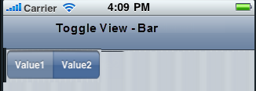
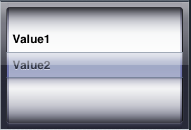

                                  

ComboBox Properties
===================

The properties of ComboBox Widget are as follows:

* * *


<details close markdown="block"><summary>accessibilityConfig Property</summary>

* * *

Enables you to control accessibility behavior and alternative text for the widget.

For more information on using accessibility features in your app, see the [Accessibility](../../../Iris/app_design_dev/Content/Accessibility_Overview.md) appendix in the Volt MX IrisUser Guide.

### Syntax

```

accessibilityConfig
```

### Type

Object

### Read/Write

Read + Write

### Remarks

*   The accessibilityConfig property is enabled for all the widgets which are supported under the Flex Layout.

> **_Note:_** From Volt MX Iris V9 SP2 GA version, you can provide i18n keys as values to all the attributes used inside the `accessibilityConfig` property. Values provided in the i18n keys take precedence over values provided in `a11yLabel`, `a11yValue`, and `a11yHint` fields.

The accessibilityConfig property is a JavaScript object which can contain the following key-value pairs.

  
| Key | Type | Description | ARIA Equivalent |
| --- | --- | --- | --- |
| a11yIndex | Integer with no floating or decimal number. | This is an optional parameter. Specifies the order in which the widgets are focused on a screen. | For all widgets, this parameter maps to the `aria-index`, `index`, or `taborder` properties. |
| a11yLabel | String | This is an optional parameter. Specifies alternate text to identify the widget. Generally the label should be the text that is displayed on the screen. | For all widgets, this parameter maps to the `aria-labelledby` property of ARIA in HTML. > **_Note:_** For the Image widget, this parameter maps to the **alt** attribute of ARIA in HTML. |
| a11yValue | String | This is an optional parameter. Specifies the descriptive text that explains the action associated with the widget. On the Android platform, the text specified for a11yValue is prefixed to the a11yHint. | This parameter is similar to the a11yLabel parameter. If the a11yValue is defined, the value of a11yValue is appended to the value of a11yLabel. These values are separated by a space. |
| a11yHint | String | This is an optional parameter. Specifies the descriptive text that explains the action associated with the widget. On the Android platform, the text specified for a11yValue is prefixed to the a11yHint. | For all widgets, this parameter maps to the `aria-describedby` property of ARIA in HTML. |
| a11yHidden | Boolean | This is an optional parameter. Specifies if the widget should be ignored by assistive technology. The default option is set to _false_. This option is supported on iOS 5.0 and above, Android 4.1 and above, and SPA | For all widgets, this parameter maps to the `aria-hidden` property of ARIA in HTML. |
| a11yARIA | Object | This is an optional parameter. For each widget, the key and value provided in this object are added as the attribute and value of the HTML tags respectively. Any values provided for attributes such as `aria-labelledby` and `aria-describedby` using this attribute, takes precedence over values given in `a11yLabel` and `a11yHint` fields. When a widget is provided with the following key value pair or attribute using the a11yARIA object, the tabIndex of the widget is automatically appended as zero.`{"role": "main"}``aria-label` | This parameter is only available on the Desktop Web platform. |

**Android limitations**

*   If the results of the concatenation of a11y fields result in an empty string, then `accessibilityConfig` is ignored and the text that is on widget is read out.
*   The soft keypad does not gain accessibility focus during the right/left swipe gesture when the keypad appears.

SPA/Desktop Web limitations

*   When `accessibilityConfig` property is configured for any widget, the `tabIndex` attribute is added automatically to the `accessibilityConfig` property.
*   The behavior of accessibility depends on the Web browser, Web browser version, Voice Over Assistant, and Voice Over Assistant version.
*   Currently SPA/Desktop web applications support only a few ARIA tags. To achieve more accessibility features, use the attribute a11yARIA. The corresponding tags will be added to the DOM as per these configurations.

**Example 1**

This example uses the button widget, but the principle remains the same for all widgets that have an accessibilityConfig property.

```
//This is a generic property that is applicable for various widgets.
//Here, we have shown how to use the accessibilityConfig Property for button widget.
/* You need to make a corresponding use of the accessibilityConfig property for other applicable widgets. */

Form1.myButton.accessibilityConfig = {
    "a11yLabel": "Label",
    "a11yValue": "Value",
    "a11yHint": "Hint"    
};
```

**Example 2**

This example uses the button widget to implement internationalization in `accessibilityConfig` property, but the principle remains the same for all widgets.

```
/*Sample code to implement internationalization in accessibilityConfig property in Native platform.*/

Form1.myButton.accessibilityConfig = {
    "a11yLabel": voltmx.i18n.getLocalizedString("key1")     
};  
/* Sample code to implement internationalization in accessibilityConfig property in Desktop Web platform. */

Form1.myButton.accessibilityConfig = {
    "a11yLabel": "voltmx.i18n.getLocalizedString(\"key3\")"
};
```

### Platform Availability

*   Available in the IDE
*   iOS, Android, SPA, and Desktop Web

* * *

</details>
<details close markdown="block"><summary>anchorPoint Property</summary>

* * *

Specifies the anchor point of the widget bounds rectangle using the widget's coordinate space.

### Syntax

```

anchorPoint
```

### Type

JSObject

### Read/Write

Read + Write

### Remarks

The value for this property is a JavaScript dictionary object with the keys "x" and "y". The values for the "x" and "y" keys are floating-point numbers ranging from 0 to 1. All geometric manipulations to the widget occur about the specified point. For example, applying a rotation transform to a widget with the default anchor point causes the widget to rotate around its center.

The default value for this property is center ( {"x":0.5, "y":0.5} ), that represents the center of the widgets bounds rectangle. The behavior is undefined if the values are outside the range zero (0) to one (1).

### Example

```
Form1.widget1.anchorPoint = {
    "x": 0.5,
    "y": 0.5
};
```

### Platform Availability

*   iOS, Android, Windows, and SPA

* * *

</details>
<details close markdown="block"><summary>blockedUISkin Property</summary>

* * *

Specifies the skin that must be used to block the interface until the action in progress (for example, a service call) is completed.

### Syntax

```

blockedUISkin
```

### Type

String

### Read/Write

Read + Write

### Remarks

The default value for this property is none. That means no skin is applied. To specify a skin, select a skin from the list.

> **_Note:_** For the skin to be available in the list, you must add a skin for Blocked UI under Widget Skins.

### Example

```
//Sample code to set the blockedUISkin property for a ComboBox Widget.
frmCombobox.myCombobox.blockedUISkin="blockUiSkn";
```

### Platform Availability

*   Available in the IDE
*   SPA (iPhone/Android/BlackBerry/Windows NTH)

* * *

</details>
<details close markdown="block"><summary>contentAlignment Property</summary>

* * *

This property specifies the alignment of the text on the widget with respect to its boundaries.

### Syntax

contentAlignment

### Type

Number

### Read/Write

Read+Write

### Remarks

The default value for the property is _CONTENT\_ALIGN\_CENTER_.

The following are the available options:

*   constants.CONTENT\_ALIGN\_TOP\_LEFT
*   constants.CONTENT\_ALIGN\_TOP\_CENTER
*   constants.CONTENT\_ALIGN\_TOP\_RIGHT
*   constants.CONTENT\_ALIGN\_MIDDLE\_LEFT
*   constants.CONTENT\_ALIGN\_CENTER
*   constants.CONTENT\_ALIGN\_MIDDLE\_RIGHT
*   constants.CONTENT\_ALIGN\_BOTTOM\_LEFT
*   constants.CONTENT\_ALIGN\_BOTTOM\_CENTER
*   constants.CONTENT\_ALIGN\_BOTTOM\_RIGHT

**Limitations**

Desktop Web/ SPA platforms do not support _contentAlignment_ property in Camera widget, ComboBox widget and ListBox widget.

### Example

```
 /* Sample code to set the contentAlignment property of the widgetID Button widget in frmHome Form. */
  
frmHome.widgetID.contentAlignment=constants.CONTENT_ALIGN_TOP_LEFT;  

```

### Platform Availability

*   Available in IDE
*   Available on all platforms

* * *

</details>
<details close markdown="block"><summary>dropDownImage Property</summary>

* * *

Specifies the image to be used for the drop-down box indicator. This is an inverted triangle by default. If you do not specify an image, the drop-down box displays the default image.

### Syntax

```

dropDownImage
```

### Type

String/image object

### Read/Write

No

### Remarks

For iOS platform, the drop down image should be 20px \* 33px for non retina devices and for retina devices the image size should be 40px \* 66px.

### Example

Using a locally defined image:

```

//Sample code to set the dropDownImage property for a ComboBox Widget.
frmCombobox.myCombobox.dropDownImage="ddimage.png";
```

Using an image object (voltmx.image):

```

//Sample code to set the dropDownImage property for a ComboBox Widget using Image Object  
  
var imgObjRef = voltmx.image.createImage("local.png");
frmCombobox.myCombobox.dropDownImage=imgObjRef;
```

### Platform Availability

*   Available in the IDE
*   iOS
*   BlackBerry

* * *

</details>
<details close markdown="block"><summary>enable Property</summary>

* * *

The `enable` property is used to control the actionability of the widgets. In a scenario where you want to display a widget but not invoke any action on the widget, configure the `enable` property to false to achieve it.

This is a constructor level property and applicable for all widgets in Volt MX Iris.

### Syntax

```

enable
```

### Type

Boolean

### Read/Write

Read + Write

### Remarks

The default value of this property is true.

When `enable` property is configured to true, the action associated with a widget can be invoked by the user in the application.

When `enable` property is configured to false, the action associated with a widget cannot be invoked by the user in the application.

### Example

```
//This is a generic property and is applicable for many widgets.  
 
/* The example provided is for the Button widget. Make the changes required in the example while using other widgets. */

frmButton.myBtn.enable= true;
```

### Platform Availability

*   Android, iOS, Windows, SPA, and Desktop web

 

* * *

</details>
<details close markdown="block"><summary>enableCache Property</summary>

* * *

The property enables you to improve the performance of Positional Dimension Animations.

### Syntax

```

enableCache
```

### Type

Boolean

### Read/Write

Read + Write

### Remarks

The default value for this property is true.

> **_Note:_** When the property is used, application consumes more memory. The usage of the property enables tradeoff between performance and visual quality of the content. Use the property cautiously.

### Example

```

Form1.widgetID.enableCache = true;
```

### Platform Availability

*   Available in the IDE.
*   Windows

* * *

</details>
<details close markdown="block"><summary>focusSkin Property</summary>

* * *

Specifies the look and feel of the ComboBox when in focus.

### Syntax

```

focusSkin
```

### Type

String

### Read/Write

Read + Write

### Remarks

In Desktop Web platform, Chrome browser does not support if the properties defined in font tab are different for [skin](#skin) and focusSkin.

> **_Note:_** You must be aware of the following:  
1\. On J2ME non-touch devices, if you do not specify the focusSkin, it is not possible to identify the focus change between the widgets.  
2\. Mobile Web does not support this property, instead browser specific focus will be applied.  
3\. On Windows Platform, focusSkin is applied only to the selected item, but not to the entire widget when in focus.  

### Example

```

//Sample code to set the focusSkin property for a ComboBox Widget.  
  
frmCombobox.myCombobox.focusSkin="comboFSkin";
```

### Platform Availability

*   Available in the IDE
*   Available on all platforms

* * *

</details>
<details close markdown="block"><summary>groupCells Property</summary>

* * *

Specifies if the group cells style must be applied.

### Syntax

```

groupCells
```

### Type

Boolean

### Read/Write

No

### Remarks

The default value for this property is false. This property is applicable only when [viewType](#viewType) is set as COMBOBOX\_VIEW\_TYPE\_TABLEVIEW.

### Example

```

//Sample code to enable the groupCells property for a ComboBox Widget.  
  
frmCombobox.myCombobox.groupCells=true;
```

### Platform Availability

*   Available in the IDE
*   iPad
*   iPhone

* * *

</details>
<details close markdown="block"><summary>hoverSkin Property</summary>

* * *

Specifies the look and feel of a widget when the cursor hovers on the widget.

### Syntax

```

hoverSkin
```

### Type

String

### Read/Write

Read + Write

### Example

Setting the hoverSkin property on an existing widget

```
FormHover.widgetID.hoverSkin="theHoverSkin";
//the Hover Skin is a hover skin created under Skins tab
```

> **_Note:_** To apply hoverSkin for dynamically created widgets or cloned widgets, assign hoverSkin dynamically after adding the widget to the form hierarchy. This is applicable for the Desktop web platform.

```

formid.widgetid.hoverSkin = "skinname";
```

### Platform Availability

*   Available in the IDE
*   Windows

* * *

</details>
<details close markdown="block"><summary>id Property</summary>

* * *

id is a unique identifier of button consisting of alpha numeric characters. Every ComboBox should have a unique id within an Form.

### Syntax

```

id
```

### Type

String - \[Mandatory\]

### Read/Write

Read + Write

### Example

```
//Defining the properties for ComboBox with the id:"combobox1"
var comboBasic = {
    id: "combobox1",
    isVisible: true
};

var comboLayout = {
    containerWeight: 100
};

var comboPSP = {};

//Creating the ComboBox.
combo = new voltmx.ui.ComboBox(comboBasic, comboLayout, comboPSP);

//Reading the id of the ComboBox
alert("ComboBox ID is ::" + combo.id);
```

### Platform Availability

*   Available in the IDE
*   Available on all platforms

* * *

</details>
<details close markdown="block"><summary>info Property</summary>

* * *

A custom JSObject with the key value pairs that a developer can use to store the context with the widget. This will help in avoiding the globals to most part of the programming.

### Syntax

info

### Type

JSObject

### Read/Write

Read + Write

### Remarks

This is a **non-Constructor** property. You cannot set this property through widget constructor. But you can read and write data to it.

Info property can hold any JSObject. After assigning the JSObject to info property, the JSObject should not be modified. For example,

```

var inf = {
    a: 'hello'
};
widget.info = inf;

//works
widget.info.a = 'hello world';

/*This will not update the widget info a property to Hello world. 
widget.info.a will have old value as hello.*/
```

### Example

```
//Sample code to set info property for a ComboBox widget

frmCombobox.myCombobox.info = {
    key: "comboboxitems"
};

//Reading the info of the CollectionView widget.
voltmx.print("Combobox widget info:" +frmCombobox.myCombobox.info);
```

### Platform Availability

*   Not available in the IDE
*   Available on all platforms

* * *

</details>
<details close markdown="block"><summary>inputAccessoryViewType Property</summary>

* * *

While building iPhone applications that support or provide text input, it is necessary to create some extra buttons (or other controls) beyond the ones provided by the default keyboard interface. Volt MX AppPlatform by default, adds the Previous, Next, and Done buttons to the applicable input controls. These buttons allow specific operations needed by your application, such as moving to the next or previous text field, making the keyboard disappear and so on. The area above the keyboard is known as Input Accessory View.

### Syntax

```

inputAccessoryViewType
```

### Type

Number

### Read/Write

Yes

### Remarks

The default value for this property is COMBOBOX\_INPUTACCESSORYVIEW\_DEFAULT.

This property, allows you to specify the type of accessory view that will be shown for all the input controls for **Combobox** widget.

> **_Note:_** For iOS, a header with 'Prev' and Next' buttons is added to the keypad by default. You can turn off this header at three levels: application-level, form-level, and widget-level.

To know more about how to set inputAccessoryViewType property at application-level and form-level, you can refer the [inputAccessoryViewType](FlexForm_Properties.md#inputAcc) property under Flexform widget.

To turn on/off the header at widget-level, assign any of the following constants to the inputAccessoryViewType property. You must specify each constant with the ‘constants.xx’ prefix.

*   COMBOBOX\_INPUTACCESSORYVIEW\_NONE: Use this option if you do not want to specify the toolbar. This option should be used carefully, as setting this option for widgets like calendar leaves the user with no option to select and drop-down like a wheel calendar.
*   COMBOBOX\_INPUTACCESSORYVIEW\_DEFAULT:Specifies that the toolbar that is defined in the Application level settings. To set the Application level settings, right-click on the project and navigate to **Properties> Native App>iPhone/iPad.**
*   COMBOBOX\_INPUTACCESSORYVIEW\_NEXTPREV: Specifies the navigation options as Next, Previous, and Done for a form.

*   COMBOBOX\_INPUTACCESSORYVIEW\_CANCEL: Specifies that the input accessory view has a Cancel button. This constant does not trigger any events.

#### Example

```
//Sample code to set the inputAccessoryViewType property for a ComboBox Widget.  
  
frmCbox.myCbox.inputAccessoryViewType=constants.COMBOBOX_INPUTACCESSORYVIEWTYPE_DEFAULT;
```

### Platform Availability

*   Available in the IDE
*   iPhone
*   iPad

* * *

</details>
<details close markdown="block"><summary>isVisible Property</summary>

* * *

This property controls the visibility of a widget on the form.

### Syntax

```

isVisible
```

### Type

Boolean

### Read/Write

Read + Write

### Remarks

The default value for this property is true.

You can set the visibility of a widget dynamically from code using the setVisibility method.

### Example

```
//Sample code to set the isVisible property for a ComboBox Widget.  

frmCombobox.myCombobox.isVisible=true;
```

### Platform Availability

*   Available in the IDE
*   Available on all platforms

* * *

</details>
<details close markdown="block"><summary>lockTextScroll Property</summary>

* * *

This property allows you to enable/disable the horizontal scrolling for the selected item in the ComboBox Widget.

### Syntax

```

lockTextScroll
```

### Type

Boolean

### Read/Write

Read + Write

### Remarks

The default value for this property is false.

If set to _true,_ the scrolling for the selected item is disabled. If set to _false,_ the scrolling for the selected item is enabled.

### Example

```
//Sample code to enable the lockTextScroll property for a ComboBox Widget.  
  
frmCombobox.myCombobox.lockTextScroll=true;
```

### Platform Availability

*   Not available in the IDE
*   This property is available on Windows Phone 8/8/1 platforms

* * *

</details>
<details close markdown="block"><summary>masterData Property</summary>

* * *

Specifies the set of values that must be displayed for the user to make a selection from the available choices.

### Syntax

```

masterData
```

### Type

Array

### Read/Write

Read + Write

### Remarks

The default value for this property is user defined. You must specify the key and the display value

To specify the set of values, click the Ellipsis () button against the property to open the MasterData for ComboBox window.

In the Master Data window, you can specify the _Key_, _Display Value_, _i18n Key_, and the _Accessibility Config_. You can use the _Selected_ column to specify the choice to be shown as selected when rendered. You can do this by selecting _true_ against the choice that you wish to show as selected.

If the key or the display value is _nil_, the value will not be listed as one of the available choices.

The following image illustrates the MasterData for ComboBox window:


> **_Note:_** Select the _Use as test data in preview mode_ option if you want to see the data you enter in the Master Data when you use the quick preview feature of the IDE. (For more information on Quick Preview, see the _VoltMX Iris User Guide_.

> **_Note:_** The accessibilityConfigObject is optional and the object should contain the keys as defined in the accessibilityConfig property.

```

//Format of the masterData property

[
	["key1","value1",accessibilityConfigObject],
	["key2","value2",accessibilityConfigObject],
	["keyn","valuen",accessibilityConfigObject]
]
```

### Example

```
//Sample code to set the masterData property for a ComboBox Widget.  
  
frmCombobox.myCombobox.masterData = [
 ["A", "Asia", accessibilityConfigObject],
 ["E", "Europe", accessibilityConfigObject],
 ["AU", "Australia", accessibilityConfigObject],
 ["NA", "North America", accessibilityConfigObject]
];
```

### Platform Availability

*   Available in the IDE
*   Available on all platforms

</details>
<details close markdown="block"><summary>masterDataMap Property</summary>

Specifies the set of values from which you can make a selection. You must set the values from the code.

### Syntax

```

masterDataMap
```

### Type

Array

### Read/Write

Read + Write

### Remarks

This is a **non-Constructor** property. You cannot set this property through widget constructor. But you can read and write data to it.

This property is applicable only if the [masterData](#masterDa) is not set. You must use either the [masterData](#masterDa) or the _masterDataMap_ property to set data for the ComboBox.

You must specify a key, value, and the accessibilityConfig in a master data map.

```
//Format of the masterDataMap property
[
    [{
            "mykey": "item1",
            "myvalue": "Item One",
            "accessibilityConfig": acObject
        }, {
            "mykey": "item2",
            "myvalue": "Item Two",
            "accessibilityConfig": acObject
        }, ..., ["mykey": "itemn", "myvalue": "Item N", "accessibilityConfig": "acObject}
	],

	"
            mykey ",
	"
            myvalue "
]
```

> **_Note:_** The accessibilityConfig is the standard key expected in each items data array. It is optional and the object should contain the keys as defined in the accessibilityConfig property.

> **_Note:_** If the key or the value is _null/nil_, the value will not be listed as one of the available choices.

### Example

```
//Sample code to set the masterDataMap property for a ComboBox Widget.  
  
frmCombobox.myCombobox.masterDataMap = [
 [{
  "mykey": "key1",
  "myvalue": "value1",
  "accessibilityConfig": acObject
 }, {
  "mykey": "key2",
  "myvalue": "value2",
  "accessibilityConfig": acObject
 }, {
  "mykey": "key3",
  "myvalue": "value3",
  "accessibilityConfig": acObject
 }], "mykey", "myvalue"
];
```

### Availability

*   Not available in the IDE
*   Available on all platforms

* * *

</details>
<details close markdown="block"><summary>opacity Property</summary>

* * *

Specifies the opacity of the widget. The value of this property must be in the range 0.0 (transparent) to 1.0 (opaque). Any values outside this range are fixed to the nearest minimum or maximum value.

Specifies the opacity of the widget. Valid opacity values range from 0.0 (transparent), to 1.0 (opaque). Values set to less than zero will default to zero. Values more than 1.0 will default to 1. Interaction events set on a transparent widget will still be fired. To disable the events, also set the “isVisible” property to “false”.

### Syntax

```

opacity
```

### Type

Number

### Read/Write

Read + Write

### Remarks

> **_Note:_** This property has more priority compared to the values coming from the configured skin.

### Example

```
//Sample code to make the widget transparent by using the opacity property.
frmHome.widgetID.opacity = 0;

//Sample code to make the widget opaque by using the opacity property.
frmHome.widgetID.opacity = 1;
```

### Platform Availability

*   Not available in the IDE.
*   iOS, Android, Windows, SPA, and Desktop Web

* * *

</details>
<details close markdown="block"><summary>parent Property</summary>

* * *

Helps you access the parent of the widget. If the widget is not part of the widget hierarchy, the parent property returns null.

### Syntax

```

parent
```

### Read/Write

Read only

### Remarks

> **_Note:_** The property works for all the widgets inside a FlexForm, FlexContainer or FlexScrollContainer.

### Example

```
function func() {

    voltmx.print("The parent of the widget" + JSON.stringify(Form1.widgetID.parent));

}
```

### Platform Availability

*   Not available in the IDE
*   iOS, Android, Windows, SPA, and Desktop Web

* * *

</details>
<details close markdown="block"><summary>placeholder Property</summary>

* * *

Specifies the temporary or substitute text (a hint provided as a word or phrase) that must be displayed on the ComboBox until the actual selection is made. If you do not specify the placeholder text, the first option in the list is shown as the selected value.

### Syntax

```

placeholder
```

### Type

String

### Read/Write

Read + Write

### Remarks

On iPhone platform, placeholder is supported only when the viewType is set as COMBOBOX\_VIEW\_TYPE\_LISTVIEW.

### Example

If you specify a value for the placeholder property and set selectedkey=nil or selectedkeyvalue=nil, then the specified placeholder is displayed to the user when the Combo Box is rendered.

```
//Sample code to set the placeholder property for a ComboBox Widget.  

frmCombobox.myCombobox.placeholder= "Please select a value";
```

### Platform Availability

*   Available in the IDE
*   iPad
*   iPhone
*   BlackBerry
*   Windows Phone
*   J2ME

* * *

</details>
<details close markdown="block"><summary>popupFocusSkin Property</summary>

* * *

Specifies the skin that is applied to each item in the native popup (list of options available) that appears when you select the ComboBox.

### Syntax

```

popupFocusSkin
```

### Type

String

### Read/Write

Read + Write

### Example

```

//Sample code to set the popupFocusSkin property for a ComboBox Widget.  
  
frmCombobox.myCombobox.popupFocusSkin= "popFSkn";
```

### Platform Availability

*   Available in the IDE
*   This property is available on BlackBerry platform only

* * *

</details>
<details close markdown="block"><summary>popupSkin Property</summary>

* * *

Specifies the skin that is applied to each item in the native popup (list of options available) that appears when you select the ComboBox.

### Syntax

```

popupSkin
```

### Type

String

### Read/Write

Read + Write

### Example

```
//Sample code to set the popupSkin property for a ComboBox Widget.  

frmCombobox.myCombobox.popupSkin= "popSkn";
```

### Platform Availability

*   Available in the IDE
*   This property is available on BlackBerry platform only.

* * *

</details>
<details close markdown="block"><summary>popupTitle Property</summary>

* * *

Specifies the title text to be displayed for the ComboBox.

### Syntax

```

popupTitle
```

### Type

String

### Read/Write

Read + Write

### Remarks

The default value for this property is _Please Select_.


### Example

```
//Sample code to set the popupTitle property for a ComboBox Widget.  

frmCombobox.myCombobox.popupTitle="ComboPopUp";
```

### Platform Availability

*   Available in the IDE.
*   Android

* * *

</details>
<details close markdown="block"><summary>retainContentAlignment Property</summary>

* * *

This property is used to retain the content alignment property value, as it was defined.

> **_Note:_** Locale-level configurations take priority when invalid values are given to this property, or if it is not defined.

The mirroring widget layout properties should be defined as follows.

```
function getIsFlexPositionalShouldMirror(widgetRetainFlexPositionPropertiesValue) {
    return (isI18nLayoutConfigEnabled &&
    localeLayoutConfig[defaultLocale]
    ["mirrorFlexPositionalProperties"] == true &&
    !widgetRetainFlexPositionPropertiesValue);
}
```

The following table illustrates how widgets consider Local flag and Widget flag values.

  
| Properties | Local Flag Value | Widget Flag Value | Action |
| --- | --- | --- | --- |
| Mirror/retain FlexPositionProperties | true | true | Use the designed layout from widget for all locales. Widget layout overrides everything else. |
| Mirror/retain FlexPositionProperties | true | false | Use Mirror FlexPositionProperties since locale-level Mirror is true. |
| Mirror/retain FlexPositionProperties | true | not specified | Use Mirror FlexPositionProperties since locale-level Mirror is true. |
| Mirror/retain FlexPositionProperties | false | true | Use the designed layout from widget for all locales. Widget layout overrides everything else. |
| Mirror/retain FlexPositionProperties | false | false | Use the Design/Model-specific default layout. |
| Mirror/retain FlexPositionProperties | false | not specified | Use the Design/Model-specific default layout. |
| Mirror/retain FlexPositionProperties | not specified | true | Use the designed layout from widget for all locales. Widget layout overrides everything else. |
| Mirror/retain FlexPositionProperties | not specified | false | Use the Design/Model-specific default layout. |
| Mirror/retain FlexPositionProperties | not specified | not specified | Use the Design/Model-specific default layout. |

### Syntax

```

retainContentAlignment
```

### Type

Boolean

### Read/Write

No (only during widget-construction time)

### Example

```

//This is a generic property that is applicable for various widgets.
//Here, we have shown how to use the retainContentAlignment property for Button widget.
/* You need to make a corresponding use of the 
retainContentAlignment property for other applicable widgets. */
var btn = new voltmx.ui.Button({
    "focusSkin": "defBtnFocus",
    "height": "50dp",
    "id": "myButton",
    "isVisible": true,
    "left": "0dp",
    "skin": "defBtnNormal",
    "text": "text always from top left",
    "top": "0dp",
    "width": "260dp",
    "zIndex": 1
}, {
    "contentAlignment": constants.CONTENT_ALIGN_TOP_LEFT,
    "displayText": true,
    "padding": [0, 0, 0, 0],
    "paddingInPixel": false,
    "retainFlexPositionProperties": false,
    "retainContentAlignment": true
}, {});
```

### Platform Availability

*   Available in IDE
*   Windows, iOS, Android, and SPA

* * *

</details>
<details close markdown="block"><summary>retainFlexPositionProperties Property</summary>

* * *

This property is used to retain flex positional property values as they were defined. The flex positional properties are left, right, and padding.

> **_Note:_** Locale-level configurations take priority when invalid values are given to this property, or if it is not defined.

The mirroring widget layout properties should be defined as follows.

```
function getIsFlexPositionalShouldMirror(widgetRetainFlexPositionPropertiesValue) {
    return (isI18nLayoutConfigEnabled &&
    localeLayoutConfig[defaultLocale]
    ["mirrorFlexPositionalProperties"] == true &&
    !widgetRetainFlexPositionPropertiesValue);
}
```

The following table illustrates how widgets consider Local flag and Widget flag values.

  
| Properties | Local Flag Value | Widget Flag Value | Action |
| --- | --- | --- | --- |
| Mirror/retain FlexPositionProperties | true | true | Use the designed layout from widget for all locales. Widget layout overrides everything else. |
| Mirror/retain FlexPositionProperties | true | false | Use Mirror FlexPositionProperties since locale-level Mirror is true. |
| Mirror/retain FlexPositionProperties | true | not specified | Use Mirror FlexPositionProperties since locale-level Mirror is true. |
| Mirror/retain FlexPositionProperties | false | true | Use the designed layout from widget for all locales. Widget layout overrides everything else. |
| Mirror/retain FlexPositionProperties | false | false | Use the Design/Model-specific default layout. |
| Mirror/retain FlexPositionProperties | false | not specified | Use the Design/Model-specific default layout. |
| Mirror/retain FlexPositionProperties | not specified | true | Use the designed layout from widget for all locales. Widget layout overrides everything else. |
| Mirror/retain FlexPositionProperties | not specified | false | Use the Design/Model-specific default layout. |
| Mirror/retain FlexPositionProperties | not specified | not specified | Use the Design/Model-specific default layout. |

### Syntax

```

retainFlexPositionProperties
```

### Type

Boolean

### Read/Write

No (only during widget-construction time)

### Example

```
//This is a generic property that is applicable for various widgets.
// Here, we have shown how to use the retainFlexPositionProperties property for Button widget.
/* You need to make a corresponding use of the 
retainFlexPositionProperties property for other applicable widgets. */
var btn = new voltmx.ui.Button({
    "focusSkin": "defBtnFocus",
    "height": "50dp",
    "id": "myButton",
    "isVisible": true,
    "left": "0dp",
    "skin": "defBtnNormal",
    "text": "always left",
    "top": "0dp",
    "width": "260dp",
    "zIndex": 1
}, {
    "contentAlignment": constants.CONTENT_ALIGN_CENTER,
    "displayText": true,
    "padding": [0, 0, 0, 0],
    "paddingInPixel": false,
    "retainFlexPositionProperties": true,
    "retainContentAlignment": false
}, {});
```

### Platform Availability

*   Available in IDE
*   Windows, iOS, Android, and SPA

* * *

</details>
<details close markdown="block"><summary>retainFlowHorizontalAlignment Property</summary>

* * *

This property is used to convert Flow Horizontal Left to Flow Horizontal Right.

> **_Note:_** Locale-level configurations take priority when invalid values are given to this property, or if it is not defined.

The mirroring widget layout properties should be defined as follows.

```
function getIsFlexPositionalShouldMirror(widgetRetainFlexPositionPropertiesValue) {
    return (isI18nLayoutConfigEnabled &&
    localeLayoutConfig[defaultLocale]
    ["mirrorFlexPositionalProperties"] == true &&
    !widgetRetainFlexPositionPropertiesValue);
}
```

The following table illustrates how widgets consider Local flag and Widget flag values.

  
| Properties | Local Flag Value | Widget Flag Value | Action |
| --- | --- | --- | --- |
| Mirror/retain FlexPositionProperties | true | true | Use the designed layout from widget for all locales. Widget layout overrides everything else. |
| Mirror/retain FlexPositionProperties | true | false | Use Mirror FlexPositionProperties since locale-level Mirror is true. |
| Mirror/retain FlexPositionProperties | true | not specified | Use Mirror FlexPositionProperties since locale-level Mirror is true. |
| Mirror/retain FlexPositionProperties | false | true | Use the designed layout from widget for all locales. Widget layout overrides everything else. |
| Mirror/retain FlexPositionProperties | false | false | Use the Design/Model-specific default layout. |
| Mirror/retain FlexPositionProperties | false | not specified | Use the Design/Model-specific default layout. |
| Mirror/retain FlexPositionProperties | not specified | true | Use the designed layout from widget for all locales. Widget layout overrides everything else. |
| Mirror/retain FlexPositionProperties | not specified | false | Use the Design/Model-specific default layout. |
| Mirror/retain FlexPositionProperties | not specified | not specified | Use the Design/Model-specific default layout. |

### Syntax

```

retainFlowHorizontalAlignment
```

### Type

Boolean

### Read/Write

No (only during widget-construction time)

### Example

```

//This is a generic property that is applicable for various widgets.
//Here, we have shown how to use the retainFlowHorizontalAlignment property for Button widget.
/* You need to make a corresponding use of the 
retainFlowHorizontalAlignment property for other applicable widgets. */
var btn = new voltmx.ui.Button({
 "focusSkin": "defBtnFocus",
 "height": "50dp",
 "id": "myButton",
 "isVisible": true,
 "left": "0dp",
 "skin": "defBtnNormal",
 "text": "always left",
 "top": "0dp",
 "width": "260dp",
 "zIndex": 1
}, {
 "contentAlignment": constants.CONTENT_ALIGN_CENTER,
 "displayText": true,
 "padding": [0, 0, 0, 0],
 "paddingInPixel": false,
 "retainFlexPositionProperties": true,
 "retainContentAlignment": false,
 "retainFlowHorizontalAlignment ": false
}, {});
```

### Platform Availability

*   Available in IDE
*   Windows, iOS, Android, and SPA

* * *

</details>
<details close markdown="block"><summary>selectedKey Property</summary>

* * *

Specifies the value to be shown as selected. If you do not select a value, the return value is _null/nil_.

### Syntax

```

selectedKey
```

### Type

String

### Read/Write

Read + Write

### Remarks

On Android platform, if you do not select a value, the first item in the ComboBox is selected.

If you create a ComboBox with multiple values, you can choose to show a specific value as selected when the ComboBox is rendered.

### Example

```
//Sample code to set the selectedKey property for a ComboBox Widget with the key:key1.  
  
frmCombobox.myCombobox.selectedKey="key1";
//Sample code to read the selectedKey property of the ComboBox widget.
alert("ComboBox selectedKey is ::" + frmCombobox.myCombobox.selectedKey);  

```

### Availability

*   Not available in the IDE
*   Available on all platforms.

* * *

</details>
<details close markdown="block"><summary>selectedKeyValue Property</summary>

* * *

Returns the array of selected key-value pair. If you do not select a value, the return value is _null/nil_.

### Syntax

```

selectedKeyValue
```

### Type

Array

### Read/Write

Read + Write

### Example

```
//Sample code to set the selectedKeyValue property for a ComboBox Widget.  

frmCombobox.myCombobox.selectedKeyValue = [
 ["key1", "value1"],
 ["key2", "value2"]
];
//Sample code to read the selectedKey property of the ComboBox widget.  
alert("ComboBox selectedKey is ::" + frmCombobox.myCombobox.selectedKeyValue);  

```

### Availability

Not available in the IDE.

*   Not available in the IDE
*   Available on all platforms.

* * *

</details>
<details close markdown="block"><summary>showAppMenu Property</summary>

* * *

This property provides you to show or hide the app menu when the dialog is open.

### Syntax

```

showAppMenu
```

### Type

Boolean

### Read/Write

Read + Write

### Remarks

The default value for this property true.

When this property is set to true, the app menu is visible.

When this property is set to false, the app menu is hidden.

### Example

```
//Sample code to enable the showAppMenu property for a ComboBox Widget.  

frmCombobox.myCombobox.showAppMenu=true;

```

### Platform Availability

*   Not available in the IDE
*   This property is available on Windows 8.1 platform only.

* * *

</details>
<details close markdown="block"><summary>singleLineText Property</summary>

* * *

If the length of the text is more than the space available, the selected options text will be displayed truncated, in a single line with (...) ellipses. The position of the ellipses is controlled by textTruncatePosition property. The default ellipses position is at the end of the line if textTruncatePosition property is not set.

### Syntax

```

singleLineText
```

### Type

Boolean

### Read/Write

Read + Write

### Remarks

The default value for this property is false.

### Example

```
//Sample code to enable the singleLineText property for a ComboBox Widget.  
  
frmCombobox.myCombobox.singleLineText=true;   

```

### Platform Availability

*   Not available in the IDE
*   This property is available on Android/Android Tablet platform

* * *

</details>
<details close markdown="block"><summary>singleLineTextInPopup Property</summary>

* * *

If the length of the text is more than the space available, the popup options text will be displayed truncated, in a single line with (...) ellipses. The position of the ellipses is controlled by textTruncatePositionInPopup property. The default ellipses position is at the end of the line if textTruncatePositionInPopup property is not set.

### Syntax

```

singleLineTextInPopup
```

### Type

Boolean

Read/Write

Read + Write

### Remarks

The default value for this property false.

### Example

```
//Sample code to enable the singleLineTextInPopup property for a ComboBox Widget.  
  
frmCombobox.myCombobox.singleLineTextInPopup=true;   

```

### Platform Availability

*   Not available in the IDE
*   This property is available on Android/Android Tablet platform

* * *

</details>
<details close markdown="block"><summary>skin Property</summary>

* * *

Specifies the look and feel of the ComboBox when not in focus.

### Syntax

```

skin
```

### Type

String

### Read/Write

Read + Write

### Remarks

In Desktop Web platform, Chrome browser does not support if the properties defined in font tab are different for skin and [focusSkin](#focusSki).

In Android platform, you can apply skin only to the dropdown list that displays when ComboBox is clicked.

### Example

```
//Sample code to set the skin property for a ComboBox Widget.  
  
frmCombobox.myCombobox.skin="comboSkin";   

```

### Platform Availability

*   Available in the IDE
*   Available on all platforms

* * *

</details>
<details close markdown="block"><summary>textTruncatePosition Property</summary>

* * *

When the property [singleLineText](#singleLi) is set to true, this property controls the position of the ellipses (...), in the selected option text.

### Syntax

```

textTruncatePosition
```

### Type

Number

### Read/Write

Read + Write

### Remarks

The options are:

*   constants.TEXT\_TRUNCATE\_START
*   constants.TEXT\_TRUNCATE\_MIDDLE
*   constants.TEXT\_TRUNCATE\_END (Default)

### Example

```
/*Sample code to set the textTruncatePosition property for a ComboBox Widget to TEXT_TRUNCATE_MIDDLE.*/  
  
frmCombobox.myCombobox.textTruncatePosition=constants.TEXT_TRUNCATE_MIDDLE;   

```

### Platform Availability

*   Not available in the IDE
*   This property is available on Android/Android Tablet platform

* * *

</details>
<details close markdown="block"><summary>textTruncatePositionInPopup Property</summary>

* * *

When the property [singleLineTextInPopup](#singleLi2) is set to true, this property controls the position of the ellipses (...), in the popup options text.

### Syntax

textTruncatePositionInPopup

### Type

Number

### Read/Write### 

Read + Write

### Remarks

The options are:

*   constants.TEXT\_TRUNCATE\_START
*   constants.TEXT\_TRUNCATE\_MIDDLE
*   constants.TEXT\_TRUNCATE\_END (Default)

### Example

```
/*Sample code to set the textTruncatePositionInPopup property for a ComboBox Widget to TEXT_TRUNCATE_MIDDLE.*/  
  
frmCombobox.myCombobox.textTruncatePositionInPopup=constants.TEXT_TRUNCATE_MIDDLE;   

```

### Platform Availability

*   Not available in the IDE
*   This property is available on Android/Android Tablet platform.

* * *

</details>
<details close markdown="block"><summary>tickedImage Property</summary>

* * *

Specifies the image to be displayed when you make a selection.

### Syntax

```

tickedImage
```

### Type

String

### Read/Write

No

### Remarks

If you specify a tickedImage, ensure that you also specify an [unTickedImage](#unTicked). If not specified, the behavior will be undefined.

### Example

```
/*Sample code to set the tickedImage property for a ComboBox Widget with "tickedImg.png".*/  
  
frmCombobox.myCombobox.tickedImage="tickedImg.png";   

```

### Platform Availability

*   Available in the IDE
*   iPad
*   iPhone

* * *

</details>
<details close markdown="block"><summary>toolTip Property</summary>

* * *

Specifies the hint text when the cursor hovers over a widget, without clicking it. The text entered in the tooltip appears as a small box when the cursor hovers over a widget.

### Syntax

```

toolTip
```

### Type

String

### Read/Write

Read + Write

### Example

```
//Sample code to set the toolTip property for a ComboBox Widget.  
  
frmCombobox.myCombobox.toolTip="Sample text";   

```

### Platform Availability

*   Available in the IDE
*   This property is available on Windows Tablet

* * *

</details>
<details close markdown="block"><summary>transform Property</summary>

* * *

Contains an animation transformation that can be used to animate the widget.

### Syntax

```

transform
```

### Type

JSObject

### Read/Write

Read + Write

### Remarks

This property is set to the identify transform by default. Any transformations applied to the widget occur relative to the widget's anchor point. The transformation contained in this property must be created using the [voltmx.ui.makeAffineTransform](../../../Iris/iris_api_dev_guide/content/voltmx.ui_functions.md#makeAffi) function.

### Example

This example uses the button widget, but the principle remains the same for all widgets that have a transform property.

```
//Animation sample
var newTransform = voltmx.ui.makeAffineTransform();
newTransform.translate3D(223, 12, 56);

//translates by 223 xAxis,12 in yAxis,56 in zAxis
widget.transform = newTransform;
```

### Platform Availability

* iOS, Android, Windows, and SPA

* * *

</details>
<details close markdown="block"><summary>unTickedImage Property</summary>

* * *

Specifies the image to be displayed when a selection is cleared.

### Syntax

```

unTickedImage
```

### Type

String

### Read/Write

No

### Remarks

If you specify an unTickedImage, ensure that you also specify a [tickedImage](#Ticked). If not specified, the behavior will be undefined.

### Example

```
//Sample code to set the unTickedImage property for a ComboBox Widget.  

frmCombobox.myCombobox.unTickedImage="unTickedImg.png";   

```

### Platform Availability

*   Available in the IDE
*   iPad
*   iPhone

* * *

</details>
<details close markdown="block"><summary>viewConfig Property</summary>

* * *

Specifies the view configuration for different viewtypes.

### Syntax

```

viewConfig
```

### Type

JSObject

### Read/Write

Read + Write

### Remarks

You can set the configuration for toggle view.

**toggleViewConfig**: The property to configure the properties of COMBOBOX\_VIEW\_TYPE\_TOGGLEVIEW.

> **viewStyle**: Accepts the view style. This property is not supported in iOS7 and above versions. Following are the available options:

> *   COMBOBOX\_TOGGLE\_VIEW\_STYLE\_PLAIN
> *   COMBOBOX\_TOGGLE\_VIEW\_STYLE\_BORDERED
> *   COMBOBOX\_TOGGLE\_VIEW\_STYLE\_BAR
> 
> **equalSegments**: Specifies the boolean value which indicates if the segments must be equal.
> 
> **enableTint**: Specifies the boolean value to enable tintColor property. When this property is set to true, tintColor property is displayed.
> 
> **tintColor:** Specifies the tint color in RGB format. The default color is blue.

> **_Note:_** Below are the view configuration properties in Desktop Web when the viewType is set as COMBOBOX\_VIEW\_TYPE\_EDITVIEW.

**autoSuggest**: Enables the users to quickly find and select from a pre-populated list of values as they type, leveraging searching and filtering.

> Type: Boolean
> 
> Default:_false_

**editableAreaSkin**: This property is displayed only when the **autoSuggest** is set to **true**. This property specifies the skin to be applied to the editor area of the ComboBox.

> Type: String

### Example

```

/* Sample code to set the viewConfig property for a ComboBox Widget when the viewType property is set as COMBOBOX_VIEW_TYPE_EDITVIEW. */  
 
frmCombobox.myCombobox.viewConfig = {
 autoSuggest: true,
 editableAreaSkin: "editareaskin"
};  

```

### Platform Availability

*   Available in the IDE
*   iPad
*   iPhone

* * *

</details>
<details close markdown="block"><summary>viewType Property</summary>

* * *

Specifies the view mode of the ComboBox.

### Syntax

```

viewType
```

### Type

Number

### Read/Write

Read + Write

### Remarks

The default option for this property is COMBOBOX\_VIEW\_TYPE\_LISTVIEW.

In the Desktop Web platform, if the viewType is set as COMBOBOX\_VIEW\_TYPE\_EDITVIEW, then [autoSuggest](#autoSugg) property is displayed.

Following are the available options on different platforms:

*   COMBOBOX\_VIEW\_TYPE\_LISTVIEW (applicable on all platforms)
*   COMBOBOX\_VIEW\_TYPE\_EDITVIEW (applicable on Desktop Web only)
*   COMBOBOX\_VIEW\_TYPE\_TABLEVIEW (applicable on iPhone and iPad platforms)
*   COMBOBOX\_VIEW\_TYPE\_TOGGLEVIEW (applicable on iPhone and iPad platforms)
*   COMBOBOX\_VIEW\_TYPE\_ONSCREENWHEEL (applicable on iPhone and iPad platforms)
*   COMBOBOX\_VIEW\_TYPE\_SPINNER (applicable on Android/Android Tablet only)

For toggleView you can further select the View Style as plain, bordered, or bar.

The following images illustrate the modes:

_listView_

> **_Note:_** If you select the listView and do not specify a selection in the [masterData](#masterDa), the default behavior of the platform is to select the first entry on the list.


_tableView_


_toggleView_




_onscreenwheel_



The below image illustrate the nextprevtoolbar set to a Combo Box. The highlighted toolbar is achieved on setting the Mode as _onscreenwheel_ to the Combo Box and Input Accessory View Type as _nextprevtoolbar_ to the Form.


### Example

```
//Sample code to set the viewType property for a ComboBox Widget as Editview.  
  
frmCombobox.myCombobox.viewType=constants.COMBOBOX_VIEW_TYPE_EDITVIEW;   

```

### Platform Availability

*   Available in the IDE
*   iPad
*   iPhone
*   Android/Android Tablet ( only Spinner view is available for the platform)
*   Windows Tablet

* * *

</details>
<details close markdown="block"><summary>wheelBackgroundColor Property</summary>

* * *

Specifies the background color for the wheel that is displayed when you click the ComboBox. This property is applicable only when you set the viewType as COMBOBOX\_VIEW\_TYPE\_ONSCREENWHEEL.

### Syntax

```

wheelBackgroundColor
```

### Type

JSObject

### Read/Write

Read + Write

### Example

```
//Sample code to set the wheelBackgroundColor property for a ComboBox Widget.  
  
frmCombobox.myCombobox.wheelBackgroundColor="0000ff00";   

```

### Platform Availability

*   Not available in the IDE
*   iPad
*   iPhone

</details>
<details close markdown="block"><summary>widgetSwipeMove Property</summary>

* * *

This property is used to enable and configure left or right swipe actions for a widget. The widgetSwipeMove Property can be used for all widgets . The most common use case is for implementing swipe action for individual rows in Segment.

### Syntax

```

widgetSwipeMove
```

### Type

String

### Read/Write

Read + Write

### Input Parameters

<table style="width: 100%;margin-left: 0;margin-right: auto;mc-table-style: url('Resources/TableStyles/2015DefinitiveBasicTable.css');" class="TableStyle-2015DefinitiveBasicTable" cellspacing="0"><colgroup><col class="TableStyle-2015DefinitiveBasicTable-Column-Column1" style="width: 80px;"> <col class="TableStyle-2015DefinitiveBasicTable-Column-Column1" style="width: 80px;"> <col class="TableStyle-2015DefinitiveBasicTable-Column-Column1" style="width: 184px;"> <col class="TableStyle-2015DefinitiveBasicTable-Column-Column1" style="width: 300px;"></colgroup><tbody><tr class="TableStyle-2015DefinitiveBasicTable-Body-Body1"><td class="TableStyle-2015DefinitiveBasicTable-BodyE-Column1-Body1" style="text-align: center;">Parameter Name</td><td class="TableStyle-2015DefinitiveBasicTable-BodyE-Column1-Body1">Type</td><td class="TableStyle-2015DefinitiveBasicTable-BodyE-Column1-Body1" style="text-align: center;">Default Value</td><td class="TableStyle-2015DefinitiveBasicTable-BodyD-Column1-Body1" style="text-align: center;">Description</td></tr><tr class="TableStyle-2015DefinitiveBasicTable-Body-Body1"><td class="TableStyle-2015DefinitiveBasicTable-BodyE-Column1-Body1">translate</td><td class="TableStyle-2015DefinitiveBasicTable-BodyE-Column1-Body1">Boolean</td><td class="TableStyle-2015DefinitiveBasicTable-BodyE-Column1-Body1">true</td><td class="TableStyle-2015DefinitiveBasicTable-BodyD-Column1-Body1">This is an optional parameter. When the value of this parameter is set as true, the widget moves along with the swipe in the same direction.</td></tr><tr class="TableStyle-2015DefinitiveBasicTable-Body-Body1"><td class="TableStyle-2015DefinitiveBasicTable-BodyE-Column1-Body1">Xboundaries</td><td class="TableStyle-2015DefinitiveBasicTable-BodyE-Column1-Body1">Array</td><td class="TableStyle-2015DefinitiveBasicTable-BodyE-Column1-Body1">Size of the current widget</td><td class="TableStyle-2015DefinitiveBasicTable-BodyD-Column1-Body1">This is an optional parameter and it defines the boundaries of the swipe in the X-axis.</td></tr><tr class="TableStyle-2015DefinitiveBasicTable-Body-Body1"><td class="TableStyle-2015DefinitiveBasicTable-BodyE-Column1-Body1">swipeLeft/swipeRight</td><td class="TableStyle-2015DefinitiveBasicTable-BodyE-Column1-Body1">JS Object</td><td class="TableStyle-2015DefinitiveBasicTable-BodyE-Column1-Body1">&nbsp;</td><td class="TableStyle-2015DefinitiveBasicTable-BodyD-Column1-Body1">This is an optional parameter and it is used to define the configuration of the widget while swiping to the left/ right. Each <i>swipeLeft</i> or <i>swipeRight</i>parameter is an array of configuration attributes containing <i>translateRange</i> , <i>callback</i> , <i>translatePos</i> , and <i>translate</i>. This JS&nbsp;Object defines the behavior of the widget during the swipe action.</td></tr><tr class="TableStyle-2015DefinitiveBasicTable-Body-Body1"><td class="TableStyle-2015DefinitiveBasicTable-BodyE-Column1-Body1">translateRange</td><td class="TableStyle-2015DefinitiveBasicTable-BodyE-Column1-Body1">Array</td><td class="TableStyle-2015DefinitiveBasicTable-BodyE-Column1-Body1">Size of the current widget</td><td class="TableStyle-2015DefinitiveBasicTable-BodyD-Column1-Body1">This is an optional parameter and it defines the sub-boundaries for the action when the swipe action ends.</td></tr><tr class="TableStyle-2015DefinitiveBasicTable-Body-Body1"><td class="TableStyle-2015DefinitiveBasicTable-BodyE-Column1-Body1">translatePos</td><td class="TableStyle-2015DefinitiveBasicTable-BodyE-Column1-Body1">Array</td><td class="TableStyle-2015DefinitiveBasicTable-BodyE-Column1-Body1">Previous position of the widget</td><td class="TableStyle-2015DefinitiveBasicTable-BodyD-Column1-Body1">This is an optional parameter and it determines the final translation position to be applied to the widget when the widget swipe reaches the <i>translateRange</i> value.</td></tr><tr class="TableStyle-2015DefinitiveBasicTable-Body-Body1"><td class="TableStyle-2015DefinitiveBasicTable-BodyB-Column1-Body1">callback</td><td class="TableStyle-2015DefinitiveBasicTable-BodyB-Column1-Body1">JS Object</td><td class="TableStyle-2015DefinitiveBasicTable-BodyB-Column1-Body1">null</td><td class="TableStyle-2015DefinitiveBasicTable-BodyA-Column1-Body1">This is an optional parameter and it defines the callback which needs to be triggered when the finger swipe reaches the sub boundary defined in <i>translateRange</i>. The attributes inside this parameter are described in the following table.</td></tr></tbody></table>

The following table consists of the parameters of the _callback_ parameter:

<table style="width: 100%;margin-left: 0;margin-right: auto;mc-table-style: url('Resources/TableStyles/2015DefinitiveBasicTable.css');" class="TableStyle-2015DefinitiveBasicTable" cellspacing="0"><colgroup><col class="TableStyle-2015DefinitiveBasicTable-Column-Column1" style="width: 111px;"> <col class="TableStyle-2015DefinitiveBasicTable-Column-Column1" style="width: 93px;"> <col class="TableStyle-2015DefinitiveBasicTable-Column-Column1"></colgroup><tbody><tr class="TableStyle-2015DefinitiveBasicTable-Body-Body1"><td class="TableStyle-2015DefinitiveBasicTable-BodyE-Column1-Body1" style="text-align: center;">Parameter Name</td><td class="TableStyle-2015DefinitiveBasicTable-BodyE-Column1-Body1">Type</td><td class="TableStyle-2015DefinitiveBasicTable-BodyD-Column1-Body1" style="text-align: center;">Description</td></tr><tr class="TableStyle-2015DefinitiveBasicTable-Body-Body1"><td class="TableStyle-2015DefinitiveBasicTable-BodyE-Column1-Body1">widgetHandle</td><td class="TableStyle-2015DefinitiveBasicTable-BodyE-Column1-Body1">&nbsp;</td><td class="TableStyle-2015DefinitiveBasicTable-BodyD-Column1-Body1">This parameter consists of the widget handle or ID of the widget on which the swipe action has been performed.</td></tr><tr class="TableStyle-2015DefinitiveBasicTable-Body-Body1"><td class="TableStyle-2015DefinitiveBasicTable-BodyE-Column1-Body1">context</td><td class="TableStyle-2015DefinitiveBasicTable-BodyE-Column1-Body1">JS Object</td><td class="TableStyle-2015DefinitiveBasicTable-BodyD-Column1-Body1">This is applicable only for widgets inside the Segment with row templates. Each context parameter consists of <i>rowIndex</i>, <i>sectionIndex</i> and <i>widgetref</i></td></tr><tr class="TableStyle-2015DefinitiveBasicTable-Body-Body1"><td class="TableStyle-2015DefinitiveBasicTable-BodyE-Column1-Body1">rowIndex</td><td class="TableStyle-2015DefinitiveBasicTable-BodyE-Column1-Body1">Number</td><td class="TableStyle-2015DefinitiveBasicTable-BodyD-Column1-Body1">This parameter stores the row index of the Segment containing the swiped widget.</td></tr><tr class="TableStyle-2015DefinitiveBasicTable-Body-Body1"><td class="TableStyle-2015DefinitiveBasicTable-BodyE-Column1-Body1">sectionIndex</td><td class="TableStyle-2015DefinitiveBasicTable-BodyE-Column1-Body1">Number</td><td class="TableStyle-2015DefinitiveBasicTable-BodyD-Column1-Body1">This parameter stores the section index of the Segment containing the swiped widget.</td></tr><tr class="TableStyle-2015DefinitiveBasicTable-Body-Body1"><td class="TableStyle-2015DefinitiveBasicTable-BodyB-Column1-Body1">widgetref</td><td class="TableStyle-2015DefinitiveBasicTable-BodyB-Column1-Body1">widgetHandle</td><td class="TableStyle-2015DefinitiveBasicTable-BodyA-Column1-Body1">This parameter stores the handle of the Segment containing the swiped widget.</td></tr></tbody></table>

### Remarks

*   For a Segment, the **widgetSwipeMove** Property is configured while setting the data of the Segment.

> **_Note:_** It is not recommended to assign the widgetSwipeMove property on a top Flex container of the segment template widget.

### Limitations

*   When a translation animation is applied to the same widget that has **widgetSwipeMove** already configured, the action which has been performed last takes precedence. For example, if you have set a translation animation on a FlexContainer and then set the _widgetSwipeMove_ property, the actions set in _widgetSwipeMove_ take precedence over the translation animation.

*   The state of the swipe transition of the widget is not retained.

*   In a Segment, the _widgetSwipeMove_ Property must be configured for the rows so that they reset to the previous position.

*   If the widgetSwipeMove property is configured on a top level Flex container of a segment template, the onRowClick event will not be triggered. - Applicable on iOS, Android, and SPA.

*   Android limitation: On Android devices, when the user lifts their finger, the transition occurs immediately.

### Example

Following is a code snippet for a mail app. Here we have used a Segment for listing the mail and the _widgetSwipeMove_ Property has been configured for the _SwipeFlex_ FlexContainer.

```
//This is a generic property that is applicable for various widgets.  
//Here, we have shown how to use the widetSwipeMove property for Button widget.
/*You need to make a corresponding use of the 
widgetSwipeMove property for other applicable widgets.*/  
//Example of a swipe move configuration.  
var swipeMoveConfig = {
 "translate": true,
 "Xboundaries": ["-60%", "60%"],
 "swipeLeft": [{
  "translateRange": ["-60%", "0%"],
  "callback": null,
  "translatePos": "-60%",
  "translate": true
 }, {
  "translateRange": ["0%", "60%"],
  "callback": null,
  "translatePos": "0%",
  "translate": true
 }],
 "swipeRight": [{
  "translateRange": ["-60%", "0%"],
  "callback": null,
  "translatePos": "0%",
  "translate": true
 }, {
  "translateRange": ["0%", "60%"],
  "callback": this.onCallback1,
  "translatePos": "60%",
  "translate": true
 }]
};  
  
this.view.myButton.widgetSwipeMove=swipeMoveConfig;  

```

### Platform Availability

*   Android, iOS, and SPA

* * *

* * *

</details>