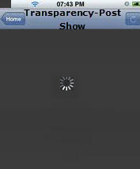
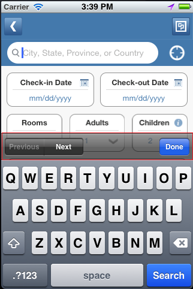
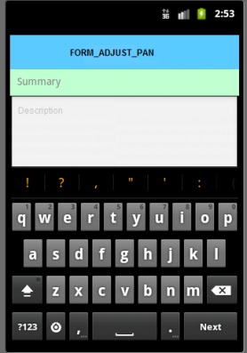

## <a id="flexform-properties"></a> FlexForm Properties


The properties for FlexForm widget are as follows.

* * *

<details close markdown="block"><summary>accessibilityConfig Property</summary>

* * *

Enables you to control accessibility behavior and alternative text for the widget.

For more information on using accessibility features in your app, see the [Accessibility](../../../Iris/app_design_dev/Content/Accessibility_Overview.md) appendix in the Volt MX IrisUser Guide.

### Syntax

```

accessibilityConfig
```

### Type

Object

### Read/Write

Read + Write

### Remarks

*   The accessibilityConfig property is enabled for all the widgets which are supported under the Flex Layout.

> **_Note:_** From Volt MX Iris V9 SP2 GA version, you can provide i18n keys as values to all the attributes used inside the `accessibilityConfig` property. Values provided in the i18n keys take precedence over values provided in `a11yLabel`, `a11yValue`, and `a11yHint` fields.

### The accessibilityConfig property is a JavaScript object which can contain the following key-value pairs.

  
| Key | Type | Description | ARIA Equivalent |
| --- | --- | --- | --- |
| a11yIndex | Integer with no floating or decimal number. | This is an optional parameter. Specifies the order in which the widgets are focused on a screen. | For all widgets, this parameter maps to the `aria-index`, `index`, or `taborder` properties. |
| a11yLabel | String | This is an optional parameter. Specifies alternate text to identify the widget. Generally the label should be the text that is displayed on the screen. | For all widgets, this parameter maps to the `aria-labelledby` property of ARIA in HTML. > **_Note:_** For the Image widget, this parameter maps to the **alt** attribute of ARIA in HTML. |
| a11yValue | String | This is an optional parameter. Specifies the descriptive text that explains the action associated with the widget. On the Android platform, the text specified for a11yValue is prefixed to the a11yHint. | This parameter is similar to the a11yLabel parameter. If the a11yValue is defined, the value of a11yValue is appended to the value of a11yLabel. These values are separated by a space. |
| a11yHint | String | This is an optional parameter. Specifies the descriptive text that explains the action associated with the widget. On the Android platform, the text specified for a11yValue is prefixed to the a11yHint. | For all widgets, this parameter maps to the `aria-describedby` property of ARIA in HTML. |
| a11yHidden | Boolean | This is an optional parameter. Specifies if the widget should be ignored by assistive technology. The default option is set to _false_. This option is supported on iOS 5.0 and above, Android 4.1 and above, and SPA | For all widgets, this parameter maps to the `aria-hidden` property of ARIA in HTML. |
| a11yARIA | Object | This is an optional parameter. For each widget, the key and value provided in this object are added as the attribute and value of the HTML tags respectively. Any values provided for attributes such as `aria-labelledby` and `aria-describedby` using this attribute, takes precedence over values given in `a11yLabel` and `a11yHint` fields. When a widget is provided with the following key value pair or attribute using the a11yARIA object, the tabIndex of the widget is automatically appended as zero.`{"role": "main"}``aria-label` | This parameter is only available on the Desktop Web platform. |

### Android limitations

*   If the results of the concatenation of a11y fields result in an empty string, then `accessibilityConfig` is ignored and the text that is on widget is read out.
*   The soft keypad does not gain accessibility focus during the right/left swipe gesture when the keypad appears.

### SPA/Desktop Web limitations

*   When `accessibilityConfig` property is configured for any widget, the `tabIndex` attribute is added automatically to the `accessibilityConfig` property.
*   The behavior of accessibility depends on the Web browser, Web browser version, Voice Over Assistant, and Voice Over Assistant version.
*   Currently SPA/Desktop web applications support only a few ARIA tags. To achieve more accessibility features, use the attribute a11yARIA. The corresponding tags will be added to the DOM as per these configurations.

### Example 1

This example uses the button widget, but the principle remains the same for all widgets that have an accessibilityConfig property.

```

//This is a generic property that is applicable for various widgets.
//Here, we have shown how to use the accessibilityConfig Property for button widget.
/*You need to make a corresponding use of the accessibilityConfig property for other applicable widgets.*/

Form1.myButton.accessibilityConfig = {
    "a11yLabel": "Label",
    "a11yValue": "Value",
    "a11yHint": "Hint"    
};
```

### Example 2

This example uses the button widget to implement internationalization in `accessibilityConfig` property, but the principle remains the same for all widgets.

```

/*Sample code to implement internationalization in accessibilityConfig property in Native platform.*/

Form1.myButton.accessibilityConfig = {
    "a11yLabel": voltmx.i18n.getLocalizedString("key1")     
};  
/*Sample code to implement internationalization in accessibilityConfig property in Desktop Web platform.*/

Form1.myButton.accessibilityConfig = {
    "a11yLabel": "voltmx.i18n.getLocalizedString(\"key3\")"
};
```

### Platform Availability

*   Available in the IDE
*   iOS, Android, SPA, and Desktop Web

* * *

</details>
<details close markdown="block"><summary>allowHorizontalBounce Property</summary>

* * *

Specifies whether the scroll bounce is enabled or disabled in the horizontal direction.

### Syntax

```

allowHorizontalBounce
```

### Type

Boolean

### Read/Write

Read + Write

### Remarks

The default value for this property is true. That is the scroll bounce is enabled in horizontal direction.

> **_Note:_** The **bounces** property takes precedence over this property.

### Example

```

//Sample code to enable horizontal bounce in a FlexForm.

myForm.allowHorizontalBounce=true;    
```

### Platform Availability

Available in the IDE.

This property is available on iOS platform only.

* * *

</details>
<details close markdown="block"><summary>allowVerticalBounce Property</summary>

* * *

Specifies whether the scroll bounce is enabled or disabled in the vertical direction.

### Syntax

```

allowVerticalBounce
```

### Type

Boolean

### Read/Write

Read + Write

### Remarks

The default value for this property is true. That is the scroll bounce is enabled in vertical direction.

> **_Note:_** The **bounces** property takes precedence over this property.

### Example

### Platform Availability

```

//Sample code to enable vertical bounce in a FlexForm.

myForm.allowVerticalBounce=true;    
```

### Available in the IDE.

*   iOS
*   SPA

* * *

</details>
<details close markdown="block"><summary>anchorPoint Property</summary>

* * *

Specifies the anchor point of the widget bounds rectangle using the widget's coordinate space.

### Syntax

```

anchorPoint
```

### Type

JSObject

### Read/Write

Read + Write

### Remarks

The value for this property is a JavaScript dictionary object with the keys "x" and "y". The values for the "x" and "y" keys are floating-point numbers ranging from 0 to 1. All geometric manipulations to the widget occur about the specified point. For example, applying a rotation transform to a widget with the default anchor point causes the widget to rotate around its center.

The default value for this property is center ( {"x":0.5, "y":0.5} ), that represents the center of the widgets bounds rectangle. The behavior is undefined if the values are outside the range zero (0) to one (1).

### Example

```

Form1.widget1.anchorPoint = {
    "x": 0.5,
    "y": 0.5
};
```

### Platform Availability

*   iOS, Android, Windows, and SPA

* * *

</details>
<details close markdown="block"><summary id="appLevelWidgetConfig">appLevelWidgetConfig Property</summary>

* * *

This property provides users with the capability to enable or disable the header or footer of the app for that particular Form.

Syntax

```
appLevelWidgetConfig
```

Type

JavaScript Object that contains the following keys:

| Key | Value |
| --- | --- |
| enabled [Boolean] | A Boolean value that enables the app level widget for the specified Form. The default value for this parameter is **false**. |
| adjustFormHeight [Boolean] | A Boolean value that specifies if the height of the Form must be adjusted based on the position of the app level widget. When the value of this parameter is set as **false**, the height of the Form will not be adjusted, and the app level widget appears at the top of the Form. The default value for this parameter is **true**. |

Read/Write

Read + Write

Example

```
Form1.appLevelWidgetConfig = {
                             "header":
                             {
                             "enabled":false,
                             "adjustFormHeight":false
                             },
                             "footer":
                             {
                             "enabled":true,
                             "adjustFormHeight":true
                             }
                             };
```

Platform Availability

* Android
* iOS

* * *

</details>
<details close markdown="block"><summary>backgroundColor Property</summary>

* * *

Specifies the background color of the widget.

### Syntax

```

backgroundColor
```

### Type

Color constant or Hexadecimal number

### Read/Write

Read + Write

### Remarks

*   The initial value of backgroundColor has to be specified explicitly. If not, Iris will not deduce the values from the existing skin
    and this will lead to undefined behavior.
*   Colors can be specified using a 6 digit or an 8-digit hex value with alpha position. For example, ffff65 or ffffff00.
*   When the 4-byte color format (RGBA) string is used, an alpha (A) value of 65 specifies that the color is transparent. If the value
    is 00, the color is opaque. The Alpha value is in percentage and must be given in the hexadecimal value for the color (100% in hexadecimal value is 65).  
    For example, red complete opaque is FF000000. Red complete transparent is FF000065. The values 0x and # are not allowed in the string.
*   A color constant is a String that is defined at the theme level. Ensure that you append the **$** symbol at the beginning of the
    color constant.
*   This property does not have a default value.
*   This property has more priority than (and overrides) the background property of the configured skin. Even if there is no skin
    configured for the widget, this property updates the skin.
*   The backgroundColor, backgroundColorTwoStepGradient, backgroundColoMultiStepGradient, and backgroundImage properties are mutually
    exclusive. The property that was set most recently is given higher priority over other properties.

### Example

This example uses the button widget, but the principle remains the same for all widgets that have the backgroundColor property.

```

Form1.btn1.backgroundColor = "ea5075";

```

### Platform Availability

*   Android
*   iOS
*   Desktop Web (Not available on Desktop Web Legacy SDK)

* * *

</details>
<details close markdown="block"><summary id = "bounces">bounces Property</summary>

* * *

Specifies whether the scroll bounce is enabled or disabled.

### Syntax

```

bounces
```

### Type

Boolean

### Read/Write

Read + Write

### Remarks

The default value for this property is _true_. If set to _false,_ the scroll view bounce is not applied. If set to _true,_ the scroll view bounce is applied.

### Example

```

//Sample code to enable bounces property in a FlexForm.

myForm.bounces=true;    
```

### Platform Availability

### Available in the IDE.

*   iOS
*   Android
*   Windows
*   SPA

* * *

</details>
<details close markdown="block"><summary id="captureG">captureGPS Property</summary>

* * *

Specifies if the Form must display a popup seeking permission from the user to access the location details.

### Syntax

```

captureGPS
```

### Type

Boolean

### Read/Write

No

### Remarks

> **_Note:_** For this property to work, you must have selected **Requires GPS functionality** in the Project Properties of the Application (For more information, see the _Configuring Project Properties_ section of the _Volt MX Iris User Guide_) to enable the application to use the GPS functionality.

The default value for this property is false. The checkbox is not selected and the popup does not appear when you navigate to the Form. If you want the popup to appear when you navigate to the specified Form, set the value to _true_ (select the checkbox).

The following image illustrates the popup to access the location details:


### Example

```

//Sample code to enable captureGPS property in a FlexForm.

myForm.captureGPS=true;    
```

### Availability

### Available in the IDE.

This property is available on Mobile Web (advanced)

* * *

</details>
<details close markdown="block"><summary id="configur2">configureExtendBottom Property</summary>

* * *

This property enables you to configure extendBottom property.

### Syntax

```

None. Its an IDE only property
```

### Read/Write

No

### Remarks

The default value for this property is false. If set to _true,_ the property extendBottom is displayed. If set to _false,_ the property extendBottom is not displayed.

### Platform Availability

### Available in the IDE.

*   iPhone
*   iPad

* * *

</details>
<details close markdown="block"><summary id="configur">configureExtendTop Property</summary>

* * *

This property enables you to configure extendTop property.

### Syntax

```

None. Its an IDE only property
```

### Read/Write

No

### Remarks

The default value for this property is false. If set to _true,_ the property extendTop is displayed. If set to _false,_ the property extendTop is not displayed.

### Platform Availability

### Available in the IDE.

*   iPhone
*   iPad

* * *

</details>
<details close markdown="block"><summary id="configur3">configureStatusBarStyle Property</summary>

* * *

This property enables you to configure statusBarStyle property.

### Syntax

```

configureStatusBarStyle
```

### Type

Boolean

### Read/Write

No

### Remarks

The default value for this property is false. If set to _true,_ the property statusBarStyle is displayed. If set to _false,_ the property statusBarStyle is not displayed.

### Example

```

//Sample code to enable configureStatusBarStyle property in a FlexForm.

myForm.configureStatusBarStyle=true;    
```

### Platform Availability

### Available in the IDE.

*   iPhone
*   iPad

* * *

</details>
<details close markdown="block"><summary>contentOffset Property</summary>

* * *

Specifies the x and y coordinates of the top-left of the scrollable region. When the values are set, the container scrolls even if the scrolling is disabled. This will always returns the value that you set, but never reflects the actual computed offset.

### Syntax

```

contentOffset
```

### Type

JSObject (x and y values can be specified in dp, px, and %)

### Read/Write

Read + Write

### Example

```

//Sample code to set contentOffset property in a FlexForm.
myForm.contentOffset = {
 "x": "3dp",
 "y": "4dp"
};
```

### Platform Availability

### Available in the IDE.

*   iOS
*   Android
*   Windows
*   SPA

* * *

</details>
<details close markdown="block"><summary>contentSize Property</summary>

* * *

Specifies the width and height of the container to accommodate all the widgets placed in it. This will returns the values that you set, but never reflects the actual computed content size.

### Syntax

```

contentSize
```

### Type

JSObject

### Read/Write

Read + Write

### Remarks

Following are the properties available:

> *   **width:** Specifies the width of the Form in the below mentioned units.
> *   **height:** Specifies the height of the Form in the below mentioned units.
> 
> Definition of units for width and height.
> 
> *   %: Specifies the values in percentage relative to the parent dimensions.
> *   px: Specifies the values in terms of device hardware pixels.
> *   dp: Specifies the values in terms of device independent pixels.
> *   default: Specifies the default value of the widget.

### Example

```

//Sample code to set contentSize property in a FlexForm.
myForm.contentSize = {
 "width": "3dp",
 "height": "4dp"
};
```

### Platform Availability

### Available in the IDE.

*   iOS
*   Android
*   Windows

* * *

</details>
<details close markdown="block"><summary id="defaultI">defaultIndicatorColor Property</summary>

* * *

This property enables you to set color to the progress indicator when it is show on the form. It overrides the application level setting set using setApplicationbehavior() for this form.

### Syntax

```

defaultIndicatorColor
```

### Type

String

### Read/Write

Read + Write

### Remarks

The color for this property is in RGBA hex code.

### Example

```

//Sample code to set the defaultIndicatorColor property in a FlexForm as red.
myForm.defaultIndicatorColor= "ff0000";
```

### Platform Availability

### Not available in the IDE.

*   Android
*   Android Tablet

* * *

</details>
<details close markdown="block"><summary>disableZoom Property</summary>

* * *

This property allows you to enable or disable zooming the FlexForm.

### Syntax

```

disableZoom
```

### Type

Boolean

### Read/Write

Read + Write

### Remarks

The default value for this property is true. If set to _true,_ the zooming action on FlexForm is disabled. User cannot zoom the FlexForm. If set to _false,_ the zooming action on FlexForm is enabled. User can zoom the FlexForm.

> **_Note:_** This property is supported from GA 6.0.2.3 onwards.

### Example

```

//Sample code to disable zoom in a FlexForm.  
  
Form1.disableZoom = true;
```

### Platform Availability

### Available in the IDE.

Windows

* * *

</details>

<details close markdown="block"><summary>displayOrientationClassifier Property</summary>

* * *

A sub-level property of the **displayOrientation** property of a form, that provides screen orientation modes at a granular-level for the particular Form. 

### Syntax

```

displayOrientationClassifier
```

### Type

String

### Read/Write

Read + Write

### Remarks

Based on the value of the displayOrientation property , the values of the displayOrientationClassifier property are as follows:

<table style="border-top-left-radius: 0px;border-top-right-radius: 0px;border-bottom-right-radius: 0px;border-bottom-left-radius: 0px;border-left-style: solid;border-left-width: 2px;border-left-color: #a9a9a9;border-right-style: solid;border-right-width: 2px;border-right-color: #a9a9a9;border-top-style: solid;border-top-width: 2px;border-top-color: #a9a9a9;border-bottom-style: solid;border-bottom-width: 2px;border-bottom-color: #a9a9a9;width: 100%;margin-left: 0;margin-right: auto;mc-table-style: url('Resources/TableStyles/Basic.css');" class="TableStyle-TemenosTables" cellspacing="0"><colgroup><col style="width: 35%;" class="TableStyle-TemenosTables-Column-Column1"><col style="width: 70%;" class="TableStyle-TemenosTables-Column-Column1"></colgroup><thead><tr class="TableStyle-TemenosTables-Head-Header1" data-mc-conditions=""><th class="TableStyle-TemenosTables-HeadE-Column1-Header1" style="text-align: center;" scope="col" valign="middle"><b>displayOrientation</b></th><th class="TableStyle-TemenosTables-HeadD-Column1-Header1" style="text-align: center;" scope="col" valign="middle"><b>displayOrientationClassifier </b></th></tr></thead><tbody><tr class="TableStyle-TemenosTables-Body-Body1" style="height: 56px;" data-mc-conditions=""><td class="TableStyle-TemenosTables-BodyE-Column1-Body1">FORM_DISPLAY_ORIENTATION_LANDSCAPE</td><td class="TableStyle-TemenosTables-BodyD-Column1-Body1"><p><a href="#LANDSCAPE">SCREEN_ORIENTATION_LANDSCAPE</a></p><p><a href="#REVERSE_LANDSCAPE">SCREEN_ORIENTATION_REVERSE_LANDSCAPE</a></p><p><a href="#SENSOR_LANDSCAPE">SCREEN_ORIENTATION_SENSOR_LANDSCAPE</a></p><p><a href="#USER_LANDSCAPE">SCREEN_ORIENTATION_USER_LANDSCAPE</a></p></td></tr><tr class="TableStyle-TemenosTables-Body-Body1" style="height: 56px;" data-mc-conditions=""><td class="TableStyle-TemenosTables-BodyE-Column1-Body1">FORM_DISPLAY_ORIENTATION_PORTRAIT</td><td class="TableStyle-TemenosTables-BodyD-Column1-Body1"><p><a href="#PORTRAIT">SCREEN_ORIENTATION_PORTRAIT</a></p><p><a href="#REVERSE_PORTRAIT">SCREEN_ORIENTATION_REVERSE_PORTRAIT</a></p><p><a href="#SENSOR_PORTRAIT">SCREEN_ORIENTATION_SENSOR_PORTRAIT</a></p><p><a href="#USER_PORTRAIT">SCREEN_ORIENTATION_USER_PORTRAIT</a></p></td></tr><tr class="TableStyle-TemenosTables-Body-Body1" style="height: 56px;" data-mc-conditions=""><td class="TableStyle-TemenosTables-BodyB-Column1-Body1">FORM_DISPLAY_ORIENTATION_BOTH</td><td class="TableStyle-TemenosTables-BodyA-Column1-Body1"><p><a href="#UNSPECIFIED">SCREEN_ORIENTATION_UNSPECIFIED</a></p><p><a href="#BEHIND">SCREEN_ORIENTATION_BEHIND</a></p><p><a href="#FULL_SENSOR">SCREEN_ORIENTATION_FULL_SENSOR</a></p><p><a href="#FULL_SENSOR"></a><a href="#FULL_USER">SCREEN_ORIENTATION_FULL_USER</a></p><p><a href="#LOCKED">SCREEN_ORIENTATION_LOCKED</a></p><p><a href="#NOSENSOR">SCREEN_ORIENTATION_NOSENSOR</a></p><p><a href="#SENSOR">SCREEN_ORIENTATION_SENSOR</a></p><p><a href="#USER">SCREEN_ORIENTATION_USER</a></p></td></tr></tbody></table>

> **_Note:_** 
>* The value of the **displayOrientationClassifier** property is only respected when you provide a valid value corresponding to a particular **displayOrientation** (as specified in the table). For example, if you are using the **FORM_DISPLAY_ORIENTATION_PORTRAIT** Display Orientation, you can only provide a value for the displayOrientationClassifier property from the following:
>
>   *   SCREEN_ORIENTATION_PORTRAIT
>   *   SCREEN_ORIENTATION_REVERSE_PORTRAIT
>   *   SCREEN_ORIENTATION_SENSOR_PORTRAIT
>   *   SCREEN_ORIENTATION_USER_PORTRAIT.
>
>* The displayOrientationClassifier property is ignored if the Form is assigned to a Camera widget as an Overlay Form.

### Example

```

//Sample code to disable zoom in a FlexForm.  
  
Form1.disableZoom = true;
```

### Platform Availability

* Android

* * *

</details>


<details close markdown="block"><summary>drawerLayout Property</summary>

* * *

Gets and sets the FlexContainer that contains the elements of the NavigationDrawer, which is named drawerLayout. It is a child element of the FlexForm, and it is created when the FlexForm is created based on a template that supports the [NavigationDrawer](FlexForm.md#using-the-navigation-drawer).

### Syntax

```

drawerLayout
```

### Type

Object

### Read/Write

Read + Write

### Remarks

This property supports the [NavigationDrawer](FlexForm.md#using-the-navigation-drawer). It is not available unless the FlexForm has been created from a template that supports the NavigationDrawer. The NavigationDrawer is based on the [Android native Navigation drawer](https://material.io/guidelines/patterns/navigation-drawer.md#). It is only supported on Android.

### Example

```

var flexLayout = formObject.drawerLayout;
```

### Platform Availability

### Available in the IDE.

*   Android

* * *

</details>
<details close markdown="block"><summary>drawerWidth Property</summary>

* * *

Gets and sets the width of the Navigation Drawer.

### Syntax

```

drawerWidth
```

### Type

int

### Read/Write

Read + Write

### Remarks

This property supports the [NavigationDrawer](FlexForm.md#using-the-navigation-drawer). It is not available unless the FlexForm has been created from a template that supports the NavigationDrawer. The NavigationDrawer is based on the [Android native Navigation drawer](https://material.io/guidelines/patterns/navigation-drawer.md#). It is only supported on Android.

### Example

```

var width = formObject.drawerWidth;

//Writing
formObject.drawerWidth = "100dp";
```

### Platform Availability

### Available in the IDE.

*   Android

* * *

</details>
<details close markdown="block"><summary>drawerShadowColor Property</summary>

* * *

Sets or gets the shadow color that covers the form when the NavigationDrawer is open, indicating that the controls on the form are not available for interaction.

when Navigation bar is opened .This is respected only if drawer type is set to temporary or persistent.

This is the color value choosen by the color picker in IDE in RGBA format.

Reading:

var shadowColor = formObject.drawerShadowColor

Writing:

formObject.drawerShadowColor = ffffff64

### Syntax

```

drawerShadowColor
```

### Type

color value in RGBA format.

### Read/Write

Read + Write

### Remarks

The value used to read or write this property is in RGBA format. R,G, and B are 0-255, and A is 0-64.

This value is respected only if drawer type is set to temporary or persistent.

This property supports the [NavigationDrawer](FlexForm.md#using-the-navigation-drawer). It is not available unless the FlexForm has been created from a template that supports the NavigationDrawer. The NavigationDrawer is based on the [Android native Navigation drawer](https://material.io/guidelines/patterns/navigation-drawer.md#). It is only supported on Android.

### Example

```

// Reading
var shadowColor = formObject.drawerShadowColor;
	
//Writing	
formObject.drawerShadowColor = "ffffff64";

```

### Platform Availability

### Available in the IDE.

*   Android

* * *

</details>
<details close markdown="block"><summary>drawerOpenIcon Property</summary>

* * *

The icon to be displayed when Navigation bar is open. This can only be a PNG or JPEG.

### Syntax

```

drawerOpenIcon
```

### Type

Boolean

### Read/Write

Read + Write

### Remarks

This can only be a PNG or JPEG image.

The Android specification for this icon can be found at:

This property supports the [NavigationDrawer](FlexForm.md#using-the-navigation-drawer). It is not available unless the FlexForm has been created from a template that supports the NavigationDrawer. The NavigationDrawer is based on the [Android native Navigation drawer](https://material.io/guidelines/patterns/navigation-drawer.md#). It is only supported on Android.

### Example

```

//Reading
var iconame = formObject.drawerOpenIcon;

//Writing
formObject.drawerOpenIcon = "opened.png";
```

### Platform Availability

### Available in the IDE.

*   Android

* * *

</details>
<details close markdown="block"><summary>drawerClosedIcon Property</summary>

* * *

The icon to be displayed when Navigation bar is open. This can only be a PNG or JPEG.

### Syntax

```

drawerClosedIcon
```

### Type

Boolean

### Read/Write

Read + Write

### Example

```

//Reading
var iconame = formObject.drawerClosedIcon;

//Writing
formObject.drawerClosedIcon = "closed.png";
```

### Platform Availability

### Available in the IDE.

*   Android

* * *

</details>
<details close markdown="block"><summary>drawerOpena11yHint Property</summary>

* * *

Specifies the descriptive text that explains the action of the widget.

### Syntax

```

drawerOpena11yHint
```

### Type

Text

### Read/Write

Read + Write

### Example

```

//Reading
var hint = formObject.drawerOpena11yHint;

//Writing
formObject.drawerOpena11yHint = "Navigation Drawer Opened";
```

**Platform Availability**

### Available in the IDE

*   Android

* * *

</details>
<details close markdown="block"><summary>drawerCloseda11yHint Property</summary>

* * *

Specifies the descriptive text that explains the action of the widget.

### Syntax

```

drawerCloseda11yHint
```

### Type

Text

### Read/Write

Read + Write

### Example

```

//Reading
var hint = formObject.drawerCloseda11yHint;

//Writing
formObject.drawerCloseda11yHint = "Navigation Drawer Closed";
```

### Platform Availability

### Available in the IDE

*   Android

* * *

</details>
<details close markdown="block"><summary>enableCache Property</summary>

* * *

The property enables you to improve the performance of Positional Dimension Animations.

### Syntax

```

enableCache
```

### Type

Boolean

### Read/Write

Read + Write

### Remarks

The default value for this property is true.

> **_Note:_** When the property is used, application consumes more memory. The usage of the property enables tradeoff between performance and visual quality of the content. Use the property cautiously.

### Example

```

Form1.widgetID.enableCache = true;
```

### Platform Availability

*   Available in the IDE.
*   Windows

* * *

</details>
<details close markdown="block"><summary>enabledForIdleTimeout Property</summary>

* * *

Idle time indicates the amount of time that a user has not interacted with the application. Some of the applications require a notification to be raised when a user has not interacted with the form for a specified amount of time. For example, a banking app might require a notification after 5 minutes of inactivity by the user. At the same time, applications also need an ability to not raise this notification for certain forms in the application. For example, ATM Locator forms in a banking app, _enabledForIdleTimeout_ property indicates, if the form is going to raise the notification after a specific period of inactivity (set using the API _voltmx.application.registerForIdleTimeout_.)

### Syntax

```

enabledForIdleTimeout
```

### Type

Boolean

### Read/Write

No

### Remarks

The default value for this property is false. The session will not expire after a period of inactivity.

If you want the session to expire after a period of inactivity (for example, you might require a Bank Accounts page of a site to expire after a period of inactivity), you can enable the time out period set in code by selecting the checkbox.

For more information about enabled for idle timeout, see API _voltmx.application.registerForIdleTimeout_ in the _API User Guide._

### Example

```

//Sample code to set the enabledForIdleTimeout property by using a FlexForm.  
myForm.enabledForIdleTimeout=true;  

```

### Platform Availability

### Available in the IDE.

*   iOS
*   Android
*   Windows
*   SPA

* * *

</details>
<details close markdown="block"><summary>enableOnScrollWidgetPositionForSubwidgets Property</summary>

* * *

This property enables the FlexForm widget to iterate into all the widgets that make use of the onScrollWidgetPosition event. The property is available for FlexForm and FlexScrollContainer widgets.

### Syntax

```

enableOnScrollWidgetPositionForSubwidgets
```

### Type

Boolean

### Read/Write

Read + Write

### Example

```

/*Sample code to set the enableOnScrollWidgetPositionForSubwidgets property by using FlexForm*/  
myForm.enableOnScrollWidgetPositionForSubwidgets = true;
```

### Platform Availability

*   Not available in the IDE
*   iOS
*   Android
*   Windows
*   SPA

* * *

</details>
<details close markdown="block"><summary>enableScrolling Property</summary>

* * *

Specifies whether the scrolling is enabled on the container or not.

### Syntax

```

enableScrolling
```

### Type

Boolean

### Read/Write

Read + Write

### Remarks

The default value for this property is true.

> **_Note:_** This property does not restrict the scrolling programmatically through scroll container properties and APIs.

### Example

```

//Sample code to set the enableScrolling property by using FlexForm.  
  
myForm.enableScrolling = true;
```

### Platform Availability

### Available in the IDE.

*   iOS
*   Android
*   Windows
*   SPA

* * *

</details>
<details close markdown="block"><summary id="extendBo">extendBottom Property</summary>

* * *

This property is displayed only when [configureExtendBottom](#configur2) is set to true. This property enables you to configure extendBottom property. This property is supported in iOS7 and above only. This property is also applicable on the Application Level properties under Application Properties > Native > iPhone/iPad > Platform Settings. The property set at form level takes precedence over Application level.

### Syntax

```

extendBottom
```

### Type

String

### Read/Write

Read+Write

### Remarks

The default value for this property is false.

> **_Note:_** This property is applicable on form level headers and footers, app level headers and footers, title bar, and app menu.

### Example

```

//Sample code to set the extendBottom property by using FlexForm.  
  
myForm.extendBottom= true;
```

### Platform Availability

### Available in the IDE.

*   iPhone
*   iPad

* * *

</details>
<details close markdown="block"><summary id="extendTo">extendTop Property</summary>

* * *

This property is displayed only when [configureExtendTop](#configur) is set to true. It specifies the form content to scroll under the App Menu. This property is supported in iOS7 and above only. This property is also applicable on the Application Level properties under Application Properties > Native > iPhone/iPad > Platform Settings. The property set at form level takes precedence over Application level.

### Syntax

```

extendTop
```

### Type

Boolean

### Read/Write

Read + Write

### Remarks

The default value for this property is false. If set to _true,_ the form scroll under the App Menu.

> **_Note:_** This property is applicable on form level headers and footers, app level headers and footers, title bar, and app menu.

### Example

```

//Sample code to set the extendTop property by using FlexForm.  
  
myForm.extendTop= true;
```

### Availability

### Available in the IDE.

*   iPhone
*   iPad

* * *

</details>
<details close markdown="block"><summary id="footerOv">footerOverlap Property</summary> 

* * *

Specifies if the footer must overlap the form. For example, every time you scroll the form, the footer is fixed and the footer overlap the form as specified in the Footer Overlap field. If this field is selected, the form scrolls behind the footer background and a part of the footer background is transparent.

### Syntax

```

footerOverlap
```

### Type

Boolean

### Read/Write

No

### Remarks

The default value for this property is false.

### Example

```

//Sample code to set the footerOverlap property by using FlexForm.  
  
myForm.footerOverlap= true;
```

### Platform Availability

### Available in the IDE.

*   iPhone
*   iPad
*   Android

* * *

</details>
<details close markdown="block"><summary id="formTran">formTransparencyDuringPostShow Property</summary>

* * *

Specifies the transparency in percentage when a form is loaded.

Normally, when a form is loading, the user interface is blocked. You can use this property to specify the percentage of transparency.

### Syntax

```

formTransparencyDuringPostShow
```

### Type

Number

### Read/Write

No

### Remarks

The default value for this property is 100.

The following image illustrates the transparency as 0 during post show:



### Example

```

/*Sample code to set the formTransparencyDuringPostShow property by using FlexForm as ten.*/  
  
myForm.formTransparencyDuringPostShow= 10;
```

### Platform Availability

### Available in the IDE.

*   iPhone
*   iPad

* * *

</details>
<details close markdown="block"><summary id="headerOv">headerOverlap Property</summary> 

* * *

Specifies if the header must overlap the form. For example, every time you scroll the form, the header is fixed and the header overlap the form as specified in the header overlap field. If this field is selected, the form scrolls behind the header background and a part of the header background is transparent.

### Syntax

```

headerOverlap
```

### Type

Boolean

### Read/Write

No

### Remarks

The default value for this property is false.

### Example

```

//Sample code to set the headerOverlap property by using FlexForm.  
  
myForm.headerOverlap=true;
```

### Platform Availability

### Available in the IDE.

*   iPhone
*   iPad
*   Android

* * *

</details>
<details close markdown="block"><summary>id Property</summary>

* * *

id is a unique identifier of form consisting of alpha numeric characters. Every Form should have a unique id within an application.

### Syntax

```

id
```

### Type

String - \[Mandatory\]

### Read/Write

Read only

### Example

```

//Defining properties of FlexForm.
function testfrmGlobals() {
    var MenuId = [];
    testfrm = new voltmx.ui.Form2({
        "id": "testfrm",
        "enableScrolling": true,
        "bounces": true,
        "allowHorizontalBounce": true,
        "allowVerticalBounce": false,
        "pagingEnabled": true,
        "title": "myfrmt",
        "needAppMenu": true,
        "enabledForIdleTimeout": true,
        "skin": "frm",
        "zoomScale": 22,
        "minZoomScale": 1.0,
        "maxZoomScale": 1.0,
        "layoutType": voltmx.flex.FREE_FORM,
        "addWidgets": addWidgetstestfrm
    }, {
        "displayOrientation": constants.FORM_DISPLAY_ORIENTATION_PORTRAIT,
    }, {
        "retainScrollPosition": true,
        "needsIndicatorDuringPostShow": true,
        "formTransparencyDuringPostShow": "100",
        "inputAccessoryViewType": constants.FORM_INPUTACCESSORYVIEW_DEFAULT,
        "bounces": false,
        "configureExtendTop": true,
        "configureExtendBottom": false,
        "configureStatusBarStyle": false,
        "extendTop": false,
        "titleBar": true,
        "footerOverlap": false,
        "headerOverlap": false,
        "inTransitionConfig": {
            "transitionDirection": "fromLeft",
            "transitionEffect": "none"
        },
        "outTransitionConfig": {
            "transitionDirection": "fromRight",
            "transitionEffect": "none"
        }
    });
    testfrm.setDefaultUnit(voltmx.flex.PX);
}
```

### Platform Availability

### Available in the IDE.

*   iOS
*   Android
*   Windows
*   SPA

* * *

</details>
<details close markdown="block"><summary>info Property</summary>

* * *

A custom JSObject with the key value pairs that a developer can use to store the context with the widget. This will help in avoiding the globals to most part of the programming.

### Syntax

```

info
```

### Type

JSObject

### Read/Write

Read + Write

### Remarks

> **_Note:_** This is a **non-Constructor** property. You cannot set this property through widget constructor. But you can read and write data to it.

Info property can hold any JSObject. After assigning the JSObject to info property, the JSObject should not be modified. For example,

```
var inf = {
    a: 'hello'
};
widget.info = inf;
```

### Example

```

//Sample code to set info property for a FlexForm.

myForm.info = {
key: "FlexFormName"
};

//Reading the info of the FlexForm.
voltmx.print("FlexForm info ::" +myForm.info);
```

### Platform Availability

### Not available in the IDE.

*   iOS
*   Android
*   Windows
*   SPA

* * *

</details>
<details close markdown="block"><summary id="inputAcc">inputAccessoryViewType Property</summary>

* * *

When building iPhone applications that support or provide text input, it's often necessary to create some extra buttons (or other controls) beyond the ones provided by the default keyboard interface. Volt MX Iris by default, adds the Previous, Next and Done buttons to the applicable input controls. These buttons allow specific operations needed by your application, such as moving to the next or previous text field, make the keyboard disappear. The area above the keyboard is known as Input Accessory View.

### Syntax

```

inputAccessoryViewType
```

### Type

Number

### Read/Write

No

### Remarks

The default value for this property is FORM\_INPUTACCESSORYVIEW\_DEFAULT.

This property, allows you to specify the type of accessory view that will be shown for all the input controls on this form.


> **_Note:_** The inputAccessoryViewType defined in the form level takes precedence over the inputAccessoryViewType defined in application level settings.

> **_Note:_** For iOS, by default header with "Prev" and "Next" buttons will be prepended to the keypad. This header can be turned off at two levels Application Level and Form Level.

**To turn on/off the header at Application Level, follow these steps:**

1.  Go to **Applications view**.
2.  Right-click on the application and select **Properties**.
3.  Navigate to **Native App** tab, under **Platform Settings** change the value to **none**.

**To turn on/off the header at Form Level, follow these steps:**

1.  Select the form and go to **Widget Properties** .
2.  Under iPhone properties, select **inputAccessoryViewType** and set the value to **FORM\_INPUTACCESSORYVIEW\_NONE**.

You can use any of the following constants. You must specify each constant with the ‘constants.xx’ prefix.

*   FORM\_INPUTACCESSORYVIEW\_NONE: Use this option if you do not want to specify the toolbar.  
    This option should be used carefully, as setting this option for widgets like calendar leaves the user with no option to select and drop-down a wheel calendar.
*   FORM\_INPUTACCESSORYVIEW\_DEFAULT: Specifies that the toolbar that is defined in the Application level settings. To set the Application level settings, right-click on the project and navigate to `Properties> Native App>iPhone/iPad.`  
    
*   FORM\_INPUTACCESSORYVIEW\_NEXTPREV: Specifies the navigation options as Next, Previous, and Done for a form. The below image illustrates the nextprevtoolbar set for a Textbox. The highlighted toolbar is achieved by setting the Keyboard Type as _Default_ for a Textbox and Input Accessory View Type as _nextprevtoolbar_ to the Form.



*   FORM\_INPUTACCESSORYVIEW\_CANCEL: Specifies that the input accessory view has a cancel button. This option does not trigger any events.

### Example

```

//Sample code to set the inputAccessoryViewType property by using FlexForm.  
  
myForm.inputAccessoryViewType=constants.FORM_INPUTACCESSORYVIEW_DEFAULT;
```

### Platform Availability

### Available in the IDE.

*   iPhone
*   iPad

* * *

</details>
<details close markdown="block"><summary id="inTransi">inTransitionConfig Property</summary>

* * *

Specifies the configuration to be used when the user arrives on this form. It accepts hash values.

### Syntax

```

inTransitionConfig
```

### Type

JSObject

### Read/Write

Read + Write

### Remarks

Following are the properties available for iPhone and iPad:

> **_Note:_** On iOS platform, In Transition is the transition that gets applied as the form enters the navigation stack. Every form.show either results in push into navigation stack ( enter the navigation stack) or if the form is already in stack, results popping up all the forms including the current form from the navigation stack. This is done to be in sync with the iOS native semantics of form (UIView Controller) transitions. For inTransition and outTransition, the push or pop operations are applied as below: A Form's inTransition will be played when a form is pushed inside the stack for rendering. The outTransition of the top most form in the stack will be played when the forms are popped out. For example, Form1 and Form2 are already in the stack, When you call form3.show() -> form3 will be pushed into the stack and its inTransition will be applied. The stack state after the push will be \[Form1, Form2, Form3\]. When you call form1.show() -> form2 and form3 will be popped out and form3's outTransition will be applied. The stack state after the pop will be \[Form1\].

> **_Note:_** Transition Animations are not supported when a flow of transitions from a form with AppMenu to a form without AppMenu.

**transitionDirection:** Specifies the direction from which the From is displayed. The available options are:

1.  none - Use this option if you do not want to specify a transition direction.
2.  fromRight - Specifies that the Form must appear from the right.
3.  fromLeft - Specifies that the Form must appear from the left.
4.  fromBottom - Specifies that the Form must appear from the bottom.
5.  fromTop - Specifies that the Form must appear from the top.

**transitionEffect:** Specifies the effect from which the form is displayed. The available options are:

1.  none - Use this option if you do not want to specify a transition direction.
2.  transitionFade - Specifies that the form must fade when it is transitioned to a hidden or an invisible state.
3.  transitionMoveIn - Specifies that the form must slide over the existing content in the direction as specified in the _transitionDirection_.
4.  transitionPush - Specifies that the form must push the existing content in the direction as specified in the _transitionDirection_ preserve">var var take its place.
5.  transitionFlip - Specifies that the form must be rotated along the Y-axis as the content is being displayed. It supports transition directions **fromRight** and **fromLeft** only.
6.  transitionReveal - Specifies that the form must be revealed gradually in the direction as specified in the _transitionDirection_.
7.  transitionCurl - Specifies that the form must be curled or folded (look and feel is similar to turning of a page in a book) as the content is being displayed. It supports transition directions **fromTop** and **fromBottom** only.
8.  transitionTwoSplitHorizontalIn - Specifies the form which is split horizontally into two parts rejoins when the transition takes place.
9.  transitionTwoSplitVerticalIn - Specifies the form which is split vertically into two parts rejoins when the transition takes place.
10.  transitionFourSplitIn - Specifies the form which is split in four parts rejoins when the transition takes place.
11.  transitionFourSplitRotateIn - Specifies the form which is split in four parts rejoins by rotating the parts when the transition takes place.
12.  transitionTwoSplitHorizontalOut - Specifies the form which is split horizontally into two parts and move away when the transition takes place.
13.  transitionTwoSplitVerticalOut - Specifies the form which is split vertically into two parts and move away when the transition takes place.
14.  transitionFourSplitRotateOut - Specifies the form which is split in four parts move away by rotating the parts when the transition takes place.
15.  transitionSwitchLeft - Specifies that the form must go out of the view in 3D circular space along the Y-axis towards left as the content is being displayed.
16.  transitionSwitchRight - Specifies that the form must go out of the view in 3D circular space along the Y-axis towards right as the content is being displayed.
17.  transitionCloth - Specifies the present form must go out of screen animating as if a cloth is removed.
18.  transitionFlipRight - Specifies that the form must be rotated along the Y-axis as the content is being displayed giving an illusion of a page is turned towards right in a book.
19.  transitionFlipLeft - Specifies that the form must be rotated along the Y-axis as the content is being displayed giving an illusion of a page is turned towards left in a book.
20.  transitionDoor - Specifies that the form must be revealed giving an illusion of a opening a door.
21.  transitionRotateExchange - Specifies that the form must be rotated along the X-axis as the content is being displayed.
22.  version - If you specify version = 1.0, the outTransitionCofig behavior of the outgoing form and the inTransitionConfig behavior of the incoming form are played out simultaneously. When version = 1.0, Iris checks for this key in the inTransitionConfig property of the form that needs this functionality. The following transitions can be played by using the version key:
    
    *   transitionMoveIn
        
    *   transitionMoveOut
        
    *   transitionFlip
        
    *   transitionReveal
        
    *   transitionFade
        
    
    **Remarks**:  
    1\. This feature is not supported for the first/main form.  
    2\. If you do not define the version key or specify any value to it other than 1.0, Iris falls back to the default behavior.
    

**transitionDuration**: Specifies the duration of the transition effect applied when the form enters the navigation stack (visible region). The default value of the parameter is 0.3 seconds. If you specify a negative value or zero for the transitionDuration parameter, the default value is set. The transitionDuration parameter is an optional parameter for the inTransitionConfig property. You can specify the transitionDuration parameter for the following transition effects:

*   transitionFade
*   transitionMoveIn
*   transitionPush
*   transitionFlip
*   transitionReveal
*   transitionCurl
*   transitionTwoSplitHorizontalIn
*   transitionTwoSplitVerticalIn
*   transitionFourSplitIn
*   transitionFourSplitRotateIn
*   transitionTwoSplitHorizontalOut
*   transitionTwoSplitVerticalOut
*   transitionFourSplitRotateOut
*   transitionSwitchLeft
*   transitionSwitchRight
*   transitionFlipRight
*   transitionFlipLeft
*   transitionDoor
*   transitionRotateExchange

For more information on the preceding transition effects, see [transitionEffect](#transitionEffect).

### The below effects applicable to Android platform:

1.  default/none - The constant value is 0. The default device effect is applied or none of the effect is applied.
2.  bottom-top - The constant value is 1. It specifies that the form must _slide-in_ from the bottom and proceed towards the top.
3.  from left - The constant value is 2. It specifies that the form must _slide-in_ from the _left_ with a _fade_ effect.
4.  from right - The constant value is 3. It specifies that the form must _slide-in_ from the _right_ with a _fade_ effect.
5.  to right - The constant value is 4. It specifies that the form must _slide-out_ to the _right_ with a _fade_ effect.
6.  to left - The constant value is 5. It specifies that the form must _slide-out_ to the _left_ with a _fade_ effect.
7.  from center - The constant value is 6. It specifies that the form must _grow_ from the _center_ with a _fade_ effect.
8.  topright-bottom - The constant value is 7. It specifies that the form must _slide-in_ from the _top-right_ corner and proceed towards the bottom.
9.  bottomleft-top - The constant value is 8. It specifies that the form must _slide-in_ from the _bottom-left_ corner and proceed towards the top.
10.  bottom-top style1 - The constant value is 9. It specifies that the form must _shrink_ from the bottom towards the top.
11.  top down - The constant value is 10. It specifies that the form must _slide-in_ from the top and proceed towards the bottom.

```

//sample code to set inTransitionConfig with the option bottom-top.
rm.inTransitionConfig = {
    formAnimation: 1
};
```

### Following are the properties available for Windows:

**transitionMode:** Specifies the direction from which the From is displayed. The available options are:

1.  Default (none) - The default device effect is applied or none of the effect is applied.
2.  Sequential- The transition of the Form going out of the view completes first and then the transition of the Form coming into the view takes place.
3.  Parallel- The transition of the Form going out of the view and the transition of the Form coming into the view takes place simultaneously.

**inTransition:** Specifies the effect from which the From is displayed. The available options are:

1.  Default (none) - For Windows, the default value is "None".
2.  Rotate3DSingle - Specifies that the Form must be rotated along the center Y-Axis when coming into the view.
3.  Rotate3DDual - Specifies that the Form must be shown making a circle around the screen from the background before coming into the view.
4.  Slide - Specifies that the Form must slide horizontally into the view.
5.  Pop - Specifies that the Form must emerge from center-bottom of the screen and gradually occupy the complete screen.
6.  Squeeze - Specifies that the Form must be expanded horizontally from an initial width of zero.
7.  None - This value is supported in Windows only and is the default value. It specifies that the Form should be shown without any animation effect. Target form is shown immediately. transitionMode will not have any effect when inTransition is None.

**transitionSpeed:** Specifies the speed at which the From is transitioned. The value must be specified in seconds.

On SPA Platforms, **Transition** has the below options to set:

1.  None- Use this option if you do not want to specify a transition direction.
2.  Top Center - Specifies that the form must appear from the top center.
3.  Bottom Center - Specifies that the form must appear from the bottom center.
4.  Right Center - Specifies that the form must appear from the right center.
5.  Left Center - Specifies that the form must appear from the left center.

### Android-specific Constant

This constant provides the default activity for IN Config transitions of FlexForms. This transition simulates native activity transitions.

The constant is available from V8 SP2 version onwards of Volt MX Iris.

*   Transition - IN Config
    
*   Drop-down key in Iris - Default
*   Constant Value - 16
    
*   You can use any one of these syntaxes:
    *   formobject.outTransitionConfig = {"formAnimation": 16};
    *   formobject.outTransitionConfig = {"formAnimation": constants.VOLTMX\_FORM\_DEFAULT\_ACTIVITY\_IN};

### Example

```

//Sample code to set the inTransitionConfig property in a FlexForm.  
  
myForm.inTransitionConfig = {
 "transitionDirection": "fromLeft",
 "transitionEffect": "none",
 "transistionDuration": 3,
}; 
//Sample code to set inTransitionConfig property in Windows.
myForm.inTransitionConfig= {
transitionMode: "Default",
 inTransition: "Default"
};  

```
> **_Note:_** enableDefaultBackSwipe flag in infoplist_configuration.json will stop the version 1.0 transition effects configured for your forms and uses default transition behaviour. For more details check [here](https://github01.hclpnp.com/pages/phoenix-temenos/volt-mx-doc-opnsrc/95/docs/documentation/Iris/iris_user_guide/Content/BuildAnAppForiOS.html#enable-default-back-swipe)


### Platform Availability

### Available in the IDE.

### Available on all platforms except Windows.

* * *

</details>
<details close markdown="block"><summary id="layout">layout Property</summary>

* * *

Specifies if the arrangement of the widgets either in horizontal or vertical direction.

### Syntax

```

layout
```

### Type

Number

### Read/Write

No

### Remarks

The default value for this property is vertical.

The available options are:

*   Vertical:The navigation happens in vertical direction.
*   Horizontal:The navigation happens in horizontal direction.

### Example

```

//Defining a form with layout:horizontal
var frmBasic = {
    id: "frm",
    type: constants.FORM_TYPE_NATIVE,
    title: "Welcome"
};

var frmLayout = {
    displayOrientation: constants.FORM_DISPLAY_ORIENTATION_BOTH
};
var frmPSP = {
    layout: constants.Horizontal
};

//Creating a form.
var frm = new voltmx.ui.Form2(frmBasic, frmLayout, frmPSP);
```

### Platform Availability

### Available in the IDE.

### This property is available on Windows.

* * *

</details>
<details close markdown="block"><summary>layoutType Property</summary>

* * *

Specifies if the arrangement of the widgets either in free form or vertical direction.

### Syntax

```

layoutType
```

### Type

Number

### Read/Write

Read only

### Remarks

The default value for this property is voltmx.flex.FREE\_FORM.

> **_Note:_** When you set the layoutType as voltmx.flex.FREE\_FORM, when some widgets are made as invisible, you must change the widgets position to remove the empty space. Or else the space occupied by those invisible widgets will remain on the Form.


The available options are:

*   `voltmx.flex.FREE_FORM`: The calculations for free form layout type are:  
      
    *   left is measured from the left bounds of the parent, right is measured from the right bounds of the parent and centerX measured from the left bounds of the parent.
    *   top is measured from the top bounds of the parent, bottom is measured from the bottom bounds of the parent and centerY measured from the bop bounds of the parent.
    *   For x-axis values are width, left, right, centerX in case of % units are relative to parent's width.
    *   For y-axis values are height, top, bottom, centerY in case of % units are relative to parent's height.
*   `voltmx.flex.FLOW_VERTICAL`: The calculations for vertical layout type are:  
      
    *   top is measured from bottom edge of the top sibling widget and bottom is measured from the top edge of bottom sibling widget.
    *   Vertical space between two widgets is bottom of the top sibling widget + top of the bottom sibling widget.
    *   Order of the widgets appearing in the flow is the order in which the widgets are added.
    *   left and right properties are measured from the boundaries of the parent.
*   `voltmx.flex.RESPONSIVE_GRID`: When you assign the value of the layoutType property as `voltmx.flex.RESPONSIVE_GRID`, you can assign different layouts for different breakpoints. Here are the some of the things to consider when you assign the Responsive Grid layout.  
    *   Widgets are aligned from left to right with the span and offset values provided in the Look tab of the Properties panel.
    *   You can only provide FlexContainer widget as the direct child after assigning this value to the parent.
    *   If the width of a child widget exceeds the width of the container widget, the next child widget is wrapped and placed in the next row.

### Example

```

//Sample code to read the layoutType property of a FlexForm.  
  
var myLayout=myForm.layoutType;  
voltmx.print("The layout type of myForm FlexForm is:"+myLayout);
```

### Platform Availability

### Available in the IDE.

*   iOS
*   Android
*   Windows
*   SPA

* * *

</details>
<details close markdown="block"><summary id="maxAppMe">maxAppMenuButtons Property</summary>

* * *

Specifies the number of appmenu buttons should be displayed on the screen.

### Syntax

```

maxAppMenuButtons
```

### Type

Number

### Read/Write

No

### Remarks

The default value for this property is 4.

### Example

```

//Defining a form with maxAppMenuButtons:4
var frmBasic = {
    id: "frm",
    type: constants.FORM_TYPE_NATIVE,
    title: "Welcome"
};

var frmLayout = {
    displayOrientation: constants.FORM_DISPLAY_ORIENTATION_BOTH
};
var frmPSP = {
    maxAppMenuButtons: 4
};

//Creating a form.
var frm = new voltmx.ui.Form2(frmBasic, frmLayout, frmPSP);
```

### Platform Availability

### Available in the IDE.

*   Windows

* * *

</details>
<details close markdown="block"><summary>maxZoomScale Property</summary>

* * *

Specifies the maximum zoom scale factor that can be applied to the form.

### Syntax

```

maxZoomScale
```

### Type

Number

### Read/Write

Read + Write

### Remarks

The default value for this property is 1.

### Example

```

//Sample code to set the maxZoomScale property in a FlexForm as two.  
  
myForm.maxZoomScale=2.0;
```

### Platform Availability

### Available in the IDE.

### This property is available on iOS platform.

* * *

</details>
<details close markdown="block"><summary>menuFocusSkin Property</summary>

* * *

This is a skin property of a form level menu and it determines the look and feel of the Menu Item when focused.

### Syntax

```

menuFocusSkin
```

### Type

String

### Read/Write

Write only \[Applicable on Windows platforms\]

### Example

```

frm1.menuFocusSkin = "menuFSkin";
```

### Platform Availability

### Available in the IDE.

*   iOS
*   Android
*   Windows
*   SPA

* * *

</details>
<details close markdown="block"><summary>menuItems Property</summary>

* * *

menuItems represents the list of items to be displayed in the device menu control. Unlike application menu items, which are available across all the forms, these items are only available for a specific form.

### Syntax

```

menuItems
```

### Type

JSObject

### Read/Write

Write only \[Applicable on Windows platforms\]

### Example

```

Form1.menuItems=menuItemObj;
```

### Platform Availability

### Available in the IDE.

*   iOS
*   Android
*   Windows
*   SPA

* * *

</details>
<details close markdown="block"><summary>menuNormalSkin Property</summary>

* * *

This is a skin property and it determines the look and feel of a menu items when not in focus.

### Syntax

```

menuNormalSkin
```

### Type

String

### Read/Write

Write only

### Example

```

frm1.menuNormalSkin = "menuSkin";
```

### Platform Availability

### Available in the IDE.

*   iOS
*   Android
*   Windows
*   SPA

* * *

</details>
<details close markdown="block"><summary id="menuPosi">menuPosition Property</summary>

* * *

Specifies if the application menu is shown or hidden in the application. In some platforms, form menu items appear along with app menu items. This property allows developer to configure weather to append at the end of application menu list or inserted at beginning of the application menus.

### Syntax

```

menuPosition
```

### Type

Number

### Read/Write

Read + Write

### Remarks

The default value for this property is FORM\_MENU\_POSITION\_AFTER\_APPMENU.

The available options are:

*   FORM\_MENU\_POSITION\_BEFORE\_APPMENU
*   FORM\_MENU\_POSITION\_AFTER\_APPMENU

### Example

```

form1.menuPosition = constants.FORM_MENU_POSITION_AFTER_APPMENU;
```

### Platform Availability

### Available in the IDE.

### This property is available on Android/Android Tablet.

* * *

</details>
<details close markdown="block"><summary>minZoomScale Property</summary>

* * *

Specifies the minimum zoom scale factor that can be applied to the form.

### Syntax

```

minZoomScale
```

### Type

Number

### Read/Write

Read + Write

### Remarks

The default value for this property is 1.

### Example

```

//Sample code to set the minZoomScale property in a FlexForm as two.  
  
myForm.minZoomScale=2.0;
```

### Platform Availability

### Available in the IDE.

    This property is available on iOS platform.

* * *

</details>
<details close markdown="block"><summary>navigationBarColor Property</summary>

* * *

The navigationBarColor property helps you set the color for a device's navigation bar.

### Syntax

```

navigationBarColor
```

### Type

String

### Read/Write

Read + Write

### Remarks

When you set the navigationBarColor property to a form (form level), the property gets applied only to that particular form in the visible region. When a user navigates to another form, the navigation bar may change based on the properties set to that form. If the value of the navigationBarColor property is null or invalid, the value set at the application level is applied. If the navigationBarColor property is set at form level and application level, the property set at the form level overrides the property set at the application level. If the navigationBarColor property is not set at the form level and at the application level, the Android’s default settings are applied to the navigation bar.

You can define the navigation bar color in the RGBA format, where the R, G, and B range from 00 to ff, and the A (transparency) ranges from 00 (zero percent) to 64 (100 percent). The RGBA format complies with the color format generated in skins.

### Example

```

//Sample code to set the navigationBarColor by using a FlexForm.   
  
myForm.navigationBarColor = "ffff0000";
```

### Platform Availability

*   Android 5.0 and later versions.

* * *

</details>
<details close markdown="block"><summary>needAppMenu Property</summary>

* * *

Specifies if the [application menu](App_Menu.md) items should be displayed as a part of the menu controls on the form.

### Syntax

```

needAppMenu
```

### Type

Boolean

### Read/Write

No

### Remarks

The default value for this property is true (Indicates that the application menu must be displayed). Falseindicates that the application menu must not be displayed.

### Example

```

Form1.needAppMenu = true;
```

### Platform Availability

### Available in the IDE.

*   iOS
*   Android
*   Windows
*   SPA

* * *

</details>
<details close markdown="block"><summary>navigationDrawerListeners Property</summary>

* * *

This property maps Navigation Drawer events to user defined handler functions.

### Syntax

```

navigationDrawerListeners
```

### Type

Boolean

### Read/Write

Read + Write

### Remarks

This property supports the [NavigationDrawer](FlexForm.md#using-the-navigation-drawer). It is not available unless the FlexForm has been created from a template that supports the NavigationDrawer. The NavigationDrawer is based on the [Android native Navigation drawer](https://material.io/guidelines/patterns/navigation-drawer.md#). It is only supported on Android.

### Example

```

// Mapping predefined callback functions to Navigation Drawer events
Form1.navigationDrawerListerners = {
    onDrawerSlide: drawerSlideCallback,
    onDrawerOpened: drawerOpenedCallback,
    onDrawerClosed: drawerClosedCallback,
    onDrawerStateChanged: drawerStateChangedCallback
};
```

### Platform Availability

### Available in the IDE.

*   Android

* * *

</details>
<details close markdown="block"><summary id="needsInd">needsIndicatorDuringPostShow Property</summary>

* * *

Specifies if there must be an indication to the user that the form content is being loaded.

You can use this property typically for forms that require network calls during post show.

### Syntax

```

needsIndicatorDuringPostShow
```

### Type

Boolean

### Read/Write

No

### Remarks

The default value for this property is true. If set to _false,_ the progress indicator is not displayed. If set to _true,_ the progress indicator is displayed.

The following image illustrates the loading indicator:


### Example

```

//Sample code to set the needsIndicatorDuringPostShow property by using a FlexForm.  
myForm.needsIndicatorDuringPostShow=true;  

```

### Platform Availability

### Available in the IDE.

*   iPhone
*   iPad

* * *

</details>
<details close markdown="block"><summary id="noCache">noCache Property</summary>

* * *

A web cache is a mechanism for the temporary storage ](caching) of web documents, such as.md pages and images, to reduce bandwidth usage, server load, and perceived lag. This property indicates that if the form is enabled for caching on the device browser.

### Syntax

```

noCache
```

### Type

Boolean

### Read/Write

No

### Remarks

The default value for this property is true. If set to _false_, appropriate Cache control headers are included in the HTTP response. If set to _true_, cache control headers are not included in the HTTP response.

### Example

```

//Sample code to set the noCache property by using a FlexForm.  
myForm.noCache=true;  

```

### Platform Availability

### Available in the IDE.

*   Server side Mobile Web (basic)
*   Server side Mobile Web (BJS)

* * *

</details>
<details close markdown="block"><summary>opacity Property</summary>

* * *

Specifies the opacity of the widget. The value of this property must be in the range 0.0 (transparent) to 1.0 (opaque). Any values outside this range are fixed to the nearest minimum or maximum value.

Specifies the opacity of the widget. Valid opacity values range from 0.0 (transparent), to 1.0 (opaque). Values set to less than zero will default to zero. Values more than 1.0 will default to 1. Interaction events set on a transparent widget will still be fired. To disable the events, also set the “isVisible” property to “false”.

### Syntax

```

opacity
```

### Type

Number

### Read/Write

Read + Write

### Remarks

> **_Note:_** This property has more priority compared to the values coming from the configured skin.

### Example

```

//Sample code to make the widget transparent by using the opacity property.
frmHome.widgetID.opacity = 0;

//Sample code to make the widget opaque by using the opacity property.
frmHome.widgetID.opacity = 1;
```

### Platform Availability

*   Not available in the IDE.
*   iOS, Android, Windows, SPA, and Desktop Web

* * *

</details>
<details close markdown="block"><summary id="outTrans">outTransitionConfig Property</summary>

* * *

Specifies the type of transition effect to be applied when the Form is going out of view. It accepts hash values.

### Syntax

```

outTransitionConfig
```

### Type

JSObject

### Read/Write

Read + Write

### Remarks

Following are the properties available for iPhone and iPad:

> **_Note:_** On iOS platform, Out Transition is the transition that gets applied as the form leaves the navigation stack. Every form.show either results in push into navigation stack ( enter the navigation stack) or if the form is already in stack, results popping up all the forms including the current form from the navigation stack. This is done to be in sync with the iOS native semantics of form (UIView Controller) transitions. For inTransition and outTransition, the push or pop operations are applied as below: A Form's inTransition will be played when a form is pushed inside the stack for rendering. The outTransition of the top most form in the stack will be played when the forms are popped out. For example, Form1 and Form2 are already in the stack. When you call form3.show() -> form3 will be pushed into the stack and its inTransition will be applied. The stack state after the push will be \[Form1, Form2, Form3\]. When you call form1.show() -> form2 and form3 will be popped out and form3's outTransition will be applied. The stack state after the pop will be \[Form1\].

> **_Note:_** Transition Animations are not supported when a flow of transitions from a form with AppMenu to a form without AppMenu.

**transitionDirection:** Specifies the direction from which the form must disappear in a view. You can choose one of the following options:

1.  none - Use this option if you do not want to specify a transition direction.
2.  fromRight - Specifies that the Form must disappear from the right.
3.  fromLeft - Specifies that the Form must disappear from the left.
4.  fromBottom - Specifies that the Form must disappear from the bottom.
5.  fromTop - Specifies that the Form must disappear from the top.

**transitionEffect:** Specifies the type of transition effect to be applied when the Form disappears in the view. You can choose one of the following transition effects:

1.  none - Use this option if you do not want to specify a transition direction.
2.  transitionFade - Specifies that the form must fade when it is transitioned to a hidden or an invisible state.
3.  transitionMoveIn - Specifies that the form must slide over the existing content in the direction as specified in the _transitionDirection_.
4.  transitionPush - Specifies that the form must push the existing content in the direction as specified in the _transitionDirection_ preserve">var var take its place.
5.  transitionFlip - Specifies that the form must be rotated along the Y-axis as the content is being displayed. It supports transition directions **fromRight** and **fromLeft** only.
6.  transitionReveal - Specifies that the form must be revealed gradually in the direction as specified in the _transitionDirection_.
7.  transitionCurl - Specifies that the form must be curled or folded (look and feel is similar to turning of a page in a book) as the content is being displayed. It supports transition directions **fromTop** and **fromBottom** only.
8.  transitionTwoSplitHorizontalIn - Specifies the form which is split horizontally into two parts rejoins when the transition takes place.
9.  transitionTwoSplitVerticalIn - Specifies the form which is split vertically into two parts rejoins when the transition takes place.
10.  transitionFourSplitIn - Specifies the form which is split in four parts rejoins when the transition takes place.
11.  transitionFourSplitRotateIn - Specifies the form which is split in four parts rejoins by rotating the parts when the transition takes place.
12.  transitionTwoSplitHorizontalOut - Specifies the form which is split horizontally into two parts and move away when the transition takes place.
13.  transitionTwoSplitVerticalOut - Specifies the form which is split vertically into two parts and move away when the transition takes place.
14.  transitionFourSplitRotateOut - Specifies the form which is split in four parts move away by rotating the parts when the transition takes place.
15.  transitionSwitchLeft - Specifies that the form must go out of the view in 3D circular space along the Y-axis towards left as the content is being displayed.
16.  transitionSwitchRight - Specifies that the form must go out of the view in 3D circular space along the Y-axis towards right as the content is being displayed.
17.  transitionCloth - Specifies the present form must go out of screen animating as if a cloth is removed.
18.  transitionFlipRight - Specifies that the form must be rotated along the Y-axis as the content is being displayed giving an illusion of a page is turned towards right in a book.
19.  transitionFlipLeft - Specifies that the form must be rotated along the Y-axis as the content is being displayed giving an illusion of a page is turned towards left in a book.
20.  transitionDoor - Specifies that the form must be revealed giving an illusion of a opening a door.
21.  transitionRotateExchange - Specifies that the form must be rotated along the X-axis as the content is being displayed.
22.  version - If you specify version = 1.0, the outTransitionCofig behavior of the outgoing form and the inTransitionConfig behavior of the incoming form are played out simultaneously. When version = 1.0, Iris checks for this key in the inTransitionConfig property of the form that needs this functionality. The following transitions can be played by using the version key:
    
    *   transitionMoveIn
        
    *   transitionMoveOut
        
    *   transitionFlip
        
    *   transitionReveal
        
    *   transitionFade
        
    
    **Remarks**  
    1\. This feature is not supported for the first/main form.  
    2\. If you do not define the version key or specify any value other than 1.0, Iris falls back to the default behavior.
    

**transitionDuration**: Specifies the duration of the transition effect applied when the form leaves the navigation stack (visible region). The default value of the parameter is 0.3 seconds. If you specify a negative value or zero for the transitionDuration parameter, the default value is set. The transitionDuration parameter is an optional parameter for the outTransitionConfig property. You can specify the transitionDuration parameter for the following transition effects:

*   transitionFade
*   transitionMoveIn
*   transitionPush
*   transitionFlip
*   transitionReveal
*   transitionCurl
*   transitionTwoSplitHorizontalIn
*   transitionTwoSplitVerticalIn
*   transitionFourSplitIn
*   transitionFourSplitRotateIn
*   transitionTwoSplitHorizontalOut
*   transitionTwoSplitVerticalOut
*   transitionFourSplitRotateOut
*   transitionSwitchLeft
*   transitionSwitchRight
*   transitionFlipRight
*   transitionFlipLeft
*   transitionDoor
*   transitionRotateExchange

For more information on the preceding transition effects, see [transitionEffect](#transitionEffect-Out).

The below effects applicable to Android platform:

1.  default/none - The constant value is 0. The default device effect is applied or none of the effect is applied.
2.  bottom-top - The constant value is 1. It specifies that the form must _slide-out_ from the bottom and proceed towards the top.
3.  from left - The constant value is 2. It specifies that the form must _slide-out_ from the _left_ with a _fade_ effect.
4.  from right - The constant value is 3. It specifies that the form must _slide-out_ from the _right_ with a _fade_ effect.
5.  to right- The constant value is 4. It specifies that the form must _slide-in_ to the _right_ with a _fade_ effect.
6.  to left- The constant value is 5. It specifies that the form must _slide-in_ to the _left_ with a _fade_ effect.
7.  from center- The constant value is 6. It specifies that the form must _grow_ from the _center_ with a _fade_ effect.
8.  topright-bottom - The constant value is 7. It specifies that the form must _slide-in_ from the _top-right_ corner and proceed towards the bottom.
9.  bottomleft-top - The constant value is 8. It specifies that the form must _slide-in_ from the _bottom-left_ corner and proceed towards the top.
10.  bottom-top style1 - The constant value is 9. It specifies that the form must _shrink_ from the bottom towards the top.
11.  top down - The constant value is 10. It specifies that the form must _slide-in_ from the top and proceed towards the bottom.

```

//sample code to set outTransitionConfig with the option top down.  
  
frm.outTransitionConfig= { formAnimation: 10 };
```

### Following are the properties available for Windows:

**transitionMode:** Specifies the direction from which the From is displayed. The available options are:

1.  Default (none)- The default device effect is applied or none of the effect is applied.
2.  Sequential- The transition of the Form going out of the view completes first and then the transition of the Form coming into the view takes place.
3.  Parallel- The transition of the Form going out of the view and the transition of the Form coming into the view takes place simultaneously.

**outTransition:** Specifies the effect from which the From is displayed. The available options are:

1.  Default (none)- Specifies that the Form must slide horizontally into the view.
2.  Rotate3DSingle - Specifies that the Form must be rotated along the center Y-Axis when coming into the view.
3.  Rotate3DDual - Specifies that the Form must be shown making a circle around the screen from the background before coming into the view.
4.  Slide - Specifies that the Form must slide horizontally into the view.
5.  Pop - Specifies that the Form must emerge from center-bottom of the screen and gradually occupy the complete screen.
6.  Squeeze - Specifies that the Form must be expanded horizontally from an initial width of zero.
7.  None - Specifies that the Form should be shown without any animation effect. Target form is shown immediately. transitionMode will not have any effect when outTransition is None. This is the default value for Windows.

**transitionSpeed:** Specifies the speed at which the From is transitioned. The value must be specified in seconds.

### On SPA Platforms, **Transition** has the below options to set:

1.  None- Use this option if you do not want to specify a transition direction.
2.  Top Center - Specifies that the form must disappear from the top center.
3.  Bottom Center - Specifies that the form must disappear from the bottom center.
4.  Right Center - Specifies that the form must disappear from the right center.
5.  Left Center - Specifies that the form must appear from the left center.

### Android-specific Constant

This constant provides the default activity for OUT Config transitions of FlexForms. This transition simulates native activity transitions.

The constant is available from V8 SP2 version onwards of Volt MX Iris.

*   Transition - OUT Config
    
*   Drop-down key in Iris - Default
*   Constant Value - 17
    
*   You can use any one of these syntaxes:
    *   formobject.outTransitionConfig = {"formAnimation": 17};
    *   formobject.outTransitionConfig = {"formAnimation": constants.VOLTMX\_FORM\_DEFAULT\_ACTIVITY\_OUT};

### Example

```

//Sample code to set the outTransitionConfig property in a FlexForm.
myForm.outTransitionConfig = {
 "transitionDirection": "fromRight",
 "transitionEffect": "none",
 "transistionDuration": 5.2
};
//Sample code to set outTransitionConfig property in Windows.
myForm.outTransitionConfig = {
 transitionMode: "Default",
 outTransition: "Default"
};  

```
> **_Note:_** enableDefaultBackSwipe flag in infoplist_configuration.json will stop the version 1.0 transition effects configured for your forms and uses default transition behaviour. For more details check [here](https://github01.hclpnp.com/pages/phoenix-temenos/volt-mx-doc-opnsrc/95/docs/documentation/Iris/iris_user_guide/Content/BuildAnAppForiOS.html#enable-default-back-swipe)


### Platform Availability

### Available in the IDE.

    Available on all platforms except Windows.

* * *

</details>
<details close markdown="block"><summary>pagingEnabled Property</summary>

* * *

Specifies the whether the paging is enabled for the container. If this property is set to true, the scroll view stops on multiples of the scroll view's bounds when the user scrolls.

### Syntax

```

pagingEnabled
```

### Type

Boolean

### Read/Write

Read + Write

### Remarks

The default value for this property is false.

### Example

```

//Sample code to enable paging in a FlexForm.
myForm.pagingEnabled=true;  

```

### Platform Availability

### Available in the IDE.

*   iOS
*   Android

* * *

</details>
<details close markdown="block"><summary>parent Property</summary>

* * *

Helps you access the parent of the widget. If the widget is not part of the widget hierarchy, the parent property returns null.

### Syntax

```

parent
```

### Read/Write

Read only

### Remarks

> **_Note:_** The property works for all the widgets inside a FlexForm, FlexContainer or FlexScrollContainer.

### Example

```

function func() {

    voltmx.print("The parent of the widget" + JSON.stringify(Form1.widgetID.parent));

}
```

### Platform Availability

*   Not available in the IDE
*   iOS, Android, Windows, SPA, and Desktop Web

* * *

</details>
<details close markdown="block"><summary>prefersStatusBarHidden Property</summary>

* * *

Specifies whether the status bar must be shown or not.

### Syntax

```

prefersStatusBarHidden
```

### Type

Boolean

### Read/Write

Read only

### Remarks

> **_Note:_** This property can be set only during widget construction.

> **_Note:_** The statusBarHidden flag is cleared when you move the application to the background and then bring it back to the foreground. So, the status bar is displayed by default when you move the application back to the foreground.

The default value for this property is false.

### Example

```

voltmx.print("The parent of the widget is" + Form1.prefersStatusBarHidden);
```

### Platform Availability

### Not available in the IDE.

### This property is available on iOS platform.

* * *

</details>
<details close markdown="block"><summary>requiresBottomSafeAreaInset Property</summary>

* * *

This property helps you to implement the Safe Area Layout for iOS devices. specifically the iPhone X series. Safe Area is the visible area on devices that is not obscured by the navigation bar at the top or the virtual home indicator at the bottom.

To use this property, ensure that the [extendBottom](#extendBo) Property of the FlexForm is enabled.

### Syntax

```

requiresBottomSafeAreaInset
```

### Type

Boolean

### Read/Write

Yes

### Remarks

The default value of this property is true.

When you set the requiresBottomSafeAreaInset Property to false, the FlexForm widget occupies the full screen at the bottom and overlaps the virtual home indicator. When this property is set to true, the FlexForm widget does not occupy the full screen and the content is seen only in the Safe Area of the device.

### Example

```

Form1.requiresBottomSafeAreaInset = false;
```

### Platform Availability

*   iOS (valid only for iPhone X device family)

* * *

</details>
<details close markdown="block"><summary>requiresLeftSafeAreaInset Property</summary>

* * *

This property helps you to implement the Safe Area Layout for iOS devices, specifically iPhone X series. Safe Area is the visible area on devices that is not obscured by the navigation bar at the top or the virtual home indicator at the bottom.

This property is applicable only when the device is in Landscape mode.

### Syntax

```

requiresLeftSafeAreaInset
```

### Type

Boolean

### Read/Write

Yes

### Remarks

The default value of this property is true.

When you set the requiresLeftSafeAreaInset Property to false, the content of the FlexForm widget starts from (0,0) pixel. The content is overlapped by the navigation bar/notch of the phone. When you set this property to true, the FlexForm widget does not occupy the full screen and the content is seen only in the Safe Area of the device.

### Example

```

Form1.requiresLeftSafeAreaInset = false;
```

### Platform Availability

*   iOS (valid only for iPhone X device family)

* * *

</details>
<details close markdown="block"><summary>requiresRightSafeAreaInset Property</summary>

* * *

This property helps you to implement the Safe Area Layout for iOS devices, specifically iPhone X series. Safe Area is the visible area on devices that is not obscured by the navigation bar at the top or the virtual home indicator at the bottom.

This property is applicable only when a device is in Landscape mode.

### Syntax

```

requiresRightSafeAreaInset
```

### Type

Boolean

### Read/Write

Yes

### Remarks

The default value of this property is true.

When you set the requiresRightSafeAreaInset Property to false, the FlexForm widget occupies the full screen at the right/left part of the screen. When you set this property to true, the FlexForm widget does not occupy the full screen and the content is seen only in the Safe Area of the device.

### Example

```

Form1.requiresRightSafeAreaInset = false;
```

### Platform Availability

*   iOS (valid only for iPhone X device family)

* * *

</details>
<details close markdown="block"><summary>requiresTopSafeAreaInset Property</summary>

* * *

This property helps you to implement the Safe Area Layout for iOS devices, specifically iPhone X series. Safe Area is the visible area on devices that is not obscured by the navigation bar at the top or the virtual home indicator at the bottom.

To use this property, ensure that the [extendTop](#extendTo) Property of the FlexForm is enabled.

### Syntax

```

requiresTopSafeAreaInset
```

### Type

Boolean

### Read/Write

Yes

### Remarks

The default value of this property is true.

When you set the requiresTopSafeAreaInset Property to false, the content of the FlexForm widget starts from (0,0) pixel. The content is overlapped by the navigation bar/notch of the phone. When you set this property to true, the FlexForm widget does not occupy the full screen and the content is seen only in the Safe Area of the device.

### Example

```

Form1.requiresTopSafeAreaInset = false;
```

### Platform Availability

*   iOS (valid only for iPhone X device family)

* * *

</details>
<details close markdown="block"><summary>retainContentAlignment Property</summary>

* * *

This property is used to retain the content alignment property value, as it was defined.

> **_Note:_** Locale-level configurations take priority when invalid values are given to this property, or if it is not defined.

### The mirroring widget layout properties should be defined as follows.

```

function getIsFlexPositionalShouldMirror(widgetRetainFlexPositionPropertiesValue) {
    return (isI18nLayoutConfigEnabled &&
    localeLayoutConfig[defaultLocale]
    ["mirrorFlexPositionalProperties"] == true &&
    !widgetRetainFlexPositionPropertiesValue);
}
```

### The following table illustrates how widgets consider Local flag and Widget flag values.

  
| Properties | Local Flag Value | Widget Flag Value | Action |
| --- | --- | --- | --- |
| Mirror/retain FlexPositionProperties | true | true | Use the designed layout from widget for all locales. Widget layout overrides everything else. |
| Mirror/retain FlexPositionProperties | true | false | Use Mirror FlexPositionProperties since locale-level Mirror is true. |
| Mirror/retain FlexPositionProperties | true | not specified | Use Mirror FlexPositionProperties since locale-level Mirror is true. |
| Mirror/retain FlexPositionProperties | false | true | Use the designed layout from widget for all locales. Widget layout overrides everything else. |
| Mirror/retain FlexPositionProperties | false | false | Use the Design/Model-specific default layout. |
| Mirror/retain FlexPositionProperties | false | not specified | Use the Design/Model-specific default layout. |
| Mirror/retain FlexPositionProperties | not specified | true | Use the designed layout from widget for all locales. Widget layout overrides everything else. |
| Mirror/retain FlexPositionProperties | not specified | false | Use the Design/Model-specific default layout. |
| Mirror/retain FlexPositionProperties | not specified | not specified | Use the Design/Model-specific default layout. |

### Syntax

```

retainContentAlignment
```

### Type

Boolean

### Read/Write

No (only during widget-construction time)

### Example

```

//This is a generic property that is applicable for various widgets.
//Here, we have shown how to use the retainContentAlignment property for Button widget.
/*You need to make a corresponding use of the 
retainContentAlignment property for other applicable widgets.*/
var btn = new voltmx.ui.Button({
    "focusSkin": "defBtnFocus",
    "height": "50dp",
    "id": "myButton",
    "isVisible": true,
    "left": "0dp",
    "skin": "defBtnNormal",
    "text": "text always from top left",
    "top": "0dp",
    "width": "260dp",
    "zIndex": 1
}, {
    "contentAlignment": constants.CONTENT_ALIGN_TOP_LEFT,
    "displayText": true,
    "padding": [0, 0, 0, 0],
    "paddingInPixel": false,
    "retainFlexPositionProperties": false,
    "retainContentAlignment": true
}, {});
```

### Platform Availability

*   Available in IDE
*   Windows, iOS, Android, and SPA

* * *

</details>
<details close markdown="block"><summary>retainFlexPositionProperties Property</summary>

* * *

This property is used to retain flex positional property values as they were defined. The flex positional properties are left, right, and padding.

> **_Note:_** Locale-level configurations take priority when invalid values are given to this property, or if it is not defined.

### The mirroring widget layout properties should be defined as follows.

```

function getIsFlexPositionalShouldMirror(widgetRetainFlexPositionPropertiesValue) {
    return (isI18nLayoutConfigEnabled &&
    localeLayoutConfig[defaultLocale]
    ["mirrorFlexPositionalProperties"] == true &&
    !widgetRetainFlexPositionPropertiesValue);
}
```

### The following table illustrates how widgets consider Local flag and Widget flag values.

  
| Properties | Local Flag Value | Widget Flag Value | Action |
| --- | --- | --- | --- |
| Mirror/retain FlexPositionProperties | true | true | Use the designed layout from widget for all locales. Widget layout overrides everything else. |
| Mirror/retain FlexPositionProperties | true | false | Use Mirror FlexPositionProperties since locale-level Mirror is true. |
| Mirror/retain FlexPositionProperties | true | not specified | Use Mirror FlexPositionProperties since locale-level Mirror is true. |
| Mirror/retain FlexPositionProperties | false | true | Use the designed layout from widget for all locales. Widget layout overrides everything else. |
| Mirror/retain FlexPositionProperties | false | false | Use the Design/Model-specific default layout. |
| Mirror/retain FlexPositionProperties | false | not specified | Use the Design/Model-specific default layout. |
| Mirror/retain FlexPositionProperties | not specified | true | Use the designed layout from widget for all locales. Widget layout overrides everything else. |
| Mirror/retain FlexPositionProperties | not specified | false | Use the Design/Model-specific default layout. |
| Mirror/retain FlexPositionProperties | not specified | not specified | Use the Design/Model-specific default layout. |

### Syntax

```

retainFlexPositionProperties
```

### Type

Boolean

### Read/Write

No (only during widget-construction time)

### Example

```

//This is a generic property that is applicable for various widgets.
//Here, we have shown how to use the retainFlexPositionProperties property for Button widget.
/*You need to make a corresponding use of the 
retainFlexPositionProperties property for other applicable widgets.*/
var btn = new voltmx.ui.Button({
    "focusSkin": "defBtnFocus",
    "height": "50dp",
    "id": "myButton",
    "isVisible": true,
    "left": "0dp",
    "skin": "defBtnNormal",
    "text": "always left",
    "top": "0dp",
    "width": "260dp",
    "zIndex": 1
}, {
    "contentAlignment": constants.CONTENT_ALIGN_CENTER,
    "displayText": true,
    "padding": [0, 0, 0, 0],
    "paddingInPixel": false,
    "retainFlexPositionProperties": true,
    "retainContentAlignment": false
}, {});
```

### Platform Availability

*   Available in IDE
*   Windows, iOS, Android, and SPA

* * *

</details>
<details close markdown="block"><summary>retainFlowHorizontalAlignment Property</summary>

* * *

This property is used to convert Flow Horizontal Left to Flow Horizontal Right.

> **_Note:_** Locale-level configurations take priority when invalid values are given to this property, or if it is not defined.

### The mirroring widget layout properties should be defined as follows.

```

function getIsFlexPositionalShouldMirror(widgetRetainFlexPositionPropertiesValue) {
    return (isI18nLayoutConfigEnabled &&
    localeLayoutConfig[defaultLocale]
    ["mirrorFlexPositionalProperties"] == true &&
    !widgetRetainFlexPositionPropertiesValue);
}
```

### The following table illustrates how widgets consider Local flag and Widget flag values.

  
| Properties | Local Flag Value | Widget Flag Value | Action |
| --- | --- | --- | --- |
| Mirror/retain FlexPositionProperties | true | true | Use the designed layout from widget for all locales. Widget layout overrides everything else. |
| Mirror/retain FlexPositionProperties | true | false | Use Mirror FlexPositionProperties since locale-level Mirror is true. |
| Mirror/retain FlexPositionProperties | true | not specified | Use Mirror FlexPositionProperties since locale-level Mirror is true. |
| Mirror/retain FlexPositionProperties | false | true | Use the designed layout from widget for all locales. Widget layout overrides everything else. |
| Mirror/retain FlexPositionProperties | false | false | Use the Design/Model-specific default layout. |
| Mirror/retain FlexPositionProperties | false | not specified | Use the Design/Model-specific default layout. |
| Mirror/retain FlexPositionProperties | not specified | true | Use the designed layout from widget for all locales. Widget layout overrides everything else. |
| Mirror/retain FlexPositionProperties | not specified | false | Use the Design/Model-specific default layout. |
| Mirror/retain FlexPositionProperties | not specified | not specified | Use the Design/Model-specific default layout. |

### Syntax

```

retainFlowHorizontalAlignment
```

### Type

Boolean

### Read/Write

No (only during widget-construction time)

### Example

```

//This is a generic property that is applicable for various widgets.
//Here, we have shown how to use the retainFlowHorizontalAlignment property for Button widget.
/*You need to make a corresponding use of the 
retainFlowHorizontalAlignment property for other applicable widgets. */
var btn = new voltmx.ui.Button({
 "focusSkin": "defBtnFocus",
 "height": "50dp",
 "id": "myButton",
 "isVisible": true,
 "left": "0dp",
 "skin": "defBtnNormal",
 "text": "always left",
 "top": "0dp",
 "width": "260dp",
 "zIndex": 1
}, {
 "contentAlignment": constants.CONTENT_ALIGN_CENTER,
 "displayText": true,
 "padding": [0, 0, 0, 0],
 "paddingInPixel": false,
 "retainFlexPositionProperties": true,
 "retainContentAlignment": false,
 "retainFlowHorizontalAlignment ": false
}, {});
```

### Platform Availability

*   Available in IDE
*   Windows, iOS, Android, and SPA

* * *

</details>
<details close markdown="block"><summary id="retainSc">retainScrollPosition Property</summary>

* * *

Specifies if the Form must remember the scroll position when the user revisits the Form.

### Syntax

```

retainScrollPosition
```

### Type

Boolean

### Read/Write

No

### Remarks

The default value for this property is false. The Form does not remember the scroll position. If set to _true_, the scroll position of the Form is retained at the same location when the Form was last visited. If set to _false,_ the Form scroll position will be set to top.

### Example

```

//Sample code to set the retainScrollPosition property in a FlexForm.
myForm.retainScrollPosition=true;  

```

### Platform Availability

### Available in the IDE.

    Available on all platforms.

* * *

</details>
<details close markdown="block"><summary id="scrollDi">scrollDirection Property</summary>

* * *

Specifies the direction in which the widget should scroll. This property is supported only when the scrollingEnabled property is set to true.

### Syntax

```

scrollDirection
```

### Type

Number

### Read/Write

Read + Write

### Remarks

The default value for this property is voltmx.flex.SCROLL\_HORIZONTAL.

For CollectionView widget, this property is applicable only when layout is set to voltmx.collectionview.LAYOUT\_CUSTOM.

The available options are:

*   voltmx.flex.SCROLL\_HORIZONTAL: Specifies the form to scroll in horizontal direction.
*   voltmx.flex.SCROLL\_VERTICAL: Specifies the form to scroll in vertical direction.
*   voltmx.flex.SCROLL\_BOTH: Specifies the form to scroll in both the horizontal and vertical directions.(default for CollectionView widget)
*   voltmx.flex.SCROLL\_NONE: Specifies the form not to scroll in any direction.

### Example

```

/*This property is applicable for FlexForm, CollectionView and FlexScrollContainer widgets.*/
//Here, we have shown how to use the scrollDirection Property for FlexScrollContainer widget.
/*You need to make a corresponding use of the 
scrollDirection Property for other applicable widgets.*/  
  
frmFlxScroll.myFlxScroll.scrollDirection=voltmx.flex.SCROLL_BOTH;
```

### Platform Availability

*   Not available in the IDE
*   iOS, Android, Windows, and SPA

* * *

</details>
<details close markdown="block"><summary id="secureDa">secureData Property</summary>

* * *

Specifies if the browser must retain and use the information that you have filled in a form (for example, username and password) and use it during the _POST_ request made when you refresh the browser or use the backbutton on the browser.

### Syntax

```

secureData
```

### Type

Boolean

### Read/Write

No

### Remarks

There is no default value for this property. The browser will retain data and use it during POST request.

If you do not want the browser to use the information during the _POST_ request made when you refresh the browser or use the back button on the browser, select the checkbox.

### Example

```

//Sample code to set the secureData property in a FlexForm.
myForm.secureData=true;  

```

### Platform Availability

### Available in the IDE.

*   Server side Mobile Web (basic)
*   Server side Mobile Web (BJS)

* * *

</details>
<details close markdown="block"><summary id="showActi">showActionBar Property</summary>

* * *

Specifies if the action bar should be displayed.

### Syntax

```

showActionBar
```

### Type

Boolean

### Read/Write

Read + Write

### Remarks

The default value for this property is true. If set to _true,_ the action bar is displayed. If set to _false,_ the action bar is not displayed.

> **_Note:_** This property is displayed in the widget properties list only when you select SDK versions 3.0 and above in the Application Properties > Native > Android > SDK Versions section.

### Example

```

//Sample code to set the showActionBar property in a FlexForm.
myForm.showActionBar=true;  

```

### Platform Availability

### Available in the IDE.

### This property is available on Android/Android tablet only.

* * *

</details>
<details close markdown="block"><summary id="showActi2">showActionBarIcon Property</summary>

* * *

Specifies the icon to be displayed for the action bar.

### Syntax

```

showActionBarIcon
```

### Type

Boolean

### Read/Write

Read + Write

### Remarks

The default value for this property is true. If set to _true,_ the action bar icon is displayed. If set to _false,_ the action bar icon is not displayed.

> **_Note:_** This property is displayed in the widget properties list only when you select SDK versions 3.0 and above in the Application Properties > Native > Android > SDK Versions section.

### Example

```

//Sample code to set the showActionBarIcon property in a FlexForm.
myForm.showActionBarIcon=true;  

```

### Platform Availability

### Available in the IDE.

    This property is available on Android/Android tablet only.

* * *

</details>
<details close markdown="block"><summary>skin Property</summary>

* * *

Specifies a background skin for FlexScrollForm widget.

### Syntax

```

skin
```

### Type

String

### Read/Write

Read + Write

### Remarks

> **_Note:_** Transparent skin is not supported on SPA (Windows) platform.

### Example

```

//Sample code to set the skin property of a FlexForm.
myForm.skin="frmskn";  

```

### Platform Availability

### Available in the IDE.

*   iOS
*   Android
*   Windows
*   SPA

* * *

</details>
<details close markdown="block"><summary>statusBarColor Property</summary>

* * *

The statusBarColor property helps you set the color for a device's status bar.

### Syntax

```

statusBarColor
```

### Type

String

### Read/Write

Read + Write

### Remarks

When you set the status bar properties to a form (form level), the properties get applied only to that particular form in the visible region. When a user navigates to another form, the status bar may change based on the properties set to that form. Otherwise, the status bar behaves based on the properties set at the application level. If the status bar properties are not set at the form level and at the application level, the device’s default settings are applied to the status bar.

> **_Note:_** The preceding paragraph is applicable for statusBarColor, statusBarForegroundColor, and statusBarHidden properties.

You can define the status bar color in the RGBA format, where the R, G, and B range from 00 to ff, and the A (transparency) ranges from 00 (zero percent) to 64 (100 percent). The RGBA format complies with the color format generated in skins.

### Example

```

Form1.statusBarColor = "ffff0000";
```

### Platform Availability

*   Android
*   Windows

* * *

</details>
<details close markdown="block"><summary>statusBarForegroundColor Property</summary>

* * *

The statusBarForegroundColor property helps you set the foreground color of the status bar, such as color for any text or icon on the status bar.

### Syntax

```

statusBarForegroundColor
```

### Type

String

### Read/Write

Read + Write

### Example

```

Form1.statusBarForegroundColor = "ff0000";
```

### Platform Availability

*   Windows

* * *

</details>
<details close markdown="block"><summary>statusBarHidden Property</summary>

* * *

Lets you show or hide the status bar.

### Syntax

```

statusBarHidden
```

### Type

Boolean

### Read/Write

Read + Write

### Remarks

*   true: hides the status bar
*   false: shows the status bar

You can achieve hidden status bar behavior by setting at Form level and at Application level as well. At the Form level, you can achieve the behavior using the statusBarHidden property, and also using the [systemUiConfig](#systemUiConfig) property with value as IMMERSIVE\_STICKY\_HIDE\_STATUS\_BAR.

When you define both statusBarHidden and systemUiConfig properties to the FlexForm, the systemUiConfig property takes the precedence irrespective of the value defined to it and the statusBarHidden property is ignored.

At the Application level, you can achieve the behavior by defining statusBarHidden parameter and the systemUiConfig parameter as well in the [voltmx.application.setApplicationProperties](../../../Iris/iris_api_dev_guide/content/voltmx.application_functions.md#voltmx.application.setApplicationProperties) API.

The following table provides the precedence levels when hidden status bar behavior is set using both properties (only when the systemUiConfig property's value is IMMERSIVE\_STICKY\_HIDE\_STATUS\_BAR) at the Form level and both parameters at the application level as well.

  
| Property/Parameter | Precedence Level |
| --- | --- |
| systemUiConfig Property (Form Level) | 1 |
| systemUiConfig Parameter (Application Level) | 2 |
| statusBarHidden Property (Form Level) | 3 |
| statusBarHidden Parameter (Application Level) | 4 |

> **_Note:_** Recommend you to use the systemUiConfig property at the form level to hide the status bar. Because the statusBarHidden Property has the least priority when both properties are set.

### Example

```

Form1.statusBarHidden = true;
```

### Platform Availability

*   iOS
*   Android
*   Windows

* * *

</details>
<details close markdown="block"><summary id="statusBa">statusBarStyle Property</summary>

* * *

The property helps you set a style for the status bar.

### Syntax

```

statusBarStyle
```

### Type

String

### Read/Write

No

### Remarks

The default value for this property is constants.STATUS\_BAR\_STYLE\_DEFAULT.

The available options are:

*   constants.STATUS\_BAR\_STYLE\_DEFAULT: The status bar contents are displayed in black color suitable for a light background.
*   constants.STATUS\_BAR\_STYLE\_LIGHT\_CONTENT: The status bar contents are displayed in white color suitable for a dark background.

You can set a style for the status bar at the application level using the [setApplicationProperties](../../../Iris/iris_api_dev_guide/content/voltmx.application_functions.md#voltmx.application.setApplicationProperties) API.

### Example

```

Form1.statusBarStyle = constants.STATUS_BAR_STYLE_LIGHT_CONTENT;
```

### Platform Availability

*   iOS

* * *

</details>
<details close markdown="block"><summary id="submitSe">submitSecure Property</summary>

* * *

Specifies if the information must be sent using secure connection (https) or insecure connection (http).

This property is useful in scenarios where you want the information sent to be secure. For example, credit card user credentials, transactions etc.

### Syntax

```

submitSecure
```

### Type

Boolean

### Read/Write

No

### Remarks

The default value for this property is false. The checkbox is not selected and the information sent is not secure.

To send information securely, set the value to _true_ (select the checkbox).

> **_Note:_** If you have marked a form to be submitted through a secure protocol, then the popup that is displayed on the form is also submitted through secured protocol.

### Example

```

//Sample code to set the submitSecure property of a FlexForm.
myForm.submitSecure=true;  

```

### Platform Availability

### Available in the IDE.

*   Server side Mobile Web (basic)
*   Server side Mobile Web (BJS)

* * *

</details>
<details close markdown="block"><summary>systemUiConfig Property</summary>

* * *

Controls the behavior of the status and navigation bars.

### Syntax

```

systemUiConfig
```

### Type

Number

### Read/Write

Read + Write

### Remarks

You can set the property at the application level and at the form level. When you set the systemUiConfig property to a form (form level), the property gets applied only to that particular form in the visible region. When a user navigates to another form, the navigation and status bars behave based on the property value set to that form. If the value of the systemUiConfig property is null or invalid, the value set at the application level is applied. If the systemUiConfig property is set at both form level and application level, the property set at the form level overrides the property set at the application level. If the systemUiConfig property is not set at the form level and at the application level, Android’s default immersive mode settings are applied.

You can define any one of the following modes:

_SYSTEM\_UI\_DEFAULT_: Resets any of the following modes set previously.

_DIM\_SYSTEM\_BARS_: Dims the status and navigation bars, and space occupied them retained as is.

_HIDE\_STATUS\_BAR_: Hides the status bar, and the space occupied by the status bar is not retained. A user can make the status bar visible by swiping down from the top of the screen or by tapping anywhere on the screen.

_HIDE\_NAVIGATION\_BAR_: Hides the navigation bar. The space occupied by the navigation bar is not retained. A user can make the navigation bar visible by swiping up from the bottom of the screen or by tapping anywhere on the screen.

_HIDE\_SYSTEM\_BARS_: Hides the status and navigation bars. The space occupied by the bars is not retained. A user can make the bars visible by swiping down from the top of the screen, by swiping up from the bottom of the screen, or by tapping anywhere on the screen.

_HIDE\_STATUS\_BAR\_KEEP\_LAYOUT\_STABLE_: Hides the status bar, and space occupied by the bar is retained. To reset this mode, follow the steps in HIDE\_STATUS\_BAR.

_HIDE\_NAVIGATION\_BAR\_KEEP\_LAYOUT\_STABLE_: Hides the navigation bar, and space occupied by the bar is retained. To reset this mode, follow the steps in HIDE\_NAVIGATION\_BAR.

_HIDE\_SYSTEM\_BARS\_KEEP\_LAYOUT\_STABLE_: Hides the status and navigation bars, and the space occupied by the bars is retained. To reset this mode, follow the steps in HIDE\_SYSTEM\_BARS.

_IMMERSIVE\_HIDE\_STATUS\_BAR_: Hides the status bar, and the space occupied by the bar is not retained. Unlike HIDE\_STATUS\_BAR, this mode can be reset only when a user makes the status bar visible by swiping down from the top of the screen.

_IMMERSIVE\_HIDE\_NAVIGATION\_BAR_: Hides the navigation bar, and the space occupied by the bar is not retained. Unlike HIDE\_NAVIGATION\_BAR, this mode can be reset only when a user makes the navigation bar visible by swiping up from the bottom of the screen.

_IMMERSIVE\_HIDE\_STATUS\_BAR\_KEEP\_LAYOUT\_STABLE_: Hides the status bar, and the space occupied by the bar is retained. To reset this mode, follow the steps in IMMERSIVE\_HIDE\_STATUS\_BAR.

_IMMERISIVE\_HIDE\_NAVIGATION\_BAR\_KEEP\_LAYOUT\_STABLE_: Hides the navigation bar, and the space occupied by the bar is retained. To reset this mode, follow the steps in IMMERSIVE\_HIDE\_NAVIGATION\_BAR.

_IMMERSIVE\_HIDE\_SYSTEM\_BARS_: Hides the status and navigation bars, and the space occupied by the bars is not retained. Unlike HIDE\_SYSTEM\_BARS, the mode can be reset only when a user makes the bars visible by swiping down from the top of the screen or swiping up from the bottom of the screen.

_IMMERSIVE\_HIDE\_SYSTEM\_BARS\_KEEP\_LAYOUT\_STABLE_: Hides the status and navigation bars. The space occupied by the bars is retained. To reset this mode, follow the steps in IMMERSIVE\_HIDE\_SYSTEM\_BARS.

_IMMERSIVE\_STICKY\_HIDE\_STATUS\_BAR_: Hides the status bar, and the space occupied by the bar is not retained. A user cannot reset the mode. When a user swipes down from the top of the screen, the status bar appears momentarily and disappears.

_IMMERSIVE\_STICKY\_HIDE\_STATUS\_BAR\_KEEP\_LAYOUT\_STABLE_: Hides the status bar, and the space occupied by the bar is retained. A user cannot reset the mode. When a user swipes down from the top of the screen, the status bar appears momentarily and disappears.

_IMMERSIVE\_STICKY\_HIDE\_NAVIGATION\_BAR_: Hides the navigation bar, and the space occupied by the bar is not retained. A user cannot reset the mode. When a user swipes up from the bottom of the screen, the navigation bar appears momentarily and disappears.

_IMMERSIVE\_STICKY\_HIDE\_NAVIGATION\_BAR\_KEEP\_LAYOUT\_STABLE_: Hides the navigation bar, and the space occupied by the bar is retained. A user cannot reset this mode. When a user swipes up from the bottom of the screen, the navigation bar appears momentarily and disappears.

_IMMERSIVE\_STICKY\_HIDE\_SYSTEM\_BARS_: Hides the status and navigation bars, and the space occupied by the bars is not retained. A user cannot reset the mode. System bars appear momentarily when a user tries to make the bars visible by swiping down from the top of the screen or by swiping upward from the bottom of the screen.

_IMMERSIVE\_STICKY\_HIDE\_SYSTEM\_BARS\_KEEP\_LAYOUT\_STABLE_: Hides the status and navigation bars, and the space occupied by the bars is retained. System bars appear momentarily when a user tries to make the bars visible by swiping down from the top of the screen or by swiping up from the bottom of the screen.

> **_Note:_** The systemUIConfig flag is cleared when you move the application to the background and then bring it back to the foreground. So, the status bar/navigation bar is displayed by default when you move the application back to the foreground.

### Example

```

//Sample code to set the systemUiConfig property by using a FlexForm.
myForm.systemUiConfig=constants.IMMERSIVE_HIDE_NAVIGATION_BAR;  

```

### Platform Availability

*   Dimming status and navigation bars is applicable from Android 4.0 and later versions
*   Hiding the status bar is applicable from Android 4.1 and later versions
*   Hiding the navigation bar is applicable from Android 4.0 and later versions
*   Immersive and Immersive Sticky are applicable from Android 4.4 and later versions.

* * *

</details>
<details close markdown="block"><summary>title Property</summary>

* * *

Specifies the title of the FlexScrollForm.

### Syntax

```

title
```

### Type

String

### Read/Write

Read + Write

### Example

```

//Sample code to set the title property by using a FlexForm.
myForm.title="Hello World";  

```

### Platform Availability

### Available in the IDE.

*   iOS
*   Android
*   Windows
*   SPA

* * *

</details>
<details close markdown="block"><summary id="titleBar">titleBar Property</summary>

* * *

Specifies the title bar must be displayed on the form.

### Syntax

```

titleBar
```

### Type

Boolean

### Read/Write

Read + Write

### Remarks

The Mobile channels, the default value for this property is true.

For Tablet channels, the default value for Android and Windows is true and for iPad it is false.

Following are the available options for Windows:

*   Show Form Titlebar:Specifies if the form [title](#title) must be visible or invisible.
*   Show Back button:Specifies if the back button must be displayed in the Form.

You can set the skins for the above two options using the respective drop down box.

Recommended image size for form title bar on iOS platform:

\=======

  
|   | iPhone/iPod (3rd and 4th Generations | iPhone 5th Generation | iPad (1st, 2nd, and 3rd Generations) |
| --- | --- | --- | --- |
| Portrait Mode (Non-Retina) | 320x44 px | NA | 768x44 px |
| Portrait Mode (Retina) | 640x88 px | 640x88 px | 1024x44 px |
| Landscape Mode (Non-Retina) | 480x32 px | NA | 1536x88 px |
| Landscape Mode (Retina) | 960x64 px | 1136x64 px | 2048x88 px |

 

> **_Note:_** If the title bar image is not of the above recommended size, then the image is scaled to that of the above sizes for respective devices and it leads to low quality or blur image for title bar.

> **_Note:_** For retina devices, it is must to provide retina images with @2x suffix.

### Example

```

//Sample code to set the titleBar property by using a FlexForm.
myForm.titleBar=true;  

```

### Platform Availability

### Available in the IDE.

*   iOS
*   Android
*   Windows

</details>
<details close markdown="block"><summary>titleBarAttributes Property</summary>

* * *

This property contains data that supports Application bar functionality in iOS.

### Syntax

```

titleBarAttributes
```

### Type

JavaScript object

### Read/Write

Read/Write

### Remarks

If this property is set, then existing title bar properties and methods are ignored.

This attribute can be set to one or more of the following key-value pairs. Many of these values correspond to features found in the native iOS platform. See [UINavigationBar](https://developer.apple.com/reference/uikit/uinavigationbar) in the Apple UIKit reference for details.

*   **barStyle**: The appearance of the title bar (Navigation bar).Navigation bars have two appearance styles: white with dark text or black with light text.Choose these using the constants.BAR\_STYLE\_DEAFULT and constants.BAR\_STYLE\_BLACK.
*   **tintColor**: Controls the color of the elements within navigation bars including button images and titles.
*   **shadowImage**: This property is used with a custom background image to provide a matching custom shadow image. This image is stretched horizontally to match the width of the bar.
*   **translucent**: A boolean value indicating that the navigation bar is translucent.
    
*   **navigationBarHidden**: A boolean value indicating that the navigation bar is hidden.
*   **extendedView**: A widget reference.
*   **prompt**: A single line of text displayed at the top of the navigation bar. fontColor and font for the prompt is set from the titleBarSkin, except for fontSize which gets rendered based on the underlying native functionality. With iOS10, it is smaller than the fontSize specified in titleBarSkin. If prompt property is set, the methods for vertical position adjustment won't work
*   **backIndicatorImage**: The back indicator image that is shown beside the back button.
*   **backIndicatorTransitionMaskImage**: The image used as a mask associated with the backIndicatorImage during animated push and pop transitions.
*   **titleView** : a widget reference.
    
*   **backBarButtonItem**: An object of type BarButtonItem. BarButtonItem is an object defined in Volt MX Iris.
*   **hidesBackButton**: A boolean that indicates that the back button is hidden.
*   **leftBarButtonItems**: An array of objects of type BarButtonItem. leftBarButtonItems are placed in the navigation bar left to right with the first item in the list at the left outside edge and left aligned.
*   **rightBarButtonItems**: An array of objects of type BarButtonItem. rightBarButtonItems are placed right to left with the first item in the list at the right outside edge and right aligned.
*   **leftItemsSupplementBackButton**: A boolean. If false the back button is not shown and the items in leftBarButtonItems replace it. If true, the leftBarButtonItems appear in addition to the back button. By default, the leftItemsSupplementBackButton property is false.

### Example

```

//Sample code to set the titleBarAttributes property by using a FlexForm.  
var newAttributes = {
    "prompt": "",
    "tintColor": "FFFFFF00",
    "navigationBarHidden": false,
    "barStyle": constants.BAR_STYLE_DEAFULT,
    "translucent": false,
    "leftBarButtonItems": [],
    "rightBarButtonItems": [],
    "backIndicatorImage": "back_btn.png",
    "backIndicatorTransitionMaskImage": "back_btn.png",
    "hidesBackButton": false,
    "titleView": null,
    "leftItemsSupplementBackButton": true
};
myForm.titleBarAttributes = newAttributes;
```
> **_Note:_** To enable default back swipe in your forms, configure enableDefaultBackSwipe  in infoplist_configuration.json. Check  [here](https://github01.hclpnp.com/pages/phoenix-temenos/volt-mx-doc-opnsrc/95/docs/documentation/Iris/iris_user_guide/Content/BuildAnAppForiOS.html#enable-default-back-swipe) to how to configure. 


### Platform Availability

### Available in the IDE

*   iOS

* * *

</details>
<details close markdown="block"><summary id="titleBar2">titleBarConfig Property</summary>

* * *

Specifies the position of the title bar of the form.

### Syntax

```

titleBarConfig
```

### Type

Number

### Read/Write

Read only

### Remarks

To set the configuration for a platform, follow the below steps:

1.  Click the Ellipsis () button of the [titleBar](#titleBar) property to open the _Title Bar_ screen.
2.  Select the checkbox against the platform and click in the _Value_ box.
3.  Click the Ellipsis () button to open the _titleBarConfig_ screen for the respective platform.

The available options are:

*   renderTitleText
*   titleBarRightSideView
*   closureRightSideView
*   titleBarLeftSideView  
    Back button behavior changes based on the titleBarLeftSideView value:
    *   title: Default Back button is shown
    *   button: Custom Back button is shown
    *   None: Back button is hidden
    *   no-value: Default Back button is shown
*   closureLeftSideView
*   imageRightSideView
*   imageLeftSideView

Following are the available options for Windows:

*   Show Form Titlebar:Specifies if the form [title](#title) must be visible or invisible.
*   Show Back button:Specifies if the back button must be displayed in the Form.

You can set the skins for the above two options using the respective drop down box.

### Example

```

//Sample code to set the titleBarConfig property by using a FlexForm.
myForm.titleBarConfig = {
 renderTitleText: "text"
};  

```

### Platform Availability

### Available in the IDE

*   iPhone
*   iPad
*   Android
*   Windows

* * *

</details>
<details close markdown="block"><summary id="titleBar3">titleBarSkin Property</summary>

* * *

Specifies the skin to be applied to the [titleBar](#titleBar) of the form.

### Syntax

```

titleBarSkin
```

### Type

String

### Read/Write

Read + Write

### Remarks

There is no default value for this property.

### Example

```

//Sample code to set the titleBarSkin property by using a FlexForm.
myForm.titleBarSkin = "titleBarSkin1";  

```

### Platform Availability

### Available in the IDE.

*   iPhone
*   Android

* * *

</details>
<details close markdown="block"><summary>transform Property</summary>

* * *

Contains an animation transformation that can be used to animate the widget.

### Syntax

```

transform
```

### Type

JSObject

### Read/Write

Read + Write

### Remarks

This property is set to the identify transform by default. Any transformations applied to the widget occur relative to the widget's anchor point. The transformation contained in this property must be created using the [voltmx.ui.makeAffineTransform](../../../Iris/iris_api_dev_guide/content/voltmx.ui_functions.md#makeAffi) function.

### Example

This example uses the button widget, but the principle remains the same for all widgets that have a transform property.

```

//Animation sample
var newTransform = voltmx.ui.makeAffineTransform();
newTransform.translate3D(223, 12, 56);

//translates by 223 xAxis,12 in yAxis,56 in zAxis
widget.transform = newTransform;
```


### Platform Availability

*   iOS, Android, Windows, and SPA

* * *

</details>
<details close markdown="block"><summary>verticalScrollIndicator Property</summary>

* * *

Specifies whether the scroll indicator must be shown or not in the vertical direction.

### Syntax

```

verticalScrollIndicator
```

### Type

Boolean

### Read/Write

Read + Write

### Remarks

> **_Note:_** Scroll indicator may not by shown by default, but depending on the platform may appear during scrolling.

The default value for this property is true.

### Example

```

Form1.verticalScrollIndicator = true;
```

### Platform Availability

### Available in the IDE.

*   iOS
*   Android
*   Windows
*   SPA

* * *

</details>
<details close markdown="block"><summary>viewConfig Property</summary>

* * *

View Configuration is applicable only when container widget layout is grid.

Possible values for Size Mode:

*   constants.GRID\_TYPE\_FIXED
*   constants.GRID\_TYPE\_GROW\_COLUMNS
*   constants.GRID\_TYPE\_GROW\_ROWS

### Syntax

```

viewConfig
```

### Type

JSObject

### Read/Write

No

### Remarks

> **_Note:_** For more information on applying the Grid layout please refer Volt MX Iris User Guide.

viewConfig displays two types of views:

*   Normal view
*   Grid view

The type of view will be determined by the Reference Width and Reference Height of the view config property, if reference height and width are greater than 0, then view set is grid view.

For example, if you set an _onClick_ to a box, the _onClick_ event will be executed whenever you click each cell. Set righttap event using _setGestureRecognizer_ to a box and you can see right click behavior on each cell of grid view.

Possible value for Reference width and Height:

Default application displays 0,you can give any number greater than 0 to get grid view type of a widget.

### Example

```

//Sample code to set the viewConfig property by using a FlexForm.
myForm.viewConfig = {
 "referenceHeight": 40,
 "sizeMode": constants.GRID_TYPE_FIXED,
 "referenceWidth": 30
};

```

### Platform Availability

### Available in the IDE.

    Windows

* * *

</details>
<details close markdown="block"><summary id="windowSo">windowSoftInputMode Property</summary>

* * *

This property defines how the main Form interacts with the window containing the on-screen soft keyboard. It determines the adjustments made to the Form whether it is resized smaller to make room for the soft keyboard or whether its contents pan to make the current focus visible when part of the Form is covered by the soft keyboard.

### Syntax

```

windowSoftInputMode
```

### Type

Number

### Read/Write

No

### Remarks

The default value for this property is FORM\_ADJUST\_RESIZE.

The available options are:

*   FORM\_ADJUST\_RESIZE: Specifies the form is resized and when you click or start typing within the widget which requires an input, the form scrolls up and the widget which requires an input is not overlapped by the keypad or footer.
*   FORM\_ADJUST\_PAN: Specifies the widget which requires an input is placed at the bottom of the popup is overlapped by the keypad. The main Form is not resized to make room for the soft keyboard. Rather, the contents of the Form are automatically panned so that the current focus is never obscured by the keyboard and users can always see what they are typing. This is generally less desirable than resizing, because the user may need to close the soft keyboard to get at and interact with obscured parts of the Form.

The below image illustrates the above two options:

  

### Example

```

//Sample code to set the windowSoftInputMode property by using a FlexForm.
myForm.windowSoftInputMode=constants.FORM_ADJUST_PAN;

```

### Platform Availability

### Available in the IDE.

    This property is available on Android/Android Tablet platform.

* * *

</details>
<details close markdown="block"><summary>zIndex Property</summary>

* * *

This property specifies the stack order of a widget. A widget with a higher zIndex is always in front of a widget with a lower zIndex.

The zIndex property is used to set the stack, or layer order of a widget. Widgets with higher values will appear “over”, or “on top of” widgets with lower values. Widgets layered over other widgets will override any interaction events tied to widgets beneath. Modifying the zIndex does not modify the order of the widgets in the Volt MX Iris hierarchy, inside of a flexContainer or form. The zIndex property accepts only positive values.

### Syntax

```

zIndex
```

### Type

Number

### Read/Write

Read + Write

### Remarks

The default value for this property is 1.

> **_Note:_** Modifying the zIndex does not modify the order of the widgets inside the FlexContainer. If zIndex is same for group of overlapping widgets then widget order decides the order of overlapping. The last added widget is displayed on top.

From Volt MX Iris V9 SP2 FP7, developers can configure the Z Index value for a Responsive Web app as **Auto** or **Custom**. When the selected Z Index value is **Auto**, the default Z Index value of 1 is applied. When the selected Z Index value is **Custom**, developers can specify a desired numeric value.

Prior to the V9 SP2 FP7 release, the default value for the Z Index was **1**. When developers imported any third-party libraries with the Z index set as **Auto**, content overflow was disabled as the value of Auto is less than 1.

> **_Note:_** The Z Index value Auto is supported only when the Enable JS Library mode is configured as unchecked.

For existing components, the value of the Z Index is configured as **1** for the Native channel. For the Responsive Web channel, the Z Index will be set as **Custom** with **1** as the value.

For new components, the value of the Z Index is configured as **1** for the Native channel. For the Responsive Web channel, the Z Index will be set as **Auto** or **1** based on the project level settings.

> **_Note:_** If ModalContainer property is set to true in any of the FlexContainer widget, the Z Index value of that container and all of its parent containers should be set to **Custom**.

**voltmx.flex.ZINDEX\_AUTO** : Constant to configure the Z Index value as **auto** programmatically.

```

//Sample code to set the ZIndex value to Auto  
 var flx = new voltmx.ui.FlexContainer({ 
  "id": "flx"
  "zIndex": voltmx.flex.ZINDEX_AUTO
});

```

```

//Sample code to set the ZIndex value to Auto
flx.zIndex = voltmx.flex.ZINDEX\_AUTO;

```

### Example

```

//Sample code to set the zIndex property for widgets.  
frmHome.widgetID.zIndex = 300;
```

### Platform Availability

*   Available in the IDE
*   iOS, Android, Windows, SPA, and Desktop Web

* * *

</details>
<details close markdown="block"><summary>zoomScale Property</summary>

* * *

Specifies the current scale factor applied to the form content.

### Syntax

```

zoomScale
```

### Type

Number

### Read/Write

Read + Write

### Remarks

The default value for this property is 1.

### Example

```

//Sample code to set the zoomScale property by using a FlexForm as 22.
myForm.zoomScale=22;

```

### Platform Availability

### Available in the IDE.

### This property is available on the iOS platform.

* * *
</details>

