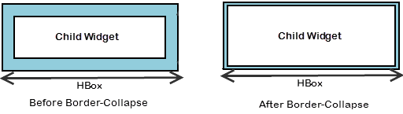
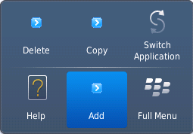
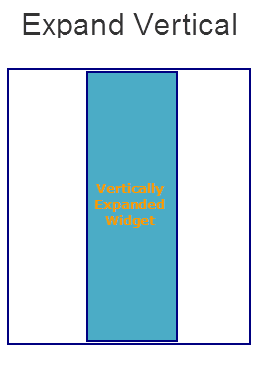

                               

Properties
==========

The HBox Widget supports the following properties.

*   [a11yIndex](#a11yindex)
*   [a11yNavigationMode](#a11ynavigationmode)
*   [blockedUISkin](#blockeduiskin)
*   [borderCollapse](#bordercollapse)
*   [containerWeight](#containerweight)
*   [contextMenu](#contextmenu)
*   [enableCache](#enablecache)
*   [focusSkin](#focusskin)
*   [gridCell](#gridCell)
*   [hoverSkin](#hoverskin)
*   [id](#id)
*   [info](#info)
*   [isVisible](#isvisible)
*   [layoutAlignment](#layoutalignment)
*   [layoutMeta](#layoutMe)
*   [layoutType](#layoutTy)
*   [margin](#margin)
*   [marginInPixel](#margininpixel)
*   [orientation](#displayO)
*   [padding](#padding)
*   [paddingInPixel](#paddinginpixel)
*   [percent](#percent)
*   [position](#position)
*   [skin](#skin)
*   [vExpand](#vexpand)
*   [viewConfig](#viewconfig)
*   [widgetAlignment](#widgetalignment)

### a11yIndex

The property helps you define index to each child widget in a container.

You can set indexing keys to the child widgets using integers starting from 1. If any child widget is not defined with any integer value, that child widget is visible after displaying all widgets, for which keys are defined, in sequence.

Suppose multiple widgets in a container are set with same integer value, the displaying order of the widgets is based on the addition of the widgets to the container. That is, the widget added first to the container will be read first and followed by other widgets in sequence.

<b>Syntax</b>

**JavaScript:** a11yIndex

<b>Type</b>

**JavaScript:** Number

<b>Read/Write</b>

Read + Write

<b>Example</b>

```

//Defining the properties for a box with a11yIndex: 1
var basicConfBox = {id:"boxFocusSkinTest", isVisible:true, orientation:constants.BOX_LAYOUT_HORIZONTAL, kin:"boxGray", "accessibilityConfig": { 		"a11yNavigationMode": constants.ACCESSIBILITY_NAVIGATION_PARENT,     **"a11yIndex": 1**}};

var layoutConfBox = {contentAlignment:constants.CONTENT_ALIGN_TOP_CENTER, containerWeight:100, vExpand:true};

//Creating the box.
boxFocusSkinTest = new voltmx.ui.Box(basicConfBox, layoutConfBox, {});

//Reading the focusSkin property of the box.
alert("box focusSkin is ::"+boxFocusSkinTest.focusSkin);
```

<b>Platform Availability</b>

*   iOS

### a11yNavigationMode

The property helps to specify the type of navigation order that should be used in the HBox.

You can define any one of the following values to the property:

*   constants.ACCESSIBILITY\_NAVIGATION\_MODE\_NATIVE: Native accessibility navigation. Applies the platform's default accessibility navigation order. This is the default value for the property.
*   constants.ACCESSIBILITY\_NAVIGATION\_MODE\_PARENT: Applies a custom navigation for widgets based on the a11yIndices set to the child widgets.
*   constants.ACCESSIBILITY\_NAVIGATION\_MODE\_DEFAULT: Derives the property value from its immediate parent going all the way to form level.

<b>Syntax</b>

**JavaScript:** a11yNavigationMode

<b>Type</b>

**JavaScript:** Number

<b>Read/Write</b>

Read + Write

<b>Example</b>

```
//Defining the properties for a box with 
a11yNavigationMode: constants.ACCESSIBILITY_NAVIGATION_MODE_PARENT
var basicConfBox = 
{
	id:"boxFocusSkinTest", isVisible:true, 
	orientation:constants.BOX_LAYOUT_HORIZONTAL, 
	kin:"boxGray", "accessibilityConfig": 
	{    
	 "a11yNavigationMode": constants.ACCESSIBILITY_NAVIGATION_MODE_PARENT,
	 "a11yIndex": 1
	}
		};

var layoutConfBox = 
{
	contentAlignment:constants.CONTENT_ALIGN_TOP_CENTER, 
	containerWeight:100, vExpand:true
	};

//Creating the box.
boxFocusSkinTest = new voltmx.ui.Box(basicConfBox, layoutConfBox, {});

//Reading the focusSkin property of the box.
alert("box focusSkin is :"+boxFocusSkinTest.focusSkin);
```

<b>Platform Availability</b>

*   iOS

### blockedUISkin

Specifies the skin that must be used to block the interface until the action in progress (for example, a service call) is completed.

**Default:**_None_ (No skin is applied)

To specify a skin, select a skin from the list.

> **_Note:_** For the skin to be available in the list, you must add a skin for Blocked UI under Widget Skins.

<b>Syntax</b>

blockedUISkin

<b>Type</b>

String

<b>Read/Write</b>

Yes - (Read and Write)

<b>Example</b>

```

//Call back for box onClick event
function boxblockedUISkinTCSPAPlayClick(box){  
	//Call the service here to observe blockedUI skin  
}

//The below two functions will explain how to use blockedUISkin property for Box widget.
var basicConf = {id:"lblblockedUISkin", text:"Click this Box to see blockedUI skin while calling the service", isVisible:true};

var layoutConf = {contentAlignment :constants.CONTENT_ALIGN_CENTER, containerWeight:100, widgetAlignment:constants.WIDGET_ALIGN_CENTER,hExpand: true,vExpand:true};

//Creating the Label.
var lblblockedUISkin = new voltmx.ui.Label(basicConf, layoutConf, {});

//onClick event is triggered when user clicks on the box. In this case we are calling the service inside the callback to observe the blockedUI skin.
var basicConfBox = {id:"boxblockedUISkin", isVisible:true, orientation:constants.BOX_LAYOUT_HORIZONTAL,onClick:boxblockedUISkinTCSPAPlayClick};

var layoutConfBox = {contentAlignment:constants.CONTENT_ALIGN_TOP_CENTER, containerWeight:100, vExpand:true};

//Creating the Box
var boxblockedUISkin = new voltmx.ui.Box(basicConfBox, layoutConfBox, {blockedUISkin:"blockUISkin"});

//Adding label to box.  
boxblockedUISkin.add(lblblockedUISkin);
```

<b>Accessible from IDE</b>

Yes

<b>Platform Availability</b>

*   SPA (iPhone/Android/BlackBerry/Windows NTH)

### borderCollapse

Specifies if the space between the Box and its child widgets is considered.

**Default:**_false_

If set to _true,_ the default space between the parent and the child widget reduces.

If set to _false,_ the default space between the parent and the child widget retained.



<b>Syntax</b>

borderCollapse

<b>Type</b>

Boolean

<b>Read/Write</b>

No

<b>Example</b>

```

//Defining the box with borderCollapse:true .(If you set the Border-Collapse value to true, the default space between the parent and the child widget reduces else not.)
var basicConfBox = {id:"boxBorderCollapse", isVisible:true, orientation:constants.BOX_LAYOUT_HORIZONTAL};

var layoutConfBox = {contentAlignment:constants.CONTENT_ALIGN_TOP_CENTER, containerWeight:100, vExpand:true};

var PSPConfBox = {**borderCollapse:true**}

//Creating the box.
var boxBorderCollapse = new voltmx.ui.Box(basicConfBox, layoutConfBox, PSPConfBox );
```

<b>Accessible from IDE</b>

Yes

<b>Platform Availability</b>

*   Server side Mobile Web (basic)
*   Server side Mobile Web (BJS)

### containerWeight

Specifies percentage of width to be allocated by its parent widget. The parent widget space is distributed to its child widgets based on this weight factor. All its child widgets should sum up to 100% of weight except when placed in **voltmx.ui.ScrollBox**.

For example, a Form has Label1, Button1, and Button2 and the container weight could be 30 each for Label1 and Button1 and 40 for Button2, so that the sum of the container weight is 100.

<b>Syntax</b>

containerWeight

<b>Type</b>

Number (less than or equal to 100)

<b>Read/Write</b>

Yes - (Read and Write)

<b>Example</b>

```

//Defining the properties for a box with containerWeight:50 (box will occupy half of its parent widget).
var basicConfBox = {id:"boxContainerWeightTest", isVisible:true, orientation:constants.BOX_LAYOUT_HORIZONTAL, skin:"gradroundbox"};

var layoutConfBox = {**containerWeight:50,margin:[0,5,0,5]**};

//Creating the box.
boxContainerWeightTest = new voltmx.ui.Box(basicConfBox, layoutConfBox, {});
```

<b>Accessible from IDE</b>

No

<b>Platform Availability</b>

Available on all platforms

### contextMenu

Shows the list of actions (appropriate to the widget in focus) as menu items.

> **_Note:_** Due to BlackBerry platform limitation, to display a context menu for an Box, you must define an [onclick event](Box_Events.md#onclick) for the Box.

The following are the characteristics of a context menu on _BlackBerry_ platform:

*   You can invoke the context menu either by clicking on the widget (applicable only on BlackBerry versions 6.x and above) or by a long press on the screen (or trackpad).
*   You can choose to add icons to indicate the menu items in the context menu (applicable only on BlackBerry versions 6.x and above).
*   BlackBerry layouts menu items in a 3 item grid view. The menu items _Switch Application_, _Help_, _Close_, and _Full Menu_ are added automatically based on the number of menu items added in the context menu. For example, If you add a context menu with 2 items, it will display _Full Menu_ item along with the items added. If you add a context menu with 3 items, it will display _Full Menu_, _Help_, _Switch Application_ items along with the items added.
*   If the focus is on a widget that has a context menu; and if you click the _"menu key"_, the Full Menu appears along with the context menu items.
*   On Blackberry Non-Touch Devices, only _Full Menu_ item is displayed irrespective of number of items added in the context menu.

> **_Note:_** The context menu items in the _Full Menu_ will disappear if the focus is shifted from the widget which has the context menu.

The following images illustrate the context menu on various BlackBerry devices:

  
| BlackBerry 6.x | BlackBerry Touch Device (<6.x) | BlackBerry Non-Touch Device (<6.x) |
| --- | --- | --- |
|  |  |  |

The below description and procedure is applicable to Desktop Web platform only.

The context specific menu will be displayed with the array of menu items (appropriate to the widget in focus) on right-click mouse.

**Default:**_None_

A series of steps to be followed to use contextMenu:

1.  Define a menutemplate under project > templates > menus.  
      
    1.  Go to Applications View.
    2.  Expand the application for which you want to create a menu template.
    3.  Navigate to templates and expand menus, right-click desktop and select New Menu Template. The Create a New Menu window appears.
    4.  Enter a Name for the template and click Finish.
    5.  A new form is created. Drag-drop an HBox and then a VBox within an HBox. You can add other widgets within these widgets.
2.  Define a contextmenu template under project > templates > contexmenus.  
      
    1.  Go to Applications View.
    2.  Expand the application for which you want to create a contextmenu template.
    3.  Navigate to templates and expand contextmenus, right-click desktop and select New ContextMenu Template. The Create a New ContextMenu window appears.
    4.  Enter a Name for the template and click Finish. A new form is created
    5.  Drag-drop a menucontainer. You can drag-drop a menucontainer widget only.
    6.  (optional) Select menuItemTemplate from the drop down.
    7.  Define data using the data property.
3.  Go to your project and then to desired form and drag-drop a hbox and navigate to Desktop Web properties in Widget Properties window.
4.  Select the contextmenu template from the dropdown.

<b>Syntax</b>

contextMenu

<b>Type</b>

Array (voltmx.ui.Menuitem)

<b>Read/Write</b>

Yes - (Read and Write)

<b>Example</b>

```

//Defining contextMenu items for Windows platform.
var appMenu1 = {id:"appmenuitemid1", text:"Add", image:"tc.png", onclick:callbackMenuItem1 };

var appMenu2 = {id:"appmenuitemid2", text:"Remove", image:"tc.png", onclick:callbackMenuItem2 };

var appMenu3 = {id:"appmenuitemid3", text:"Edit", image:"tc.png", onclick:callbackMenuItem3};

var appMenu4 = {id:"appmenuitemid4", text:"Close", image:"tc.png", onclick: callbackMenuItem4};
	
function callbackMenuItem1()
{
		alert("Clicked on First menu item");
}

function callbackMenuItem2()
{
		alert("Clicked on Second menu item");
}

function callbackMenuItem3()
{
		alert("Clicked on Third menu item");
}

function callbackMenuItem4()
{
		alert("Clicked on Fourth menu item");
}

//Defining the box with contextMenu:[appMenu1,appMenu2,appMenu3,appMenu4]
var basicConfBox = {id:"boxBorderCollapse", isVisible:true, orientation:constants.BOX_LAYOUT_HORIZONTAL};

var layoutConfBox = {contentAlignment:constants.CONTENT_ALIGN_TOP_CENTER, containerWeight:100, vExpand:true};

var PSPConfBox = {**contextMenu:[appMenu1,appMenu2,appMenu3,appMenu4]**};

//Creating the box.
var boxBorderCollapse = new voltmx.ui.Box(basicConfBox, layoutConfBox, PSPConfBox );
```

The below example is applicable to Desktop Web platform only.  

```

//Defining contextMenu template.  
function initializeaddtoabc() {
	menucontainer12068 = new voltmx.ui.MenuContainer({
		"id": "menucontainer12068", "isVisible": true,
		"data": [{template: hbox12068, "label12068": {"text": "India"},
				children: [{template: hbox12068, "label12068": {"text": "Mumbai"},
				"image212068": {}, children: [] }]
		}, {template: hbox12068, "label12068": {"text": "Srilanka" },
			"image212068": {}
		}],
		"widgetDataMap": {"label12068": "label12068","image212068": "image212068"},
		"menuItemTemplate": hbox12068}, {"widgetAlignment": constants.WIDGET_ALIGN_CENTER,
		"containerWeight": "50", "margin": [0, 0, 0, 0],
		"padding": [0, 0, 0, 0], "marginInPixel": false,
		"paddingInPixel": false
	}, {
		"viewType": constants.MENU_CONTAINER_VIEW_TYPE_CONTEXTVIEW
	});
};

//Defining the box with contextMenu:menucontainer12068
var basicConfBox = {id:"boxBorderCollapse", isVisible:true, orientation:constants.BOX_LAYOUT_HORIZONTAL};

var layoutConfBox = {contentAlignment:constants.CONTENT_ALIGN_TOP_CENTER, containerWeight:100, vExpand:true};

var PSPConfBox = {**contextMenu:menucontainer12068**};

//Creating the box.
var boxBorderCollapse = new voltmx.ui.Box(basicConfBox, layoutConfBox, PSPConfBox );
```

<b>Accessible from IDE</b>

No. But for Desktop Web platform you can access it through IDE.

<b>Platform Availability</b>

*   Android
*   BlackBerry
*   Windows Phone

### enableCache

This property enables you to improve the performance of Positional Dimension Animations.

> **_Note:_** When this property is used, it increases the memory consumption by the application. It enables tradeoff between performance and visual quality of the content.

**Default:**_true_

<b>Syntax</b>

enableCache

<b>Type</b>

Boolean

<b>Read/Write</b>

Yes - (Read and Write)

<b>Accessible from IDE</b>

Yes

<b>Platform Availability</b>

This property is supported only on Windows platform

### focusSkin

This is a skin property and it determines the look and feel when there is focus on a widget.

For more information on how to create and work with skins, see the _Working with Applications_ section of the _VoltMX Iris User Guide_.

> **_Note:_** You must be aware of the following:  
1\. On J2ME, if you do not specify the Focus skin, it is not possible to identify the focus change between the widgets.  
2\. Mobile Web does not support this property; instead browser specific focus will be applied.

<b>Syntax</b>

focusSkin

<b>Type</b>

String

<b>Read/Write</b>

Yes - (Read and Write)

<b>Example</b>

```

//Defining the properties for a box with focusSkin:"boxGrayFocus"
var basicConfBox = {id:"boxFocusSkinTest", isVisible:true, orientation:constants.BOX_LAYOUT_HORIZONTAL, kin:"boxGray", **focusSkin:"boxGrayFocus"**};

var layoutConfBox = {contentAlignment:constants.CONTENT_ALIGN_TOP_CENTER, containerWeight:100, vExpand:true};

//Creating the box.
boxFocusSkinTest = new voltmx.ui.Box(basicConfBox, layoutConfBox, {});

//Reading the focusSkin property of the box.
alert("box focusSkin is ::"+boxFocusSkinTest.focusSkin); 
```

<b>Accessible from IDE</b>

Yes

<b>Platform Availability</b>

Available on all platforms. and SPA (Windows Tablet only)


<h3 id="gridCell">gridCell</h3>

> **_Note:_** This property is applicable only when a widget is placed inside a container widget with Grid Layout applied.

Represents the grid cell details in the sequence colSpan, rowSpan, rowNo, colNo. Description of the details are:

*   colSpan: Specifies the number of columns that a grid should span. Default value is 1.
*   rowSpan: Specifies the number of rows that a grid should span. Default value is 1.
*   rowNo: Specifies the row number in where the widget is placed in a grid layout.
*   colNo: Specifies the column number in where the widget is placed in a grid layout.

> **_Note:_** Layout type is not visible as a property. It is set when the user applies XYLayout or GridLayout on a form. The default option is XYLayout. To set GridLayout, right-click on the form and select Apply GridLayout.  

<b>Syntax</b>

gridCell

<b>Type</b>

JSObject

<b>Read/Write</b>

Yes - (Read and Write)

<b>Example</b>

```

//Defining properties for a box with gridCell.
var basicConfBox = {id:"boxLayoutAlignmentLeftTest", isVisible:true, orientation:constants.BOX_LAYOUT_HORIZONTAL,skin:"gradroundbox"};

var layoutConfBox = {containerWeight:100, percent:false, layoutType: constants.CONTAINER_LAYOUT_GRID,
		layoutMeta: {
			"cols": 8,
			"colmeta": ["15", "15", "15", "15", "15", "15", "5", "5"],
			"rows": 4
		},**gridCell: {"colSpan":1, "rowSpan":1, "rowNo":1, "colNo":1}** };  
//Creating the box.
boxLayoutAlignmentLeftTest = new voltmx.ui.Box(basicConfBox, layoutConfBox, {});
```

<b>Accessible from IDE</b>

Yes

<b>Platform Availability</b>

*   Windows Phone

### hoverSkin

Specifies the look and feel of a widget when the cursor hovers on the widget.

<b>Syntax</b>

hoverSkin

<b>Type</b>

String

<b>Read/Write</b>

Yes - (Read and Write)

<b>Example</b>

```

//Defining the box with hoverSkin:"hskin"
var basicConfBox = {id:"boxBorderCollapse", isVisible:true, orientation:constants.BOX_LAYOUT_HORIZONTAL};

var layoutConfBox = {contentAlignment:constants.CONTENT_ALIGN_TOP_CENTER, containerWeight:100, vExpand:true};

var PSPConfBox = {**hoverSkin:"hskin"**}

//Creating the box.
var boxBorderCollapse = new voltmx.ui.Box(basicConfBox, layoutConfBox, PSPConfBox );
```

<b>Accessible from IDE</b>

Yes

Availability on platforms

*   Windows Tablet

### id

id is a unique identifier of a Box consisting of alpha numeric characters. Every Box widget should have a unique id within a Form.

<b>Syntax</b>

id

<b>Type</b>

String

<b>Read/Write</b>

Yes - (Read only)

<b>Example</b>

```

//Creating the box with the ID :"boxIdTest".
var basicConfBox = {**id:"boxIdTest"**, isVisible:true, orientation:constants.BOX_LAYOUT_HORIZONTAL};

var layoutConfBox = {contentAlignment:constants.CONTENT_ALIGN_TOP_CENTER, containerWeight:100, vExpand:true};

//Creating the box.
boxIdTest = new voltmx.ui.Box(basicConfBox, layoutConfBox, {});

//Reading the id of the box.
alert("box id is ::"+boxIdTest.id);	
  

```

  
<b>Accessible from IDE</b>

Yes

<b>Platform Availability</b>

Available on all platforms

### info

A custom JSObject with the key value pairs that a developer can use to store the context with the widget. This will help in avoiding the globals to most part of the programming.

> **_Note:_** This is a **non-Constructor** property. You cannot set this property through widget constructor. But you can read and write data to it.

Info property can hold any JSObject. After assigning the JSObject to info property, the JSObject should not be modified. For example,

```

var inf = {a: 'hello'};  
widget.info = inf; //works  
  
widget.info.a = 'hello world'; //This will not update the widget info a property to Hello world. widget.info.a will have old value as hello.  

```

<b>Syntax</b>

info

<b>Type</b>

JSObject

<b>Read/Write</b>

Yes - (Read and Write)

<b>Example</b>

```

//Creating the box with the info property.
var basicConfBox = {id:"boxIdTest", isVisible:true, orientation:constants.BOX_LAYOUT_HORIZONTAL};

var layoutConfBox = {contentAlignment:constants.CONTENT_ALIGN_TOP_CENTER, containerWeight:100, vExpand:true};

//Creating the box.
boxIdTest = new voltmx.ui.Box(basicConfBox, layoutConfBox, {});  
**boxIdTest.info = {key:"Boxnumber"};**  
//Reading the info of the box.
alert("box info is ::"+boxIdTest.info);
```

<b>Accessible from IDE</b>

No

<b>Platform Availability</b>

Available on all platforms

### isVisible

This property controls the visibility of a widget on the form.

**Default:**_true_

If set to _false,_ the widget is not displayed.

If set to _true,_ the widget is displayed.

> **_Note:_** This property is not applicable if the widget is placed in a [Segment](Segment.md). When the widget is placed in a Segment, the default _Visibility_ is set to _true_. If you want to change the value to _false_, you can do so using the [Segment Methods](Segment_Methods.md).  

<b>Syntax</b>

isVisible

<b>Type</b>

Boolean

<b>Read/Write</b>

Yes - (Read and Write)

<b>Example</b>

```

//Defining the properties for a box with isVisible:true.
var basicConfBox = {id:"boxisVisibleTest", **isVisible:true**, orientation:constants.BOX_LAYOUT_HORIZONTAL};

var layoutConfBox = {contentAlignment:constants.CONTENT_ALIGN_TOP_CENTER, containerWeight:100, vExpand:true};

//Creating the box.
boxisVisibleTest = new voltmx.ui.Box(basicConfBox, layoutConfBox, {});

//Defining the properties for a box with isVisible:false.
basicConfBox = {id:"boxisVisibleTestFalse", isVisible:false, orientation:constants.BOX_LAYOUT_HORIZONTAL}; layoutConfBox = {contentAlignment:constants.CONTENT_ALIGN_TOP_CENTER, containerWeight:100, vExpand:true};

//Creating the box.
boxisVisibleTestFalse = new voltmx.ui.Box(basicConfBox, layoutConfBox, {});

//Reading the isVisible property of the box
alert("Box visibility is ::"+boxisVisibleTestFalse.isVisible); 

alert("Second box visibility is ::"+boxisVisibleTest.isVisible); 

  

```

> **_Note:_** You can set the visibility of a widget dynamically from code using the setVisibility method.

<b>Accessible from IDE</b>

Yes (Except for form/popup)

<b>Platform Availability</b>

Available on all platforms. and Win Mobile6x.

### layoutAlignment

This property is applicable if the [percent](#percent) property is set to _false_. Specifies the direction in which the widgets are laid out.

**Default:** BOX\_LAYOUT\_ALIGN\_FROM\_LEFT

The available options are:

*   BOX\_LAYOUT\_ALIGN\_FROM\_LEFT: The widgets placed inside a box are aligned left.
*   BOX\_LAYOUT\_ALIGN\_FROM\_CENTER: The widgets placed inside a box are aligned center.
*   BOX\_LAYOUT\_ALIGN\_FROM\_RIGHT: The widgets placed inside a box are aligned right.

> **_Note:_** To set the value through code, prefix the option with _constants._ such as _**constants.<option>**_ .

<b>Syntax</b>

layoutAlignment

<b>Type</b>

Number

<b>Read/Write</b>

No

<b>Example</b>

```

//Defining properties for a box with layoutAlignment:BOX_LAYOUT_ALIGN_FROM_LEFT(If percent property is false then this property is considered).
var basicConfBox = {id:"boxLayoutAlignmentLeftTest", isVisible:true, orientation:constants.BOX_LAYOUT_HORIZONTAL,skin:"gradroundbox"};

var layoutConfBox = {containerWeight:100, percent:false, **layoutAlignment:constants.BOX_LAYOUT_ALIGN_FROM_LEFT**};

//Creating the box.
boxLayoutAlignmentLeftTest = new voltmx.ui.Box(basicConfBox, layoutConfBox, {});
```

<b>Accessible from IDE</b>

Yes

<b>Platform Availability</b>

Available on all platforms


<h3 id="layoutMe">layoutmeta</h3>

A custom JSObject with the key, value pairs that developer can use to provide the meta info about the grid layout. The following are the mandatory keys required to be part of the Meta.

> **_Note:_** The data for layoutmeta data is set when you set grid layout view properties for rows and columns. This property can be set using Volt MX Iris Grid Layout view. To set the view, go to Window > Show View > Others and select GridLayout View from Volt MX Iris folder.

**rows :** no of grid rows

**cols** : no of grid cols

**colmeta**: \[{width:"width in %"}\]

The sum total of percentage (%) widths of each of the columns in the grid layout should add up to 100%.

<b>Syntax</b>

layoutMeta

<b>Type</b>

JSObject

<b>Read/Write</b>

Yes - (Read and Write)

<b>Example</b>

```

//Defining properties for a box with layoutMeta.
var basicConfBox = {id:"boxLayoutAlignmentLeftTest", isVisible:true, orientation:constants.BOX_LAYOUT_HORIZONTAL,skin:"gradroundbox"};

var layoutConfBox = {containerWeight:100, percent:false, layoutType: constants.CONTAINER_LAYOUT_GRID,
		**layoutMeta: {
			"cols": 8,
			"colmeta": ["15", "15", "15", "15", "15", "15", "5", "5"],
			"rows": 4
		}}**;  
//Creating the box.
boxLayoutAlignmentLeftTest = new voltmx.ui.Box(basicConfBox, layoutConfBox, {});
```

<b>Accessible from IDE</b>

Yes

<b>Platform Availability</b>

*   Windows Tablet


<h3 id="layoutTy">layoutType</h3>  


Defines the type of the layout of container widget. Following are the available options:

*   CONTAINER\_LAYOUT\_BOX: This is the default options on both Windows Tablet and Desktop Web platforms.
*   CONTAINER\_LAYOUT\_GRID: In grid layout the form is split it to rows and columns.

> **_Note:_** Layout type is not visible as a property. It is set when the user applies XYLayout or GridLayout on a form. From the IDE, the default option is XYLayout. To set GridLayout, right-click on the form and select Apply GridLayout.  

<b>Syntax</b>

layoutType

<b>Type</b>

String - \[Mandatory\]

<b>Read/Write</b>

Yes - (Read only)

<b>Example</b>

```

//Defining properties for a box with layoutType:CONTAINER_LAYOUT_GRID.
var basicConfBox = {id:"boxLayoutAlignmentLeftTest", isVisible:true, orientation:constants.BOX_LAYOUT_HORIZONTAL,skin:"gradroundbox"};

var layoutConfBox = {containerWeight:100, percent:false, **layoutType: constants.CONTAINER_LAYOUT_GRID**,
		layoutMeta: {
			"cols": 8,
			"colmeta": ["15", "15", "15", "15", "15", "15", "5", "5"],
			"rows": 4
		}};

//Creating the box.
boxLayoutAlignmentLeftTest = new voltmx.ui.Box(basicConfBox, layoutConfBox, {});
```

<b>Accessible from IDE</b>

Yes

<b>Platform Availability</b>

*   Windows Tablet

### margin

Defines the space around a widget. You can use this option to define the left, top, right, and bottom distance between the widget and the next element.

To define the margin values for a platform, click the () button against the property to open the _Margin_ screen. Select the checkbox against the platform for which you want to define the margins and enter the top, left, right, and bottom margin values.

If you want to use the margin values set for a platform across other platforms, you can click the _Apply To_ button and select the platforms on which you want the margin values to be applied.

The following image illustrates the window to define the margins for platforms:


The following image illustrates a widget with a defined margin:


<b>Syntax</b>

margin

<b>Type</b>

Array of Numbers

<b>Read/Write</b>

Yes - (Read and Write)

<b>Example</b>

```

//Defining the properties of a box with margin:[0,5,0,5], Directions :left,top,right,bottom respectively.
var basicConfBox = {id:"boxMarginTest", isVisible:true, orientation:constants.BOX_LAYOUT_HORIZONTAL};

var layoutConfBox = { containerWeight:100, **margin:[0,5,0,5]**};

//Creating the box
boxMarginTest = new voltmx.ui.Box(basicConfBox, layoutConfBox, {});
```

<b>Accessible from IDE</b>

Yes

<b>Platform Availability</b>

Available on all platforms. platforms.

### marginInPixel

Indicates if the margin is to be applied in pixels or in percentage.

**Default:** _false_

If set to _true,_ the margins are applied in pixels.

If set to _false,_ the margins are applied as set in [margin](#margin) property.

<b>Syntax</b>

marginInPixel

<b>Type</b>

Boolean

<b>Read/Write</b>

No

<b>Example</b>

```

//Defining the properties for a box with margin in pixels.
var basicConfBox = {id:"boxMarginTest", isVisible:true, orientation:constants.BOX_LAYOUT_HORIZONTAL};

var layoutConfBox = { containerWeight:100, margin:[0,5,0,5], **marginInPixel:true**};

//Creating the box
boxMarginTest = new voltmx.ui.Box(basicConfBox, layoutConfBox, {});
```

<b>Accessible from IDE</b>

Yes

<b>Platform Availability</b>

*   iPhone
*   iPad
*   Android
*   Windows Phone

<h3 id="displayO">Orientation</h3>

Specifies the orientation of the HBox. The widgets placed in a HBox are aligned horizontally.

**Default:** BOX\_LAYOUT\_HORIZONTAL

> **_Note:_** To set the value through code, prefix the option with _constants._ such as _**constants.\<option\>**_ .

<b>Syntax</b>

orientation

<b>Type</b>

Number

<b>Read/Write</b>

Yes - (Read only)

<b>Example</b>

```

//Creating the box with the orientation:constants.BOX_LAYOUT_HORIZONTAL.
var basicConfBox = {id:"boxIdTest", isVisible:true, **orientation:constants.BOX_LAYOUT_HORIZONTAL**};

var layoutConfBox = {contentAlignment:constants.CONTENT_ALIGN_TOP_CENTER, containerWeight:100, vExpand:true};

//Creating the box.
boxIdTest = new voltmx.ui.Box(basicConfBox, layoutConfBox, {});

//Reading the orientation of the box.
alert("box orientation is ::"+boxIdTest.orientation);	
  

```

<b>Accessible from IDE</b>

No

<b>Platform Availability</b>

Available on all platforms

### padding

Defines the space between the content of the widget and the widget boundaries. You can use this option to define the top, left, right, and bottom distance between the widget content and the widget boundary.

To define the padding values for a platform, click the () button against the property to open the _Padding_ screen. Select the checkbox against the platform for which you want to define the padding's and enter the top, left, right, and bottom padding values.

If you want to use the padding values set for a platform across other platforms, you can click the _Apply To_ button and select the platforms on which you want the padding values to be applied. The Array accepts the values in the sequence \[left, top, right, bottom\].

> **_Note:_** If no skin is applied to a Button, then Padding is not supported on iPhone. This is due to iOS Safari browser limitation. If you want the padding to be applied, apply a skin to the button and then apply padding.

The following image illustrates the window to define the padding's for platforms:

  
  
The following image illustrates a widget with a defined padding:


<b>Syntax</b>

padding

<b>Type</b>

Array of Numbers

<b>Read/Write</b>

Yes - (Read and Write)

<b>Example</b>

```

//Defining the properties of a box with padding:[10,10,10,10], Directions :left,top,right,bottom respectively.
var basicConfBox = {id:"boxPaddingTest", isVisible:true, orientation:constants.BOX_LAYOUT_HORIZONTAL};

var layoutConfBox = { containerWeight:100, **padding:[10,10,10,10]**};

//Creating the box.
boxPaddingTest = new voltmx.ui.Box(basicConfBox, layoutConfBox, {});
```

<b>Accessible from IDE</b>

Yes

<b>Platform Availability</b>

Available on all platforms

Limitations

*   iPhone - Not supported for Button unless a skin is specified.
*   Windows Phone/Windows Desktop - Not supported for Box, Image Gallery due to Browser limitation.
*   Mobile Web (BJS) - Not supported for ComboBox, Form, and ListBox due to Browser limitations.
*   Mobile Web (advanced) - Not supported for ComboBox, Form, and ListBox due to Browser limitations.

### paddingInPixel

Indicates if the padding is to be applied in pixels or in percentage.

**Default:** _false_

If set to _true,_ the padding is applied in pixels.

If set to _false,_ the padding is applied as set in [padding](#padding) property.

> **_Note:_** This property can be set to _true_ or _false_ only for iPhone, iPad, Android and Windows Phone. On other platforms this property does not give any results even when set to _true_.

> **_Note:_** For backward compatibility on older projects, this property is will be made _true_ for iPhone, iPad, Android and Windows Phone and for other platforms it will be _false_.

<b>Syntax</b>

paddingInPixel

<b>Type</b>

Boolean

<b>Read/Write</b>

No

<b>Example</b>

```

//Defining the properties of a box with padding in pixels.
var basicConfBox = {id:"boxPaddingTest", isVisible:true, orientation:constants.BOX_LAYOUT_HORIZONTAL};

var layoutConfBox = { containerWeight:100, padding:[10,10,10,10], **paddingInPixel:true**};

//Creating the box.
boxPaddingTest = new voltmx.ui.Box(basicConfBox, layoutConfBox, {});
```

<b>Accessible from IDE</b>

Yes

<b>Platform Availability</b>

*   iPhone
*   iPad
*   Android
*   Windows Phone

### percent

Specifies if the child widgets weight factor must be considered during layout. When the widgets do not have enough space to accommodate inside non-percentage HBox, then the behavior of these widgets inside an HBox is undefined.

> **_Note:_** In _voltmx.application.setApplicationBehaviors_ API the parameter _retainSpaceOnHide_ is only applicable when percent property is set to True for HBox.

> **_Note:_** On SPA, and Desktop Web platforms, when you place multiple VBoxes inside a non percentage HBox, VBoxes are adjusted automatically.

> **_Note:_** On BlackBerry 10 platform, when percent property set to false, text on the widgets may fade or width of the widgets may expand or reduce.

> **_Note:_** For SPA or Desktop Web, if percent value is set to false (percent=false), and if HBox has VBox in it, rendering may not be consistent with richclients. If HBox has any VBox inside it, avoid using false as a value for percent and instead, use true (percent=true).

**Default:**_true_

If set to _false,_ the [layoutAlignment](#layoutalignment) is considered.

If set to _true,_ the [containerWeight](#containerweight) is considered.

<b>Syntax</b>

percent

<b>Type</b>

Boolean

<b>Read/Write</b>

No

<b>Example</b>

```

//Defining the properties of a box with Percent:false(child widgets weight factor (containerWeight property) is not considered).
var basicConfBox = {id:"boxPercentTest", isVisible:true, orientation:constants.BOX_LAYOUT_HORIZONTAL};

var layoutConfBox = {containerWeight:100, **percent:false**, margin:[0,5,0,5]};

//Creating the box
boxPercentTest = new voltmx.ui.Box(basicConfBox, layoutConfBox, {});

//Defining the properties of a box with Percent:true(child widgets weight factor (containerweight property) is to be considered).
basicConfBox = {id:"boxPercentTestTrue", isVisible:true, orientation:constants.BOX_LAYOUT_HORIZONTAL};
layoutConfBox = { ontainerWeight:100, **percent:true**, margin:[0,5,0,5]};

//Creating the box.
boxPercentTestTrue = new voltmx.ui.Box(basicConfBox, layoutConfBox, {});
```

<b>Accessible from IDE</b>

Yes

<b>Platform Availability</b>

Available on all platforms

### position

Specifies the position of the box as header or footer of the form. When you set this property the box is docked along with header or footer.

> **_Note:_** This property is applicable for immediate child widgets placed on a Form.

**Default:** BOX\_POSITION\_AS\_NORMAL

Following are the options available:

*   BOX\_POSITION\_AS\_NORMAL: The original position of the box is retained.
*   BOX\_POSITION\_AS\_HEADER: The box is fixed at the top of the form.
*   BOX\_POSITION\_AS\_FOOTER: The box is fixed at the bottom of the form.
*   BOX\_POSITION\_AS\_SCREENLEVEL\_SEG\_HEADER: This option is useful to fix the position of the box to the top of the form when the box is placed inside a SegmentedUI with screenLevelWidget set to _true_. This property is treated as [normal BOX\_POSITION\_AS\_NORMAL where the original position of the box is retained.](javascript:void(0);) when a box is not placed in a segment. This option is not supported on Windows platforms.
*   BOX\_POSITION\_AS\_SCREENLEVEL\_SEG\_FOOTER: This option is useful to fix the position of the box to the bottom of the form when a box is placed inside a SegmentedUI with screenLevelWidget set to _true_. This property is treated as [normalBOX\_POSITION\_AS\_NORMAL where the original position of the box is retained.](javascript:void(0);) when a box is not placed in a segment. This option is not supported on Windows platforms.

> **_Note:_** To set the value through code, prefix the option with _constants._ such as _**constants.<option>**_ .

<b>Syntax</b>

position

<b>Type</b>

Number

<b>Read/Write</b>

No

<b>Example</b>

```

//Defining the properties for a box with position:BOX_POSITION_AS_HEADER
var basicConfBox = {id:"boxPositionTest", isVisible:true, orientation:constants.BOX_LAYOUT_HORIZONTAL, **position:constants.BOX_POSITION_AS_HEADER**};

var layoutConfBox = {contentAlignment:constants.CONTENT_ALIGN_TOP_CENTER, containerWeight:100, vExpand:true};

//Creating the box.
boxPositionTest = new voltmx.ui.Box(basicConfBox, layoutConfBox, {});

//Defining the properties for a box with position:BOX_POSITION_AS_FOOTER
basicConfBox = {id:"boxPositionTestFooter", isVisible:true, orientation:constants.BOX_LAYOUT_HORIZONTAL, position:constants.BOX_POSITION_AS_FOOTER};
layoutConfBox = {contentAlignment:constants.CONTENT_ALIGN_TOP_CENTER, containerWeight:100, vExpand:true};

//Creating the box.
boxPositionTestFooter = new voltmx.ui.Box(basicConfBox, layoutConfBox, {});

```

<b>Accessible from IDE</b>

Yes

<b>Platform Availability</b>

Available on all platforms except SPA platforms.

### skin

Specifies the look and feel of the widget when not in focus.

> **_Note:_** In BlackBerry platform, HBox background image (in the skin) does not get expanded. Image is displayed as per the original size. Its a limitation in BlackBerry.

<b>Syntax</b>

skin

<b>Type</b>

String

<b>Read/Write</b>

Yes - (Read and Write)

<b>Example</b>

```

//Defining the properties for a box with skin:"boxGray"
var basicConfBox = {id:"boxSkinTest", isVisible:true, orientation:constants.BOX_LAYOUT_HORIZONTAL, **skin:"boxGray"**};

var layoutConfBox = {contentAlignment:constants.CONTENT_ALIGN_TOP_CENTER, containerWeight:100, vExpand:true};

//Creating the box.
boxSkinTest = new voltmx.ui.Box(basicConfBox, layoutConfBox, {});

//Reading the skin property of the box.
alert("box skin is ::"+boxSkinTest.skin); 
```

<b>Accessible from IDE</b>

Yes

<b>Platform Availability</b>

Available on all platforms

### vExpand

Specifies the widget expansion in the vertical direction.

**Default:**_false_

If set to _true,_ the widget occupies the entire available height.

If set to _false,_ the widget occupies the preferred height.



<b>Syntax</b>

vExpand

<b>Type</b>

Boolean

<b>Read/Write</b>

No

<b>Example</b>

```

//Defining the properties of a box with vExpand:true.
var basicConfBox = {id:"boxvExpandTrueTest", isVisible:true, orientation:constants.BOX_LAYOUT_VERTICAL, skin:"gradroundbox"};

var layoutConfBox = {containerWeight:99, **vExpand:true**};

//Creating the box.
boxvExpandTrueTest = new voltmx.ui.Box(basicConfBox, layoutConfBox, {});

//Defining the properties of a box with vExpand:false.
var basicConfBox = {id:"boxvExpandTrueTest", isVisible:true, orientation:constants.BOX_LAYOUT_VERTICAL, skin:"gradroundbox"};

var layoutConfBox = {containerWeight:99, **vExpand:false**};

//Creating the box.
boxvExpandFalseTest = new voltmx.ui.Box(basicConfBox, layoutConfBox, {});

  

```

<b>Accessible from IDE</b>

Yes

<b>Platform Availability</b>

Available on all platforms except Desktop Web and Server side Mobile Web platforms.

### viewConfig

View Configuration is applicable only when container widget layout is grid.

> **_Note:_** For more information on applying the Grid layout, refer Volt MX Iris User Guide.

ViewConfig displays two types of views:

*   Normal view
*   Grid view - Windows 8 or 8.1

Following are the available properties:

*   **view:** Specifies the type of view to be rendered. This option is available in both Normal grid and Grid view. Following are the available options :

> *   constants.CONTAINER\_LAYOUT\_GRID (Default option)
> *   constants.CONTAINER\_LAYOUT\_GRIDVIEW

*   **gridSizeMode:** Specifies the behavior of the grid with respect to size, rows, and columns. This option is available in both Normal grid and Grid view. The available options are:

> *   fixed grid - Use this option to fix the number of rows and columns. For example, columns = 4, rows = 2.  
>     1 2 3 4  
>     5 6 7 8  
>     
> *   Vertically expand - Use this option to fix the number of columns and rows can grow indefinitely. For example, columns = 3, rows = infinite.  
>     1 2 3  
>     4 5 6  
>     7 8
> *   Horizontally expand - Use this option to fix the number of rows are fixed and columns can grow indefinitely. For example, rows = 3, columns = infinite.  
>     1 4 7  
>     2 5 8  
>     3 6  
>     

*   **referenceWidth:** Specifies the width of the cell. This option is supported in Grid view only.

> > **Type**: Number  
> >   
> > **Default Value:** 0 (Accepts positive numbers only)

*   **referenceHeight:** Specifies the height of the cell. This option is supported in Grid view only.

> > **Type**: Number  
> >   
> > **Default Value:** 0 (Accepts positive numbers only)

*   **onClick:** If an onClick event is defined on a widget, the event callback is invoked by the platform when the user performs a click action in each cell. This option is supported in Grid view only.

*   **enableItemClick:** This property enables the click behavior on each cell in grid view.This option is supported in Grid view only.

> > **Type**: Boolean  
> >   
> > **Default Value:** false (item click is disabled)

*   **selectionMode:** This property enables you to select the items in grid view. This option is supported in Grid view only.

> The available options are:
> 
> *   0 - None
> *   1 - Single
> *   2 - Multiple
> 
> > **_Note:_** When you set _righttap_ event using _setGestureRecognizer_ to a container widget, the selection mode will be considered from righttap gesture arguments, the values you entered are ignored.
> 
> > **Type**: Number  
> >   
> > **Default Value:** 0

*   **onSelect:** An event callback is invoked by the platform when you right tap using mouse or selects with touch. This option is supported in Grid view only.

> > **_Note:_** This event is invoked only when you set _selectionModeView!=0_ (None). If you set righttap event using setGestureRecognizer to a container widget, righttap gesture callback is set to onSelect automatically.

*   **orientation:** Specifies the orientation of the grid. This option is supported in Grid view only.

> The available options are:
> 
> *   0 - Horizontal
> *   1 - Vertical
> 
> > **Type**: Number  
> >   
> > **Default Value:** When the value is not provided, it the rowCount is more than 0 and gridSizeMode is set to constants.GRID\_SIZE\_MODE\_VERTICAL, the orientation is set to "vertical" else it is set to "Horizontal".

The type of view will be determined by the Reference Width and Reference Height of the view config property, if reference height and width are greater than 0, then view set is grid view.

For example, if you set an _onClick_ to a box, the _onClick_ event will be executed whenever you click each cell. Set righttap event using _setGestureRecognizer_ to a box and you can see right click behavior on each cell of grid view.

Possible value for Reference width and Height:

Default application displays 0,you can give any number greater than 0 to get grid view type of a widget.

Possible values for Size Mode:

*   constants.GRID\_TYPE\_FIXED
*   constants.GRID\_TYPE\_GROW\_COLUMNS
*   constants.GRID\_TYPE\_GROW\_ROWS  
    

<b>Syntax</b>

viewConfig

<b>Type</b>

JSObject

<b>Read/Write</b>

Yes

<b>Example</b>

```

//Defining the properties for a Box
var basicConfBox = {id:"boxIdTest", isVisible:true, orientation:constants.BOX_LAYOUT_HORIZONTAL};

var layoutConfBox = {contentAlignment:constants.CONTENT_ALIGN_TOP_CENTER, containerWeight:100, vExpand:true};  
var PSPConfBox = { viewConfig: {
			referenceHeight: 0,
			gridSizeMode: "constants.GRID_TYPE_FIXED",
			referenceWidth: 0
		}
};  
  
//Creating the box.
boxIdTest = new voltmx.ui.Box(basicConfBox, layoutConfBox, PSPConfBox ); 
```

<b>Accessible from IDE</b>

Yes

<b>Platform Availability</b>

This property is available on Windows Tablet platform.

### widgetAlignment

Indicates how a widget is to be anchored with respect to its parent. Each of these below options have a horizontal alignment attribute and a vertical alignment attribute. For example, WIDGET\_ALIGN\_TOP\_LEFT specifies the vertical alignment as TOP and horizontal alignment as LEFT.

Default: WIDGET\_ALIGN\_CENTER

The available options are:

*   WIDGET\_ALIGN\_TOP\_LEFT - (BlackBerry 10 supports this option)
*   WIDGET\_ALIGN\_TOP\_CENTER
*   WIDGET\_ALIGN\_TOP\_RIGHT
*   WIDGET\_ALIGN\_MIDDLE\_LEFT
*   WIDGET\_ALIGN\_CENTER - (BlackBerry 10 supports this option)
*   WIDGET\_ALIGN\_MIDDLE\_RIGHT
*   WIDGET\_ALIGN\_BOTTOM\_LEFT
*   WIDGET\_ALIGN\_BOTTOM\_CENTER
*   WIDGET\_ALIGN\_BOTTOM\_RIGHT - (BlackBerry 10 supports this option)

<b>Syntax</b>

widgetAlignment

<b>Type</b>

Number

<b>Read/Write</b>

Yes - (Read only)

<b>Example</b>

```

//Defining the properties of a box with widgetAlignment:constants.WIDGET_ALIGN_TOP_LEFT.
var basicConfBox = {id:"boxwidgetAlignment", isVisible:true, orientation:constants.BOX_LAYOUT_VERTICAL, skin:"gradroundbox"};

var layoutConfBox = {containerWeight:99, hExpand:true, **widgetAlignment:constants.WIDGET_ALIGN_TOP_LEFT**};

//Creating the box.
boxwidgetAlignment = new voltmx.ui.Box(basicConfBox, layoutConfBox, {});
  

```

<b>Accessible from IDE</b>

Yes

<b>Platform Availability</b>

*   Server side Mobile Web
*   SPA

