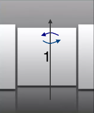

HorizontalImageStrip Properties
-------------------------------

The basic properties for HorizontalImageStrip widget are:

* * *

<details close markdown="block"><summary>accessibilityConfig Property</summary>

* * *

Enables you to control accessibility behavior and alternative text for the widget.

For more information on using accessibility features in your app, see the [Accessibility](../../../Iris/app_design_dev/Content/Accessibility_Overview.md) appendix in the Volt MX IrisUser Guide.

### Syntax

```

accessibilityConfig
```

### Type

Object

### Read/Write

Read + Write

### Remarks

*   The accessibilityConfig property is enabled for all the widgets which are supported under the Flex Layout.

> **_Note:_** From Volt MX Iris V9 SP2 GA version, you can provide i18n keys as values to all the attributes used inside the `accessibilityConfig` property. Values provided in the i18n keys take precedence over values provided in `a11yLabel`, `a11yValue`, and `a11yHint` fields.

The accessibilityConfig property is a JavaScript object which can contain the following key-value pairs.

  
| Key | Type | Description | ARIA Equivalent |
| --- | --- | --- | --- |
| a11yIndex | Integer with no floating or decimal number. | This is an optional parameter. Specifies the order in which the widgets are focused on a screen. | For all widgets, this parameter maps to the `aria-index`, `index`, or `taborder` properties. |
| a11yLabel | String | This is an optional parameter. Specifies alternate text to identify the widget. Generally the label should be the text that is displayed on the screen. | For all widgets, this parameter maps to the `aria-labelledby` property of ARIA in HTML. > **_Note:_** For the Image widget, this parameter maps to the **alt** attribute of ARIA in HTML. |
| a11yValue | String | This is an optional parameter. Specifies the descriptive text that explains the action associated with the widget. On the Android platform, the text specified for a11yValue is prefixed to the a11yHint. | This parameter is similar to the a11yLabel parameter. If the a11yValue is defined, the value of a11yValue is appended to the value of a11yLabel. These values are separated by a space. |
| a11yHint | String | This is an optional parameter. Specifies the descriptive text that explains the action associated with the widget. On the Android platform, the text specified for a11yValue is prefixed to the a11yHint. | For all widgets, this parameter maps to the `aria-describedby` property of ARIA in HTML. |
| a11yHidden | Boolean | This is an optional parameter. Specifies if the widget should be ignored by assistive technology. The default option is set to _false_. This option is supported on iOS 5.0 and above, Android 4.1 and above, and SPA | For all widgets, this parameter maps to the `aria-hidden` property of ARIA in HTML. |
| a11yARIA | Object | This is an optional parameter. For each widget, the key and value provided in this object are added as the attribute and value of the HTML tags respectively. Any values provided for attributes such as `aria-labelledby` and `aria-describedby` using this attribute, takes precedence over values given in `a11yLabel` and `a11yHint` fields. When a widget is provided with the following key value pair or attribute using the a11yARIA object, the tabIndex of the widget is automatically appended as zero.`{"role": "main"}``aria-label` | This parameter is only available on the Desktop Web platform. |

### Android limitations

*   If the results of the concatenation of a11y fields result in an empty string, then `accessibilityConfig` is ignored and the text that is on widget is read out.
*   The soft keypad does not gain accessibility focus during the right/left swipe gesture when the keypad appears.

### SPA/Desktop Web limitations

*   When `accessibilityConfig` property is configured for any widget, the `tabIndex` attribute is added automatically to the `accessibilityConfig` property.
*   The behavior of accessibility depends on the Web browser, Web browser version, Voice Over Assistant, and Voice Over Assistant version.
*   Currently SPA/Desktop web applications support only a few ARIA tags. To achieve more accessibility features, use the attribute a11yARIA. The corresponding tags will be added to the DOM as per these configurations.

### Example 1

This example uses the button widget, but the principle remains the same for all widgets that have an accessibilityConfig property.

```

//This is a generic property that is applicable for various widgets.
//Here, we have shown how to use the accessibilityConfig Property for button widget.
/*You need to make a corresponding use of the accessibilityConfig property for other applicable widgets.*/

Form1.myButton.accessibilityConfig = {
    "a11yLabel": "Label",
    "a11yValue": "Value",
    "a11yHint": "Hint"    
};
```

### Example 2

This example uses the button widget to implement internationalization in `accessibilityConfig` property, but the principle remains the same for all widgets.

```

/*Sample code to implement internationalization in accessibilityConfig property in Native platform.*/

Form1.myButton.accessibilityConfig = {
    "a11yLabel": voltmx.i18n.getLocalizedString("key1")     
};  
/*Sample code to implement internationalization in accessibilityConfig property in Desktop Web platform.*/

Form1.myButton.accessibilityConfig = {
    "a11yLabel": "voltmx.i18n.getLocalizedString(\"key3\")"
};
```

### Platform Availability

*   Available in the IDE
*   iOS, Android, SPA, and Desktop Web

* * *

</details>
<details close markdown="block"><summary>anchorPoint Property</summary>

* * *

Specifies the anchor point of the widget bounds rectangle using the widget's coordinate space.

### Syntax

```

anchorPoint
```

### Type

JSObject

### Read/Write

Read + Write

### Remarks

The value for this property is a JavaScript dictionary object with the keys "x" and "y". The values for the "x" and "y" keys are floating-point numbers ranging from 0 to 1. All geometric manipulations to the widget occur about the specified point. For example, applying a rotation transform to a widget with the default anchor point causes the widget to rotate around its center.

The default value for this property is center ( {"x":0.5, "y":0.5} ), that represents the center of the widgets bounds rectangle. The behavior is undefined if the values are outside the range zero (0) to one (1).

### Example

```

Form1.widget1.anchorPoint = {
    "x": 0.5,
    "y": 0.5
};
```

### Platform Availability

*   iOS, Android, Windows, and SPA

* * *

</details>
<details close markdown="block"><summary>arrowConfig Property</summary>

* * *

Specifies the configurable arrow properties of the HorizontalImageStrip. This property is available only when showArrows is set to _true_.

### Syntax

```

arrowConfig
```

### Type

JSObject

### Read/Write

No

### Remarks

The available options are:

*   leftArrowImage:Accepts the image to be set as left arrow.
*   leftArrowFocusImage:Accepts the image to be set as left arrow when in focus.
*   rightArrowImage:Accepts the image to be set as right arrow.
*   rightArrowFocusImage:Accepts the image to be set as right arrow when in focus.

> **_Note:_** The options **leftArrowFocusImage** and **rightArrowFocusImage** are not supported in BlackBerry, Mobile Web, and SPA platforms.

### Example

```

//Defining the properties for Horizontal Image strip with arrowConfig.
var hISBasic={id:"hIS", 
	skin:"hISkn", 
	focusSkin:"hISknFocus", 
	isVisible:true,selectedIndex:1, 
	imageWhileDownloading:"img.png", 
	imageWhenFailed:"img3.png", 
	spaceBetweenImages:20, 
	data:[[{"imagekey":"image1.png"}, {"imagekey":"image2.png"},"imagekey"], 
	viewType:constants.HORIZONTAL_IMAGESTRIP_VIEW_TYPE_COVERFLOW, 
	howArrows:true, 
	showScrollbars:true, 
	arrowConfig:{
		"leftArrowImage":"lArrow.png", 
		"leftArrowFocusImage" :"lArrowFoc.png", 
		"rightArrowImage":"rArrow.png", 
		"rightArrowFocusImage":"rArrowFoc.png"}};
					
var hISLayout={padding:[5,5,5,5],
	margin:[5,5,5,5], 
	paddingInPixel:true, 
	marginInPixel:true, 
	referenceWidth:100, 
	referenceHeight:100, 
	imageScaleMode:constants.IMAGE_SCALE_MODE_FIT_TO_DIMENSIONS, 

	};
					
var hISPSP={};

//Creating the Horizontal Image strip.
var hIS=new voltmx.ui.HorizontalImageStrip2(hISBasic, hISLayout, hISPSP);

//Reading arrowConfig of Horizontal Image strip

voltmx.print("Horizontal Image strip arrowConfig::"+hIS.arrowConfig);
```

### Platform Availability

	Available in the IDE.

	Available on all platforms.

* * *

</details>
<details close markdown="block"><summary>data Property</summary>

* * *

Specifies the JSObject which represents the images to be rendered in horizontal image strip.

### Data format of JavaScript object

```

//Data format of JavaScript object
formname.widgetname.data=
[
 [
  {"imagekey":"image1.png", accessibilityConfig:acObject},
  {"imagekey": "image2.png", accessibilityConfig:acObject}, 
  {"imagekey": "imagen.png", accessibilityConfig:acObject}
 ],	
		"imagekey"
];
```

### Syntax

```

data
```

### Type

Array

### Read/Write

Yes - (Read and Write)

### Remarks

Data format:An array with two elements.

*   \[0\] is the array of objects with hashes.
*   \[1\] is the image key's key in the data hash of \[0\].

### Example

```

//Defining the properties for Horizontal Image strip with data:
//[[{"imagekey":"image1.png"}, {"imagekey":"image2.png"}, "imagekey"]
					
var hISBasic=
    {
      id:"hIS", 
      skin:"hISkn",
      focusSkin:"hISknFocus", 
      isVisible:true, 
      selectedIndex:1, 
      imageWhileDownloading:"img.png", 
      imageWhenFailed:"img3.png", 
      spaceBetweenImages:20, 
      data:
      [
        [
          {
            "imagekey":"image1.png", 
            accessibilityConfig:acObject
          }, 
          {
            "imagekey":"image2.png",
            accessibilityConfig:acObject
          }, 
          "imagekey"
        ]
      ], 
      viewType:constants.HORIZONTAL_IMAGESTRIP_VIEW_TYPE_COVERFLOW, 
      showArrows:true, 
      showScrollbars:true
    };
					
var hISLayout=
    {
      padding:[5,5,5,5], 
      margin:[5,5,5,5], 
      paddingInPixel:true, 
      marginInPixel:true, 
      referenceWidth:100, 
      referenceHeight:100, 
      imageScaleMode:constants.IMAGE_SCALE_MODE_FIT_TO_DIMENSIONS, 

      };
					
var hISPSP={};

//Creating the Horizontal Image strip.
var hIS=new voltmx.ui.HorizontalImageStrip2(hISBasic, hISLayout, hISPSP);

//Reading data of Horizontal Image strip

voltmx.print("Horizontal Image strip data::"+hIS.data);
```

### Platform Availability

	Available in the IDE.

	Available on all platforms.

* * *

</details>
<details close markdown="block"><summary>enableCache Property</summary>

* * *

The property enables you to improve the performance of Positional Dimension Animations.

### Syntax

```

enableCache
```

### Type

Boolean

### Read/Write

Read + Write

### Remarks

The default value for this property is true.

> **_Note:_** When the property is used, application consumes more memory. The usage of the property enables tradeoff between performance and visual quality of the content. Use the property cautiously.

### Example

```

Form1.widgetID.enableCache = true;
```

### Platform Availability

*   Available in the IDE.
*   Windows

* * *

</details>
<details close markdown="block"><summary>focusSkin Property</summary>

* * *

Specifies the look and feel of the widget when in focus.

### Syntax

```

focusSkin
```

### Type

String

### Read/Write

Yes - (Read and Write)

### Remarks

> **_Note:_** You must be aware of the following:  
1\. On J2ME non-touch devices, if you do not specify the Focus skin, it is not possible to identify the focus change between the widgets.  
2\. Mobile Web does not support this property, instead browser specific focus will be applied.

### Example

```

//Defining the properties for Horizontal Image strip with focusSkin:"hISknFocus"
var hISBasic={id:"hIS",
	skin:"hISkn",
	focusSkin:"hISknFocus", 
	isVisible:true,selectedIndex:1, 
	imageWhileDownloading:"img.png", 
	imageWhenFailed:"img3.png", 
	spaceBetweenImages:20, 
	data:[[{"imagekey":"image1.png"}, {"imagekey":"image2.png"}, "imagekey"], 
	viewType:constants.HORIZONTAL_IMAGESTRIP_VIEW_TYPE_COVERFLOW, 
	showArrows:true, showScrollbars:true};
					
var hISLayout={padding:[5,5,5,5], 
	margin:[5,5,5,5], 
	paddingInPixel:true, 
	marginInPixel:true, 
	referenceWidth:100, 
	referenceHeight:100, 
	imageScaleMode:constants.IMAGE_SCALE_MODE_FIT_TO_DIMENSIONS, 
	
	};
					
var hISPSP={};

//Creating the Horizontal Image strip.
var hIS=new voltmx.ui.HorizontalImageStrip2(hISBasic, hISLayout, hISPSP);

//Reading focusSkin of Horizontal Image strip.

voltmx.print("Horizontal Image strip focusSkin::"+hIS.focusSkin);
```

### Platform Availability

	Available in the IDE.

	Available on all platforms. platforms.

* * *

</details>
<details close markdown="block"><summary>hoverSkin Property</summary>

* * *

Specifies the look and feel of a widget when the cursor hovers on the widget.

### Syntax

```

hoverSkin
```

### Type

String

### Read/Write

Yes

### Example

```

//Defining the properties for a HzImageStrip with hoverSkin:"hskin"

var hISBasic={id:"his1", 
	isVisible:true, 
	skin:"hISkin", 
	focusSkin:"hISFSkin", 
	text:"Click Here" };


var hIS={padding:[5,5,5,5],
	margin:[5,5,5,5], 
	hExpand:true, 
	vExpand:false, 
	displayText:true};
					
var hISPSP={hoverSkin:"hskin"};

//Creating the HzImageStrip.
var his1 = new voltmx.ui.HorizontalImageStrip2(hISBasic, hISLayout, hISPSP);
```

### Platform Availability

	Available in the IDE.

	This property is available on Windows Tablet.

* * *

</details>
<details close markdown="block"><summary>id Property</summary>

* * *

id is a unique identifier of HorizontalImageStrip consisting of alpha numeric characters. Every HorizontalImageStrip should have a unique id within a Form.

### Syntax

```

id
```

### Type

String - \[Mandatory\]

### Read/Write

Yes - (Read only)

### Example

```

//Defining the properties for Horizontal Image strip with id:"hIS"
var hISBasic={id:"hIS", 
	skin:"hISkn", 
	focusSkin:"hISknFocus", 
	isVisible:true, 
	selectedIndex:1, 
	imageWhileDownloading:"img.png", 
	imageWhenFailed:"img3.png", 
	spaceBetweenImages:20, 
	data:[[{"imagekey":"image1.png"}, {"imagekey":"image2.png"}, "imagekey"], 
	viewType:constants.HORIZONTAL_IMAGESTRIP_VIEW_TYPE_COVERFLOW, 
	howArrows:true, 
	showScrollbars:true};
	
var hISLayout={padding:[5,5,5,5], 
	margin:[5,5,5,5], 
	paddingInPixel:true, 
	marginInPixel:true, 
	referenceWidth:100, 
	referenceHeight:100, 
	imageScaleMode:constants.IMAGE_SCALE_MODE_FIT_TO_DIMENSIONS, 

	};
	
var hISPSP={};

//Creating the Horizontal Image strip.
var hIS=new voltmx.ui.HorizontalImageStrip2(hISBasic, hISLayout, hISPSP);

//Reading id of Horizontal Image strip
voltmx.print("Horizontal Image strip id::"+hIS.id);
```

### Platform Availability

	Available in the IDE.

	Available on all platforms.

* * *

</details>
<details close markdown="block"><summary>imageWhenFailed Property</summary>

* * *

Specifies the image to be displayed when the remote resource is not available. This image is taken from the resources folder.

### Syntax

```

imageWhenFailed
```

### Type

String

### Read/Write

No

### Example

```

//Defining the properties for Horizontal Image strip with imageWhenFailed:"img3.png"
var hISBasic={id:"hIS",skin:"hISkn", 
	focusSkin:"hISknFocus", 
	isVisible:true, selectedIndex:1, 
	imageWhileDownloading:"img.png", 
	imageWhenFailed:"img3.png", 
	spaceBetweenImages:20, 
	data:[[{"imagekey":"image1.png"}, {"imagekey":"image2.png"}, "imagekey"], 
	viewType:constants.HORIZONTAL_IMAGESTRIP_VIEW_TYPE_COVERFLOW, 
	showArrows:true, 
	showScrollbars:true};
	
var hISLayout={padding:[5,5,5,5], 
	margin:[5,5,5,5], 
	paddingInPixel:true, 
	marginInPixel:true, 
	referenceWidth:100, 
	referenceHeight:100, 
	imageScaleMode:constants.IMAGE_SCALE_MODE_FIT_TO_DIMENSIONS, 
	
	};

var hISPSP={};

//Creating the Horizontal Image strip.
var hIS=new voltmx.ui.HorizontalImageStrip2(hISBasic, hISLayout, hISPSP);
```

### Platform Availability

	Available in the IDE.

	Available on all platforms. and Windows Desktop platforms.

* * *

</details>
<details close markdown="block"><summary>imageWhileDownloading Property</summary>

* * *

Specifies the image to be displayed when the remote source is still being downloaded. This image is taken from the resources folder.

### Syntax

```

imageWhileDownloading
```

### Type

String

### Read/Write

No

### Example

```

//Defining the properties for Horizontal Image strip with imageWhileDownloading:"img.png"
var hISBasic={id:"hIS",
	skin:"hISkn", 
	focusSkin:"hISknFocus", 
	isVisible:true, 
	selectedIndex:1, 
	**imageWhileDownloading:"img.png"**, 
	imageWhenFailed:"img3.png",
	spaceBetweenImages:20, 
	data:[[{"imagekey":"image1.png"},{"imagekey":"image2.png"}, "imagekey"], 
	viewType:constants.HORIZONTAL_IMAGESTRIP_VIEW_TYPE_COVERFLOW, 
	showArrows:true, 
	showScrollbars:true};

var hISLayout={padding:[5,5,5,5], 
	margin:[5,5,5,5], 
	paddingInPixel:true, 
	marginInPixel:true, 
	referenceWidth:100, 
	referenceHeight:100, 
	imageScaleMode:constants.IMAGE_SCALE_MODE_FIT_TO_DIMENSIONS, 
	};

var hISPSP={};

//Creating the Horizontal Image strip.
var hIS=new voltmx.ui.HorizontalImageStrip2(hISBasic, hISLayout, hISPSP);
```

### Platform Availability

	Available in the IDE.

	Available on all platforms except Server side Mobile Web and Windows Desktop platforms.

* * *

</details>
<details close markdown="block"><summary>info Property</summary>

* * *

A custom JSObject with the key value pairs that a developer can use to store the context with the widget. This will help in avoiding the globals to most part of the programming.

Info property can hold any JSObject. After assigning the JSObject to info property, the JSObject should not be modified. For example,

```

var inf = {a: 'hello'};
widget.info = inf; //works
widget.info.a = 'hello world';
//This will not update the widget info a property to Hello world.
//widget.info.a will have old value as hello.
```

### Syntax

```

info
```

### Type

JSObject

### Read/Write

Yes - (Read and Write)

### Remarks

> **_Note:_** This is a **non-Constructor** property. You cannot set this property through widget constructor. But you can read and write data to it.

### Example

```

//Defining the properties for Horizontal Image strip with info property.
var hISBasic={id:"hIS", skin:"hISkn", 
	focusSkin:"hISknFocus", 
	isVisible:true, 
	selectedIndex:1, 
	imageWhileDownloading:"img.png", 
	imageWhenFailed:"img3.png", 
	spaceBetweenImages:20, 
	data:[[{"imagekey":"image1.png"}, {"imagekey":"image2.png"}, "imagekey"], 
	viewType:constants.HORIZONTAL_IMAGESTRIP_VIEW_TYPE_COVERFLOW, 
	showArrows:true, 
	showScrollbars:true};

var hISLayout={padding:[5,5,5,5], 
	paddingInPixel:true, 
	referenceWidth:100, 
	referenceHeight:100, 
	imageScaleMode:constants.IMAGE_SCALE_MODE_FIT_TO_DIMENSIONS, 
	};

var hISPSP={};

//Creating the Horizontal Image strip.
var hIS=new voltmx.ui.HorizontalImageStrip2(hISBasic, hISLayout, hISPSP); 
**hIS.info = {key:"horizontal images"};**

//Reading info of Horizontal Image strip
voltmx.print("Horizontal Image strip info is ::"+hIS.info);
```

### Platform Availability

	Not available in the IDE.

	Available on all platforms.

* * *

</details>
<details close markdown="block"><summary>isVisible Property</summary>

* * *

This property controls the visibility of a widget on the form.

### Syntax

```

isVisible
```

### Type

Boolean

### Read/Write

Yes - (Read and Write)

### Remarks

The default value for this property is true. If set to _false,_ the widget is not displayed. If set to _true,_ the widget is displayed.

> **_Note:_** You can also set the visibility of a widget dynamically from code using the setVisibility method.

### Example

```

//Defining the properties for Horizontal Image strip with isVisible:true
var hISBasic={id:"hIS",skin:"hISkn",
	focusSkin:"hISknFocus", 
	**isVisible:true**, 
	selectedIndex:1, 
	imageWhileDownloading:"img.png", 
	imageWhenFailed:"img3.png", 
	spaceBetweenImages:20, 
	data:[[{"imagekey":"image1.png"}, {"imagekey":"image2.png"}, "imagekey"], 
	viewType:constants.HORIZONTAL_IMAGESTRIP_VIEW_TYPE_COVERFLOW, 
	showArrows:true, 
	showScrollbars:true};

var hISLayout={padding:[5,5,5,5], 
	margin:[5,5,5,5], 
	paddingInPixel:true, 
	marginInPixel:true, 
	referenceWidth:100, 
	referenceHeight:100, 
	imageScaleMode:constants.IMAGE_SCALE_MODE_FIT_TO_DIMENSIONS, 

	};

var hISPSP={};

//Creating the Horizontal Image strip.
var hIS=new voltmx.ui.HorizontalImageStrip2(hISBasic, hISLayout, hISPSP);

//Reading isVisible of Horizontal Image strip

voltmx.print("Horizontal Image strip isVisible::"+hIS.isVisible);
```

### Platform Availability

	Available in the IDE.

	Available on all platforms.

* * *

</details>
<details close markdown="block"><summary>retainContentAlignment Property</summary>

* * *

This property is used to retain the content alignment property value, as it was defined.

> **_Note:_** Locale-level configurations take priority when invalid values are given to this property, or if it is not defined.

The mirroring widget layout properties should be defined as follows.

```

function getIsFlexPositionalShouldMirror(widgetRetainFlexPositionPropertiesValue) {
    return (isI18nLayoutConfigEnabled &&
    localeLayoutConfig[defaultLocale]
    ["mirrorFlexPositionalProperties"] == true &&
    !widgetRetainFlexPositionPropertiesValue);
}
```

### The following table illustrates how widgets consider Local flag and Widget flag values.

  
| Properties | Local Flag Value | Widget Flag Value | Action |
| --- | --- | --- | --- |
| Mirror/retain FlexPositionProperties | true | true | Use the designed layout from widget for all locales. Widget layout overrides everything else. |
| Mirror/retain FlexPositionProperties | true | false | Use Mirror FlexPositionProperties since locale-level Mirror is true. |
| Mirror/retain FlexPositionProperties | true | not specified | Use Mirror FlexPositionProperties since locale-level Mirror is true. |
| Mirror/retain FlexPositionProperties | false | true | Use the designed layout from widget for all locales. Widget layout overrides everything else. |
| Mirror/retain FlexPositionProperties | false | false | Use the Design/Model-specific default layout. |
| Mirror/retain FlexPositionProperties | false | not specified | Use the Design/Model-specific default layout. |
| Mirror/retain FlexPositionProperties | not specified | true | Use the designed layout from widget for all locales. Widget layout overrides everything else. |
| Mirror/retain FlexPositionProperties | not specified | false | Use the Design/Model-specific default layout. |
| Mirror/retain FlexPositionProperties | not specified | not specified | Use the Design/Model-specific default layout. |

### Syntax

```

retainContentAlignment
```

### Type

Boolean

### Read/Write

No (only during widget-construction time)

### Example

```

//This is a generic property that is applicable for various widgets.
//Here, we have shown how to use the retainContentAlignment property for Button widget.
/*You need to make a corresponding use of the 
retainContentAlignment property for other applicable widgets.*/
var btn = new voltmx.ui.Button({
    "focusSkin": "defBtnFocus",
    "height": "50dp",
    "id": "myButton",
    "isVisible": true,
    "left": "0dp",
    "skin": "defBtnNormal",
    "text": "text always from top left",
    "top": "0dp",
    "width": "260dp",
    "zIndex": 1
}, {
    "contentAlignment": constants.CONTENT_ALIGN_TOP_LEFT,
    "displayText": true,
    "padding": [0, 0, 0, 0],
    "paddingInPixel": false,
    "retainFlexPositionProperties": false,
    "retainContentAlignment": true
}, {});
```

### Platform Availability

*   Available in IDE
*   Windows, iOS, Android, and SPA

* * *

</details>
<details close markdown="block"><summary>retainFlexPositionProperties Property</summary>

* * *

This property is used to retain flex positional property values as they were defined. The flex positional properties are left, right, and padding.

> **_Note:_** Locale-level configurations take priority when invalid values are given to this property, or if it is not defined.

### The mirroring widget layout properties should be defined as follows.

```

function getIsFlexPositionalShouldMirror(widgetRetainFlexPositionPropertiesValue) {
    return (isI18nLayoutConfigEnabled &&
    localeLayoutConfig[defaultLocale]
    ["mirrorFlexPositionalProperties"] == true &&
    !widgetRetainFlexPositionPropertiesValue);
}
```

### The following table illustrates how widgets consider Local flag and Widget flag values.

  
| Properties | Local Flag Value | Widget Flag Value | Action |
| --- | --- | --- | --- |
| Mirror/retain FlexPositionProperties | true | true | Use the designed layout from widget for all locales. Widget layout overrides everything else. |
| Mirror/retain FlexPositionProperties | true | false | Use Mirror FlexPositionProperties since locale-level Mirror is true. |
| Mirror/retain FlexPositionProperties | true | not specified | Use Mirror FlexPositionProperties since locale-level Mirror is true. |
| Mirror/retain FlexPositionProperties | false | true | Use the designed layout from widget for all locales. Widget layout overrides everything else. |
| Mirror/retain FlexPositionProperties | false | false | Use the Design/Model-specific default layout. |
| Mirror/retain FlexPositionProperties | false | not specified | Use the Design/Model-specific default layout. |
| Mirror/retain FlexPositionProperties | not specified | true | Use the designed layout from widget for all locales. Widget layout overrides everything else. |
| Mirror/retain FlexPositionProperties | not specified | false | Use the Design/Model-specific default layout. |
| Mirror/retain FlexPositionProperties | not specified | not specified | Use the Design/Model-specific default layout. |

### Syntax

```

retainFlexPositionProperties
```

### Type

Boolean

### Read/Write

No (only during widget-construction time)

### Example

```

//This is a generic property that is applicable for various widgets.
//Here, we have shown how to use the retainFlexPositionProperties property for Button widget.
/*You need to make a corresponding use of the 
retainFlexPositionProperties property for other applicable widgets.*/
var btn = new voltmx.ui.Button({
    "focusSkin": "defBtnFocus",
    "height": "50dp",
    "id": "myButton",
    "isVisible": true,
    "left": "0dp",
    "skin": "defBtnNormal",
    "text": "always left",
    "top": "0dp",
    "width": "260dp",
    "zIndex": 1
}, {
    "contentAlignment": constants.CONTENT_ALIGN_CENTER,
    "displayText": true,
    "padding": [0, 0, 0, 0],
    "paddingInPixel": false,
    "retainFlexPositionProperties": true,
    "retainContentAlignment": false
}, {});
```

### Platform Availability

*   Available in IDE
*   Windows, iOS, Android, and SPA

* * *

</details>
<details close markdown="block"><summary>retainFlowHorizontalAlignment Property</summary>

* * *

This property is used to convert Flow Horizontal Left to Flow Horizontal Right.

> **_Note:_** Locale-level configurations take priority when invalid values are given to this property, or if it is not defined.

### The mirroring widget layout properties should be defined as follows.

```

function getIsFlexPositionalShouldMirror(widgetRetainFlexPositionPropertiesValue) {
    return (isI18nLayoutConfigEnabled &&
    localeLayoutConfig[defaultLocale]
    ["mirrorFlexPositionalProperties"] == true &&
    !widgetRetainFlexPositionPropertiesValue);
}
```

### The following table illustrates how widgets consider Local flag and Widget flag values.

  
| Properties | Local Flag Value | Widget Flag Value | Action |
| --- | --- | --- | --- |
| Mirror/retain FlexPositionProperties | true | true | Use the designed layout from widget for all locales. Widget layout overrides everything else. |
| Mirror/retain FlexPositionProperties | true | false | Use Mirror FlexPositionProperties since locale-level Mirror is true. |
| Mirror/retain FlexPositionProperties | true | not specified | Use Mirror FlexPositionProperties since locale-level Mirror is true. |
| Mirror/retain FlexPositionProperties | false | true | Use the designed layout from widget for all locales. Widget layout overrides everything else. |
| Mirror/retain FlexPositionProperties | false | false | Use the Design/Model-specific default layout. |
| Mirror/retain FlexPositionProperties | false | not specified | Use the Design/Model-specific default layout. |
| Mirror/retain FlexPositionProperties | not specified | true | Use the designed layout from widget for all locales. Widget layout overrides everything else. |
| Mirror/retain FlexPositionProperties | not specified | false | Use the Design/Model-specific default layout. |
| Mirror/retain FlexPositionProperties | not specified | not specified | Use the Design/Model-specific default layout. |

### Syntax

```

retainFlowHorizontalAlignment
```

### Type

Boolean

### Read/Write

No (only during widget-construction time)

### Example

```

//This is a generic property that is applicable for various widgets.
//Here, we have shown how to use the retainFlowHorizontalAlignment property for Button widget.
/*You need to make a corresponding use of the 
retainFlowHorizontalAlignment property for other applicable widgets. */
var btn = new voltmx.ui.Button({
 "focusSkin": "defBtnFocus",
 "height": "50dp",
 "id": "myButton",
 "isVisible": true,
 "left": "0dp",
 "skin": "defBtnNormal",
 "text": "always left",
 "top": "0dp",
 "width": "260dp",
 "zIndex": 1
}, {
 "contentAlignment": constants.CONTENT_ALIGN_CENTER,
 "displayText": true,
 "padding": [0, 0, 0, 0],
 "paddingInPixel": false,
 "retainFlexPositionProperties": true,
 "retainContentAlignment": false,
 "retainFlowHorizontalAlignment ": false
}, {});
```

### Platform Availability

*   Available in IDE
*   Windows, iOS, Android, and SPA

* * *

</details>
<details close markdown="block"><summary>selectedIndex Property</summary>

* * *

Indicates the currently selected row in the HorizontalImageStrip. The index is with respect to the order in which data is set with data property. Programmatically setting the selected Index will not make any visible differences in the row, however it will bring the row at the index into the view able area on the screen. Setting it to _null/nil_ clears the selection state.In JavaScript the Index is '0' based.

### Syntax

```

selectedIndex
```

### Type

Number

### Read/Write

Yes - (Read and Write)

### Remarks

> **_Note:_** If data contains the sections then the _selectedIndex_ indicates the selected row index within the section.

### Example

```

//Defining the properties for Horizontal Image strip with selectedIndex:1
					
var hISBasic={id:"hIS",skin:"hISkn", 
	focusSkin:"hISknFocus",
	isVisible:true,**selectedIndex:1**, 
	imageWhileDownloading:"img.png", 
	imageWhenFailed:"img3.png",
	spaceBetweenImages:20, 
	data:[[{"imagekey":"image1.png"}, {"imagekey":"image2.png"},"imagekey"], 
	viewType:constants.HORIZONTAL_IMAGESTRIP_VIEW_TYPE_COVERFLOW,
	showArrows:true, 
	showScrollbars:true};
					
var hISLayout={padding:[5,5,5,5],
	margin:[5,5,5,5], 
	paddingInPixel:true, 
	marginInPixel:true, 
	referenceWidth:100, 
	referenceHeight:100, 
	imageScaleMode:constants.IMAGE_SCALE_MODE_FIT_TO_DIMENSIONS, 

	};
					
var hISPSP={};

//Creating the Horizontal Image strip.
var hIS=new voltmx.ui.HorizontalImageStrip2(hISBasic, hISLayout, hISPSP);

//Reading selectedIndex of Horizontal Image strip

voltmx.print("Horizontal Image strip selectedIndex::"+hIS.selectedIndex);
```

### Platform Availability

	Not available in the IDE.

	Available on all platforms.

* * *

</details>
<details close markdown="block"><summary>selectedItem Property</summary>

* * *

Returns the selected data object (input array) corresponding to the selected image of the HorizontalImageStrip. If no image is selected, _null/nil_ is returned.

### Syntax

```

selectedItem
```

### Type

JSObject

### Read/Write

Read only

### Example

```

//Defining the properties for Horizontal Image strip with selectedIndex:1
var hISBasic={id:"hIS",skin:"hISkn", 
	focusSkin:"hISknFocus", 
	isVisible:true, 
	selectedIndex:1, 
	imageWhileDownloading:"img.png", 
	imageWhenFailed:"img3.png", 
	spaceBetweenImages:20, 
	data:[[{"imagekey":"image1.png"}, {"imagekey":"image2.png"},"imagekey"],
	viewType:constants.HORIZONTAL_IMAGESTRIP_VIEW_TYPE_COVERFLOW,
	showArrows:true,
	showScrollbars:true};
					
var hISLayout={padding:[5,5,5,5], 
	margin:[5,5,5,5], 
	paddingInPixel:true, 
	marginInPixel:true, 
	referenceWidth:100, 
	referenceHeight:100, 
	imageScaleMode:constants.IMAGE_SCALE_MODE_FIT_TO_DIMENSIONS, 

	};
					
var hISPSP={};

//Creating the Horizontal Image strip.
var hIS=new voltmx.ui.HorizontalImageStrip2(hISBasic, hISLayout, hISPSP);

//Reading selectedItem of Horizontal Image strip
**voltmx.print("Horizontal Image strip selectedItem::"+hIS.selectedItem);**
```

### Platform Availability

	Not available in the IDE.

	Available on all platforms.

* * *

</details>
<details close markdown="block"><summary>showArrows Property</summary>

* * *

Specifies the arrow images must be displayed on the left and right edges of the HorizontalImageStrip.

### Syntax

```

showArrows
```

### Type

Boolean

### Read/Write

No

### Remarks

The default value for this property is false. If set to _true,_ the arrows are displayed. If set to _false,_ the arrows are not displayed.

### Example

```

//Defining the properties for Horizontal Image strip with showArrows:true
var hISBasic={id:"hIS",skin:"hISkn", 
	focusSkin:"hISknFocus", 
	isVisible:true, 
	selectedIndex:1, 
	imageWhileDownloading:"img.png", 
	imageWhenFailed:"img3.png", 
	spaceBetweenImages:20, 
	data:[[{"imagekey":"image1.png"}, {"imagekey":"image2.png"}, "imagekey"], 
	viewType:constants.HORIZONTAL_IMAGESTRIP_VIEW_TYPE_COVERFLOW,
	showArrows:true, 
	showScrollbars:true};
					
var hISLayout={padding:[5,5,5,5],	
	margin:[5,5,5,5], 
	paddingInPixel:true, 
	marginInPixel:true, 
	referenceWidth:100, 
	referenceHeight:100, 
	imageScaleMode:constants.IMAGE_SCALE_MODE_FIT_TO_DIMENSIONS,
	};
					
var hISPSP={};

//Creating the Horizontal Image strip.
var hIS=new voltmx.ui.HorizontalImageStrip2(hISBasic, hISLayout, hISPSP);

//Reading showArrows of Horizontal Image strip

voltmx.print("Horizontal Image strip showArrows::"+hIS.showArrows);
```

### Platform Availability

	Available in the IDE.

	Available on all platforms.

* * *

</details>
<details close markdown="block"><summary>showScrollbars Property</summary>

* * *

Specifies if the scrollbars must be visible all the time.

### Syntax

```

showScrollbars
```

### Type

Boolean

### Read/Write

No

### Remarks

The default value for this property depends on the native platform behavior.

### Example

```

//Defining the properties for Horizontal Image strip with showScrollbars:true
var hISBasic={id:"hIS",skin:"hISkn", 
	focusSkin:"hISknFocus", 
	isVisible:true, 
	selectedIndex:1, 
	imageWhileDownloading:"img.png", 
	imageWhenFailed:"img3.png", 
	spaceBetweenImages:20, 
	data:[[{"imagekey":"image1.png"}, {"imagekey":"image2.png"}, "imagekey"], 
	viewType:constants.HORIZONTAL_IMAGESTRIP_VIEW_TYPE_COVERFLOW,showArrows:true, 
	showScrollbars:true};
	
var hISLayout={padding:[5,5,5,5], 
	margin:[5,5,5,5], 
	paddingInPixel:true, 
	marginInPixel:true, 
	referenceWidth:100, 
	referenceHeight:100, 
	imageScaleMode:constants.IMAGE_SCALE_MODE_FIT_TO_DIMENSIONS, 

	};
	
var hISPSP={};

//Creating the Horizontal Image strip.
var hIS=new voltmx.ui.HorizontalImageStrip2(hISBasic, hISLayout, hISPSP);

//Reading showScrollbars of Horizontal Image strip
voltmx.print("Horizontal Image strip showScrollbars::"+hIS.showScrollbars);
```

### Platform Availability

	Available in the IDE.

	Available on all platforms..

* * *

</details>
<details close markdown="block"><summary>skin Property</summary>

* * *

Specifies the look and feel of the HorizontalImageStrip when not in focus.

### Syntax

```

skin
```

### Type

String

### Read/Write

Yes - (Read and Write)

### Example

```

//Defining the properties for Horizontal Image strip with skin:"hISkn"
var hISBasic={id:"hIS", 
	**skin:"hISkn"**, 
	focusSkin:"hISknFocus",
	isVisible:true, 
	selectedIndex:1, 
	imageWhileDownloading:"img.png", 
	imageWhenFailed:"img3.png", 
	spaceBetweenImages:20, 
	data:[[{"imagekey":"image1.png"},{"imagekey":"image2.png"}, "imagekey"], 
	viewType:constants.HORIZONTAL_IMAGESTRIP_VIEW_TYPE_COVERFLOW, 
	showArrows:true, 
	showScrollbars:true};

var hISLayout={padding:[5,5,5,5], 
	margin:[5,5,5,5], 
	paddingInPixel:true, 
	marginInPixel:true, 
	referenceWidth:100, 
	referenceHeight:100, 
	imageScaleMode:constants.IMAGE_SCALE_MODE_FIT_TO_DIMENSIONS, 

	};

var hISPSP={};

//Creating the Horizontal Image strip.
var hIS=new voltmx.ui.HorizontalImageStrip2(hISBasic, hISLayout, hISPSP);

//Reading skin of Horizontal Image strip

voltmx.print("Horizontal Image strip Skin::"+hIS.skin);
```

### Platform Availability

	Available in the IDE.

	Available on all platforms.

* * *

</details>
<details close markdown="block"><summary>spaceBetweenImages Property</summary>

* * *

Specifies the space between the images in the horizontal image strip.

### Syntax

```

spaceBetweenImages
```

### Type

Number

### Read/Write

No

### Example

```

//Defining the properties for Horizontal Image strip with spaceBetweenImages:20
var hISBasic={id:"hIS",skin:"hISkn", 
	focusSkin:"hISknFocus", 
	isVisible:true, 
	selectedIndex:1, 
	imageWhileDownloading:"img.png", 
	imageWhenFailed:"img3.png", 
	**spaceBetweenImages:20**, 
	data:[[{"imagekey":"image1.png"}, {"imagekey":"image2.png"}, "imagekey"], 
	viewType:constants.HORIZONTAL_IMAGESTRIP_VIEW_TYPE_COVERFLOW, 
	showArrows:true, 
	showScrollbars:true};
	
var hISLayout={padding:[5,5,5,5], 
	margin:[5,5,5,5], 
	paddingInPixel:true, 
	marginInPixel:true, 
	referenceWidth:100, 
	referenceHeight:100, 
	imageScaleMode:constants.IMAGE_SCALE_MODE_FIT_TO_DIMENSIONS, 

	};
					
var hISPSP={};

//Creating the Horizontal Image strip.
var hIS=new voltmx.ui.HorizontalImageStrip2(hISBasic, hISLayout, hISPSP);
```

### Platform Availability

	Available in the IDE.

	Available on all platforms.

* * *

</details>
<details close markdown="block"><summary>toolTip Property</summary>

* * *

Specifies the hint text when the cursor hovers over a widget, without clicking it. The text entered in the tooltip appears as a small box when the cursor hovers over a widget.

### Syntax

```

toolTip
```

### Type

String

### Read/Write

Yes - (Read and Write)

### Example

```

//Defining the properties for a HzImageStrip with toolTip:sample text
var hISBasic=
    {id:"hIS1",
     isVisible:true,
     skin:"hISkin",
     focusSkin:"hISFSkin",
     text:"Click Here" };
var hISLayout=
  
    {
     padding:[5,5,5,5],
     margin:[5,5,5,5], 
     hExpand:true, 
     vExpand:false,
     displayText:true};
var hISPSP=
    {**toolTip:"sample text"**};
//Creating the HzImageStrip.
var hIS1 = new voltmx.ui.HorizontalImageStrip2(hISBasic, hISLayout, hISPSP);
```

### Platform Availability

	Available in the IDE.

	This property is available on Windows Tablet.

* * *

</details>
<details close markdown="block"><summary>transform Property</summary>

* * *

Contains an animation transformation that can be used to animate the widget.

### Syntax

```

transform
```

### Type

JSObject

### Read/Write

Read + Write

### Remarks

This property is set to the identify transform by default. Any transformations applied to the widget occur relative to the widget's anchor point. The transformation contained in this property must be created using the [voltmx.ui.makeAffineTransform](../../../Iris/iris_api_dev_guide/content/voltmx.ui_functions.md#makeAffi) function.

### Example

This example uses the button widget, but the principle remains the same for all widgets that have a transform property.

```

//Animation sample
var newTransform = voltmx.ui.makeAffineTransform();
newTransform.translate3D(223, 12, 56);

//translates by 223 xAxis,12 in yAxis,56 in zAxis
widget.transform = newTransform;
```

### Platform Availability

*   iOS, Android, Windows, and SPA

* * *

</details>
<details close markdown="block"><summary>viewConfig Property</summary>

* * *

Specifies the view configuration properties for various view types in the horizontal image strip.

**Syntax**

```

viewConfig
```

**Type**

JSObject

**Read/Write**

Read and Write

**Remarks**

Following are the available view types:

*   **HORIZONTAL\_IMAGESTRIP\_VIEW\_TYPE\_COVERFLOW**:The cover flow view enables you to flip through the images placed in a horizontal Image strip and bring the associated images into view. This property accepts a JSObject with the below key-value pairs:
    *   projectionAngle \[Number\]: Specifies the angle in degrees between a row except at center and at z-axis. When the projection angle is 0, all the rows are aligned along z-axis one behind the other. When previewed, it only shows one row at center. When projection angle is 90, all the rows are aligned along x-axis side by side. If the value entered is negative then the resultant angle is 90 + entered value. For example, if projection angle is -30 then resultant projection angle is 90 - 30 = 60 degrees. It accepts a range between -90 and +90 only. (Available on Android only)
    *   imageItemRotationAngle \[Number\]: Specifies the angle in degrees of rotation of each row along its own y-axis. It accepts a range between 0 and 360. (Available only on Android)
    *   isCircular \[Boolean\]: When set to true, it specifies the widget to scroll endlessly (repeating the first row after you reach the last row) and when set to false, it stops scrolling after you reach the last row. (Available only on Android)
*   **HORIZONTAL\_IMAGESTRIP\_VIEW\_TYPE\_ SLOTVIEW**:This property accepts a JSObject with the below key-value pairs:
    *   flingVelocity: Accepts a number (in density independent pixels) representing the velocity at which user flings the imagestrip to activate auto-flipping the images. Not mandatory (Available only on Android)
    *   flipInterval: Accepts a number in milliseconds representing the time interval to wait before flipping to the next image. This is applicable when auto-flipping is activated when user flings. (Available only on Android)
    *   scrollDistance: Accepts a number (in density independent pixel) representing the touch scroll distance to travel to consider for navigation between images. Not mandatory (Available only on Android)
*   **HORIZONTAL\_IMAGESTRIP\_VIEW\_TYPE\_STRIPVIEW**:This property accepts a JSObject with the below key-value pairs:
    *   enableScrollBounce:A boolean to enable/disable the bouncing effect when the stripview reaches the end of the scroll. Default value is true. (Available only on SPA).

**Example**

```

//Defining the properties for a HorizontalImageStrip with viewConfig.

var hISBasic=
    {id:"hIS1",
     isVisible:true,
     skin:"hISkin",
     focusSkin:"hISFSkin",

     text:"Click Here",
    **viewConfig:{stripViewConfig:{enableScrollBounce:true}}** };
var hISLayout=
  
    {
     padding:[5,5,5,5],
     margin:[5,5,5,5], 
     hExpand:true, 
     vExpand:false,
     displayText:true};
var hISPSP={};
//Creating the HzImageStrip.
var hIS1 = new voltmx.ui.HorizontalImageStrip2(hISBasic, hISLayout, hISPSP);

```

**Platform Availability**

*   Available in the IDE.
*   Available on all platforms.

* * *

</details>
<details close markdown="block"><summary>viewType Property</summary>

* * *

Specifies the view type of Horizontal Image Strip.

### Syntax

```

viewType
```

### Type

Number

### Read/Write

No

### Remarks

The default value for this property is HORIZONTAL\_IMAGESTRIP\_VIEW\_TYPE\_STRIPVIEW.

The below table shows the list of view types and their availability in different platforms:

  
| viewType | iPhone | Android | BlackBerry /J2ME/Windows Phone/SPA | Windows Desktop |
| --- | --- | --- | --- | --- |
| HORIZONTAL\_IMAGESTRIP\_VIEW\_TYPE\_STRIPVIEW | Yes | Yes | Yes | Yes |
| HORIZONTAL\_IMAGESTRIP\_VIEW\_TYPE\_SLOTVIEW | Yes | Yes | Yes | No |
| HORIZONTAL\_IMAGESTRIP\_VIEW\_TYPE\_LINEAR | Yes | No | No | No |
| HORIZONTAL\_IMAGESTRIP\_VIEW\_TYPE\_ROTARY | Yes | No | No | No |
| HORIZONTAL\_IMAGESTRIP\_VIEW\_TYPE\_INVERTED\_ROTARY | Yes | No | No | No |
| HORIZONTAL\_IMAGESTRIP\_VIEW\_TYPE\_CYLINDRICAL | Yes | No | No | No |
| HORIZONTAL\_IMAGESTRIP\_VIEW\_TYPE\_INVERTED\_CYLINDRICAL | Yes | No | No | No |
| HORIZONTAL\_IMAGESTRIP\_VIEW\_TYPE\_COVERFLOW | Yes | Yes | No | No |
| HORIZONTAL\_IMAGESTRIP\_VIEW\_TYPE\_COVERFLOW2 | Yes | No | No | No |
| HORIZONTAL\_IMAGESTRIP\_VIEW\_TYPE\_STACK | Yes | No | No | No |
| HORIZONTAL\_IMAGESTRIP\_VIEW\_TYPE\_PAGEVIEW | No | No | Yes | Yes |

  
### Following are the available view types:

*   **HORIZONTAL\_IMAGESTRIP\_VIEW\_TYPE\_STRIPVIEW**: In this view the images are placed side by side and looks as if the images are placed in a strip. You can scroll through the images and view the desired image.
*   **HORIZONTAL\_IMAGESTRIP\_VIEW\_TYPE\_ SLOTVIEW**:In this view the images are displayed one at a time. The images change with the left or right gesture. This view is useful when you want to present a 360 degree view of an object.
*   **HORIZONTAL\_IMAGESTRIP\_VIEW\_TYPE\_ LINEAR**:Displays images in a linear view; which is very similar to the existing views, where you can scroll the images horizontally. You can scroll across the imagestrip by moving them forward or backward as shown in the figure.  
      
      
    
*   **HORIZONTAL\_IMAGESTRIP\_VIEW\_TYPE\_ROTARY**:Displays an imagestrip that rotates around the axis of reference, where the current image is projected inwards and the other images appear closer to the user than the current image. There won't be any image skewing or tilting like in the cover flow view.  
      
      
    
*   **HORIZONTAL\_IMAGESTRIP\_VIEW\_TYPE\_INVERTED\_ROTARY**:Displays an imagestrip that rotates around the axis of reference, where the current image is projected inwards and the other images appear closer to the user than the current image. There won't be any image skewing or tilting like in the cover flow view.  
      
      
    
*   **HORIZONTAL\_IMAGESTRIP\_VIEW\_TYPE\_CYLINDRICAL**:Displays an imagestrip as a cylinder. All the images of the imagestrip form a horizontal cylinder (polygon) and the cylinder rotates based on the user's gesture. In the Cylinder view, the image strip appear as if the user is viewing at the cylinder from outside. Images get skewed as you move along the axis of reference of the cylinder. You can rotate the image strip around the axis of reference as shown in the figure.  
      
      
    
*   **HORIZONTAL\_IMAGESTRIP\_VIEW\_TYPE\_INVERTED\_CYLINDRICAL**:Displays an imagestrip as a cylinder. All the images of the imagestrip form a horizontal cylinder (polygon) and the cylinder rotates based on user's gesture. In the Inverted Cylinder view, the image strip appear as if the user is viewing the cylinder from inside. Images get skewed as you move the imagestrip along the axis of reference. You can rotate the image strip around the axis of reference as shown in the figure.  
      
      
    
*   **HORIZONTAL\_IMAGESTRIP\_VIEW\_TYPE\_COVERFLOW**:Regular cover flow view. The cover flow view enables you to flip through the images and bring the associated image into view. You can flip through the images as shown in the figure.  
      
      
    
*   **HORIZONTAL\_IMAGESTRIP\_VIEW\_TYPE\_COVERFLOW2**:Similar to the Cover flow view with more skewing or tilting.
*   **HORIZONTAL\_IMAGESTRIP\_VIEW\_TYPE\_STACK**:Custom stack view where the image strip appear as a stack. Images can be moved inside and outside the stack based on the user's gesture as shown in the figure below.  
      
      
    
*   **HORIZONTAL\_IMAGESTRIP\_VIEW\_TYPE\_PAGEVIEW**:In this view the images are displayed pagewise. You can scroll through the images and view the desired image. If you do not specify the width of an image, by default only 3 images appear in a page. If you specify the width of the image, images are displayed as per the screen width. You can view the page you are on or view the images exist by viewing the page indicator below.

### Example

```

//Defining the properties for Horizontal Image strip with viewType as COVERFLOW.
var hISBasic={id:"hIS", 
	skin:"hISkn", 
	focusSkin:"hISknFocus", 
	isVisible:true, 
	selectedIndex:1, 
	imageWhileDownloading:"img.png", 
	imageWhenFailed:"img3.png", 
	spaceBetweenImages:20, 
	data:[[{"imagekey":"image1.png"}, {"imagekey":"image2.png"}, "imagekey"], 
	viewType:constants.HORIZONTAL_IMAGESTRIP_VIEW_TYPE_COVERFLOW, 
	showArrows:true, 
	showScrollbars:true};
					
var hISLayout={padding:[5,5,5,5], 
	margin:[5,5,5,5], 
	paddingInPixel:true, 
	marginInPixel:true, 
	referenceWidth:100, 
	referenceHeight:100, 
	imageScaleMode:constants.IMAGE_SCALE_MODE_FIT_TO_DIMENSIONS, 

	};
					
var hISPSP={};

//Creating the Horizontal Image strip.
var hIS=new voltmx.ui.HorizontalImageStrip2(hISBasic, hISLayout, hISPSP);

//Reading viewType of Horizontal Image strip.

voltmx.print("Horizontal Image strip viewType::"+hIS.viewType);
```

### Platform Availability

	Available in the IDE.

	Available on all platforms.

* * *
</details>

