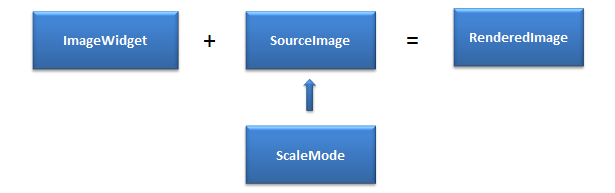
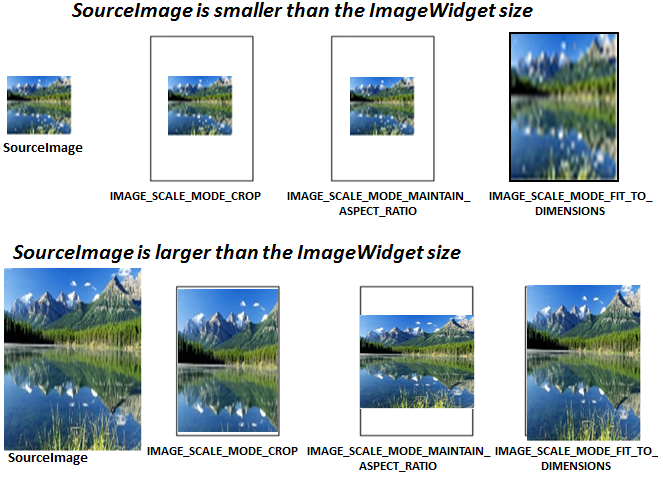
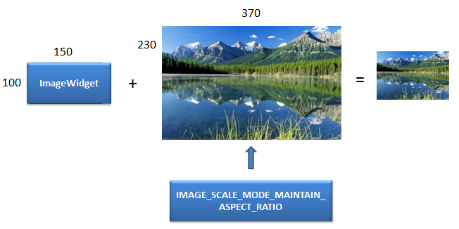
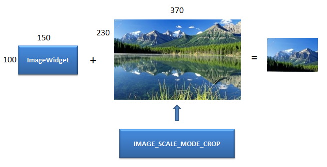
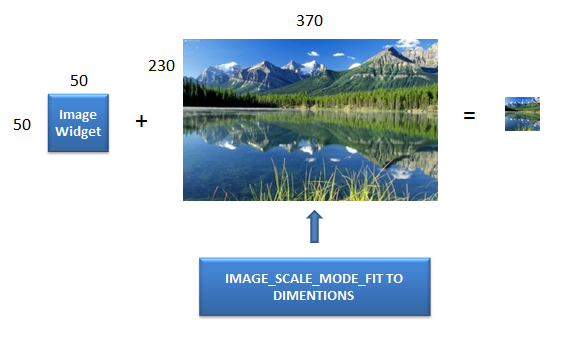

                                  


Image Properties
================

The properties for Image widget are:

* * *


<details close markdown="block"><summary>accessibilityConfig Property</summary>

* * *

Enables you to control accessibility behavior and alternative text for the widget.

For more information on using accessibility features in your app, see the [Accessibility](../../../Iris/app_design_dev/Content/Accessibility_Overview.md) appendix in the Volt MX IrisUser Guide.

### Syntax 

```

accessibilityConfig
```

### Type

Object

### Read/Write

Read + Write

### Remarks

*   The accessibilityConfig property is enabled for all the widgets which are supported under the Flex Layout.

> **_Note:_** From Volt MX Iris V9 SP2 GA version, you can provide i18n keys as values to all the attributes used inside the `accessibilityConfig` property. Values provided in the i18n keys take precedence over values provided in `a11yLabel`, `a11yValue`, and `a11yHint` fields.

The accessibilityConfig property is a JavaScript object which can contain the following key-value pairs.

  
| Key | Type | Description | ARIA Equivalent |
| --- | --- | --- | --- |
| a11yIndex | Integer with no floating or decimal number. | This is an optional parameter. Specifies the order in which the widgets are focused on a screen. | For all widgets, this parameter maps to the `aria-index`, `index`, or `taborder` properties. |
| a11yLabel | String | This is an optional parameter. Specifies alternate text to identify the widget. Generally the label should be the text that is displayed on the screen. | For all widgets, this parameter maps to the `aria-labelledby` property of ARIA in HTML. > **_Note:_** For the Image widget, this parameter maps to the **alt** attribute of ARIA in HTML. |
| a11yValue | String | This is an optional parameter. Specifies the descriptive text that explains the action associated with the widget. On the Android platform, the text specified for a11yValue is prefixed to the a11yHint. | This parameter is similar to the a11yLabel parameter. If the a11yValue is defined, the value of a11yValue is appended to the value of a11yLabel. These values are separated by a space. |
| a11yHint | String | This is an optional parameter. Specifies the descriptive text that explains the action associated with the widget. On the Android platform, the text specified for a11yValue is prefixed to the a11yHint. | For all widgets, this parameter maps to the `aria-describedby` property of ARIA in HTML. |
| a11yHidden | Boolean | This is an optional parameter. Specifies if the widget should be ignored by assistive technology. The default option is set to _false_. This option is supported on iOS 5.0 and above, Android 4.1 and above, and SPA | For all widgets, this parameter maps to the `aria-hidden` property of ARIA in HTML. |
| a11yARIA | Object | This is an optional parameter. For each widget, the key and value provided in this object are added as the attribute and value of the HTML tags respectively. Any values provided for attributes such as `aria-labelledby` and `aria-describedby` using this attribute, takes precedence over values given in `a11yLabel` and `a11yHint` fields. When a widget is provided with the following key value pair or attribute using the a11yARIA object, the tabIndex of the widget is automatically appended as zero.`{"role": "main"}``aria-label` | This parameter is only available on the Desktop Web platform. |

### Android limitations

*   If the results of the concatenation of a11y fields result in an empty string, then `accessibilityConfig` is ignored and the text that is on widget is read out.
*   The soft keypad does not gain accessibility focus during the right/left swipe gesture when the keypad appears.

### SPA/Desktop Web limitations

*   When `accessibilityConfig` property is configured for any widget, the `tabIndex` attribute is added automatically to the `accessibilityConfig` property.
*   The behavior of accessibility depends on the Web browser, Web browser version, Voice Over Assistant, and Voice Over Assistant version.
*   Currently SPA/Desktop web applications support only a few ARIA tags. To achieve more accessibility features, use the attribute a11yARIA. The corresponding tags will be added to the DOM as per these configurations.

### Example 1

This example uses the button widget, but the principle remains the same for all widgets that have an accessibilityConfig property.

```

//This is a generic property that is applicable for various widgets.
//Here, we have shown how to use the accessibilityConfig Property for button widget.
/*You need to make a corresponding use of the accessibilityConfig property for other applicable widgets.*/

Form1.myButton.accessibilityConfig = {
    "a11yLabel": "Label",
    "a11yValue": "Value",
    "a11yHint": "Hint"    
};
```

### Example 2

This example uses the button widget to implement internationalization in `accessibilityConfig` property, but the principle remains the same for all widgets.

```

/*Sample code to implement internationalization in accessibilityConfig property in Native platform.*/

Form1.myButton.accessibilityConfig = {
    "a11yLabel": voltmx.i18n.getLocalizedString("key1")     
};  
/*Sample code to implement internationalization in accessibilityConfig property in Desktop Web platform.*/

Form1.myButton.accessibilityConfig = {
    "a11yLabel": "voltmx.i18n.getLocalizedString(\"key3\")"
};
```

### Platform Availability

*   Available in the IDE
*   iOS, Android, SPA, and Desktop Web

* * *

</details>
<details close markdown="block"><summary>anchorPoint Property</summary>

* * *

Specifies the anchor point of the widget bounds rectangle using the widget's coordinate space.

### Syntax 

```

anchorPoint
```

### Type

JSObject

### Read/Write

Read + Write

### Remarks

The value for this property is a JavaScript dictionary object with the keys "x" and "y". The values for the "x" and "y" keys are floating-point numbers ranging from 0 to 1. All geometric manipulations to the widget occur about the specified point. For example, applying a rotation transform to a widget with the default anchor point causes the widget to rotate around its center.

The default value for this property is center ( {"x":0.5, "y":0.5} ), that represents the center of the widgets bounds rectangle. The behavior is undefined if the values are outside the range zero (0) to one (1).

### Example

```

Form1.widget1.anchorPoint = {
    "x": 0.5,
    "y": 0.5
};
```

### Platform Availability

*   iOS, Android, Windows, and SPA

* * *

</details>
<details close markdown="block"><summary>base64 Property</summary>

* * *

Returns the base64 encoded string of the image raw bytes. If the image source is a URL, and if the image is not downloaded, or if it encounters an error while downloading, _null_ is returned.

### Syntax 

```

base64
```

### Type

JSObject

### Read/Write

Yes - (Read and Write)

### Remarks

You can read rawBytes/base64 from image only when rawBytes/base64 assigned to an Image Widget. It is not possible to read rawBytes/base64 if you assign source from local resource or pass any URL to Image Widget.  
Image Widget allows you to read only given input type. For example, if base64 is set, only base64 can be read, but not other types, such as rawBytes.

> **_Note:_** SPA platform does not support reading base64 from an image src. But it can read base64 from an image which is displayed through base64.

> **_Note:_** This is a **non-Constructor** property. You cannot set this property through widget constructor. But you can read and write data to it.

### Example

```

//Using base64 property in a form frmBase64.
function readb() {
    var br = frmBase64.image.base64;
    frmBase64.labelbase.text = "base " + br;
}

function writeb() {
    frmBase64.image.base64 = "iVBORw0KGgoAAAANSUhEUgAAACMAAAAjCAYAAAAe2bNZAAAAAXNSR0IArs4c6QAAAARnQU1BAACxjwv8YQUAAAAJcEhZcwAADsMAAA7DAcdvqGQAAAI3SURBVFhH7Zg9U8JAEIZTKyryGUgGEEUUEQTHEnsbK34ANjZqjWMpM5baYy09jRU2VlJLT2dD5x848x5euEBCLpIAhcUxDNnbe+7dvb0N0tflFjn1y6S8svghfd+kyV1RWR6Y1/OEI5jKaozU1hPkMbBjOu430/S5U7WpMu/VpO3EM59CmsFd8ikfkoFSEh7t8D652rD3D3AKg2G1C6jwEsoKL24Fik1gQ9PUojBIYjMjyN2PFWcGYYDwNU0lyzC5oYaVSnW/+eYpzMOJalDGSxAGaAYkjdcZGDlJ0L/aImTVNaMIEq8KktXNHLED7URyhohIfOLOIzzjgHy4dBgcO7udePGcV0eHQUHzYjERn6z+6DBOK6vIIqI2rPZQGGS16EQv7HDH0esAHyDzYhFRn7i/dBiQiU70wo4lMVXmH4ZrQ4zKhDKLDZN8MMqZ2oITuBnODmFYezhQxbs3t5O4Hvo92migQNXRpHJ7ESF/iTKp+OJDZXAN4EtdgxKa7KD/FfHXig5rDIXhL6p5tg8UVFPlIjTqvyX8yMgage25qvOsjPUzgOG7diglIu+sNt1USc8VPUw4Tejw2A8A6ytHngL1UqOk5Zs7Q6fHHuAW9yp/uslJRXRlrF6qoNBHNO+eQloda6n5idDYKsMMcP4bWkHqxQszQUGNWsD8XUkYhodqRrLOoJLHpK3kyW0kY/sebxsms/BBqetgmrRiOfKmFkzHk7xHAVhVdfJPhGkCO3Hgpu1SwfwALZUki7xaRB8AAAAASUVORK5CYII=";
}
```

### Platform Availability

*   Not available in the IDE
*   iOS
    
*   Windows
*   Android
*   SPA
*   Desktop Web

* * *

</details>
<details close markdown="block"><summary>blur Property</summary>

* * *

You can enable or disable a blur-effect for a widget(for example, a FlexContainer) by making use of a constructor-level property, called **blur**. The **blur** property accepts a dictionary that contains the following keys: enabled, value and style. You must specify an appropriate value for the dictionary keys, otherwise the property will not be valid.

### Syntax 

```

blur
```

### Input Parameters

*   _enabled_: Accepts a Boolean value that basically decides whether to enable or disable the blur-effect for the widget. This is a mandatory attribute.
*   _value_: Level of the blur-effect that needs to be set for the widget. It should ideally be between 0 to 100. If the level is set as 0 no blur is set, even when the enabled property is set as true. This is a mandatory attribute. Even when the _enabled_ attribute is set as false, you need to specify a numerical value to this attribute.
    
*   _style_: Specifies the style in which the blur property can be applied to a widget. This is an optional parameter specific to iOS. The default value of this parameter is constants.BLUR\_EFFECT\_LIGHT. You can specify any of the following values to this parameter:  
    *   constants.BLUR\_EFFECT\_NONE
    *   constants.BLUR\_EFFECT\_EXTRALIGHT
        
    *   constants.BLUR\_EFFECT\_LIGHT (default)
    *   constants.BLUR\_EFFECT\_DARK
        
    *   constants.BLUR\_EFFECT\_REGULAR
        
    *   constants.BLUR\_EFFECT\_PROMINENT
        

### Read/Write

Read + Write

### Remarks

*   If you set _enabled_ as true, the blur-effect for the widget is enabled.
*   If you set _enabled_ as false, the blur-effect for the widget is disabled.
*   If you specify _value_ as less than 0, the value is taken as 0.
    
*   If you specify _value_ as greater than 100, the value is taken as 100.

### Limitations

*   For Android:
    *   If a FlexContainer or a FlexScrollContainer contains a Map widget, the blur-effect is not applied to the map.
        
    *   If a FlexContainer or a FlexScrollContainer contains a Browser or Video widget, the blur-effect is applied but does not get updated. For example, when the video starts playing, the new rendered frame does not get displayed with the blur-effect.
        
    *   Even if you apply 100% blur for widgets that display any text( such as Label or Calendar widgets), the text on these widgets is not blurred. This is a Native Android limitation. To generate the blur effect for the text, apply a skin with darker background to the Label or Calendar widget. This is true even when the widgets are placed in a FlexContainer with blur effect and the widgets do not have a skin.
    *   Blur effect will not work on widgets added inside BOX containers.

### Example 1

To dynamically set the blur-effect for any widget, such as a FlexContainer, use the following code.

```

//This is a generic property that is applicable for various widgets.
//Here, we have shown how to use the blur property for FlexContainer widget.
/*You need to make a corresponding use of the 
blur property for other applicable widgets.*/

Form1.myFlexContainer.blur = {
    "enabled": true,
    "value": 60
};

```

### Example 2

To dynamically set the blur-effect for any widget, such as a FlexContainer in iOS, use the following code.

```

Form1.widget1.blur = {
    "enabled": true,
    "value": 60,
    "style": constants.BLUR_EFFECT_DARK
};
```

### Platform Availability

*   Android, iOS, Windows, SPA , and Desktop web

 

* * *

</details>
<details close markdown="block"><summary>bottom Property</summary>

* * *

This property determines the bottom edge of the widget and is measured from the bottom bounds of the parent container.

The bottom property determines the position of the bottom edge of the widget’s bounding box. The value may be set using DP (Device Independent Pixels), Percentage, or Pixels. In freeform layout, the distance is measured from the bottom edge of the parent container. In flow-vertical layout, the value is ignored. In flow-horizontal layout, the value is ignored.

The bottom property is used only if the Height property is not provided.

### Syntax 

```

bottom
```

### Type

String

### Read/Write

Read + Write

### Remarks

The property determines the bottom edge of the widget and is measured from the bottom bounds of the parent container.

If the layoutType is set as voltmx.flex.FLOW\_VERTICAL, the bottom property is measured from the top edge of bottom sibling widget. The vertical space between two widgets is measured from bottom of the top sibling widget and the top of the bottom sibling widget.

### Example

```

//Sample code to set the bottom property for widgets by using DP, Percentage and Pixels.
frmHome.widgetID.bottom = "50dp";

frmHome.widgetID.bottom = "10%";

frmHome.widgetID.bottom = "10px";
```

### Platform Availability

*   Available in the IDE
*   iOS, Android, Windows, SPA , and Desktop Web

* * *

</details>
<details close markdown="block"><summary>cacheConfig Property</summary>

* * *

This property is used to configure the cachePolicy and storagePolicy of the cache responses for the request at the app level.

### Syntax 

```

CacheConfig
```

### Type

Dictionary

### Read / Write

Read + Write

### Input Parameters

  
| Parameter | Description |
| --- | --- |
| cacheConfig(JSDictionary) | The cacheConfig is a dictionary which configures the **cachePolicy** and **storagePolicy** of the cache responses. cacheConfig Constants The cache config has the following constantsfor **cachePolicy**: **voltmx.net.cache.USE\_PROTOCOL\_CACHE\_POLICY**: Specifies that the caching logic defined in the protocol implementation, if any, is used for a particular URL load request. This is the default policy for URL load requests. **voltmx.net.cache.RELOAD\_IGNORING\_LOCAL\_CACHE\_DATA**: Specifies that the data for the URL should be loaded from the originating source. No existing cache data should be used to satisfy a URL load request. **voltmx.net.cache.RETURN\_CACHE\_DATA\_ELSE\_LOAD**: Specifies that the existing cached data should be used to satisfy the request, regardless of its age or expiration date. If there is no existing data in the cache corresponding the request, the data is loaded from the originating source. **voltmx.net.cache.RETURN\_CACHE\_DATA\_DONT\_LOAD**: Specifies that the existing cached data should be used to satisfy the request, regardless of its age or expiration date. If there is no existing data in the cache corresponding the request, the data is not loaded from the originating source. The cache config has the following constantsfor **storagePolicy**: **voltmx.net.cache.DISK\_AND\_MEMORY**: The response stored in disk and memory. **voltmx.net.cache.MEMORY\_ONLY**: The response stored in memory only. **voltmx.net.cache.NOT\_ALLOWED**: The response stored neither in the memory nor on the disk.   |

### Example

```
 //Sample code to set the cacheConfig property in the Image widget
frm.imageWidget.cacheConfig = {
  cachePolicy: voltmx.net.cache.RELOAD_IGNORING_LOCAL_CACHE_DATA,
  cacheStoragePolicy: voltmx.net.cache.MEMORY_ONLY
}
```

### Platform Availability

iOS

Available in the IDE

* * *

</details>
<details close markdown="block"><summary>centerX Property</summary>

* * *

This property determines the center of a widget measured from the left bounds of the parent container.

The centerX property determines the horizontal center of the widget’s bounding box. The value may be set using DP (Device Independent Pixels), Percentage, or Pixels. In freeform layout, the distance is measured from the left edge of the parent container. In flow-vertical layout, the distance is measured from the left edge of the parent container. In flow-horizontal layout, the distance is measured from the right edge of the previous sibling widget in the hierarchy.

### Syntax 

```

centerX
```

### Type

String

### Read/Write

Read + Write

### Remarks

If the layoutType is set as voltmx.flex.FLOW\_HORIZONTAL, the centerX property is measured from right edge of the left sibling widget.

### Example

```

//Sample code to set the centerX property for widgets by using DP, Percentage and Pixels.
frmHome.widgetID.centerX = "50dp";

frmHome.widgetID.centerX = "10%";

frmHome.widgetID.centerX = "10px";
```

### Platform Availability

*   Available in the IDE
*   iOS, Android, Windows, SPA, and Desktop Web

* * *

</details>
<details close markdown="block"><summary>centerY Property</summary>

* * *

This property determines the center of a widget measured from the top bounds of the parent container.

The centerY property determines the vertical center of the widget’s bounding box. The value may be set using DP (Device Independent Pixels), Percentage, or Pixels. In freeform layout, the distance is measured from the top edge of the parent container. In flow-horizontal layout, the distance is measured from the top edge of the parent container. In flow-vertical layout, the distance is measured from the bottom edge of the previous sibling widget in the hierarchy.

### Syntax 

```

centerY
```

### Type

String

### Read/Write

Read + Write

### Remarks

If the layoutType is set as voltmx.flex.FLOW\_VERTICAL, the centerY property is measured from bottom edge of the top sibling widget.

### Example

```

//Sample code to set the centerY property for widgets by using DP, Percentage and Pixels.
frmHome.widgetID.centerY = "50dp";

frmHome.widgetID.centerY = "10%";

frmHome.widgetID.centerY = "10px";
```

### Platform Availability

*   Available in the IDE
*   iOS, Android, Windows, SPA, and Desktop Web

* * *

</details>
<details close markdown="block"><summary>clipView Property</summary>

* * *

Defines a shape to clip the widget view.

### Syntax 

```

clipView(shape,bounds,boundsInPixel,radius)
```

### Type

JSObject

### Parameters

**shape**

A key-value pair represents a shape of the clipping. You can clip a view as follows:

_VIEW\_CLIP\_SHAPE\_RECTANGLE_: The widget view is rectangle. By default, the value is set.

_VIEW\_CLIP\_SHAPE\_ROUNDED\_RECTANGLE_: The widget view is rectangle with rounded corners.

_VIEW\_CLIP\_SHAPE\_CIRCLE_: The widget view is circular.

**bounds**

A key-value pair represents the bounds of the shape to clip a view. Specify the bounds as an array of integers \[left, top, right, bottom\].

**boundsInPixel**

Defines whether the units of specified bounds should be in pixels or in percentage. The property takes the Boolean value.

_true_: Indicates the specified bounds should be in pixels.

_false_: Indicates the specified bounds should be in percentage.

**radius**

Specifies the radius of the clipping shape. Represents the corner radius of the rounded rectangular shape when the clipping shape is VIEW\_CLIP\_SHAPE\_ROUNDED\_RECTANGLE or represents the radius of a circle when the clipping shape is VIEW\_CLIP\_SHAPE\_CIRCLE.

### Read/Write

Read + Write

### Remarks

The property enables you to change the shape of a FlexContainer view. Without view clipping, all views are displayed in a regular rectangular shape. With the property, you can change the view shape to circular or rounded rectangle, irrespective of the shape of the background. Supported shapes to clipping a view are rectangle, rounded rectangle, and circle.

The clipView property is applicable only for the widgets added in the Flex Forms.

### Example

```

//Sample code to set the clipView property in an Image widget.  
  
myForm.myImage.clipView = {
    shape: constants.VIEW_CLIP_SHAPE_CIRCLE,
    bounds: [5, 5, 5, 5],
    radius: 10
};
```

### Platform Availability

*   Not available in the IDE
*   iOS
    
*   SPA
*   Windows
*   Android

* * *

</details>
<details close markdown="block"><summary>containerWeight Property</summary>

* * *

Specifies percentage of weight to be allocated by its parent widget. The parent widget space is distributed to its child widgets based on this weight factor. All its child widgets should sum up to 100% of weight except when placed in **voltmx.ui.ScrollBox**.

### Syntax 

```

containerWeight
```

### Type

Number

### Read / Write

Read and Write

### Remarks

This property specifies the maximum width of the Image widget and the actual image content fit in this boundary based on the scale modes.

> **_Note:_** If you want to restrict the width of the image, then choose the appropriate container weight. It becomes developer responsibility to serve the right kind of images for device screen form factors.

### Example

```

//Sample code to set the containerWeight property of an Image widget.  
  
myForm.myImage.containerWeight= 50;
```

### Accessible from IDE

No

### Platform Availability

Available on all platforms

* * *

</details>
<details close markdown="block"><summary>cursorType Property</summary>

* * *

In Desktop Web applications, when you hover the mouse over any widget, a mouse pointer appears. Using the cursorType property in Iris, you can specify the type of the mouse pointer.

### Syntax 

```

cursorType
```

### Type

String.

You must provide valid CSS cursor value such as wait, grab, help, etc. to the cursorType property.

### Read/Write

Read + Write

### Remarks

To add the `cursorType` property using Volt MX Iris in a Desktop Web application, follow these steps.

1.  In Volt MX Iris, open the Desktop Web application. From the **Project** explorer, expand **Responsive Web/ Desktop**\> **Forms** and select the form to which you need to make the changes.
2.  On the canvas, select the widget for which you want to specify the cursor type. For example, button.
3.  From the **Properties** panel, navigate to the **Skin** tab > **Hover Skin** tab.  
    You will find that the details of the hover skin is not enabled here.
4.  Check the **Enable** option to add a hover skin to your widget.  
    The details and configurations of the hover skin is enabled.
5.  Under the **General** section, for the Platform option, click the ellipsis icon.  
    The **Fork Skin** window appears.
6.  In the **Fork Skin** window, for **Desktop**, check under **HTML5 SPA**.
7.  Click **Ok**. You have successfully forked your hover skin for Desktop Web application.  
    You can see that the **Cursor Type** property has been added under the **General** section.
8.  Select a value from the drop-down list to set the **Cursor Type** for the widget.

### Example

```
 
//This is a generic property and is applicable for many widgets.  
  
/*The example provided is for the Button widget. Make the required changes in the example while using other widgets.*/
  
frmButton.myButton.cursorType = "wait";

```

### Platform Availability

*   Available in IDE
*   Desktop Web

* * *

</details>
<details close markdown="block"><summary>enable Property</summary>

* * *

The `enable` property is used to control the actionability of the widgets. In a scenario where you want to display a widget but not invoke any action on the widget, configure the `enable` property to false to achieve it.

This is a constructor level property and applicable for all widgets in Volt MX Iris.

### Syntax 

```

enable
```

### Type

Boolean

### Read/Write

Read + Write

### Remarks

The default value of this property is true.

When `enable` property is configured to true, the action associated with a widget can be invoked by the user in the application.

When `enable` property is configured to false, the action associated with a widget cannot be invoked by the user in the application.

### Example

```
//This is a generic property and is applicable for many widgets.  
  
/*The example provided is for the Button widget. Make the changes required in the example while using other widgets.*/
  
frmButton.myBtn.enable= true;
```

### Platform Availability

*   Android, iOS, Windows, SPA, and Desktop web

 

* * *

</details>
<details close markdown="block"><summary>enableCache Property</summary>

* * *

The property enables you to improve the performance of Positional Dimension Animations.

### Syntax 

```

enableCache
```

### Type

Boolean

### Read/Write

Read + Write

### Remarks

The default value for this property is true.

> **_Note:_** When the property is used, application consumes more memory. The usage of the property enables tradeoff between performance and visual quality of the content. Use the property cautiously.

### Example

```

Form1.widgetID.enableCache = true;
```

### Platform Availability

*   Available in the IDE.
*   Windows

* * *

</details>
<details close markdown="block"><summary>glossyEffect Property</summary>

* * *

Specifies a glossy effect on an image.

### Syntax 

```

glossyEffect
```

### Type

Number

### Read/Write

No

### Remarks

The default value for this property is IMAGE\_GLOSSY\_EFFECT\_DEFAULT.

You can choose one of following glossy effects:

*   IMAGE\_GLOSSY\_EFFECT\_DEFAULT
*   IMAGE\_GLOSSY\_EFFECT\_LINEAR
*   IMAGE\_GLOSSY\_EFFECT\_RADIAL

### Example

```

//Sample code to set the glossyEffect property of an Image widget.  
  
myForm.myImage.glossyEffect=constants.IMAGE_GLOSSY_EFFECT_RADIAL;
```

### Platform Availability

*   iOS

* * *

</details>
<details close markdown="block"><summary>height Property</summary>

* * *

It determines the height of the widget and measured along the y-axis.

The height property determines the height of the widget’s bounding box. The value may be set using DP (Device Independent Pixels), Percentage, or Pixels. For supported widgets, the height may be derived from either the widget or container’s contents by setting the height to “preferred”.

### Syntax 

```

height
```

### Type

Number, String, and Constant

### Read/Write

Read + Write

### Remarks

Following are the available measurement options:

*   %: Specifies the values in percentage relative to the parent dimensions.
*   px: Specifies the values in terms of device hardware pixels.
*   dp: Specifies the values in terms of device independent pixels.
*   default: Specifies the default value of the widget.
*   voltmx.flex.USE\_PREFERED\_SIZE: When this option is specified, the layout uses preferred height of the widget as height and preferred size of the widget is determined by the widget and may varies between platforms.

### Example

```

/*Sample code to set the height property for an Image widget by using DP, Percentage and Pixels.*/
frmImage.myImage.height="50dp";

frmImage.myImage.height="10%";

frmImage.myImage.height="10px";

```

### Platform Availability

*   Available in the IDE
*   iOS
*   Android
*   Windows
*   SPA

* * *

</details>
<details close markdown="block"><summary>hoverSkin Property</summary>

* * *

Specifies the look and feel of a widget when the cursor hovers on the widget.

> **_Note:_** This is a deprecated property.

### Syntax 

```

hoverSkin
```

### Type

String

### Read/Write

Yes - (Read and Write)

### Example

```

//Sample code to set the hoverSkin property for an Image widget.
frmImage.myImage.hoverSkin="ImgHoverSkin";
```

### Platform Availability

None

* * *

</details>
<details close markdown="block"><summary>id Property</summary>

* * *

id is a unique identifier of Image consisting of alpha numeric characters. Every Image should have a unique id within a Form.

### Syntax 

```

id
```

### Type

String - \[Mandatory\]

### Read/Write

Yes - (Read only)

### Example

```

//Defining properties for an Image with the ID :"imageIdTest".
var basicConfImage = {
    id: "imageIdTest",
    isVisible: true,
    src: "http://www.fordesigner.com/imguploads/Image/cjbc/zcool/png20080525/1211728825.png"
};
var layoutConfImage = {
    containerWeight: 100
};
//Creating the Image
var imageIdTest = new voltmx.ui.Image2(basicConfImage, layoutConfImage, {});
//Reading the id of the Image
voltmx.print("Image id is ::" + imageIdTest.id);
```

### Platform Availability

*   iOS
*   Android
*   SPA
*   Windows

* * *

</details>
<details close markdown="block"><summary>imageScaleMode Property</summary>

* * *

This property specifies how the rendered image's width and height are identified when those of the source image varies from the Image widget itself. Image Widget represents the underlying native widget which renders (and applies alignment to) the Source Image.

### Syntax 

```

imageScaleMode
```

### Type

Number

### Read / Write

Yes - (Read and Write)

### Remarks

Default: IMAGE\_SCALE\_MODE\_MAINTAIN\_ASPECT\_RATIO

> **_Note:_** When this property is modified from the code, the scale mode changes will be reflected when a new source image is rendered.

Aspect Ratio defined:

The image aspect ratio is the width (x) of the image compared to its height (y). A square image has a ratio of 1:1, but a non-square (rectangular) image does not have the same height and width. It is commonly expressed as two numbers separated by a colon, as in 16:9.

How the size of the image rendered on the screen is identified?



Before rendering the Image first the width and height of the Image widget is calculated. The width and height are driven by the container weight that has been specified or referenceWidth and referenceHeight whichever are applicable. Now the Source Image is scaled or cropped as per the ImageScale modes set in the property.

> **_Note:_** For dynamic images (loaded from a remote server), specifying a referenceWidth / referenceHeight avoids unnecessary screen re-layouts.

> **_Note:_** The ImageWidget is aligned as per the widget alignment rules.



These are the available options:

**IMAGE\_SCALE\_MODE\_MAINTAIN\_ASPECT\_RATIO**: This mode resizes the source image to fit in the ImageWidget dimensions while it preserves its native aspect ratio.

*   If the source image size is less than the ImageWidget size then source image is rendered as is. The ImageWidget is aligned as per the widget alignment rules.
*   If the source image is size is greater than the ImageWidget size then the source image is resized to the ImageWidget dimensions while maintaining the aspect ratio.

Image Widget size is calculated as follows:

*   Width is based on containerWeight in case of percentage box and in case of non percentage box , the width is derived from referenceWidth or the original source image width.
*   Height is derived from reference height specified, if reference height is specified. If not the actual Image height is taken.
*   referenceWidth and referenceHeight are not mandatory for this scalemode.



**IMAGE\_SCALE\_MODE\_CROP**: This scale mode preserves the original size of the Source Image.

*   If the source image size is less than the ImageWidget size then source image is rendered as is.
*   If the source image is size is greater than the ImageWidget size then the source image is cropped or clipped to fit the ImageWidget.

Image Widget size is calculated for this mode as follows:

*   Width is based on containerWeight in case of percentage box and in case of non-percentage box , the width is derived from referenceWidth.
*   Height is derived from referenceHeight, if referenceHeight is specified. If not the actual Image height is taken

> **_Note:_** referenceWidth and referenceHeight are not mandatory for this scalemode. This mode is not supported on Desktop Web, and SPA platforms. They will render the sourceImage as its actual size.



**IMAGE\_SCALE\_MODE\_FIT\_TO\_DIMENSIONS**: The source image is resized to fill the ImageWidget dimensions. The aspect ratio is not preserved.

*   If the source image size is less than the ImageWidget size then source image is stretched to the ImageWidget dimensions (height and width).
*   If the source image is size is greater than the ImageWidget size then the source image is squeezed to fill the ImageWidget dimensions (height and width).

Image Widget size is calculated for this mode as follows:

*   Width is the minimum of containerWeight and referenceWidth in case of percentage box and in case of non-percentage box , the width is derived from referenceWidth.
*   Height is derived from reference height specified.

> **_Note:_** referenceWidth and referenceHeight are mandatory for this scalemode. Not specifying the referenceWidth / referenceHeight will lead to undefined behaviour.

> **_Note:_** If the reference image is bigger than container weight, Mobile Web and SPA platforms may not be able to adhere to the container weight but will spill over.



### Example

```
 
//Sample code to set the imageScaleMode property for an Image widget.  
  
frmImage.myImage.imageScaleMode=constants.IMAGE_SCALE_MODE_FIT_TO_DIMENSIONS;
```

### Platform Availability

*   Accessible from IDE
*   iOS
*   Android
*   Windows
*   SPA (For FITTODIMENSIONS and MAINTAINASPECTRATIO. If you set to CROP on SPA, MAINTAINASPECTRATIO is considered)
*   Desktop Web (For FITTODIMENSIONS and MAINTAINASPECTRATIO. If you set to CROP on Desktop Web, MAINTAINASPECTRATIO is considered)

* * *

</details>
<details close markdown="block"><summary>imageWhenFailed Property</summary>

* * *

Specifies the image to be displayed when the remote resource is not available. This image is taken from the resources folder.

### Syntax 

```

imageWhenFailed
```

### Type

String / Image Object

### Read/Write

Read + Write (for iOS and Android platforms)

This property is a constructor-level property for SPA and Desktop Web platforms.

### Remarks

The image can be either a bitmap or a vector graphics file.

Image files can be of GIF, animated GIF, JPG, PNG, and WebP formats.

Vector graphics are supported for the following formats on the following platforms:

*   Android supports .xml files
*   iOS supports .pdf files
*   SPA supports .svg files
*   Windows (Creators Edition) supports .svg files.

### Example

Using a string to identify a local resource:

```

//Sample code to set the imageWhenFailed property of an Image widget to a local resource.   
//Here, rn_icon1.png is present inside the resources folder of your application.  
  
frmImage.myImage.imageWhenFailed="rn_icon1.png";  

```

You can create an image Object by using voltmx.image Namespace functions. Use an image Object (voltmx.image) to identify the image as follows:

```

//Sample code to set the imageWhenFailed property of an Image widget to an Image Object.   
var imgObjRef = voltmx.image.createImage("local.png");  
frmImage.myImage.imageWhenFailed=imgObjRef;  

```

### Platform Availability

*   Accessible from IDE
*   iOS, Android, Windows, SPA, and Desktop Web

* * *

</details>
<details close markdown="block"><summary>imageWhileDownloading Property</summary>

* * *

Specifies the image to be displayed when the remote source is still being downloaded.

### Syntax 

```

imageWhileDownloading
```

### Type

String / image Object

### Read/Write

Read + Write (for iOS and Android platforms)

This property is a constructor-level property for SPA and Desktop Web platforms.

### Remarks

You can create an image Object by using voltmx.image Namespace functions.

The image can be either a bitmap or a vector graphics file.

Image files can be of GIF, animated GIF, JPG, PNG, and WebP formats.

Vector graphics are also supported for the following formats on the following platforms:

*   Android supports .xml files
*   iOS supports .pdf files
*   SPA supports .svg files
*   Windows (Creators Edition) supports .svg files.

### Example

Using a string to identify a local resource:

```

//Sample code to set the imageWhileDownloading property of an Image widget to a local resource.   
//Here, voltmxnew.png is present inside the resources folder of your application.  
  
frmImage.myImage.imageWhileDownloading="new.png";  

```

Using an image object (voltmx.image) to identify the image:

```

//Sample code to set the imageWhileDownloading property of an Image widget to an Image Object.   
var imgObjRef = voltmx.image.createImage("local.png");  
frmImage.myImage.imageWhileDownloading=imgObjRef;  

```

### Platform Availability

*   Accessible from IDE
*   iOS
*   Android
*   Windows
*   SPA
    
*   Desktop Web

* * *

</details>
<details close markdown="block"><summary>info Property</summary>

* * *

A custom JSObject with the key value pairs that a developer can use to store the context with the widget. This will help in avoiding the globals to most part of the programming.

### Syntax 

```

info
```

### Type

JSObject

### Read/Write

Yes - (Read and Write)

### Remarks

> **_Note:_** This is a **non-Constructor** property. You cannot set this property through widget constructor. But you can read and write data to it.

Info property can hold any JSObject. After assigning the JSObject to info property, the JSObject should not be modified. For example,

```

var inf = {
    a: "hello"
};
widget.info = inf; //works
widget.info.a = "hello world";
//This will not update the widget info a property to hello world. 
//widget.info.a will have old value as hello.
```

### Example

```

//Sample code to set info property for an Image widget.

frmImage.myImage.info = {
    key: "Imagenumber"
};

//Reading the info of the Image widget.
voltmx.print("Image widget info:" +frmImage.myImage.info);
```

### Platform Availability

*   Accessible from IDE
*   iOS
*   Android
*   Windows
*   SPA
    
*   Desktop Web

* * *

</details>
<details close markdown="block"><summary>isVisible Property</summary>

* * *

This property controls the visibility of a widget on the Form.

### Syntax 

```

isVisible
```

### Type

Boolean

### Read/Write

Yes - (Read and Write)

### Remarks

The default value for this property is true. If set to _false,_ the widget is not displayed. If set to _true,_ the widget is displayed.

> **_Note:_** This property is not applicable if the widget is placed in a [Segment](Segment.md). When the widget is placed in a Segment, the visibility of the widget is controlled by the [data](Segment_Properties.md#data) property of the segment.

> **_Note:_** In addition, the visibility of the widget can be controlled using the setVisibility method.

### Example

```

//Sample code to set the isVisible property of an Image widget.  
  
frmImage.myImage.isVisible=true;
```

### Platform Availability

*   Accessible from IDE
*   iOS
*   Android
*   Windows
*   SPA
    
*   Desktop Web

* * *

</details>
<details close markdown="block"><summary>left Property</summary>

* * *

This property determines the lower left corner edge of the widget and is measured from the left bounds of the parent container.

The left property determines the position of the left edge of the widget’s bounding box. The value may be set using DP (Device Independent Pixels), Percentage, or Pixels. In freeform layout, the distance is measured from the left edge of the parent container. In flow-vertical layout, the distance is measured from the left edge of the parent container. In flow-horizontal layout, the distance is measured from the right edge of the previous sibling widget in the hierarchy.

### Syntax 

```

left
```

### Type

String

### Read/Write

Read + Write

### Remarks

If the layoutType is set as voltmx.flex.FLOW\_HORIZONTAL, the left property is measured from right edge of the left sibling widget.

### Example

```

//Sample code to set the left property for widgets by using DP, Percentage and Pixels.
frmHome.widgetID.left = "50dp";

frmHome.widgetID.left = "10%";

frmHome.widgetID.left = "10px";
```

### Platform Availability

*   Available in the IDE
*   iOS, Android, Windows, SPA, and Desktop Web

* * *

</details>
<details close markdown="block"><summary>maxHeight Property</summary>

* * *

This property specifies the maximum height of the widget and is applicable only when the height property is not specified.

The maxHeight property determines the maximum height of the widget’s bounding box. The value may be set using DP (Device Independent Pixels), Percentage, or Pixels. The maxHeight value overrides the preferred, or “autogrow” height, if the maxHeight is less than the derived content height of the widget.

### Syntax 

```

maxHeight
```

### Type

Number

### Read/Write

Read + Write

### Example

```

//Sample code to set the maxHeight property for widgets by using DP, Percentage and Pixels.
frmHome.widgetID.maxHeight = "50dp";

frmHome.widgetID.maxHeight = "10%";

frmHome.widgetID.maxHeight = "10px";
```

### Platform Availability

*   Available in the IDE
*   iOS, Android, Windows, SPA, and Desktop Web

* * *

</details>
<details close markdown="block"><summary>maxWidth Property</summary>

* * *

This property specifies the maximum width of the widget and is applicable only when the width property is not specified.

The Width property determines the maximum width of the widget’s bounding box. The value may be set using DP (Device Independent Pixels), Percentage, or Pixels. The maxWidth value overrides the preferred, or “autogrow” width, if the maxWidth is less than the derived content width of the widget.

### Syntax 

```

maxWidth
```

### Type

Number

### Read/Write

Read + Write

### Example

```

//Sample code to set the maxWidth property for widgets by using DP, Percentage and Pixels.
frmHome.widgetID.maxWidth = "50dp";

frmHome.widgetID.maxWidth = "10%";

frmHome.widgetID.maxWidth = "10px";
```

### Platform Availability

*   Available in the IDE
*   iOS, Android, Windows, SPA, and Desktop Web

* * *

</details>
<details close markdown="block"><summary>minHeight Property</summary>

* * *

This property specifies the minimum height of the widget and is applicable only when the height property is not specified.

The minHeight property determines the minimum height of the widget’s bounding box. The value may be set using DP (Device Independent Pixels), Percentage, or Pixels. The minHeight value overrides the preferred, or “autogrow” height, if the minHeight is larger than the derived content height of the widget.

### Syntax 

```

minHeight
```

### Type

Number

### Read/Write

Read + Write

### Example

```

//Sample code to set the minHeight property for widgets by using DP, Percentage and Pixels.
frmHome.widgetID.minHeight = "50dp";

frmHome.widgetID.minHeight = "10%";

frmHome.widgetID.minHeight = "10px";
```

### Platform Availability

*   Available in the IDE
*   iOS, Android, Windows, SPA, and Desktop Web

* * *

</details>
<details close markdown="block"><summary>minWidth Property</summary>

* * *

This property specifies the minimum width of the widget and is applicable only when the width property is not specified.

The minWidth property determines the minimum width of the widget’s bounding box. The value may be set using DP (Device Independent Pixels), Percentage, or Pixels. The minWidth value overrides the preferred, or “autogrow” width, if the minWidth is larger than the derived content width of the widget.

### Syntax 

```

minWidth
```

### Type

Number

### Read/Write

Read only

### Example

```

//Sample code to set the minWidth property for widgets by using DP, Percentage and Pixels.
frmHome.widgetID.minWidth = "50dp";

frmHome.widgetID.minWidth = "10%";

frmHome.widgetID.minWidth = "10px";
```

### Platform Availability

*   Available in the IDE
*   iOS, Android, Windows, SPA, and Desktop Web

* * *

</details>
<details close markdown="block"><summary>opacity Property</summary>

* * *

Specifies the opacity of the widget. The value of this property must be in the range 0.0 (transparent) to 1.0 (opaque). Any values outside this range are fixed to the nearest minimum or maximum value.

Specifies the opacity of the widget. Valid opacity values range from 0.0 (transparent), to 1.0 (opaque). Values set to less than zero will default to zero. Values more than 1.0 will default to 1. Interaction events set on a transparent widget will still be fired. To disable the events, also set the “isVisible” property to “false”.

### Syntax 

```

opacity
```

### Type

Number

### Read/Write

Read + Write

### Remarks

> **_Note:_** This property has more priority compared to the values coming from the configured skin.

### Example

```

//Sample code to make the widget transparent by using the opacity property.
frmHome.widgetID.opacity = 0;

//Sample code to make the widget opaque by using the opacity property.
frmHome.widgetID.opacity = 1;
```

### Platform Availability

*   Not available in the IDE.
*   iOS, Android, Windows, SPA, and Desktop Web

* * *

</details>
<details close markdown="block"><summary>padding Property</summary>

* * *

This property defines the space between the content of the widget and the widget boundaries. You can use this option to define the top, left, right, and bottom distance between the widget content and the widget boundary.

When you are defining the padding (for any platform) the _first_ time, the value that you enter in the padding field (top, left, right, or bottom) is auto-populated across all the platforms.

  
The following image illustrates a widget with a defined padding:


### Syntax 

```

padding
```

### Type

Array of numbers

### Read / Write

Read+Write

### Limitations

*   Desktop Web/ SPA platforms do not support _padding_ property in Image widget, Slider widget and Switch widget.
*   If no skin is applied to a Button, then Padding is not supported on iPhone. This is due to iOS Safari browser limitation. If you want the padding to be applied, apply a skin to the button and then apply padding

### Example

```

//Sample code to set the padding property for widgetID Button widget in frmHome Form.
frmHome.widgetID.padding= [2,2,2,2];
```

### Platform Availability

*   Available in IDE
*   Android, iOS, Desktop Web and SPA

* * *

</details>
<details close markdown="block"><summary>paddingInPixel Property</summary>

* * *

This property specifies whether the padding property is to be applied in pixels or in percentage.

### Syntax 

```

paddingInPixel
```

### Type

Boolean

### Read/Write

Read Only

### Remarks

The default value of this property is _false_.

If the value of this property is _true,_ the padding are applied in pixels.

If the value of this property is _false,_ the padding are applied as set in [padding](#padding) property.

### Limitations

Desktop Web/ SPA platforms do not support _paddingInPixel_ property in Image widget, Slider widget and Switch widget.

### Example

```

//Sample code to read paddingInPixel property for widgetID Button widget in frmHome form.

voltmx.print("PaddingInPixel property value is:"+fromHome.widgetID.paddingInPixel);
```

### Platform Availability

*   iOS, Android, Desktop Web and SPA.

* * *

</details>
<details close markdown="block"><summary>padding Property</summary>

* * *

Defines the space between the content of the widget and the widget boundaries. You can use this option to define the top, left, right, and bottom distance between the widget content and the widget boundary.

### Syntax 

```

padding
```

### Type

Array of Numbers

### Read / Write

Yes - (Read and Write)

### Remarks

To define the padding values for a platform, click the () button against the property to open the _Padding_ screen. Select the checkbox against the platform for which you want to define the padding's and enter the top, left, right, and bottom padding values.

If you want to use the padding values set for a platform across other platforms, you can click the _Apply To_ button and select the platforms on which you want the padding values to be applied.

> **_Note:_** Due to Browser restrictions, you cannot apply Padding for a [ComboBox](ComboBox.md), [Form](Form.md) and [ListBox](ListBox.md) widgets on Mobile Web platform.

> **_Note:_** If no skin is applied to a Button, then Padding is not supported on iPhone. This is due to iOS Safari browser limitation. If you want the padding to be applied, apply a skin to the button and then apply padding.

The following image illustrates the window to define the padding's for platforms:

  
  
The following image illustrates a widget with a defined padding:


### Example

```

//Sample code to set the padding property of an Image widget.  
  
frmImage.myImage.padding=[10, 10, 10, 10];
```

### Platform Availability

*   Accessible from IDE
*   iOS
*   Android
*   Windows
*   SPA
    
*   Desktop Web

* * *

</details>
<details close markdown="block"><summary>parent Property</summary>

* * *

Helps you access the parent of the widget. If the widget is not part of the widget hierarchy, the parent property returns null.

### Syntax 

```

parent
```

### Read/Write

Read only

### Remarks

> **_Note:_** The property works for all the widgets inside a FlexForm, FlexContainer or FlexScrollContainer.

### Example

```

function func() {

    voltmx.print("The parent of the widget" + JSON.stringify(Form1.widgetID.parent));

}
```

### Platform Availability

*   Not available in the IDE
*   iOS, Android, Windows, SPA, and Desktop Web

* * *

</details>
<details close markdown="block"><summary>rawBytes Property</summary>

* * *

Represents the images raw bytes.

### Syntax 

```

rawBytes
```

### Type

JSObject representing the raw bytes of the image, or an image object (voltmx.image).

### Read/Write

Yes - (Read and Write)

### Remarks

> **_Note:_** This is a **non-Constructor** property. You cannot set this property through widget constructor. But you can read and write data to it.

### Example

Using a JavaScript object containing raw bytes as returned from the camera.

```

//Sample code to set the rawBytes property as "11111" for an Image widget.   
//Here, the rawBytes:"11111" is an image captured by using a Camera widget.  
  
frmImage.myImage.rawBytes="11111";
```

Using an image object (voltmx.image).

```

//Sample code to set the rawBytes property using an Image Object.  
  
var imgObjRef = voltmx.image.createImage("local.png");

frmImage.myImage.rawBytes = imgObjRef.getImageAsRawBytes(voltmx.image.ENCODE_JPEG);
```

### Platform Availability

*   Accessible from IDE
*   iOS
*   Android
*   Windows
*   SPA
    
*   Desktop Web

* * *

</details>
<details close markdown="block"><summary>referenceHeight Property</summary>

* * *

The reference image height in pixels.

### Syntax 

```

referenceHeight
```

### Type

Number

### Read / Write

Yes - (Read and Write)

### Example

```

//Sample code to set the referenceHeight property of an Image widget.  
  
frmImage.myImage.referenceHeight=100;
```

### Platform Availability

*   Accessible from IDE
*   iOS
*   Android
*   Windows
*   SPA
    
*   Desktop Web

* * *

</details>
<details close markdown="block"><summary>referenceWidth Property</summary>

* * *

The reference image width in pixels.

### Syntax 

```

referenceWidth
```

### Type

Number

### Read / Write

Yes - (Read and Write)

### Remarks

The source image width is resized to fill the widget dimensions. The image aspect ratio is not preserved. The referenceWidth is respected only when the [imageScaleMode](#imageScaleMode) property is set to **IMAGE\_SCALE\_MODE\_FIT\_TO\_DIMENSIONS**. The pixels are device independent pixels specified against 163 dpi.

For example, HzImage widget dimensions are 200 x 100 (height and width respectively ) and your image is 300 x 200 px, then you have to specify referenceHeight as 200 and referenceWidth as 100. The image is resized to fit in the widget by reducing the height and width.

### Example

```

//Sample code to set the referenceWidth property of an Image widget.  
  
frmImage.myImage.referenceWidth=100;
```

### Platform Availability

*   Accessible from IDE
*   iOS
*   Android
*   Windows
*   SPA
    
*   Desktop Web

* * *

</details>
<details close markdown="block"><summary>renderAsAnchor Property</summary>

* * *

Most of the Mobile Web browsers do not offer a very good user experience when the entire segment is made clickable. To offer an acceptable user experience, one of the image in a segment is made clickable and the _onClick_ event for the segment is bound to a image.

> **_Note:_** This is a deprecated property.

### Syntax 

```

renderAsAnchor
```

### Type

Boolean

### Read/Write

No

### Remarks

This property is typically set to true when the segment _onClick_ is bound to an image.

> **_Note:_** This property is available only when the Image Widget is placed in a Segment.

The default value for this property is false. If set to _true,_ the Image is the first clickable element in the Segment. If set to _false,_ the Image is not the first clickable element in the Segment.

### Example

```

//Sample code to set the renderAsAnchor property of an Image widget.  
  
frmImage.myImage.renderAsAnchor=true;
```

### Platform Availability

None

* * *

</details>
<details close markdown="block"><summary>retainContentAlignment Property</summary>

* * *

This property is used to retain the content alignment property value, as it was defined.

> **_Note:_** Locale-level configurations take priority when invalid values are given to this property, or if it is not defined.

The mirroring widget layout properties should be defined as follows.

```

    function getIsFlexPositionalShouldMirror(widgetRetainFlexPositionPropertiesValue) {
    return (isI18nLayoutConfigEnabled &&
    localeLayoutConfig[defaultLocale]
    ["mirrorFlexPositionalProperties"] == true &&
    !widgetRetainFlexPositionPropertiesValue);
}
```

The following table illustrates how widgets consider Local flag and Widget flag values.

  
| Properties | Local Flag Value | Widget Flag Value | Action |
| --- | --- | --- | --- |
| Mirror/retain FlexPositionProperties | true | true | Use the designed layout from widget for all locales. Widget layout overrides everything else. |
| Mirror/retain FlexPositionProperties | true | false | Use Mirror FlexPositionProperties since locale-level Mirror is true. |
| Mirror/retain FlexPositionProperties | true | not specified | Use Mirror FlexPositionProperties since locale-level Mirror is true. |
| Mirror/retain FlexPositionProperties | false | true | Use the designed layout from widget for all locales. Widget layout overrides everything else. |
| Mirror/retain FlexPositionProperties | false | false | Use the Design/Model-specific default layout. |
| Mirror/retain FlexPositionProperties | false | not specified | Use the Design/Model-specific default layout. |
| Mirror/retain FlexPositionProperties | not specified | true | Use the designed layout from widget for all locales. Widget layout overrides everything else. |
| Mirror/retain FlexPositionProperties | not specified | false | Use the Design/Model-specific default layout. |
| Mirror/retain FlexPositionProperties | not specified | not specified | Use the Design/Model-specific default layout. |

### Syntax 

```

retainContentAlignment
```

### Type

Boolean

### Read/Write

No (only during widget-construction time)

### Example

```

//This is a generic property that is applicable for various widgets.
//Here, we have shown how to use the retainContentAlignment property for Button widget.
/*You need to make a corresponding use of the 
retainContentAlignment property for other applicable widgets.*/
var btn = new voltmx.ui.Button({
    "focusSkin": "defBtnFocus",
    "height": "50dp",
    "id": "myButton",
    "isVisible": true,
    "left": "0dp",
    "skin": "defBtnNormal",
    "text": "text always from top left",
    "top": "0dp",
    "width": "260dp",
    "zIndex": 1
}, {
    "contentAlignment": constants.CONTENT_ALIGN_TOP_LEFT,
    "displayText": true,
    "padding": [0, 0, 0, 0],
    "paddingInPixel": false,
    "retainFlexPositionProperties": false,
    "retainContentAlignment": true
}, {});
```

### Platform Availability

*   Available in IDE
*   Windows, iOS, Android, and SPA

* * *

</details>
<details close markdown="block"><summary>retainFlexPositionProperties Property</summary>

* * *

This property is used to retain flex positional property values as they were defined. The flex positional properties are left, right, and padding.

> **_Note:_** Locale-level configurations take priority when invalid values are given to this property, or if it is not defined.

The mirroring widget layout properties should be defined as follows.

```

    function getIsFlexPositionalShouldMirror(widgetRetainFlexPositionPropertiesValue) {
    return (isI18nLayoutConfigEnabled &&
    localeLayoutConfig[defaultLocale]
    ["mirrorFlexPositionalProperties"] == true &&
    !widgetRetainFlexPositionPropertiesValue);
}
```

The following table illustrates how widgets consider Local flag and Widget flag values.

  
| Properties | Local Flag Value | Widget Flag Value | Action |
| --- | --- | --- | --- |
| Mirror/retain FlexPositionProperties | true | true | Use the designed layout from widget for all locales. Widget layout overrides everything else. |
| Mirror/retain FlexPositionProperties | true | false | Use Mirror FlexPositionProperties since locale-level Mirror is true. |
| Mirror/retain FlexPositionProperties | true | not specified | Use Mirror FlexPositionProperties since locale-level Mirror is true. |
| Mirror/retain FlexPositionProperties | false | true | Use the designed layout from widget for all locales. Widget layout overrides everything else. |
| Mirror/retain FlexPositionProperties | false | false | Use the Design/Model-specific default layout. |
| Mirror/retain FlexPositionProperties | false | not specified | Use the Design/Model-specific default layout. |
| Mirror/retain FlexPositionProperties | not specified | true | Use the designed layout from widget for all locales. Widget layout overrides everything else. |
| Mirror/retain FlexPositionProperties | not specified | false | Use the Design/Model-specific default layout. |
| Mirror/retain FlexPositionProperties | not specified | not specified | Use the Design/Model-specific default layout. |

### Syntax 

```

retainFlexPositionProperties
```

### Type

Boolean

### Read/Write

No (only during widget-construction time)

### Example

```

//This is a generic property that is applicable for various widgets.
//Here, we have shown how to use the retainFlexPositionProperties property for Button widget.
/*You need to make a corresponding use of the 
retainFlexPositionProperties property for other applicable widgets.*/
var btn = new voltmx.ui.Button({
    "focusSkin": "defBtnFocus",
    "height": "50dp",
    "id": "myButton",
    "isVisible": true,
    "left": "0dp",
    "skin": "defBtnNormal",
    "text": "always left",
    "top": "0dp",
    "width": "260dp",
    "zIndex": 1
}, {
    "contentAlignment": constants.CONTENT_ALIGN_CENTER,
    "displayText": true,
    "padding": [0, 0, 0, 0],
    "paddingInPixel": false,
    "retainFlexPositionProperties": true,
    "retainContentAlignment": false
}, {});
```

### Platform Availability

*   Available in IDE
*   Windows, iOS, Android, and SPA

* * *

</details>
<details close markdown="block"><summary>retainFlowHorizontalAlignment Property</summary>

* * *

This property is used to convert Flow Horizontal Left to Flow Horizontal Right.

> **_Note:_** Locale-level configurations take priority when invalid values are given to this property, or if it is not defined.

The mirroring widget layout properties should be defined as follows.

```

    function getIsFlexPositionalShouldMirror(widgetRetainFlexPositionPropertiesValue) {
    return (isI18nLayoutConfigEnabled &&
    localeLayoutConfig[defaultLocale]
    ["mirrorFlexPositionalProperties"] == true &&
    !widgetRetainFlexPositionPropertiesValue);
}
```

The following table illustrates how widgets consider Local flag and Widget flag values.

  
| Properties | Local Flag Value | Widget Flag Value | Action |
| --- | --- | --- | --- |
| Mirror/retain FlexPositionProperties | true | true | Use the designed layout from widget for all locales. Widget layout overrides everything else. |
| Mirror/retain FlexPositionProperties | true | false | Use Mirror FlexPositionProperties since locale-level Mirror is true. |
| Mirror/retain FlexPositionProperties | true | not specified | Use Mirror FlexPositionProperties since locale-level Mirror is true. |
| Mirror/retain FlexPositionProperties | false | true | Use the designed layout from widget for all locales. Widget layout overrides everything else. |
| Mirror/retain FlexPositionProperties | false | false | Use the Design/Model-specific default layout. |
| Mirror/retain FlexPositionProperties | false | not specified | Use the Design/Model-specific default layout. |
| Mirror/retain FlexPositionProperties | not specified | true | Use the designed layout from widget for all locales. Widget layout overrides everything else. |
| Mirror/retain FlexPositionProperties | not specified | false | Use the Design/Model-specific default layout. |
| Mirror/retain FlexPositionProperties | not specified | not specified | Use the Design/Model-specific default layout. |

### Syntax 

```

retainFlowHorizontalAlignment
```

### Type

Boolean

### Read/Write

No (only during widget-construction time)

### Example

```

//This is a generic property that is applicable for various widgets.
//Here, we have shown how to use the retainFlowHorizontalAlignment property for Button widget.
/*You need to make a corresponding use of the 
retainFlowHorizontalAlignment property for other applicable widgets. */
var btn = new voltmx.ui.Button({
 "focusSkin": "defBtnFocus",
 "height": "50dp",
 "id": "myButton",
 "isVisible": true,
 "left": "0dp",
 "skin": "defBtnNormal",
 "text": "always left",
 "top": "0dp",
 "width": "260dp",
 "zIndex": 1
}, {
 "contentAlignment": constants.CONTENT_ALIGN_CENTER,
 "displayText": true,
 "padding": [0, 0, 0, 0],
 "paddingInPixel": false,
 "retainFlexPositionProperties": true,
 "retainContentAlignment": false,
 "retainFlowHorizontalAlignment ": false
}, {});
```

### Platform Availability

*   Available in IDE
*   Windows, iOS, Android, and SPA

* * *

</details>
<details close markdown="block"><summary>right Property</summary>

* * *

This property determines the lower right corner of the widget and is measured from the right bounds of the parent container.

The right property determines the position of the right edge of the widget’s bounding box. The value may be set using DP (Device Independent Pixels), Percentage, or Pixels. In freeform layout, the distance is measured from the left edge of the parent container. In flow-vertical layout, value is ignored. In flow-horizontal layout, the value is ignored.

The right property is used only if the width property is not provided.

### Syntax 

```

right
```

### Type

String

### Read/Write

Read + Write

### Remarks

If the layoutType is set as voltmx.flex.FLOW\_HORIZONTAL, the right property is measured from left edge of the right sibling widget. The horizontal space between two widgets is measured from right of the left sibling widget and left of the right sibling widget.

### Example

```

//Sample code to set the right property for widgets by using DP, Percentage and Pixels.
frmHome.widgetID.right = "50dp";

frmHome.widgetID.right = "10%";

frmHome.widgetID.right = "10px";
```

### Platform Availability

*   Available in the IDE
*   iOS, Android, Windows, SPA, and Desktop Web

* * *

</details>
<details close markdown="block"><summary>shadowDepth Property</summary>

* * *

Defines the depth of the shadow effect applied to the Image Widget.

### Syntax 

```

shadowDepth
```

### Type

Number

### Read/Write

Read + Write

### Remarks

The depth of the shadow should be specified in DP (Device Independent Pixels) units. The higher the value of shadowDepth, the appearance of the Image Widget is elevated from the screen and the casted shadow becomes soft.

### Example

```

//Sample code to set the shadowDepth property of an Image widget.  
  
frmImage.myImage.shadowDepth = 10;
```

### Platform Availability

*   Android 5.0 and later

* * *

</details>
<details close markdown="block"><summary>shadowType Property</summary>

* * *

Sets a type of the shadow effect to apply to the Image Widget.

### Syntax 

```

shadowType
```

### Type

Number

### Read/Write

Read + Write

### Remarks

The property specifies a shape for the widget's shadow that is cast. You can apply any one of the following shadow types:

_VIEW\_BOUNDS\_SHADOW_: Shadow matches the widget's rectangular bounds.

_PADDED\_VIEW\_BOUNDS\_SHADOW_: Shadow matches the widget's rectangular padded bounds.

_BACKGROUND\_SHADOW_: Shadow matches the widget's background. This is the default value.

### Example

```

//Sample code to set the shadowType property of an Image widget.  
  
frmImage.myImage.shadowType = constants.VIEW_BOUNDS_SHADOW;
```

### Platform Availability

*   Android 5.0 and later

* * *

</details>
<details close markdown="block"><summary>skin Property</summary>

* * *

Specifies the look and feel of the Image.

### Syntax 

```

skin
```

### Type

String

### Read/Write

Yes - (Read and Write)

### Remarks

> **_Note:_** On iOS platform, rounded border skins are not supported.

### Example

```
//Sample code to set the skin property of an Image widget.  
  
frmImage.myImage.skin="ImgSkin";
```

### Platform Availability

*   Accessible from IDE
*   iOS
*   Android
*   Windows
*   SPA
    
*   Desktop Web

* * *

</details>
<details close markdown="block"><summary>src Property</summary>

* * *

Specifies the source of the image to be displayed.

### Syntax 

```

src
```

### Type

String / image Object

### Read/Write

Yes - (Read and Write)

### Remarks

The image can be either a bitmap or a vector graphics file.

Image files can be of GIF, animated GIF, JPG, PNG, and WebP formats.

Vector graphics are supported for the following formats on the following platforms:

*   Android supports .xml files
*   iOS supports .pdf files
*   SPA supports .svg files
*   Windows (Creators Edition) supports .svg files.

You can specify an image from the resources folder, specify a URL of the image, or use an image object (voltmx.image). You can create an image Object by using voltmx.image Namespace functions.

To specify a URL, enter the address (beginning with http or https) in the default, Mobile Native App, Mobile Web, or all the three tabs of the Image Location screen.

To select an image from the resources folder, select Browse.

> **_Note:_** If the given source points to a HTTP URL the images will be a cached based on the Etag (or Entity tag) which is typically used for cache validation of web resources.

### Example

Using a URL to specify the image.

```
//Sample code to set the src property of an Image widget to a URL.  
  
frmImage.myImage.src="https://sample.com/img/Sample-png-image.png";
```

Using an image object (voltmx.image) to specify the image.

```
//Sample code to set the src property of an Image widget to an Image Object.  
  
var imgObjRef = voltmx.image.createImage("local.png");  
  
frmImage.myImage.src=imgObjRef;
```

### Platform Availability

*   Accessible from IDE
*   iOS
*   Android
*   Windows
*   SPA
    
*   Desktop Web

* * *

</details>
<details close markdown="block"><summary>tintConfig Property</summary> 

* * *

Sets the tint color and tint mode of the widget.

### Syntax 

```

tintConfig
```

### Type

JavaScript object containing key-value pairs. The following keys are supported.

| Key | Value |
| --- | --- |
| color | A hexadecimal color value in the form "RRGGBBAA" where the alpha value controls transparency. |
| mode | A value from the Tint Mode Constants specified in the [constants namespace](../../../Iris/iris_api_dev_guide/content/constants_namespace.md) that controls how the tint color is added to the widget. These constants are different for Android and iOS. See the Constants documentation for more information. |

### Read/Write

Read+Write

### Remarks

For the 8.0 release of Iris, this feature is only accessable via the API, not through the Iris IDE.

If your app does not specify the `color` key and a color in the tint configuration, no tint is applied to the widget. If your app does not specify the mode key in the tint configuration, the default value of `constants.SRC_OVER` is used.

You can clear the tint by setting the property to NULL.

If tint configuration is provided without specifying the mode or an invalid mode is specified, the default value SRC\_OVER is used.

If tint configuration is provided without specifying the color, tint will not be applied.

### Example

```

//Sample code to set the tintConfig property of an Image widget.

frmImage.myImage.tintConfig = {
    "color": "99887766",
    "mode": constants.SRC_ATOP
};
```

### Platform Availability

*   iOS
*   Android

* * *

</details>
<details close markdown="block"><summary>toolTip Property</summary>

* * *

Specifies the hint text when the cursor hovers over a widget, without clicking it. The text entered in the tooltip appears as a small box when the cursor hovers over a widget.

### Syntax 

```

toolTip
```

### Type

String

### Read/Write

Yes - (Read and Write)

### Example

```

//Sample code to set the toolTip property of an Image widget.

frmImage.myImage.toolTip= "sample text";
```

### Platform Availability

*   Accessible from IDE
*   iOS
*   Android
*   Windows
*   SPA
    
*   Desktop Web

* * *

</details>
<details close markdown="block"><summary>top Property</summary>

* * *

This property determines the top edge of the widget and measured from the top bounds of the parent container.

The top property determines the position of the top edge of the widget’s bounding box. The value may be set using DP (Device Independent Pixels), Percentage, or Pixels. In freeform layout, the distance is measured from the top edge of the parent container. In flow-vertical layout, the distance is measured from the bottom edge of the previous sibling widget in the hierarchy. In flow-horizontal layout, the distance is measured from the left edge of the parent container.

### Syntax 

```

top
```

### Type

String

### Read/Write

Read + Write

### Remarks

If the layoutType is set as voltmx.flex.FLOW\_VERTICAL, the top property is measured from the bottom edge of the top sibling widget. The vertical space between two widgets is measured from bottom of the top sibling widget and top of the bottom sibling widget.

### Example

```

//Sample code to set the top property for widgets by using DP, Percentage and Pixels.
frmHome.widgetID.top = "50dp";

frmHome.widgetID.top = "10%";

frmHome.widgetID.top = "10px";
```

### Platform Availability

*   Available in the IDE
*   iOS, Android, Windows, SPA, and Desktop Web

* * *

</details>
<details close markdown="block"><summary>transform Property</summary>

* * *

Contains an animation transformation that can be used to animate the widget.

### Syntax 

```

transform
```

### Type

JSObject

### Read/Write

Read + Write

### Remarks

This property is set to the identify transform by default. Any transformations applied to the widget occur relative to the widget's anchor point. The transformation contained in this property must be created using the [voltmx.ui.makeAffineTransform](../../../Iris/iris_api_dev_guide/content/voltmx.ui_functions.md#makeAffi) function.

### Example

This example uses the button widget, but the principle remains the same for all widgets that have a transform property.

```

//Animation sample
var newTransform = voltmx.ui.makeAffineTransform();
newTransform.translate3D(223, 12, 56);

//translates by 223 xAxis,12 in yAxis,56 in zAxis
widget.transform = newTransform;
```

### Platform Availability

*   iOS, Android, Windows, and SPA

* * *

</details>
<details close markdown="block"><summary>widgetAlignment Property</summary>

* * *

Indicates how a widget is to be anchored with respect to its parent.

### Syntax 

```

widgetAlignment
```

### Type

Number

### Read / Write

No

### Remarks

Each of these below options have a horizontal alignment attribute and a vertical alignment attribute. For example, WIDGET\_ALIGN\_TOP\_LEFT specifies the vertical alignment as TOP and horizontal alignment as LEFT.

Default: WIDGET\_ALIGN\_CENTER

The widget alignment can be controlled by the below options:

*   WIDGET\_ALIGN\_TOP\_LEFT
*   WIDGET\_ALIGN\_TOP\_CENTER
*   WIDGET\_ALIGN\_TOP\_RIGHT
*   WIDGET\_ALIGN\_MIDDLE\_LEFT
*   WIDGET\_ALIGN\_CENTER
*   WIDGET\_ALIGN\_MIDDLE\_CENTER
*   WIDGET\_ALIGN\_MIDDLE\_RIGHT
*   WIDGET\_ALIGN\_BOTTOM\_LEFT
*   WIDGET\_ALIGN\_BOTTOM\_CENTER
*   WIDGET\_ALIGN\_BOTTOM\_RIGHT

### Example

```
 
//Sample code to set the widgetAlignment property of an Image widget.  
  
frmImage.myImage.widgetAlignment=constants.WIDGET_ALIGN_MIDDLE_LEFT;
```

### Accessible from IDE

Yes

### Platform Availability

*   iOS
*   Android
*   Windows
*   SPA
    
*   Desktop Web

* * *

</details>
<details close markdown="block"><summary>widgetSwipeMove Property</summary>

* * *

This property is used to enable and configure left or right swipe actions for a widget. The widgetSwipeMove Property can be used for all widgets . The most common use case is for implementing swipe action for individual rows in Segment.

### Syntax 

```

widgetSwipeMove
```

### Type

String

### Read/Write

Read + Write

### Input Parameters

<table style="width: 100%;margin-left: 0;margin-right: auto;mc-table-style: url('Resources/TableStyles/2015DefinitiveBasicTable.css');" class="TableStyle-2015DefinitiveBasicTable" cellspacing="0"><colgroup><col class="TableStyle-2015DefinitiveBasicTable-Column-Column1" style="width: 80px;"> <col class="TableStyle-2015DefinitiveBasicTable-Column-Column1" style="width: 80px;"> <col class="TableStyle-2015DefinitiveBasicTable-Column-Column1" style="width: 184px;"> <col class="TableStyle-2015DefinitiveBasicTable-Column-Column1" style="width: 300px;"></colgroup><tbody><tr class="TableStyle-2015DefinitiveBasicTable-Body-Body1"><td class="TableStyle-2015DefinitiveBasicTable-BodyE-Column1-Body1" style="text-align: center;">Parameter Name</td><td class="TableStyle-2015DefinitiveBasicTable-BodyE-Column1-Body1">Type</td><td class="TableStyle-2015DefinitiveBasicTable-BodyE-Column1-Body1" style="text-align: center;">Default Value</td><td class="TableStyle-2015DefinitiveBasicTable-BodyD-Column1-Body1" style="text-align: center;">Description</td></tr><tr class="TableStyle-2015DefinitiveBasicTable-Body-Body1"><td class="TableStyle-2015DefinitiveBasicTable-BodyE-Column1-Body1">translate</td><td class="TableStyle-2015DefinitiveBasicTable-BodyE-Column1-Body1">Boolean</td><td class="TableStyle-2015DefinitiveBasicTable-BodyE-Column1-Body1">true</td><td class="TableStyle-2015DefinitiveBasicTable-BodyD-Column1-Body1">This is an optional parameter. When the value of this parameter is set as true, the widget moves along with the swipe in the same direction.</td></tr><tr class="TableStyle-2015DefinitiveBasicTable-Body-Body1"><td class="TableStyle-2015DefinitiveBasicTable-BodyE-Column1-Body1">Xboundaries</td><td class="TableStyle-2015DefinitiveBasicTable-BodyE-Column1-Body1">Array</td><td class="TableStyle-2015DefinitiveBasicTable-BodyE-Column1-Body1">Size of the current widget</td><td class="TableStyle-2015DefinitiveBasicTable-BodyD-Column1-Body1">This is an optional parameter and it defines the boundaries of the swipe in the X-axis.</td></tr><tr class="TableStyle-2015DefinitiveBasicTable-Body-Body1"><td class="TableStyle-2015DefinitiveBasicTable-BodyE-Column1-Body1">swipeLeft/swipeRight</td><td class="TableStyle-2015DefinitiveBasicTable-BodyE-Column1-Body1">JS Object</td><td class="TableStyle-2015DefinitiveBasicTable-BodyE-Column1-Body1">&nbsp;</td><td class="TableStyle-2015DefinitiveBasicTable-BodyD-Column1-Body1">This is an optional parameter and it is used to define the configuration of the widget while swiping to the left/ right. Each <i>swipeLeft</i> or <i>swipeRight</i>parameter is an array of configuration attributes containing <i>translateRange</i> , <i>callback</i> , <i>translatePos</i> , and <i>translate</i>. This JS&nbsp;Object defines the behavior of the widget during the swipe action.</td></tr><tr class="TableStyle-2015DefinitiveBasicTable-Body-Body1"><td class="TableStyle-2015DefinitiveBasicTable-BodyE-Column1-Body1">translateRange</td><td class="TableStyle-2015DefinitiveBasicTable-BodyE-Column1-Body1">Array</td><td class="TableStyle-2015DefinitiveBasicTable-BodyE-Column1-Body1">Size of the current widget</td><td class="TableStyle-2015DefinitiveBasicTable-BodyD-Column1-Body1">This is an optional parameter and it defines the sub-boundaries for the action when the swipe action ends.</td></tr><tr class="TableStyle-2015DefinitiveBasicTable-Body-Body1"><td class="TableStyle-2015DefinitiveBasicTable-BodyE-Column1-Body1">translatePos</td><td class="TableStyle-2015DefinitiveBasicTable-BodyE-Column1-Body1">Array</td><td class="TableStyle-2015DefinitiveBasicTable-BodyE-Column1-Body1">Previous position of the widget</td><td class="TableStyle-2015DefinitiveBasicTable-BodyD-Column1-Body1">This is an optional parameter and it determines the final translation position to be applied to the widget when the widget swipe reaches the <i>translateRange</i> value.</td></tr><tr class="TableStyle-2015DefinitiveBasicTable-Body-Body1"><td class="TableStyle-2015DefinitiveBasicTable-BodyB-Column1-Body1">callback</td><td class="TableStyle-2015DefinitiveBasicTable-BodyB-Column1-Body1">JS Object</td><td class="TableStyle-2015DefinitiveBasicTable-BodyB-Column1-Body1">null</td><td class="TableStyle-2015DefinitiveBasicTable-BodyA-Column1-Body1">This is an optional parameter and it defines the callback which needs to be triggered when the finger swipe reaches the sub boundary defined in <i>translateRange</i>. The attributes inside this parameter are described in the following table.</td></tr></tbody></table>

The following table consists of the parameters of the _callback_ parameter:

<table style="width: 100%;margin-left: 0;margin-right: auto;mc-table-style: url('Resources/TableStyles/2015DefinitiveBasicTable.css');" class="TableStyle-2015DefinitiveBasicTable" cellspacing="0"><colgroup><col class="TableStyle-2015DefinitiveBasicTable-Column-Column1" style="width: 111px;"> <col class="TableStyle-2015DefinitiveBasicTable-Column-Column1" style="width: 93px;"> <col class="TableStyle-2015DefinitiveBasicTable-Column-Column1"></colgroup><tbody><tr class="TableStyle-2015DefinitiveBasicTable-Body-Body1"><td class="TableStyle-2015DefinitiveBasicTable-BodyE-Column1-Body1" style="text-align: center;">Parameter Name</td><td class="TableStyle-2015DefinitiveBasicTable-BodyE-Column1-Body1">Type</td><td class="TableStyle-2015DefinitiveBasicTable-BodyD-Column1-Body1" style="text-align: center;">Description</td></tr><tr class="TableStyle-2015DefinitiveBasicTable-Body-Body1"><td class="TableStyle-2015DefinitiveBasicTable-BodyE-Column1-Body1">widgetHandle</td><td class="TableStyle-2015DefinitiveBasicTable-BodyE-Column1-Body1">&nbsp;</td><td class="TableStyle-2015DefinitiveBasicTable-BodyD-Column1-Body1">This parameter consists of the widget handle or ID of the widget on which the swipe action has been performed.</td></tr><tr class="TableStyle-2015DefinitiveBasicTable-Body-Body1"><td class="TableStyle-2015DefinitiveBasicTable-BodyE-Column1-Body1">context</td><td class="TableStyle-2015DefinitiveBasicTable-BodyE-Column1-Body1">JS Object</td><td class="TableStyle-2015DefinitiveBasicTable-BodyD-Column1-Body1">This is applicable only for widgets inside the Segment with row templates. Each context parameter consists of <i>rowIndex</i>, <i>sectionIndex</i> and <i>widgetref</i></td></tr><tr class="TableStyle-2015DefinitiveBasicTable-Body-Body1"><td class="TableStyle-2015DefinitiveBasicTable-BodyE-Column1-Body1">rowIndex</td><td class="TableStyle-2015DefinitiveBasicTable-BodyE-Column1-Body1">Number</td><td class="TableStyle-2015DefinitiveBasicTable-BodyD-Column1-Body1">This parameter stores the row index of the Segment containing the swiped widget.</td></tr><tr class="TableStyle-2015DefinitiveBasicTable-Body-Body1"><td class="TableStyle-2015DefinitiveBasicTable-BodyE-Column1-Body1">sectionIndex</td><td class="TableStyle-2015DefinitiveBasicTable-BodyE-Column1-Body1">Number</td><td class="TableStyle-2015DefinitiveBasicTable-BodyD-Column1-Body1">This parameter stores the section index of the Segment containing the swiped widget.</td></tr><tr class="TableStyle-2015DefinitiveBasicTable-Body-Body1"><td class="TableStyle-2015DefinitiveBasicTable-BodyB-Column1-Body1">widgetref</td><td class="TableStyle-2015DefinitiveBasicTable-BodyB-Column1-Body1">widgetHandle</td><td class="TableStyle-2015DefinitiveBasicTable-BodyA-Column1-Body1">This parameter stores the handle of the Segment containing the swiped widget.</td></tr></tbody></table>

### Remarks

*   For a Segment, the **widgetSwipeMove** Property is configured while setting the data of the Segment.

> **_Note:_** It is not recommended to assign the widgetSwipeMove property on a top Flex container of the segment template widget.

### Limitations

*   When a translation animation is applied to the same widget that has **widgetSwipeMove** already configured, the action which has been performed last takes precedence. For example, if you have set a translation animation on a FlexContainer and then set the _widgetSwipeMove_ property, the actions set in _widgetSwipeMove_ take precedence over the translation animation.
*   The state of the swipe transition of the widget is not retained.
*   In a Segment, the _widgetSwipeMove_ Property must be configured for the rows so that they reset to the previous position.

*   If the widgetSwipeMove property is configured on a top level Flex container of a segment template, the onRowClick event will not be triggered. - Applicable on iOS, Android, and SPA.
*   Android limitation: On Android devices, when the user lifts their finger, the transition occurs immediately.

### Example

Following is a code snippet for a mail app. Here we have used a Segment for listing the mail and the _widgetSwipeMove_ Property has been configured for the _SwipeFlex_ FlexContainer.

```

//This is a generic property that is applicable for various widgets.  
//Here, we have shown how to use the widetSwipeMove property for Button widget.
/*You need to make a corresponding use of the 
widgetSwipeMove property for other applicable widgets.*/  
//Example of a swipe move configuration.  
var swipeMoveConfig = {
 "translate": true,
 "Xboundaries": ["-60%", "60%"],
 "swipeLeft": [{
  "translateRange": ["-60%", "0%"],
  "callback": null,
  "translatePos": "-60%",
  "translate": true
 }, {
  "translateRange": ["0%", "60%"],
  "callback": null,
  "translatePos": "0%",
  "translate": true
 }],
 "swipeRight": [{
  "translateRange": ["-60%", "0%"],
  "callback": null,
  "translatePos": "0%",
  "translate": true
 }, {
  "translateRange": ["0%", "60%"],
  "callback": this.onCallback1,
  "translatePos": "60%",
  "translate": true
 }]
};  
  
this.view.myButton.widgetSwipeMove=swipeMoveConfig;  

```

### Platform Availability

*   Android, iOS, and SPA

* * *

</details>
<details close markdown="block"><summary>width Property</summary>

* * *

This property determines the width of the widget and is measured along the x-axis.

The width property determines the width of the widget’s bounding box. The value may be set using DP (Device Independent Pixels), Percentage, or Pixels. For supported widgets, the width may be derived from either the widget or container’s contents by setting the width to “preferred”.

### Syntax 

```

width
```

### Type

Number, String, and Constant

### Read/Write

Read + Write

### Remarks

Following are the options that can be used as units of width:

*   %: Specifies the values in percentage relative to the parent dimensions.
*   px: Specifies the values in terms of device hardware pixels.
*   dp: Specifies the values in terms of device independent pixels.
*   default: Specifies the default value of the widget.
*   voltmx.flex.USE\_PREFERED\_SIZE: When this option is specified, the layout uses preferred width of the widget as width and preferred size of the widget is determined by the widget and may varies between platforms.

### Example

```

//Sample code to set the width property for widgets by using DP, Percentage and Pixels.
frmHome.widgetID.width = "50dp";

frmHome.widgetID.width = "10%";

frmHome.widgetID.width = "10px";
```

### Platform Availability

*   Available in the IDE
*   iOS, Android, Windows, SPA, and Desktop Web

* * *

</details>
<details close markdown="block"><summary>zIndex Property</summary>

This property specifies the stack order of a widget. A widget with a higher zIndex is always in front of a widget with a lower zIndex.

The zIndex property is used to set the stack, or layer order of a widget. Widgets with higher values will appear “over”, or “on top of” widgets with lower values. Widgets layered over other widgets will override any interaction events tied to widgets beneath. Modifying the zIndex does not modify the order of the widgets in the Volt MX Iris hierarchy, inside of a flexContainer or form. The zIndex property accepts only positive values.

### Syntax 

```

zIndex
```

### Type

Number

### Read/Write

Read + Write

### Remarks

The default value for this property is 1.

> **_Note:_** Modifying the zIndex does not modify the order of the widgets inside the FlexContainer. If zIndex is same for group of overlapping widgets then widget order decides the order of overlapping. The last added widget is displayed on top.

From Volt MX Iris V9 SP2 FP7, developers can configure the Z Index value for a Responsive Web app as **Auto** or **Custom**. When the selected Z Index value is **Auto**, the default Z Index value of 1 is applied. When the selected Z Index value is **Custom**, developers can specify a desired numeric value.

Prior to the V9 SP2 FP7 release, the default value for the Z Index was **1**. When developers imported any third-party libraries with the Z index set as **Auto**, content overflow was disabled as the value of Auto is less than 1.

> **_Note:_** The Z Index value Auto is supported only when the Enable JS Library mode is configured as unchecked.

For existing components, the value of the Z Index is configured as **1** for the Native channel. For the Responsive Web channel, the Z Index will be set as **Custom** with **1** as the value.

For new components, the value of the Z Index is configured as **1** for the Native channel. For the Responsive Web channel, the Z Index will be set as **Auto** or **1** based on the project level settings.

> **_Note:_** If ModalContainer property is set to true in any of the FlexContainer widget, the Z Index value of that container and all of its parent containers should be set to **Custom**.

**voltmx.flex.ZINDEX\_AUTO** : Constant to configure the Z Index value as **auto** programmatically.

```

//Sample code to set the ZIndex value to Auto  
 var flx = new voltmx.ui.FlexContainer({ 
  "id": "flx"
  "zIndex": voltmx.flex.ZINDEX_AUTO
});

```
```

//Sample code to set the ZIndex value to Auto
flx.zIndex = voltmx.flex.ZINDEX\_AUTO;

```

### Example

```

//Sample code to set the zIndex property for widgets.  
frmHome.widgetID.zIndex = 300;
```

### Platform Availability

*   Available in the IDE
*   iOS, Android, Windows, SPA, and Desktop Web

* * *

</details>
<details close markdown="block"><summary>zoomEnabled Property</summary>

* * *

This is a Boolean property that enables zooming capabilities for an Image widget. If the property is set as true, the Image widget is rendered with zoom functionality and overlay widgets can be added. If this property is set as false, a regular Image widget is rendered and the addition of overlay widgets is not possible.

### Syntax 

```

zoomEnabled
```

### Type

Boolean

### Read/Write

Read and Write

### Limitations

*   An Image with zoomEnabled Property as true does not showcase zoom functionality inside a Segment.
    
*   An Image widget with Preferred height has the height of the image according to its initial values before zoom. The width or height of an Image widget does not increase when the image is scaled.
    
*   Transform properties for Image widget with zoomEnabled set to true do not function.
    

### Example

```
//Sample code to enable zoom in an Image widget.  
  
frmImage.myImage.zoomEnabled = true;

```

### Limitations

*   The frame of the Image widget is not changed for JavaScript space, even if it is zoomed.
    

### Accessible from IDE

No

### Platform Availability

*   iOS
*   Android
*   Windows
*   SPA
    

* * *

</details>
<details close markdown="block"><summary>zoomValue Property</summary>

* * *

This is a Float-value property that defines the current zoom state of an Image widget. This value is considered only when the [zoomEnabled](#zoomEnabled) Property is set as true. If the zoomValue Property is not specified, its value is taken as 1 by default.

### Syntax 

```

zoomValue
```

### Type

Number

### Read/Write

Read and Write

Default Value

1

### Example

```

//Sample code to set the value of zoom to an Image widget.  
  
frmImage.myImage.zoomValue = 2;

```

### Limitations

*   Minimum zoomValue is 1. This means that you cannot reduce the size of the image below this value.
    
*   If you do not specify zoomValue, then by default it is taken as 1.
    
*   While adding overlay widgets, you must calculate the position of the widgets user based on the zoomValue.
    

Accessible from IDE

No

### Platform Availability

*   iOS
*   Android
*   Windows
*   SPA
    

* * *

</details>