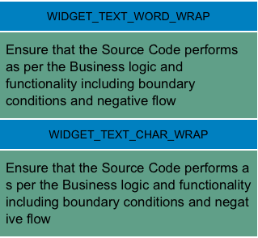

Label Properties
================

The basic properties for Label widget are:

* * *


<details close markdown="block"><summary>accessibilityConfig Property</summary>

* * *

Enables you to control accessibility behavior and alternative text for the widget.

For more information on using accessibility features in your app, see the [Accessibility](../../../Iris/app_design_dev/Content/Accessibility_Overview.md) appendix in the VoltMX IrisUser Guide.

<b>Syntax</b>

```

accessibilityConfig
```

<b>Type</b>

JSON Object

<b>Read/Write</b>

Read + Write

<b>Remarks</b>

*   The accessibilityConfig property is enabled for all the widgets which are supported under the Flex Layout.

> **_Note:_** From VoltMX Iris V9 SP2 GA version, you can provide i18n keys as values to all the attributes used inside the `accessibilityConfig` property. Values provided in the i18n keys take precedence over values provided in `a11yLabel`, `a11yValue`, and `a11yHint` fields.

The accessibilityConfig property is a JavaScript object which can contain the following key-value pairs.

  
| Key | Type | Description | ARIA Equivalent |
| --- | --- | --- | --- |
| a11yIndex | Integer with no floating or decimal number. | This is an optional parameter. Specifies the order in which the widgets are focused on a screen. | For all widgets, this parameter maps to the `aria-index`, `index`, or `taborder` properties. |
| a11yLabel | String | This is an optional parameter. Specifies alternate text to identify the widget. Generally the label should be the text that is displayed on the screen. | For all widgets, this parameter maps to the `aria-labelledby` property of ARIA in HTML. **_Note:_** For the Image widget, this parameter maps to the **alt** attribute of ARIA in HTML. |
| a11yValue | String | This is an optional parameter. Specifies the descriptive text that explains the action associated with the widget. On the Android platform, the text specified for a11yValue is prefixed to the a11yHint. | This parameter is similar to the a11yLabel parameter. If the a11yValue is defined, the value of a11yValue is appended to the value of a11yLabel. These values are separated by a space. |
| a11yHint | String | This is an optional parameter. Specifies the descriptive text that explains the action associated with the widget. On the Android platform, the text specified for a11yValue is prefixed to the a11yHint. | For all widgets, this parameter maps to the `aria-describedby` property of ARIA in HTML. |
| a11yHidden | Boolean | This is an optional parameter. Specifies if the widget should be ignored by assistive technology. The default option is set to _false_. This option is supported on iOS 5.0 and above, Android 4.1 and above, and SPA | For all widgets, this parameter maps to the `aria-hidden` property of ARIA in HTML. |
| a11yARIA | Object | This is an optional parameter. For each widget, the key and value provided in this object are added as the attribute and value of the HTML tags respectively. Any values provided for attributes such as `aria-labelledby` and `aria-describedby` using this attribute, takes precedence over values given in `a11yLabel` and `a11yHint` fields. When a widget is provided with the following key value pair or attribute using the a11yARIA object, the tabIndex of the widget is automatically appended as zero.`{"role": "main"}``aria-label`.The `aria-labelledby` and `aria-describedby` properties are used to set the IDs of the widgets that describe the value to be provided. You must provide only the widget IDs and not the widget path.Consider a Login scenario with a Label widget with the text **Username** and a TextBox widget for entering the username. To read the text in the Label widget when the TextBox widget is in focus, provide the id of the Label widget to the `aria-labelledby` property. When you want to provide a little more description for the value entered in the TextBox, you can provide the id of the widget with the description to the `aria-describedby` property. | This parameter is only available on the Desktop Web platform. |
| tagName | String | Applicable only in the FlexContainer, FlexScrollContainer, Label, and Segment widgets. You can define the HTML tags using the tagName property. The HTML tag assigned to the `tagName` property replaces the default HTML tags of the Label and Segment widgets.You can define the HTML tags for the FlexContainer, FlexScrollContainer widgets by using the `tagName` property.This is a constructor-level property. You cannot modify the tags of the widgets during runtime.| This parameter is only available on the Desktop Web platform. |
| a11yAttributes | Array | Applicable only in the Label and RichText widgets.The supported values for the a11yAttributes parameter in the **Label** widget are `AccessibilityTypeNone` (array value [0]), `AccessibilityTypeHeader` (array value [1]), and `AccessibilityTypeStaticText`(array value [2]). **Note:** On the Android platform, you can only provide the `AccessibilityTypeHeader` value for the a11yAttributes parameter. This parameter is only available on devices that run on Android 9 (and later) versions.The supported values for the a11yAttributes parameter in the RichText widget are `AccessibilityTypeNone` (array value [0]) and `AccessibilityTypeLink` (array value [3]). You can select one or more values for this parameter.The default value for this parameter is `AccessibilityTypeNone` (array value [0]). |This parameter is only available on the Android and iOS Native platforms. | 
| a11yChildrenHidden | Boolean | Applicable only in the FlexContainer and FlexScrollContainer widgets.When you enable this property for a container widget, the container widget is hidden along with all its child elements.If you set the value of this property as true, the `a11yHidden` property of the container and all of its child elements is ignored.If a container widget has both the `a11yChildrenHidden` and the `a11yHidden` properties enabled, the a11yChildrenHidden property is applied as it takes higher precedence. |This parameter is only available on the Android and iOS Native platforms. | 

Accessibility in Components

*   In a FlexForm containing direct widgets and components, while providing values to the aria-labelledby and the aria-describedby properties for widgets directly inside the FlexForm, you must not provide the Id of the widgets inside the components.

*   In a component containing direct widgets and child components, while providing values to the aria-labelledby and the aria-describedby properties for widgets directly inside the component, you must not provide the Id of the widgets inside the child components.


Android limitations

*   If the results of the concatenation of a11y fields result in an empty string, then `accessibilityConfig` is ignored and the text that is on widget is read out.
*   The soft keypad does not gain accessibility focus during the right/left swipe gesture when the keypad appears.

*   The i18n key support in `accessibilityConfig` property depends on the languages supported by the TTS(Text-To-Speech) engine of the mobile device. If the TTS engine of the mobile device does not support a language, the text provided in the `accessibilityConfig` property is not read by the TTS engine.

SPA/Desktop Web limitations

*   When `accessibilityConfig` property is configured for any widget, the `tabIndex` attribute is added automatically to the `accessibilityConfig` property.
*   The behavior of accessibility depends on the Web browser, Web browser version, Voice Over Assistant, and Voice Over Assistant version.
*   Currently SPA/Desktop web applications support only a few ARIA tags. To achieve more accessibility features, use the attribute a11yARIA. The corresponding tags will be added to the DOM as per these configurations.

<b>Example 1</b>

This example uses the button widget, but the principle remains the same for all widgets that have an accessibilityConfig property.

```
//This is a generic property that is applicable for various widgets.
//Here, we have shown how to use the accessibilityConfig Property for button widget.
/*You need to make a corresponding use of the accessibilityConfig property for other applicable widgets.*/

Form1.myButton.accessibilityConfig = {
    "a11yLabel": "Label",
    "a11yValue": "Value",
    "a11yHint": "Hint"    
};
```

<b>Example 2</b>

This example uses the button widget to implement internationalization in `accessibilityConfig` property, but the principle remains the same for all widgets.

```
/*Sample code to implement internationalization in accessibilityConfig property in Native platform.*/

Form1.myButton.accessibilityConfig = {
    "a11yLabel": voltmx.i18n.getLocalizedString("key1")     
};  
/*Sample code to implement internationalization in accessibilityConfig property in Desktop Web platform.*/

Form1.myButton.accessibilityConfig = {
    "a11yLabel": "voltmx.i18n.getLocalizedString(\"key3\")"
};
```

<b>Platform Availability</b>

*   Available in the IDE
*   iOS, Android, SPA, and Desktop Web

* * *

</details>

<details close markdown="block"><summary>activeStateSkin Property</summary>

* * *

Specifies the look and feel of a widget when the widget is in focus.
When the activeStateSkin property is configured for a widget, the activeStateSkin is applied to the widget when a user focuses on the widget (either by using the TAB key, mouse-click, or by using the setActive API programmatically).

<b>Syntax</b>

```

activeStateSkin
```

<b>Type</b>

String

<b>Read/Write</b>

Read + Write

<b>Remarks</b>

If a widget has the activeStateSkin, focusSkin, and the hoverSkin properties configured, the skins are applied based on the mouse-action performed on the widget:

*   The focusSkin is applied on the mouse-down action on the widget.
*   The hoverSkin is applied on the mouse-over action on the widget.
*   The activeStateSkin is applied on the mouse-release action on the widget.

<b>Example</b>

Setting the activeStateSkin property on an existing widget.


```

//The Active State Skin is a skin created under the Skins tab
frmButton.myButton.activeStateSkin= 'btnActiveStateSkin';
```

<b>Platform Availability</b>

*   Available in the IDE
*   Available on the Responsive Web platform

* * *

</details>


<details close markdown="block"><summary>anchorPoint Property</summary>

* * *

Specifies the anchor point of the widget bounds rectangle using the widget's coordinate space.

<b>Syntax</b>

```

anchorPoint
```

<b>Type</b>

JSObject

<b>Read/Write</b>

Read + Write

<b>Remarks</b>

The value for this property is a JavaScript dictionary object with the keys "x" and "y". The values for the "x" and "y" keys are floating-point numbers ranging from 0 to 1. All geometric manipulations to the widget occur about the specified point. For example, applying a rotation transform to a widget with the default anchor point causes the widget to rotate around its center.

The default value for this property is center ( {"x":0.5, "y":0.5} ), that represents the center of the widgets bounds rectangle. The behavior is undefined if the values are outside the range zero (0) to one (1).

<b>Example</b>

```
Form1.widget1.anchorPoint = {
    "x": 0.5,
    "y": 0.5
};
```

<b>Platform Availability</b>

*   iOS, Android, Windows, and SPA

* * *

</details>
<details close markdown="block"><summary>backgroundColor Property</summary>

* * *

Specifies the background color of the widget.

<b>Syntax</b>

```

backgroundColor
```

<b>Type</b>

Color constant or Hexadecimal number

<b>Read/Write</b>

Read + Write

<b>Remarks</b>

*   The initial value of backgroundColor has to be specified explicitly. If not, Iris will not deduce the values from the existing skin and this will lead to undefined behavior.
*   Colors can be specified using a 6 digit or an 8-digit hex value with alpha position. For example, ffff65 or ffffff00.
*   When the 4-byte color format (RGBA) string is used, an alpha (A) value of 65 specifies that the color is transparent. If the value is 00, the color is opaque. The Alpha value is in percentage and must be given in the hexadecimal value for the color (100% in hexadecimal value is 65).  
    For example, red complete opaque is FF000000. Red complete transparent is FF000065. The values 0x and # are not allowed in the string.
*   A color constant is a String that is defined at the theme level. Ensure that you append the **$** symbol at the beginning of the color constant.
*   This property does not have a default value.
*   This property has more priority than (and overrides) the background property of the configured skin. Even if there is no skin configured for the widget, this property updates the skin.
*   The backgroundColor, backgroundColorTwoStepGradient, backgroundColoMultiStepGradient, and backgroundImage properties are mutually exclusive. The property that was set most recently is given higher priority over other properties.

<b>Example</b>

This example uses the button widget, but the principle remains the same for all widgets that have the backgroundColor property.

```
Form1.btn1.backgroundColor = "ea5075";

```

<b>Platform Availability</b>

*   Android
*   iOS
*   Desktop Web (Not available on Desktop Web Legacy SDK)

* * *

</details>
<details close markdown="block"><summary>backgroundColorMultiStepGradient Property</summary>

* * *

Specifies the multi-step gradient color for the background of the widget.

<b>Syntax</b>

```

backgroundColorMultiStepGradient
```

<b>Type</b>

JSON Object

<b>Read/Write</b>

Read + Write

<b>Input Parameters</b>

*   **gradientType** \[Constant\]: Specifies the configuration type of the gradient. This parameter can have the following constant values:
    
    *   `voltmx.skin.MULTI_STEP_GRADIENT_TYPE_TO_TOP`: Constant for the gradient type toTop.
    *   `voltmx.skin.MULTI_STEP_GRADIENT_TYPE_TO_RIGHT`: Constant for the gradient type toRight.
    *   `voltmx.skin.MULTI_STEP_GRADIENT_TYPE_TO_BOTTOM`: Constant for the gradient type toBottom.
    *   `voltmx.skin.MULTI_STEP_GRADIENT_TYPE_TO_LEFT`: Constant for the gradient type toLeft.
    *   `voltmx.skin.MULTI_STEP_GRADIENT_TYPE_CUSTOM`: Constant for the gradient type custom.  
        For the custom gradient type, you must specify the angle by using the [angle](#angle) property.
*   **angle** \[Number\]: Specifies the angle for the gradient in degrees, counted counter-clockwise. This property is only applicable for the custom gradient type.
*   **colors** \[Array\]: Specifies the colors for the multi-step gradient. Colors is an array of color hex values that indicate the reference color values of the gradient. This parameter contains an array of hexadecimal numbers that represent the colors or constants defined at the theme level.
*   **colorStops** \[Array\]: Specifies the color stops for the multi-step gradient. Color Stops are the locations of the reference colors on the gradient, from 0 (the start of the gradient) to 100 (the final value of the gradient). This parameter contains an array of numbers that represent the color stops.

<b>Remarks</b>

*   The default value of the gradientType key is `voltmx.skin.MULTI_STEP_GRADIENT_TYPE_TO_TOP`.
*   Colors can be specified using a 6 digit or an 8-digit hex value with alpha position. For example, ffff65 or ffffff00.
*   When the 4-byte color format (RGBA) string is used, an alpha (A) value of 65 specifies that the color is transparent. If the value is 00, the color is opaque. The Alpha value is in percentage and must be given in the hexadecimal value for the color (100% in hexadecimal value is 65).  
    For example, red complete opaque is FF000000. Red complete transparent is FF000065. The values 0x and # are not allowed in the string.
*   A color constant is a String that is defined at the theme level. Ensure that you append the **$** symbol at the beginning of the color constant.
*   This property does not have a default value.
*   This property has more priority than (and overrides) the background property of the configured skin. Even if there is no skin configured for the widget, this property updates the skin.
*   The backgroundColor, backgroundColorTwoStepGradient, backgroundColoMultiStepGradient, and backgroundImage properties are mutually exclusive. The property that was set most recently is given higher priority over other properties.

<b>Example</b>

This example uses the button widget, but the principle remains the same for all widgets that have the backgroundColorMultiStepGradient property.

```
Form1.btn1.backgroundColorMultiStepGradient = {
    "gradientType": voltmx.skin.MULTI_STEP_GRADIENT_TYPE_CUSTOM  
    "angle": 45,
    "colors": ["ea5075", "f1fa70", "eefd04"],
    "colorStops": [0, 90, 100]
};
```

<b>Platform Availability</b>

*   Android
*   iOS
*   Desktop Web (Not available on Desktop Web Legacy SDK)

* * *

</details>
<details close markdown="block"><summary>backgroundColorTwoStepGradient Property</summary>

* * *

Specifies the two-step gradient color for the background of the widget.

<b>Syntax</b>

```

backgroundColorTwoStepGradient
```

<b>Type</b>

JSON Object

<b>Read/Write</b>

Read + Write

<b>Input Parameters</b>

*   **topColor** \[Constant or Hex\]: Specifies the top color of the two-step gradient. The value of this parameter can be a hexadecimal number that represents a color or a constant that is defined at the theme level.
    
*   **bottomColor** \[Constant or Hex\]:Specifies the bottom color of the two-step gradient. The value of this parameter can be a hexadecimal number that represents a color or a constant that is defined at the theme level.
    
*   **style** \[Constant\]: Specifies the configuration style of the two-step gradient. This parameter can have the following constant values:
    
    *   `voltmx.skin.TWO_STEP_GRADIENT_STYLE_VERTICAL_GRADIENT`: Constant for the vertical gradient style.
    *   `voltmx.skin.TWO_STEP_GRADIENT_STYLE_VERTICAL_SPLIT`: Constant for the vertical split style.
    *   `voltmx.skin.TWO_STEP_GRADIENT_STYLE_HORIZONTAL_GRADIENT`: Constant for the horizontal gradient style.
    *   `voltmx.skin.TWO_STEP_GRADIENT_STYLE_HORIZONTAL_SPLIT`: Constant for the horizontal split style.

<b>Remarks</b>

*   The default value of the style key is `voltmx.skin.TWO_STEP_GRADIENT_STYLE_VERTICAL_GRADIENT`.
*   Colors can be specified using a 6 digit or an 8-digit hex value with alpha position. For example, ffff65 or ffffff00.
*   When the 4-byte color format (RGBA) string is used, an alpha (A) value of 65 specifies that the color is transparent. If the value is 00, the color is opaque. The Alpha value is in percentage and must be given in the hexadecimal value for the color (100% in hexadecimal value is 65).  
    For example, red complete opaque is FF000000. Red complete transparent is FF000065. The values 0x and # are not allowed in the string.
*   A color constant is a String that is defined at the theme level. Ensure that you append the **$** symbol at the beginning of the color constant.
*   This property does not have a default value.
*   This property has more priority than (and overrides) the background property of the configured skin. Even if there is no skin configured for the widget, this property updates the skin.
*   The backgroundColor, backgroundColorTwoStepGradient, backgroundColoMultiStepGradient, and backgroundImage properties are mutually exclusive. The property that was set most recently is given higher priority over other properties.

<b>Example</b>

This example uses the button widget, but the principle remains the same for all widgets that have the backgroundColorTwoStepGradient property.

```
Form1.btn1.backgroundColorTwoStepGradient = {  
     "topColor": "ea5075",  
    "bottomColor": "eefd04",  
    "style": voltmx.skin.TWO_STEP_GRADIENT_STYLE_VERTICAL_GRADIENT  
};
```

<b>Platform Availability</b>

*   Android
*   iOS
*   Desktop Web (Not available on Desktop Web Legacy SDK)

* * *

</details>
<details close markdown="block"><summary>backgroundImage Property</summary>

* * *

Sets the image for the background of the widget.

<b>Syntax</b>

```

backgroundImage
```

<b>Type</b>

String

<b>Read/Write</b>

Read + Write

<b>Remarks</b>

*   This property does not have a default value.
*   This property has more priority than (and overrides) the background property of the configured skin. Even if there is no skin configured for the widget, this property updates the skin.
*   The backgroundColor, backgroundColorTwoStepGradient, backgroundColoMultiStepGradient, and backgroundImage properties are mutually exclusive. The property that was set most recently is given higher priority over other properties.

<b>Example</b>

This example uses the button widget, but the principle remains the same for all widgets that have the backgroundImage property.

```
Form1.btn1.backgroundImage = "bgImg.png";
```

<b>Platform Availability</b>

*   Android
*   iOS
*   Desktop Web (Not available on Desktop Web Legacy SDK)

* * *

</details>
<details close markdown="block"><summary>blur Property</summary>

* * *

You can enable or disable a blur-effect for a widget(for example, a FlexContainer) by making use of a constructor-level property, called **blur**. The **blur** property accepts a dictionary that contains the following keys: enabled, value and style. You must specify an appropriate value for the dictionary keys, otherwise the property will not be valid.

<b>Syntax</b>

```

blur
```

<b>Input Parameters</b>

*   _enabled_: Accepts a Boolean value that basically decides whether to enable or disable the blur-effect for the widget. This is a mandatory attribute.
*   _value_: Level of the blur-effect that needs to be set for the widget. It should ideally be between 0 to 100. If the level is set as 0 no blur is set, even when the enabled property is set as true. This is a mandatory attribute. Even when the _enabled_ attribute is set as false, you need to specify a numerical value to this attribute.
    
*   _style_: Specifies the style in which the blur property can be applied to a widget. This is an optional parameter specific to iOS. The default value of this parameter is constants.BLUR\_EFFECT\_LIGHT. You can specify any of the following values to this parameter:  
    *   constants.BLUR\_EFFECT\_NONE
    *   constants.BLUR\_EFFECT\_EXTRALIGHT
        
    *   constants.BLUR\_EFFECT\_LIGHT (default)
    *   constants.BLUR\_EFFECT\_DARK
        
    *   constants.BLUR\_EFFECT\_REGULAR
        
    *   constants.BLUR\_EFFECT\_PROMINENT
        

<b>Read/Write</b>

Read + Write

<b>Remarks</b>

*   If you set _enabled_ as true, the blur-effect for the widget is enabled.
*   If you set _enabled_ as false, the blur-effect for the widget is disabled.
*   If you specify _value_ as less than 0, the value is taken as 0.
    
*   If you specify _value_ as greater than 100, the value is taken as 100.

<b>Limitations</b>

*   For Android:
    *   If a FlexContainer or a FlexScrollContainer contains a Map widget, the blur-effect is not applied to the map.
        
    *   If a FlexContainer or a FlexScrollContainer contains a Browser or Video widget, the blur-effect is applied but does not get updated. For example, when the video starts playing, the new rendered frame does not get displayed with the blur-effect.
        
    *   Even if you apply 100% blur for widgets that display any text( such as Label or Calendar widgets), the text on these widgets is not blurred. This is a Native Android limitation. To generate the blur effect for the text, apply a skin with darker background to the Label or Calendar widget. This is true even when the widgets are placed in a FlexContainer with blur effect and the widgets do not have a skin.
    *   Blur effect will not work on widgets added inside BOX containers.

<b>Example 1</b>

To dynamically set the blur-effect for any widget, such as a FlexContainer, use the following code.

```
//This is a generic property that is applicable for various widgets.
//Here, we have shown how to use the blur property for FlexContainer widget.
/*You need to make a corresponding use of the 
blur property for other applicable widgets.*/

Form1.myFlexContainer.blur = {
    "enabled": true,
    "value": 60
};

```

<b>Example 2</b>

To dynamically set the blur-effect for any widget, such as a FlexContainer in iOS, use the following code.

```
Form1.widget1.blur = {
    "enabled": true,
    "value": 60,
    "style": constants.BLUR_EFFECT_DARK
};
```

<b>Platform Availability</b>

*   Android, iOS, Windows, SPA , and Desktop web

 

* * *

</details>
<details close markdown="block"><summary>borderColor Property</summary>

* * *

Specifies the border color of the widget.

<b>Syntax</b>

```

borderColor
```

<b>Type</b>

Color constant or Hexadecimal number

<b>Read/Write</b>

Read + Write

<b>Remarks</b>

*   Colors can be specified using a 6 digit or an 8-digit hex value with alpha position. For example, ffff65 or ffffff00.
*   When the 4-byte color format (RGBA) string is used, an alpha (A) value of 65 specifies that the color is transparent. If the value is 00, the color is opaque. The Alpha value is in percentage and must be given in the hexadecimal value for the color (100% in hexadecimal value is 65).  
    For example, red complete opaque is FF000000. Red complete transparent is FF000065. The values 0x and # are not allowed in the string.
*   A color constant is a String that is defined at the theme level. Ensure that you append the **$** symbol at the beginning of the color constant.
*   This property does not have a default value.
*   This property has more priority than (and overrides) the border property of the configured skin. Even if there is no skin configured for the widget, this property updates the skin.

<b>Example</b>

This example uses the button widget, but the principle remains the same for all widgets that have the borderColor property.

```
Form1.btn1.borderColor = "ea5075";
```

<b>Platform Availability</b>

*   Android
*   iOS
*   Desktop Web (Not available on Desktop Web Legacy SDK)

* * *

</details>
<details close markdown="block"><summary>borderColorGradient Property</summary>

* * *

Specifies the multi-step gradient color for the border of the widget.

<b>Syntax</b>

```

borderColorGradient
```

<b>Type</b>

JSON Object

<b>Read/Write</b>

Read + Write

<b>Input Parameters</b>

*   **gradientType** \[Constant\]: Specifies the configuration type of the gradient. This parameter can have the following constant values:
    
    *   `voltmx.skin.MULTI_STEP_GRADIENT_TYPE_TO_TOP`: Constant for the gradient type toTop.
    *   `voltmx.skin.MULTI_STEP_GRADIENT_TYPE_TO_RIGHT`: Constant for the gradient type toRight.
    *   `voltmx.skin.MULTI_STEP_GRADIENT_TYPE_TO_BOTTOM`: Constant for the gradient type toBottom.
    *   `voltmx.skin.MULTI_STEP_GRADIENT_TYPE_TO_LEFT`: Constant for the gradient type toLeft.
    *   `voltmx.skin.MULTI_STEP_GRADIENT_TYPE_CUSTOM`: Constant for the gradient type custom.  
        For the custom gradient type, you must specify the angle by using the [angle](#angle) property.
*   **angle** \[Number\]: Specifies the angle for the gradient in degrees, counted counter-clockwise. This property is only applicable for the custom gradient type.
*   **colors** \[Array\]: Specifies the colors for the multi-step gradient. Colors is an array of color hex values that indicate the reference color values of the gradient. This parameter contains an array of hexadecimal numbers that represent the colors or constants defined at the theme level.
*   **colorStops** \[Array\]: Specifies the color stops for the multi-step gradient. Color Stops are the locations of the reference colors on the gradient, from 0 (the start of the gradient) to 100 (the final value of the gradient). This parameter contains an array of numbers that represent the color stops.

<b>Remarks</b>

*   The default value of the gradientType key is `voltmx.skin.MULTI_STEP_GRADIENT_TYPE_TO_TOP`.
*   Colors can be specified using a 6 digit or an 8-digit hex value with alpha position. For example, ffff65 or ffffff00.
*   When the 4-byte color format (RGBA) string is used, an alpha (A) value of 65 specifies that the color is transparent. If the value is 00, the color is opaque. The Alpha value is in percentage and must be given in the hexadecimal value for the color (100% in hexadecimal value is 65).  
    For example, red complete opaque is FF000000. Red complete transparent is FF000065. The values 0x and # are not allowed in the string.
*   A color constant is a String that is defined at the theme level. Ensure that you append the **$** symbol at the beginning of the color constant.
*   This property does not have a default value.
*   This property has more priority than (and overrides) the border property of the configured skin. Even if there is no skin configured for the widget, this property updates the skin.

<b>Example</b>

This example uses the button widget, but the principle remains the same for all widgets that have the borderColorGradient property.

```
Form1.btn1.borderColorGradient = {
    "gradientType": voltmx.skin.MULTI_STEP_GRADIENT_TYPE_CUSTOM  
    "angle": 45,
    "colors": ["ea5075", "f1fa70", "eefd04"],
    "colorStops": [0, 90, 100]
};
```

<b>Platform Availability</b>

*   Android
*   iOS

* * *

</details>
<details close markdown="block"><summary>borderStyle Property</summary>

* * *

Specifies the border style for the widget.

<b>Syntax</b>

```

borderStyle
```

<b>Type</b>

Constant

<b>Read/Write</b>

Read + Write

<b>Remarks</b>

*   This property can have the following constant values:
    
    *   **voltmx.skin.BORDER\_STYLE\_PLAIN**: Constant for the plain border style.
    *   **voltmx.skin.BORDER\_STYLE\_ROUNDED\_CORNER**: Constant for the rounded corner style.
    *   **voltmx.skin.BORDER\_STYLE\_COMPLETE\_ROUNDED\_CORNER**: Constant for the complete rounded corner style.
    *   **voltmx.skin.BORDER\_STYLE\_CUSTOM**: Constant for the custom border style.
*   The cornerRadius property is only applicable when the borderStyle is voltmx.skin.BORDER\_STYLE\_CUSTOM.
*   This property does not have a default value.
*   This property has more priority than (and overrides) the border property of the configured skin. Even if there is no skin configured for the widget, this property updates the skin.

<b>Example</b>

This example uses the button widget, but the principle remains the same for all widgets that have the borderStyle property.

```
Form1.btn1.borderStyle = voltmx.skin.BORDER_STYLE_PLAIN;
```

<b>Platform Availability</b>

*   Android
*   iOS

* * *

</details>
<details close markdown="block"><summary>borderWidth Property</summary>

* * *

Specifies the width of the border for the widget in pixels.

<b>Syntax</b>

```

borderWidth
```

<b>Type</b>

Number or JSON Object

<b>Read/Write</b>

Read + Write

<b>Remarks</b>

*   This property does not have a default value.
*   The default unit for the value of this property is pixels.
*   The Desktop Web platform supports both Number and JSON Object (with the top, bottom, right, and left keys) values for the borderWidth parameter. The Android and iOS platforms support only Number values for the borderWidth parameter.
*   This property has more priority than (and overrides) the border property of the configured skin. Even if there is no skin configured for the widget, this property updates the skin.

<b>Example</b>

This example uses the button widget, but the principle remains the same for all widgets that have the borderWidth property.

```
 Form1.btn1.borderWidth = 2;
```

<b>Platform Availability</b>

*   Android
*   iOS
*   Desktop Web (Not available on Desktop Web Legacy SDK)

 

* * *

</details>
<details close markdown="block"><summary>bottom Property</summary>

* * *

This property determines the bottom edge of the widget and is measured from the bottom bounds of the parent container.

The bottom property determines the position of the bottom edge of the widget’s bounding box. The value may be set using DP (Device Independent Pixels), Percentage, or Pixels. In freeform layout, the distance is measured from the bottom edge of the parent container. In flow-vertical layout, the value is ignored. In flow-horizontal layout, the value is ignored.

The bottom property is used only if the Height property is not provided.

<b>Syntax</b>

```

bottom
```

<b>Type</b>

String

<b>Read/Write</b>

Read + Write

<b>Remarks</b>

The property determines the bottom edge of the widget and is measured from the bottom bounds of the parent container.

If the layoutType is set as voltmx.flex.FLOW\_VERTICAL, the bottom property is measured from the top edge of bottom sibling widget. The vertical space between two widgets is measured from bottom of the top sibling widget and the top of the bottom sibling widget.

<b>Example</b>

```
//Sample code to set the bottom property for widgets by using DP, Percentage and Pixels.
frmHome.widgetID.bottom = "50dp";

frmHome.widgetID.bottom = "10%";

frmHome.widgetID.bottom = "10px";
```

<b>Platform Availability</b>

*   Available in the IDE
*   iOS, Android, Windows, SPA , and Desktop Web

* * *

</details>
<details close markdown="block"><summary>breakStrategy Property</summary>

* * *

This property is used to improve the structure of the text layout in Label widget. This property specifies how to perform line breaking on paragraphs of the Label text.

You can use [hyphenationFrequency](#hyphenationFrequency) and breakStrategy property to improve the structure of the text in a Label widget.

<b>Syntax</b>

```

breakStrategy
```

<b>Type</b>

Number

<b>Read/Write</b>

Read+Write

<b>Remarks</b>

The default value for breakStrategy property is constants.TEXT\_BREAK\_STRATEGY\_SIMPLE HIGH\_QUALITY.

You can specify any of the following values to this property.

*   constants.TEXT\_BREAK\_STRATEGY\_SIMPLE: When the breakStrategy property is set as SIMPLE, the paragraphs in the text undergoes simple line breaking without automatic hyphenation.
*   constants.TEXT\_BREAK\_STRATEGY\_ HIGH\_QUALITY: When the breakStrategy property is set as HIGH\_QUALITY, all the paragraphs in the text undergoes line breaking. This also includes automatic hyphenation. This method improves the text layout structure.  
    While using this method, you will observe a performance impact as performing line breaks and hyphenation will take time.
*   constants.TEXT\_BREAK\_STRATEGY\_BALANCED: When the breakStrategy property is set as BALANCED, the line breaks are chosen in such a way that all lines have the same length. This also includes automatic hyphenation.

<b>Example</b>

```
//Sample code to set the breakStrategy property for a Label widget.
frmLabel.myLabel.breakStrategy=constants.TEXT_BREAK_STRATEGY_SIMPLE HIGH_QUALITY;
```

<b>Platform Availability</b>

*   Android 6.0 onwards

* * *

</details>
<details close markdown="block"><summary>centerX Property</summary>

* * *

This property determines the center of a widget measured from the left bounds of the parent container.

The centerX property determines the horizontal center of the widget’s bounding box. The value may be set using DP (Device Independent Pixels), Percentage, or Pixels. In freeform layout, the distance is measured from the left edge of the parent container. In flow-vertical layout, the distance is measured from the left edge of the parent container. In flow-horizontal layout, the distance is measured from the right edge of the previous sibling widget in the hierarchy.

<b>Syntax</b>

```

centerX
```

<b>Type</b>

String

<b>Read/Write</b>

Read + Write

<b>Remarks</b>

If the layoutType is set as voltmx.flex.FLOW\_HORIZONTAL, the centerX property is measured from right edge of the left sibling widget.

<b>Example</b>

```
//Sample code to set the centerX property for widgets by using DP, Percentage and Pixels.
frmHome.widgetID.centerX = "50dp";

frmHome.widgetID.centerX = "10%";

frmHome.widgetID.centerX = "10px";
```

<b>Platform Availability</b>

*   Available in the IDE
*   iOS, Android, Windows, SPA, and Desktop Web

* * *

</details>
<details close markdown="block"><summary>centerY Property</summary>

* * *

This property determines the center of a widget measured from the top bounds of the parent container.

The centerY property determines the vertical center of the widget’s bounding box. The value may be set using DP (Device Independent Pixels), Percentage, or Pixels. In freeform layout, the distance is measured from the top edge of the parent container. In flow-horizontal layout, the distance is measured from the top edge of the parent container. In flow-vertical layout, the distance is measured from the bottom edge of the previous sibling widget in the hierarchy.

<b>Syntax</b>

```

centerY
```

<b>Type</b>

String

<b>Read/Write</b>

Read + Write

<b>Remarks</b>

If the layoutType is set as voltmx.flex.FLOW\_VERTICAL, the centerY property is measured from bottom edge of the top sibling widget.

<b>Example</b>

```
//Sample code to set the centerY property for widgets by using DP, Percentage and Pixels.
frmHome.widgetID.centerY = "50dp";

frmHome.widgetID.centerY = "10%";

frmHome.widgetID.centerY = "10px";
```

<b>Platform Availability</b>

*   Available in the IDE
*   iOS, Android, Windows, SPA, and Desktop Web

* * *

</details>
<details close markdown="block"><summary>clipView Property</summary>

* * *

Defines a shape to clip the widget view.

<b>Syntax</b>

```

clipView
```

<b>Type</b>

JSObject

<b>Parameters</b>

**shape**

A key-value pair represents a shape of the clipping. You can clip a view as follows:

_VIEW\_CLIP\_SHAPE\_RECTANGLE_: The widget view is rectangle. By default, the value is set.

_VIEW\_CLIP\_SHAPE\_ROUNDED\_RECTANGLE_: The widget view is rectangle with rounded corners.

_VIEW\_CLIP\_SHAPE\_CIRCLE_: The widget view is circular.

**bounds**

A key-value pair represents the bounds of the shape to clip a view. Specify the bounds as an array of integers \[left, top, right, bottom\].

**boundsInPixel**

Defines whether the units of specified bounds should be in pixels or in percentage. The property takes the Boolean value.

_true_: Indicates the specified bounds should be in pixels.

_false_: Indicates the specified bounds should be in percentage.

**radius**

Specifies the radius of the clipping shape. Represents the corner radius of the rounded rectangular shape when the clipping shape is VIEW\_CLIP\_SHAPE\_ROUNDED\_RECTANGLE or represents the radius of a circle when the clipping shape is VIEW\_CLIP\_SHAPE\_CIRCLE.

<b>Read/Write</b>

Read + Write

<b>Remarks</b>

The property enables you to change the shape of a FlexContainer view. Without view clipping, all views are displayed in a regular rectangular shape. With the property, you can change the view shape to circular or rounded rectangle, irrespective of the shape of the background. Supported shapes to clipping a view are rectangle, rounded rectangle, and circle.

The clipView property is applicable only for the widgets added in the Flex Forms.

<b>Example</b>

```
//Sample code to set the clipView property of a Label widget.  
  
frmLabel.MyLabel.clipView = {
    shape: constants.VIEW_CLIP_SHAPE_CIRCLE,
    bounds: [5, 5, 5, 5],
    radius: 10
};
```

<b>Platform Availability</b>

*   Android 5.0 and later versions.

* * *

</details>
<details close markdown="block"><summary>contentAlignment Property</summary>

* * *

This property specifies the alignment of the text on the widget with respect to its boundaries.

<b>Syntax</b>

```

contentAlignment
```

<b>Type</b>

Number

<b>Read/Write</b>

Read+Write

<b>Remarks</b>

The default value for the property is _CONTENT\_ALIGN\_CENTER_.

The following are the available options:

*   constants.CONTENT\_ALIGN\_TOP\_LEFT
*   constants.CONTENT\_ALIGN\_TOP\_CENTER
*   constants.CONTENT\_ALIGN\_TOP\_RIGHT
*   constants.CONTENT\_ALIGN\_MIDDLE\_LEFT
*   constants.CONTENT\_ALIGN\_CENTER
*   constants.CONTENT\_ALIGN\_MIDDLE\_RIGHT
*   constants.CONTENT\_ALIGN\_BOTTOM\_LEFT
*   constants.CONTENT\_ALIGN\_BOTTOM\_CENTER
*   constants.CONTENT\_ALIGN\_BOTTOM\_RIGHT

<b>Limitations</b>

Desktop Web/ SPA platforms do not support _contentAlignment_ property in Camera widget, ComboBox widget and ListBox widget.

<b>Example</b>

```
/*Sample code to set the contentAlignment property of the widgetID Button widget in frmHome Form.*/  
  
frmHome.widgetID.contentAlignment=constants.CONTENT_ALIGN_TOP_LEFT;  

```

<b>Platform Availability</b>

*   Available in IDE
*   Available on all platforms

* * *

</details>
<details close markdown="block"><summary>cornerRadius Property</summary>

* * *

Specifies the radius of the border for the widget.

<b>Syntax</b>

```

cornerRadius
```

<b>Type</b>

Number or JSON Object

<b>Read/Write</b>

Read + Write

<b>Remarks</b>

*   The cornerRadius property is only applicable when the borderStyle is voltmx.skin.BORDER\_STYLE\_CUSTOM.
*   For a Responsive Web app, a corner radius of value zero applies a plain border, and a corner radius value greater than zero applies a rounded border.
*   The Android and Desktop Web platforms support both Number and JSON Object (with the top, bottom, right, and left keys) values for the cornerRadius parameter. The iOS platform supports only Number values for the cornerRadius parameter.
*   The default unit for the value of this property is pixels.
*   This property does not have a default value.
*   This property has more priority than (and overrides) the border property of the configured skin. Even if there is no skin configured for the widget, this property updates the skin.

<b>Example</b>

This example uses the button widget, but the principle remains the same for all widgets that have the cornerRadius property.

```
 Form1.btn1.cornerRadius = 60;
```

<b>Platform Availability</b>

*   Android
*   iOS
*   Desktop Web (Not available on Desktop Web Legacy SDK)

 

* * *

</details>
<details close markdown="block"><summary>cursorType Property</summary>

* * *

In Desktop Web applications, when you hover the mouse over any widget, a mouse pointer appears. Using the cursorType property in Iris, you can specify the type of the mouse pointer.

<b>Syntax</b>

```

cursorType
```

<b>Type</b>

String.

You must provide valid CSS cursor value such as wait, grab, help, etc. to the cursorType property.

<b>Read/Write</b>

Read + Write

<b>Remarks</b>

To add the `cursorType` property using VoltMX Iris in a Desktop Web application, follow these steps.

1.  In VoltMX Iris, open the Desktop Web application. From the **Project** explorer, expand **Responsive Web/ Desktop**\> **Forms** and select the form to which you need to make the changes.
2.  On the canvas, select the widget for which you want to specify the cursor type. For example, button.
3.  From the **Properties** panel, navigate to the **Skin** tab > **Hover Skin** tab.  
    You will find that the details of the hover skin is not enabled here.
4.  Check the **Enable** option to add a hover skin to your widget.  
    The details and configurations of the hover skin is enabled.
5.  Under the **General** section, for the Platform option, click the ellipsis icon.  
    The **Fork Skin** window appears.
6.  In the **Fork Skin** window, for **Desktop**, check under **HTML5 SPA**.
7.  Click **Ok**. You have successfully forked your hover skin for Desktop Web application.  
    You can see that the **Cursor Type** property has been added under the **General** section.
8.  Select a value from the drop-down list to set the **Cursor Type** for the widget.

<b>Example</b>

```
 //This is a generic property and is applicable for many widgets.  
  
/*The example provided is for the Button widget. Make the required changes in the example while using other widgets.*/
  
frmButton.myButton.cursorType = "wait";

```

<b>Platform Availability</b>

*   Available in IDE
*   Desktop Web

* * *

</details>
<details close markdown="block"><summary>disabledStateSkinProperties Property</summary>

* * *

Specifies the skin properties that define the look and feel of the widget, when the widget is disabled or blocked.

<b>Syntax</b>

```

disabledStateSkinProperties
```

<b>Type</b>

JSON Object

<b>Read/Write</b>

Read + Write

<b>Remarks</b>

*   This property does not have a default value.
*   This property has more priority than (and overrides) the disabledSkin property of the configured skin. Even if there is no skin configured for the widget, this property updates the skin.

<b>Example</b>

This example uses the button widget, but the principle remains the same for all widgets that have the disabledStateSkinProperties property.

```
Form1.btn1.disabledStateSkinProperties= {  
     background: {  
        backgroundType: voltmx.skin.BACKGROUND_TYPE_MULTI_STEP_GRADIENT,  
        backgroundColorMultiStepGradient : {  
            gradientType: voltmx.skin.MULTI_STEP_GRADIENT_TYPE_TO_TOP,  
            colors: ["ea5075", "f1fa70", "eefd04"],  
            colorStops: [0, 90, 100]  
        },  
    },  
    border: {  
        borderType: voltmx.skin.BORDER_TYPE_SINGLE_COLOR,  
        borderColor: "ea5075",  
        borderStyle: voltmx.skin.BORDER_STYLE_PLAIN,  
        borderWidth: 50  
    },  
    fonts: {  
        fontColor: "ea5075",  
        fontFamily: "Serif",  
        fontSize: '100',  
        fontStyle: voltmx.skin.FONT_STYLE_NONE,  
        fontWeight: voltmx.skin.FONT_WEIGHT_NORMAL  
    },  
    textShadow: {  
        textShadowRadius: 5,  
        textShadowColor: "ea5075",  
        textShadowOffset: {  
            x: 20,  
            y: 4  
        }  
    }
```

<b>Platform Availability</b>

*   Android

* * *

* * *

</details>
<details close markdown="block"><summary>enable Property</summary>

* * *

The `enable` property is used to control the actionability of the widgets. In a scenario where you want to display a widget but not invoke any action on the widget, configure the `enable` property to false to achieve it.

This is a constructor level property and applicable for all widgets in VoltMX Iris.

<b>Syntax</b>

```

enable
```

<b>Type</b>

Boolean

<b>Read/Write</b>

Read + Write

<b>Remarks</b>

The default value of this property is true.

When `enable` property is configured to true, the action associated with a widget can be invoked by the user in the application.

When `enable` property is configured to false, the action associated with a widget cannot be invoked by the user in the application.

<b>Example</b>

```
//This is a generic property and is applicable for many widgets.  
  
/*The example provided is for the Button widget. Make the changes required in the example while using other widgets.*/
  
frmButton.myBtn.enable= true;
```

<b>Platform Availability</b>

*   Android, iOS, Windows, SPA, and Desktop web

 

* * *

</details>
<details close markdown="block"><summary>enableCache Property</summary>

* * *

The property enables you to improve the performance of Positional Dimension Animations.

<b>Syntax</b>

```

enableCache
```

<b>Type</b>

Boolean

<b>Read/Write</b>

Read + Write

<b>Remarks</b>

The default value for this property is true.

> **_Note:_** When the property is used, application consumes more memory. The usage of the property enables tradeoff between performance and visual quality of the content. Use the property cautiously.

<b>Example</b>

```
Form1.widgetID.enableCache = true;
```

<b>Platform Availability</b>

*   Available in the IDE.
*   Windows

* * *

</details>
<details close markdown="block"><summary>focusStateSkinProperties Property</summary>

* * *

Specifies the skin properties that define the look and feel of the widget, when the widget is in focus.

<b>Syntax</b>

```

focusStateSkinProperties
```

<b>Type</b>

JSON Object

<b>Read/Write</b>

Read + Write

<b>Remarks</b>

*   This property does not have a default value.
*   This property has more priority than (and overrides) the focusSkin property of the configured skin. Even if there is no skin configured for the widget, this property updates the skin.

<b>Example</b>

This example uses the button widget, but the principle remains the same for all widgets that have the focusStateSkinProperties property.

```
 Form1.btn1.focusStateSkinProperties = {  
     background: {  
        backgroundType: voltmx.skin.BACKGROUND_TYPE_MULTI_STEP_GRADIENT,  
        backgroundColorMultiStepGradient : {  
            gradientType: voltmx.skin.MULTI_STEP_GRADIENT_TYPE_TO_TOP,  
            colors: ["ea5075", "f1fa70", "eefd04"],  
            colorStops: [0, 90, 100]  
        }  
    },  
    border: {  
        borderType: voltmx.skin.BORDER_TYPE_SINGLE_COLOR,  
        borderColor: "ea5075",  
        borderStyle: voltmx.skin.BORDER_STYLE_PLAIN,  
        borderWidth: 5  
    },  
    fonts: {  
        fontColor: "ea5075",  
        fontFamily: "Serif",  
        fontSize: '100',  
        fontStyle: voltmx.skin.FONT_STYLE_NONE,  
        fontWeight: voltmx.skin.FONT_WEIGHT_NORMAL  
    },  
    textShadow: {  
        textShadowRadius: 5,  
        textShadowColor: "ea5075",  
        textShadowOffset: {  
            x: 20,  
            y: 4  
        }  
    }
```

<b>Platform Availability</b>

*   Android
*   iOS
*   Desktop Web (Not available on Desktop Web Legacy SDK)

* * *

* * *

</details>
<details close markdown="block"><summary>fontColor Property</summary>

* * *

Specifies the font color of the widget.

<b>Syntax</b>

```

fontColor
```

<b>Type</b>

Color constant or Hexadecimal number

<b>Read/Write</b>

Read + Write

<b>Remarks</b>

*   Colors can be specified using a 6 digit or an 8-digit hex value with alpha position. For example, ffff65 or ffffff00.
*   When the 4-byte color format (RGBA) string is used, an alpha (A) value of 65 specifies that the color is transparent. If the value is 00, the color is opaque. The Alpha value is in percentage and must be given in the hexadecimal value for the color (100% in hexadecimal value is 65).  
    For example, red complete opaque is FF000000. Red complete transparent is FF000065. The values 0x and # are not allowed in the string.
*   A color constant is a String that is defined at the theme level. Ensure that you append the **$** symbol at the beginning of the color constant.
*   This property does not have a default value.
*   This property has more priority than (and overrides) the fonts property of the configured skin. Even if there is no skin configured for the widget, this property updates the skin.

<b>Example</b>

This example uses the button widget, but the principle remains the same for all widgets that have the fontColor property.

```
Form1.btn1.fontColor = "ea5075";
```

<b>Platform Availability</b>

*   Android
*   iOS
*   Desktop Web (Not available on Desktop Web Legacy SDK)

* * *

</details>
<details close markdown="block"><summary>fontFamily Property</summary>

* * *

Specifies the font family for the font of the widget.

<b>Syntax</b>

```

fontFamily
```

<b>Type</b>

String

<b>Read/Write</b>

Read + Write

<b>Remarks</b>

*   This property does not have a default value.
*   This property has more priority than (and overrides) the fonts property of the configured skin. Even if there is no skin configured for the widget, this property updates the skin.

<b>Example</b>

This example uses the button widget, but the principle remains the same for all widgets that have the fontFamily property.

```
 Form1.btn1.fontFamily = "Serif";
```

<b>Platform Availability</b>

*   Android
*   iOS
*   Desktop Web (Not available on Desktop Web Legacy SDK)

 

* * *

</details>
<details close markdown="block"><summary>fontMetrics Property</summary>

* * *

The fontMetrics property enables apps to obtain information about the metrics of a Label widget's text.

<b>Syntax</b>

```

fontMetrics
```

<b>Type</b>

JavaScript object

<b>Read/Write</b>

Read only

<b>Remarks</b>

The object contained by this property provides the app with the following information.

| Property | <b>Platform Availability</b> |
| --- | --- |
| top | Android |
| bottom | Android |
| ascent | Android, iOS |
| descent | Android, iOS |
| leading | Android, iOS |
| fontSize | Android, iOS |
| capHeight | iOS |
| xHeight | iOS |
| lineHeight | Android, iOS |

<b>Example</b>

```
var fontMatricesObject = form.label.fontMetrics;
voltmx.print("ascent :" + fontMatricesObject.ascent);
voltmx.print("descent:" + fontMatricesObject.descent);
```

<b>Platform Availability</b>

*   iOS
*   Android

* * *

</details>
<details close markdown="block"><summary>fontSize Property</summary>

* * *

Specifies the font size for the widget in percentage (%) units.

<b>Syntax</b>

```

fontSize
```

<b>Type</b>

Number

<b>Read/Write</b>

Read + Write

<b>Remarks</b>

*   This property does not have a default value.
*   This property has more priority than (and overrides) the fonts property of the configured skin. Even if there is no skin configured for the widget, this property updates the skin.

<b>Example</b>

This example uses the button widget, but the principle remains the same for all widgets that have the fontSize property.

```
 Form1.btn1.fontSize = 150;
```

<b>Platform Availability</b>

*   Android
*   iOS
*   Desktop Web (Not available on Desktop Web Legacy SDK)

 

* * *

</details>
<details close markdown="block"><summary>fontStyle Property</summary>

* * *

Specifies the font style for the widget.

<b>Syntax</b>

```

fontStyle
```

<b>Type</b>

Constant

<b>Read/Write</b>

Read + Write

<b>Remarks</b>

*   This property can have the following constant values:
    
    *   **voltmx.skin.FONT\_STYLE\_NONE**: Constant for the normal font style.
    *   **voltmx.skin.FONT\_STYLE\_ITALIC**: Constant for the italic font style.
    *   **voltmx.skin.FONT\_STYLE\_UNDERLINE**: Constant for the underline font style.
*   This property does not have a default value.
*   This property has more priority than (and overrides) the fonts property of the configured skin. Even if there is no skin configured for the widget, this property updates the skin.

<b>Example</b>

This example uses the button widget, but the principle remains the same for all widgets that have the fontStyle property.

```
Form1.btn1.fontStyle = voltmx.skin.FONT_STYLE_NONE;
```

<b>Platform Availability</b>

*   Android
*   Desktop Web (Not available on Desktop Web Legacy SDK)

> **_Note:_** On the Desktop Web channel, if the value of the fontStyle property is voltmx.skin.FONT\_STYLE\_UNDRELINE, and the value of the [textStyle](#textSyle) property is Strikethrough, the textStyle property is given higher priority.

* * *

</details>
<details close markdown="block"><summary>fontWeight Property</summary>

* * *

Specifies the weight for the font of the widget.

<b>Syntax</b>

```

fontWeight
```

<b>Type</b>

Constant

<b>Read/Write</b>

Read + Write

<b>Remarks</b>

*   This property can have the following constant values:
    
    *   **voltmx.skin.FONT\_WEIGHT\_NORMAL**: Constant for the normal font weight.
    *   **voltmx.skin.FONT\_WEIGHT\_BOLD**: Constant for the bold font weight.
*   This property does not have a default value.
*   This property has more priority than (and overrides) the fonts property of the configured skin. Even if there is no skin configured for the widget, this property updates the skin.

<b>Example</b>

This example uses the button widget, but the principle remains the same for all widgets that have the fontWeight property.

```
Form1.btn1.fontWeight = voltmx.skin.FONT_WEIGHT_NORMAL;
```

<b>Platform Availability</b>

*   Android
*   Desktop Web (Not available on Desktop Web Legacy SDK)

* * *

</details>
<details close markdown="block"><summary>height Property</summary>

* * *

It determines the height of the widget and measured along the y-axis.

The height property determines the height of the widget’s bounding box. The value may be set using DP (Device Independent Pixels), Percentage, or Pixels. For supported widgets, the height may be derived from either the widget or container’s contents by setting the height to “preferred”.

<b>Syntax</b>

```

height
```

<b>Type</b>

Number, String, and Constant

<b>Read/Write</b>

Read + Write

<b>Remarks</b>

Following are the available measurement options:

*   %: Specifies the values in percentage relative to the parent dimensions.
*   px: Specifies the values in terms of device hardware pixels.
*   dp: Specifies the values in terms of device independent pixels.
*   default: Specifies the default value of the widget.
*   voltmx.flex.USE\_PREFERED\_SIZE: When this option is specified, the layout uses preferred height of the widget as height and preferred size of the widget is determined by the widget and may varies between platforms.

**<b>Example</b>**

```
/*Sample code to set the height property for a Label widget by using DP, Percentage and Pixels.*/
frmLabel.myLabel.height="50dp";

frmLabel.myLabel.height="10%";

frmLabel.myLabel.height="10px";

```

<b>Platform Availability</b>

*   Available in the IDE
*   iOS
*   Android
*   Windows
*   SPA

* * *

</details>
<details close markdown="block"><summary>hoverSkin Property</summary>

* * *

Specifies the look and feel of a widget when the cursor hovers on the widget.

<b>Syntax</b>

```

hoverSkin
```

<b>Type</b>

String

<b>Read/Write</b>

Yes - (Read and Write)

<b>Example</b>

```
//Sample code to set the hoverSkin property for a Label widget.
frmLabel.myLabel.hoverSkin="hSkin";
```

<b>Platform Availability</b>

Available in the IDE.

*   Windows Tablet

* * *

</details>
<details close markdown="block"><summary>hoverStateSkinProperties Property</summary>

* * *

Specifies the skin properties that define the look and feel of the widget, when the cursor hovers on the widget.

<b>Syntax</b>

```

hoverStateSkinProperties
```

<b>Type</b>

JSON Object

<b>Read/Write</b>

Read + Write

<b>Remarks</b>

*   This property does not have a default value.
*   This property has more priority than (and overrides) the hoverSkin property of the configured skin.

<b>Example</b>

This example uses the button widget, but the principle remains the same for all widgets that have the hoverStateSkinProperties property.

```
 Form1.btn1.hoverStateSkinProperties = {  
     background: {  
        backgroundType: voltmx.skin.BACKGROUND_TYPE_MULTI_STEP_GRADIENT,  
        backgroundColorMultiStepGradient : {  
            gradientType: voltmx.skin.MULTI_STEP_GRADIENT_TYPE_TO_TOP,  
            colors: ["ea5075", "f1fa70", "eefd04"],  
            colorStops: [0, 90, 100]  
        }  
    },  
    border: {  
        borderType: voltmx.skin.BORDER_TYPE_SINGLE_COLOR,  
        borderColor: "ea5075",  
        borderStyle: voltmx.skin.BORDER_STYLE_PLAIN,  
        borderWidth: 5  
    },  
    fonts: {  
        fontColor: "ea5075",  
        fontFamily: "Serif",  
        fontSize: '100',  
        fontStyle: voltmx.skin.FONT_STYLE_NONE,  
        fontWeight: voltmx.skin.FONT_WEIGHT_NORMAL  
    },  
    textShadow: {  
        textShadowRadius: 5,  
        textShadowColor: "ea5075",  
        textShadowOffset: {  
            x: 20,  
            y: 4  
        }  
    }
```

<b>Platform Availability</b>

*   Desktop Web (Not available on Desktop Web Legacy SDK)

* * *

* * *

</details>
<details close markdown="block"><summary>hyphenationFrequency Property</summary>

* * *

This property is used to improve the structure of the text layout in Label widget. This property sets the periodicity of the word breaks to the text in the Label widget.

You can use hyphenationFrequency and [breakStrategy](#breakStrategy) property to improve the structure of the text in a Label widget.

<b>Syntax</b>

```

hyphenationFrequency
```

<b>Type</b>

Number

<b>Read/Write</b>

Read+Write

<b>Remarks</b>

The default value of hyphenationFrequency property is constants.TEXT\_HYPHENATION\_FREQUENCY\_NORMAL.

You can specify any of the following values to this property.

*   constants.TEXT\_HYPHENATION\_FREQUENCY\_NONE: When the hyphenationFrequency property is set as NONE, automatic hyphenation is not performed on the text.
*   constants.TEXT\_HYPHENATION\_FREQUENCY\_NORMAL: When the hyphenationFrequency property is set as NORMAL, light hyphenation is performed on the text. You can set this value when you have informal cases such as shorter sentences and chat messages.
*   constants.TEXT\_HYPHENATION\_FREQUENCY\_FULL: When the hyphenationFrequency property is set as FULL, hyphenation is performed on the full text. You can set this value when you must input a large amount of text in a limited space.

<b>Example</b>

```
//Sample code to set the hyphenationFrequency property for a Label widget.
frmLabel.myLabel.hyphenationFrequency=constants.TEXT_HYPHENATION_FREQUENCY_NONE;
```

<b>Platform Availability</b>

*   Android 10.0 onwards

* * *

</details>
<details close markdown="block"><summary>id Property</summary>

* * *

id is the unique identifier of a Label consisting of alpha numeric characters. Every Label should have a unique id within a Form.

<b>Syntax</b>

```

id
```

<b>Type</b>

String - \[Mandatory\]

<b>Read/Write</b>

Yes - (Read only)

<b>Example</b>

```
//Defining the properties for a label with id:"label1"
var lblBasic = {
    id: "label1",
    skin: "labelSkin",
    text: "Hello world",
    isVisible: true
};
var lblLayout = {
    containerWeight: 100,
    padding: [5, 5, 5, 5],
    margin: [5, 5, 5, 5],
    hExpand: true,
    vExpand: false
};
var lblPSP = {};

//Creating the label.
var label1 = new voltmx.ui.Label(lblBasic, lblLayout, lblPSP);

//Reading the id of the label
alert("Label id::" + label1.id);
```

<b>Platform Availability</b>

Available in the IDE.

Available on all platforms.

* * *

</details>
<details close markdown="block"><summary>info Property</summary>

* * *

A custom JSObject with the key value pairs that a developer can use to store the context with the widget. This will help in avoiding the globals to most part of the programming.

<b>Syntax</b>

```

info
```

<b>Type</b>

JSObject

<b>Read/Write</b>

Yes - (Read and Write)

<b>Remarks</b>

> **_Note:_** This is a **non-Constructor** property. You cannot set this property through widget constructor. But you can read and write data to it.

Info property can hold any JSObject. After assigning the JSObject to info property, the JSObject should not be modified. For example,

```
var inf = {
    a: 'hello'
};
widget.info = inf; //works
widget.info.a = 'hello world';
/*This will not update the widget info a property to Hello world. 
widget.info.a will have old value as hello*/
```

<b>Example</b>

```
//Sample code to set info property for a Label widget.

frmLabel.myLabel.info = {
    key: "LABEL"
};

//Reading the info of the Label widget.
voltmx.print("Label widget info:" +frmLabel.myLabel.info);

```

<b>Platform Availability</b>

Not available in the IDE.

Available on all platforms.

* * *

</details>
<details close markdown="block"><summary>isVisible Property</summary>

* * *

This property controls the visibility of a widget on the Form.

<b>Syntax</b>

```

isVisible
```

<b>Type</b>

Boolean

<b>Read/Write</b>

Yes - (Read and Write)

<b>Remarks</b>

The default value for this property is true. If set to _false_, the label is not displayed on the Form. If set to _true_, the label is displayed on the Form.

> **_Note:_** This property is not applicable if the widget is placed in a [Segment](Segment.md). When the widget is placed in a Segment, the visibility of the widget is controlled by the [data](Segment_Properties.md#data) property of the segment.

<b>Example</b>

```
//Sample code to set the isVisible property of a Label widget.  
  
frmLabel.myLabel.isVisible=true;
```

<b>Platform Availability</b>

Available in the IDE.

Available on all platforms.

* * *

</details>
<details close markdown="block"><summary>left Property</summary>

* * *

This property determines the lower left corner edge of the widget and is measured from the left bounds of the parent container.

The left property determines the position of the left edge of the widget’s bounding box. The value may be set using DP (Device Independent Pixels), Percentage, or Pixels. In freeform layout, the distance is measured from the left edge of the parent container. In flow-vertical layout, the distance is measured from the left edge of the parent container. In flow-horizontal layout, the distance is measured from the right edge of the previous sibling widget in the hierarchy.

<b>Syntax</b>

```

left
```

<b>Type</b>

String

<b>Read/Write</b>

Read + Write

<b>Remarks</b>

If the layoutType is set as voltmx.flex.FLOW\_HORIZONTAL, the left property is measured from right edge of the left sibling widget.

<b>Example</b>

```
//Sample code to set the left property for widgets by using DP, Percentage and Pixels.
frmHome.widgetID.left = "50dp";

frmHome.widgetID.left = "10%";

frmHome.widgetID.left = "10px";
```

<b>Platform Availability</b>

*   Available in the IDE
*   iOS, Android, Windows, SPA, and Desktop Web

* * *

</details>
<details close markdown="block"><summary>maxHeight Property</summary>

* * *

This property specifies the maximum height of the widget and is applicable only when the height property is not specified.

The maxHeight property determines the maximum height of the widget’s bounding box. The value may be set using DP (Device Independent Pixels), Percentage, or Pixels. The maxHeight value overrides the preferred, or “autogrow” height, if the maxHeight is less than the derived content height of the widget.

<b>Syntax</b>

```

maxHeight
```

<b>Type</b>

Number

<b>Read/Write</b>

Read + Write

<b>Example</b>

```
//Sample code to set the maxHeight property for widgets by using DP, Percentage and Pixels.
frmHome.widgetID.maxHeight = "50dp";

frmHome.widgetID.maxHeight = "10%";

frmHome.widgetID.maxHeight = "10px";
```

<b>Platform Availability</b>

*   Available in the IDE
*   iOS, Android, Windows, SPA, and Desktop Web

* * *

</details>
<details close markdown="block"><summary>maxNumberOfLines Property</summary>

* * *

Defines the maximum number of lines of text allowed in a Label Widget.

<b>Syntax</b>

```

maxNumberOfLines
```

<b>Type</b>

Number

<b>Read/Write</b>

Read + Write

<b>Remarks</b>

If the number of lines of text available in the label are greater than the number of maximum lines defined, the text after the last line displayed is truncated with no ellipses (. . .) by default. You can have the ellipses displayed using the textTruncatePosition property.

If the number of lines of text available in the label are less than the number of maximum lines defined (using the maxNumberOfLines property), the label's height wraps to the number of lines available in the label.

When the property is set to 0 or an invalid value, the maxNumberOfLines property behavior will be unset. That is, Label Widget behaves as if the property is not defined.

Property Behavior in Flex

Suppose a Label Widget is placed in a FlexContainer or a FlexForm. The height of the label is determined either by height constraints (minHeight, height, maxHeight), or by implicit height calculations (centerY, top, and bottom). The height calculated by Label Widget's Flex parameters takes precedence over the maxNumberOfLines property in determining the actual height of the Label Widget.

_Case 1_:

Let the height calculated by Label Widget's Flex parameters permits 10 lines of text to be visible in the label, the maxNumberOfLines property is set to 5, and the actual text can span to 20 lines. This results in display of Label that can fit 10 lines of text, and the text in the label gets truncated at line 5.

_Case 2_:

The height calculated by label's Flex parameters permits five lines of text to fit in the label. The maxNumberOfLines property is set to 10, and the actual text can span to 20 lines. This results in display of Label that can fit five lines of text, and the text truncation is not seen (the truncation occurs at line 10, which is not in visible region).

<b>Example</b>

```
//Sample code to set the maxNumberOfLines property of a Label widget.   
  
frmLabel.myLabel.maxNumberOfLines = 4;
```

<b>Platform Availability</b>

*   Android
*   iOS
*   Windows

* * *

</details>
<details close markdown="block"><summary>maxWidth Property</summary>

* * *

This property specifies the maximum width of the widget and is applicable only when the width property is not specified.

The Width property determines the maximum width of the widget’s bounding box. The value may be set using DP (Device Independent Pixels), Percentage, or Pixels. The maxWidth value overrides the preferred, or “autogrow” width, if the maxWidth is less than the derived content width of the widget.

<b>Syntax</b>

```

maxWidth
```

<b>Type</b>

Number

<b>Read/Write</b>

Read + Write

<b>Example</b>

```
//Sample code to set the maxWidth property for widgets by using DP, Percentage and Pixels.
frmHome.widgetID.maxWidth = "50dp";

frmHome.widgetID.maxWidth = "10%";

frmHome.widgetID.maxWidth = "10px";
```

<b>Platform Availability</b>

*   Available in the IDE
*   iOS, Android, Windows, SPA, and Desktop Web

* * *

</details>
<details close markdown="block"><summary>minHeight Property</summary>

* * *

This property specifies the minimum height of the widget and is applicable only when the height property is not specified.

The minHeight property determines the minimum height of the widget’s bounding box. The value may be set using DP (Device Independent Pixels), Percentage, or Pixels. The minHeight value overrides the preferred, or “autogrow” height, if the minHeight is larger than the derived content height of the widget.

<b>Syntax</b>

```

minHeight
```

<b>Type</b>

Number

<b>Read/Write</b>

Read + Write

<b>Example</b>

```
//Sample code to set the minHeight property for widgets by using DP, Percentage and Pixels.
frmHome.widgetID.minHeight = "50dp";

frmHome.widgetID.minHeight = "10%";

frmHome.widgetID.minHeight = "10px";
```

<b>Platform Availability</b>

*   Available in the IDE
*   iOS, Android, Windows, SPA, and Desktop Web

* * *

</details>
<details close markdown="block"><summary>minWidth Property</summary>

* * *

This property specifies the minimum width of the widget and is applicable only when the width property is not specified.

The minWidth property determines the minimum width of the widget’s bounding box. The value may be set using DP (Device Independent Pixels), Percentage, or Pixels. The minWidth value overrides the preferred, or “autogrow” width, if the minWidth is larger than the derived content width of the widget.

<b>Syntax</b>

```

minWidth
```

<b>Type</b>

Number

<b>Read/Write</b>

Read only

<b>Example</b>

```
//Sample code to set the minWidth property for widgets by using DP, Percentage and Pixels.
frmHome.widgetID.minWidth = "50dp";

frmHome.widgetID.minWidth = "10%";

frmHome.widgetID.minWidth = "10px";
```

<b>Platform Availability</b>

*   Available in the IDE
*   iOS, Android, Windows, SPA, and Desktop Web

* * *

</details>
<details close markdown="block"><summary>newUnderlineBehaviour Property</summary>

* * *

This property is used to underline the text in a Label widget. When you enable this property, the text inside the Label widget is underlined.

<b>Syntax</b>

```

newUnderlineBehaviour
```

<b>Type</b>

Boolean

The default value of this property is false.

<b>Read/Write</b>

Read + Write

<b>Example</b>

```
//Sample code to enable the newUnderlineBehaviour property of a Label widget.   
  
frmLabel.myLabel.newUnderlineBehaviour= true;
```

<b>Platform Availability</b>

*   iOS

* * *

</details>
<details close markdown="block"><summary>opacity Property</summary>

* * *

Specifies the opacity of the widget. The value of this property must be in the range 0.0 (transparent) to 1.0 (opaque). Any values outside this range are fixed to the nearest minimum or maximum value.

Specifies the opacity of the widget. Valid opacity values range from 0.0 (transparent), to 1.0 (opaque). Values set to less than zero will default to zero. Values more than 1.0 will default to 1. Interaction events set on a transparent widget will still be fired. To disable the events, also set the “isVisible” property to “false”.

<b>Syntax</b>

```

opacity
```

<b>Type</b>

Number

<b>Read/Write</b>

Read + Write

<b>Remarks</b>

> **_Note:_** This property has more priority compared to the values coming from the configured skin.

<b>Example</b>

```
//Sample code to make the widget transparent by using the opacity property.
frmHome.widgetID.opacity = 0;

//Sample code to make the widget opaque by using the opacity property.
frmHome.widgetID.opacity = 1;
```

<b>Platform Availability</b>

*   Not available in the IDE.
*   iOS, Android, Windows, SPA, and Desktop Web

* * *

</details>
<details close markdown="block"><summary>padding Property</summary>

* * *

This property defines the space between the content of the widget and the widget boundaries. You can use this option to define the top, left, right, and bottom distance between the widget content and the widget boundary.

When you are defining the padding (for any platform) the _first_ time, the value that you enter in the padding field (top, left, right, or bottom) is auto-populated across all the platforms.

  
The following image illustrates a widget with a defined padding:


<b>Syntax</b>

```

padding
```

<b>Type</b>

Array of numbers

Read / Write

Read+Write

<b>Limitations</b>

*   Desktop Web/ SPA platforms do not support _padding_ property in Image widget, Slider widget and Switch widget.
*   If no skin is applied to a Button, then Padding is not supported on iPhone. This is due to iOS Safari browser limitation. If you want the padding to be applied, apply a skin to the button and then apply padding

<b>Example</b>

```
//Sample code to set the padding property for widgetID Button widget in frmHome Form.
frmHome.widgetID.padding= [2,2,2,2];
```

<b>Platform Availability</b>

*   Available in IDE
*   Android, iOS, Desktop Web and SPA

* * *

</details>
<details close markdown="block"><summary>paddingInPixel Property</summary>

* * *

This property specifies whether the padding property is to be applied in pixels or in percentage.

<b>Syntax</b>

```

paddingInPixel
```

<b>Type</b>

Boolean

<b>Read/Write</b>

Read Only

<b>Remarks</b>

The default value of this property is _false_.

If the value of this property is _true,_ the padding are applied in pixels.

If the value of this property is _false,_ the padding are applied as set in [padding](#padding) property.

<b>Limitations</b>

Desktop Web/ SPA platforms do not support _paddingInPixel_ property in Image widget, Slider widget and Switch widget.

<b>Example</b>

```
//Sample code to read paddingInPixel property for widgetID Button widget in frmHome form.

voltmx.print("PaddingInPixel property value is:"+fromHome.widgetID.paddingInPixel);
```

<b>Platform Availability</b>

*   iOS, Android, Desktop Web and SPA.

* * *

</details>
<details close markdown="block"><summary>parent Property</summary>

* * *

Helps you access the parent of the widget. If the widget is not part of the widget hierarchy, the parent property returns null.

<b>Syntax</b>

```

parent
```

<b>Read/Write</b>

Read only

<b>Remarks</b>

> **_Note:_** The property works for all the widgets inside a FlexForm, FlexContainer or FlexScrollContainer.

<b>Example</b>

```
function func() {

    voltmx.print("The parent of the widget" + JSON.stringify(Form1.widgetID.parent));

}
```

<b>Platform Availability</b>

*   Not available in the IDE
*   iOS, Android, Windows, SPA, and Desktop Web

* * *

</details>
<details close markdown="block"><summary>pasteboardType Property</summary>

* * *

This property enables an application to share data within the application or with another application using system-wide or application-specific pasteboards. Typically, an object in the application writes data to a pasteboard when the user requests a copy or cut operation on a selection in the user interface. Another object in the same or different application then reads that data from the pasteboard and presents it to the user at a new location; this usually happens when the user requests a paste operation.

<b>Syntax</b>

```

pasteboardType
```

<b>Type</b>

Number

<b>Read/Write</b>

Yes - (Read and Write)

<b>Remarks</b>

The different pasteboard types are:

*   constants.PASTE\_BOARD\_TYPE\_DEFAULT: If you select this option, the value selected in the application properties gets applied.
*   constants.PASTE\_BOARD\_TYPE\_SYSTEM\_LEVEL: This is the default selection and if this option is unchanged, the text copied from a Label can be pasted across different applications on the device. Even if you exit the source application, the copied text persists in the memory and can be pasted across applications or within the same application.
*   constants.PASTE\_BOARD\_TYPE\_APP\_LEVEL\_PERSISTENT: If you select this option , the text copied from a Label can be pasted in TextArea or TextBox (with the pasteboard type set as applevel) within the same application. Even if you close the application, the copied text persists in the memory and can be copied to another TextArea whose pasteboard type is applevel, when you restart that application.
*   constants.PASTE\_BOARD\_TYPE\_APP\_LEVEL\_NON\_PERSISTENT: If you select this option, the text copied from a Label can be pasted in TextArea or TextBox within the same application. This text is not retained in the memory when you close the application.

<b>Example</b>

```
//Sample code to set the pasteboardType property of a Label widget.  
  
frmLabel.myLabel.pasteboardType=constants.PASTE_BOARD_TYPE_SYSTEM_LEVEL;
```

<b>Platform Availability</b>

Available in the IDE.

*   iPhone
*   iPad

* * *

</details>
<details close markdown="block"><summary>pressedStateSkinProperties Property</summary>

* * *

Specifies the skin properties that define the look and feel of the widget, when the widget is pressed or clicked.

<b>Syntax</b>

```

pressedStateSkinProperties
```

<b>Type</b>

JSON Object

<b>Read/Write</b>

Read + Write

<b>Remarks</b>

*   This property does not have a default value.
*   This property has more priority than (and overrides) the pressedSkin property of the configured skin. Even if there is no skin configured for the widget, this property updates the skin.

<b>Example</b>

This example uses the button widget, but the principle remains the same for all widgets that have the pressedStateSkinProperties property.

```
Form1.btn1.pressedStateSkinProperties = {  
     background: {  
        backgroundType: voltmx.skin.BACKGROUND_TYPE_MULTI_STEP_GRADIENT,  
        backgroundColorMultiStepGradient : {  
            gradientType: voltmx.skin.MULTI_STEP_GRADIENT_TYPE_TO_TOP,  
            colors: ["ea5075", "f1fa70", "eefd04"],  
            colorStops: [0, 90, 100]  
        }  
    },  
    border: {  
        borderType: voltmx.skin.BORDER_TYPE_SINGLE_COLOR,  
        borderColor: "ea5075",  
        borderStyle: voltmx.skin.BORDER_STYLE_PLAIN,  
        borderWidth: 5  
    },  
    fonts: {  
        fontColor: "ea5075",  
        fontFamily: "Serif",  
        fontSize: '100',  
        fontStyle: voltmx.skin.FONT_STYLE_NONE,  
        fontWeight: voltmx.skin.FONT_WEIGHT_NORMAL  
    },  
    textShadow: {  
        textShadowRadius: 5,  
        textShadowColor: "ea5075",  
        textShadowOffset: {  
            x: 20,  
            y: 4  
        }  
    }
```

<b>Platform Availability</b>

*   Android

* * *

* * *

</details>
<details close markdown="block"><summary>renderAsAnchor Property</summary>

* * *

Most of the Mobile Web browsers do not offer a very good user experience when the entire segment is made clickable. To offer an acceptable user experience, one of the labels in a segment is made clickable and the _onClick_ event for the segment is bound to a label.

<b>Syntax</b>

```

renderAsAnchor
```

<b>Type</b>

Boolean

<b>Read/Write</b>

No

<b>Remarks</b>

The default value for this property is false. This property is typically set to true when the segment _onClick_ is bound to a label.

> **_Note:_** This property is available only when the Label Widget is placed in a Segment.

If set to _true,_ the Label is made a clickable element in the Segment. If set to _false,_ the Label is not a clickable element in the Segment.

<b>Example</b>

```
//Sample code to set the renderAsAnchor property of a Label widget.
frmLabel.myLabel.renderAsAnchor=true;

```

<b>Platform Availability</b>

Available in the IDE.

*   Server side Mobile Web (basic)
*   Server side Mobile Web (BJS)

* * *

</details>
<details close markdown="block"><summary>retainContentAlignment Property</summary>

* * *

This property is used to retain the content alignment property value, as it was defined.

> **_Note:_** Locale-level configurations take priority when invalid values are given to this property, or if it is not defined.

The mirroring widget layout properties should be defined as follows.

```
function getIsFlexPositionalShouldMirror(widgetRetainFlexPositionPropertiesValue) {
    return (isI18nLayoutConfigEnabled &&
    localeLayoutConfig[defaultLocale]
    ["mirrorFlexPositionalProperties"] == true &&
    !widgetRetainFlexPositionPropertiesValue);
}
```

The following table illustrates how widgets consider Local flag and Widget flag values.

  
| Properties | Local Flag Value | Widget Flag Value | Action |
| --- | --- | --- | --- |
| Mirror/retain FlexPositionProperties | true | true | Use the designed layout from widget for all locales. Widget layout overrides everything else. |
| Mirror/retain FlexPositionProperties | true | false | Use Mirror FlexPositionProperties since locale-level Mirror is true. |
| Mirror/retain FlexPositionProperties | true | not specified | Use Mirror FlexPositionProperties since locale-level Mirror is true. |
| Mirror/retain FlexPositionProperties | false | true | Use the designed layout from widget for all locales. Widget layout overrides everything else. |
| Mirror/retain FlexPositionProperties | false | false | Use the Design/Model-specific default layout. |
| Mirror/retain FlexPositionProperties | false | not specified | Use the Design/Model-specific default layout. |
| Mirror/retain FlexPositionProperties | not specified | true | Use the designed layout from widget for all locales. Widget layout overrides everything else. |
| Mirror/retain FlexPositionProperties | not specified | false | Use the Design/Model-specific default layout. |
| Mirror/retain FlexPositionProperties | not specified | not specified | Use the Design/Model-specific default layout. |

<b>Syntax</b>

```

retainContentAlignment
```

<b>Type</b>

Boolean

<b>Read/Write</b>

No (only during widget-construction time)

<b>Example</b>

```
//This is a generic property that is applicable for various widgets.
//Here, we have shown how to use the retainContentAlignment property for Button widget.
/*You need to make a corresponding use of the 
retainContentAlignment property for other applicable widgets.*/
var btn = new voltmx.ui.Button({
    "focusSkin": "defBtnFocus",
    "height": "50dp",
    "id": "myButton",
    "isVisible": true,
    "left": "0dp",
    "skin": "defBtnNormal",
    "text": "text always from top left",
    "top": "0dp",
    "width": "260dp",
    "zIndex": 1
}, {
    "contentAlignment": constants.CONTENT_ALIGN_TOP_LEFT,
    "displayText": true,
    "padding": [0, 0, 0, 0],
    "paddingInPixel": false,
    "retainFlexPositionProperties": false,
    "retainContentAlignment": true
}, {});
```

<b>Platform Availability</b>

*   Available in IDE
*   Windows, iOS, Android, and SPA

* * *

</details>
<details close markdown="block"><summary>retainFlexPositionProperties Property</summary>

* * *

This property is used to retain flex positional property values as they were defined. The flex positional properties are left, right, and padding.

> **_Note:_** Locale-level configurations take priority when invalid values are given to this property, or if it is not defined.

The mirroring widget layout properties should be defined as follows.

```
function getIsFlexPositionalShouldMirror(widgetRetainFlexPositionPropertiesValue) {
    return (isI18nLayoutConfigEnabled &&
    localeLayoutConfig[defaultLocale]
    ["mirrorFlexPositionalProperties"] == true &&
    !widgetRetainFlexPositionPropertiesValue);
}
```

The following table illustrates how widgets consider Local flag and Widget flag values.

  
| Properties | Local Flag Value | Widget Flag Value | Action |
| --- | --- | --- | --- |
| Mirror/retain FlexPositionProperties | true | true | Use the designed layout from widget for all locales. Widget layout overrides everything else. |
| Mirror/retain FlexPositionProperties | true | false | Use Mirror FlexPositionProperties since locale-level Mirror is true. |
| Mirror/retain FlexPositionProperties | true | not specified | Use Mirror FlexPositionProperties since locale-level Mirror is true. |
| Mirror/retain FlexPositionProperties | false | true | Use the designed layout from widget for all locales. Widget layout overrides everything else. |
| Mirror/retain FlexPositionProperties | false | false | Use the Design/Model-specific default layout. |
| Mirror/retain FlexPositionProperties | false | not specified | Use the Design/Model-specific default layout. |
| Mirror/retain FlexPositionProperties | not specified | true | Use the designed layout from widget for all locales. Widget layout overrides everything else. |
| Mirror/retain FlexPositionProperties | not specified | false | Use the Design/Model-specific default layout. |
| Mirror/retain FlexPositionProperties | not specified | not specified | Use the Design/Model-specific default layout. |

<b>Syntax</b>

```

retainFlexPositionProperties
```

<b>Type</b>

Boolean

<b>Read/Write</b>

No (only during widget-construction time)

<b>Example</b>

```
//This is a generic property that is applicable for various widgets.
//Here, we have shown how to use the retainFlexPositionProperties property for Button widget.
/*You need to make a corresponding use of the 
retainFlexPositionProperties property for other applicable widgets.*/
var btn = new voltmx.ui.Button({
    "focusSkin": "defBtnFocus",
    "height": "50dp",
    "id": "myButton",
    "isVisible": true,
    "left": "0dp",
    "skin": "defBtnNormal",
    "text": "always left",
    "top": "0dp",
    "width": "260dp",
    "zIndex": 1
}, {
    "contentAlignment": constants.CONTENT_ALIGN_CENTER,
    "displayText": true,
    "padding": [0, 0, 0, 0],
    "paddingInPixel": false,
    "retainFlexPositionProperties": true,
    "retainContentAlignment": false
}, {});
```

<b>Platform Availability</b>

*   Available in IDE
*   Windows, iOS, Android, and SPA

* * *

</details>
<details close markdown="block"><summary>retainFlowHorizontalAlignment Property</summary>

* * *

This property is used to convert Flow Horizontal Left to Flow Horizontal Right.

> **_Note:_** Locale-level configurations take priority when invalid values are given to this property, or if it is not defined.

The mirroring widget layout properties should be defined as follows.

```
function getIsFlexPositionalShouldMirror(widgetRetainFlexPositionPropertiesValue) {
    return (isI18nLayoutConfigEnabled &&
    localeLayoutConfig[defaultLocale]
    ["mirrorFlexPositionalProperties"] == true &&
    !widgetRetainFlexPositionPropertiesValue);
}
```

The following table illustrates how widgets consider Local flag and Widget flag values.

  
| Properties | Local Flag Value | Widget Flag Value | Action |
| --- | --- | --- | --- |
| Mirror/retain FlexPositionProperties | true | true | Use the designed layout from widget for all locales. Widget layout overrides everything else. |
| Mirror/retain FlexPositionProperties | true | false | Use Mirror FlexPositionProperties since locale-level Mirror is true. |
| Mirror/retain FlexPositionProperties | true | not specified | Use Mirror FlexPositionProperties since locale-level Mirror is true. |
| Mirror/retain FlexPositionProperties | false | true | Use the designed layout from widget for all locales. Widget layout overrides everything else. |
| Mirror/retain FlexPositionProperties | false | false | Use the Design/Model-specific default layout. |
| Mirror/retain FlexPositionProperties | false | not specified | Use the Design/Model-specific default layout. |
| Mirror/retain FlexPositionProperties | not specified | true | Use the designed layout from widget for all locales. Widget layout overrides everything else. |
| Mirror/retain FlexPositionProperties | not specified | false | Use the Design/Model-specific default layout. |
| Mirror/retain FlexPositionProperties | not specified | not specified | Use the Design/Model-specific default layout. |

<b>Syntax</b>

```

retainFlowHorizontalAlignment
```

<b>Type</b>

Boolean

<b>Read/Write</b>

No (only during widget-construction time)

<b>Example</b>

```
//This is a generic property that is applicable for various widgets.
//Here, we have shown how to use the retainFlowHorizontalAlignment property for Button widget.
/*You need to make a corresponding use of the 
retainFlowHorizontalAlignment property for other applicable widgets. */
var btn = new voltmx.ui.Button({
 "focusSkin": "defBtnFocus",
 "height": "50dp",
 "id": "myButton",
 "isVisible": true,
 "left": "0dp",
 "skin": "defBtnNormal",
 "text": "always left",
 "top": "0dp",
 "width": "260dp",
 "zIndex": 1
}, {
 "contentAlignment": constants.CONTENT_ALIGN_CENTER,
 "displayText": true,
 "padding": [0, 0, 0, 0],
 "paddingInPixel": false,
 "retainFlexPositionProperties": true,
 "retainContentAlignment": false,
 "retainFlowHorizontalAlignment ": false
}, {});
```

<b>Platform Availability</b>

*   Available in IDE
*   Windows, iOS, Android, and SPA

* * *

</details>
<details close markdown="block"><summary>right Property</summary>

* * *

This property determines the lower right corner of the widget and is measured from the right bounds of the parent container.

The right property determines the position of the right edge of the widget’s bounding box. The value may be set using DP (Device Independent Pixels), Percentage, or Pixels. In freeform layout, the distance is measured from the left edge of the parent container. In flow-vertical layout, value is ignored. In flow-horizontal layout, the value is ignored.

The right property is used only if the width property is not provided.

<b>Syntax</b>

```

right
```

<b>Type</b>

String

<b>Read/Write</b>

Read + Write

<b>Remarks</b>

If the layoutType is set as voltmx.flex.FLOW\_HORIZONTAL, the right property is measured from left edge of the right sibling widget. The horizontal space between two widgets is measured from right of the left sibling widget and left of the right sibling widget.

<b>Example</b>

```
//Sample code to set the right property for widgets by using DP, Percentage and Pixels.
frmHome.widgetID.right = "50dp";

frmHome.widgetID.right = "10%";

frmHome.widgetID.right = "10px";
```

<b>Platform Availability</b>

*   Available in the IDE
*   iOS, Android, Windows, SPA, and Desktop Web

* * *

</details>
<details close markdown="block"><summary id="shadowColor">shadowColor Property</summary>

* * *

Specifies the color for the shadow of the widget.

<b>Syntax</b>

```

shadowColor
```

<b>Type</b>

Color constant or Hexadecimal number

<b>Read/Write</b>

Read + Write

<b>Remarks</b>

*   Colors can be specified using a 6 digit or an 8-digit hex value with alpha position. For example, ffff65 or ffffff00.
*   When the 4-byte color format (RGBA) string is used, an alpha (A) value of 65 specifies that the color is transparent. If the value is 00, the color is opaque. The Alpha value is in percentage and must be given in the hexadecimal value for the color (100% in hexadecimal value is 65).  
    For example, red complete opaque is FF000000. Red complete transparent is FF000065. The values 0x and # are not allowed in the string.
*   A color constant is a String that is defined at the theme level. Ensure that you append the **$** symbol at the beginning of the color constant.
*   This property does not have a default value.
*   This property has more priority than (and overrides) the shadow property of the configured skin. Even if there is no skin configured for the widget, this property updates the skin.

<b>Example</b>

This example uses the button widget, but the principle remains the same for all widgets that have the shadowColor property.

```
Form1.btn1.shadowColor = "ea5075";
```

<b>Platform Availability</b>

*   iOS
*   Desktop Web (Not available on Desktop Web Legacy SDK)

* * *

</details>
<details close markdown="block"><summary>shadowDepth Property</summary>

* * *

Defines the depth of the shadow effect applied to the Label Widget.

<b>Syntax</b>

```

shadowDepth
```

<b>Type</b>

Number

<b>Read/Write</b>

Read + Write

<b>Remarks</b>

The depth of the shadow should be specified in DP (Device Independent Pixels) units. The higher the value of shadowDepth, the appearance of the Label Widget is elevated from the screen and the casted shadow becomes soft.

<b>Example</b>

```
//Sample code to set the shadowDepth property of a Label widget.

frmLabel.myLabel.shadowDepth = 10;

```

<b>Platform Availability</b>

*   Android 5.0 and later versions.

* * *

</details>
<details close markdown="block"><summary>shadowOffset Property</summary>

* * *

This property specifies the current coordinates of the shadow region in the widget.

<b>Syntax</b>

```

shadowOffset
```

<b>Type</b>

JSON Object

<b>Read/Write</b>

Read + Write

<b>Remarks</b>

*   The JSON Object contains the X-coordinate and Y-coordinates for the offset in the following format:
    
    `{x: value in pixels, y: value in pixels}`
    
*   The default unit for the value of this property is pixels.
*   This property does not have a default value.
*   This property has more priority than (and overrides) the shadow property of the configured skin. Even if there is no skin configured for the widget, this property updates the skin.

<b>Example</b>

This example uses the button widget, but the principle remains the same for all widgets that have the shadowOffset property.

```
Form1.btn1.shadowOffset= {
    "x": "3",
    "y": "27"
};
```

<b>Platform Availability</b>

*   iOS
*   Desktop Web (Not available on Desktop Web Legacy SDK)

* * *

</details>
<details close markdown="block"><summary>shadowRadius Property</summary>

* * *

Specifies the radius for the blur value of the shadow.

<b>Syntax</b>

```

shadowRadius
```

<b>Type</b>

Number

<b>Read/Write</b>

Read + Write

<b>Remarks</b>

*   The default value of the shadowRadius property for a Responsive Web app is 0.
*   The default unit for the value of this property is pixels.
*   This property does not have a default value.
*   This property has more priority than (and overrides) the shadow property of the configured skin. Even if there is no skin configured for the widget, this property updates the skin.

<b>Example</b>

This example uses the button widget, but the principle remains the same for all widgets that have the shadowRadius property.

```
 Form1.btn1.shadowRadius = 6;
```

<b>Platform Availability</b>

*   iOS
*   Desktop Web (Not available on Desktop Web Legacy SDK)

 

* * *

</details>
<details close markdown="block"><summary>shadowType Property</summary>

* * *

Sets a type of the shadow effect to apply to the Label Widget.

<b>Syntax</b>

```

shadowType
```

<b>Type</b>

Number

<b>Read/Write</b>

Read + Write

<b>Remarks</b>

The property specifies a shape for the widget's shadow that is cast. You can apply any one of the following shadow types:

_VIEW\_BOUNDS\_SHADOW_: Shadow matches the widget's rectangular bounds.

_PADDED\_VIEW\_BOUNDS\_SHADOW_: Shadow matches the widget's rectangular padded bounds.

_BACKGROUND\_SHADOW_: Shadow matches the widget's background. This is the default value.

<b>Example</b>

```
//Sample code to set the shadowType property of a Label widget.
frmLabel.myLabel.shadowType = constants.VIEW_BOUNDS_SHADOW;

```

<b>Platform Availability</b>

*   Android 5.0 and later versions.

* * *

</details>
<details close markdown="block"><summary>skin Property</summary>

* * *

Specifies the look and feel of the Label widget when not in focus.

<b>Syntax</b>

```

skin
```

<b>Type</b>

String

<b>Read/Write</b>

Yes - (Read and Write)

<b>Example</b>

```
//Sample code to set the skin property of a Label widget.  
  
frmLabel.myLabel.skin="lblSkin";
```

<b>Platform Availability</b>

Available in the IDE.

Available on all platforms.

* * *

</details>
<details close markdown="block"><summary>text Property</summary>

* * *

Specifies a general or descriptive text for a Label widget.

<b>Syntax</b>

```

text
```

<b>Type</b>

String

<b>Read/Write</b>

Yes - (Read and Write)

<b>Example</b>

```
//Sample code to set the text property of a Label widget.  
  
frmLabel.myLabel.text="Hello world";
```

<b>Platform Availability</b>

Available in the IDE.

Available on all platforms.

* * *

</details>
<details close markdown="block"><summary>textCopyable Property</summary>

* * *

This property enables you to copy a text from a Label widget when the widget is enabled state.

<b>Syntax</b>

```

textCopyable
```

<b>Type</b>

Boolean

<b>Read/Write</b>

Yes - (Read and Write)

<b>Remarks</b>

> **_Note:_** This property is not applicable if the widget is in disabled state.

> **_Note:_** In iOS platform, partial text cannot be copied.

> **_Note:_** In SPA platform, textCopyable property is supported in the following OS versions:  
       •    iOS 6 and above  
       •    Android 2.3 and above  

The default value for this property is false. If set to _true,_ the text of Label can be copied to other widgets. If set to _false,_ the text of the Label cannot be copied to other widgets.

<b>Example</b>

```
//Sample code to set the textCopyable property of a Label widget.  
  
frmLabel.myLabel.textCopyable=true;
```

<b>Platform Availability</b>

Available in the IDE.

*   iOS
*   Android (version 3.0 and above)
*   SPA (iOS and Android)

* * *

</details>
<details close markdown="block"><summary>textShadowColor Property</summary>

* * *

Specifies the color for the text shadow of the widget.

<b>Syntax</b>

```

textShadowColor
```

<b>Type</b>

Color constant or Hexadecimal number

<b>Read/Write</b>

Read + Write

<b>Remarks</b>

*   Colors can be specified using a 6 digit or an 8-digit hex value with alpha position. For example, ffff65 or ffffff00.
*   When the 4-byte color format (RGBA) string is used, an alpha (A) value of 65 specifies that the color is transparent. If the value is 00, the color is opaque. The Alpha value is in percentage and must be given in the hexadecimal value for the color (100% in hexadecimal value is 65).  
    For example, red complete opaque is FF000000. Red complete transparent is FF000065. The values 0x and # are not allowed in the string.
*   A color constant is a String that is defined at the theme level. Ensure that you append the **$** symbol at the beginning of the color constant.
*   This property does not have a default value.
*   This property has more priority than (and overrides) the textShadow property of the configured skin. Even if there is no skin configured for the widget, this property updates the skin.

<b>Example</b>

This example uses the button widget, but the principle remains the same for all widgets that have the textShadowColor property.

```
Form1.btn1.textShadowColor = "ea5075";
```

<b>Platform Availability</b>

*   Android
*   iOS
*   Desktop Web (Not available on Desktop Web Legacy SDK)

* * *

</details>
<details close markdown="block"><summary>textShadowOffset Property</summary>

* * *

This property specifies the current coordinates of the text shadow region in the widget.

<b>Syntax</b>

```

textShadowOffset
```

<b>Type</b>

JSON Object

<b>Read/Write</b>

Read + Write

<b>Remarks</b>

*   The JSON Object contains the X-coordinate and Y-coordinates for the offset in the following format:
    
    `{x: value in pixels, y: value in pixels}`
    
*   The default unit for the value of this property is pixels.
*   This property does not have a default value.
*   This property has more priority than (and overrides) the textShadow property of the configured skin. Even if there is no skin configured for the widget, this property updates the skin.

<b>Example</b>

This example uses the button widget, but the principle remains the same for all widgets that have the textShadowOffset property.

```
Form1.btn1.textShadowOffset = {
    "x": "2",
    "y": "24"
};
```

<b>Platform Availability</b>

*   Android
*   iOS
*   Desktop Web (Not available on Desktop Web Legacy SDK)

* * *

</details>
<details close markdown="block"><summary>textShadowRadius Property</summary>

* * *

Specifies the radius for the blur value of the text shadow.

<b>Syntax</b>

```

textShadowRadius
```

<b>Type</b>

Number

<b>Read/Write</b>

Read + Write

<b>Remarks</b>

*   The default value of the textShadowRadius property for a Responsive Web app is 0.
*   The default unit for the value of this property is pixels.
*   This property does not have a default value.
*   This property has more priority than (and overrides) the textShadow property of the configured skin. Even if there is no skin configured for the widget, this property updates the skin.

<b>Example</b>

This example uses the button widget, but the principle remains the same for all widgets that have the textShadowRadius property.

```
 Form1.btn1.textShadowRadius = 6;
```

<b>Platform Availability</b>

*   Android
*   iOS
*   Desktop Web (Not available on Desktop Web Legacy SDK)

 

* * *

</details>
<details close markdown="block"><summary>textStyle Property</summary>

* * *

The textStyle property enables apps to get and set values that control the appearance of the Label widget's text.

<b>Syntax</b>

```

textStyle
```

<b>Type</b>

JavaScript object containing key/value pairs.

<b>Read/Write</b>

Read + Write

<b>Remarks</b>

The following table consists of the keys that can be applied to this property. This table also lists whether any change in these keys will be reflected on the canvas.

  
| Property | <b>Platform Availability</b> | Description | Reflected on Canvas |
| --- | --- | --- | --- |
| lineSpacing | Android, iOS, SPA, Desktop Web | A numeric value that controls the space between the lines regardless of the font that is used. This value is set in terms of device-independent pixels (DP). | No |
| letterSpacing | Android, iOS, SPA, Desktop Web | A numeric value that controls the space between the individual letters in the Label widget's text string. This value is set in terms of device-independent pixels (DP). A positive value increases the letter spacing, and a negative value decreases it. | Yes |
| strikeThrough | Android, iOS, SPA, Desktop Web | A Boolean value specifying whether the text is printed with a strikethrough line. The default is false. | Yes |
| strikeThroughStyle | iOS | A constant that controls the style of the strikethrough line. If the strikeThrough property is false, this value is ignored. The strikeThroughStyle property must be passed as an array of arguments. The strikeThroughStyle constants are presented in the table below. | Yes but not for all constants. |
| baseLine | iOS | A floating point value indicating the offset of characters from the baseline. The default value is 0. A positive value raises the characters higher above the baseline and a negative value decreases the spacing. | Yes |
| minLineHeight | iOS | A numeric value that restricts the minimum line height. | No |
| maxLineHeight | iOS | A numeric value that restricts the maximum line height. | No |

In iOS apps, if the strikeThrough property is true, then your app should specify a value for the strikeThroughStyle property from among the following.

  
| Constant | Description | Reflected on Canvas |
| --- | --- | --- |
| TEXTSTYLE\_STRIKETHROUGH\_STYLE\_THICK | Use a thick solid line for the strikethrough. | Yes |
| TEXTSTYLE\_STRIKETHROUGH\_STYLE\_DOUBLE | Use a doubled line for the strikethrough. | Yes |
| TEXTSTYLE\_STRIKETHROUGH\_STYLE\_PATTERN\_DOT | Use a dotted pattern for the strikethrough. | Yes |
| TEXTSTYLE\_STRIKETHROUGH\_STYLE\_PATTERN\_DASH | Use a dashed pattern for the strikethrough. | Yes |
| TEXTSTYLE\_STRIKETHROUGH\_STYLE\_PATTERN\_DASHDOT | Use a combination of dashes and dots for the strikethrough. | Yes |
| TEXTSTYLE\_STRIKETHROUGH\_STYLE\_PATTERN\_DASHDOTDOT | Use a dotted line for the strikethrough. | No |
| TEXTSTYLE\_STRIKETHROUGH\_STYLE\_BY\_WORD | Use strikethrough for the words only and do not strike through the spaces. | No |

> **_Note:_** For all other attributes apart from the ones mentioned above, changes made to the textStyle property will not reflect in the Iris canvas. But the changes will be reflected on the device.

<b>Example</b>

```
//Writing values to the textStyle property.
form.label.textStyle = {
    "lineSpacing": 10,
    "letterSpacing": 10,
    "strikeThrough": true,
    "strikeThroughStyle": TEXTSTYLE_STRIKETHROUGH_STYLE_THICK,
    "baseline": 0.5
};

//Reading values from the textStyle property.
var textStyleInfo = form.label.textStyle;
```

<b>Platform Availability</b>

*   iOS, Android, SPA, and Desktop Web

* * *

</details>
<details close markdown="block"><summary>textTruncatePosition Property</summary>

* * *

Enables the appearance of ellipses at a particular position (start, middle, and end of the line) if the text gets truncated due to the maxNumberOfLines property.

<b>Syntax</b>

```

textTruncatePosition
```

<b>Type</b>

Number

<b>Read/Write</b>

Read + Write

<b>Remarks</b>

The property is respected only when the maxNumberOfLines property is defined for a Label Widget.

You can set any one of the following values:

_constants.TEXT\_TRUNCATE\_NONE_: No ellipses appear. This is the default value.

_constants.TEXT\_TRUNCATE\_START_: The ellipses appear at the beginning of the line. Respected only in iOS.

_constants.TEXT\_TRUNCATE\_MIDDLE_: The ellipses appear in the middle of the line. Respected only in iOS.

_constants.TEXT\_TRUNCATE\_END_: The ellipses appear at the end of the line.

<b>Limitations</b>

*   Android

If you define the property value as either constants.TEXT\_TRUNCATE\_START or constants.TEXT\_TRUNCATE\_MIDDLE, the behavior is the same as constants.TEXT\_TRUNCATE\_END.

When you place a Label Widget in a FlexForm, and apply the textTruncatePosition property, the ellipses appear at the end of last line defined by the maxNumberofLines Property.

For Android, the textTruncatePosition property will not be respected when the [textCopyable](#textCopy) property is set to true because s the Label widget content becomes scrollable to select the full text or a portion of text.

*   iOS

When you place a Label Widget in a FlexForm, and the Label's height is determined by the Label's Flex parameters, the ellipses appear at the end of last appearing line in the Label.

Due to native limitation, when you define both textTruncatePosition and [wrapping](#wrapping) properties to a Label Widget, the property defined last will overwrite the behavior set by another property.

Due to native behavior, when you set the textTruncatePosition property with a valid value (other than the default value), the widget wraps across word boundary ([WIDGET\_TEXT\_WORD\_WRAP](#Word-Wrap)).

*   Windows

If you define the property value as either constants.TEXT\_TRUNCATE\_START or constants.TEXT\_TRUNCATE\_MIDDLE, the behavior is the same as the behavior of constants. TEXT\_TRUNCATE\_END.

When you place a Label Widget in a FlexForm, and the label's height is determined by the label's Flex parameters, the ellipses appear at the end of last visible line in the label.

<b>Example</b>

```
//Sample code to set the textTruncatePosition property of a Label widget.   
  
frmlabel.myLabel.textTruncatePosition = constants.TEXT_TRUNCATE_END;
```

<b>Platform Availability</b>

*   Android
*   iOS
*   Windows

* * *

</details>
<details close markdown="block"><summary>top Property</summary>

* * *

This property determines the top edge of the widget and measured from the top bounds of the parent container.

The top property determines the position of the top edge of the widget’s bounding box. The value may be set using DP (Device Independent Pixels), Percentage, or Pixels. In freeform layout, the distance is measured from the top edge of the parent container. In flow-vertical layout, the distance is measured from the bottom edge of the previous sibling widget in the hierarchy. In flow-horizontal layout, the distance is measured from the left edge of the parent container.

<b>Syntax</b>

```

top
```

<b>Type</b>

String

<b>Read/Write</b>

Read + Write

<b>Remarks</b>

If the layoutType is set as voltmx.flex.FLOW\_VERTICAL, the top property is measured from the bottom edge of the top sibling widget. The vertical space between two widgets is measured from bottom of the top sibling widget and top of the bottom sibling widget.

<b>Example</b>

```
//Sample code to set the top property for widgets by using DP, Percentage and Pixels.
frmHome.widgetID.top = "50dp";

frmHome.widgetID.top = "10%";

frmHome.widgetID.top = "10px";
```

<b>Platform Availability</b>

*   Available in the IDE
*   iOS, Android, Windows, SPA, and Desktop Web

* * *

</details>
<details close markdown="block"><summary>toolTip Property</summary>

* * *

Specifies the hint text when the cursor hovers over a widget, without clicking it. The text entered in the tooltip appears as a small box when the cursor hovers over a widget.

<b>Syntax</b>

```

toolTip
```

<b>Type</b>

String

<b>Read/Write</b>

Yes - (Read and Write)

<b>Example</b>

```
 //Sample code to set the toolTip property of a Label widget.  
  
frmLabel.myLabel.toolTip="sample text";
```

<b>Platform Availability</b>

Available in the IDE.

Available on all platforms.

* * *

</details>
<details close markdown="block"><summary>transform Property</summary>

* * *

Contains an animation transformation that can be used to animate the widget.

<b>Syntax</b>

```

transform
```

<b>Type</b>

JSObject

<b>Read/Write</b>

Read + Write

<b>Remarks</b>

This property is set to the identify transform by default. Any transformations applied to the widget occur relative to the widget's anchor point. The transformation contained in this property must be created using the [voltmx.ui.makeAffineTransform](../../../Iris/iris_api_dev_guide/content/voltmx.ui_functions.md#makeAffi) function.

<b>Example</b>

This example uses the button widget, but the principle remains the same for all widgets that have a transform property.

```
//Animation sample
var newTransform = voltmx.ui.makeAffineTransform();
newTransform.translate3D(223, 12, 56);

//translates by 223 xAxis,12 in yAxis,56 in zAxis
widget.transform = newTransform;
```

<b>Platform Availability</b>

*   iOS, Android, Windows, and SPA

* * *

</details>
<details close markdown="block"><summary>widgetSwipeMove Property</summary>

* * *

This property is used to enable and configure left or right swipe actions for a widget. The widgetSwipeMove Property can be used for all widgets . The most common use case is for implementing swipe action for individual rows in Segment.

<b>Syntax</b>

```

widgetSwipeMove
```

<b>Type</b>

String

<b>Read/Write</b>

Read + Write

<b>Input Parameters</b>

<table style="width: 100%;margin-left: 0;margin-right: auto;mc-table-style: url('Resources/TableStyles/2015DefinitiveBasicTable.css');" class="TableStyle-2015DefinitiveBasicTable" cellspacing="0"><colgroup><col class="TableStyle-2015DefinitiveBasicTable-Column-Column1" style="width: 80px;"> <col class="TableStyle-2015DefinitiveBasicTable-Column-Column1" style="width: 80px;"> <col class="TableStyle-2015DefinitiveBasicTable-Column-Column1" style="width: 184px;"> <col class="TableStyle-2015DefinitiveBasicTable-Column-Column1" style="width: 300px;"></colgroup><tbody><tr class="TableStyle-2015DefinitiveBasicTable-Body-Body1"><td class="TableStyle-2015DefinitiveBasicTable-BodyE-Column1-Body1" style="text-align: center;">Parameter Name</td><td class="TableStyle-2015DefinitiveBasicTable-BodyE-Column1-Body1">Type</td><td class="TableStyle-2015DefinitiveBasicTable-BodyE-Column1-Body1" style="text-align: center;">Default Value</td><td class="TableStyle-2015DefinitiveBasicTable-BodyD-Column1-Body1" style="text-align: center;">Description</td></tr><tr class="TableStyle-2015DefinitiveBasicTable-Body-Body1"><td class="TableStyle-2015DefinitiveBasicTable-BodyE-Column1-Body1">translate</td><td class="TableStyle-2015DefinitiveBasicTable-BodyE-Column1-Body1">Boolean</td><td class="TableStyle-2015DefinitiveBasicTable-BodyE-Column1-Body1">true</td><td class="TableStyle-2015DefinitiveBasicTable-BodyD-Column1-Body1">This is an optional parameter. When the value of this parameter is set as true, the widget moves along with the swipe in the same direction.</td></tr><tr class="TableStyle-2015DefinitiveBasicTable-Body-Body1"><td class="TableStyle-2015DefinitiveBasicTable-BodyE-Column1-Body1">Xboundaries</td><td class="TableStyle-2015DefinitiveBasicTable-BodyE-Column1-Body1">Array</td><td class="TableStyle-2015DefinitiveBasicTable-BodyE-Column1-Body1">Size of the current widget</td><td class="TableStyle-2015DefinitiveBasicTable-BodyD-Column1-Body1">This is an optional parameter and it defines the boundaries of the swipe in the X-axis.</td></tr><tr class="TableStyle-2015DefinitiveBasicTable-Body-Body1"><td class="TableStyle-2015DefinitiveBasicTable-BodyE-Column1-Body1">swipeLeft/swipeRight</td><td class="TableStyle-2015DefinitiveBasicTable-BodyE-Column1-Body1">JS Object</td><td class="TableStyle-2015DefinitiveBasicTable-BodyE-Column1-Body1">&nbsp;</td><td class="TableStyle-2015DefinitiveBasicTable-BodyD-Column1-Body1">This is an optional parameter and it is used to define the configuration of the widget while swiping to the left/ right. Each <i>swipeLeft</i> or <i>swipeRight</i>parameter is an array of configuration attributes containing <i>translateRange</i> , <i>callback</i> , <i>translatePos</i> , and <i>translate</i>. This JS&nbsp;Object defines the behavior of the widget during the swipe action.</td></tr><tr class="TableStyle-2015DefinitiveBasicTable-Body-Body1"><td class="TableStyle-2015DefinitiveBasicTable-BodyE-Column1-Body1">translateRange</td><td class="TableStyle-2015DefinitiveBasicTable-BodyE-Column1-Body1">Array</td><td class="TableStyle-2015DefinitiveBasicTable-BodyE-Column1-Body1">Size of the current widget</td><td class="TableStyle-2015DefinitiveBasicTable-BodyD-Column1-Body1">This is an optional parameter and it defines the sub-boundaries for the action when the swipe action ends.</td></tr><tr class="TableStyle-2015DefinitiveBasicTable-Body-Body1"><td class="TableStyle-2015DefinitiveBasicTable-BodyE-Column1-Body1">translatePos</td><td class="TableStyle-2015DefinitiveBasicTable-BodyE-Column1-Body1">Array</td><td class="TableStyle-2015DefinitiveBasicTable-BodyE-Column1-Body1">Previous position of the widget</td><td class="TableStyle-2015DefinitiveBasicTable-BodyD-Column1-Body1">This is an optional parameter and it determines the final translation position to be applied to the widget when the widget swipe reaches the <i>translateRange</i> value.</td></tr><tr class="TableStyle-2015DefinitiveBasicTable-Body-Body1"><td class="TableStyle-2015DefinitiveBasicTable-BodyB-Column1-Body1">callback</td><td class="TableStyle-2015DefinitiveBasicTable-BodyB-Column1-Body1">JS Object</td><td class="TableStyle-2015DefinitiveBasicTable-BodyB-Column1-Body1">null</td><td class="TableStyle-2015DefinitiveBasicTable-BodyA-Column1-Body1">This is an optional parameter and it defines the callback which needs to be triggered when the finger swipe reaches the sub boundary defined in <i>translateRange</i>. The attributes inside this parameter are described in the following table.</td></tr></tbody></table>

The following table consists of the parameters of the _callback_ parameter:

<table style="width: 100%;margin-left: 0;margin-right: auto;mc-table-style: url('Resources/TableStyles/2015DefinitiveBasicTable.css');" class="TableStyle-2015DefinitiveBasicTable" cellspacing="0"><colgroup><col class="TableStyle-2015DefinitiveBasicTable-Column-Column1" style="width: 111px;"> <col class="TableStyle-2015DefinitiveBasicTable-Column-Column1" style="width: 93px;"> <col class="TableStyle-2015DefinitiveBasicTable-Column-Column1"></colgroup><tbody><tr class="TableStyle-2015DefinitiveBasicTable-Body-Body1"><td class="TableStyle-2015DefinitiveBasicTable-BodyE-Column1-Body1" style="text-align: center;">Parameter Name</td><td class="TableStyle-2015DefinitiveBasicTable-BodyE-Column1-Body1">Type</td><td class="TableStyle-2015DefinitiveBasicTable-BodyD-Column1-Body1" style="text-align: center;">Description</td></tr><tr class="TableStyle-2015DefinitiveBasicTable-Body-Body1"><td class="TableStyle-2015DefinitiveBasicTable-BodyE-Column1-Body1">widgetHandle</td><td class="TableStyle-2015DefinitiveBasicTable-BodyE-Column1-Body1">&nbsp;</td><td class="TableStyle-2015DefinitiveBasicTable-BodyD-Column1-Body1">This parameter consists of the widget handle or ID of the widget on which the swipe action has been performed.</td></tr><tr class="TableStyle-2015DefinitiveBasicTable-Body-Body1"><td class="TableStyle-2015DefinitiveBasicTable-BodyE-Column1-Body1">context</td><td class="TableStyle-2015DefinitiveBasicTable-BodyE-Column1-Body1">JS Object</td><td class="TableStyle-2015DefinitiveBasicTable-BodyD-Column1-Body1">This is applicable only for widgets inside the Segment with row templates. Each context parameter consists of <i>rowIndex</i>, <i>sectionIndex</i> and <i>widgetref</i></td></tr><tr class="TableStyle-2015DefinitiveBasicTable-Body-Body1"><td class="TableStyle-2015DefinitiveBasicTable-BodyE-Column1-Body1">rowIndex</td><td class="TableStyle-2015DefinitiveBasicTable-BodyE-Column1-Body1">Number</td><td class="TableStyle-2015DefinitiveBasicTable-BodyD-Column1-Body1">This parameter stores the row index of the Segment containing the swiped widget.</td></tr><tr class="TableStyle-2015DefinitiveBasicTable-Body-Body1"><td class="TableStyle-2015DefinitiveBasicTable-BodyE-Column1-Body1">sectionIndex</td><td class="TableStyle-2015DefinitiveBasicTable-BodyE-Column1-Body1">Number</td><td class="TableStyle-2015DefinitiveBasicTable-BodyD-Column1-Body1">This parameter stores the section index of the Segment containing the swiped widget.</td></tr><tr class="TableStyle-2015DefinitiveBasicTable-Body-Body1"><td class="TableStyle-2015DefinitiveBasicTable-BodyB-Column1-Body1">widgetref</td><td class="TableStyle-2015DefinitiveBasicTable-BodyB-Column1-Body1">widgetHandle</td><td class="TableStyle-2015DefinitiveBasicTable-BodyA-Column1-Body1">This parameter stores the handle of the Segment containing the swiped widget.</td></tr></tbody></table>

<b>Remarks</b>

*   For a Segment, the **widgetSwipeMove** Property is configured while setting the data of the Segment.

> **_Note:_** It is not recommended to assign the widgetSwipeMove property on a top Flex container of the segment template widget.

<b>Limitations</b>

*   When a translation animation is applied to the same widget that has **widgetSwipeMove** already configured, the action which has been performed last takes precedence. For example, if you have set a translation animation on a FlexContainer and then set the _widgetSwipeMove_ property, the actions set in _widgetSwipeMove_ take precedence over the translation animation.
*   The state of the swipe transition of the widget is not retained.
*   In a Segment, the _widgetSwipeMove_ Property must be configured for the rows so that they reset to the previous position.

*   If the widgetSwipeMove property is configured on a top level Flex container of a segment template, the onRowClick event will not be triggered. - Applicable on iOS, Android, and SPA.
*   Android limitation: On Android devices, when the user lifts their finger, the transition occurs immediately.

<b>Example</b>

Following is a code snippet for a mail app. Here we have used a Segment for listing the mail and the _widgetSwipeMove_ Property has been configured for the _SwipeFlex_ FlexContainer.

```
//This is a generic property that is applicable for various widgets.  
//Here, we have shown how to use the widetSwipeMove property for Button widget.
/*You need to make a corresponding use of the 
widgetSwipeMove property for other applicable widgets.*/  
//<b>Example</b> of a swipe move configuration.  
var swipeMoveConfig = {
 "translate": true,
 "Xboundaries": ["-60%", "60%"],
 "swipeLeft": [{
  "translateRange": ["-60%", "0%"],
  "callback": null,
  "translatePos": "-60%",
  "translate": true
 }, {
  "translateRange": ["0%", "60%"],
  "callback": null,
  "translatePos": "0%",
  "translate": true
 }],
 "swipeRight": [{
  "translateRange": ["-60%", "0%"],
  "callback": null,
  "translatePos": "0%",
  "translate": true
 }, {
  "translateRange": ["0%", "60%"],
  "callback": this.onCallback1,
  "translatePos": "60%",
  "translate": true
 }]
};  
  
this.view.myButton.widgetSwipeMove=swipeMoveConfig;  

```

<b>Platform Availability</b>

*   Android, iOS, and SPA

* * *

</details>
<details close markdown="block"><summary>width Property</summary>

* * *

This property determines the width of the widget and is measured along the x-axis.

The width property determines the width of the widget’s bounding box. The value may be set using DP (Device Independent Pixels), Percentage, or Pixels. For supported widgets, the width may be derived from either the widget or container’s contents by setting the width to “preferred”.

<b>Syntax</b>

```

width
```

<b>Type</b>

Number, String, and Constant

<b>Read/Write</b>

Read + Write

<b>Remarks</b>

Following are the options that can be used as units of width:

*   %: Specifies the values in percentage relative to the parent dimensions.
*   px: Specifies the values in terms of device hardware pixels.
*   dp: Specifies the values in terms of device independent pixels.
*   default: Specifies the default value of the widget.
*   voltmx.flex.USE\_PREFERED\_SIZE: When this option is specified, the layout uses preferred width of the widget as width and preferred size of the widget is determined by the widget and may varies between platforms.

<b>Example</b>

```
//Sample code to set the width property for widgets by using DP, Percentage and Pixels.
frmHome.widgetID.width = "50dp";

frmHome.widgetID.width = "10%";

frmHome.widgetID.width = "10px";
```

<b>Platform Availability</b>

*   Available in the IDE
*   iOS, Android, Windows, SPA, and Desktop Web

* * *

</details>
<details close markdown="block"><summary>wrapping Property</summary>

* * *

When the content of the label reaches the boundaries, it starts wrapping.

<b>Syntax</b>

```

wrapping
```

<b>Type</b>

String

<b>Read/Write</b>

No

<b>Remarks</b>

The default value for this property is WIDGET\_TEXT\_WORD\_WRAP.

While wrapping, two strategies can be applied:

*   Word Wrapping: Wrap or clip the string only at word boundaries.
*   Character Wrapping: Wrap or clip the string at the closest character boundary.

The available options are:

*   WIDGET\_TEXT\_WORD\_WRAP: Specifies if the complete word must be moved to the next line when you reach the right margin. This is the default wrapping property.
*   WIDGET\_TEXT\_CHAR\_WRAP: Specifies if the characters in a word must be moved to the next line when you reach the right margin.

The following image illustrates the character wrapping property:



<b>Example</b>

```
 //Sample code to set the wrapping property of a Label widget.  
  
frmLabel.myLabel.wrapping=constants.WIDGET_TEXT_WORD_WRAP;
```

<b>Platform Availability</b>

Available in the IDE.

*   iPhone
*   iPad

* * *

</details>
<details close markdown="block"><summary>zIndex Property</summary>

* * *

This property specifies the stack order of a widget. A widget with a higher zIndex is always in front of a widget with a lower zIndex.

The zIndex property is used to set the stack, or layer order of a widget. Widgets with higher values will appear “over”, or “on top of” widgets with lower values. Widgets layered over other widgets will override any interaction events tied to widgets beneath. Modifying the zIndex does not modify the order of the widgets in the VoltMX Iris hierarchy, inside of a flexContainer or form. The zIndex property accepts only positive values.

<b>Syntax</b>

```

zIndex
```

<b>Type</b>

Number

<b>Read/Write</b>

Read + Write

<b>Remarks</b>

The default value for this property is 1.

> **_Note:_** Modifying the zIndex does not modify the order of the widgets inside the FlexContainer. If zIndex is same for group of overlapping widgets then widget order decides the order of overlapping. The last added widget is displayed on top.

From VoltMX Iris V9 SP2 FP7, developers can configure the Z Index value for a Responsive Web app as **Auto** or **Custom**. When the selected Z Index value is **Auto**, the default Z Index value of 1 is applied. When the selected Z Index value is **Custom**, developers can specify a desired numeric value.

Prior to the V9 SP2 FP7 release, the default value for the Z Index was **1**. When developers imported any third-party libraries with the Z index set as **Auto**, content overflow was disabled as the value of Auto is less than 1.

> **_Note:_** The Z Index value Auto is supported only when the Enable JS Library mode is configured as unchecked.

For existing components, the value of the Z Index is configured as **1** for the Native channel. For the Responsive Web channel, the Z Index will be set as **Custom** with **1** as the value.

For new components, the value of the Z Index is configured as **1** for the Native channel. For the Responsive Web channel, the Z Index will be set as **Auto** or **1** based on the project level settings.

> **_Note:_** If ModalContainer property is set to true in any of the FlexContainer widget, the Z Index value of that container and all of its parent containers should be set to **Custom**.

**voltmx.flex.ZINDEX\_AUTO** : Constant to configure the Z Index value as **auto** programmatically.

```
//Sample code to set the ZIndex value to Auto  
 var flx = new voltmx.ui.FlexContainer({ 
  "id": "flx"
  "zIndex": voltmx.flex.ZINDEX_AUTO
});

```
```
//Sample code to set the ZIndex value to Auto
flx.zIndex = voltmx.flex.ZINDEX\_AUTO;

```

<b>Example</b>

```
//Sample code to set the zIndex property for widgets.  
frmHome.widgetID.zIndex = 300;
```

<b>Platform Availability</b>

*   Available in the IDE
*   iOS, Android, Windows, SPA, and Desktop Web

* * *

</details>
