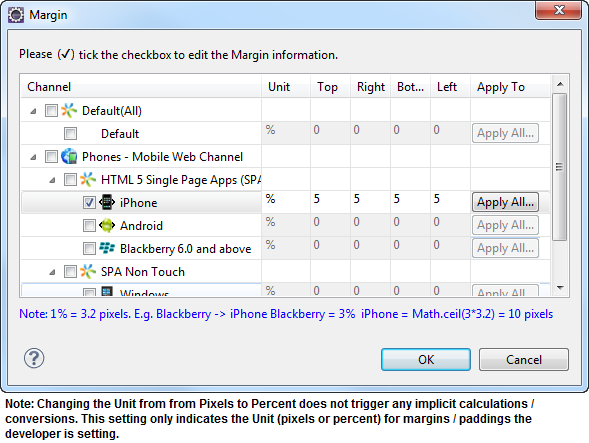

                              

Link - Layout Properties
------------------------

The layout properties for Link widget are:

*   [containerWeight](#containerweight)
*   [contentAlignment](#contentalignment)
*   [hExpand](#hexpand)
*   [margin](#margin)
*   [marginInPixel](#margininpixel)
*   [padding](#padding)
*   [paddingInPixel](#paddinginpixel)
*   [widgetAlignment](#widgetalignment)

### containerWeight

Specifies the percentage of the parent width that should allocated to the widget. The parent widget space is distributed to its child widgets based on this weight factor. All its child widgets should sum up to 100% of width except when placed in _voltmx.ui.ScrollBox_.

Syntax

containerWeight

Type

Number

Read/Write

Yes - (Read and Write)

Example

```

//Defining properties for a link widget with containerWeight:100.
var linkBasic ={id:"link1", skin:"linkSkin", focusSkin:"linkFSkin", text:"Click here", isVisible:true};

var linkLayout={**containerWeight:100**, padding:[5,5,5,5], margin:[5,5,5,5], paddingInPixel:true, marginInPixel:true, hExpand:true};

var linkPSP = {};

//Creating link widget.
var link1 = new voltmx.ui.Link(linkBasic, linkLayout, linkPSP);

//Reading containerWeight of Link
alert("Link containerWeight::"+link1.containerWeight);
```

Accessible from IDE

No

Platform Availability

Available on all platforms

### contentAlignment

Specifies the alignment of the text on the Link with respect to its boundaries. A default value CONTENT\_ALIGN\_CENTER is assigned for all platforms. To choose another alignment, click the drop-down arrow and select the desired alignment. However, to change the default value on a particular platform, select the button next to the drop-down and select respective platform and choose the value.


**Default:** _CONTENT\_ALIGN\_CENTER_ (the default value for all platforms is center; content is aligned at the center of the button)

The following are the available options:

*   CONTENT\_ALIGN\_TOP\_LEFT - Specifies the text should align at top left corner of the button.
*   CONTENT\_ALIGN\_TOP\_CENTER - Specifies the text should align at top center of the button.
*   CONTENT\_ALIGN\_TOP\_RIGHT- Specifies the text should align at top right of the button.
*   CONTENT\_ALIGN\_MIDDLE\_LEFT- Specifies the text should align at middle left of the button.
*   CONTENT\_ALIGN\_CENTER- Specifies the text should align at center of the button.
*   CONTENT\_ALIGN\_MIDDLE\_RIGHT- Specifies the text should align at middle right of the button.
*   CONTENT\_ALIGN\_BOTTOM\_LEFT- Specifies the text should align at bottom left of the button.
*   CONTENT\_ALIGN\_BOTTOM\_CENTER- Specifies the text should align at bottom center of the button.
*   CONTENT\_ALIGN\_BOTTOM\_RIGHT - Specifies the text should align at bottom right of the button.

Syntax

contentAlignment

Type

Number

Read/Write

No

Example

```

//Defining properties for a link widget with contentAlignment:CONTENT_ALIGN_TOP_LEFT 
var linkBasic ={id:"link1", skin:"linkSkin", focusSkin:"linkFSkin", text:"Click here", isVisible:true};

var linkLayout={**contentAlignment:constants.CONTENT_ALIGN_TOP_LEFT**, containerWeight:100, padding:[5,5,5,5], margin:[5,5,5,5], paddingInPixel:true, marginInPixel:true, hExpand:true};

var linkPSP = {};

//Creating link widget.
var link1 = new voltmx.ui.Link(linkBasic, linkLayout, linkPSP);


```

Accessible from IDE

Yes

Platform Availability

Available on all platforms

### hExpand

Specifies if the widget should occupy all the width available to it.

**Default:** _true_

If set to _false,_ the widget occupies the preferred width. The preferred width of a widget is the sum of its contents width, padding and margin.

If set to _true,_ the widget ensures that the entire width available to it, is occupied.


Syntax

hExpand

Type

Boolean

Read/Write

No

Example

```

//Defining properties for a link widget with hExpand:true.
var linkBasic ={id:"link1", skin:"linkSkin", focusSkin:"linkFSkin", text:"Click here", isVisible:true};

var linkLayout={containerWeight:100, padding:[5,5,5,5], margin:[5,5,5,5], paddingInPixel:true, marginInPixel:true, **hExpand:true**};

var linkPSP = {};

//Creating link widget.
var link1 = new voltmx.ui.Link(linkBasic, linkLayout, linkPSP);


```

Accessible from IDE

Yes

Platform Availability

Available on all platforms except Desktop Web, and SPA

### margin

Defines the space around a widget. You can use this option to define the left, top, right, and bottom distance between the widget and the next widget.

To define the margin values for a platform, click the () button against the property to open the _Margin_ screen. Select the checkbox against the platform for which you want to define the margins and enter the top, left, right, and bottom margin values.

If you want to use the margin values set for a platform across other platforms, you can click the _Apply To_ button and select the platforms on which you want the margin values to be applied.

The following image illustrates the window to define the margins for platforms:



The following image illustrates a widget with a defined margin:


Syntax

margin

Type

Array of Numbers

Read/Write

Yes - (Read and Write)

Example

```

//Defining properties for a link widget with margin:[5,5,5,5].
var linkBasic ={id:"link1", skin:"linkSkin", focusSkin:"linkFSkin", text:"Click here", isVisible:true};

var linkLayout={containerWeight:100, padding:[5,5,5,5], **margin:[5,5,5,5]**, paddingInPixel:true, marginInPixel:true, hExpand:true};

var linkPSP = {};

//Creating link widget.
var link1 = new voltmx.ui.Link(linkBasic, linkLayout, linkPSP);


```

Accessible from IDE

Yes

Platform Availability

Available on all platforms.

### marginInPixel

Indicates if the margin is to be applied in pixels or in percentage.

**Default:** _false_

If set to _true,_ the margins are applied in pixels.

If set to _false,_ the margins are applied as set in [margin](#margin) property.

Syntax

marginInPixel

Type

Boolean

Read/Write

No

Example

```

//Defining properties for a link widget with marginInPixel:true.
var linkBasic ={id:"link",skin:"linkSkin", focusSkin:"linkFSkin", text:"Click here", isVisible:true};

var linkLayout={containerWeight:100, padding:[5,5,5,5], margin:[5,5,5,5], paddingInPixel:true, **marginInPixel:true**, hExpand:true};

var linkPSP = {};

//Creating link widget.
var link = new voltmx.ui.Link(linkBasic, linkLayout, linkPSP);
```

Accessible from IDE

Yes

Platform Availability

*   iPhone
*   iPad
*   Android
*   Windows Phone
*   Windows Desktop

### padding

Defines the space between the content of the widget and the widget boundaries. You can use this option to define the top, left, right, and bottom distance between the widget content and the widget boundary.

To define the padding values for a platform, click the () button against the property to open the _Padding_ screen. Select the checkbox against the platform for which you want to define the padding's and enter the top, left, right, and bottom padding values.

If you want to use the padding values set for a platform across other platforms, you can click the _Apply To_ button and select the platforms on which you want the padding values to be applied.

The following image illustrates the window to define the padding's for platforms:

  
  
The following image illustrates a widget with a defined padding:


Syntax

padding

Type

Array of Numbers

Read/Write

Yes - (Read and Write)

Example

```

//Defining properties for a link widget with padding:[5,5,5,5].
var linkBasic ={id:"link", skin:"linkSkin", focusSkin:"linkFSkin", text:"Click here", isVisible:true};

var linkLayout={containerWeight:100, **padding:[5,5,5,5]**, margin:[5,5,5,5], paddingInPixel:true, marginInPixel:true, hExpand:true};

var linkPSP = {};

//Creating link widget.
var link = new voltmx.ui.Link(linkBasic, linkLayout, linkPSP);


```

Accessible from IDE

Yes

Platform Availability

Available on all platforms except Mobile Web (basic).

### paddingInPixel

Indicates if the padding is to be applied in pixels or in percentage.

**Default:** _false_

If set to _true,_ the padding are applied in pixels.

If set to _false,_ the padding are applied as set in [padding](#padding) property.

> **_Note:_** This property can be set to _true_ or _false_ only for iPhone, iPad, Android and Windows Phone. On other platforms this property does not give any results even when set to _true_.

> **_Note:_** For backward compatibility on older projects, this property is will be made _true_ for iPhone, iPad, Android and Windows Phone and for other platforms it will be _false_.

Syntax

paddingInPixel

Type

Boolean

Read/Write

No

Example

```

//Defining properties for a link widget with paddingInPixel:true.
var linkBasic ={id:"link", skin:"linkSkin", focusSkin:"linkFSkin", text:"Click here", isVisible:true};

var linkLayout={containerWeight:100, padding:[5,5,5,5], margin:[5,5,5,5], **paddingInPixel:true**, marginInPixel:true, hExpand:true};

var linkPSP = {};

//Creating link widget.
var link = new voltmx.ui.Link(linkBasic, linkLayout, linkPSP);
```

Accessible from IDE

Yes

Platform Availability

*   iPhone
*   iPad
*   Android
*   Windows Phone
*   Windows Desktop

### widgetAlignment

Indicates how a widget is to be anchored with respect to its parent. Each of these below options have a horizontal alignment attribute and a vertical alignment attribute. For example, WIDGET\_ALIGN\_TOP\_LEFT specifies the vertical alignment as TOP and horizontal alignment as LEFT.

Horizontal alignment attributes are only applicable if [hExpand](#hexpand) is _false_.

Default: WIDGET\_ALIGN\_CENTER

The widget alignment can be controlled by the below options:

*   WIDGET\_ALIGN\_TOP\_LEFT - (BlackBerry 10 supports this option)
*   WIDGET\_ALIGN\_TOP\_CENTER
*   WIDGET\_ALIGN\_TOP\_RIGHT
*   WIDGET\_ALIGN\_MIDDLE\_LEFT
*   WIDGET\_ALIGN\_CENTER - (BlackBerry 10 supports this option)
*   WIDGET\_ALIGN\_MIDDLE\_CENTER
*   WIDGET\_ALIGN\_MIDDLE\_RIGHT
*   WIDGET\_ALIGN\_BOTTOM\_LEFT
*   WIDGET\_ALIGN\_BOTTOM\_CENTER
*   WIDGET\_ALIGN\_BOTTOM\_RIGHT - (BlackBerry 10 supports this option)

Syntax

widgetAlignment

Type

Number

Read/Write

No

Example

```

//Defining properties for a link widget with widgetAlignment:constants.WIDGET_ALIGN_TOP_LEFT.
var linkBasic ={id:"link", skin:"linkSkin",focusSkin:"linkFSkin", text:"Click here",isVisible:true};

var linkLayout={**widgetAlignment:constants.WIDGET_ALIGN_TOP_LEFT**, contentAlignment:constants.CONTENT_ALIGN_TOP_LEFT, containerWeight:100, padding:[5,5,5,5], margin:[5,5,5,5], hExpand:true};

var linkPSP = {};

//Creating link widget.
var link = new voltmx.ui.Link(linkBasic, linkLayout, linkPSP);


```

Accessible from IDE

Yes

Platform Availability

Available on all platforms

