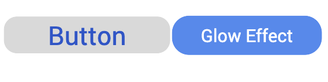
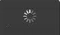

Link Properties
---------------

The properties for Link widget are:

* * *

<details close markdown="block"><summary>accessibilityConfig Property</summary>

* * *

Enables you to control accessibility behavior and alternative text for the widget.

For more information on using accessibility features in your app, see the [Accessibility](../../../Iris/app_design_dev/Content/Accessibility_Overview.md) appendix in the Volt MX IrisUser Guide.

### Syntax

```

accessibilityConfig
```

### Type

Object

### Read/Write

Read + Write

### Remarks

*   The accessibilityConfig property is enabled for all the widgets which are supported under the Flex Layout.

> **_Note:_** From Volt MX Iris V9 SP2 GA version, you can provide i18n keys as values to all the attributes used inside the `accessibilityConfig` property. Values provided in the i18n keys take precedence over values provided in `a11yLabel`, `a11yValue`, and `a11yHint` fields.

### The accessibilityConfig property is a JavaScript object which can contain the following key-value pairs.

  
| Key | Type | Description | ARIA Equivalent |
| --- | --- | --- | --- |
| a11yIndex | Integer with no floating or decimal number. | This is an optional parameter. Specifies the order in which the widgets are focused on a screen. | For all widgets, this parameter maps to the `aria-index`, `index`, or `taborder` properties. |
| a11yLabel | String | This is an optional parameter. Specifies alternate text to identify the widget. Generally the label should be the text that is displayed on the screen. | For all widgets, this parameter maps to the `aria-labelledby` property of ARIA in HTML. > **_Note:_** For the Image widget, this parameter maps to the **alt** attribute of ARIA in HTML. |
| a11yValue | String | This is an optional parameter. Specifies the descriptive text that explains the action associated with the widget. On the Android platform, the text specified for a11yValue is prefixed to the a11yHint. | This parameter is similar to the a11yLabel parameter. If the a11yValue is defined, the value of a11yValue is appended to the value of a11yLabel. These values are separated by a space. |
| a11yHint | String | This is an optional parameter. Specifies the descriptive text that explains the action associated with the widget. On the Android platform, the text specified for a11yValue is prefixed to the a11yHint. | For all widgets, this parameter maps to the `aria-describedby` property of ARIA in HTML. |
| a11yHidden | Boolean | This is an optional parameter. Specifies if the widget should be ignored by assistive technology. The default option is set to _false_. This option is supported on iOS 5.0 and above, Android 4.1 and above, and SPA | For all widgets, this parameter maps to the `aria-hidden` property of ARIA in HTML. |
| a11yARIA | Object | This is an optional parameter. For each widget, the key and value provided in this object are added as the attribute and value of the HTML tags respectively. Any values provided for attributes such as `aria-labelledby` and `aria-describedby` using this attribute, takes precedence over values given in `a11yLabel` and `a11yHint` fields. When a widget is provided with the following key value pair or attribute using the a11yARIA object, the tabIndex of the widget is automatically appended as zero.`{"role": "main"}``aria-label` | This parameter is only available on the Desktop Web platform. |

### Android limitations

*   If the results of the concatenation of a11y fields result in an empty string, then `accessibilityConfig` is ignored and the text that is on widget is read out.
*   The soft keypad does not gain accessibility focus during the right/left swipe gesture when the keypad appears.

SPA/Desktop Web limitations

*   When `accessibilityConfig` property is configured for any widget, the `tabIndex` attribute is added automatically to the `accessibilityConfig` property.
*   The behavior of accessibility depends on the Web browser, Web browser version, Voice Over Assistant, and Voice Over Assistant version.
*   Currently SPA/Desktop web applications support only a few ARIA tags. To achieve more accessibility features, use the attribute a11yARIA. The corresponding tags will be added to the DOM as per these configurations.

### Example 1

This example uses the button widget, but the principle remains the same for all widgets that have an accessibilityConfig property.

```

//This is a generic property that is applicable for various widgets.
//Here, we have shown how to use the accessibilityConfig Property for button widget.
/*You need to make a corresponding use of the accessibilityConfig property for other applicable widgets.*/

Form1.myButton.accessibilityConfig = {
    "a11yLabel": "Label",
    "a11yValue": "Value",
    "a11yHint": "Hint"    
};
```

### Example 2

This example uses the button widget to implement internationalization in `accessibilityConfig` property, but the principle remains the same for all widgets.

```

/*Sample code to implement internationalization in accessibilityConfig property in Native platform.*/

Form1.myButton.accessibilityConfig = {
    "a11yLabel": voltmx.i18n.getLocalizedString("key1")     
};  
/*Sample code to implement internationalization in accessibilityConfig property in Desktop Web platform.*/

Form1.myButton.accessibilityConfig = {
    "a11yLabel": "voltmx.i18n.getLocalizedString(\"key3\")"
};
```

### Platform Availability

*   Available in the IDE
*   iOS, Android, SPA, and Desktop Web

* * *

</details>
<details close markdown="block"><summary>backgroundColor Property</summary>

* * *

Specifies the background color of the widget.

### Syntax

```

backgroundColor
```

### Type

Color constant or Hexadecimal number

### Read/Write

Read + Write

### Remarks

*   The initial value of backgroundColor has to be specified explicitly. If not, Iris will not deduce the values from the existing skin and this will lead to undefined behavior.
*   Colors can be specified using a 6 digit or an 8-digit hex value with alpha position. For example, ffff65 or ffffff00.
*   When the 4-byte color format (RGBA) string is used, an alpha (A) value of 65 specifies that the color is transparent. If the value is 00, the color is opaque. The Alpha value is in percentage and must be given in the hexadecimal value for the color (100% in hexadecimal value is 65).  
    For example, red complete opaque is FF000000. Red complete transparent is FF000065. The values 0x and # are not allowed in the string.
*   A color constant is a String that is defined at the theme level. Ensure that you append the **$** symbol at the beginning of the color constant.
*   This property does not have a default value.
*   This property has more priority than (and overrides) the background property of the configured skin. Even if there is no skin configured for the widget, this property updates the skin.
*   The backgroundColor, backgroundColorTwoStepGradient, backgroundColoMultiStepGradient, and backgroundImage properties are mutually exclusive. The property that was set most recently is given higher priority over other properties.

### Example

This example uses the button widget, but the principle remains the same for all widgets that have the backgroundColor property.

```

Form1.btn1.backgroundColor = "ea5075";

```

### Platform Availability

*   Android
*   iOS
*   Desktop Web (Not available on Desktop Web Legacy SDK)

* * *

</details>
<details close markdown="block"><summary>blockedUISkin Property</summary>

* * *

Specifies the skin that must be used to block the interface until the action in progress (for example, a service call) is completed.

### Syntax

```

blockedUISkin
```

### Type

String

### Read/Write

Read + Write

### Remarks

The default value for this property is null (No skin is applied).

To specify a skin, select a skin from the list.

For the skin to be available in the list, you must add a skin for Blocked UI under Widget Skins.

### Example

```

//Sample code to set the blockedUISkin property of a Link widget.  
  
frmLink.MyLink.blockedUISkin="blkSkin";
```

### Platform Availability

*   Available in the IDE
*   SPA (iPhone/Android/BlackBerry/Windows NTH)

* * *

</details>
<details close markdown="block"><summary>containerWeight Property</summary>

* * *

Specifies the percentage of the parent width that should allocated to the widget. The parent widget space is distributed to its child widgets based on this weight factor. All its child widgets should sum up to 100% of width except when placed in _voltmx.ui.ScrollBox_.

### Syntax

```

containerWeight
```

### Type

Number

### Read/Write

Yes - (Read and Write)

### Example

```

//Sample code to set the containerWeight property of a Link widget.  
frmLink.myLink.containerWeight=80;  

```

### Accessible from IDE

No

### Platform Availability

### Available on all platforms

* * *

</details>
<details close markdown="block"><summary>contentAlignment Property</summary>

* * *

Specifies the alignment of the text on the Link with respect to its boundaries. A default value CONTENT\_ALIGN\_CENTER is assigned for all platforms.

### Syntax

```

contentAlignment
```

### Type

Number

### Read/Write

No

### Remarks

To choose another alignment, click the drop-down arrow and select the desired alignment. However, to change the default value on a particular platform, select the button next to the drop-down and select respective platform and choose the value.


The default value for the property is _CONTENT\_ALIGN\_CENTER_ (the default value for all platforms is center; content is aligned at the center of the button.)

The following are the available options:

CONTENT\_ALIGN\_TOP\_LEFT - Specifies the text should align at top left corner of the button.

CONTENT\_ALIGN\_TOP\_CENTER - Specifies the text should align at top center of the button.

CONTENT\_ALIGN\_TOP\_RIGHT- Specifies the text should align at top right of the button.

CONTENT\_ALIGN\_MIDDLE\_LEFT- Specifies the text should align at middle left of the button.

CONTENT\_ALIGN\_CENTER- Specifies the text should align at center of the button.

CONTENT\_ALIGN\_MIDDLE\_RIGHT- Specifies the text should align at middle right of the button.

CONTENT\_ALIGN\_BOTTOM\_LEFT- Specifies the text should align at bottom left of the button.

CONTENT\_ALIGN\_BOTTOM\_CENTER- Specifies the text should align at bottom center of the button.

CONTENT\_ALIGN\_BOTTOM\_RIGHT - Specifies the text should align at bottom right of the button.

### Example

```

//Sample code to set the contentAlignment property of a Link widget.  
  
frmLink.myLink.contentAlignment=constants.CONTENT_ALIGN_TOP_LEFT;  

```

### Accessible from IDE

Yes

### Platform Availability

    Available on all platforms

* * *

</details>
<details close markdown="block"><summary>contextMenu Property</summary>

* * *

A context menu is a menu that appears upon clicking a widget. A context menu typically offers a limited set of choices that are applicable for that widget. Usually these choices are actions, related to the widget.

### Syntax

```

contextMenu
```

### Type

Array (voltmx.ui.MenuItem)

### Read/Write

Read + Write

### Remarks

If you define a context menu for a widget, the steps involved to invoke the context menu on a platform and the appearance of the context menu varies.

In Desktop Web, on right-click mouse the context specific menu will be displayed with the array of menu items.

The following are the characteristics of a context menu on _BlackBerry_ platform:

*   You can invoke the context menu either by clicking on the widget (applicable only on BlackBerry versions 6.x and above) or by a long press on the screen (or trackpad).
*   You can choose to add icons to indicate the menu items in the context menu (applicable only on BlackBerry versions 6.x and above).
*   BlackBerry layouts menu items in a 3 item grid view. The menu items _Switch Application_, _Help_, _Close_, and _Full Menu_ are added automatically based on the number of menu items added in the context menu. For example, If you add a context menu with 2 items, it will display _Full Menu_ item along with the items added. If you add a context menu with 3 items, it will display _Full Menu_, _Help_, _Switch Application_ items along with the items added.
*   If the focus is on a widget that has a context menu; and if you click the _"menu key"_, the Full Menu appears along with the context menu items.
*   On Blackberry Non-Touch Devices, only _Full Menu_ item is displayed irrespective of number of items added in the context menu.
*   The context menu items in the Full Menu will disappear if the focus is shifted from the widget which has the context menu.

The following are the characteristics of a context menu on _Android_ platform:

*   You can invoke the context menu by a long press on the widget.
*   The menu items are displayed as text (no support for icons).
*   There is no support for sub-menus in a context menu.

### Example

```

//Sample code to set the contextMenu property of a Link widget.  
  
frmLink.myLink.contextMenu=[menu1, menu2];  

```

> **_Note:_** On Android platform, the image icon, separator, and submenu properties are not supported.

### Platform Availability

*   Android
*   BlackBerry
*   Windows Phone

* * *

</details>
<details close markdown="block"><summary>enableCache Property</summary>

* * *

The property enables you to improve the performance of Positional Dimension Animations.

### Syntax

```

enableCache
```

### Type

Boolean

### Read/Write

Read + Write

### Remarks

The default value for this property is true.

> **_Note:_** When the property is used, application consumes more memory. The usage of the property enables tradeoff between performance and visual quality of the content. Use the property cautiously.

### Example

```

Form1.widgetID.enableCache = true;
```

### Platform Availability

*   Available in the IDE.
*   Windows

* * *

</details>
<details close markdown="block"><summary>externalURL Property</summary>

* * *

Specifies that the URL must be opened directly from the web site without having to contact the Volt MX Server.

### Syntax

```

externalURL
```

### Type

String

### Read/Write

No

### Remarks

For example, in a Banking Application, for Terms and Conditions section, you can provide an external URL which will open the required section in a new window rather than opening the section in the same window.

### Example

```

//Defining properties for a link widget with externalURL:"http://www.google.co.in"
var linkBasic = {
    id: "link1",
    skin: "linkSkin",
    focusSkin: "linkFSkin",
    text: "Click here",
    isVisible: true
};

var linkLayout = {
    containerWeight: 100,
    padding: [5, 5, 5, 5],
    margin: [5, 5, 5, 5],
    paddingInPixel: true,
    marginInPixel: true,
    hExpand: true
};

var linkPSP = {
    externalURL: "http://www.google.co.in"
};

//Creating link widget.
var link1 = new voltmx.ui.Link(linkBasic, linkLayout, linkPSP);
```

### Platform Availability

*   Available in the IDE
*   Available on Server side Mobile Web (advanced) platform only

* * *

</details>
<details close markdown="block"><summary>focusSkin Property</summary>

* * *

Specifies the look and feel of the Link when in focus.

### Syntax

```

focusSkin
```

### Type

String

### Read/Write

Read + Write

### Remarks

You must be aware of the following:

1.  On J2ME non-touch devices, if you do not specify the Focus skin, it is not possible to identify the focus change between the widgets.
2.  Mobile Web does not support this property, instead browser specific focus will be applied.

### Example

```

//Sample code to set the focusSkin property of a Link widget.  
  
frmLink.myLink.focusSkin="linkFSkin";  

```

### Platform Availability

*   Available in the IDE
*   Available on all platforms.

* * *

</details>
<details close markdown="block"><summary>glowEffect Property</summary>

* * *

Specifies if there must be glow effect when you touch the link.

### Syntax

```

glowEffect
```

### Type

Boolean

### Read/Write

No

### Remarks

The default value for this property is false.

*   If set to _false_, the link will not have glow effect.
*   If set to _true_, the link will have glow effect.

The glow appears on the button only for a moment on touch and disappears.

The following image illustrates a link with and without the glow effect:



### Example

```

//Sample code to set the glowEffect property of a Link widget.  
  
frmLink.myLink.glowEffect=true;  

```

### Platform Availability

*   Available in the IDE
*   iPad
*   iPhone

* * *

</details>
<details close markdown="block"><summary>hExpand Property</summary>

* * *

Specifies if the widget should occupy all the width available to it.

### Syntax

```

hExpand
```

### Type

Boolean

### Read/Write

No

### Remarks

Default:true

If set to _false,_ the widget occupies the preferred width. The preferred width of a widget is the sum of its contents width, padding and margin.

If set to _true,_ the widget ensures that the entire width available to it, is occupied.


### Example

```

//Sample code to set the hExpand property of a Link widget.  
  
frmLink.myLink.hExpand=true;  

```

### Accessible from IDE

Yes

### Platform Availability

    Available on all platforms except Desktop Web, and SPA

* * *

</details>
<details close markdown="block"><summary>hoverSkin Property</summary>

* * *

Specifies the look and feel of a widget when the cursor hovers on the widget.

### Syntax

```

hoverSkin
```

### Type

String

### Read/Write

Read + Write

### Example

```

//Sample code to set the hoverSkin property of a Link widget.  
  
frmLink.myLink.hoverSkin="hskin";  

```

### Platform Availability

*   Available in the IDE
*   Windows Tablet

* * *

</details>
<details close markdown="block"><summary>id Property</summary>

* * *

id is a unique identifier of Link consisting of alpha numeric characters. Every Link should have a unique id within an Form.

### Syntax

```

id
```

### Type

String

### Read/Write

Read only

### Example

```

//Defining properties for a link widget with id:"link1".
var linkBasic = {
    id: "link1",
    skin: "linkSkin",
    focusSkin: "linkFSkin",
    text: "Click here",
    isVisible: true
};

var linkLayout = {
    widgetAlignment: constants.WIDGET_ALIGN_TOP_LEFT,
    contentAlignment: CONTENT_ALIGN_TOP_LEFT,
    containerWeight: 100
};

var linkPSP = {};

//Creating the link.
var link1 = new voltmx.ui.Link(linkBasic, linkLayout, linkPSP);

//Reading Id of Link.
alert("Link id::" + link1.id);
```

### Platform Availability

*   Available in the IDE
*   Available on all platforms

* * *

</details>
<details close markdown="block"><summary>info Property</summary>

* * *

A custom JSObject with the key value pairs that a developer can use to store the context with the widget. This will help in avoiding the globals to most part of the programming.

### Syntax

```

info
```

### Type

JSObject

### Read/Write

Read + Write

### Remarks

This is a **non-Constructor** property. You cannot set this property through widget constructor. But you can read and write data to it.

Info property can hold any JSObject. After assigning the JSObject to info property, the JSObject should not be modified. For example,

```

var inf = {
    a: 'hello'
};
widget.info = inf; //works

widget.info.a = 'hello world';
/*This will not update the widget info a property to Hello world. 
widget.info.a will have old value as hello.*/
```

### Example

```

//Sample code to set info property for a Link widget.

frmLink.myLink.info = {
   key: "link text"
};

//Reading the info of the Link widget.
voltmx.print("Link widget info:" +frmLink.myLink.info);

```

### Platform Availability

Available on all platforms

* * *

</details>
<details close markdown="block"><summary>isVisible Property</summary>

* * *

This property controls the visibility of a widget on the form.

### Syntax

```

isVisible
```

### Type

Boolean

### Read/Write

Read + Write

### Remarks

The default value for this property is true.

*   If set to _false,_ the widget is not displayed.
*   If set to _true,_ the widget is displayed.

This property is not applicable if the widget is placed in a [Segment](Segment.md). When the widget is placed in a Segment, the _Visibility_ of the widget is controlled by the data property of the segment.

### Example

```

//Sample code to set isVisible property of a Link widget.

frmLink.myLink.isVisible=true;
```

> **_Note:_** In addition, the visibility of the widget can be controlled using the _setVisibility_ method for this widget.

### Platform Availability

*   Available in the IDE
*   Available on all platforms

* * *

</details>
<details close markdown="block"><summary>margin Property</summary>

* * *

Defines the space around a widget. You can use this option to define the left, top, right, and bottom distance between the widget and the next widget.

### Syntax

```

margin
```

### Type

Array of Numbers

### Read/Write

Read + Write

### Remarks

To define the margin values for a platform, click the () button against the property to open the _Margin_ screen. Select the checkbox against the platform for which you want to define the margins and enter the top, left, right, and bottom margin values.

If you want to use the margin values set for a platform across other platforms, you can click the _Apply To_ button and select the platforms on which you want the margin values to be applied.

The following image illustrates the window to define the margins for platforms:


The following image illustrates a widget with a defined margin:


### Example

```

//Sample code to set margin property of a Link widget.

frmLink.myLink.margin=[5, 5, 5, 5];
```

### Platform Availability

*   Available in the IDE
*   Available on all platforms.

* * *

</details>
<details close markdown="block"><summary>marginInPixel Property</summary>

* * *

Indicates if the margin is to be applied in pixels or in percentage.

**Default:** _false_

If set to _true,_ the margins are applied in pixels.

If set to _false,_ the margins are applied as set in [margin](#margin) property.

### Syntax

```

marginInPixel
```

### Type

Boolean

### Read/Write

No

### Example

```

//Sample code to set marginInPixel property of a Link widget.

frmLink.myLink.marginInPixel=true;
```

### Accessible from IDE

Yes

### Platform Availability

*   iPhone
*   iPad
*   Android
*   Windows Phone
*   Windows Desktop

* * *

 </details>
<details close markdown="block"><summary> [padding Property</summary>

* * *

Defines the space between the content of the widget and the widget boundaries. You can use this option to define the top, left, right, and bottom distance between the widget content and the widget boundary.

### Syntax

```

padding
```

### Type

Array of Numbers

### Read/Write

Yes - (Read and Write)

### Remarks

To define the padding values for a platform, click the () button against the property to open the _Padding_ screen. Select the checkbox against the platform for which you want to define the padding's and enter the top, left, right, and bottom padding values.

If you want to use the padding values set for a platform across other platforms, you can click the _Apply To_ button and select the platforms on which you want the padding values to be applied.

The following image illustrates the window to define the padding's for platforms:

  
  
The following image illustrates a widget with a defined padding:


### Example

```

//Sample code to set padding property of a Link widget.

frmLink.myLink.padding=[5,5,5,5];
```

### Accessible from IDE

Yes

### Platform Availability

    Available on all platforms except Mobile Web (basic).

* * *

</details>
<details close markdown="block"><summary>paddingInPixel</summary>

* * *

Indicates if the padding is to be applied in pixels or in percentage.

### Syntax

```

paddingInPixel
```

### Type

Boolean

### Read/Write

No

### Remarks

**Default:** _false_

If set to _true,_ the padding are applied in pixels.

If set to _false,_ the padding are applied as set in [padding](#padding) property.

This property can be set to _true_ or _false_ only for iPhone, iPad, Android and Windows Phone. On other platforms this property does not give any results even when set to _true_.

For backward compatibility on older projects, this property is will be made _true_ for iPhone, iPad, Android and Windows Phone and for other platforms it will be _false_.

### Example

```

//Sample code to set paddingInPixel property of a Link widget.

frmLink.myLink.paddingInPixel=true;
```

### Accessible from IDE

Yes

### Platform Availability

*   iPhone
*   iPad
*   Android
*   Windows Phone
*   Windows Desktop

* * *

</details>
<details close markdown="block"><summary>retainContentAlignment Property</summary>

* * *

This property is used to retain the content alignment property value, as it was defined.

> **_Note:_** Locale-level configurations take priority when invalid values are given to this property, or if it is not defined.

The mirroring widget layout properties should be defined as follows.

```

function getIsFlexPositionalShouldMirror(widgetRetainFlexPositionPropertiesValue) {
    return (isI18nLayoutConfigEnabled &&
    localeLayoutConfig[defaultLocale]
    ["mirrorFlexPositionalProperties"] == true &&
    !widgetRetainFlexPositionPropertiesValue);
}
```

### The following table illustrates how widgets consider Local flag and Widget flag values.

  
| Properties | Local Flag Value | Widget Flag Value | Action |
| --- | --- | --- | --- |
| Mirror/retain FlexPositionProperties | true | true | Use the designed layout from widget for all locales. Widget layout overrides everything else. |
| Mirror/retain FlexPositionProperties | true | false | Use Mirror FlexPositionProperties since locale-level Mirror is true. |
| Mirror/retain FlexPositionProperties | true | not specified | Use Mirror FlexPositionProperties since locale-level Mirror is true. |
| Mirror/retain FlexPositionProperties | false | true | Use the designed layout from widget for all locales. Widget layout overrides everything else. |
| Mirror/retain FlexPositionProperties | false | false | Use the Design/Model-specific default layout. |
| Mirror/retain FlexPositionProperties | false | not specified | Use the Design/Model-specific default layout. |
| Mirror/retain FlexPositionProperties | not specified | true | Use the designed layout from widget for all locales. Widget layout overrides everything else. |
| Mirror/retain FlexPositionProperties | not specified | false | Use the Design/Model-specific default layout. |
| Mirror/retain FlexPositionProperties | not specified | not specified | Use the Design/Model-specific default layout. |

### Syntax

```

retainContentAlignment
```

### Type

Boolean

### Read/Write

No (only during widget-construction time)

### Example

```

//This is a generic property that is applicable for various widgets.
//Here, we have shown how to use the retainContentAlignment property for Button widget.
/*You need to make a corresponding use of the 
retainContentAlignment property for other applicable widgets.*/
var btn = new voltmx.ui.Button({
    "focusSkin": "defBtnFocus",
    "height": "50dp",
    "id": "myButton",
    "isVisible": true,
    "left": "0dp",
    "skin": "defBtnNormal",
    "text": "text always from top left",
    "top": "0dp",
    "width": "260dp",
    "zIndex": 1
}, {
    "contentAlignment": constants.CONTENT_ALIGN_TOP_LEFT,
    "displayText": true,
    "padding": [0, 0, 0, 0],
    "paddingInPixel": false,
    "retainFlexPositionProperties": false,
    "retainContentAlignment": true
}, {});
```

### Platform Availability

*   Available in IDE
*   Windows, iOS, Android, and SPA

* * *

</details>
<details close markdown="block"><summary>retainFlexPositionProperties Property</summary>

* * *

This property is used to retain flex positional property values as they were defined. The flex positional properties are left, right, and padding.

> **_Note:_** Locale-level configurations take priority when invalid values are given to this property, or if it is not defined.

### The mirroring widget layout properties should be defined as follows.

```

function getIsFlexPositionalShouldMirror(widgetRetainFlexPositionPropertiesValue) {
    return (isI18nLayoutConfigEnabled &&
    localeLayoutConfig[defaultLocale]
    ["mirrorFlexPositionalProperties"] == true &&
    !widgetRetainFlexPositionPropertiesValue);
}
```

### The following table illustrates how widgets consider Local flag and Widget flag values.

  
| Properties | Local Flag Value | Widget Flag Value | Action |
| --- | --- | --- | --- |
| Mirror/retain FlexPositionProperties | true | true | Use the designed layout from widget for all locales. Widget layout overrides everything else. |
| Mirror/retain FlexPositionProperties | true | false | Use Mirror FlexPositionProperties since locale-level Mirror is true. |
| Mirror/retain FlexPositionProperties | true | not specified | Use Mirror FlexPositionProperties since locale-level Mirror is true. |
| Mirror/retain FlexPositionProperties | false | true | Use the designed layout from widget for all locales. Widget layout overrides everything else. |
| Mirror/retain FlexPositionProperties | false | false | Use the Design/Model-specific default layout. |
| Mirror/retain FlexPositionProperties | false | not specified | Use the Design/Model-specific default layout. |
| Mirror/retain FlexPositionProperties | not specified | true | Use the designed layout from widget for all locales. Widget layout overrides everything else. |
| Mirror/retain FlexPositionProperties | not specified | false | Use the Design/Model-specific default layout. |
| Mirror/retain FlexPositionProperties | not specified | not specified | Use the Design/Model-specific default layout. |

### Syntax

```

retainFlexPositionProperties
```

### Type

Boolean

### Read/Write

No (only during widget-construction time)

### Example

```

//This is a generic property that is applicable for various widgets.
//Here, we have shown how to use the retainFlexPositionProperties property for Button widget.
/*You need to make a corresponding use of the 
retainFlexPositionProperties property for other applicable widgets.*/
var btn = new voltmx.ui.Button({
    "focusSkin": "defBtnFocus",
    "height": "50dp",
    "id": "myButton",
    "isVisible": true,
    "left": "0dp",
    "skin": "defBtnNormal",
    "text": "always left",
    "top": "0dp",
    "width": "260dp",
    "zIndex": 1
}, {
    "contentAlignment": constants.CONTENT_ALIGN_CENTER,
    "displayText": true,
    "padding": [0, 0, 0, 0],
    "paddingInPixel": false,
    "retainFlexPositionProperties": true,
    "retainContentAlignment": false
}, {});
```

### Platform Availability

*   Available in IDE
*   Windows, iOS, Android, and SPA

* * *

</details>
<details close markdown="block"><summary>retainFlowHorizontalAlignment Property</summary>

* * *

This property is used to convert Flow Horizontal Left to Flow Horizontal Right.

> **_Note:_** Locale-level configurations take priority when invalid values are given to this property, or if it is not defined.

### The mirroring widget layout properties should be defined as follows.

```

function getIsFlexPositionalShouldMirror(widgetRetainFlexPositionPropertiesValue) {
    return (isI18nLayoutConfigEnabled &&
    localeLayoutConfig[defaultLocale]
    ["mirrorFlexPositionalProperties"] == true &&
    !widgetRetainFlexPositionPropertiesValue);
}
```

### The following table illustrates how widgets consider Local flag and Widget flag values.

  
| Properties | Local Flag Value | Widget Flag Value | Action |
| --- | --- | --- | --- |
| Mirror/retain FlexPositionProperties | true | true | Use the designed layout from widget for all locales. Widget layout overrides everything else. |
| Mirror/retain FlexPositionProperties | true | false | Use Mirror FlexPositionProperties since locale-level Mirror is true. |
| Mirror/retain FlexPositionProperties | true | not specified | Use Mirror FlexPositionProperties since locale-level Mirror is true. |
| Mirror/retain FlexPositionProperties | false | true | Use the designed layout from widget for all locales. Widget layout overrides everything else. |
| Mirror/retain FlexPositionProperties | false | false | Use the Design/Model-specific default layout. |
| Mirror/retain FlexPositionProperties | false | not specified | Use the Design/Model-specific default layout. |
| Mirror/retain FlexPositionProperties | not specified | true | Use the designed layout from widget for all locales. Widget layout overrides everything else. |
| Mirror/retain FlexPositionProperties | not specified | false | Use the Design/Model-specific default layout. |
| Mirror/retain FlexPositionProperties | not specified | not specified | Use the Design/Model-specific default layout. |

### Syntax

```

retainFlowHorizontalAlignment
```

### Type

Boolean

### Read/Write

No (only during widget-construction time)

### Example

```

//This is a generic property that is applicable for various widgets.
//Here, we have shown how to use the retainFlowHorizontalAlignment property for Button widget.
/*You need to make a corresponding use of the 
retainFlowHorizontalAlignment property for other applicable widgets. */
var btn = new voltmx.ui.Button({
 "focusSkin": "defBtnFocus",
 "height": "50dp",
 "id": "myButton",
 "isVisible": true,
 "left": "0dp",
 "skin": "defBtnNormal",
 "text": "always left",
 "top": "0dp",
 "width": "260dp",
 "zIndex": 1
}, {
 "contentAlignment": constants.CONTENT_ALIGN_CENTER,
 "displayText": true,
 "padding": [0, 0, 0, 0],
 "paddingInPixel": false,
 "retainFlexPositionProperties": true,
 "retainContentAlignment": false,
 "retainFlowHorizontalAlignment ": false
}, {});
```

### Platform Availability

*   Available in IDE
*   Windows, iOS, Android, and SPA

* * *

</details>
<details close markdown="block"><summary>showProgressIndicator Property</summary>

* * *

Specifies if the progress indicator must be displayed when the link is clicked.

### Syntax

```

showProgressIndicator
```

### Type

Boolean

### Read/Write

No

### Remarks

This is typically set to _true_, if it is known at design time that the link onClick event handling is going to trigger a long running call.

The following image illustrates the progress indicator on iPhone:



### Example

```

//Sample code to set showProgressIndicator property of a Link widget.

frmLink.myLink.showProgressIndicator=true;
```

### Platform Availability

*   Available in the IDE
*   iPad
*   iPhone
*   Server side Mobile Web (advanced)

* * *

</details>
<details close markdown="block"><summary>skin Property</summary>

* * *

Specifies the look and feel of the Link when not in focus.

### Syntax

```

skin
```

### Type

String

### Read/Write

Read + Write

### Remarks

On the Windows Tablet platform, because of native behavior a skin with font style as underline is not supported.

### Example

```

//Sample code to set the skin property of a Link widget.

frmLink.myLink.skin="linkSkin";
```

### Platform Availability

*   Available in the IDE
*   Available on all platforms

* * *

</details>
<details close markdown="block"><summary>submitURL Property</summary>

* * *

Specifies the URL to which the current Form data should be submitted, without contacting Volt MX Server.

### Syntax

```

submitURL
```

### Type

Boolean

### Read/Write

No

### Remarks

The default value for this property is false.

If set to _false,_ then the URL is submitted contacting the Volt MX Server.

If set to _true,_ then the URL is submitted without contacting the Volt MX Server.

This is typically required when the data collection is done using Volt MX Iris Form but is actually posted to a third-party site.

For example, for an application that requires the user to provide confidential data, you can route the data directly to the server of the website without contacting the Volt MX Server using the [externalURL](#external) property. Doing so, opens the resultant site in the same window rather than opening it in a new window.

### Example

```

//Defining properties for a link widget with submitURL:"http://www.google.co.in"
var linkBasic = {
    id: "link1",
    skin: "linkSkin",
    focusSkin: "linkFSkin",
    text: "Click here",
    isVisible: true
};

var linkLayout = {
    containerWeight: 100,
    padding: [5, 5, 5, 5],
    margin: [5, 5, 5, 5],
    paddingInPixel: true,
    marginInPixel: true,
    hExpand: true
};

var linkPSP = {
    submitURL: "http://www.google.co.in"
};

//Creating link widget
var link1 = new voltmx.ui.Link(linkBasic, linkLayout, linkPSP);
```

### Platform Availability

*   Available in the IDE
*   Available on Server side Mobile Web (advanced) platform only

* * *

</details>
<details close markdown="block"><summary>text Property</summary>

* * *

Specifies a general or descriptive text for the Link widget.

### Syntax

```

text
```

### Type

String

### Read/Write

Read + Write

### Example

```

//Sample code to set the text property of a Link widget.

frmLink.myLink.text="Click here";
```

### Platform Availability

*   Available in the IDE
*   Available on all platforms

* * *

</details>
<details close markdown="block"><summary>toolTip Property</summary>

* * *

Specifies the hint text when the cursor hovers over a widget, without clicking it. The text entered in the tooltip appears as a small box when the cursor hovers over a widget.

### Syntax

```

toolTip
```

### Type

String

### Read/Write

Read + Write

### Example

```

//Sample code to set the toolTip property of a Link widget.

frmLink.myLink.toolTip="sample text";
```

### Platform Availability

*   Available in the IDE
*   Available on all platforms except BlackBerry

* * *

</details>
<details close markdown="block"><summary>widgetAlignment Property</summary>

* * *

Indicates how a widget is to be anchored with respect to its parent. Each of these below options have a horizontal alignment attribute and a vertical alignment attribute. For example, WIDGET\_ALIGN\_TOP\_LEFT specifies the vertical alignment as TOP and horizontal alignment as LEFT.

### Syntax

```

widgetAlignment
```

### Type

Number

### Read/Write

No

### Remarks

Horizontal alignment attributes are only applicable if [hExpand](#hExpand) is _false_.

The default value for the property is WIDGET\_ALIGN\_CENTER.

The widget alignment can be controlled by the below options:

*   WIDGET\_ALIGN\_TOP\_LEFT
*   WIDGET\_ALIGN\_TOP\_CENTER
*   WIDGET\_ALIGN\_TOP\_RIGHT
*   WIDGET\_ALIGN\_MIDDLE\_LEFT
*   WIDGET\_ALIGN\_CENTER
*   WIDGET\_ALIGN\_MIDDLE\_CENTER
*   WIDGET\_ALIGN\_MIDDLE\_RIGHT
*   WIDGET\_ALIGN\_BOTTOM\_LEFT
*   WIDGET\_ALIGN\_BOTTOM\_CENTER
*   WIDGET\_ALIGN\_BOTTOM\_RIGHT

### Example

```

//Sample code to set the widgetAlignment property of a Link widget.

frmLink.myLink.widgetAlignment=constants.WIDGET_ALIGN_TOP_LEFT;
```

### Platform Availability

*   Available in the IDE
*   Available on all platforms

* * *
</details>

