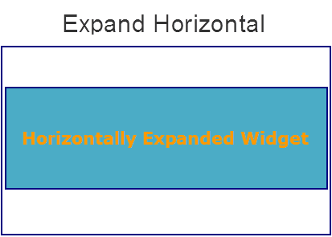
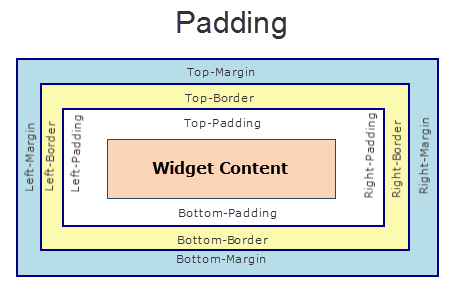

ObjectSelector3D Properties
---------------------------

The properties for ObjectSelector3D widget are:

* * *

<details close markdown="block"><summary>containerWeight Property</summary>

* * *

Specifies the percentage of width that should allocated by its parent widget. The parent widget space is distributed to its child widgets based on this weight factor. All its child widgets should sum up to 100% of weight except when placed in _voltmx.ui.ScrollBox_.

### Syntax

```

containerWeight
```

### Type

Number ( less than 100)

### Read/Write

Yes - (Read and Write)

### Example

```

//Defining the properties for ObjectSelector3D with containerWeight:70
var objBasic = {id:"objThreeD",
	skin:"ObjSkin",
	focusSkin:"ObjFSkin",
	text:"Seat reservation",
	isVisible:true};

var objLayout = {widgetAlignment:constants.WIDGET_ALIGN_CENTER,
	padding:[5,5,5,5],
	contentAlignment:constants.CONTENT_ALIGN_CENTER,
	**containerWeight:70**,
	margin:[5,5,5,5],
	paddingInPixel:true,
	marginInPixel:true,
	hExpand:false,
	vExpand:false};

//Creating the ObjectSelector3D.
var objThreeD =new voltmx.ui.ObjectSelector3D(objBasic, objLayout, {});
```

### Accessible from IDE

Yes

### Platform Availability

	Available on Windows Phone platform only.

* * *

</details>
<details close markdown="block"><summary>contentAlignment Property</summary>

* * *

Specifies the alignment of the text on the ObjectSelector3D with respect to its boundaries. A default value CONTENT\_ALIGN\_MIDDLE\_LEFT is assigned for all platforms.

### Syntax

```

contentAlignment
```

### Type

Number

### Read/Write

No

### Remarks

To choose another alignment, click the drop-down arrow and select the desired alignment. However, to change the default value on a particular platform, select the button next to the drop-down and select respective platform and choose the value.


**Default:** CONTENT\_ALIGN\_MIDDLE\_LEFT

The following are the available options:

CONTENT\_ALIGN\_TOP\_LEFT - Specifies the text should align at top left corner of the widget.

CONTENT\_ALIGN\_TOP\_CENTER - Specifies the text should align at top center of the widget.

CONTENT\_ALIGN\_TOP\_RIGHT- Specifies the text should align at top right of the widget.

CONTENT\_ALIGN\_MIDDLE\_LEFT- Specifies the text should align at middle left of the widget.

CONTENT\_ALIGN\_CENTER- Specifies the text should align at center of the widget.

CONTENT\_ALIGN\_MIDDLE\_RIGHT- Specifies the text should align at middle right of the widget.

CONTENT\_ALIGN\_BOTTOM\_LEFT- Specifies the text should align at bottom left of the widget.

CONTENT\_ALIGN\_BOTTOM\_CENTER- Specifies the text should align at bottom center of the widget.

CONTENT\_ALIGN\_BOTTOM\_RIGHT - Specifies the text should align at bottom right of the widget.

### Example

```

/*Defining the properties for ObjectSelector3D with contentAlignment:
constants.CONTENT_ALIGN_CENTER*/
var objBasic = {id:"objThreeD",
	skin:"ObjSkin",focusSkin:"ObjFSkin",
	text:"Seat reservation",
	isVisible:true};

var objLayout = {widgetAlignment:constants.WIDGET_ALIGN_CENTER,
	paddingInPixel:true,
	marginInPixel:true, **contentAlignment:constants.CONTENT_ALIGN_CENTER**,
	containerWeight:99,
	padding:[5,5,5,5],
	margin:[5,5,5,5],
	hExpand:false,
	vExpand:false};

//Creating the ObjectSelector3D.
var objThreeD =new voltmx.ui.ObjectSelector3D(objBasic, objLayout, {});
```

### Accessible from IDE

Yes

### Platform Availability

	Available on Windows Phone platform only.

* * *

</details>
<details close markdown="block"><summary>enableCache Property</summary>

* * *

The property enables you to improve the performance of Positional Dimension Animations.

### Syntax

```

enableCache
```

### Type

Boolean

### Read/Write

Read + Write

### Remarks

The default value for this property is true.

> **_Note:_** When the property is used, application consumes more memory. The usage of the property enables tradeoff between performance and visual quality of the content. Use the property cautiously.

### Example

```

Form1.widgetID.enableCache = true;
```

### Platform Availability

*   Available in the IDE.
*   Windows

* * *

</details>
<details close markdown="block"><summary>focusSkin Property</summary>

* * *

Specifies the look and feel of the ObjectSelector3D when in focus.

### Syntax

```

focusSkin
```

### Type

String

### Read/Write

Yes - (Read and Write)

### Example

```

//Defining the properties for ObjectSelector3D with focusSkin:"ObjFSkin"
var objBasic = {id:"objThreeD",
	skin:"ObjSkin", **focusSkin:"ObjFSkin"**,
	text:"Seat reservation",
	isVisible:true};

var objLayout = {widgetAlignment:constants.WIDGET_ALIGN_CENTER,
	padding:[5,5,5,5],
	contentAlignment:constants.CONTENT_ALIGN_CENTER,
	containerWeight:99,
	margin:[5,5,5,5],
	paddingInPixel:true,
	marginInPixel:true,
	hExpand:false,
	vExpand:false};

//Creating the ObjectSelector3D.
var objThreeD =new voltmx.ui.ObjectSelector3D(objBasic, objLayout, {});

//Reading focusSkin of the ObjectSelector3D
alert("ObjectSelector3D focusSkin is ::"+objThreeD.focusSkin);
```

### Accessible from IDE

Yes

### Platform Availability

	Available on Windows Phone platform only.

* * *

</details>
<details close markdown="block"><summary>hExpand Property</summary>

* * *

Specifies if the widget should occupy all the width available to it.

### Syntax

```

hExpand
```

### Type

Boolean

### Read/Write

No

### Remarks

Mobile Web does not support the Expand property. This is because a widget in a Mobile Web cannot expand or contract based on the neighboring widget (default behavior of a widget in a Mobile Web).

**Default:**_true_

If set to _false,_ the widget occupies the preferred width. The preferred width of a widget is the sum of its contents width, padding and margin.

If set to _true,_ the widget ensures that the entire width available to it, is occupied.



### Example

```

//Defining the properties for ObjectSelector3D with hExpand:false
var objBasic = {id:"objThreeD",
	skin:"ObjSkin",
	focusSkin:"ObjFSkin",
	text:"Seat reservation",
	isVisible:true};

var objLayout = {widgetAlignment:constants.WIDGET_ALIGN_CENTER,
	margin:[5,5,5,5],
	paddingInPixel:true,
	contentAlignment:constants.CONTENT_ALIGN_CENTER,
	containerWeight:99,
	padding:[5,5,5,5],
	marginInPixel:true, 
	**hExpand:false**, 
	vExpand:false};

//Creating the ObjectSelector3D.
var objThreeD =new voltmx.ui.ObjectSelector3D(objBasic, objLayout, {});
```

### Accessible from IDE

Yes

### Platform Availability

	Available on Windows Phone platform only.

* * *

</details>
<details close markdown="block"><summary>id Property</summary>

* * *

id is a unique identifier of ObjectSelector3D consisting of alpha numeric characters. Every ObjectSelector3D should have a unique id within a Form.

### Syntax

```

id
```

### Type

String

### Read/Write

Yes - (Read only)

### Example

```

//Defining the properties for ObjectSelector3D with id:"objThreeD"
var objBasic = {**id:"objThreeD"**,
	skin:"ObjSkin",
	focusSkin:"ObjFSkin",
	text:"Seat reservation",
	isVisible:true};

var objLayout = {widgetAlignment:constants.WIDGET_ALIGN_CENTER,
	contentAlignment:constants.CONTENT_ALIGN_CENTER,
	containerWeight:99,
	padding:[5,5,5,5],
	margin:[5,5,5,5],
	paddingInPixel:true,
	marginInPixel:true,
	hExpand:false,
	vExpand:false};

//Creating the ObjectSelector3D.
var objThreeD =new voltmx.ui.ObjectSelector3D(objBasic, objLayout, {});

//Reading id of the ObjectSelector3D.
alert("ObjectSelector3D id is ::"+objThreeD.id);
```

### Accessible from IDE

Yes

### Platform Availability

	Available on Windows Phone platform only.

* * *

</details>
<details close markdown="block"><summary>info Property</summary>

* * *

A custom JSObject with the key value pairs that a developer can use to store the context with the widget. This will help in avoiding the globals to most part of the programming .

### Syntax

```

info
```

### Type

JSObject

### Read/Write

Yes - (Read and Write)

### Remarks

This is a **non-Constructor** property. You cannot set this property through widget constructor. But you can read and write data to it.

Info property holds any JSObject. Post assigning the JSObject to info property, the JSObject should not be modified. For example,

```

var inf = {a: "hello"};
widget.info = inf; //works
widget.info.a = "hello world";
//This will not update the widget info a property to hello world.
//widget.info.a will have old value as hello.
```

### Example

```

//Defining the properties for ObjectSelector3D with info property.
var objBasic = {id:"objThreeD",
	skin:"ObjSkin",
	focusSkin:"ObjFSkin",
	text:"Seat reservation",
	isVisible:true};

var objLayout = {widgetAlignment:constants.WIDGET_ALIGN_CENTER,
	contentAlignment:constants.CONTENT_ALIGN_CENTER,
	containerWeight:99,
	padding:[5,5,5,5],
	margin:[5,5,5,5],
	paddingInPixel:true,
	marginInPixel:true,
	hExpand:false,
	vExpand:false};

//Creating the ObjectSelector3D.
var objThreeD =new voltmx.ui.ObjectSelector3D(objBasic, objLayout, {});
**objThreeD.info = {key:"OS3D images"};**

//Reading info of the ObjectSelector3D.
alert("ObjectSelector3D info is ::"+objThreeD.info);
```

### Accessible from IDE

No

### Platform Availability

	Available on Windows Phone platform only.

* * *

</details>
<details close markdown="block"><summary>isVisible Property</summary>

* * *

The property controls the visibility of a widget on the form.

### Syntax

```

isVisible
```

### Type

Boolean

### Read/Write

Read + Write

### Remarks

The default value for the property is true. If set to _false,_ the widget is not displayed. If set to _true,_ the widget is displayed.

> **_Note:_** The visibility of the widget can be controlled using the setVisibility method.

### Example

```

//This is a generic property that is applicable for various widgets.
//Here, we have shown how to use the isVisible Property for camera widget.
/*You need to make a corresponding use of the 
isVisible Property for other applicable widgets.*/
frmCamera.myCamera.isVisible=true;
```

### Platform Availability

*   Available in the IDE.
*   Android, iOS, Windows, and Desktop Web

* * *

</details>
<details close markdown="block"><summary>margin Property</summary>

* * *

Defines the space around a widget. You can use this option to define the left, top, right, and bottom distance between the widget and the next widget.

### Syntax

```

margin
```

### Type

Array of numbers

### Read/Write

Yes - (Read and Write)

### Remarks

To define the margin values for a platform, click the () button against the property to open the _Margin_ screen. Select the checkbox against the platform for which you want to define the margins and enter the top, left, right, and bottom margin values.

If you want to use the margin values set for a platform across other platforms, you can click the _Apply To_ button and select the platforms on which you want the margin values to be applied.

The following image illustrates the window to define the margins for platforms:


The following image illustrates a widget with a defined margin:


### Example

```

//Defining the properties for ObjectSelector3D with margin:[5,5,5,5]
var objBasic = {id:"objThreeD",
	skin:"ObjSkin",
	focusSkin:"ObjFSkin",
	text:"Seat reservation",
	isVisible:true};

var objLayout = {widgetAlignment:constants.WIDGET_ALIGN_CENTER, 
	**margin:[5,5,5,5]**,
	paddingInPixel:true,
	contentAlignment:constants.CONTENT_ALIGN_CENTER,
	containerWeight:99,
	padding:[5,5,5,5],
	marginInPixel:true,
	hExpand:false,
	vExpand:false};

//Creating the ObjectSelector3D.
var objThreeD =new voltmx.ui.ObjectSelector3D(objBasic, objLayout, {});
```

### Accessible from IDE

Yes

### Platform Availability

	Available on Windows Phone platform only.

* * *

</details>
<details close markdown="block"><summary>marginInPixel Property</summary>

* * *

Indicates if the margin is to be applied in pixels or in percentage.

### Syntax

```

marginInPixel
```

### Type

Boolean

### Read/Write

No

### Remarks

**Default:** _false_

If set to _true,_ the margin is applied in pixels.

If set to _false,_ the margin is applied as set in [margin](#margin) property.

### Example

```

//Defining the properties for ObjectSelector3D with marginInPixel:true
var objBasic = {id:"objThreeD",
	skin:"ObjSkin",
	focusSkin:"ObjFSkin",
	text:"Seat reservation",
	isVisible:true};

var objLayout = {widgetAlignment:constants.WIDGET_ALIGN_CENTER,
	padding:[5,5,5,5],
	margin:[5,5,5,5],
	contentAlignment:constants.CONTENT_ALIGN_CENTER,
	containerWeight:99,
	paddingInPixel:true,
	**marginInPixel:true**,
	hExpand:false,
	vExpand:false};

//Creating the ObjectSelector3D.
var objThreeD =new voltmx.ui.ObjectSelector3D(objBasic, objLayout, {});
```

### Accessible from IDE

Yes

### Platform Availability

	Available on Windows Phone platform only.

* * *

</details>
<details close markdown="block"><summary>padding Property</summary>

* * *

Defines the space between the content of the widget and the widget boundaries. You can use this option to define the top, left, right, and bottom distance between the widget content and the widget boundary.

### Syntax

```

padding
```

### Type

Array of Numbers

### Read/Write

Yes - (Read and Write)

### Remarks

To define the padding values for a platform, click the () button against the property to open the _Padding_ screen. Select the checkbox against the platform for which you want to define the padding's and enter the top, left, right, and bottom padding values.

If you want to use the padding values set for a platform across other platforms, you can click the _Apply To_ button and select the platforms on which you want the padding values to be applied.

The following image illustrates the window to define the padding's for platforms:


The following image illustrates a widget with a defined padding:



### Example

```

//Defining the properties for ObjectSelector3D with padding:[5,5,5,5]
var objBasic = {id:"objThreeD",
	skin:"ObjSkin",
	focusSkin:"ObjFSkin",
	text:"Seat reservation",
	isVisible:true};

var objLayout = {widgetAlignment:constants.WIDGET_ALIGN_CENTER, 
	**padding:[5,5,5,5]**,
	margin:[5,5,5,5],
	contentAlignment:constants.CONTENT_ALIGN_CENTER,
	containerWeight:99,
	paddingInPixel:true,
	marginInPixel:true,
	hExpand:false,
	vExpand:false};

//Creating the ObjectSelector3D.
var objThreeD =new voltmx.ui.ObjectSelector3D(objBasic, objLayout, {});
```

### Accessible from IDE

Yes

### Platform Availability

	Available on Windows Phone platform only.

* * *

</details>
<details close markdown="block"><summary>paddingInPixel Property</summary>

* * *

Indicates if the padding is to be applied in pixels or in percentage.

### Syntax

```

paddingInPixel
```

### Type

Boolean

### Read/Write

No

### Remarks

**Default:** _false_

If set to _true,_ the padding is applied in pixels.

If set to _false,_ the padding is applied as set in [padding](#padding) property.

This property can be set to _true_ or _false_ only for iPhone, iPad, Android and Windows Mobile 7. On other platforms this property does not give any results even when set to _true_.

For backward compatibility on older projects, this property is will be made _true_ for iPhone, iPad, Android and Windows Mobile 7 and for other platforms it will be _false_.

### Example

```

//Defining the properties for ObjectSelector3D with paddingInPixel:true
var objBasic = {id:"objThreeD",
	skin:"ObjSkin",
	focusSkin:"ObjFSkin",
	text:"Seat reservation",
	isVisible:true};

var objLayout = {widgetAlignment:constants.WIDGET_ALIGN_CENTER,
	padding:[5,5,5,5],
	margin:[5,5,5,5],
	contentAlignment:constants.CONTENT_ALIGN_CENTER,
	containerWeight:99,
	**paddingInPixel:true**,
	marginInPixel:true,
	hExpand:false,
	vExpand:false};

//Creating the ObjectSelector3D.
var objThreeD =new voltmx.ui.ObjectSelector3D(objBasic, objLayout, {});
```

### Accessible from IDE

Yes

### Platform Availability

	Available on Windows Phone platform only.

* * *

</details>
<details close markdown="block"><summary>retainContentAlignment Property</summary>

* * *

This property is used to retain the content alignment property value, as it was defined.

> **_Note:_** Locale-level configurations take priority when invalid values are given to this property, or if it is not defined.

### The mirroring widget layout properties should be defined as follows.

```

function getIsFlexPositionalShouldMirror(widgetRetainFlexPositionPropertiesValue) {
    return (isI18nLayoutConfigEnabled &&
    localeLayoutConfig[defaultLocale]
    ["mirrorFlexPositionalProperties"] == true &&
    !widgetRetainFlexPositionPropertiesValue);
}
```

### The following table illustrates how widgets consider Local flag and Widget flag values.

  
| Properties | Local Flag Value | Widget Flag Value | Action |
| --- | --- | --- | --- |
| Mirror/retain FlexPositionProperties | true | true | Use the designed layout from widget for all locales. Widget layout overrides everything else. |
| Mirror/retain FlexPositionProperties | true | false | Use Mirror FlexPositionProperties since locale-level Mirror is true. |
| Mirror/retain FlexPositionProperties | true | not specified | Use Mirror FlexPositionProperties since locale-level Mirror is true. |
| Mirror/retain FlexPositionProperties | false | true | Use the designed layout from widget for all locales. Widget layout overrides everything else. |
| Mirror/retain FlexPositionProperties | false | false | Use the Design/Model-specific default layout. |
| Mirror/retain FlexPositionProperties | false | not specified | Use the Design/Model-specific default layout. |
| Mirror/retain FlexPositionProperties | not specified | true | Use the designed layout from widget for all locales. Widget layout overrides everything else. |
| Mirror/retain FlexPositionProperties | not specified | false | Use the Design/Model-specific default layout. |
| Mirror/retain FlexPositionProperties | not specified | not specified | Use the Design/Model-specific default layout. |

### Syntax

```

retainContentAlignment
```

### Type

Boolean

### Read/Write

No (only during widget-construction time)

### Example

```

//This is a generic property that is applicable for various widgets.
//Here, we have shown how to use the retainContentAlignment property for Button widget.
/*You need to make a corresponding use of the 
retainContentAlignment property for other applicable widgets.*/
var btn = new voltmx.ui.Button({
    "focusSkin": "defBtnFocus",
    "height": "50dp",
    "id": "myButton",
    "isVisible": true,
    "left": "0dp",
    "skin": "defBtnNormal",
    "text": "text always from top left",
    "top": "0dp",
    "width": "260dp",
    "zIndex": 1
}, {
    "contentAlignment": constants.CONTENT_ALIGN_TOP_LEFT,
    "displayText": true,
    "padding": [0, 0, 0, 0],
    "paddingInPixel": false,
    "retainFlexPositionProperties": false,
    "retainContentAlignment": true
}, {});
```

### Platform Availability

*   Available in IDE
*   Windows, iOS, Android, and SPA

* * *

</details>
<details close markdown="block"><summary>retainFlexPositionProperties Property</summary>

* * *

This property is used to retain flex positional property values as they were defined. The flex positional properties are left, right, and padding.

> **_Note:_** Locale-level configurations take priority when invalid values are given to this property, or if it is not defined.

### The mirroring widget layout properties should be defined as follows.

```

function getIsFlexPositionalShouldMirror(widgetRetainFlexPositionPropertiesValue) {
    return (isI18nLayoutConfigEnabled &&
    localeLayoutConfig[defaultLocale]
    ["mirrorFlexPositionalProperties"] == true &&
    !widgetRetainFlexPositionPropertiesValue);
}
```

### The following table illustrates how widgets consider Local flag and Widget flag values.

  
| Properties | Local Flag Value | Widget Flag Value | Action |
| --- | --- | --- | --- |
| Mirror/retain FlexPositionProperties | true | true | Use the designed layout from widget for all locales. Widget layout overrides everything else. |
| Mirror/retain FlexPositionProperties | true | false | Use Mirror FlexPositionProperties since locale-level Mirror is true. |
| Mirror/retain FlexPositionProperties | true | not specified | Use Mirror FlexPositionProperties since locale-level Mirror is true. |
| Mirror/retain FlexPositionProperties | false | true | Use the designed layout from widget for all locales. Widget layout overrides everything else. |
| Mirror/retain FlexPositionProperties | false | false | Use the Design/Model-specific default layout. |
| Mirror/retain FlexPositionProperties | false | not specified | Use the Design/Model-specific default layout. |
| Mirror/retain FlexPositionProperties | not specified | true | Use the designed layout from widget for all locales. Widget layout overrides everything else. |
| Mirror/retain FlexPositionProperties | not specified | false | Use the Design/Model-specific default layout. |
| Mirror/retain FlexPositionProperties | not specified | not specified | Use the Design/Model-specific default layout. |

### Syntax

```

retainFlexPositionProperties
```

### Type

Boolean

### Read/Write

No (only during widget-construction time)

### Example

```

//This is a generic property that is applicable for various widgets.
//Here, we have shown how to use the retainFlexPositionProperties property for Button widget.
/*You need to make a corresponding use of the 
retainFlexPositionProperties property for other applicable widgets.*/
var btn = new voltmx.ui.Button({
    "focusSkin": "defBtnFocus",
    "height": "50dp",
    "id": "myButton",
    "isVisible": true,
    "left": "0dp",
    "skin": "defBtnNormal",
    "text": "always left",
    "top": "0dp",
    "width": "260dp",
    "zIndex": 1
}, {
    "contentAlignment": constants.CONTENT_ALIGN_CENTER,
    "displayText": true,
    "padding": [0, 0, 0, 0],
    "paddingInPixel": false,
    "retainFlexPositionProperties": true,
    "retainContentAlignment": false
}, {});
```

### Platform Availability

*   Available in IDE
*   Windows, iOS, Android, and SPA

* * *

</details>
<details close markdown="block"><summary>retainFlowHorizontalAlignment Property</summary>

* * *

This property is used to convert Flow Horizontal Left to Flow Horizontal Right.

> **_Note:_** Locale-level configurations take priority when invalid values are given to this property, or if it is not defined.

### The mirroring widget layout properties should be defined as follows.

```

function getIsFlexPositionalShouldMirror(widgetRetainFlexPositionPropertiesValue) {
    return (isI18nLayoutConfigEnabled &&
    localeLayoutConfig[defaultLocale]
    ["mirrorFlexPositionalProperties"] == true &&
    !widgetRetainFlexPositionPropertiesValue);
}
```

### The following table illustrates how widgets consider Local flag and Widget flag values.

  
| Properties | Local Flag Value | Widget Flag Value | Action |
| --- | --- | --- | --- |
| Mirror/retain FlexPositionProperties | true | true | Use the designed layout from widget for all locales. Widget layout overrides everything else. |
| Mirror/retain FlexPositionProperties | true | false | Use Mirror FlexPositionProperties since locale-level Mirror is true. |
| Mirror/retain FlexPositionProperties | true | not specified | Use Mirror FlexPositionProperties since locale-level Mirror is true. |
| Mirror/retain FlexPositionProperties | false | true | Use the designed layout from widget for all locales. Widget layout overrides everything else. |
| Mirror/retain FlexPositionProperties | false | false | Use the Design/Model-specific default layout. |
| Mirror/retain FlexPositionProperties | false | not specified | Use the Design/Model-specific default layout. |
| Mirror/retain FlexPositionProperties | not specified | true | Use the designed layout from widget for all locales. Widget layout overrides everything else. |
| Mirror/retain FlexPositionProperties | not specified | false | Use the Design/Model-specific default layout. |
| Mirror/retain FlexPositionProperties | not specified | not specified | Use the Design/Model-specific default layout. |

### Syntax

```

retainFlowHorizontalAlignment
```

### Type

Boolean

### Read/Write

No (only during widget-construction time)

### Example

```

//This is a generic property that is applicable for various widgets.
//Here, we have shown how to use the retainFlowHorizontalAlignment property for Button widget.
/*You need to make a corresponding use of the 
retainFlowHorizontalAlignment property for other applicable widgets. */
var btn = new voltmx.ui.Button({
 "focusSkin": "defBtnFocus",
 "height": "50dp",
 "id": "myButton",
 "isVisible": true,
 "left": "0dp",
 "skin": "defBtnNormal",
 "text": "always left",
 "top": "0dp",
 "width": "260dp",
 "zIndex": 1
}, {
 "contentAlignment": constants.CONTENT_ALIGN_CENTER,
 "displayText": true,
 "padding": [0, 0, 0, 0],
 "paddingInPixel": false,
 "retainFlexPositionProperties": true,
 "retainContentAlignment": false,
 "retainFlowHorizontalAlignment ": false
}, {});
```

### Platform Availability

*   Available in IDE
*   Windows, iOS, Android, and SPA

* * *

</details>
<details close markdown="block"><summary>skin Property</summary>

* * *

Specifies a background skin for ObjectSelector3D widget.

### Syntax

```

skin
```

### Type

String

### Read/Write

Yes - (Read and Write)

### Example

```

//Defining the properties for ObjectSelector3D with skin:"ObjSkin"
var objBasic = {id:"objThreeD", 
	**skin:"ObjSkin"**,
	focusSkin:"ObjFSkin",
	text:"Seat reservation",
	isVisible:true};

var objLayout = {widgetAlignment:constants.WIDGET_ALIGN_CENTER,
	padding:[5,5,5,5],
	contentAlignment:constants.CONTENT_ALIGN_CENTER,containerWeight:99,
	margin:[5,5,5,5],
	paddingInPixel:true,
	marginInPixel:true,
	hExpand:false,
	vExpand:false};

//Creating the ObjectSelector3D.
var objThreeD =new voltmx.ui.ObjectSelector3D(objBasic, objLayout, {});

//Reading skin of the ObjectSelector3D
alert("ObjectSelector3D skin is ::"+objThreeD.skin);
```

### Accessible from IDE

Yes

### Platform Availability

	Available on Windows Phone platform only.

* * *

</details>
<details close markdown="block"><summary>text Property</summary>

* * *

Specifies a general or descriptive text for the ObjectSelector3D widget.

### Syntax

```

text
```

### Type

String

### Read/Write

Yes - (Read and Write)

```

//Defining the properties for ObjectSelector3D with text:"Seat reservation"
var objBasic = {id:"objThreeD",
	skin:"ObjSkin",
	focusSkin:"ObjFSkin", 
	**text:"Seat reservation"**,
	isVisible:true};

var objLayout = {widgetAlignment:constants.WIDGET_ALIGN_CENTER,
	padding:[5,5,5,5],
	contentAlignment:constants.CONTENT_ALIGN_CENTER,
	containerWeight:99,
	margin:[5,5,5,5],
	paddingInPixel:true,
	marginInPixel:true,
	hExpand:false,
	vExpand:false};

//Creating the ObjectSelector3D.
var objThreeD =new voltmx.ui.ObjectSelector3D(objBasic, objLayout, {});

//Reading text of the ObjectSelector3D.
alert("ObjectSelector3D text is ::"+objThreeD.text);
```

### Accessible from IDE

Yes

### Platform Availability

	Available on Windows Phone platform only.

* * *

</details>
<details close markdown="block"><summary>vExpand Property</summary>

* * *

Specifies if the widget has to occupy all the vertical space available to it.

### Syntax

```

vExpand
```

### Type

Boolean

### Read/Write

No

### Remarks

**Default:**_false_

If set to _true,_ the widget occupies the entire available height.

If set to _false,_ the widget occupies the preferred height.

Mobile Web does not support the Expand property. This is because a widget in a Mobile Web cannot expand or contract based on the neighboring widget (default behavior of a widget in a Mobile Web).


### Example

```

//Defining the properties for ObjectSelector3D with vExpand:false
var objBasic = {id:"objThreeD",
	skin:"ObjSkin",
	focusSkin:"ObjFSkin",
	text:"Seat reservation",
	isVisible:true};

var objLayout = {widgetAlignment:constants.WIDGET_ALIGN_CENTER,
	padding:[5,5,5,5],
	margin:[5,5,5,5],
	contentAlignment:constants.CONTENT_ALIGN_CENTER,
	containerWeight:99,
	paddingInPixel:true,
	marginInPixel:true,
	hExpand:false,
	**vExpand:false**};

//Creating the ObjectSelector3D.
var objThreeD =new voltmx.ui.ObjectSelector3D(objBasic, objLayout, {});
```

### Accessible from IDE

Yes

### Platform Availability

	Available on Windows Phone platform only.

* * *

</details>
<details close markdown="block"><summary>widgetAlignment Property</summary>

* * *

Indicates how a widget is to be anchored with respect to its parent. Each of these below options have a horizontal alignment attribute and a vertical alignment attribute. For example, WIDGET\_ALIGN\_TOP\_LEFT specifies the vertical alignment as TOP and horizontal alignment as LEFT.

### Syntax

```

widgetAlignment
```

### Type

Number

### Read/Write

No

### Remarks

Horizontal alignment attributes are only applicable if [hExpand](#hExpand) is _false_. Similarly vertical alignment attributes are only applicable if [vExpand](#vExpand) is _false_.

Default: WIDGET\_ALIGN\_CENTER

The available options are:

*   WIDGET\_ALIGN\_TOP\_LEFT
*   WIDGET\_ALIGN\_TOP\_CENTER
*   WIDGET\_ALIGN\_TOP\_RIGHT
*   WIDGET\_ALIGN\_MIDDLE\_LEFT
*   WIDGET\_ALIGN\_CENTER
*   WIDGET\_ALIGN\_MIDDLE\_RIGHT
*   WIDGET\_ALIGN\_BOTTOM\_LEFT
*   WIDGET\_ALIGN\_BOTTOM\_CENTER
*   WIDGET\_ALIGN\_BOTTOM\_RIGHT

### Example

```

//This is a generic property that is applicable for various widgets.
//Here, we have shown how to use the widgetAlignment property for Phone widget.
/*You need to make a corresponding use of the 
widgetAlignment property for other applicable widgets.*/
  
frmPhone.myPhone.widgetAlignment=constants.WIDGET_ALIGN_CENTER;
```

### Platform Availability

	Available in the IDE

	Available on all platforms except on Desktop Web platform.

* * *
</details>

