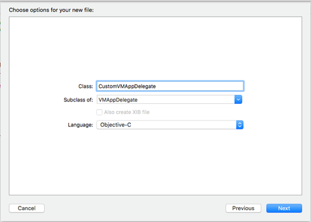
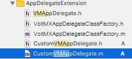
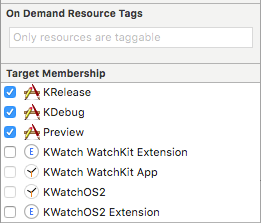

                              


Platform Specific Capabilities
==============================

This section describes the enhancements and capabilities you can add to your Volt MX Irisapps on specific platforms.

iOS
---

On Apple's iOS, you can enhance your app in the following ways.

### Extending the UIApplication Delegate

If you are writing an iOS app and you need it to have more control over its lifecycle, you can add that capability to your app with the voltmxAppDelegateClassFactory object. The voltmxAppDelegateClassFactory class helps you modify or override the methods in the [UIApplicationDelegate protocol](https://developer.apple.com/library/ios/documentation/UIKit/Reference/UIApplicationDelegate_Protocol/) of the iOS platform. This section describes the techniques you must use to override UIApplicationDelegate protocol methods and customize the app is launched, restored, and how it handles its state transitions.

The first thing to understand is that customizing the UIApplicationDelegate protocol methods is an iOS-specific extension of your app's functionality. This customization must be written in Objective-C and is not portable to other platforms. But it can help you integrate third-party libraries or perform custom initialization steps in the iOS version of your app.

To customize the UIApplicationDelegate protocol methods, you must create a class that implements Volt MX Iris's VMAppDelegate protocol. You then use that custom class together with the voltmxAppDelegateClassFactory object, as described in the following procedure.

Extending UIApplicationDelegate in an App Developed with Volt MX IrisTechnologies

1.  Export your Volt MX Iris app to Xcode.
2.  In Xcode, create a new class that is a subclass of the VMAppDelegate class. This is illustrated in the following figure.
    
    
    
    In the **Class** field, enter the name of your custom class. In the example above, it is CustomVMAppDelegate. But your class can be named anything you want. Be sure that your custom class is a subclass of VMAppDelegate and that the programming language you have selected is Objective-C. When Xcode creates your custom class, it generates a header file (.h) and an implementation file (.m) and adds them to your project. For example, if you have created the class with the name “CustomVMAppDelegate”, the header and implementation files are created with file names as “CustomVMAppDelegate.h” and “CustomVMAppDelegate.m” respectively, as the following illustration shows.
    
    
    
3.  Open the header and implementation files for your custom app delegate class. They will contain code similar to the following.
    
    **Header File**
    
```
#import "VMAppDelegate.h"
    @interface CustomVMAppDelegate:VMAppDelegate 
    { 
    	//class variables. 
    }
```
    
    **Implementation File**
    
```
@implementation CustomVMAppDelegate 
    	// Override Methods here...
    @end
    
```
    
4.  Override any of the methods of the [UIApplicationDelegate](https://developer.apple.com/library/ios/documentation/UIKit/Reference/UIApplicationDelegate_Protocol/) class that you want to customize. All of your override methods **must** call their parent implementations _without exception_. Failing to call the parent methods will result in undefined behavior.
5.  In your app's VoltMXAppDelegateClassFactory.m file, replace the "VMAppDelegate.h" with the name of header file (.h) created in step 1. For example, CustomVMAppDelegate.h.
6.  In the VoltMXAppDelegateClassFactory.m file, change return statement of the appDelegateClass method to the following.
    
```
return [<CustomDelegate> class];
```
    
    Replace <CustomDelegate> with the name of your custom app delegate class. For example:
    
```
return [CustomVMAppDelegate class];
```
    
7.  Select KRelease, KDebug, and Preview as the **Target memberships** for the new class.  
    From Volt MX Iris 8.1, the KDebug option is not available. Debugging can be achieved in the KRelease target.  
    
    
    

You can now compile and debug your app delegate extensions in Xcode.

