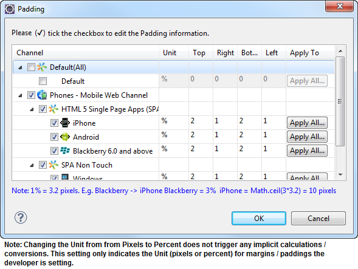
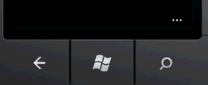

                               

Popup - Basic Properties
------------------------

The properties for the Popup widget are:

*   [bounces](#bounces)
*   [captureGPS](#captureG)
*   [containerHeight](#containe2)
*   [containerHeightReference](#containe3)
*   [containerWeight](#containe)
*   [contentAlignment](#contentAlignment)
*   [contentHExpand](#contentHExpand)
*   [contextPath](#contextPath)
*   [configureExtendTop](#configur)
*   [draggable](#draggabl)
*   [enableCache](#enableCa)
*   [extendTop](#extendTo)
*   [footerOverlap](#footerOv)
*   [footers](#footers)
*   [gridCell](#gridCell)
*   [headerOverlap](#headerOverlap)
*   [headers](#headers)
*   [id](#id)
*   [info](#info)
*   [inputAccessoryViewType](#inputAccessoryViewType)
*   [inTransitionConfig](#inTransitionConfig)
*   [isModal](#isModal)
*   [layout](#layout)
*   [layoutMeta](#layoutMe)
*   [layoutType](#layoutType)
*   [minimizeOnLostFocus](#minimize)
*   [noCache](#noCache)
*   [outTransitionConfig](#outTransitionConfig)
*   [padding](#padding)
*   [paddingInPixel](#paddingI)
*   [popupStyle](#popupSty)
*   [resizable](#resizabl)
*   [scrollsToTop](#scrollsT)
*   [secureData](#secureData)
*   [showMiniAppMenu](#showMini)
*   [skin](#skin)
*   [submitSecure](#submitSecure)
*   [title](#title)
*   [titleBarConfig](#titleBar)
*   [transparencyBehindThePopup](#transparencyBehindThePopup)
*   [viewConfig](#viewConfig)
*   [windowsSoftInputMode](#windowsSoftInputMode)


<details close markdown="block"><summary>bounces</summary>

* * *

Specifies whether the scroll view bounces past the edge of the content and back again.

### Syntax
```

bounces
```

### Type

Boolean

### Read/Write

Read + Write

### Remarks

The default value for this property is true.

If set to _false,_ the scroll view bounce is not applied.

If set to _true,_ the scroll view bounce is applied.

### Example

```

//Defining properties for a Popup with bounces:true
var popBasic ={id:"popUp", title:"PopUP", skin:"popSkin", isModal:true};

var popLayout ={containerWeight:100, padding:[5,5,5,5]};

var popPSP ={**bounces:true**};  
  
//Creating the Popup.  
var popUp=new voltmx.ui.Popup(popBasic, popLayout, popPSP);
```

### Platform Availability

*   Available in the IDE
*   iPhone
*   iPad

* * *

</details>
<details close markdown="block"><summary>captureGPS</summary>

* * *

Specifies if the Popup must display a dialog seeking permission from the user to access the location details.

### Syntax
```

captureGPS
```

### Type

Boolean

### Read/Write

No

### Remarks

The default value for this property is false.

If set to _true,_ the dialog appears when you navigate to the specified Popup.

If set to _false,_ the dialog does not appear when you navigate to the specified Popup.

set the value to _true_ (select the checkbox).

For this property to work, you must have selected **Requires GPS functionality** in the Project Properties of the Application (For more information, see the _Configuring Project Properties_ section of the _VoltMX Iris User Guide_) to enable the application to use the GPS functionality.

The following image illustrates the popup to access the location details:


### Example

```

//Defining properties for a Popup with captureGPS:true
var popBasic ={id:"popUp", title:"PopUP", skin:"popSkin", isModal:true};

var popLayout ={containerWeight:100, padding:[5,5,5,5]};
		var popPSP ={**captureGPS:true**};

//Creating the Popup.
var popUp=new voltmx.ui.Popup(popBasic, popLayout, popPSP);
```

### Platform Availability

Available in the IDE

Available on Server side Mobile Web (advanced) platform only

* * *

</details>
<details close markdown="block"><summary>containerHeight</summary>

* * *

Specifies the available height of the container in terms of percentage. The percentage is with reference to the value of containerHeightReference property.

### Syntax

containerHeight

### Type

Number

### Read/Write

Read + Write

### Remarks

In Windows platforms, popup occupies the child widget/content height.

If not configured, the value may vary depending on the platforms.

### Example

```

//Defining properties for a Popup with containerHeight:80
var popBasic ={id:"popUp", title:"PopUP", skin:"popSkin", headers:[box1,box2], footers:[box3,box4], isModal:true, transparencyBehindThePopup:100};

var popLayout ={**containerHeight:80**,padding:[5,5,5,5]};

var popPSP ={};

//Creating the Popup.
var popUp=new voltmx.ui.Popup(popBasic, popLayout, popPSP);

//Reading the containerHeight of the popUp
alert("popUp containerHeight::"+popUp.containerHeight);


```

### Platform Availability

Available on all platforms.

* * *

</details>
<details close markdown="block"><summary>containerHeightReference</summary>

* * *

This property is enabled when you set the [containerHeight](#containe). The widget height percentage is calculated based on the following options:

### Syntax
```

containerHeightReference
```

### Type

Number

### Read/Write

Read + Write

### Remarks

The default value for this property is CONTAINER\_HEIGHT\_BY\_FORM\_REFERENCE.

The container height percentage is calculated based on the below options.

*   CONTAINER\_HEIGHT\_BY\_FORM\_REFERENCE: The Popup height is calculated based on the height of the Form excluding headers and footers. This property doesn't have any effect if the scrollbox is placed inside a popup or headers/footers. On Desktop Web platform, view port height is considered as form height.
*   CONTAINER\_HEIGHT\_BY\_PARENT\_WIDTH: Use this option if the Popup is placed inside a Box. The width is calculated based on the width of the Box. On Desktop Web platform, view port width is considered as parent width.
*   CONTAINER\_HEIGHT\_BY\_DEVICE\_REFERENCE: Specifies the height of the popup as that of the height of the device/screen height. On Desktop Web platform, screen height is considered as device height.

> **_Note:_** To set the value through code, prefix the option with _constants._ such as _**constants.<option>**_.

### Example

```

//Defining the properties for Popup with 
	containerHeightReference: constants.CONTAINER_HEIGHT_BY_DEVICE_REFERENCE
var popBasic ={id:"popUp", title:"PopUP", skin:"popSkin", headers:[box1,box2], 
	footers:[box3,box4], isModal:true, transparencyBehindThePopup:100};

var popLayout ={containerHeight:80,padding:[5,5,5,5], 
	**containerHeightReference: constants.CONTAINER_HEIGHT_BY_DEVICE_REFERENCE**};

var popPSP ={};

//Creating the Popup.
var popUp=new voltmx.ui.Popup(popBasic, popLayout, popPSP); 
```

### Platform Availability

Available in the IDE

Available on all platforms.

* * *

</details>
<details close markdown="block"><summary>contentAlignment</summary>

* * *

Specifies the alignment of content in the Popup with respect to the boundaries of the Popup.

### Syntax
```

contentAlignment
```

### Type

Constant

### Read/Write

Read + Write

### Remarks

The default value for this property is CONTENT\_ALIGN\_CENTER.

Following are the possible alignment options available for Popup content:

*   CONTENT\_ALIGN\_TOP\_LEFT – Specifies the content should be aligned at the top left corner of the Popup.
*   CONTENT\_ALIGN\_TOP\_CENTER – Specifies the content should be aligned at the top center corner of the Popup.
*   CONTENT\_ALIGN\_TOP\_RIGHT – Specifies the content should be aligned at the top right corner of the Popup.
*   CONTENT\_ALIGN\_MIDDLE\_LEFT – Specifies the content should be aligned at middle left corner of the Popup.
*   CONTENT\_ALIGN\_CENTER – Specifies the content should be aligned center of the Popup.
*   CONTENT\_ALIGN\_MIDDLE\_RIGHT – Specifies the content should align at the middle right corner of the Popup.
*   CONTENT\_ALIGN\_BOTTOM\_LEFT – Specifies the content should be aligned at the bottom left corner of the Popup.
*   CONTENT\_ALIGN\_BOTTOM\_CENTER – Specifies the content should be aligned at the bottom center corner of the Popup.
*   CONTENT\_ALIGN\_BOTTOM\_RIGHT – Specifies the content should be aligned at the bottom right corner of the Popup.

> **_Note:_** When the contentHExpand property is set to true, the Popup content occupies the entire width of the Popup. When the contentHExpand property is set to false, the Popup content is aligned based on the contentAlignment property.

### Example

```

<PopupName>.contentAlignment = constants. CONTENT_ALIGN_CENTER
```

### Platform Availability

This property is available on Windows Phone 8.1

* * *

</details>
<details close markdown="block"><summary>contentHExpand</summary>

* * *

Specifies if the content should occupy all the width available in the Popup Widget.

**Default:**_true_

If set to _false_, the content in the Popup occupies its preferred width. The preferred width of a widget is the sum of its content’s width, margin and padding.

If set to _true_, the content in the Popup occupies the entire width of the Popup.

### Syntax

contentHExpand

### Type

Boolean

### Read/Write

No

### Example

```

<PopupName>.contentHExpand = true;
```

### Platform Availability

This property is available on Windows Phone 8.1

* * *

</details>
<details close markdown="block"><summary id="contextP">contextPath</summary>

* * *

Specifies the context path to be displayed in the address field of the browser. For more information about specifying a context path.

**Default:** empty

> **_Note:_** This field is only populated when you specify a Context ID and a corresponding Context Path in the Site Minder tab under Mobile web in the Project properties window.

#### Syntax

contextPath

### Type

String

### Example

```

//Defining properties for a Popup with contextPath:"https://www.xyz.com"
var popBasic ={id:"popUp", title:"PopUP", skin:"popSkin", isModal:true};

var popLayout ={containerWeight:100, padding:[5,5,5,5]};

var popPSP ={**contextPath:"https://www.xyz.com"**};

//Creating the Popup.
var popUp=new voltmx.ui.Popup(popBasic, popLayout, popPSP);
```

### Platform Availability

*   Available in the IDE
*   Server side Mobile Web (basic)
*   Server side Mobile Web (BJS)

* * *

</details>
<details close markdown="block"><summary>configureExtendTop</summary>

* * *

This property enables you to configure extendTop property.

### Syntax
```

None. Its an IDE only property
```

### Read/Write

No

### Remarks

The default value for this property is false.

If set to _true,_ the property extendTop is displayed.

If set to _false,_ the property extendTop is not displayed.

### Platform Availability

*   Available in the IDE
*   iPhone
*   iPad

* * *

</details>
<details close markdown="block"><summary>draggable</summary>

* * *

Specifies the weather the popup can be dragged across the browser screen.

### Syntax
```

draggable
```

### Type

Boolean

### Read/Write

No

### Remarks

The default value for this property is false.

If set to _true_, the popup window can be dragged.

if set to _false_, the popup window cannot be dragged.

### Example

```

//Defining properties for a Popup with draggable:true.
var popBasic ={id:"popUp", title:"PopUP", skin:"popSkin", isModal:true};

var popLayout ={containerWeight:100, padding:[5,5,5,5]};

var popPSP ={**draggable: true**};
		  
//Creating the Popup.
var popUp=new voltmx.ui.Popup(popBasic, popLayout, popPSP);
```

### Platform Availability

Available in the IDE

This property is available on Desktop Web platform.

* * *

</details>
<details close markdown="block"><summary>enableCache</summary>

* * *

This property enables you to improve the performance of Positional Dimension Animations.

### Syntax
```

enableCache
```

### Type

Boolean

### Read/Write

Read + Write

### Remarks

The default value for this property is true.

When this property is used, it increases the memory consumption by the application. It enables tradeoff between performance and visual quality of the content.

### Platform Availability

Available in the IDE

This property is supported only on Windows platform

* * *

</details>
<details close markdown="block"><summary>extendTop</summary>

* * *

Specifies the popup content to scroll under the App Menu. This property is supported in iOS7 and above only.

### Syntax
```

extendTop
```

### Type

Boolean

### Read/Write

Read + Write

### Remarks

This property is also applicable on the Application Level properties under Application Properties > Native > iPhone/iPad > Platform Settings. The property set at popup level takes precedence over Application level.

The default value for this property is false.

If set to _true,_ the popup scroll under the App Menu.

This property is applicable on popup level headers and footers, app level headers and footers, title bar, and app menu.

### Example

```

//Defining a popup with extendTop:true

var popBasic ={id:"popUp", title:"PopUP", skin:"popSkin", isModal:true};

var popLayout ={containerWeight:100, padding:[5,5,5,5]};

var popPSP ={**extendTop:true**};

//Creating the Popup.
var popUp=new voltmx.ui.Popup(popBasic, popLayout, popPSP);
```

### Platform Availability

*   Available in the IDE
*   iPhone
*   iPad

* * *

</details>
<details close markdown="block"><summary>footerOverlap</summary>

* * *

Specifies if the footer must overlaps the Popup. For example, every time you scroll the Popup, the footer is fixed and the footer overlaps the Popup as specified in the Footer Overlap field. If this field is selected, the Popup scrolls behind the footer background and a part of the footer background is transparent.

**Default:**_false_

### Syntax
```

footerOverlap
```

### Type

Boolean

### Read/Write

No

### Example

```

//Defining properties for a Popup with footerOverlap:true
var popBasic ={id:"popUp", title:"PopUP", skin:"popSkin", isModal:true};

var popLayout ={containerWeight:100, padding:[5,5,5,5]};

var popPSP ={**footerOverlap:true**};

//Creating the Popup.
var popUp=new voltmx.ui.Popup(popBasic, popLayout, popPSP);
```

### Platform Availability

*   Available in the IDE
*   iPhone
*   iPad

* * *

</details>
<details close markdown="block"><summary>footers</summary>

* * *

A footer is a section of the Popup that is docked at the bottom of the Popup (does not scroll along with the content of the Popup).

### Syntax
```

footers
```

### Type

Array(voltmx.ui.Box)

### Read/Write

Read only

### Remarks

It accepts an array of voltmx.ui.Box object references with horizontal orientation that are added as footer docked at the bottom of the Popup. These footers can be reused across forms.

### Example

```

//Defining properties for a Popup with Footers:[box3,box4], where box3 and box4 are boxes and these boxes should be created and made available for access.
var popBasic ={id:"popUp", title:"PopUP", skin:"popSkin", headers:[box1,box2], **footers:[box3,box4]**, isModal:true, transparencyBehindThePopup:100};

var popLayout ={containerWeight:100, padding:[5,5,5,5]};

var popPSP ={};

//Creating the Popup.
var popUp=new voltmx.ui.Popup(popBasic, popLayout, popPSP);
```

### Platform Availability

Available in the IDE

Available on all platforms

* * *

</details>
<details close markdown="block"><summary>gridCell</summary>

* * *

Represents the grid cell details in the sequence colSpan, rowSpan, rowNo, colNo. Description of the details are:

*   colSpan: Specifies the number of columns that a grid should span. Default value is 1.
*   rowSpan: Specifies the number of rows that a grid should span. Default value is 1.
*   rowNo: Specifies the row number in where the widget is placed in a grid layout.
*   colNo: Specifies the column number in where the widget is placed in a grid layout.

### Syntax
```

gridCell
```

### Type

JSObject

### Read/Write

Read + Write

### Remarks

This property is applicable only when a widget is placed inside a container widget with Grid Layout applied.

Layout type is not visible as a property. It is set when the user applies XYLayout or GridLayout on a form. The default option is XYLayout. To set GridLayout, right-click on the form and select Apply GridLayout.  

### Example

```

//Defining properties for a Popup with gridCell.
var popBasic ={id:"popUp", title:"PopUP", skin:"popSkin", headers:[box1,box2], footers:[box3,box4], isModal:true, transparencyBehindThePopup:100};

var popLayout ={containerWeight:80,padding:[5,5,5,5], layoutType: constants.CONTAINER_LAYOUT_GRID,
layoutMeta: {
	"cols": 8,
	"colmeta": ["15", "15", "15", "15", "15", "15", "5", "5"],
	"rows": 4
},**gridCell: {"colSpan":1, "rowSpan":1, "rowNo":1, "colNo":1}** };

var popPSP ={};

//Creating the Popup.
var popUp=new voltmx.ui.Popup(popBasic, popLayout, popPSP);
```

### Platform Availability

*   Available in the IDE
*   Windows Tablet

* * *

</details>
<details close markdown="block"><summary>headerOverlap</summary>

* * *

Specifies if the header must overlaps the Popup.

### Syntax
```

headerOverlap
```

### Type

Boolean

### Read/Write

No

### Remarks

The default value for this property is false.

For example, every time you scroll the Popup, the header is fixed and the header overlaps the Popup as specified in the header overlap field. If this field is selected, the Popup scrolls behind the header background and a part of the header background is transparent.

### Example

```

//Defining properties for a Popup with headerOverlap:true
var popBasic ={id:"popUp", title:"PopUP", skin:"popSkin", isModal:true};

var popLayout ={containerWeight:100, padding:[5,5,5,5]};

var popPSP ={**headerOverlap:true**};

//Creating the Popup.
var popUp=new voltmx.ui.Popup(popBasic, popLayout, popPSP);
```

### Platform Availability

*   Available in the IDE
*   iPhone
*   iPad

* * *

</details>
<details close markdown="block"><summary>headers</summary>

* * *

A header is a section of the Popup that is docked at the top of the Popup (does not scroll along with the content of the Popup). It accepts an array of voltmx.ui.Box object references with horizontal orientation that are added as header docked at the top of the Popup. These headers can be reused across Popups.

### Syntax
```

headers
```

### Type

Array(voltmx.ui.Box)

### Read/Write

Read only

### Example

```

//Defining properties for a Popup with headers:[box1,box2],Where box1 and box2 are boxes and these boxes should be created and made available for access.
var popBasic ={id:"popUp", title:"PopUP", skin:"popSkin", **headers:[box1,box2]**, footers:[box3,box4], isModal:true, transparencyBehindThePopup:100};

var popLayout ={containerWeight:100, padding:[5,5,5,5]};

var popPSP ={};

//Creating the Popup.
var popUp=new voltmx.ui.Popup(popBasic, popLayout, popPSP);
```

### Platform Availability

Available in the IDE

Available on all platforms

* * *

</details>
<details close markdown="block"><summary>id</summary>

* * *

id is a unique identifier of Popup consisting of alpha numeric characters. Every Popup should have a unique id within an application.

### Syntax
```

id
```

### Type

String

### Read/Write

No

### Example

```

//Defining properties for a Popup with id:"popUp1"
var popBasic ={**id:"popUp1"**, title:"PopUP",skin:"popSkin", headers:[box1,box2], footers:[box3,box4], isModal:true, transparencyBehindThePopup:100};

var popLayout ={containerWeight:100,padding:[5,5,5,5]};

var popPSP ={};

//Creating the Popup.
var popUp1=new voltmx.ui.Popup(popBasic, popLayout, popPSP);
```

### Platform Availability

Available in the IDE

Available on all platforms

* * *

</details>
<details close markdown="block"><summary>info</summary>

* * *

A custom JSObject with the key value pairs that a developer can use to store the context with the widget. This will help in avoiding the globals to most part of the programming.

> **_Note:_** This is a **non-Constructor** property. You cannot set this property through widget constructor. But you can read and write data to it.

Info property can hold any JSObject. After assigning the JSObject to info property, the JSObject should not be modified. For example,

```

var inf = {a: 'hello'};
widget.info = inf; //works
widget.info.a = 'hello world'; //This will not update the widget info a property to Hello world. widget.info.a will have old value as hello.
```

### Syntax
```

info
```

### Type

JSObject

### Read/Write

Read + Write

### Example

```

//Defining properties for a Popup with info property.
var popBasic ={id:"popUp", title:"PopUP", skin:"popSkin", headers:[box1,box2], footers:[box3,box4], isModal:true, transparencyBehindThePopup:100};

var popLayout ={containerWeight:100,padding:[5,5,5,5]};

var popPSP ={};
  
//Creating the Popup.
var popUp=new voltmx.ui.Popup(popBasic, popLayout, popPSP);  
**popUp.info = {key:"text of popup"};**  
//Reading the info of the popUp.	
alert("popUp info is ::"+popUp.info);
```

### Platform Availability

Available on all platforms

* * *

</details>
<details close markdown="block"><summary>inputAccessoryViewType</summary>

* * *

When building iPhone applications that support or provide text input, it's often necessary to create some extra buttons (or other controls) beyond the ones provided by the default keyboard interface.

### Syntax
```

inputAccessoryViewType
```

### Type

Number

### Read/Write

No

### Remarks

VoltMX Platform by default, adds the Previous, Next and Done buttons to the applicable input controls. These buttons allow specific operations needed by your application, such as moving to the next or previous text field, make the keyboard disappear. The area above the keyboard is known as Input Accessory View.

This property, allows you to specify the type of accessory view that will be shown for all the input controls on this Popup.


The Input Accessory View Type defined in the form level takes precedence over the Input Accessory View Type defined in application level settings.

You can select one of the following view types:

**Default:** FORM\_INPUTACCESSORYVIEW\_DEFAULT

The available options are:

*   FORM\_INPUTACCESSORYVIEW\_NONE: Use this option if you do not want to specify the toolbar.  
    This option should be used carefully, as setting this option for widgets like calendar leaves the user with no option to select and drop-down a wheel calendar.
*   FORM\_INPUTACCESSORYVIEW\_DEFAULT: Specifies that the toolbar that is defined in the Application level settings. To set the Application level settings, right-click on the project and navigate to `Properties> Native App>iPhone/iPad.`
*   FORM\_INPUTACCESSORYVIEW\_NEXTPREV: Specifies the navigation options as Next, Previous, and Done for a popup. The below image illustrates the nextprevtoolbar set for a Textbox. The highlighted toolbar is achieved by setting the Keyboard Type as _Default_ for a Textbox and Input Accessory View Type as _nextprevtoolbar_ to the popup.


*   FORM\_INPUTACCESSORYVIEW\_CANCEL: Specifies that the input accessory view has a cancel button. This option does not trigger any events. Specifies that the input accessory view has a cancel button. This option does not trigger any events.

This option (_none_) should be used carefully, as setting this option for widgets like calendar leaves the user with no option to select and drop-down a wheel calendar.

### Example

```

//Defining properties for a Popup with inputAccessoryViewType as nextprevtoolbar
var popBasic ={id:"popUp", title:"PopUP", skin:"popSkin", isModal:true};

var popLayout ={containerWeight:100, padding:[5,5,5,5]};

var popPSP ={**inputAccessoryViewType:constants.nextprevtoolbar**};

//Creating the Popup.
var popUp=new voltmx.ui.Popup(popBasic, popLayout, popPSP);
```

### Platform Availability

*   Available in the IDE
*   iPhone
*   iPad

* * *

</details>
<details close markdown="block"><summary>inTransitionConfig</summary>

* * *

Specifies the configuration to be used when the user arrives on this form. It accepts hash values.

### Syntax
```

inTransitionConfig
```

### Type

JSObject

### Read/Write

Read + Write

### Remarks

Following are the properties available for iPhone and iPad:

**transitionDuration:** Specifies the duration after which the transition is applied on the popup. The default value is 0.3 seconds.

**transitionDirection:** Specifies the direction from which the popup is displayed. The available options are:

1.  none - Use this option if you do not want to specify a transition direction.
2.  fromRight - Specifies that the popup must appear from the right.
3.  fromLeft - Specifies that the popup must appear from the left.
4.  fromBottom - Specifies that the popup must appear from the bottom.
5.  fromTop - Specifies that the popup must appear from the top.

**transitionEffect:** Specifies the effect from which the popup is displayed. The available options are:

1.  none - Use this option if you do not want to specify a transition direction.
2.  transitionMoveIn - Specifies that the popup must slide over the existing content in the direction as specified in the _transitionDirection_.
3.  transitionPush - Specifies that the popup must push the existing content in the direction as specified in the _transitionDirection_ preserve">var var take its place.
4.  transitionReveal - Specifies that the popup must be revealed gradually in the direction as specified in the _transitionDirection_.

The below effects applicable to Android platform:

1.  default/none - The constant value is 0. The default device effect is applied or none of the effect is applied.
2.  bottom-top - The constant value is 1. Specifies that the popup must _slide-in_ from the bottom and proceed towards the top.
3.  from left - The constant value is 2. Specifies that the popup must _slide-in_ from the _left_ with a _fade_ effect.
4.  from right- The constant value is 3. Specifies that the popup must _slide-in_ from the _right_ with a _fade_ effect.
5.  to right- The constant value is 4. Specifies that the popup must _slide-out_ to the _right_ with a _fade_ effect.
6.  to left- The constant value is 5. Specifies that the popup must _slide-out_ to the _left_ with a _fade_ effect.
7.  from center- The constant value is 6. Specifies that the popup must _grow_ from the _center_ with a _fade_ effect.
8.  topright-bottom - The constant value is 7. Specifies that the popup must _slide-in_ from the _top-right_ corner and proceed towards the bottom.
9.  bottomleft-top - The constant value is 8. Specifies that the popup must _slide-in_ from the _bottom-left_ corner and proceed towards the top.
10.  bottom-top style1 - The constant value is 9. Specifies that the popup must _shrink_ from the bottom towards the top.
11.  top down - The constant value is 10. Specifies that the popup must _slide-in_ from the top and proceed towards the bottom.

```

//sample code to set inTransitionConfig with the option bottom-top.  
  
popup1.inTransitionConfig= { popupAnimation: 1 };
```

Following are the properties available for Windows Phone:

**inTransition:** Specifies the effect from which the popup is displayed. The available options are:

1.  Slide In- Specifies that the popup must slide horizontally from left into the view. By default, this option is selected.
2.  Pop In- Specifies that the popup must emerge from center-center of the screen.
3.  none: The popup appears with no animation applied.

On SPA Platform, **Transition** has the below options to set:

1.  None- Use this option if you do not want to specify a transition direction.
2.  Top Center - Specifies that the popup must appear from the top center.
3.  Bottom Center - Specifies that the popup must appear from the bottom center.
4.  Right Center - Specifies that the popup must appear from the right center.
5.  Left Center - Specifies that the popup must appear from the left center.

### Example

```

//Defining properties for a Popup with inTransitionConfig:{transitionDirection:"topCenter"}
var popBasic ={id:"popUp", title:"PopUP", skin:"popSkin", isModal:true};

var popLayout ={containerWeight:100, padding:[5,5,5,5]};

var popPSP ={**inTransitionConfig:{transitionDuration:"0.5", transitionEffect:"transitionMoveIn", transitionDirection:"topCenter"}**};

//Creating the Popup.
var popUp=new voltmx.ui.Popup(popBasic, popLayout, popPSP);

//Reading the inTransitionConfig of the popUp
alert("popUp inTransitionConfig::"+popUp.inTransitionConfig);
```

### Platform Availability

Available in the IDE

Available on all platforms., Windows Desktop, and Windows Tablet

* * *

</details>
<details close markdown="block"><summary>isModal</summary>

* * *

This property indicates whether the popup is to be shown as modal window or a non-modal window.

### Syntax
```

isModal
```

### Type

Boolean

### Read/Write

Read + Write

### Remarks

In user interface design, a _modal_ window, which is a child window that requires users to interact with it before they can return to operating the parent application, thus preventing the workflow on the application main window.

The default value for this property is false.

If set to _true,_ the popup is shown as modal window.

If set to _false,_ the popup is shown as non-modal window.

### Example

```

//Defining properties for a Popup with isModal:true
var popBasic ={id:"popUp", title:"PopUP",skin:"popSkin", headers:[box1,box2], footers:[box3,box4], **isModal:true**, transparencyBehindThePopup:100};

var popLayout ={containerWeight:100,padding:[5,5,5,5]};

var popPSP ={};
  
//Creating the Popup.
var popUp=new voltmx.ui.Popup(popBasic, popLayout, popPSP);

//Reading the isModal of the popUp
alert("popUp isModal::"+popUp.isModal);
```

### Platform Availability

Available in the IDE

Available on all platforms

* * *

</details>
<details close markdown="block"><summary>layout</summary>

* * *

Specifies if the arrangement of the widgets either in horizontal or vertical direction.

### Syntax
```

layout
```

### Type
String

### Read/Write
No

### Remarks

The default value for this property is Vertical.

The available options are:

*   Vertical:The navigation happens in vertical direction.
*   Horizontal:The navigation happens in horizontal direction.

### Example

```

//Defining properties for a Popup with layout:Vertical
var popBasic ={id:"popUp", title:"PopUP", skin:"popSkin", isModal:true};

var popLayout ={containerWeight:100, padding:[5,5,5,5]};

var popPSP ={**layout:constants.Vertical**};

//Creating the Popup.
var popUp=new voltmx.ui.Popup(popBasic, popLayout, popPSP);
```

### Platform Availability

Available in the IDE

This property is available on Windows Tablet

* * *

</details>
<details close markdown="block"><summary>layoutMeta</summary>

* * *

A custom JSObject with the key, value pairs that developer can use to provide the meta info about the grid layout.

### Syntax
```

layoutMeta
```

### Type

JSObject

### Read/Write

Read + Write

### Remarks

The following are the mandatory keys required to be part of the Meta.

The data for layoutmeta data is set when you set grid layout view properties for rows and columns. This property can be set using VoltMX Iris Grid Layout view. To set the view, go to Window > Show View > Others and select GridLayout View from VoltMX Iris folder.

**rows :** no of grid rows

**cols** : no of grid cols

**colmeta**: \[{width:"width in %"}\]

The sum total of percentage (%) widths of each of the columns in the grid layout should add up to 100%.

### Example

```

//Defining properties for a Popup with layoutMeta.
var popBasic ={id:"popUp", title:"PopUP", skin:"popSkin", headers:[box1,box2], footers:[box3,box4], isModal:true, transparencyBehindThePopup:100};

var popLayout ={containerWeight:80,padding:[5,5,5,5], layoutType: constants.CONTAINER_LAYOUT_GRID,
**layoutMeta: {
		"cols": 8,
	"colmeta": ["15", "15", "15", "15", "15", "15", "5", "5"],
	"rows": 4}**,
		gridCell: {"colSpan":1, "rowSpan":1, "rowNo":1, "colNo":1} };

var popPSP ={};

//Creating the Popup.
var popUp=new voltmx.ui.Popup(popBasic, popLayout, popPSP);
```

### Platform Availability

*   Available in the IDE
*   Windows Tablet

* * *

</details>
<details close markdown="block"><summary>layoutType</summary>

* * *

Defines the type of the layout of container widget.

### Syntax
```

layoutType
```

### Type

String

### Read/Write

Read only

### Remarks

The available options are:

*   CONTAINER\_LAYOUT\_BOX: This is the default options on both Windows Tablet and Desktop Web platforms.
*   CONTAINER\_LAYOUT\_GRID: In grid layout the form is split it to rows and columns.

Layout type is not visible as a property. It is set when the user applies XYLayout or GridLayout on a form. From the IDE, the default option is XYLayout. To set GridLayout, right-click on the form and select Apply GridLayout.

### Example

```

//Defining properties for a Popup with layoutType:CONTAINER_LAYOUT_GRID.
var popBasic ={id:"popUp", title:"PopUP", skin:"popSkin", headers:[box1,box2], footers:[box3,box4], isModal:true, transparencyBehindThePopup:100};

var popLayout ={containerWeight:80,padding:[5,5,5,5], **layoutType: constants.CONTAINER_LAYOUT_GRID**,
layoutMeta: {
	"cols": 8,
	"colmeta": ["15", "15", "15", "15", "15", "15", "5", "5"],
	"rows": 4
}, gridCell: {"colSpan":1, "rowSpan":1, "rowNo":1, "colNo":1} };

var popPSP ={};

//Creating the Popup.
var popUp=new voltmx.ui.Popup(popBasic, popLayout, popPSP);
```

### Platform Availability

*   Available in the IDE
*   Windows Tablet

* * *

</details>
<details close markdown="block"><summary>minimizeOnLostFocus</summary>

* * *

Indicates the popup window should minimize when the focus moves out of the popup.

### Syntax
```

minimizeOnLostFocus
```

### Type

Boolean

### Read/Write

No

Remarks

This property is applicable only for non-modal popup.

The default value for this property is false.

If set to _true_, the popup window is minimized.

if set to _false_, the popup window is not minimized.

### Example

```

//Defining a Popup with layoutType
var popBasic = {id:"popup", type:constants.POPUP_TYPE_NATIVE , title:"Welcome"};

var popLayout ={displayOrientation:constants.POPUP_DISPLAY_ORIENTATION_BOTH, paddingInPixel:false, padding:[5,5,5,5]};

var popPSP ={layoutType: constants.CONTAINER_LAYOUT_GRID,
layoutMeta: {
	"cols": 8,
	"colmeta": ["15", "15", "15", "15", "15", "15", "5", "5"],
	"rows": 4
	}, **minimizeOnLostFocus: true**};

//Creating a POPUP.
var frm =new voltmx.ui.Popup(popBasic, popLayout, popPSP);
```

### Platform Availability

Available in the IDE

This property is available on Desktop Web

* * *

</details>
<details close markdown="block"><summary>noCache</summary>

* * *

This property indicates that if the form is enabled for caching on the device browser.

### Syntax
```

noCache
```

### Type

Boolean

### Remarks

A web cache is a mechanism for the temporary storage ](caching) of web documents, such as.md pages and images, to reduce bandwidth usage, server load, and perceived lag.

The default value for this property is true.

If set to _false_, appropriate Cache control headers are included in the HTTP response.

If set to _true_, cache control headers are not included in the HTTP response.

### Example

```

//Defining properties for a Popup with noCache:false
var popBasic ={id:"popUp", type:constants.POPUP_TYPE_NATIVE, title:"PopUP", skin:"popSkin", isModal:true};

var popLayout ={containerWeight:100,padding:[5,5,5,5]};

var popPSP ={**noCache:false**};

//Creating the Popup.
var popUp=new voltmx.ui.Popup(popBasic, popLayout, popPSP);
```

### Platform Availability

*   Available in the IDE
*   Server side Mobile Web (basic)
*   Server side Mobile Web (BJS)

* * *

</details>
<details close markdown="block"><summary>outTransitionConfig</summary>

* * *

### Syntax
```

outTransitionConfig
```

### Type

JSObject

### Read/Write

Read + Write

### Remarks

Specifies the type of transition effect to be applied when the popup is going out of view. It accepts hash values.

Following are the properties available for iPhone and iPad:

**transitionDuration:** Specifies the duration after which the transition is applied on the popup. The default value is 0.3 seconds.

**transitionDirection:** Specifies the direction from which the popup must disappear in a view. You can choose one of the following options:

1.  none - Use this option if you do not want to specify a transition direction.
2.  fromRight - Specifies that the popup must disappear from the right.
3.  fromLeft - Specifies that the popup must disappear from the left.
4.  fromBottom - Specifies that the popup must disappear from the bottom.
5.  fromTop - Specifies that the popup must disappear from the top.

**transitionEffect:** Specifies the type of transition effect to be applied when the form disappears in the view. You can choose one of the following transition effects:

1.  none - Use this option if you do not want to specify a transition direction.
2.  transitionFade - Specifies that the popup must fade when it is transitioned to a hidden or an invisible state.
3.  transitionMoveOut - Specifies that the popup must slide away in the direction as specified in the _transitionDirection_.
4.  transitionMoveIn - Specifies that the popup must slide over the existing content in the direction as specified in the _transitionDirection_.

Following are the properties available for Android platform:

1.  default/none - The constant value is 0. The default device effect is applied or none of the effect is applied.
2.  bottom-top - The constant value is 1. Specifies that the popup must _slide-out_ from the bottom and proceed towards the top.
3.  from left- The constant value is 2. Specifies that the popup must _slide-out_ from the _left_ with a _fade_ effect.
4.  from right - The constant value is 3. Specifies that the popup must _slide-out_ from the _right_ with a _fade_ effect.
5.  to right - The constant value is 4. Specifies that the popup must _slide-in_ to the _right_ with a _fade_ effect.
6.  to left - The constant value is 5. Specifies that the popup must _slide-in_ to the _left_ with a _fade_ effect.
7.  from center - The constant value is 6. Specifies that the popup must _grow_ from the _center_ with a _fade_ effect.
8.  topright-bottom - The constant value is 7. Specifies that the popup must _slide-in_ from the _top-right_ corner and proceed towards the bottom.
9.  bottomleft-top - The constant value is 8. Specifies that the popup must _slide-in_ from the _bottom-left_ corner and proceed towards the top.
10.  bottom-top style1 - The constant value is 9. Specifies that the popup must _shrink_ from the bottom towards the top.
11.  top down - The constant value is 10. Specifies that the popup must _slide-in_ from the top and proceed towards the bottom.

```

//sample code to set outTransitionConfig with the option top down.  
  
popup1.outTransitionConfig= { popupAnimation: 10 };
```

Following are the properties available for Windows Phone:

**outTransition:** Specifies the effect when popup is disappearing. The available options are:

1.  Slide Out- Specifies that the popup must slide horizontally to right when disappearing.
2.  Pop Out- Specifies that the popup must drop in to center-center of the screen when disappearing.
3.  none- The popup disappears with no animation applied.

On SPA Platform, **Transition** has the below options to set:

1.  None- Use this option if you do not want to specify a transition direction.
2.  Top Center - Specifies that the popup must disappear from the top center.
3.  Bottom Center - Specifies that the popup must disappear from the bottom center.
4.  Right Center - Specifies that the popup must disappear from the right center.
5.  Left Center - Specifies that the popup must appear from the left center.

### Example

```

//Defining properties for a Popup with outTransitionConfig:{transitionDirection:"topCenter"}
var popBasic ={id:"popUp", title:"PopUP", skin:"popSkin", isModal:true};

var popLayout ={containerWeight:100, padding:[5,5,5,5]};

var popPSP ={**outTransitionConfig:{transitionDuration:"0.5", transitionEffect:"transitionMoveIn", transitionDirection:"topCenter"}**};

//Creating the Popup.
var popUp=new voltmx.ui.Popup(popBasic, popLayout, popPSP);

//Reading the outTransitionConfig of the popUp.
alert("popUp outTransitionConfig::"+popUp.outTransitionConfig);
```

Availability

Available in the IDE

Available on all platforms., Windows Desktop, and Windows Tablet.

* * *

</details>
<details close markdown="block"><summary>padding</summary>

* * *

Defines the space between the content of the widget and the widget boundaries.

### Syntax
```

padding
```

### Type

Array

### Read/Write

Read + Write

### Remarks

You can use this option to define the top, left, right, and bottom distance between the widget content and the widget boundary.

To define the padding values for a platform, click the () button against the property to open the _Padding_ screen. Select the checkbox against the platform for which you want to define the padding's and enter the top, left, right, and bottom padding values.

If you want to use the padding values set for a platform across other platforms, you can click the _Apply To_ button and select the platforms on which you want the padding values to be applied.

Due to Browser restrictions, you cannot apply padding for a [ComboBox](ComboBox.md), [Form](Form.md) and [ListBox](ListBox.md) widgets on Mobile Web platform. Padding is not supported by Windows Mobile browser for Box and Image Gallery.

If no skin is applied to a Button, then padding is not supported on iPhone. This is due to iOS Safari browser limitation. If you want the padding to be applied, apply a skin to the button and then apply padding.

The following image illustrates the window to define the padding's for platforms:

  
  
The following image illustrates a widget with a defined padding:


### Example

```

//Defining properties for a Popup with padding:[5,5,5,5]
var popBasic ={id:"popUp", title:"PopUP", skin:"popSkin", headers:[box1,box2], footers:[box3,box4], isModal:true, transparencyBehindThePopup :100};

var popLayout ={containerWeight:100, **padding:[5,5,5,5]**};

var popPSP ={};

//Creating the Popup.
var popUp=new voltmx.ui.Popup(popBasic, popLayout, popPSP);


```

### Platform Availability

Available in the IDE

Available on all platforms

* * *

</details>
<details close markdown="block"><summary>paddingInPixel</summary>

* * *

Indicates if the padding is to be applied in pixels or in percentage.

### Syntax
```

paddingInPixel
```

### Type

Boolean

### Read/Write

No

### Remarks

The default value for this property is false.

If set to _true,_ the padding is applied in pixels.

If set to _false,_ the padding is applied as set in [padding](#padding) property.

This property can be set to _true_ or _false_ only for iPhone, iPad, Android and Windows Phone. On other platforms this property does not give any results even when set to _true_.

For backward compatibility on older projects, this property is will be made _true_ for iPhone, iPad, Android and Windows Phone and for other platforms it will be _false_.

### Example

```

//Defining properties for a Popup with padding in pixels.
var popBasic ={id:"popUp", title:"PopUP", skin:"popSkin", headers:[box1,box2], footers:[box3,box4], isModal:true, transparencyBehindThePopup :100};

var popLayout ={containerWeight:100, padding:[5,5,5,5], **paddingInPixel: true**};

var popPSP ={};

//Creating the Popup.
var popUp=new voltmx.ui.Popup(popBasic, popLayout, popPSP);
```

### Platform Availability

*   Available in the IDE
*   iPhone
*   iPad
*   Android
*   Windows Phone

* * *

</details>
<details close markdown="block"><summary>popupStyle</summary>

* * *

Specifies the popup style to be displayed in the application.

### Syntax
```

popupStyle
```

### Type

Number

### Read/Write

No

### Remarks

The available options are:

*   POPUP\_TYPE\_VOLTMX\_STYLE:This is the default popup provided by voltmx.
*   POPUP\_TYPE\_NATIVE\_STYLE:This option is applicable for iPad only. Using this style, the popup is rendered as popover.

### Example

```

//Defining properties for a Popup with outTransitionConfig:{transitionDirection:"topCenter"}
var popBasic ={id:"popUp", title:"PopUP", skin:"popSkin", isModal:true};

var popLayout ={containerWeight:100, padding:[5,5,5,5]};

var popPSP ={**popupStyle:constants.POPUP_TYPE_NATIVE_STYLE}**};

//Creating the Popup.
var popUp=new voltmx.ui.Popup(popBasic, popLayout, popPSP);

//Reading the Popup style.
alert("popUp style is ::"+popUp.popupStyle);
```

### Platform Availability

Available in the IDE

Available on iPad platform only

* * *

</details>
<details close markdown="block"><summary>resizable</summary>

* * *

Specifies the weather the popup can be resized across the browser screen.

### Syntax
```

resizable
```

### Type

Boolean

### Read/Write

No

### Remarks

The default value for this property is false.

If set to _true_, the popup window can be resized.

if set to _false_, the popup window cannot be resized.

### Example

```

//Defining properties for a Popup with resizable:true.
var popBasic ={id:"popUp", title:"PopUP", skin:"popSkin", isModal:true};

var popLayout ={containerWeight:100, padding:[5,5,5,5]};

var popPSP ={**resizable: true**};
		  
//Creating the Popup.
var popUp=new voltmx.ui.Popup(popBasic, popLayout, popPSP);
```

### Availability

Available in the IDE

This property is available on Desktop Web platform.

* * *

</details>
<details close markdown="block"><summary id="scrollsT">scrollsToTop</summary>

* * *

This property enables you to scroll the Popup to top on tapping a device’s status bar.

### Syntax
```

scrollsToTop
```

### Type

Boolean

### Read/Write

Read + Write

### Remarks

The default value for this property is true.

If this property is true for more than one widget, then this property is not applied to any of the widgets.

### Platform Availability

*   iPhone
*   iPad

* * *

</details>
<details close markdown="block"><summary>secureData</summary>

* * *

Specifies if the browser must retain and use the information that you have filled in a form (for example, username and password) and use it during the POST request made when you refresh the browser or use the back button on the browser.

### Syntax
```

secureData
```

### Type

Boolean

### Read/Write

No

### Remarks

**Default:**_the option is not selected_ (the browser will retain data and use it during POST request)

If you do not want the browser to use the information during the POST request made when you refresh the browser or use the back button on the browser, select the checkbox.

### Example

```

//Defining properties for a Popup with secureData:true
var popBasic ={id:"popUp", title:"PopUP", skin:"popSkin", isModal:true};

var popLayout ={containerWeight:100,padding:[5,5,5,5]};

var popPSP ={**secureData:true**};

//Creating the Popup.
var popUp=new voltmx.ui.Popup(popBasic, popLayout, popPSP);
```

### Availability

*   Available in the IDE
*   Server side Mobile Web (basic)
*   Server side Mobile Web (BJS)

* * *

</details>
<details close markdown="block"><summary id="showMini">showMiniAppMenu</summary>

* * *

Specifies if the application menu is shown or hidden in the application.

### Syntax
```

showMiniAppMenu
```

### Type

Boolean

### Read/Write

No

### Remarks

The default value for this property is false.

The below image illustrates the default mode of an application menu of the Popup:


**Mini**

If you set the value to mini the application menu is minimized in the application.

The below image illustrates the _Mini_ mode of an application menu of the Popup:



### Example

```

//Defining properties for a Popup with mangoMode:true
var popBasic ={id:"popUp", title:"PopUP", skin:"popSkin", isModal:true};

var popLayout ={containerWeight:100,padding:[5,5,5,5]};

var popPSP ={**showMiniAppMenu:true**};
		  
//Creating the Popup.
var popUp=new voltmx.ui.Popup(popBasic, popLayout, popPSP);
```

### Availability

Available in the IDE

Available on Windows Phone platform only.

* * *

</details>
<details close markdown="block"><summary>skin</summary>

* * *

Specifies a background skin for Popup.

### Syntax
```

skin
```

### Type

String

### Read/Write

Read + Write

### Example

```

//Defining properties for a Popup with skin:"popSkin", skin should be created with the same name through IDE or code.
var popBasic ={id:"popUp", title:"PopUP", **skin:"popSkin"**, headers:[box1,box2], footers:[box3,box4], isModal:true, transparencyBehindThePopup:100};

var popLayout ={containerWeight:100,padding:[5,5,5,5]};

var popPSP ={};
  
//Creating the Popup.
var popUp=new voltmx.ui.Popup(popBasic, popLayout, popPSP);

//Reading the skin of the popUp
alert("popUp skin::"+popUp.skin);
```

### Availability

Available in the IDE

Available on all platforms

* * *

</details>
<details close markdown="block"><summary>submitSecure</summary>

* * *

Specifies if the information must be sent using secure connection (https) or insecure connection (http).

### Syntax

submitSecure

### Type

Boolean

### Read/Write

No

Remarks

This property is useful in scenarios where you want the information sent to be secure. For example, credit card user credentials, transactions etc.

**Default:**_false_ (the checkbox is not selected and the information sent is _not_ secure)

To send information securely, set the value to _true_ (select the checkbox).

If you have marked all the Forms to be submitted through a secure protocol, then the popup must also be secured.

### Example

```

//Defining properties for a Popup with submitSecure:true
var popBasic ={id:"popUp", title:"PopUP", skin:"popSkin", isModal:true};

var popLayout ={containerWeight:100,padding:[5,5,5,5]};

var popPSP ={**submitSecure:true**};

//Creating the Popup.
var popUp=new voltmx.ui.Popup(popBasic, popLayout, popPSP);
```

### Availability

*   Available in the IDE
*   Server side Mobile Web (basic)
*   Server side Mobile Web (BJS)

* * *

</details>
<details close markdown="block"><summary>title</summary>

* * *

Specifies a general or descriptive text that will be shown as the title for the Popup.

> **_Note:_** For Desktop Web platform, the title is displayed on the browser window.

### Syntax
```

title
```

### Type

String

### Read/Write

Read + Write

### Example

```

//Defining properties for a Popup with title:"PopUP Title"
var popBasic ={id:"popUp", **title:"PopUP Title"**, skin:"popSkin", headers:[box1,box2], footers:[box3,box4], isModal:true, transparencyBehindThePopup:100};

var popLayout ={containerWeight:100, padding:[5,5,5,5]};

var popPSP ={};
  
//Creating the Popup.
var popUp=new voltmx.ui.Popup(popBasic, popLayout, popPSP);

//Reading the title of the popUp
alert("popUp title::"+popUp.title);
```

### Platform Availability

Available in the IDE

Available on all platforms except SPA platform

* * *

</details>
<details close markdown="block"><summary>titleBarConfig</summary>

* * *

Specifies the configuration properties for title bar for Desktop Web platform.

### Syntax
```

titleBarConfig
```

### Type

JSObject

### Read/Write

Read + Write

### Remarks

**minIcon**: Represents the URL of the icon to be used for displaying the minimize option for the popup window. The default icon is "-".

> Type: String

**maxIcon**: Represents the URL of the icon to be used for displaying the maximize option for the popup window. The default icon is "+".

> Type: String

**closeIcon**: Represents the URL of the icon to be used to close the popup window. The default icon is "X".

> Type: String

**skin**: Specifies the skin to be applied on the browser window.

> Type: String

**template**: Specifies the template for the browser window there the developer can arrange the images and the titles.

### Example

```

//Defining properties for a Popup with titleBarConfig properties.
var popBasic ={id:"popUp", title:"PopUP", skin:"popSkin", isModal:true};

var popLayout ={containerWeight:100, padding:[5,5,5,5]};

var popPSP ={**titleBarConfig: {
	minIcon: \\resources\desktopweb\min.png,
	maxIconsizeMode: \\resources\desktopweb\max.png,
	closeIcon \\resources\desktopweb\close.png,**   
 **skin: titlebarconfskin}**
};
  
//Creating the Popup.
var popUp=new voltmx.ui.Popup(popBasic, popLayout, popPSP);
```

### Availability

Available in the IDE

This property is available on Desktop Web platform.

* * *

</details>
<details close markdown="block"><summary>transparencyBehindThePopup</summary>

* * *

Indicates the transparency to be used behind the popup, default is 100% transparent.

### Syntax
```

transparencyBehindThePopup
```

### Type

Number

### Read/Write

Read + Write

### Remarks

This can be used to have dim effect behind the popup when a popup is shown.

On SPA platforms, transparencyBehindThePopup is supported only for modal popup.

### Example

```

//Defining properties for a Popup with transparencyBehindThePopup:80
var popBasic ={id:"popUp", title:"PopUP",skin:"popSkin", headers:[box1,box2], footers:[box3,box4], isModal:true, **transparencyBehindThePopup:80**};

var popLayout ={containerWeight:100, padding:[5,5,5,5]};

var popPSP ={};
  
//Creating the Popup.
var popUp=new voltmx.ui.Popup(popBasic, popLayout, popPSP);

//Reading the transparencyBehindThePopup of the popUp.
alert("popUp transparencyBehindThePopup ::"+popUp.transparencyBehindThePopup);
```

### Platform Availability

Available in the IDE

Available on all platforms

* * *

</details>
<details close markdown="block"><summary>viewConfig</summary>

* * *

View Configuration is applicable only when container widget layout is grid.

### Syntax
```

viewConfig
```

### Type

JSObject

### Read/Write

No

### Remarks

For more information on applying the Grid layout please refer VoltMX Iris User Guide.

ViewConfig displays two types of views:

*   Normal view
*   Grid view

The type of view will be determined by the Reference Width and Reference Height of the view config property, if reference height and width are greater than 0, then view set is grid view.

For example, if you set an _onClick_ to a box, the _onClick_ event will be executed whenever you click each cell. Set righttap event using _setGestureRecognizer_ to a box and you can see right click behavior on each cell of grid view.

Possible value for Reference width and Height:

Default application displays 0,you can give any number greater than 0 to get grid view type of a widget.

Possible values for Size Mode:

*   constants.GRID\_TYPE\_FIXED
*   constants.GRID\_TYPE\_GROW\_COLUMNS
*   constants.GRID\_TYPE\_GROW\_ROWS

### Example

```

//Defining properties for a Popup with the viewConfig
var popBasic ={id:"popUp", title:"PopUP", skin:"popSkin", isModal:true};

var popLayout ={containerWeight:100, padding:[5,5,5,5]};

var popPSP ={viewConfig: {
	referenceHeight: 40,
	sizeMode: constants.GRID_TYPE_FIXED,
	referenceWidth: 30			
	};
		  
//Creating the Popup.
var popUp=new voltmx.ui.Popup(popBasic, popLayout, popPSP);
```

### Availability

Available in the IDE

This property is available on Windows Tablet platform.

* * *

</details>
<details close markdown="block"><summary>windowSoftInputMode</summary>

* * *

This property defines how the main Popup interacts with the window containing the on-screen soft keyboard.

### Syntax
```

windowSoftInputMode
```

### Type

Number

### Read/Write

No

### Remarks

It determines the adjustments made to the Popup whether it is resized smaller to make room for the soft keyboard or whether its contents pan to make the current focus visible when part of the Popup is covered by the soft keyboard.

**Default:** POPUP\_ADJUST\_RESIZE

Following are the available options:

*   POPUP\_ADJUST\_RESIZE: Specifies the popup is resized and when you click or start typing within the widget which requires an input, the popup scrolls up and the widget which requires an input is not overlapped by the keypad or footer.
*   POPUP\_ADJUST\_PAN: Specifies the widget which requires an input is placed at the bottom of the popup is overlapped by the keypad. The main Popup is not resized to make room for the soft keyboard. Rather, the contents of the Popup are automatically panned so that the current focus is never obscured by the keyboard and users can always see what they are typing. This is generally less desirable than resizing, because the user may need to close the soft keyboard to get at and interact with obscured parts of the Popup.

### Example

```

//Defining properties for a Popup with windowSoftInputMode:constants.POPUP_ADJUST_RESIZE
var popBasic ={id:"popUp", title:"PopUP", skin:"popSkin", isModal:true};

var popLayout ={containerWeight:100, padding:[5,5,5,5]};

var popPSP ={**windowSoftInputMode:constants.POPUP_ADJUST_RESIZE**};
		  
//Creating the Popup.
var popUp=new voltmx.ui.Popup(popBasic, popLayout, popPSP);
```

### Availability

Available in the IDE

Available on Android platform only

* * *

